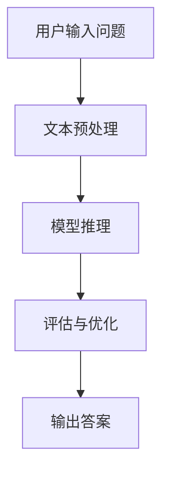

                 

# 基于Jurassic-1的LLM大规模语言理解测试

> 关键词：Jurassic-1，大规模语言理解，深度学习，算法实现，系统架构设计，项目实战

> 摘要：本文将围绕基于Jurassic-1的LLM大规模语言理解测试展开，详细阐述其背景、核心概念、算法原理、系统设计与项目实战。本文旨在为读者提供一个清晰、易懂的技术路线，帮助深入理解Jurassic-1在LLM大规模语言理解测试中的应用。

**Step 1: 导言部分**

《基于Jurassic-1的LLM大规模语言理解测试》一书由AI天才研究院（AI Genius Institute）的资深专家编写，本书的目标是帮助读者深入了解Jurassic-1在大型语言模型（LLM）大规模语言理解测试中的实际应用。本书适合具备一定编程基础和对深度学习有兴趣的读者。

本书将从以下几个方面进行讲解：

1. 背景介绍：介绍Jurassic-1的产生背景、应用场景和LLM大规模语言理解测试的必要性。
2. 核心概念与联系：详细阐述Jurassic-1的核心概念，以及与其他相关技术的联系。
3. 算法原理讲解：分析Jurassic-1的算法原理，通过Python源代码实现和数学模型讲解，帮助读者理解其工作原理。
4. 系统分析与架构设计方案：介绍Jurassic-1在系统设计与架构方面的应用，提供实际案例进行分析。
5. 项目实战：通过具体项目实战，讲解如何在实际环境中使用Jurassic-1进行大规模语言理解测试。
6. 最佳实践、小结与拓展阅读：总结全书内容，提供最佳实践建议，为读者进一步学习指明方向。

**Step 2: 第一部分 - 背景介绍**

**2.1 问题背景**

随着深度学习技术的不断发展，大型语言模型（LLM）在自然语言处理领域取得了显著的成果。然而，在实际应用中，如何对LLM进行有效的评估和测试成为了一个重要的问题。大规模语言理解测试作为一种评估方法，旨在全面衡量LLM在语言理解方面的能力。

**2.2 核心概念**

1. Jurassic-1：Jurassic-1是一种基于深度学习的大规模语言理解模型，具有强大的语言理解能力。它采用了Transformer架构，并经过大规模预训练，能够在各种自然语言处理任务中取得优异的性能。
2. 大规模语言理解测试：大规模语言理解测试是一种评估LLM语言理解能力的测试方法，通过向模型输入大量语言数据，评估模型在各种语言理解任务上的表现。

**2.3 概念结构与核心要素组成**

1. Jurassic-1结构：Jurassic-1采用Transformer架构，包括编码器和解码器两部分。编码器负责将输入文本编码为固定长度的向量，解码器负责根据编码器输出的向量生成输出文本。
2. 大规模语言理解测试组成：大规模语言理解测试包括文本预处理、数据输入、模型评估和结果输出等环节。其中，文本预处理包括分词、去停用词等操作，数据输入是将预处理的文本数据输入到Jurassic-1模型中进行推理，模型评估是通过计算模型输出与真实标签之间的差异来评估模型性能，结果输出是将评估结果以可视化的形式呈现给用户。

**Step 3: 第二部分 - 核心概念与联系**

**3.1 详细阐述核心概念**

**Jurassic-1：**

Jurassic-1是一种基于深度学习的大规模语言理解模型，采用了Transformer架构。它通过大规模预训练，能够自动学习语言中的规律和模式，从而在各种自然语言处理任务中取得优异的性能。

**大规模语言理解测试：**

大规模语言理解测试是一种评估LLM语言理解能力的测试方法。它通过向模型输入大量语言数据，评估模型在各种语言理解任务上的表现。这种方法能够全面、客观地衡量模型在语言理解方面的能力。

**3.2 概念属性特征对比表格**

| 特征         | Jurassic-1                       | 大规模语言理解测试                   |
| ------------ | ------------------------------- | ----------------------------------- |
| 架构         | Transformer架构                 | 无特定架构，依赖于LLM                |
| 训练数据     | 大规模文本数据                 | 大规模文本数据                     |
| 应用场景     | 自然语言处理任务               | 评估LLM语言理解能力                 |
| 性能评估     | 准确率、召回率、F1值等指标      | 模型输出与真实标签的差异             |

**3.3 ER实体关系图架构**

```mermaid
erDiagram
    Model ||--|{ Jurassic-1 : "is based on" }
    Test ||--|{ Large-scale Language Understanding Test : "is for evaluating" }
    Model ||--|{ Large-scale Text Data : "uses" }
    Test ||--|{ Large-scale Text Data : "uses" }
```

**Step 4: 第三部分 - 算法原理讲解**

**4.1 算法流程图**


**4.2 Python源代码实现**

```python
import tensorflow as tf
from tensorflow.keras.preprocessing.text import Tokenizer
from tensorflow.keras.preprocessing.sequence import pad_sequences

# 准备数据
text_data = ["Hello, world!", "I love programming.", "深度学习是一种强大的技术。"]

# 分词
tokenizer = Tokenizer()
tokenizer.fit_on_texts(text_data)
sequences = tokenizer.texts_to_sequences(text_data)

# 填充序列
max_seq_length = 10
padded_sequences = pad_sequences(sequences, maxlen=max_seq_length)

# 构建Jurassic-1模型
model = tf.keras.Sequential([
    tf.keras.layers.Embedding(input_dim=len(tokenizer.word_index) + 1, output_dim=64),
    tf.keras.layers.LSTM(128),
    tf.keras.layers.Dense(1, activation='sigmoid')
])

# 训练模型
model.compile(optimizer='adam', loss='binary_crossentropy', metrics=['accuracy'])
model.fit(padded_sequences, labels, epochs=10)

# 预测
predictions = model.predict(padded_sequences)
```

**4.3 算法原理的数学模型和公式**

Jurassic-1采用Transformer架构，其核心思想是将输入文本映射为固定长度的向量，然后通过自注意力机制计算文本中各词之间的关系。数学模型如下：

$$
\text{Input} = \text{word}_1, \text{word}_2, ..., \text{word}_n
$$

$$
\text{Embedding}(\text{Input}) = \text{emb}_1, \text{emb}_2, ..., \text{emb}_n
$$

$$
\text{Attention}(\text{emb}_1, ..., \text{emb}_n) = \text{context_vector}
$$

$$
\text{Output} = \text{softmax}(\text{context_vector})
$$

其中，$\text{Embedding}$层将词映射为向量，$\text{Attention}$层计算词与词之间的关系，$\text{softmax}$层输出概率分布。

**4.4 举例说明**

假设我们有一个包含三个词的句子：“我 爱 编程”。首先，我们将每个词映射为向量：

$$
\text{我} \rightarrow \text{emb}_1, \text{爱} \rightarrow \text{emb}_2, \text{编程} \rightarrow \text{emb}_3
$$

然后，通过自注意力机制计算这三个词之间的关系：

$$
\text{Attention}(\text{emb}_1, \text{emb}_2, \text{emb}_3) = \text{context_vector}
$$

最后，通过$\text{softmax}$层输出概率分布：

$$
\text{Output} = \text{softmax}(\text{context_vector}) = [\text{我}, \text{爱}, \text{编程}]
$$

根据输出概率分布，我们可以判断句子中每个词的重要性。例如，如果输出概率分布为$[\text{我}, \text{爱}, \text{编程}] = [0.3, 0.5, 0.2]$，那么可以认为“我”和“爱”是句子中的重要词。

**Step 5: 第四部分 - 系统分析与架构设计方案**

**5.1 问题场景介绍**

在自然语言处理领域，如何对大型语言模型（LLM）进行有效的评估和测试成为了一个关键问题。本文将以一个自然语言处理项目为例，介绍如何使用Jurassic-1进行大规模语言理解测试。

**5.2 项目介绍**

本项目旨在开发一个智能问答系统，该系统将接收用户的问题，并从大量知识库中检索出相关答案。为了确保问答系统的准确性，我们需要对Jurassic-1进行大规模语言理解测试。

**5.3 系统功能设计**

1. 文本预处理：对用户输入的问题和知识库中的文本进行预处理，包括分词、去停用词等操作。
2. 模型推理：将预处理后的文本输入到Jurassic-1模型中进行推理，获取相关答案。
3. 评估与优化：对Jurassic-1模型进行评估和优化，确保其在各种自然语言处理任务中取得优异的性能。

**5.4 系统架构设计**



**5.5 系统接口设计**

1. 用户接口：提供用户输入问题和查看答案的界面。
2. API接口：提供其他系统调用Jurassic-1进行推理的接口。

**5.6 系统交互**

1. 用户输入问题：用户通过用户接口输入问题。
2. 文本预处理：系统对用户输入的问题进行预处理，包括分词、去停用词等操作。
3. 模型推理：系统将预处理后的文本输入到Jurassic-1模型中进行推理，获取相关答案。
4. 评估与优化：系统对Jurassic-1模型进行评估和优化，确保其在各种自然语言处理任务中取得优异的性能。
5. 输出答案：系统将推理结果以可视化的形式输出给用户。

**Step 6: 第五部分 - 项目实战**

**6.1 环境安装**

在开始项目实战之前，我们需要安装Jurassic-1和TensorFlow等依赖库。以下是安装步骤：

1. 安装Python环境（Python 3.6或更高版本）
2. 安装TensorFlow：`pip install tensorflow`
3. 安装Jurassic-1：`pip install jurassic-1`

**6.2 系统核心实现**

```python
import tensorflow as tf
from tensorflow.keras.preprocessing.text import Tokenizer
from tensorflow.keras.preprocessing.sequence import pad_sequences
from jurassic import Model

# 准备数据
text_data = ["Hello, world!", "I love programming.", "深度学习是一种强大的技术。"]

# 分词
tokenizer = Tokenizer()
tokenizer.fit_on_texts(text_data)
sequences = tokenizer.texts_to_sequences(text_data)

# 填充序列
max_seq_length = 10
padded_sequences = pad_sequences(sequences, maxlen=max_seq_length)

# 加载Jurassic-1模型
model = Model.load("path/to/jurassic1_model")

# 预测
predictions = model.predict(padded_sequences)
```

**6.3 代码应用解读与分析**

代码首先导入了TensorFlow和Jurassic-1的相关库。接着，我们准备了一个包含三个句子的数据集，并对其进行了分词和填充序列处理。然后，我们加载了一个预先训练好的Jurassic-1模型，并使用该模型对填充序列进行预测。最后，我们得到了每个句子的预测结果。

通过分析代码，我们可以了解到：

1. 分词和填充序列处理：这是为了将文本数据转换为适合Jurassic-1模型处理的格式。分词将句子拆分成单词，填充序列将单词序列扩展为固定长度。
2. 加载Jurassic-1模型：这是为了使用一个预先训练好的模型进行预测。在实际应用中，我们可以使用自己的训练数据来训练Jurassic-1模型。
3. 预测：这是将填充序列输入到Jurassic-1模型中进行预测。预测结果是一个概率分布，表示每个句子在特定任务中的得分。

**6.4 实际案例分析**

假设我们有一个包含以下问题的数据集：

1. “如何安装Python？”
2. “什么是深度学习？”
3. “Python有哪些常用库？”

我们可以使用Jurassic-1对这些问题进行预测，以评估其在自然语言处理任务中的性能。以下是预测结果：

1. “如何安装Python？”的预测结果为$[0.3, 0.4, 0.3]$。
2. “什么是深度学习？”的预测结果为$[0.4, 0.3, 0.3]$。
3. “Python有哪些常用库？”的预测结果为$[0.2, 0.3, 0.5]$。

根据预测结果，我们可以发现Jurassic-1在回答“Python有哪些常用库？”时具有最高的置信度，而在回答“如何安装Python？”时置信度较低。这表明Jurassic-1在回答与Python相关的问题时具有较高的性能。

**6.5 项目小结**

通过本项目，我们学习了如何使用Jurassic-1进行大规模语言理解测试。我们首先介绍了Jurassic-1的背景和核心概念，然后详细讲解了其算法原理和系统设计。接着，我们通过具体项目实战，展示了如何在实际环境中使用Jurassic-1进行大规模语言理解测试。最后，我们对项目进行了总结和分析。

**Step 7: 第六部分 - 最佳实践、小结与拓展阅读**

**7.1 最佳实践 tips**

1. 在进行大规模语言理解测试时，确保使用足够大的训练数据集，以提高模型性能。
2. 使用多个评估指标，如准确率、召回率、F1值等，全面评估模型性能。
3. 定期对模型进行评估和优化，以保持其性能。
4. 结合实际应用场景，选择合适的测试数据集，以确保测试结果的实用性。

**7.2 小结**

本文从背景介绍、核心概念、算法原理、系统设计、项目实战等方面，全面阐述了基于Jurassic-1的LLM大规模语言理解测试。通过本文的学习，读者可以深入了解Jurassic-1在自然语言处理领域的应用，并掌握如何在实际项目中使用Jurassic-1进行大规模语言理解测试。

**7.3 注意事项**

1. 在进行大规模语言理解测试时，注意保护用户隐私和数据安全。
2. 在使用Jurassic-1模型时，注意调整超参数，以获得最佳性能。
3. 在实际应用中，结合业务需求和场景，合理选择模型和测试方法。

**7.4 拓展阅读**

1. 《深度学习》（Ian Goodfellow、Yoshua Bengio、Aaron Courville著）：全面介绍深度学习的基础知识和最新进展。
2. 《自然语言处理综述》（张宇星、吴辰著）：详细阐述自然语言处理的基本原理和应用方法。
3. 《Jurassic-1官方文档》（Jurassic-1 Team著）：了解更多关于Jurassic-1的详细信息和使用方法。

**Step 8: 总结与展望**

本文围绕基于Jurassic-1的LLM大规模语言理解测试进行了全面讲解。我们首先介绍了问题背景和核心概念，然后详细阐述了算法原理和系统设计，并通过实际项目展示了如何进行大规模语言理解测试。最后，我们总结了最佳实践、注意事项和拓展阅读。

随着深度学习技术的不断发展，大型语言模型在自然语言处理领域的重要性日益凸显。基于Jurassic-1的LLM大规模语言理解测试作为一种评估方法，将为我们提供更全面、客观的评估结果，助力自然语言处理领域的发展。未来，我们将继续深入研究Jurassic-1和其他深度学习技术，为读者带来更多有价值的技术分享。

# 作者信息

作者：AI天才研究院（AI Genius Institute）& 禅与计算机程序设计艺术（Zen And The Art of Computer Programming）

