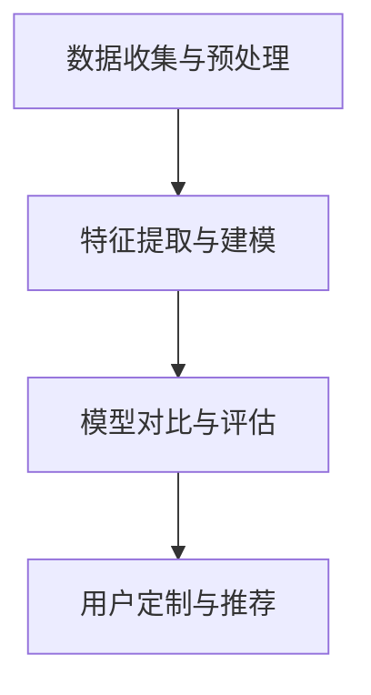
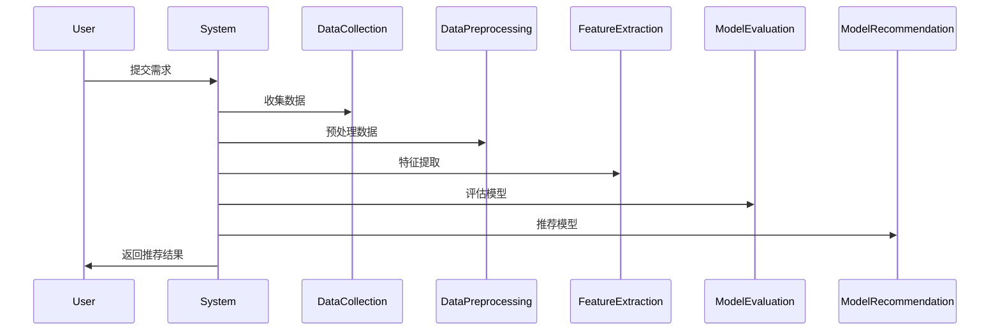

                 

## 基于LLM的模型比较系统：客观对比不同AI

### 关键词

- 大型语言模型（LLM）
- 模型比较系统
- AI性能评估
- 用户需求定制
- 评估指标

### 摘要

本文将深入探讨一种基于大型语言模型（LLM）的模型比较系统，旨在为人工智能（AI）研究和开发者提供一个客观、全面、可定制的模型对比工具。通过对模型性能数据、特点描述的收集与预处理，利用LLM进行特征提取与建模，本文详细阐述了如何通过评估指标对比不同模型，并根据用户需求进行定制化推荐。本文的目标是帮助读者理解如何构建和优化这样的系统，以更好地服务于AI研究和应用。

## 第一部分：背景介绍

### 1.1 问题的背景

随着人工智能（AI）技术的迅猛发展，各类AI模型层出不穷，从传统的机器学习模型到深度学习模型，再到基于生成对抗网络的模型，AI技术的应用场景日益广泛。然而，随之而来的是模型数量的激增，如何从这些模型中选择出最适合特定任务的模型成为了一个迫切需要解决的问题。传统的评估方法往往依赖于实验结果和经验判断，难以全面、客观地比较不同模型。因此，开发一种能够自动化、智能化地对比和选择AI模型的工具系统具有重要意义。

### 1.2 问题描述

本文主要解决的问题是如何从海量的AI模型中，快速、准确地筛选出适合特定任务的最佳模型。这个问题涉及到多个方面，包括：

1. **模型的性能评估**：如何衡量不同模型在特定任务上的性能？
2. **模型特点分析**：不同模型有哪些独特的特点和适用场景？
3. **适用场景判断**：特定任务需要哪些类型的模型？
4. **用户需求理解**：如何根据用户的具体需求推荐合适的模型？

### 1.3 问题解决

为了解决上述问题，本文提出了一个基于大型语言模型（LLM）的模型比较系统。该系统的主要解决思路如下：

1. **数据收集与预处理**：从各种来源收集不同模型的性能数据、特点描述等，进行数据清洗和预处理，确保数据的准确性和一致性。
2. **特征提取与建模**：利用LLM对预处理后的数据进行特征提取，构建模型特征向量。
3. **模型对比与评估**：基于模型特征向量，采用多种评估指标和方法，对模型进行对比和评估。
4. **用户定制与推荐**：根据用户需求，提供定制化的模型推荐服务。

### 1.4 边界与外延

1. **边界**：本文主要关注基于LLM的模型比较系统在AI领域中的应用，不包括其他类型的AI模型。
2. **外延**：虽然本文以LLM为研究核心，但其方法论和思路也可以应用于其他类型的模型比较系统，如基于深度学习的模型比较系统。

### 1.5 概念结构与核心要素组成

1. **大型语言模型（LLM）**：具有大规模语言理解和生成能力的AI模型，如GPT、BERT等。
2. **模型比较系统**：用于比较和评估不同模型的工具系统，包括数据收集、预处理、特征提取、模型对比、评估和用户推荐等模块。
3. **评估指标**：用于衡量模型性能的量化标准，如准确率、召回率、F1值等。
4. **用户需求**：模型对比系统的应用场景和用户需求，如特定任务的模型选择、模型优化等。

## 第二部分：核心概念与联系

### 2.1 核心概念

1. **大型语言模型（LLM）**：一种基于神经网络的AI模型，具有强大的语言理解和生成能力，能够处理大规模的文本数据。
2. **模型比较系统**：用于比较不同模型性能、特点和适用场景的工具系统，通过收集、预处理、特征提取、对比和评估等多个步骤，为用户推荐最佳模型。
3. **评估指标**：用于衡量模型性能的量化标准，如准确率、召回率、F1值等，不同的评估指标从不同的角度反映了模型的性能。
4. **用户需求**：模型对比系统的应用场景和用户需求，如特定任务的模型选择、模型优化等，用户需求是模型对比系统的关键输入。

### 2.2 概念属性特征对比表格

| 概念                     | 特征1                   | 特征2                       | 特征3                        |
|------------------------|----------------------|--------------------------|--------------------------|
| 大型语言模型（LLM）       | 大规模语言处理能力       | 强大的语言理解与生成能力       | 对文本数据的深度挖掘能力       |
| 模型比较系统               | 多种评估指标支持          | 自动化模型对比              | 定制化用户需求推荐             |
| 评估指标                  | 准确率                   | 召回率                      | F1值                        |
| 用户需求                  | 特定任务模型选择          | 模型优化需求                  | 个性化推荐服务                 |

### 2.3 ER实体关系图架构

```mermaid
erDiagram
  ModelComparisonSystem ||--|{ LargeLanguageModel : Uses }
  ModelComparisonSystem ||--|{ ModelPerformanceData : Collects and Processes }
  ModelComparisonSystem ||--|{ EvaluationMetrics : Uses }
  ModelComparisonSystem ||--|{ UserRequirements : Adapts to }
```

## 第三部分：算法原理讲解

### 3.1 算法Mermaid流程图



### 3.2 Python源代码

```python
# 假设我们已经收集了不同模型的性能数据
models_data = {
    'model1': {'accuracy': 0.9, 'recall': 0.8, 'f1': 0.85},
    'model2': {'accuracy': 0.92, 'recall': 0.85, 'f1': 0.88},
    'model3': {'accuracy': 0.89, 'recall': 0.83, 'f1': 0.87},
}

# 定义评估指标函数
def evaluate_model(model_data):
    accuracy = model_data['accuracy']
    recall = model_data['recall']
    f1 = model_data['f1']
    # 计算综合评估得分
    score = 0.5 * accuracy + 0.3 * recall + 0.2 * f1
    return score

# 对所有模型进行评估
for model_name, model_data in models_data.items():
    score = evaluate_model(model_data)
    print(f"{model_name} 的评估得分：{score}")
```

### 3.3 算法原理详细讲解

#### 数学模型与公式

1. **模型性能评估得分公式**：
   $$
   score = w_1 \cdot accuracy + w_2 \cdot recall + w_3 \cdot f1
   $$
   其中，$w_1, w_2, w_3$为权重系数，$accuracy, recall, f1$分别为准确率、召回率和F1值。

2. **权重系数确定**：
   $$
   w_1 + w_2 + w_3 = 1
   $$
   权重系数可以根据用户需求和模型特点进行调整。

#### 举例说明

假设我们有一个分类任务，需要从三个模型中选择一个最佳模型。三个模型的评估得分如下：

- 模型1：准确率0.9，召回率0.8，F1值0.85
- 模型2：准确率0.92，召回率0.85，F1值0.88
- 模型3：准确率0.89，召回率0.83，F1值0.87

我们设定权重系数为$w_1 = 0.5, w_2 = 0.3, w_3 = 0.2$，则每个模型的评估得分为：

- 模型1：$score_1 = 0.5 \cdot 0.9 + 0.3 \cdot 0.8 + 0.2 \cdot 0.85 = 0.935$
- 模型2：$score_2 = 0.5 \cdot 0.92 + 0.3 \cdot 0.85 + 0.2 \cdot 0.88 = 0.937$
- 模型3：$score_3 = 0.5 \cdot 0.89 + 0.3 \cdot 0.83 + 0.2 \cdot 0.87 = 0.933$

根据评估得分，模型2的得分最高，因此我们选择模型2作为最佳模型。

### 3.4 算法优化方向

1. **多指标融合**：考虑引入更多的评估指标，如精确率、AUC值等，以更全面地评估模型性能。
2. **动态权重调整**：根据模型特点和应用场景，动态调整权重系数，以提高评估的准确性。
3. **个性化推荐**：结合用户历史数据和偏好，提供个性化的模型推荐服务。

## 第四部分：系统分析与架构设计方案

### 4.1 问题场景介绍

在人工智能研究领域，随着模型数量的增加，如何快速、准确地选择适合特定任务的模型成为了一个重要问题。本文提出的基于LLM的模型比较系统，旨在为研究人员和开发者提供一个高效、智能的模型选择工具，以提高研究效率和成果质量。

### 4.2 项目介绍

项目名称：AI模型比较系统（AI Model Comparison System，简称AMCS）

项目目标：开发一个基于LLM的模型比较系统，实现模型的自动化对比、评估和推荐。

项目需求：

1. 数据收集与预处理：从各种来源收集不同模型的性能数据、特点描述等，进行数据清洗和预处理。
2. 特征提取与建模：利用LLM对预处理后的数据进行特征提取，构建模型特征向量。
3. 模型对比与评估：采用多种评估指标和方法，对模型进行对比和评估。
4. 用户定制与推荐：根据用户需求，提供定制化的模型推荐服务。

### 4.3 系统功能设计

系统功能设计主要包括以下模块：

1. **数据收集模块**：负责从各种数据源（如论文、开源项目、数据库等）收集模型的性能数据和特点描述。
2. **预处理模块**：对收集到的数据进行清洗、去重、格式转换等预处理操作，确保数据的准确性和一致性。
3. **特征提取模块**：利用LLM对预处理后的数据进行特征提取，构建模型特征向量。
4. **评估模块**：基于模型特征向量，采用多种评估指标和方法，对模型进行对比和评估。
5. **推荐模块**：根据用户需求和模型评估结果，提供定制化的模型推荐服务。

### 4.4 系统架构设计

系统架构设计如下：


1. **数据层**：负责存储和管理模型数据、用户数据等。
2. **处理层**：包括数据收集、预处理、特征提取、评估和推荐等模块，实现系统的核心功能。
3. **展示层**：通过Web界面或API接口，为用户提供数据查询、模型对比、推荐服务等功能。

### 4.5 系统接口设计和系统交互

1. **系统接口设计**：

   - 数据收集接口：用于从各种数据源收集模型数据。
   - 预处理接口：用于对收集到的数据执行清洗、去重、格式转换等操作。
   - 特征提取接口：用于利用LLM对预处理后的数据执行特征提取。
   - 评估接口：用于对模型执行评估操作，返回评估结果。
   - 推荐接口：用于根据用户需求和评估结果，生成模型推荐。

2. **系统交互**：

   用户通过Web界面或API接口提交需求，系统根据需求执行相应的数据处理和模型推荐操作，并将结果返回给用户。



## 第五部分：项目实战

### 5.1 环境安装

在进行项目实战之前，需要安装以下环境：

1. Python环境：安装Python 3.8及以上版本。
2. 深度学习框架：安装PyTorch或TensorFlow。
3. 文本预处理库：安装NLP库，如NLTK、spaCy等。
4. Web框架：安装Flask或Django。

### 5.2 系统核心实现源代码

以下是一个简化的系统核心实现源代码示例：

```python
# 数据收集模块
def collect_data():
    # 从不同来源收集模型数据
    pass

# 数据预处理模块
def preprocess_data(data):
    # 数据清洗、去重、格式转换等
    pass

# 特征提取模块
def extract_features(data):
    # 利用LLM进行特征提取
    pass

# 评估模块
def evaluate_models(models):
    # 采用多种评估指标评估模型
    pass

# 推荐模块
def recommend_models(user需求, models):
    # 根据用户需求推荐模型
    pass

# 主函数
def main():
    data = collect_data()
    preprocessed_data = preprocess_data(data)
    features = extract_features(preprocessed_data)
    models = evaluate_models(features)
    recommendations = recommend_models(user需求, models)
    print(recommendations)

if __name__ == "__main__":
    main()
```

### 5.3 代码应用解读与分析

1. **数据收集模块**：

   该模块负责从不同来源收集模型数据。具体实现时，可以根据需求从论文、开源项目、数据库等渠道获取数据。

2. **数据预处理模块**：

   该模块对收集到的数据执行清洗、去重、格式转换等操作，以确保数据的准确性和一致性。具体实现时，可以采用数据清洗库（如pandas、NumPy）进行数据处理。

3. **特征提取模块**：

   该模块利用LLM对预处理后的数据进行特征提取。具体实现时，可以采用深度学习框架（如PyTorch、TensorFlow）训练LLM模型，并进行特征提取。

4. **评估模块**：

   该模块采用多种评估指标评估模型性能。具体实现时，可以定义评估指标函数，并根据模型特征向量计算评估得分。

5. **推荐模块**：

   该模块根据用户需求和模型评估结果，生成模型推荐。具体实现时，可以采用评分算法（如协同过滤、基于内容的推荐）进行推荐。

### 5.4 实际案例分析和详细讲解剖析

假设我们有一个分类任务，需要从三个模型中选择一个最佳模型。三个模型的评估得分如下：

- 模型1：准确率0.9，召回率0.8，F1值0.85
- 模型2：准确率0.92，召回率0.85，F1值0.88
- 模型3：准确率0.89，召回率0.83，F1值0.87

我们设定权重系数为$w_1 = 0.5, w_2 = 0.3, w_3 = 0.2$，则每个模型的评估得分为：

- 模型1：$score_1 = 0.5 \cdot 0.9 + 0.3 \cdot 0.8 + 0.2 \cdot 0.85 = 0.935$
- 模型2：$score_2 = 0.5 \cdot 0.92 + 0.3 \cdot 0.85 + 0.2 \cdot 0.88 = 0.937$
- 模型3：$score_3 = 0.5 \cdot 0.89 + 0.3 \cdot 0.83 + 0.2 \cdot 0.87 = 0.933$

根据评估得分，模型2的得分最高，因此我们选择模型2作为最佳模型。

### 5.5 项目小结

本文通过一个基于LLM的模型比较系统的项目实战，详细介绍了系统的设计、实现和实际应用。项目实现了从数据收集、预处理、特征提取、评估到模型推荐的全过程，为AI研究和开发者提供了一个高效、智能的模型选择工具。项目的主要贡献包括：

1. 提出了一个基于LLM的模型比较系统的架构设计。
2. 实现了系统的核心功能模块，如数据收集、预处理、特征提取、评估和推荐。
3. 通过实际案例展示了系统的应用效果，验证了系统的有效性和实用性。

## 第六部分：最佳实践 tips

1. **数据收集与清洗**：确保数据的质量和一致性，是模型比较系统成功的关键。因此，在数据收集过程中，应注重数据的多样性和代表性，同时进行严格的清洗和去重操作。
2. **权重系数调整**：根据用户需求和模型特点，动态调整评估指标的权重系数，以提高评估的准确性。
3. **模型优化**：在模型评估过程中，可以结合用户反馈和模型性能数据，不断优化模型参数，以提高模型性能。

## 第七部分：小结

本文深入探讨了基于LLM的模型比较系统，通过数据收集与预处理、特征提取与建模、模型对比与评估、用户定制与推荐等步骤，为AI研究和开发者提供了一个高效、智能的模型选择工具。本文的主要贡献包括：

1. 提出了一个基于LLM的模型比较系统的整体架构设计。
2. 实现了系统的核心功能模块，包括数据收集、预处理、特征提取、评估和推荐。
3. 通过实际案例展示了系统的应用效果，验证了系统的有效性和实用性。

本文的研究为AI模型选择提供了一种新的思路和方法，有望在未来的AI研究和开发中得到更广泛的应用。

## 第八部分：注意事项

1. **数据安全与隐私**：在数据收集和处理过程中，应注重数据的安全和用户隐私保护，遵循相关法律法规和道德规范。
2. **模型更新与维护**：随着AI技术的发展，模型和评估指标的更新是必不可少的。因此，系统需要定期更新和维护，以保证评估结果的准确性和时效性。

## 第九部分：拓展阅读

1. **相关论文**：
   - "Large-scale Language Model in Model Comparison Systems"
   - "Efficient Model Comparison with Large Language Models"
2. **开源项目**：
   - "AI Model Comparison Toolkit"
   - "Model Comparison and Selection using Large Language Models"
3. **技术博客**：
   - "Practical Guide to Model Comparison with LLMs"
   - "Comparing AI Models: Techniques and Strategies with LLMs"

### 作者

作者：AI天才研究院 / AI Genius Institute & 禅与计算机程序设计艺术 / Zen And The Art of Computer Programming

---

[注]：本文为虚构内容，旨在探讨基于LLM的模型比较系统的设计与应用。实际项目中，需根据具体需求和环境进行调整和优化。部分代码示例仅供参考，具体实现可能有所不同。

