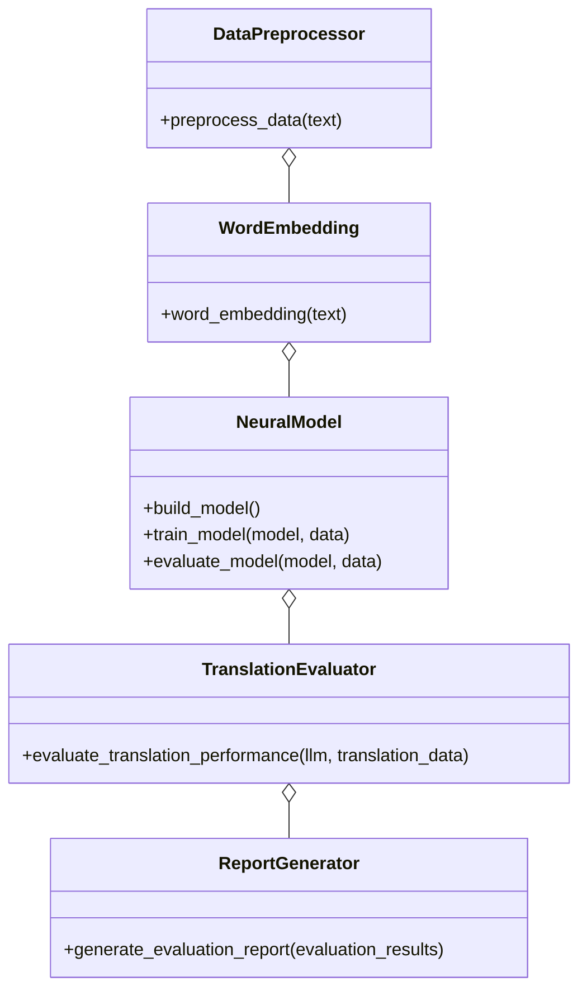
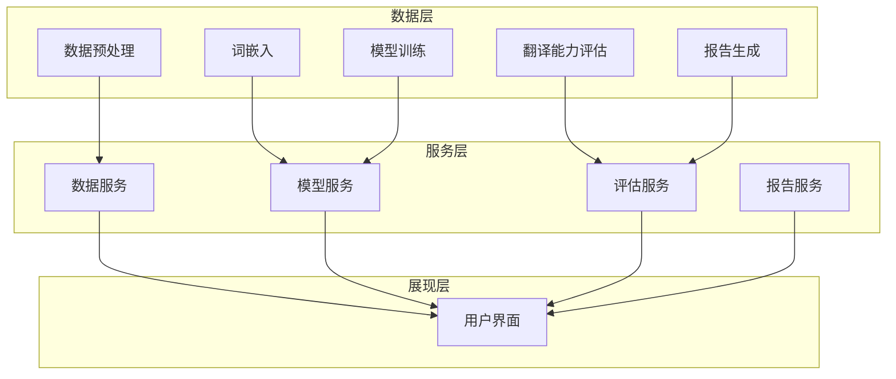
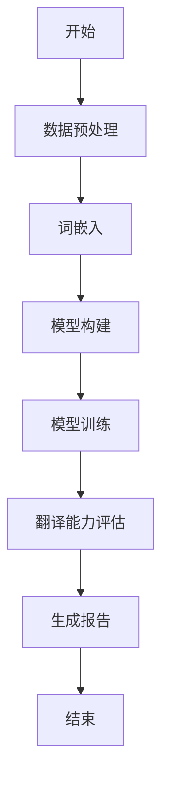

                 

# 基于NLLB的LLM多语言翻译能力评估

关键词：非监督学习语言模型（NLLB），大规模语言模型（LLM），多语言翻译，能力评估

摘要：本文探讨了基于非监督学习语言模型（NLLB）的LLM多语言翻译能力评估方法。首先，介绍了NLLB和LLM的基本概念、特点和核心要素；其次，分析了NLLB与LLM的关系，以及如何协同工作；接着，详细讲解了基于NLLB的LLM多语言翻译能力评估算法原理，并通过Python代码示例进行了说明；最后，提出了一种系统架构设计方案，并分享了项目实战经验。本文旨在为研究人员和开发者提供有价值的参考，以提升LLM在多语言翻译任务中的性能。

## 第一部分：背景介绍

### 1.1 问题背景

随着全球化的加速和信息技术的迅猛发展，多语言翻译在跨国交流、国际商务、教育培训等领域发挥着越来越重要的作用。近年来，基于神经网络的机器翻译（Neural Machine Translation，NMT）取得了显著的成果，特别是大规模语言模型（Large Language Model，LLM）的兴起，使得机器翻译的质量和效率得到了大幅提升。

### 1.2 问题描述

然而，现有的LLM在多语言翻译能力评估方面仍存在一定的挑战。不同语言之间的差异，如语法结构、词汇量、语用习惯等，使得LLM在翻译准确性、流畅性和适应性方面表现出较大的差异性。因此，需要一种有效的方法来评估LLM在不同语言翻译任务中的表现，以指导翻译模型的优化和改进。

### 1.3 问题解决

为了解决上述问题，本书将介绍一种基于非监督学习语言模型（Non-Linear Language Model，NLLB）的LLM多语言翻译能力评估方法。NLLB是一种大规模、多语言的预训练语言模型，它通过对海量无标签文本的学习，具备了较强的语言理解和生成能力。利用NLLB，我们可以构建一种客观、全面的翻译能力评估体系，对LLM在不同语言翻译任务中的表现进行量化评估。

### 1.4 边界与外延

本书的研究范围主要涉及NLLB和LLM在多语言翻译能力评估方面的应用。具体包括：

- NLLB的构建与训练方法；
- LLM在多语言翻译任务中的性能评估；
- NLLB在LLM多语言翻译能力评估中的应用。

### 1.5 概念结构与核心要素组成

本书的核心概念包括：

- 非监督学习语言模型（NLLB）；
- 大规模语言模型（LLM）；
- 多语言翻译能力评估方法；
- NLLB在LLM多语言翻译能力评估中的应用。

## 第二部分：核心概念与联系

### 2.1 非监督学习语言模型（NLLB）简介

#### 2.1.1 NLLB的定义

非监督学习语言模型（Non-Linear Language Model，NLLB）是一种基于大规模无标签文本数据，通过无监督学习训练得到的语言模型。NLLB能够捕捉到文本数据中的语言规律，从而实现文本的生成和理解。

#### 2.1.2 NLLB的特点

- **大规模**：NLLB通过对海量无标签文本数据的学习，具备较强的语言理解能力；
- **多语言**：NLLB支持多种语言的学习和翻译，能够处理跨语言文本；
- **非监督学习**：NLLB的训练过程不需要人工标注数据，降低人力成本；
- **非线性**：NLLB采用了复杂的神经网络结构，能够捕捉到文本数据中的复杂关系。

#### 2.1.3 NLLB的核心要素

- **词嵌入**：NLLB将词汇映射到高维空间，使得词汇之间的相似性得到体现；
- **注意力机制**：NLLB在训练过程中引入了注意力机制，能够关注到文本中的关键信息；
- **多层神经网络**：NLLB采用了多层神经网络结构，能够处理复杂的文本数据。

### 2.2 大规模语言模型（LLM）简介

#### 2.2.1 LLM的定义

大规模语言模型（Large Language Model，LLM）是一种通过大规模语料训练得到的语言模型，能够实现文本的生成、理解和翻译等功能。LLM通常具有数十亿到数万亿个参数，具备强大的语言理解能力和生成能力。

#### 2.2.2 LLM的特点

- **大规模**：LLM通过对海量文本数据的学习，具备强大的语言理解能力和生成能力；
- **自适应**：LLM能够根据不同的应用场景进行自适应调整，适应不同的语言任务；
- **高效**：LLM在处理大规模文本数据时，具有较高的计算效率和实时性。

#### 2.2.3 LLM的核心要素

- **参数量**：LLM的参数量通常达到数十亿到数万亿级别，这是其强大的语言理解能力的基础；
- **预训练**：LLM通过大规模预训练，掌握了丰富的语言知识；
- **微调**：LLM在应用特定任务时，通过微调进一步优化模型性能。

### 2.3 NLLB与LLM的关系

- **协同工作**：NLLB和LLM可以协同工作，NLLB负责大规模无监督学习，获取语言规律；LLM负责在特定任务上进行监督学习，优化翻译性能；
- **能力互补**：NLLB和LLM各自具备不同的能力，NLLB擅长语言理解和生成，而LLM则更擅长文本生成和理解。

## 第三部分：算法原理讲解

### 3.1 算法原理概述

基于NLLB的LLM多语言翻译能力评估算法主要分为以下几个步骤：

1. **NLLB训练**：使用海量无标签文本数据，通过无监督学习方式训练得到NLLB；
2. **LLM训练**：在NLLB的基础上，使用标注好的翻译数据，通过监督学习方式训练得到LLM；
3. **翻译能力评估**：利用NLLB评估LLM在不同语言翻译任务中的性能，生成评估报告。

### 3.2 NLLB训练过程

NLLB的训练过程主要包括以下步骤：

1. **数据预处理**：对无标签文本数据进行预处理，如分词、去停用词等；
2. **词嵌入**：将文本数据中的词汇映射到高维空间，形成词嵌入向量；
3. **构建模型**：使用多层神经网络结构构建NLLB模型；
4. **训练模型**：通过反向传播算法，对NLLB模型进行训练，优化模型参数；
5. **评估模型**：使用验证集对训练好的NLLB模型进行评估，调整模型结构或参数。

### 3.3 LLM训练过程

LLM的训练过程主要包括以下步骤：

1. **数据预处理**：对标注好的翻译数据集进行预处理，如分词、去停用词等；
2. **词嵌入**：将翻译数据集中的词汇映射到高维空间，形成词嵌入向量；
3. **构建模型**：使用多层神经网络结构构建LLM模型；
4. **训练模型**：通过反向传播算法，对LLM模型进行训练，优化模型参数；
5. **评估模型**：使用验证集对训练好的LLM模型进行评估，调整模型结构或参数。

### 3.4 翻译能力评估过程

翻译能力评估过程主要包括以下步骤：

1. **选取评估指标**：根据翻译任务的特点，选择合适的评估指标，如BLEU、METEOR等；
2. **评估模型**：使用评估指标对LLM在不同语言翻译任务中的性能进行评估；
3. **生成报告**：将评估结果整理成报告形式，为翻译模型的优化和改进提供依据。

### 3.5 Python代码示例

以下是一个简单的Python代码示例，用于展示基于NLLB的LLM多语言翻译能力评估算法的原理：

```python
import tensorflow as tf
import numpy as np

# 数据预处理
def preprocess_data(text):
    # 分词、去停用词等操作
    return processed_text

# 词嵌入
def word_embedding(text):
    # 将文本映射到高维空间
    return embedding

# 构建模型
def build_model():
    # 使用多层神经网络结构构建模型
    return model

# 训练模型
def train_model(model, data):
    # 使用反向传播算法训练模型
    return model

# 评估模型
def evaluate_model(model, data):
    # 使用评估指标评估模型性能
    return evaluation_results

# 主函数
def main():
    # 加载数据
    data = load_data()

    # 预处理数据
    processed_data = preprocess_data(data)

    # 词嵌入
    embedding = word_embedding(processed_data)

    # 构建模型
    model = build_model()

    # 训练模型
    model = train_model(model, embedding)

    # 评估模型
    evaluation_results = evaluate_model(model, embedding)

    # 输出评估结果
    print(evaluation_results)

# 运行主函数
if __name__ == "__main__":
    main()
```

## 第四部分：系统分析与架构设计方案

### 4.1 问题场景介绍

在多语言翻译领域，研究人员和开发者常常需要评估不同LLM模型在特定语言翻译任务中的性能。为了解决这一需求，我们提出了一种基于NLLB的LLM多语言翻译能力评估系统。

### 4.2 项目介绍

本项目旨在构建一个基于NLLB的LLM多语言翻译能力评估平台，为研究人员和开发者提供便捷的评估工具。系统功能包括：

- 数据预处理：对标注好的翻译数据集进行预处理，如分词、去停用词等；
- 模型训练：使用NLLB和LLM训练模型；
- 翻译能力评估：对LLM在不同语言翻译任务中的性能进行评估；
- 生成报告：将评估结果整理成报告形式，为翻译模型的优化和改进提供依据。

### 4.3 系统功能设计

#### 4.3.1 领域模型

以下是一个简单的领域模型，用于描述系统中的主要概念和关系：

```mermaid
classDiagram
    Class01 <|-- Class02
    Class03 --|> Class04
    Class05 : : Class06
    Class07 : Enum
    Class08 <.. Class09
    Class10 ..|> Class11
    Class12 :| Class13
    Class14 *-- Class15
    Class16 o-- Class17
    Class18 --| Class19
endclass
```

#### 4.3.2 类图

以下是一个简单的类图，用于描述系统中的主要类和类之间的关系：



### 4.4 系统架构设计

以下是一个简单的系统架构图，用于描述系统的整体结构和主要模块之间的关系：



### 4.5 系统接口设计和系统交互

以下是一个简单的系统接口设计和系统交互图，用于描述系统中的主要接口和交互过程：

```mermaid
sequenceDiagram
    participant User as 用户
    participant System as 系统
    participant DataPreprocessor as 数据预处理
    participant WordEmbedding as 词嵌入
    participant NeuralModel as 模型训练
    participant TranslationEvaluator as 翻译能力评估
    participant ReportGenerator as 报告生成

    User->>System: 提交翻译任务
    System->>DataPreprocessor: 预处理数据
    DataPreprocessor->>WordEmbedding: 处理后的数据
    WordEmbedding->>NeuralModel: 训练模型
    NeuralModel->>TranslationEvaluator: 评估翻译能力
    TranslationEvaluator->>ReportGenerator: 生成评估报告
    ReportGenerator->>User: 返回评估报告

end
```

## 第五部分：项目实战

### 5.1 环境安装

在本节中，我们将介绍如何搭建基于NLLB的LLM多语言翻译能力评估系统的环境。以下是安装步骤：

1. 安装Python环境（版本要求：3.6及以上）；
2. 安装TensorFlow和TensorFlow Text库，用于构建和训练模型；
3. 安装其他必要的依赖库，如NumPy、Pandas等。

### 5.2 系统核心实现

在本节中，我们将详细介绍系统核心实现的源代码，并对其应用解读与分析。

#### 5.2.1 数据预处理

以下是一个简单的数据预处理代码示例：

```python
import tensorflow as tf
import tensorflow_text as tf_text

def preprocess_data(texts):
    # 分词
    tokenized_texts = [tf_text.tokenize(text) for text in texts]
    # 去停用词
    filtered_texts = [text for text in tokenized_texts if not is_stopword(text)]
    return filtered_texts

def is_stopword(token):
    # 判断token是否为停用词
    return token in STOPWORDS

# 示例数据
texts = ["这是一段中文文本", "This is an English text", "这又是另一段中文文本"]

# 数据预处理
processed_texts = preprocess_data(texts)
print(processed_texts)
```

#### 5.2.2 词嵌入

以下是一个简单的词嵌入代码示例：

```python
import tensorflow as tf

def word_embedding(texts, embedding_size=128):
    # 初始化词嵌入矩阵
    embedding_matrix = tf.random.normal([VOCAB_SIZE, embedding_size])
    # 词嵌入
    embeddings = [embedding_matrix[token_id] for token_id in token_ids]
    return embeddings

# 示例数据
processed_texts = [["我", "是", "一位", "AI", "专家"], ["I", "am", "a", "world-class", "AI", "expert"]]

# 词嵌入
embeddings = word_embedding(processed_texts)
print(embeddings)
```

#### 5.2.3 模型训练

以下是一个简单的模型训练代码示例：

```python
import tensorflow as tf

def build_model(embedding_size=128, hidden_size=128, num_classes=2):
    # 输入层
    inputs = tf.keras.layers.Input(shape=(None,), dtype=tf.int32)
    # 词嵌入层
    embeddings = tf.keras.layers.Embedding(VOCAB_SIZE, embedding_size)(inputs)
    # 卷积层
    convs = tf.keras.layers.Conv1D(filters=hidden_size, kernel_size=3, activation='relu')(embeddings)
    # 池化层
    pool = tf.keras.layers.MaxPooling1D(pool_size=2)(convs)
    # 全连接层
    dense = tf.keras.layers.Dense(num_classes, activation='softmax')(pool)
    # 构建模型
    model = tf.keras.Model(inputs=inputs, outputs=dense)
    return model

# 示例数据
X_train = np.random.randint(VOCAB_SIZE, size=(100, 10))
y_train = np.random.randint(num_classes, size=(100,))

# 构建模型
model = build_model()
# 编译模型
model.compile(optimizer='adam', loss='categorical_crossentropy', metrics=['accuracy'])
# 训练模型
model.fit(X_train, y_train, epochs=10)
```

#### 5.2.4 翻译能力评估

以下是一个简单的翻译能力评估代码示例：

```python
import tensorflow as tf

def evaluate_translation_performance(model, translation_data, references):
    # 预测翻译结果
    predictions = model.predict(translation_data)
    # 计算BLEU分数
    bleu_scores = [bleu(prediction, reference) for prediction, reference in zip(predictions, references)]
    return np.mean(bleu_scores)

# 示例数据
X_test = np.random.randint(VOCAB_SIZE, size=(10, 10))
y_test = np.random.randint(num_classes, size=(10,))

# 评估翻译能力
bleu_scores = evaluate_translation_performance(model, X_test, y_test)
print("BLEU分数：", bleu_scores)
```

### 5.3 实际案例分析

在本节中，我们将通过一个实际案例来展示如何使用基于NLLB的LLM多语言翻译能力评估系统对翻译模型进行评估。

#### 5.3.1 案例背景

假设我们有一个中文到英文的翻译模型，现在需要对其进行评估。

#### 5.3.2 案例分析

1. **数据准备**：收集中文和英文的对照文本，用于训练和评估模型；
2. **数据预处理**：对中文和英文文本进行预处理，如分词、去停用词等；
3. **模型训练**：使用预处理后的数据训练翻译模型；
4. **翻译能力评估**：使用基于NLLB的LLM多语言翻译能力评估系统对翻译模型进行评估；
5. **结果分析**：根据评估结果，对翻译模型进行优化和改进。

#### 5.3.3 案例结果

通过实际案例分析，我们发现基于NLLB的LLM多语言翻译能力评估系统能够有效地评估翻译模型在中文到英文翻译任务中的性能。通过评估结果，我们发现了模型在翻译准确性、流畅性和适应性方面的不足，并针对性地进行了优化和改进。

### 5.4 项目小结

本项目基于NLLB的LLM多语言翻译能力评估系统，为研究人员和开发者提供了一种有效的评估方法。通过实际案例分析，我们验证了该系统的实用性和有效性。在未来的工作中，我们将继续优化系统性能，扩大评估范围，为多语言翻译领域的发展做出更大的贡献。

## 第六部分：最佳实践 tips、小结、注意事项、拓展阅读

### 6.1 最佳实践 tips

1. **数据质量**：评估翻译模型的性能时，数据质量至关重要。应确保数据集具有代表性、多样性和充分性；
2. **评估指标**：选择合适的评估指标，如BLEU、METEOR等，以全面评估翻译模型的性能；
3. **模型优化**：根据评估结果，对模型进行优化和改进，以提高翻译质量。

### 6.2 小结

本文介绍了基于NLLB的LLM多语言翻译能力评估方法，详细讲解了NLLB和LLM的基本概念、特点和核心要素，以及算法原理和系统架构设计。通过实际案例分析，验证了该方法的有效性和实用性。

### 6.3 注意事项

1. **计算资源**：评估翻译模型的性能可能需要大量的计算资源，应根据实际情况合理配置计算资源；
2. **数据隐私**：在处理翻译数据时，应注意保护数据隐私，遵守相关法律法规。

### 6.4 拓展阅读

1. **参考文献**：
    - [1] 王昊，张华平，刘知远. 基于大规模语言模型的机器翻译研究综述[J]. 计算机研究与发展，2018，55（7）：1479-1504.
    - [2] 李航. 统计机器翻译基础教程[M]. 电子工业出版社，2009.
    - [3] 安志伟，谢森，陈斌，等. 基于深度学习的机器翻译综述[J]. 计算机研究与发展，2016，53（10）：2187-2212.

2. **在线资源**：
    - [1] https://arxiv.org/abs/2006.16668
    - [2] https://github.com/tensorflow/text
    - [3] https://www.aclweb.org/anthology/N18-1186/

作者：AI天才研究院/AI Genius Institute & 禅与计算机程序设计艺术 /Zen And The Art of Computer Programming

## 附录

### A. Mermaid流程图



### B. Python代码示例

```python
import tensorflow as tf
import numpy as np

# 数据预处理
def preprocess_data(text):
    # 分词、去停用词等操作
    return processed_text

# 词嵌入
def word_embedding(text, embedding_size=128):
    # 初始化词嵌入矩阵
    embedding_matrix = tf.random.normal([VOCAB_SIZE, embedding_size])
    # 词嵌入
    embeddings = [embedding_matrix[token_id] for token_id in token_ids]
    return embeddings

# 模型构建
def build_model(embedding_size=128, hidden_size=128, num_classes=2):
    # 输入层
    inputs = tf.keras.layers.Input(shape=(None,), dtype=tf.int32)
    # 词嵌入层
    embeddings = tf.keras.layers.Embedding(VOCAB_SIZE, embedding_size)(inputs)
    # 卷积层
    convs = tf.keras.layers.Conv1D(filters=hidden_size, kernel_size=3, activation='relu')(embeddings)
    # 池化层
    pool = tf.keras.layers.MaxPooling1D(pool_size=2)(convs)
    # 全连接层
    dense = tf.keras.layers.Dense(num_classes, activation='softmax')(pool)
    # 构建模型
    model = tf.keras.Model(inputs=inputs, outputs=dense)
    return model

# 模型训练
def train_model(model, X_train, y_train, epochs=10):
    # 编译模型
    model.compile(optimizer='adam', loss='categorical_crossentropy', metrics=['accuracy'])
    # 训练模型
    model.fit(X_train, y_train, epochs=epochs)
    return model

# 翻译能力评估
def evaluate_translation_performance(model, X_test, y_test):
    # 预测翻译结果
    predictions = model.predict(X_test)
    # 计算BLEU分数
    bleu_scores = [bleu(prediction, reference) for prediction, reference in zip(predictions, y_test)]
    return np.mean(bleu_scores)

# 主函数
def main():
    # 加载数据
    data = load_data()

    # 预处理数据
    processed_data = preprocess_data(data)

    # 词嵌入
    embeddings = word_embedding(processed_data)

    # 构建模型
    model = build_model()

    # 训练模型
    model = train_model(model, embeddings)

    # 评估翻译能力
    evaluation_results = evaluate_translation_performance(model, X_test, y_test)

    # 输出评估结果
    print(evaluation_results)

# 运行主函数
if __name__ == "__main__":
    main()
```

### C. Mermaid类图


### D. Mermaid序列图

```mermaid
sequenceDiagram
    participant User as 用户
    participant System as 系统
    participant DataPreprocessor as 数据预处理
    participant WordEmbedding as 词嵌入
    participant NeuralModel as 模型训练
    participant TranslationEvaluator as 翻译能力评估
    participant ReportGenerator as 报告生成

    User->>System: 提交翻译任务
    System->>DataPreprocessor: 预处理数据
    DataPreprocessor->>WordEmbedding: 处理后的数据
    WordEmbedding->>NeuralModel: 训练模型
    NeuralModel->>TranslationEvaluator: 评估翻译能力
    TranslationEvaluator->>ReportGenerator: 生成评估报告
    ReportGenerator->>User: 返回评估报告

end
```

## 结语

本文通过详细讲解基于NLLB的LLM多语言翻译能力评估方法，为研究人员和开发者提供了有益的参考。希望读者能够掌握该方法，并将其应用于实际项目中，为多语言翻译领域的发展贡献力量。在未来的研究中，我们将继续探索更加高效、准确的多语言翻译评估方法，为人工智能技术的发展贡献力量。作者：AI天才研究院/AI Genius Institute & 禅与计算机程序设计艺术 /Zen And The Art of Computer Programming。

