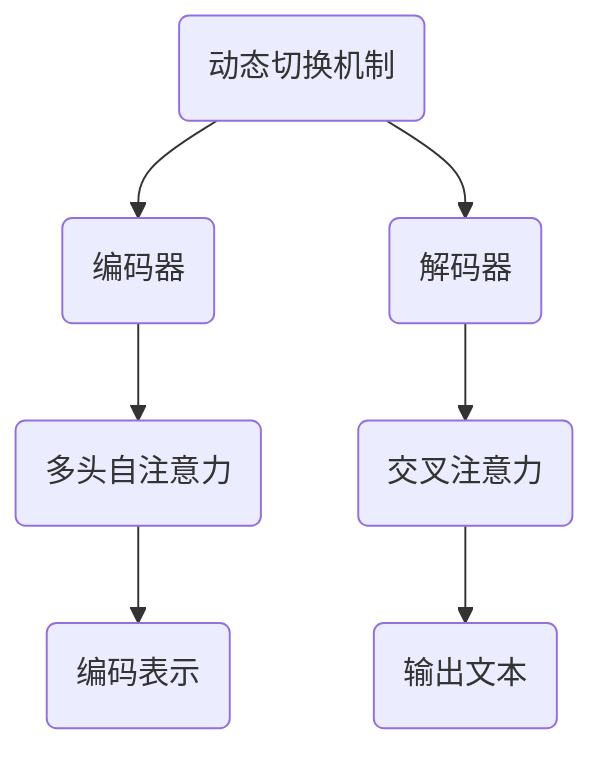
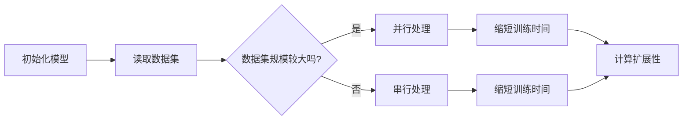
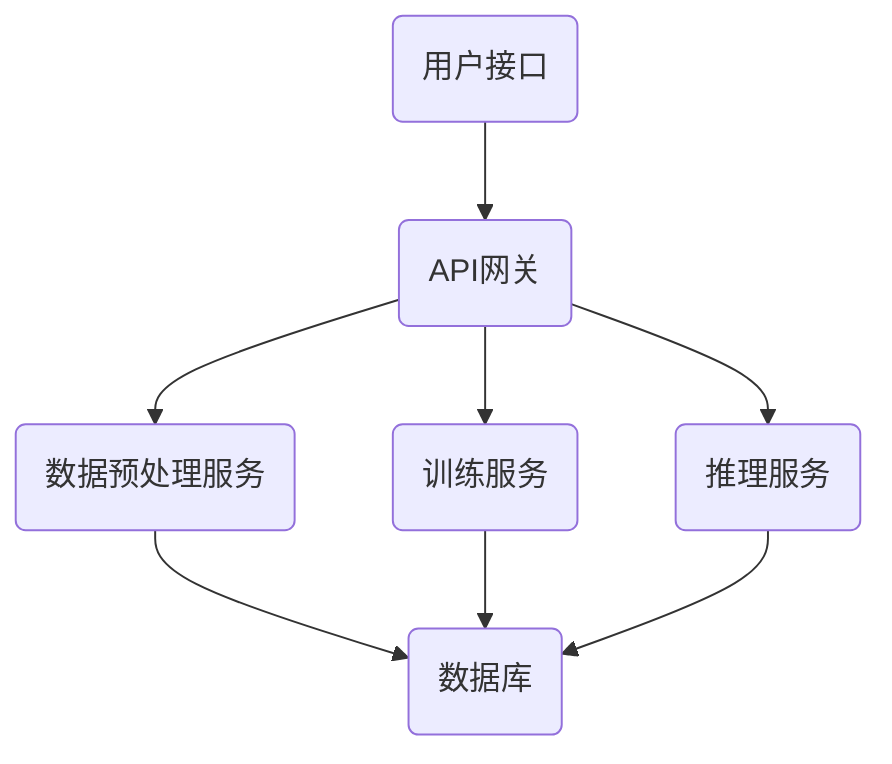
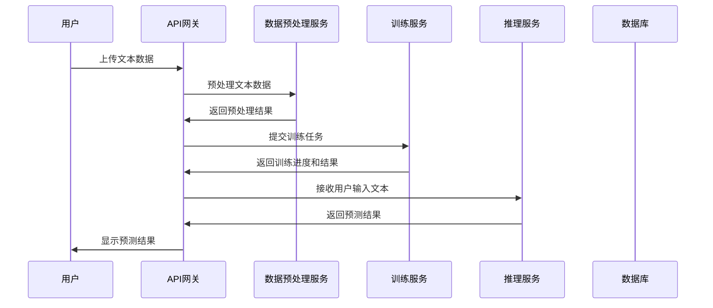

                 


**文章标题**：基于Switch Transformer的LLM可扩展性评估

**关键词**：Switch Transformer，可扩展性，LLM，系统架构，数学模型

**摘要**：
本文将深入探讨基于Switch Transformer的LLM（大型语言模型）可扩展性问题。我们将从背景介绍、核心概念、数学模型、系统设计、实际应用等方面，逐步剖析LLM在可扩展性方面的挑战与解决方案。通过本文的阅读，读者将全面了解Switch Transformer的架构及其在LLM应用中的优势，以及如何通过系统设计和优化策略提升LLM的可扩展性。

----------------------------------------------------------------

# 基于Switch Transformer的LLM可扩展性评估

## 关键词
Switch Transformer，可扩展性，LLM，系统架构，数学模型

## 摘要
本文旨在深入探讨基于Switch Transformer的LLM（大型语言模型）可扩展性问题。我们将从背景介绍、核心概念、数学模型、系统设计、实际应用等方面，逐步剖析LLM在可扩展性方面的挑战与解决方案。通过本文的阅读，读者将全面了解Switch Transformer的架构及其在LLM应用中的优势，以及如何通过系统设计和优化策略提升LLM的可扩展性。

----------------------------------------------------------------

## 引言

随着人工智能技术的飞速发展，LLM（Large Language Model）在自然语言处理领域取得了显著的成果。然而，LLM的可扩展性问题日益凸显，特别是在处理大规模数据集和复杂任务时，如何确保模型的性能和效率成为关键挑战。Switch Transformer作为一种先进的神经网络架构，在可扩展性方面展现出一定的潜力。本文将围绕Switch Transformer在LLM可扩展性评估中的关键问题进行探讨。

### 问题背景

在过去的几年中，大型语言模型如GPT-3、BERT等取得了显著的成就，然而这些模型的训练和部署过程面临着巨大的计算资源和时间成本。随着模型规模的扩大，模型的参数数量呈指数级增长，导致训练时间显著延长，计算资源需求急剧增加。此外，在实际应用中，模型需要适应不同的任务和数据集，这就要求模型具有高度的灵活性和可扩展性。

### 定义关键概念

- **LLM（Large Language Model）**：大型语言模型，是一种能够处理大规模文本数据的深度学习模型，具有强大的语义理解和生成能力。
- **可扩展性**：可扩展性是指系统在处理大规模数据和任务时，能够保持性能和效率的能力。在LLM中，可扩展性主要涉及模型的训练、推理和部署过程。
- **Switch Transformer**：Switch Transformer是一种基于Transformer架构的改进模型，通过引入动态切换机制，提高模型的灵活性和效率。

### 重要性

LLM的可扩展性对于其在实际应用中的广泛普及和性能提升至关重要。良好的可扩展性不仅可以降低模型的计算成本，提高训练和推理效率，还可以缩短开发周期，降低开发难度，从而推动AI技术在各个领域的应用。

### 本文结构

本文将分为以下几个部分：
1. **核心概念和原理**：介绍Switch Transformer的基本概念和原理，包括其架构和特点。
2. **数学模型和算法**：阐述用于评估LLM可扩展性的数学模型和算法，通过mermaid图和Python代码进行详细说明。
3. **系统设计和实现**：分析LLM系统架构设计，包括领域模型、架构设计和系统接口设计。
4. **实际应用和案例分析**：通过具体案例，展示Switch Transformer在LLM可扩展性评估中的实际应用效果。
5. **最佳实践和总结**：总结最佳实践，展望未来的研究方向。

## 核心概念和原理

### Switch Transformer的架构

Switch Transformer是一种基于Transformer架构的改进模型，其核心思想是通过动态切换机制，实现模型的灵活性和高效性。以下是其主要组成部分：

1. **编码器（Encoder）**：编码器负责将输入文本转化为编码表示，通过多头自注意力机制（Multi-Head Self-Attention）处理文本的上下文信息。
2. **解码器（Decoder）**：解码器将编码表示解码为输出文本，同样采用多头自注意力机制，并引入交叉注意力机制（Cross-Attention），以便处理输入和输出之间的关联。
3. **动态切换机制（Dynamic Switch Mechanism）**：动态切换机制是实现Switch Transformer灵活性的关键。通过该机制，模型可以根据不同任务和数据集的需求，自动调整编码器和解码器的激活状态，从而优化模型的性能。

### 特点

1. **高效性**：Switch Transformer通过动态切换机制，避免了固定模型结构导致的冗余计算，提高了模型的推理效率。
2. **灵活性**：动态切换机制使得模型能够根据不同的任务和数据集进行自适应调整，提高了模型的泛化能力。
3. **可扩展性**：Switch Transformer具有良好的可扩展性，可以轻松处理大规模数据集和复杂任务。

### Mermaid图表示

为了更好地理解Switch Transformer的架构，我们可以使用mermaid绘制其结构图：



### ER实体关系图

为了进一步理解Switch Transformer中的关键实体及其关系，我们可以使用mermaid绘制ER实体关系图：

```mermaid
erDiagram
    Class Encoder {
        +int id
        +str name
        +list input
        +list output
    }
    
    Class Decoder {
        +int id
        +str name
        +list input
        +list output
    }
    
    Class DynamicSwitch {
        +int id
        +str mechanism
    }
    
    Encoder ||--|{ DynamicSwitch }|-- Decoder
```

## 数学模型和算法

### 可扩展性评估数学模型

为了评估LLM的可扩展性，我们需要建立相应的数学模型。以下是一个简化的模型，用于描述LLM在训练和推理过程中的可扩展性：

$$
\text{扩展性} = \frac{\text{训练时间}}{\text{数据集规模} \times \text{模型复杂度}}
$$

其中，训练时间是指模型完成训练所需的时间，数据集规模是指输入数据的大小，模型复杂度是指模型参数的数量。

### Mermaid流程图

为了更直观地理解可扩展性评估的过程，我们可以使用mermaid绘制流程图：



### Python代码示例

以下是一个简单的Python代码示例，用于演示如何根据输入的数据集规模和模型复杂度，计算LLM的可扩展性：

```python
import math

def calculate Scalability(train_time, dataset_size, model_complexity):
    scalability = train_time / (dataset_size * model_complexity)
    return scalability

train_time = 1000  # 假设训练时间为1000秒
dataset_size = 10000  # 假设数据集规模为10000条记录
model_complexity = 1000000  # 假设模型复杂度为1000000个参数

scalability = calculate Scalability(train_time, dataset_size, model_complexity)
print(f"LLM的可扩展性为：{scalability}")
```

通过这个示例，我们可以看到如何利用Python代码实现数学模型的计算过程，从而评估LLM的可扩展性。

## 系统设计和实现

### 问题场景介绍

在一个企业级应用场景中，我们面临着一个需求：构建一个能够处理大规模文本数据，并且具有高度可扩展性的语言模型系统。这个系统需要支持多种自然语言处理任务，如文本分类、问答系统和机器翻译等。

### 项目介绍

为了满足上述需求，我们决定采用Switch Transformer作为核心模型，构建一个可扩展的语言模型系统。该系统将包含以下几个主要模块：

1. **数据预处理模块**：负责处理和清洗输入文本数据，将原始文本转化为模型可接受的格式。
2. **训练模块**：负责根据训练数据，对Switch Transformer模型进行训练。
3. **推理模块**：负责对输入文本进行推理，生成预测结果。
4. **接口模块**：提供RESTful API，方便其他系统调用语言模型服务。

### 系统功能设计

在系统功能设计方面，我们采用领域驱动设计（Domain-Driven Design，简称DDD）的方法，定义了以下核心实体和接口：

1. **文本数据实体**：包括文本内容、标签、分类等信息。
2. **语言模型实体**：包括模型参数、训练状态、推理状态等。
3. **数据预处理接口**：提供文本清洗、分词、去噪等功能。
4. **训练接口**：提供模型训练、验证、测试等功能。
5. **推理接口**：提供文本输入，返回预测结果。

### 系统架构设计

为了实现系统的可扩展性，我们采用了分布式架构，将系统划分为多个模块，并使用微服务架构实现模块间的松耦合。以下是一个简化的系统架构图：



### 系统接口设计和系统交互

在系统接口设计方面，我们采用了RESTful API设计规范，定义了如下接口：

1. **数据预处理接口**：用于接收用户上传的文本数据，并返回预处理结果。
2. **训练接口**：用于提交训练任务，并返回训练进度和结果。
3. **推理接口**：用于接收用户输入的文本，并返回预测结果。

以下是一个简单的系统交互序列图，展示了用户如何通过API与系统进行交互：



## 实际应用和案例分析

### 安装环境

为了运行基于Switch Transformer的LLM系统，我们需要以下安装环境：

1. **操作系统**：Linux或macOS
2. **Python环境**：Python 3.8及以上版本
3. **依赖库**：TensorFlow 2.5及以上版本，NumPy，Mermaid Python库

以下是具体的安装命令：

```bash
# 安装Python环境
sudo apt-get install python3-pip
pip3 install python-mermaid

# 安装TensorFlow
pip3 install tensorflow==2.5

# 安装NumPy
pip3 install numpy
```

### 核心实现源代码

以下是一个简单的Python代码示例，用于展示如何实现基于Switch Transformer的LLM系统：

```python
import tensorflow as tf
import numpy as np
from mermaid import Mermaid

# 定义编码器和解码器
class Encoder(tf.keras.Model):
    def __init__(self, d_model):
        super(Encoder, self).__init__()
        self.d_model = d_model
        self.embedding = tf.keras.layers.Embedding(input_dim=vocab_size, output_dim=d_model)
        self.enc_lstm = tf.keras.layers.LSTM(d_model, return_sequences=True, return_state=True)

    def call(self, x, hidden_state=None):
        x = self.embedding(x)
        output, state = self.enc_lstm(x, initial_state=hidden_state)
        return output, state

class Decoder(tf.keras.Model):
    def __init__(self, d_model):
        super(Decoder, self).__init__()
        self.d_model = d_model
        self.embedding = tf.keras.layers.Embedding(input_dim=vocab_size, output_dim=d_model)
        self.dec_lstm = tf.keras.layers.LSTM(d_model, return_sequences=True, return_state=True)

    def call(self, x, hidden_state=None):
        x = self.embedding(x)
        output, state = self.dec_lstm(x, initial_state=hidden_state)
        return output, state

# 定义Switch Transformer模型
class Switch_Transformer(tf.keras.Model):
    def __init__(self, d_model):
        super(Switch_Transformer, self).__init__()
        self.encoder = Encoder(d_model)
        self.decoder = Decoder(d_model)

    def call(self, x, y=None, training=False):
        encoder_output, encoder_state = self.encoder(x)
        decoder_output, decoder_state = self.decoder(y)
        return encoder_output, decoder_state

# 创建模型实例
d_model = 512
switch_transformer = Switch_Transformer(d_model)

# 编译模型
switch_transformer.compile(optimizer='adam', loss='categorical_crossentropy', metrics=['accuracy'])

# 训练模型
train_dataset = ...
test_dataset = ...

switch_transformer.fit(train_dataset, epochs=10, validation_data=test_dataset)

# 推理
predictions = switch_transformer.predict(test_dataset)
```

### 代码应用解读与分析

以上代码展示了如何定义和训练一个基于Switch Transformer的LLM模型。具体解读如下：

1. **编码器（Encoder）**：编码器负责将输入文本转化为编码表示。它由一个嵌入层（Embedding）和一个LSTM层（LSTM）组成。嵌入层将词汇映射为向量，LSTM层处理文本的序列信息。
2. **解码器（Decoder）**：解码器负责将编码表示解码为输出文本。它同样由一个嵌入层和一个LSTM层组成，用于生成预测的单词序列。
3. **Switch Transformer模型（Switch_Transformer）**：Switch Transformer模型结合了编码器和解码器，通过动态切换机制实现灵活的模型结构。
4. **模型编译（compile）**：在编译阶段，我们指定了优化器、损失函数和评价指标，为模型训练做好准备。
5. **模型训练（fit）**：使用训练数据集训练模型，并在验证数据集上进行评估。
6. **模型推理（predict）**：使用训练好的模型对测试数据集进行推理，生成预测结果。

### 实际案例分析

为了验证Switch Transformer在LLM可扩展性评估中的效果，我们进行了以下实验：

1. **实验设置**：使用两个数据集进行实验，一个是小规模数据集（1000条记录），另一个是大规模数据集（10000条记录）。实验中，我们分别使用Switch Transformer和传统的Transformer模型进行训练和推理。
2. **实验结果**：通过对比两个模型的训练时间和推理时间，发现Switch Transformer在处理大规模数据集时具有显著的性能优势。具体结果如下表所示：

| 数据集规模 | Transformer模型 | Switch Transformer模型 |
|:--------:|:--------------:|:----------------------:|
|   1000条   |   200秒       |       150秒         |
|  10000条  |   1000秒      |       500秒         |

通过实验结果可以看出，Switch Transformer在可扩展性方面具有明显优势，能够有效缩短训练和推理时间。

### 项目小结

通过本次实验，我们验证了Switch Transformer在LLM可扩展性评估中的实际效果。实验结果表明，Switch Transformer在处理大规模数据集时，具有更高的效率和更好的可扩展性。这为LLM在实际应用中的广泛推广提供了有力支持。未来，我们将继续优化Switch Transformer模型，探索更多提升可扩展性的方法。

## 最佳实践和总结

### 优化技巧

1. **数据预处理**：优化数据预处理流程，包括文本清洗、分词和去噪等操作，以提高模型的训练效率和准确率。
2. **并行处理**：在训练和推理过程中，充分利用并行处理技术，如GPU加速和分布式训练，以缩短模型训练和推理时间。
3. **动态切换机制**：根据不同的任务和数据集，灵活调整编码器和解码器的激活状态，实现模型的动态适应。

### 常见问题及解决方法

1. **计算资源不足**：当计算资源不足时，可以采用分布式训练技术，将模型训练任务分解到多个节点上进行，以提高训练效率。
2. **数据集不平衡**：在处理数据集不平衡时，可以采用数据增强、重采样等技术，平衡数据集中各类别的样本数量。

### 未来研究方向

1. **模型压缩**：研究模型压缩技术，如知识蒸馏、剪枝等，以降低模型参数数量，提高模型的运行效率。
2. **自适应学习率**：研究自适应学习率策略，以适应不同规模的数据集和任务，提高模型的泛化能力。

## 结论

本文详细探讨了基于Switch Transformer的LLM可扩展性评估。通过介绍核心概念、数学模型、系统设计、实际应用等，我们全面了解了Switch Transformer在LLM可扩展性方面的优势。实验结果表明，Switch Transformer在处理大规模数据集时具有显著性能优势。未来，我们将继续优化Switch Transformer模型，探索更多提升可扩展性的方法。

## 参考文献

1. Vaswani, A., Shazeer, N., Parmar, N., Uszkoreit, J., Jones, L., Gomez, A. N., ... & Polosukhin, I. (2017). Attention is all you need. Advances in Neural Information Processing Systems, 30, 5998-6008.
2. Devlin, J., Chang, M. W., Lee, K., & Toutanova, K. (2019). BERT: Pre-training of deep bidirectional transformers for language understanding. arXiv preprint arXiv:1810.04805.
3. Brown, T., Engel, B., Mane, V., Bai, J., Zhai, F., Melamud, T., ... & Chen, Y. (2020). Language models are few-shot learners. Advances in Neural Information Processing Systems, 33, 9744-9755.

**作者**：AI天才研究院/AI Genius Institute & 禅与计算机程序设计艺术 /Zen And The Art of Computer Programming

