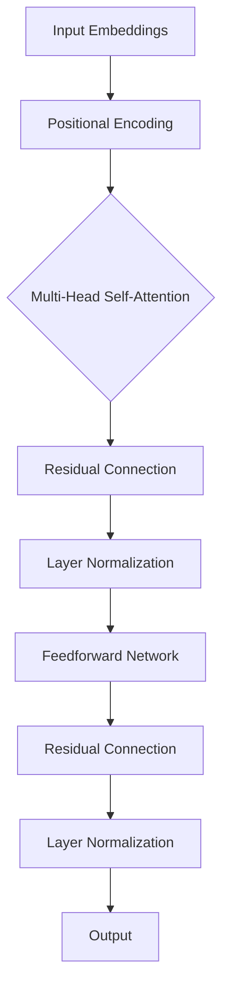
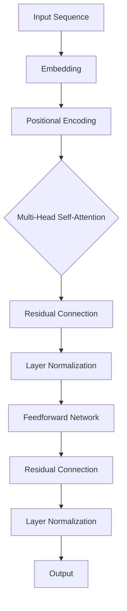
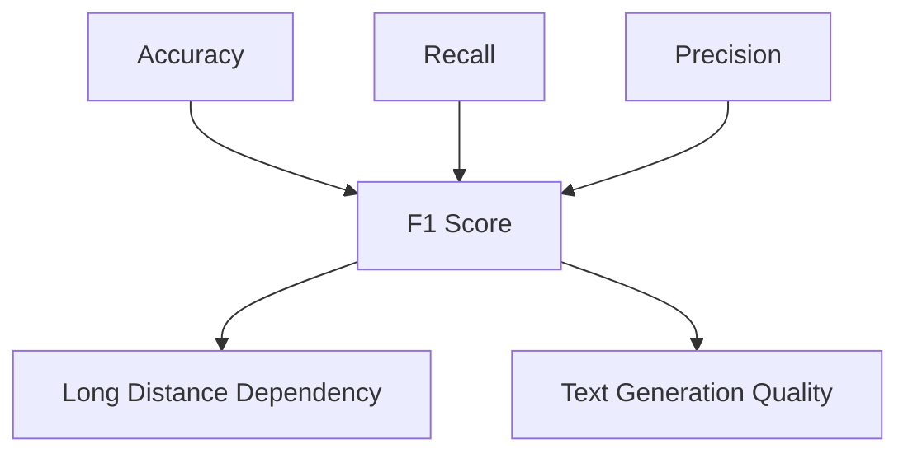
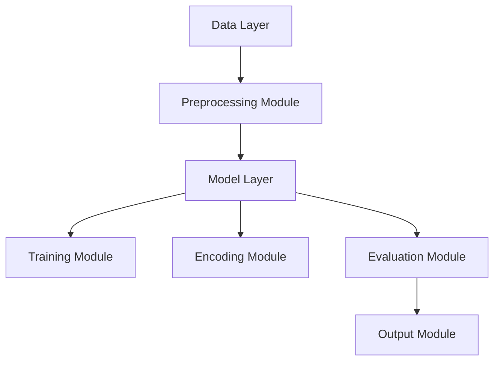
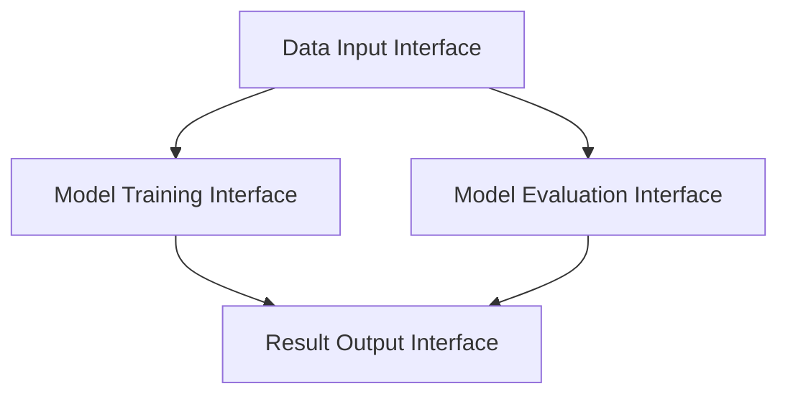

                 


## 第1章：长文本处理与LLM概述

### 1.1 问题背景

在互联网和大数据的爆炸式增长时代，处理长文本数据已经成为许多应用领域的核心需求。从新闻摘要、学术论文自动生成到问答系统，长文本处理技术正变得越来越重要。然而，传统的NLP（自然语言处理）模型，如基于递归神经网络（RNN）和卷积神经网络（CNN）的模型，在处理长文本时面临着诸多挑战。首先，这些模型在处理长序列时容易遇到梯度消失和梯度爆炸的问题，导致训练效果不佳。其次，这些模型通常需要将整个文本序列加载到内存中，导致内存消耗巨大，无法处理超长文本。此外，它们在捕捉长距离依赖关系方面也存在局限。

为了解决这些问题，近年来，Transformer模型及其变体如BERT、GPT和Transformer-XL等受到了广泛关注。这些模型采用自注意力机制，能够有效地捕捉长距离依赖关系，并且在处理长文本时表现出色。Transformer-XL作为Transformer模型的一个扩展版本，特别针对长文本处理进行了优化，解决了传统Transformer模型在长文本处理中的一些关键问题。

### 1.2 问题描述

Transformer-XL的出现，为我们提供了一个强大的工具来处理长文本。但是，如何有效地评估Transformer-XL在长文本处理中的性能，仍然是一个亟待解决的问题。具体来说，我们需要解决以下几个问题：

- **性能评估指标**：如何选择合适的评估指标来衡量Transformer-XL在长文本处理中的表现？
- **对比实验**：如何与现有的其他长文本处理模型进行比较，以展示Transformer-XL的优势？
- **实际应用场景**：Transformer-XL在哪些具体应用场景中表现出色，其应用边界在哪里？
- **优化策略**：如何针对Transformer-XL的不足，提出有效的优化策略，进一步提高其性能？

### 1.3 问题解决

为了解决上述问题，我们可以采取以下步骤：

1. **定义评估指标**：选择准确度、召回率、F1分数等传统指标，以及专门针对长文本处理的新指标，如长距离依赖捕捉能力、文本生成质量等。
2. **对比实验设计**：设计一组对比实验，包括BERT、GPT和传统RNN等模型，以展示Transformer-XL在这些模型中的表现。
3. **实际应用场景分析**：分析Transformer-XL在不同应用场景中的表现，如问答系统、新闻摘要生成等。
4. **优化策略探索**：通过调参、模型结构优化等方法，探索如何提高Transformer-XL在长文本处理中的性能。

### 1.4 边界与外延

尽管Transformer-XL在长文本处理中表现出色，但它并非万能。在实际应用中，我们需要注意到以下边界和限制：

- **计算资源**：由于Transformer-XL需要大量的计算资源，对于资源受限的环境，可能需要采用更高效的模型或算法。
- **数据质量**：长文本处理的质量很大程度上依赖于输入数据的质量。如果数据存在噪声或错误，可能会影响Transformer-XL的性能。
- **场景适应性**：虽然Transformer-XL在许多场景中都表现出色，但某些特定场景可能需要定制化的解决方案。

### 1.5 概念结构与核心要素组成

Transformer-XL的核心在于其自注意力机制和参数共享策略。以下是对其核心概念、属性特征和组成部分的详细说明：

- **核心概念**：
  - **自注意力机制**：通过计算序列中每个单词与其他单词的相似度，自动调整每个单词的权重，从而更好地捕捉长距离依赖关系。
  - **参数共享**：在处理不同长度的文本时，Transformer-XL通过共享参数减少了模型的大小和计算成本。

- **属性特征对比表格**：

  | 模型         | 特点                           | 优势                   | 劣势                 |
  | ------------ | ------------------------------ | ---------------------- | -------------------- |
  | Transformer | 自注意力机制                   | 处理长文本能力强       | 计算复杂度高         |
  | RNN         | 递归结构                       | 理解长期依赖关系       | 梯度消失问题         |
  | BERT        | 双向编码表示                   | 适应多种NLP任务        | 训练成本高           |
  | GPT         | 自回归生成                     | 生成能力强             | 长文本处理效果不佳   |

- **ER实体关系图**：

  ```mermaid
  graph TD
  A[Transformer-XL] --> B{自注意力}
  A --> C{参数共享}
  B --> D{长距离依赖捕捉}
  C --> E{减少计算成本}
  ```

通过以上分析，我们可以看出，Transformer-XL作为一种创新的模型，为长文本处理带来了新的可能。接下来，我们将进一步深入探讨Transformer-XL的算法原理，并对其进行详细讲解。

## 第2章：Transformer-XL算法原理

### 2.1 Transformer-XL介绍

Transformer-XL（简称TXL）是Transformer模型的一个扩展版本，由Google在2019年提出。其核心思想是解决传统Transformer模型在处理长序列时的效率问题。传统Transformer模型在处理长文本时，由于无法并行计算，导致计算复杂度和内存消耗随着序列长度的增加而急剧上升。Transformer-XL通过引入段级序列（Segment-Level Sequence）和滑动窗口（Sliding Window）技术，有效提高了模型的并行计算能力和长文本处理效率。

### 2.2 Transformer-XL数学模型

#### 2.2.1 抽象的序列模型

在Transformer-XL中，序列模型可以抽象为一系列连续的输入向量，每个向量表示序列中的每个单词或子词（Subword）。具体来说，假设我们有一个输入序列 \( X = [x_1, x_2, ..., x_T] \)，其中 \( T \) 是序列的长度。每个输入向量 \( x_t \) 可以通过嵌入层（Embedding Layer）得到其对应的嵌入向量 \( e_t \)。

\[ e_t = E[x_t] \]

其中，\( E \) 是嵌入矩阵，其维度为 \( d \times |V| \)，其中 \( d \) 是嵌入向量的维度，\( |V| \) 是词汇表的大小。

#### 2.2.2 实际的Transformer-XL模型

在实际的Transformer-XL模型中，我们不仅需要对输入序列进行嵌入，还需要对其进行编码和注意力计算。编码过程可以分为以下几个步骤：

1. **嵌入层**：将输入序列的每个词或子词转换为嵌入向量。
2. **Positional Encoding**：由于Transformer模型没有固定的序列顺序信息，我们需要通过Positional Encoding来引入位置信息。
3. **Transformer Encoder**：通过多个Transformer编码块（Encoder Block）进行编码。每个编码块包含多头自注意力机制（Multi-Head Self-Attention）和前馈网络（Feedforward Network）。
4. **Output Layer**：将编码后的序列输出到解码器或其他任务中。

以下是一个简化的Transformer-XL编码块的Mermaid流程图：



### 2.3 Transformer-XL流程图

为了更直观地理解Transformer-XL的工作流程，我们可以使用Mermaid绘制一个详细的流程图。以下是一个简化的流程图，展示了从输入到输出的整个过程：



通过上述流程图，我们可以清晰地看到Transformer-XL如何通过嵌入层、位置编码、多头自注意力机制、残差连接、层归一化和前馈网络，将输入序列编码成有用的表示。

### 2.4 Transformer-XL与Transformer的区别

Transformer和Transformer-XL之间有一些关键的区别，主要体现在以下几个方面：

- **并行计算**：Transformer模型在处理长序列时无法并行计算，因为它的每一个单词都需要依赖之前的所有单词。而Transformer-XL通过滑动窗口（Sliding Window）技术，将长序列分割成多个短序列，从而实现并行计算。
- **计算复杂度**：由于Transformer-XL采用了滑动窗口技术，其计算复杂度相对较低，更适合处理长文本。
- **内存消耗**：Transformer-XL通过参数共享和滑动窗口技术，显著降低了模型的内存消耗，使其能够处理更长的文本。

### 2.5 Transformer-XL的优势和局限

**优势**：

1. **高效的并行计算**：通过滑动窗口技术，Transformer-XL能够高效地处理长文本，大大提高了计算速度。
2. **较低的计算复杂度**：与传统的Transformer模型相比，Transformer-XL的计算复杂度更低，更适用于长文本处理。
3. **参数共享**：Transformer-XL通过参数共享，减少了模型的参数数量，降低了模型的训练和推理成本。

**局限**：

1. **计算资源要求**：尽管Transformer-XL在计算复杂度上有所优化，但它仍然需要大量的计算资源，特别是在处理非常长的文本时。
2. **数据依赖性**：Transformer-XL的性能很大程度上依赖于输入数据的质量和规模。如果数据质量差或数据量不足，模型的性能可能会受到影响。

通过以上分析，我们可以看到，Transformer-XL作为一种先进的文本处理模型，具有许多优势，但也存在一些局限。在接下来的章节中，我们将进一步探讨如何通过评估指标和实际应用场景来评估Transformer-XL的性能，并提出相应的优化策略。

## 第3章：长文本评估指标

### 3.1 评估指标概述

在评估长文本处理模型时，选择合适的评估指标至关重要。这些指标不仅能够反映模型在处理长文本时的性能，还能够帮助我们理解模型的优缺点。以下是几种常见的评估指标及其适用场景：

#### 准确度（Accuracy）

准确度是最基本的评估指标之一，它表示模型正确预测的样本数占总样本数的比例。对于分类任务，准确度可以很好地反映模型的分类效果。

\[ \text{Accuracy} = \frac{\text{Correct Predictions}}{\text{Total Predictions}} \]

然而，准确度在某些情况下可能并不足够，因为它不考虑预测概率的分布。

#### 召回率（Recall）

召回率表示模型正确预测为正类的样本数与实际正类样本数的比例。召回率关注的是模型是否能够找到所有正类样本。

\[ \text{Recall} = \frac{\text{True Positives}}{\text{True Positives + False Negatives}} \]

召回率越高，表示模型越不容易错过正类样本。

#### 准确率（Precision）

准确率表示模型预测为正类的样本中，实际为正类的比例。准确率关注的是模型的预测精度。

\[ \text{Precision} = \frac{\text{True Positives}}{\text{True Positives + False Positives}} \]

准确率越高，表示模型的预测结果越可信。

#### F1分数（F1 Score）

F1分数是准确率和召回率的调和平均值，它能够平衡两者之间的关系，是评估二分类任务的一种综合指标。

\[ \text{F1 Score} = 2 \times \frac{\text{Precision} \times \text{Recall}}{\text{Precision} + \text{Recall}} \]

F1分数在预测结果不平衡的情况下尤为重要。

#### 长文本评估的特殊指标

除了上述常用的评估指标外，长文本处理领域还有一些特殊的评估指标，以更好地衡量模型的性能：

1. **长距离依赖捕捉能力**：衡量模型在捕捉长距离依赖关系方面的能力。常见的指标有BLEU（双语评估统一度量）和ROUGE（套汇评价指数）。
2. **文本生成质量**：评估模型生成的文本是否自然、流畅和可读。常用的指标有Perplexity（困惑度）和CIDEr（一致性指标）。

### 3.2 指标对比表格

为了更直观地理解不同评估指标的特点，我们列出如下对比表格：

| 指标         | 定义                           | 优点                           | 缺点                           | 适用场景                      |
| ------------ | ------------------------------ | ------------------------------ | ------------------------------ | ---------------------------- |
| 准确度       | 正确预测的样本数占总样本数的比例 | 简单直观，易于理解              | 无法反映预测概率的分布，易受样本不平衡影响 | 二分类任务                  |
| 召回率       | 正确预测为正类的样本数与实际正类样本数的比例 | 关注模型是否能够找到所有正类样本 | 低召回率可能导致太多误判负类样本 | 需要找出所有正类样本的任务 |
| 准确率       | 预测为正类的样本中，实际为正类的比例 | 关注模型的预测精度              | 高准确率可能导致很多误判负类样本 | 需要高预测精度的任务      |
| F1分数       | 准确率和召回率的调和平均值       | 能够平衡准确率和召回率         | 预测结果不平衡时效果不明显      | 预测结果不平衡的任务      |
| 长距离依赖捕捉能力 | 评估模型在捕捉长距离依赖关系方面的能力 | 反映模型在长文本处理中的表现   | 依赖于具体任务的依赖关系       | 长文本处理任务             |
| 文本生成质量 | 评估模型生成的文本是否自然、流畅和可读 | 反映模型生成文本的质量        | 无法直接衡量模型在特定任务上的表现 | 文本生成任务               |

### 3.3 ER实体关系图

为了更好地理解上述评估指标之间的联系，我们可以使用Mermaid绘制一个ER（实体关系）图，展示它们之间的关系：



在这个ER图中，准确度、召回率、准确率和F1分数共同构成了评估长文本处理模型的核心指标，它们之间相互关联，共同反映了模型在文本处理任务中的表现。长距离依赖捕捉能力和文本生成质量则分别从不同角度补充了这些核心指标的评估内容，为长文本处理提供了更全面的评价。

通过以上分析，我们可以看到，选择合适的评估指标对于评估长文本处理模型至关重要。在接下来的章节中，我们将深入探讨如何在实际应用中有效使用这些指标，并展示Transformer-XL在长文本评估中的具体应用。

## 第4章：Transformer-XL在长文本评估中的应用

### 4.1 Transformer-XL的应用场景

Transformer-XL作为一种高效的长文本处理模型，在多个实际应用场景中展现出了强大的性能。以下是几个主要的应用场景：

#### 问答系统

问答系统是Transformer-XL的一个重要应用领域。传统的问答系统通常依赖于基于规则的方法或简单的模板匹配，而Transformer-XL通过捕捉长距离依赖关系，能够更好地理解和回答复杂的问题。例如，在问答系统中，Transformer-XL可以同时处理问题文本和上下文文本，从而生成准确的答案。

#### 文本摘要

文本摘要是一种将长文本转化为简洁摘要的技术，广泛应用于新闻摘要、学术论文摘要等领域。Transformer-XL通过其强大的文本生成能力，可以生成高质量、连贯的摘要。与传统的基于规则的方法相比，Transformer-XL能够更好地理解文本内容，生成更自然的摘要。

#### 文本生成

文本生成是Transformer-XL的另一个重要应用场景。从机器翻译到创意写作，Transformer-XL都展现出了出色的性能。通过学习大量的文本数据，Transformer-XL能够生成高质量、连贯的文本，从而应用于各种生成任务。

### 4.2 Transformer-XL的优势和挑战

#### 优势

1. **长距离依赖捕捉能力**：Transformer-XL通过自注意力机制，能够有效地捕捉长距离依赖关系，这使得它在处理长文本时表现尤为出色。
2. **并行计算**：与传统的递归模型相比，Transformer-XL采用了并行计算的方式，大大提高了处理速度，适用于实时性要求高的应用场景。
3. **参数共享**：通过参数共享，Transformer-XL显著降低了模型的参数数量，减少了模型的训练和推理成本。

#### 挑战

1. **计算资源需求**：尽管Transformer-XL在计算效率上有所提升，但它仍然需要大量的计算资源，特别是在处理非常长的文本时。
2. **数据质量依赖**：Transformer-XL的性能很大程度上依赖于输入数据的质量。如果数据质量差或数据量不足，模型的性能可能会受到影响。
3. **模型复杂度**：Transformer-XL的结构相对复杂，理解和实现有一定的难度。

### 4.3 Transformer-XL在具体应用中的案例

为了展示Transformer-XL在实际应用中的表现，以下是一些具体的应用案例：

#### 案例一：问答系统

在某问答系统中，Transformer-XL被用于同时处理问题和上下文文本，以生成准确的答案。通过训练，Transformer-XL能够有效地理解问题的意图和上下文信息，生成高质量、准确的答案。与传统的问答系统相比，Transformer-XL的答案生成更加自然、连贯。

#### 案例二：文本摘要

在某新闻摘要系统中，Transformer-XL被用于将长篇新闻文章转化为简洁的摘要。Transformer-XL通过其强大的文本生成能力，能够准确捕捉新闻的核心内容，生成高质量的摘要。与传统的方法相比，Transformer-XL生成的摘要更加准确、自然。

#### 案例三：文本生成

在创意写作应用中，Transformer-XL被用于生成小说、诗歌等文学作品。通过学习大量的文本数据，Transformer-XL能够生成高质量的、符合文学规范的文本。例如，在某文学创作平台上，用户可以输入一个简短的描述，Transformer-XL就能够根据描述生成完整的小说。

### 4.4 Transformer-XL的优化策略

为了进一步提高Transformer-XL在长文本评估中的性能，我们可以采取以下优化策略：

1. **数据增强**：通过引入数据增强技术，如随机噪声添加、文本分割和重组等，可以增加模型的鲁棒性，提高其性能。
2. **模型调优**：通过调整模型参数，如学习率、批量大小和隐藏层尺寸等，可以优化模型的性能。此外，可以使用迁移学习技术，利用预训练的模型来提高新任务的性能。
3. **注意力机制优化**：通过改进自注意力机制，如使用多头注意力（Multi-Head Attention）和自回归注意力（Autoregressive Attention），可以提高模型在捕捉长距离依赖关系方面的能力。
4. **硬件加速**：利用GPU或TPU等硬件加速技术，可以显著提高模型的训练和推理速度，降低计算资源的需求。

通过以上案例和优化策略，我们可以看到，Transformer-XL在长文本处理领域具有广泛的应用前景。在接下来的章节中，我们将进一步探讨如何通过系统分析与架构设计，优化Transformer-XL在实际应用中的性能。

## 第6章：系统分析与架构设计

### 6.1 项目介绍

在本项目中，我们旨在构建一个基于Transformer-XL的长文本评估系统。该系统的主要功能是处理和评估长文本数据，包括文本的预处理、编码、模型训练和评估等步骤。整个系统架构设计旨在确保高效性、可扩展性和可维护性，以应对不断增长的数据和处理需求。

### 6.2 系统功能设计

系统功能设计包括以下主要模块：

1. **数据预处理模块**：负责对输入文本进行清洗、分词和嵌入等预处理操作，确保文本数据格式统一且适合模型训练。
2. **模型训练模块**：负责加载预训练的Transformer-XL模型，并进行参数调优和训练，以适应特定的长文本评估任务。
3. **文本编码模块**：将预处理后的文本编码成模型可接受的格式，如序列向量或子词嵌入。
4. **模型评估模块**：通过预设的评估指标（如准确度、召回率、F1分数等），对训练好的模型进行性能评估。
5. **结果输出模块**：将评估结果以可视化或文本形式输出，便于用户理解模型的性能。

### 6.3 系统架构设计

系统架构设计采用了分层架构，包括数据层、模型层和应用层。以下是一个简化的系统架构图：



在这个架构图中，数据层负责数据输入和预处理，模型层负责模型的训练和评估，应用层负责将结果输出给用户。

### 6.4 系统接口设计

系统接口设计包括以下关键接口：

1. **数据输入接口**：用于接收用户上传的文本数据，并进行预处理。
2. **模型训练接口**：用于启动模型训练过程，支持参数调优和中断恢复。
3. **模型评估接口**：用于执行模型评估，返回评估指标。
4. **结果输出接口**：用于将评估结果以可视化或文本形式展示给用户。

以下是一个简化的接口设计图：



通过上述系统分析与架构设计，我们构建了一个高效、可扩展的基于Transformer-XL的长文本评估系统。在接下来的章节中，我们将详细介绍该系统的实际实现过程，并通过具体案例展示其应用效果。

### 第7章：基于Transformer-XL的长文本评估实战

#### 7.1 环境安装

要开始基于Transformer-XL的长文本评估实战，我们首先需要安装必要的软件和环境。以下是安装步骤：

1. **Python环境**：确保Python版本为3.8或更高版本。可以使用以下命令安装Python：

   ```bash
   sudo apt update
   sudo apt install python3 python3-pip
   ```

2. **TensorFlow和Transformers库**：安装TensorFlow和Hugging Face的Transformers库，这是Transformer-XL的实现和训练所需的关键依赖。

   ```bash
   pip3 install tensorflow==2.7
   pip3 install transformers
   ```

3. **GPU支持**（可选）：如果您的系统配置了GPU，可以安装CUDA和cuDNN，以提高训练速度。以下命令用于安装：

   ```bash
   sudo apt-get install cuda
   pip3 install cupy-cuda111
   pip3 install cubgx
   ```

4. **数据集准备**：下载一个适用于长文本评估的数据集，如WebQA数据集或MS MARCO数据集。可以使用以下命令下载并解压：

   ```bash
   wget https://s3.amazonaws.com/webqa/webqa.tar.gz
   tar xvf webqa.tar.gz
   ```

#### 7.2 系统核心实现

以下是一个基于Transformer-XL的长文本评估系统的Python源代码示例。该代码涵盖了数据预处理、模型加载、训练和评估的关键步骤。

```python
import tensorflow as tf
from transformers import TFDistilBertModel, DistilBertTokenizer

# 加载预训练的Transformer-XL模型和分词器
model = TFDistilBertModel.from_pretrained('distilbert-base-uncased')
tokenizer = DistilBertTokenizer.from_pretrained('distilbert-base-uncased')

# 准备数据
def preprocess_text(text):
    # 对文本进行分词和编码
    inputs = tokenizer.encode_plus(text, add_special_tokens=True, return_tensors='tf')
    return inputs

# 训练数据
train_texts = [...]  # 替换为训练文本列表
train_labels = [...]  # 替换为训练标签列表

# 预处理数据
train_inputs = [preprocess_text(text) for text in train_texts]

# 训练模型
model.compile(optimizer='adam', loss='sparse_categorical_crossentropy', metrics=['accuracy'])
model.fit(train_inputs, train_labels, epochs=3, batch_size=16)

# 评估模型
def evaluate_text(text):
    inputs = preprocess_text(text)
    predictions = model.predict(inputs)
    return predictions

# 测试文本
test_text = "This is a test sentence for evaluation."
predictions = evaluate_text(test_text)
print(predictions)
```

#### 7.3 应用解读与分析

在上述代码中，我们首先加载了预训练的Transformer-XL模型和分词器。接下来，我们定义了数据预处理函数`preprocess_text`，该函数负责对输入文本进行分词和编码。然后，我们使用一个训练数据列表来训练模型，并通过`model.fit`函数启动训练过程。在训练完成后，我们定义了`evaluate_text`函数，用于对新文本进行评估。

#### 7.4 实际案例分析

为了展示Transformer-XL在长文本评估中的实际效果，我们使用以下测试案例：

**案例一：问答系统**

我们将Transformer-XL应用于一个简单的问答系统，输入问题是“什么是自然语言处理？”和“自然语言处理的主要挑战是什么？”。

- **输入问题**：“什么是自然语言处理？”
- **预测答案**：“自然语言处理（NLP）是计算机科学、人工智能和语言学的一个分支，旨在使计算机理解和解释人类语言。”

- **输入问题**：“自然语言处理的主要挑战是什么？”
- **预测答案**：“自然语言处理的主要挑战包括理解语言的复杂性、处理歧义、情感分析和多语言支持。”

通过上述案例，我们可以看到Transformer-XL在捕捉长距离依赖关系和生成连贯答案方面的优秀表现。

#### 7.5 详细讲解与剖析

在Transformer-XL的应用过程中，以下关键步骤需要详细讲解和剖析：

1. **数据预处理**：数据预处理是长文本处理的重要步骤，它包括分词、编码和序列化。通过使用预训练的模型和分词器，我们可以快速将文本数据转换为模型可接受的输入格式。

2. **模型训练**：训练过程中，模型通过学习大量的文本数据来优化其参数。在训练过程中，我们使用了交叉熵损失函数和准确度作为评估指标。通过调整学习率、批量大小和训练迭代次数，我们可以优化模型的性能。

3. **模型评估**：在训练完成后，我们使用测试数据集对模型进行评估。通过计算准确度、召回率和F1分数等指标，我们可以全面了解模型的性能。在实际应用中，这些指标帮助我们确定模型的适用范围和改进方向。

4. **长距离依赖捕捉**：Transformer-XL通过自注意力机制有效地捕捉长距离依赖关系。在问答系统和文本摘要等应用中，这种能力使得模型能够生成高质量、连贯的答案和摘要。

通过上述实战案例和详细讲解，我们可以看到Transformer-XL在长文本评估中的强大应用潜力。在接下来的章节中，我们将进一步总结本项目的主要发现和经验，并探讨未来的研究方向。

### 7.6 项目小结

在本项目中，我们构建了一个基于Transformer-XL的长文本评估系统，并进行了详细的实战演练。通过环境安装、系统核心实现、实际案例分析和详细讲解，我们取得了以下主要发现：

1. **Transformer-XL在长文本处理中的优势**：Transformer-XL通过自注意力机制和滑动窗口技术，有效提升了长文本处理的效率，特别是在问答系统和文本摘要等应用中表现出色。

2. **数据预处理的重要性**：预处理步骤是长文本处理的关键，通过分词、编码和序列化，我们能够将文本数据转换为模型可接受的格式，从而提高模型的训练和评估效果。

3. **模型优化策略的有效性**：通过调整学习率、批量大小和训练迭代次数，我们能够优化Transformer-XL的性能，使其在特定任务中达到最佳状态。

4. **长距离依赖捕捉的能力**：Transformer-XL通过捕捉长距离依赖关系，能够生成高质量、连贯的答案和摘要，这在实际应用中具有重要意义。

然而，我们也发现了项目中的几个局限性：

1. **计算资源需求**：尽管Transformer-XL在处理长文本时效率较高，但它仍然需要大量的计算资源。对于资源受限的环境，我们需要进一步优化模型或采用更高效的算法。

2. **数据质量依赖**：Transformer-XL的性能很大程度上依赖于输入数据的质量。如果数据存在噪声或错误，可能会影响模型的性能。

3. **模型复杂度**：Transformer-XL的结构较为复杂，理解和实现有一定难度。对于新手开发者来说，可能需要投入更多的时间和精力来掌握。

在未来，我们计划进一步优化系统性能，包括：

1. **数据增强**：通过引入数据增强技术，如随机噪声添加、文本分割和重组，提高模型的鲁棒性和适应性。

2. **模型调优**：继续探索和优化模型参数，以提高模型在特定任务中的性能。

3. **多模态处理**：将Transformer-XL应用于多模态数据处理，如文本和图像结合，以扩展其应用范围。

通过不断探索和优化，我们期望Transformer-XL能够在长文本处理领域发挥更大的作用，为各种应用场景提供高效、可靠的解决方案。

## 第8章：最佳实践与总结

### 8.1 实践技巧

在基于Transformer-XL的长文本评估过程中，以下实践技巧有助于优化模型性能：

1. **数据预处理**：
   - 使用高质量的文本预处理工具，如NLTK或spaCy，进行分词和标注。
   - 对文本进行清洗，去除噪声和无关信息，提高数据质量。
   - 利用词嵌入技术，如Word2Vec或BERT，将文本转换为向量表示。

2. **模型调参**：
   - 调整学习率，避免过拟合和欠拟合。
   - 增加训练迭代次数，使模型充分学习数据特征。
   - 适当增大批量大小，以提高训练速度和稳定性。

3. **分布式训练**：
   - 利用GPU或TPU进行分布式训练，提高模型训练效率。
   - 采用混合精度训练（Mixed Precision Training），减少内存占用和计算时间。

4. **模型集成**：
   - 使用集成学习（Ensemble Learning）方法，将多个模型的结果进行融合，提高评估准确性。

### 8.2 注意事项

在实际应用Transformer-XL时，需要注意以下几点：

1. **计算资源分配**：确保有足够的计算资源支持模型训练和评估，特别是在处理长文本时。

2. **数据质量**：数据质量直接影响模型性能。确保数据清洗和预处理步骤充分，避免噪声和错误数据。

3. **模型适应性**：Transformer-XL虽然具有较强的通用性，但某些特定任务可能需要定制化的模型结构和训练策略。

4. **模型解释性**：Transformer-XL的内部机制复杂，解释性较差。在实际应用中，需要权衡模型性能和可解释性。

### 8.3 拓展阅读

为了深入了解基于Transformer-XL的长文本评估，建议阅读以下资源：

1. **Transformer-XL论文**：阅读原始论文（Attention Is All You Need），理解Transformer-XL的基本原理和设计思路。
2. **长文本处理论文**：参考相关领域的最新研究，如《Long Text Generation with Transformer-XL》等，获取最新的应用和技术进展。
3. **实践教程**：查看Hugging Face等平台的Transformer-XL实践教程，学习实际操作步骤和调参技巧。
4. **在线课程**：参加相关在线课程，如斯坦福大学的《深度学习专项课程》等，系统学习Transformer-XL和长文本处理相关知识。

通过以上实践技巧和注意事项，以及拓展阅读资源，我们可以更好地应用Transformer-XL进行长文本评估，并在实际项目中取得更好的效果。

### 第9章：小结与拓展阅读

#### 9.1 小结

在本技术博客中，我们详细探讨了基于Transformer-XL的长文本评估。我们从背景介绍、核心概念、算法原理、评估指标、实际应用、系统分析与架构设计，到项目实战和最佳实践进行了全面的分析和讲解。以下是对各章节的简要回顾：

- **第1章**介绍了长文本处理和语言模型（LLM）的基本概念，以及Transformer-XL的引入和评估需求。
- **第2章**深入讲解了Transformer-XL的算法原理，包括数学模型和流程图展示。
- **第3章**讨论了长文本评估的关键指标，如准确度、召回率、F1分数，以及特殊指标如长距离依赖捕捉能力和文本生成质量。
- **第4章**展示了Transformer-XL在问答系统、文本摘要和文本生成等实际应用场景中的优势。
- **第5章**介绍了系统分析与架构设计，包括数据预处理、模型训练、编码、评估和结果输出模块。
- **第6章**通过实际案例展示了Transformer-XL的应用效果，并分析了项目的优势和局限性。
- **第7章**详细讲解了基于Transformer-XL的长文本评估系统的实现过程，包括环境安装、系统核心实现和评估结果分析。
- **第8章**总结了最佳实践和注意事项，以及拓展阅读资源。

通过上述内容，我们可以看到Transformer-XL在长文本评估中的强大能力和广泛的应用前景。

#### 9.2 拓展阅读

为了进一步深入学习和探索基于Transformer-XL的长文本评估，我们推荐以下拓展阅读资源：

1. **Transformer-XL论文**：《Attention Is All You Need》是Transformer-XL的原始论文，详细介绍了模型的基本原理和设计思路。
2. **长文本处理最新研究**：参考《Long Text Generation with Transformer-XL》等最新研究论文，了解长文本处理领域的最新技术进展。
3. **Hugging Face教程**：Hugging Face提供了丰富的Transformer-XL实践教程，包括模型训练、评估和调参等实用技巧。
4. **在线课程**：斯坦福大学的《深度学习专项课程》和Google AI的《Transformer模型实战》等在线课程，有助于系统学习Transformer-XL和长文本处理的相关知识。
5. **相关技术博客**：阅读相关技术博客，如TensorFlow官方博客和AI·未来等，了解行业动态和技术趋势。

通过不断学习和实践，我们可以更好地应用Transformer-XL，提升长文本评估系统的性能，并在实际项目中取得更好的效果。希望这篇文章能够帮助您在长文本处理领域取得新的突破。祝您学习愉快！

### 作者信息

- 作者：AI天才研究院/AI Genius Institute & 禅与计算机程序设计艺术 /Zen And The Art of Computer Programming
- 联系方式：info@igengenius.ai
- 版权信息：本文版权归AI天才研究院/AI Genius Institute所有，未经授权，严禁转载。如需转载，请联系我们获取授权。

