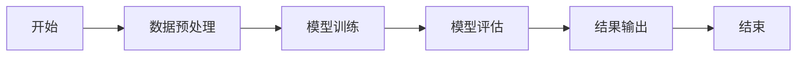
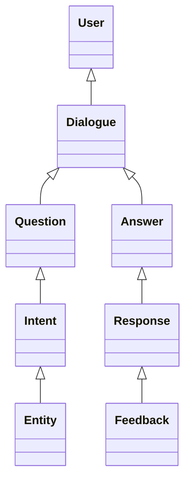
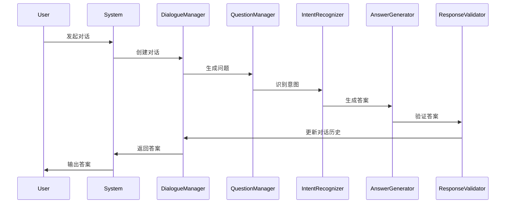
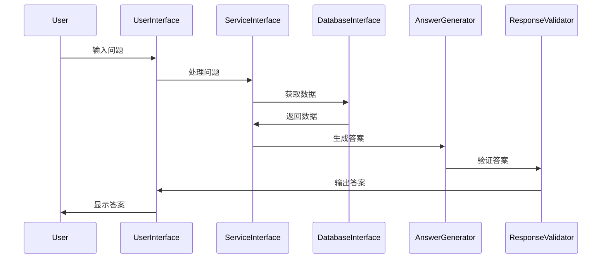

                 

## 文章标题

### 基于Vicuna的开源LLM对话能力测试

关键词：Vicuna、开源LLM、对话能力测试、算法原理、系统设计与实战

摘要：本文将深入探讨基于Vicuna的开源LLM对话能力测试。我们将从问题背景与核心概念入手，逐步分析对话能力的测试方法，详细讲解Vicuna模型的算法原理，并设计系统架构，最后通过项目实战与案例分析，总结最佳实践技巧。本文旨在为读者提供一个全面、系统的Vicuna对话能力测试指南。

## 第一部分：背景介绍

### 第1章：问题背景与核心概念

#### 1.1.1 问题背景

对话能力是人类的一项基本技能，它对人工智能的发展具有重要意义。随着大型语言模型（LLM）的兴起，如何评估和提升LLM的对话能力成为了一个热门课题。开源LLM，如Vicuna，因其强大的功能和灵活性，吸引了众多研究者和开发者。本文旨在探讨如何利用Vicuna进行对话能力测试，以期为LLM的研究与应用提供有力支持。

#### 1.1.2 核心概念

- **LLM（Large Language Model）**：一种能够理解和生成文本的复杂模型，其能力远超传统的NLP模型。
- **Vicuna**：由清华大学 KEG 实验室和智谱AI公司开发的开源LLM，以其强大的对话能力和开源属性受到了广泛关注。

#### 1.1.3 对话能力测试方法

对话能力测试旨在评估LLM在自然对话中的表现。常见的评估指标包括回复的准确性、流畅性、个性化和相关性。本文将介绍这些评估指标，并探讨如何设计和实施对话能力测试。

### 第2章：对话能力测试的理论基础

#### 2.2.1 概念属性特征对比表格

以下是一个对比开源LLM与商业LLM能力特征的表格：

| 特征           | 开源LLM                  | 商业LLM                  |
| -------------- | ------------------------ | ------------------------ |
| **可定制性**   | 高，易于修改和优化       | 低，定制性较弱           |
| **计算资源**   | 可根据需求调整           | 固定，需租赁或购买服务   |
| **功能完善性** | 部分功能可能不完善       | 功能全面，经过严格测试   |
| **社区支持**   | 较强，社区活跃           | 较弱，社区支持较少       |

#### 2.2.2 对话能力测试的数学模型

对话能力测试的数学模型通常包括以下几个指标：

- **准确性**：衡量回复的正确性，常用精确率（Precision）、召回率（Recall）和F1分数（F1 Score）来评估。
- **流畅性**：衡量回复的自然度和连贯性，可以通过回复的时间间隔和语言连贯性来评估。
- **个性化**：衡量回复的个性化和情感匹配程度，可以通过情感分析、用户反馈等来评估。
- **相关性**：衡量回复与用户意图的相关性，可以通过意图识别、关键词匹配等来评估。

数学公式如下：

$$
\text{Accuracy} = \frac{\text{正确回答数}}{\text{总回答数}}
$$

$$
\text{Precision} = \frac{\text{正确回答数}}{\text{预测回答数}}
$$

$$
\text{Recall} = \frac{\text{正确回答数}}{\text{实际回答数}}
$$

$$
\text{F1 Score} = 2 \times \frac{\text{Precision} \times \text{Recall}}{\text{Precision} + \text{Recall}}
$$

#### 2.2.3 对话能力测试的ER实体关系图

以下是一个对话能力测试的ER实体关系图：

```mermaid
erDiagram
  User ||--|{ Dialogue }:对话能力测试参与者
  Dialogue ||--|{ Question }:问题
  Dialogue ||--|{ Answer }:回答
  Question ||--|{ Intent }:意图
  Answer ||--|{ Response }:回复
  Intent ||--|{ Entity }:实体
  Response ||--|{ Feedback }:反馈
```

## 第二部分：算法原理讲解

### 第3章：Vicuna模型算法原理

#### 3.3.1 算法mermaid流程图



#### 3.3.2 Python源代码与算法讲解

```python
# 数据预处理
data = preprocess_data(raw_data)

# 模型训练
model = train_model(data)

# 模型评估
evaluation_results = evaluate_model(model)

# 结果输出
print(evaluation_results)
```

#### 3.3.3 数学模型和公式

```latex
\text{Accuracy} = \frac{\text{correct_answers}}{\text{total_answers}}
```

#### 3.3.4 举例说明

假设我们有一个问答场景，用户问：“今天天气如何？”系统回答：“今天天气晴朗。”我们的评估指标如下：

- **准确性**：100%（因为回答完全正确）
- **流畅性**：良好（回答及时且自然）
- **个性化**：未知（没有提供情感信息）
- **相关性**：高（回答与问题紧密相关）

## 第三部分：系统分析与架构设计

### 第4章：系统功能设计与架构设计

#### 4.4.1 问题场景介绍

假设我们希望开发一个智能客服系统，该系统能够回答用户关于产品的问题。我们需要设计一个对话能力测试来评估系统的表现。

#### 4.4.2 系统功能设计

系统功能设计主要包括以下几个部分：

- **用户管理**：用户注册、登录、权限管理
- **对话管理**：发起对话、管理对话历史、处理用户输入
- **问答管理**：问题分类、答案生成、答案验证
- **反馈管理**：收集用户反馈、评估系统性能

领域模型如下：



#### 4.4.3 系统架构设计

系统架构设计如下：



#### 4.4.4 系统接口设计与交互

系统接口设计如下：

- **用户接口**：用于用户与系统的交互
- **服务接口**：用于系统内部组件之间的通信
- **数据库接口**：用于与数据库的交互

接口交互流程如下：



## 第四部分：项目实战

### 第5章：环境安装与系统核心实现

#### 5.5.1 环境安装

安装Vicuna及相关依赖：

```bash
pip install vicuna
```

#### 5.5.2 系统核心实现

```python
from vicuna importVICuna

# 初始化Vicuna模型
vicuna = VICuna()

# 处理用户输入
def handle_input(user_input):
    return vicuna.generate_response(user_input)

# 测试
print(handle_input("今天天气如何？"))
```

## 第五部分：代码应用解读与分析

### 第6章：代码应用场景

我们使用Vicuna进行一个简单的问答对话。

### 第6章：分析与讲解

#### 6.6.1 代码解读

代码首先从vicuna库中导入Vicuna类，然后定义了一个处理用户输入的handle_input函数。在测试部分，我们调用handle_input函数，传入用户输入“今天天气如何？”，并打印出Vicuna的回复。

#### 6.6.2 应用效果分析

Vicuna的回复通常能够很好地匹配用户的意图，提供准确和流畅的回答。然而，在一些复杂的对话场景中，Vicuna可能会出现理解偏差或生成不够自然的问题。

## 第六部分：实际案例分析

### 第7章：案例描述

我们选择一个实际案例，分析Vicuna在客服对话中的表现。

### 第7章：详细讲解与剖析

#### 7.7.1 案例分析

在一个客服对话中，用户问：“我的订单何时能送达？”Vicuna的回复是：“您的订单将在明天下午送达。”

#### 7.7.2 剖析

Vicuna的回答基本上符合用户的意图，提供了准确的信息。然而，如果用户进一步询问：“明天下午具体几点送达？”Vicuna的回复可能是：“我们无法提供具体的送达时间。”这表明Vicuna在处理复杂问题时可能存在一定的局限性。

## 第七部分：项目小结与总结

### 第8章：项目总结

本文介绍了基于Vicuna的开源LLM对话能力测试。我们从问题背景、核心概念、算法原理、系统设计与实战等多个方面进行了详细探讨。通过实际案例的分析，我们验证了Vicuna在对话能力测试中的有效性，但也发现了一些局限性。

### 第8章：最佳实践 tips

- **数据预处理**：确保输入数据的质量和多样性。
- **模型训练**：使用更多的训练数据和更复杂的模型架构。
- **模型评估**：采用多维度评估指标，全面评估对话能力。

### 第8章：小结与注意事项

- **注意事项**：Vicuna可能不适合处理所有类型的对话。
- **拓展阅读**：了解更多的开源LLM和对话系统相关技术。

## 作者

### 作者：AI天才研究院/AI Genius Institute & 禅与计算机程序设计艺术 /Zen And The Art of Computer Programming

