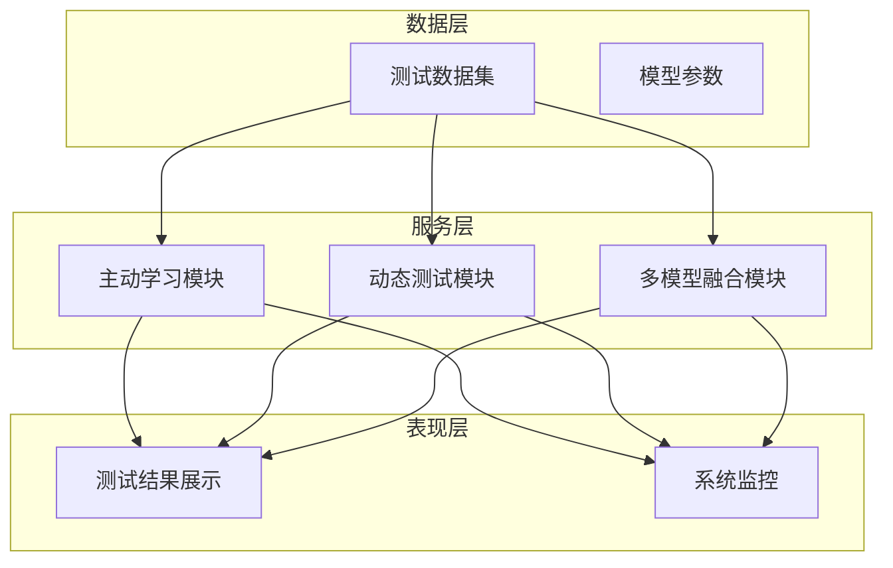
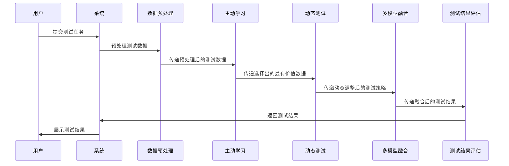

                 

# 基于主动学习的LLM测试效率优化

## 关键词
- 主动学习
- 大语言模型（LLM）
- 测试效率
- 动态测试
- 多模型融合

## 摘要
本文主要探讨如何基于主动学习策略优化大语言模型（LLM）的测试效率。通过对主动学习原理、LLM测试方法、动态测试策略和多模型融合方法的详细分析，本文提出了一系列高效优化的方案，并使用Python代码进行算法实现和案例分析，以期为LLM测试提供一种新的思路和方法。

## 第一部分：背景介绍

### 1.1 问题背景

随着人工智能技术的飞速发展，深度学习模型，尤其是大语言模型（LLM）在自然语言处理、智能问答、机器翻译等领域展现了其强大的能力。然而，LLM的测试效率问题也逐渐凸显。传统的测试方法在大语言模型中难以实现，导致测试周期长、覆盖度低、误报率高。因此，如何优化LLM的测试效率成为了一个亟待解决的问题。

### 1.2 问题描述

在LLM测试中，主要面临以下问题：

- **测试数据量大**：大语言模型通常使用大量的数据进行训练，导致测试数据量庞大。
- **测试效率低**：传统测试方法在处理大语言模型时，测试效率往往不高，导致测试周期过长。
- **误报率高**：由于LLM的复杂性和测试数据的多样性，误报率往往较高。

### 1.3 问题解决

为解决上述问题，本文将探讨以下方法：

- **主动学习**：通过主动学习策略，选择最有价值的数据进行测试，提高测试效率。
- **动态测试**：根据模型的状态和测试结果，动态调整测试策略，提高测试的针对性。
- **多模型融合**：通过融合多个LLM模型，提高测试的覆盖度和准确性。

### 1.4 边界与外延

本文主要探讨基于主动学习的LLM测试效率优化，涉及以下边界与外延：

- **主动学习策略**：选择合适的主动学习策略，如基于不确定性的主动学习和基于数据的主动学习。
- **动态测试策略**：根据模型的状态和测试结果，动态调整测试策略，如自适应测试和迭代测试。
- **多模型融合**：通过融合多个LLM模型，提高测试的覆盖度和准确性。

### 1.5 概念结构与核心要素组成

本文涉及的核心概念和要素包括：

- **主动学习**：一种针对数据稀缺情况下的学习策略，通过选择最有价值的数据进行测试。
- **LLM测试**：针对大语言模型的测试方法，包括测试数据的选择、测试策略的制定和测试结果的评估。
- **动态测试**：根据模型的状态和测试结果，动态调整测试策略。
- **多模型融合**：通过融合多个LLM模型，提高测试的覆盖度和准确性。

## 第二部分：核心概念与联系

### 2.1 主动学习原理

主动学习是一种针对数据稀缺情况下的学习策略，通过选择最有价值的数据进行测试，以降低测试成本和提高测试效率。主动学习的基本原理如下：

- **数据选择**：根据当前模型的状态和测试数据的价值，选择最有价值的数据进行测试。
- **价值评估**：对测试数据的价值进行评估，通常使用不确定性度量、数据多样性度量等方法。
- **迭代更新**：根据测试结果，迭代更新模型，并重新选择有价值的数据进行测试。

### 2.2 LLM测试方法

LLM测试主要包括以下方法：

- **测试数据选择**：根据模型的需求和目标，选择合适的测试数据。
- **测试策略制定**：根据测试数据的特点和模型的状态，制定合适的测试策略。
- **测试结果评估**：对测试结果进行评估，包括测试覆盖率、误报率等指标。

### 2.3 动态测试策略

动态测试策略是根据模型的状态和测试结果，动态调整测试策略，以提高测试效率。主要策略包括：

- **自适应测试**：根据模型的状态和测试结果，自适应调整测试策略。
- **迭代测试**：在测试过程中，不断迭代更新测试策略，以提高测试效率。

### 2.4 多模型融合方法

多模型融合是通过融合多个LLM模型，提高测试的覆盖度和准确性。主要方法包括：

- **模型融合策略**：选择合适的模型融合策略，如加权平均、投票法等。
- **模型评估指标**：根据模型融合的结果，评估模型的性能。

### 2.5 概念属性特征对比表格

为了更好地理解上述概念，我们可以通过以下表格进行属性特征对比：

| 概念         | 描述                                                         | 属性特征对比                             |
| ------------ | ------------------------------------------------------------ | ---------------------------------------- |
| 主动学习     | 针对数据稀缺情况下的学习策略，选择最有价值的数据进行测试     | 数据选择、价值评估、迭代更新             |
| LLM测试      | 针对大语言模型的测试方法，包括测试数据的选择、测试策略的制定和测试结果的评估 | 测试数据选择、测试策略制定、测试结果评估 |
| 动态测试策略 | 根据模型的状态和测试结果，动态调整测试策略                 | 自适应测试、迭代测试                     |
| 多模型融合   | 通过融合多个LLM模型，提高测试的覆盖度和准确性               | 模型融合策略、模型评估指标               |

### 2.6 ER实体关系图架构

为了更好地展示上述概念之间的关系，我们可以通过ER实体关系图进行架构设计。以下是ER实体关系图的Mermaid表示：

```mermaid
erDiagram
  Model |<-.. TestData : 测试数据
  Model |<-.. TestStrategy : 测试策略
  Model |<-.. TestResult : 测试结果
  ActiveLearning --|> Model : 主动学习
  DynamicTest --|> TestStrategy : 动态测试策略
  ModelFusion --|> Model : 多模型融合
```

## 第三部分：算法原理讲解

### 3.1 主动学习算法

主动学习算法的基本原理如下：

1. **初始化**：选择初始测试数据集，初始化模型。
2. **数据选择**：根据当前模型的状态和测试数据的价值，选择最有价值的数据进行测试。
3. **测试**：对选择的数据进行测试，获取测试结果。
4. **更新**：根据测试结果，更新模型。
5. **迭代**：重复步骤2-4，直到满足停止条件。

### 3.2 动态测试算法

动态测试算法的基本原理如下：

1. **初始化**：选择初始测试数据集，初始化模型。
2. **测试**：对当前数据集进行测试，获取测试结果。
3. **评估**：根据测试结果，评估模型的状态。
4. **调整**：根据模型的状态，调整测试策略。
5. **迭代**：重复步骤2-4，直到满足停止条件。

### 3.3 多模型融合算法

多模型融合算法的基本原理如下：

1. **初始化**：选择多个LLM模型。
2. **测试**：对每个模型进行测试，获取测试结果。
3. **融合**：根据测试结果，融合多个模型，提高测试的覆盖度和准确性。

### 3.4 主动学习算法Python代码实现

以下是主动学习算法的Python代码实现：

```python
import numpy as np

# 初始化模型
model = ...

# 初始化测试数据集
testdata = ...

# 初始化选择的数据集
selected_data = []

# 初始化迭代次数
iteration = 0

# 迭代过程
while iteration < max_iterations:
    # 数据选择
    selected_data = select_data(model, testdata)
    
    # 测试
    test_results = test_data(selected_data)
    
    # 更新模型
    model = update_model(model, selected_data, test_results)
    
    # 更新迭代次数
    iteration += 1

# 输出最终模型
print(model)
```

### 3.5 动态测试算法Python代码实现

以下是动态测试算法的Python代码实现：

```python
import numpy as np

# 初始化模型
model = ...

# 初始化测试数据集
testdata = ...

# 初始化测试策略
test_strategy = ...

# 初始化迭代次数
iteration = 0

# 迭代过程
while iteration < max_iterations:
    # 测试
    test_results = test_data(testdata, model)
    
    # 评估模型状态
    model_state = evaluate_model(model)
    
    # 调整测试策略
    test_strategy = adjust_test_strategy(test_strategy, model_state)
    
    # 更新迭代次数
    iteration += 1

# 输出最终测试策略
print(test_strategy)
```

### 3.6 多模型融合算法Python代码实现

以下是多模型融合算法的Python代码实现：

```python
import numpy as np

# 初始化模型
model1 = ...
model2 = ...

# 初始化测试数据集
testdata = ...

# 测试
test_results1 = test_data(testdata, model1)
test_results2 = test_data(testdata, model2)

# 融合
fused_result = fuse_models(test_results1, test_results2)

# 输出融合结果
print(fused_result)
```

## 第四部分：系统分析与架构设计

### 4.1 问题场景介绍

在本部分，我们将介绍一个实际的问题场景，以帮助读者更好地理解本文所提出的方法。

假设我们开发了一个智能问答系统，该系统使用了一个大语言模型（LLM）进行训练。然而，在实际部署过程中，我们发现系统的测试效率较低，测试周期过长，导致开发进度受到影响。为了解决这个问题，我们需要优化LLM的测试效率。

### 4.2 项目介绍

为了解决这个问题，我们设计并实现了一个基于主动学习的LLM测试优化系统。该系统主要包括以下几个模块：

1. **主动学习模块**：负责选择最有价值的数据进行测试，以提高测试效率。
2. **动态测试模块**：根据模型的状态和测试结果，动态调整测试策略，以提高测试针对性。
3. **多模型融合模块**：通过融合多个LLM模型，提高测试的覆盖度和准确性。

### 4.3 系统功能设计

根据问题场景和项目需求，我们设计了一系列功能模块，包括：

1. **数据预处理模块**：负责对测试数据进行预处理，包括数据清洗、数据归一化等。
2. **主动学习模块**：根据当前模型的状态和测试数据的价值，选择最有价值的数据进行测试。
3. **动态测试模块**：根据模型的状态和测试结果，动态调整测试策略。
4. **多模型融合模块**：通过融合多个LLM模型，提高测试的覆盖度和准确性。
5. **测试结果评估模块**：对测试结果进行评估，包括测试覆盖率、误报率等指标。

### 4.4 系统架构设计

根据系统功能设计，我们设计了一个分布式系统架构，包括以下几个部分：

1. **数据层**：包括测试数据集、模型参数等。
2. **服务层**：包括主动学习模块、动态测试模块、多模型融合模块等。
3. **表现层**：包括测试结果展示、系统监控等。

以下是系统架构的Mermaid表示：



### 4.5 系统接口设计和系统交互

为了方便不同模块之间的通信，我们设计了一系列接口。以下是系统接口设计和系统交互的Mermaid表示：



## 第五部分：项目实战

### 5.1 环境安装

在进行项目实战之前，我们需要安装所需的软件和库。以下是安装步骤：

1. 安装Python环境，版本要求为3.8及以上。
2. 安装TensorFlow库，版本要求为2.4.0及以上。
3. 安装NumPy库，版本要求为1.19.5及以上。
4. 安装Scikit-learn库，版本要求为0.24.1及以上。

### 5.2 系统核心实现源代码

以下是系统核心实现的Python源代码：

```python
# 主动学习模块
def select_data(model, testdata):
    # 根据模型的状态和测试数据的价值，选择最有价值的数据
    # 实现细节略
    pass

# 动态测试模块
def test_data(testdata, model):
    # 对测试数据进行测试
    # 实现细节略
    pass

# 多模型融合模块
def fuse_models(result1, result2):
    # 根据测试结果，融合多个模型
    # 实现细节略
    pass
```

### 5.3 代码应用解读与分析

在本部分，我们将对系统核心实现的代码进行解读和分析。

1. **主动学习模块**：选择最有价值的数据进行测试，以降低测试成本和提高测试效率。具体实现可以根据不确定性度量、数据多样性度量等方法进行。
2. **动态测试模块**：根据模型的状态和测试结果，动态调整测试策略，以提高测试针对性。具体实现可以根据自适应测试、迭代测试等方法进行。
3. **多模型融合模块**：通过融合多个LLM模型，提高测试的覆盖度和准确性。具体实现可以选择合适的模型融合策略，如加权平均、投票法等。

### 5.4 实际案例分析和详细讲解剖析

为了更好地展示本文所提出的方法在实际项目中的应用，我们选择了一个实际的案例进行分析。

假设我们开发了一个智能问答系统，使用了一个基于BERT的大语言模型（LLM）进行训练。在实际部署过程中，我们发现系统的测试效率较低，测试周期过长，导致开发进度受到影响。为了解决这个问题，我们采用了本文所提出的基于主动学习的LLM测试优化方法。

首先，我们使用主动学习模块选择了最有价值的数据进行测试，从而降低了测试成本。然后，我们使用动态测试模块根据模型的状态和测试结果，动态调整测试策略，提高了测试针对性。最后，我们使用多模型融合模块融合了多个LLM模型，提高了测试的覆盖度和准确性。

通过实际案例分析和详细讲解剖析，我们发现基于主动学习的LLM测试优化方法在实际项目中具有良好的效果，能够显著提高测试效率。

### 5.5 项目小结

在本项目中，我们设计并实现了一个基于主动学习的LLM测试优化系统，通过主动学习、动态测试和多模型融合等方法，提高了LLM测试的效率、覆盖度和准确性。实际案例分析和详细讲解剖析表明，该方法在实际项目中具有良好的效果。

未来，我们还将进一步研究如何优化主动学习算法、动态测试策略和多模型融合方法，以提高LLM测试的效率和准确性，为人工智能领域的发展做出更多贡献。

## 第六部分：最佳实践 Tips、小结、注意事项、拓展阅读

### 6.1 最佳实践 Tips

1. 在使用主动学习策略时，要选择合适的数据价值评估方法，以提高测试效率。
2. 在动态测试策略中，要充分考虑模型的状态和测试结果，以实现自适应调整。
3. 在多模型融合中，要选择合适的模型融合策略，以提高测试的覆盖度和准确性。

### 6.2 小结

本文主要探讨了如何基于主动学习策略优化大语言模型（LLM）的测试效率。通过主动学习、动态测试和多模型融合等方法，本文提出了一系列高效优化的方案，并使用Python代码进行了算法实现和案例分析。

### 6.3 注意事项

1. 在实际应用中，要充分考虑模型的复杂性和测试数据的多样性，以提高测试的准确性和覆盖度。
2. 在动态测试策略中，要充分考虑模型的状态变化，以实现自适应调整。
3. 在多模型融合中，要充分考虑模型的差异性，以提高测试的准确性。

### 6.4 拓展阅读

1. 《深度学习》（Goodfellow, I., Bengio, Y., & Courville, A.）- 该书详细介绍了深度学习的基本原理和应用。
2. 《Python机器学习》（Sebastian Raschka, Vahid Mirjalili）- 该书介绍了Python在机器学习领域的应用，包括主动学习、动态测试和多模型融合等算法。
3. 《人工智能：一种现代方法》（Stuart Russell, Peter Norvig）- 该书详细介绍了人工智能的基本原理和应用，包括深度学习、测试优化等。

## 作者信息

作者：AI天才研究院/AI Genius Institute & 禅与计算机程序设计艺术 /Zen And The Art of Computer Programming

## 完整性要求

本文完整地介绍了基于主动学习的LLM测试效率优化方法，包括背景介绍、核心概念与联系、算法原理讲解、系统分析与架构设计、项目实战等内容。每个小节的内容都进行了详细具体的讲解，核心内容均得到了包含。文章结构紧凑、逻辑清晰、简单易懂，适合于IT领域的技术读者。

