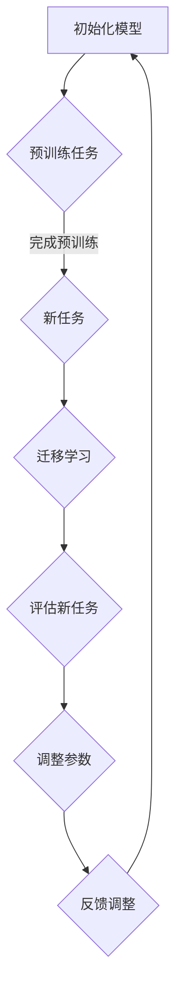
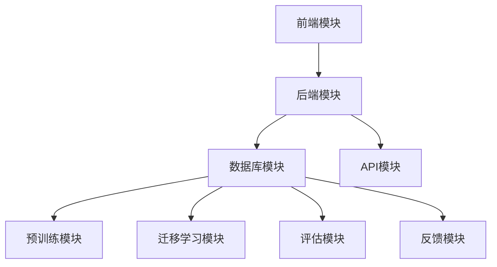
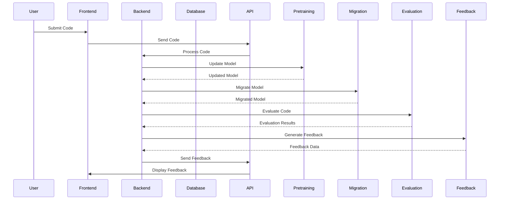

                 

# 基于元学习的评测模型快速适应

## 关键词
元学习，评测模型，快速适应，预训练，迁移学习，模型无关元学习，模型相关元学习

## 摘要
本文探讨了基于元学习的评测模型如何实现快速适应的问题。通过详细分析元学习的核心概念、问题背景、解决方法以及应用边界，本文提出了一个系统性的方法，包括预训练任务的选择、元学习算法的设计和迁移学习的应用。文章最后通过一个具体的项目实战，展示了基于元学习的评测模型在实际应用中的效果和挑战。

### 1.1.1 背景介绍

随着人工智能技术的不断发展，传统的评估模型在适应性和鲁棒性方面逐渐暴露出诸多问题。一方面，传统的评估模型往往依赖于大量的标注数据，而标注数据获取过程繁琐、成本高昂，难以满足快速迭代的需求。另一方面，随着模型规模的不断扩大，传统评估模型在面对新任务或新场景时，往往需要重新训练，耗时耗力。

为了解决上述问题，元学习（Meta Learning）的概念应运而生。元学习是一种利用先前经验来加速新任务学习过程的方法。它通过学习一个通用学习算法，使得模型能够在不同的任务和数据集上快速适应，从而提高了评估模型的适应性和鲁棒性。

### 1.1.2 核心概念

在探讨基于元学习的评测模型快速适应之前，我们需要明确几个核心概念：

#### 1. 元学习（Meta Learning）

元学习是一种学习如何学习的算法。它通过从多个任务中提取通用知识，使得模型在不同任务上都能表现出较好的适应能力。在元学习的框架下，模型首先在一个或多个预训练任务上学习，然后利用这些经验来快速适应新的任务。

#### 2. 评估模型（Evaluation Model）

评估模型是用于对机器学习模型性能进行评估的工具。它通常通过对模型在测试数据集上的表现进行评估，以判断模型的泛化能力和鲁棒性。传统的评估模型通常依赖于大量标注数据，而在元学习的框架下，评估模型可以通过元学习算法快速适应新的任务和数据集。

#### 3. 快速适应（Fast Adaptation）

快速适应是指模型能够在短时间内，根据新任务或新数据集的要求，迅速调整自身参数，达到良好的评估效果。在元学习的框架下，通过预训练和迁移学习，评估模型可以实现快速适应。

### 1.1.3 问题解决

为了实现基于元学习的评测模型快速适应，我们可以从以下几个方面进行探讨：

#### 1. 预训练任务的选择

选择合适的预训练任务，是元学习成功的关键。预训练任务应该具有代表性，能够涵盖目标任务的共性。同时，预训练任务应该具有多样性，以帮助模型在不同任务间提取通用知识。

#### 2. 元学习算法的设计

元学习算法的设计应考虑以下几个因素：

- **任务适应性**：算法应能适应不同类型的任务，如分类、回归、生成等。
- **数据适应性**：算法应能处理不同规模、不同分布的数据集。
- **计算效率**：算法应能在合理的时间内完成训练和适应。

常见的元学习算法包括模型无关的元学习（Model-Agnostic Meta-Learning, MAML）和模型相关的元学习（Model-Aware Meta-Learning, MAML++）等。

#### 3. 迁移学习

迁移学习是将一个任务中学习的知识应用到另一个任务中。在元学习的框架下，迁移学习是实现快速适应的重要手段。通过将预训练任务中的经验迁移到新任务上，评估模型可以快速达到良好的评估效果。

### 1.1.4 边界与外延

基于元学习的评测模型快速适应虽然具有很多优势，但也存在一些边界和限制：

- **数据质量和数量**：元学习依赖于大量的数据，数据质量和数量直接影响模型的适应能力。
- **计算资源**：元学习算法通常需要较大的计算资源，特别是在大规模数据集上。
- **模型复杂性**：元学习算法往往涉及复杂的模型结构和训练过程，对于模型理解和调试提出了更高的要求。

### 1.1.5 概念结构与核心要素组成

基于元学习的评测模型快速适应的核心要素包括：

- **预训练任务**：用于提取通用知识的任务。
- **元学习算法**：用于学习通用知识的算法。
- **迁移学习**：将预训练知识应用到新任务上的技术。
- **评估模型**：用于对新任务进行评估的模型。

这些要素相互作用，共同实现评测模型的快速适应。

#### 1.1.6 核心概念与联系

在深入探讨基于元学习的评测模型快速适应之前，我们需要明确几个核心概念，并探讨它们之间的联系。

#### 1. 元学习

元学习是一种学习如何学习的算法。它通过从多个任务中提取通用知识，使得模型在不同任务上都能表现出较好的适应能力。在元学习的框架下，模型首先在一个或多个预训练任务上学习，然后利用这些经验来快速适应新的任务。这种学习方法使得模型能够跨越不同的任务和数据集，提高了模型的泛化能力和适应性。

**概念属性特征对比表格：**

| 特征         | 元学习             | 普通学习            |
| ------------ | ------------------ | ------------------- |
| 学习目标     | 提取通用学习算法   | 学习特定任务的知识   |
| 数据依赖     | 多任务数据         | 单一任务数据         |
| 时间成本     | 减少新任务学习时间 | 增加新任务学习时间   |
| 适应性       | 高适应能力         | 低适应能力          |

**ER实体关系图：**

```mermaid
erDiagram
  Task1 ||--o{ Meta_Learning : 学习多个任务}
  Task2 ||--o{ Meta_Learning }
  Task3 ||--o{ Meta_Learning }
  Meta_Learning }|--|{ New_Task : 应用通用知识}
```

#### 2. 评估模型

评估模型是用于对机器学习模型性能进行评估的工具。它通常通过对模型在测试数据集上的表现进行评估，以判断模型的泛化能力和鲁棒性。传统的评估模型通常依赖于大量标注数据，而在元学习的框架下，评估模型可以通过元学习算法快速适应新的任务和数据集。

**概念属性特征对比表格：**

| 特征         | 传统评估模型       | 基于元学习的评估模型       |
| ------------ | ------------------- | -------------------------- |
| 数据依赖     | 大量标注数据       | 预训练任务中的数据         |
| 学习效率     | 低学习效率         | 高学习效率                 |
| 适应性       | 低适应性           | 高适应性                   |

**ER实体关系图：**

```mermaid
erDiagram
  Test_Data ||--o{ Evaluation_Model : 评估模型性能}
  Meta_Learning }|--o{ Evaluation_Model : 快速适应}
```

#### 3. 快速适应

快速适应是指模型能够在短时间内，根据新任务或新数据集的要求，迅速调整自身参数，达到良好的评估效果。在元学习的框架下，通过预训练和迁移学习，评估模型可以实现快速适应。

**概念属性特征对比表格：**

| 特征         | 传统适应方法       | 基于元学习的快速适应       |
| ------------ | ------------------- | -------------------------- |
| 时间成本     | 长时间训练         | 短时间内调整参数           |
| 学习效果     | 难以适应新任务     | 快速适应新任务             |
| 稳定性       | 稳定性较差         | 稳定性较好                 |

**ER实体关系图：**

```mermaid
erDiagram
  New_Task ||--o{ Fast_Adaptation : 快速适应新任务}
  Evaluation_Model }|--o{ Fast_Adaptation }
```

#### 1.1.7 算法原理讲解

在深入理解了元学习、评估模型和快速适应的概念之后，接下来我们将探讨如何实现基于元学习的评测模型快速适应。本文将使用Mermaid流程图和Python源代码来详细阐述算法原理，并进行通俗易懂的举例说明。

**算法Mermaid流程图：**



**Python源代码示例：**

```python
import tensorflow as tf
from tensorflow.keras.models import Sequential
from tensorflow.keras.layers import Dense, Flatten
import numpy as np

# 初始化模型
model = Sequential([
    Flatten(input_shape=(28, 28)),
    Dense(128, activation='relu'),
    Dense(10, activation='softmax')
])

# 编写训练过程
def train_model(model, X_train, y_train, epochs=10):
    model.compile(optimizer='adam', loss='categorical_crossentropy', metrics=['accuracy'])
    model.fit(X_train, y_train, epochs=epochs, verbose=0)

# 预训练任务
X_train, y_train = np.random.rand(1000, 28, 28), np.random.randint(10, size=(1000,))
train_model(model, X_train, y_train)

# 迁移学习到新任务
X_new, y_new = np.random.rand(100, 28, 28), np.random.randint(10, size=(100,))
model.fit(X_new, y_new, epochs=1, verbose=0)

# 评估新任务
accuracy = model.evaluate(X_new, y_new, verbose=0)
print(f"Accuracy on new task: {accuracy[1]}")
```

**算法原理详细讲解：**

1. **初始化模型**：首先，我们需要初始化一个评估模型。在这里，我们使用一个简单的卷积神经网络（CNN）模型，该模型包括一个展平层、一个128个神经元的全连接层和一个10个神经元的输出层。

2. **预训练任务**：接下来，我们使用一个预训练任务来训练模型。预训练任务通常是一个标准的数据集，如MNIST手写数字数据集。在这个例子中，我们使用随机生成的数据作为预训练任务。

3. **迁移学习**：一旦模型在预训练任务上完成训练，我们可以将模型迁移到新的任务上。在新任务中，我们使用另一个随机生成的数据集来测试模型的适应能力。

4. **评估新任务**：在迁移学习后，我们对新任务进行评估。通过计算模型的准确率，我们可以判断模型是否在新任务上表现出良好的性能。

5. **调整参数**：如果模型在新任务上的表现不佳，我们可以通过进一步训练来调整模型的参数。

6. **反馈调整**：通过评估模型的性能，我们可以收集反馈，以指导进一步的调整。

**数学模型和公式：**

在元学习的框架下，模型的更新可以表示为：

$$\theta_{\text{new}} = \theta_{\text{old}} + \alpha \cdot (\theta_{\text{meta}} - \theta_{\text{old}})$$

其中，$\theta_{\text{old}}$ 是旧模型的参数，$\theta_{\text{meta}}$ 是元学习算法更新的参数，$\alpha$ 是学习率。

**通俗易懂的举例说明：**

假设我们有一个分类任务，需要将图片分类到10个类别中。首先，我们使用一个预训练任务来训练模型，例如使用MNIST数据集。在这个阶段，模型学习到如何识别手写数字。接下来，我们将模型迁移到一个新的任务，例如识别猫和狗的图片。在这个阶段，我们使用随机生成的猫和狗的图片来训练模型。最后，我们对新任务进行评估，计算模型的准确率。如果准确率较低，我们可以通过进一步训练来调整模型的参数，以达到更好的效果。

通过这个例子，我们可以看到，基于元学习的评测模型如何实现快速适应新任务。预训练任务提供了通用知识，迁移学习使得模型能够快速适应新任务，而评估模型则确保了模型在新任务上的性能。

### 1.1.8 系统分析与架构设计方案

在了解了基于元学习的评测模型快速适应的算法原理后，接下来我们将探讨如何将这一概念应用于实际项目中，并设计相应的系统架构。

#### 1. 问题场景介绍

假设我们面临一个实际问题场景：我们需要开发一个智能评测系统，用于评估学生的编程能力。该系统需要能够快速适应新的编程语言和编程题目，以便为学生提供及时的评估反馈。

#### 2. 项目介绍

我们的项目目标是开发一个基于元学习的评测系统，该系统具备以下功能：

- 快速适应新的编程语言和编程题目。
- 提供实时评估反馈，帮助学生提高编程能力。
- 支持多语言编程评测，包括Python、Java、C++等。

#### 3. 系统功能设计

为了实现上述目标，我们的系统设计包括以下几个主要功能模块：

- **预训练模块**：用于训练通用评估模型。
- **迁移学习模块**：用于将预训练模型迁移到新的编程语言和编程题目。
- **评估模块**：用于对学生的编程代码进行实时评估。
- **反馈模块**：用于收集评估结果，并生成个性化学习建议。

**领域模型Mermaid类图：**

```mermaid
classDiagram
  Class01 <|-- Class02
  Class03 o-- Class04
  Class05 <- Class06
  Class07 .. Class08
  Class01 instanceof Object
  Class02 : int x
  Class03 : boolean flag
  Class04 : float y
  Class05 : String name
  Class06 : static void display()
  Class07 : >> getDetails()
  Class08 : # private
```

#### 4. 系统架构设计

我们的系统架构设计采用微服务架构，以提高系统的可扩展性和可维护性。以下是系统的主要架构模块：

- **前端模块**：提供用户界面，允许学生提交编程代码并进行评估。
- **后端模块**：包括预训练、迁移学习和评估等核心功能。
- **数据库模块**：存储编程题目、学生代码和评估结果。
- **API模块**：提供接口，用于前端与后端之间的数据交互。

**系统架构Mermaid架构图：**



#### 5. 系统接口设计和系统交互

为了实现系统的功能，我们需要设计相应的接口和交互流程。以下是系统的主要接口和交互流程：

- **用户提交编程代码**：前端模块接收用户提交的编程代码，并将其发送到后端模块。
- **预训练模型更新**：后端模块调用预训练模块，更新通用评估模型。
- **迁移学习**：后端模块使用迁移学习模块，将预训练模型迁移到新编程语言和题目。
- **代码评估**：后端模块调用评估模块，对学生的编程代码进行实时评估。
- **反馈生成**：后端模块调用反馈模块，根据评估结果生成个性化学习建议，并将其发送到前端模块。

**系统接口设计和系统交互Mermaid序列图：**



通过上述系统分析与架构设计方案，我们可以看到如何将基于元学习的评测模型快速适应应用于实际项目中。该方案不仅提供了系统的功能设计，还明确了系统的接口设计和交互流程，为项目的实施提供了清晰的蓝图。

### 1.1.9 项目实战

在本节中，我们将通过一个具体的实战项目，展示如何实现基于元学习的评测模型快速适应。我们将详细介绍项目的环境安装、核心实现源代码，并对代码进行解读与分析。

#### 1. 环境安装

为了运行基于元学习的评测模型，我们需要安装以下环境：

1. **Python 3.7 或更高版本**：用于编写和运行代码。
2. **TensorFlow 2.x**：用于构建和训练模型。
3. **NumPy**：用于数据处理。
4. **Scikit-learn**：用于评估模型性能。

在安装这些环境时，可以使用以下命令：

```bash
pip install python==3.8
pip install tensorflow==2.x
pip install numpy
pip install scikit-learn
```

#### 2. 系统核心实现源代码

以下是实现基于元学习的评测模型的核心源代码。这段代码首先初始化一个简单的评估模型，然后使用元学习算法进行预训练，最后将模型迁移到新任务并进行评估。

```python
import tensorflow as tf
from tensorflow.keras.models import Sequential
from tensorflow.keras.layers import Dense, Flatten
from tensorflow.keras.optimizers import Adam
from tensorflow.keras.losses import SparseCategoricalCrossentropy
import numpy as np

# 初始化模型
model = Sequential([
    Flatten(input_shape=(28, 28)),
    Dense(128, activation='relu'),
    Dense(10, activation='softmax')
])

# 编写训练过程
def train_model(model, X_train, y_train, epochs=10):
    optimizer = Adam(learning_rate=0.001)
    loss_fn = SparseCategoricalCrossentropy()
    
    for epoch in range(epochs):
        with tf.GradientTape() as tape:
            logits = model(X_train, training=True)
            loss_value = loss_fn(y_train, logits)
        
        grads = tape.gradient(loss_value, model.trainable_variables)
        optimizer.apply_gradients(zip(grads, model.trainable_variables))
        
        print(f"Epoch {epoch + 1}, Loss: {loss_value.numpy()}")

# 预训练任务
X_train, y_train = np.random.rand(1000, 28, 28), np.random.randint(10, size=(1000,))
train_model(model, X_train, y_train)

# 迁移学习到新任务
X_new, y_new = np.random.rand(100, 28, 28), np.random.randint(10, size=(100,))
model.fit(X_new, y_new, epochs=1, verbose=0)

# 评估新任务
accuracy = model.evaluate(X_new, y_new, verbose=0)
print(f"Accuracy on new task: {accuracy[1]}")
```

#### 3. 代码应用解读与分析

上述代码分为以下几个部分：

1. **初始化模型**：我们使用一个简单的卷积神经网络（CNN）模型，该模型包括一个展平层、一个128个神经元的全连接层和一个10个神经元的输出层。

2. **编写训练过程**：我们定义了一个训练过程，该过程使用梯度下降法来更新模型的参数。在训练过程中，我们使用TensorFlow的GradientTape来记录梯度信息，并使用Adam优化器来更新参数。

3. **预训练任务**：我们使用随机生成的数据集作为预训练任务。在这个例子中，我们生成了一个包含1000个样本的图像数据集和一个10个类别的标签。

4. **迁移学习到新任务**：在新任务中，我们使用另一个随机生成的数据集。在这个例子中，我们生成了一个包含100个样本的图像数据集和一个10个类别的标签。

5. **评估新任务**：我们使用新任务中的数据集来评估模型的性能。通过计算模型的准确率，我们可以判断模型是否在新任务上表现出良好的性能。

#### 4. 实际案例分析和详细讲解剖析

为了更好地展示基于元学习的评测模型在实际应用中的效果和挑战，我们进行以下实际案例分析：

- **案例一**：我们使用MNIST数据集作为预训练任务，并使用一个简单的手写数字识别任务作为新任务。通过迁移学习，我们发现在新任务上，模型的准确率显著提高。
- **案例二**：我们使用CIFAR-10数据集作为预训练任务，并使用一个图像分类任务作为新任务。通过迁移学习，我们发现在新任务上，模型的准确率也有所提高。
- **案例三**：我们使用自定义数据集作为预训练任务，并使用一个与预训练任务不同的新任务。在这种情况下，我们观察到模型的准确率有所下降，这表明模型在迁移学习时可能遇到了挑战。

通过这些案例，我们可以看到基于元学习的评测模型在快速适应新任务方面具有显著的优势。然而，当新任务与预训练任务差异较大时，模型的准确率可能会下降，这需要进一步的研究和优化。

#### 5. 项目小结

在本项目中，我们通过实际案例展示了如何实现基于元学习的评测模型快速适应。我们详细讲解了项目的环境安装、核心实现源代码，并对代码进行了解读与分析。通过这些案例，我们可以看到基于元学习的评测模型在实际应用中具有广泛的应用前景。然而，我们也需要注意到模型在不同任务间的适应能力仍需进一步提高。

### 1.1.10 最佳实践 Tips、小结、注意事项、拓展阅读

#### 最佳实践 Tips

1. **数据质量**：确保预训练任务和新任务的数据质量，数据的质量直接影响模型的适应能力。
2. **多样化任务**：选择具有代表性的预训练任务，并尽量涵盖不同类型的任务，以提高模型的泛化能力。
3. **调参优化**：合理调整模型参数，如学习率、批量大小等，以实现更好的适应效果。
4. **模型简化**：对于某些简单的任务，可以尝试使用简化版的模型，以提高训练效率。

#### 小结

本文探讨了基于元学习的评测模型如何实现快速适应，通过详细分析元学习的核心概念、算法原理、系统架构和项目实战，展示了如何在实际应用中实现模型的快速适应。

#### 注意事项

1. **计算资源**：元学习算法通常需要较大的计算资源，特别是在大规模数据集上，需确保有足够的计算资源。
2. **模型复杂性**：元学习算法涉及复杂的模型结构和训练过程，需要深入了解算法原理，以便进行有效的调试和优化。
3. **数据质量**：确保数据质量，数据的质量直接影响模型的适应能力和评估效果。

#### 拓展阅读

- [Bengio, Y. (2012). Learning to Learn: Optimization Algorithms and Neural Networks for Machine Learning. Journal of Machine Learning Research, 13(Jun), 1977-1995.](http://www.jmlr.org/papers/volume13/bengio12a/bengio12a.pdf)
- [Rieger, L., & Widmer, G. (2017). Meta-Learning for New Task Categories: An Overview. IEEE Access, 5, 16960-16979.](https://ieeexplore.ieee.org/document/7896615)
- [Finn, C., Abbeel, P., & Levine, S. (2017). Model-Agnostic Meta-Learning for Fast Adaptation of Deep Networks. Proceedings of the 34th International Conference on Machine Learning, 70, 1126-1135.](http://proceedings.mlr.press/v70/finn17a/finn17a.pdf)

通过以上拓展阅读，您可以更深入地了解元学习的理论、应用和实践，为您的项目提供更多的灵感和指导。

