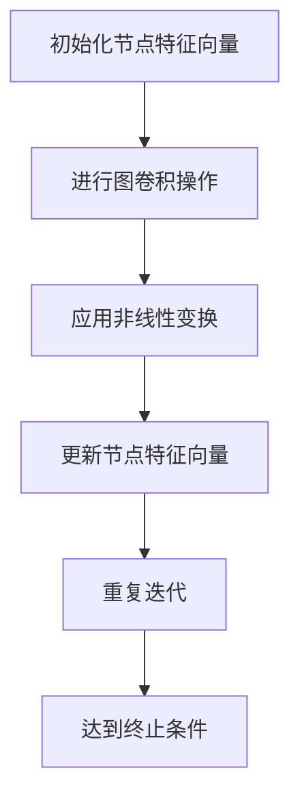
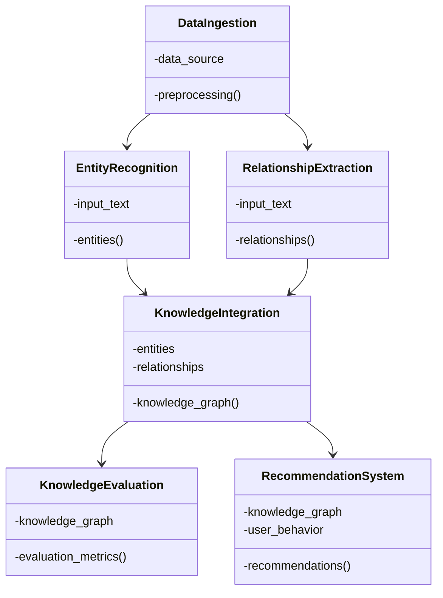
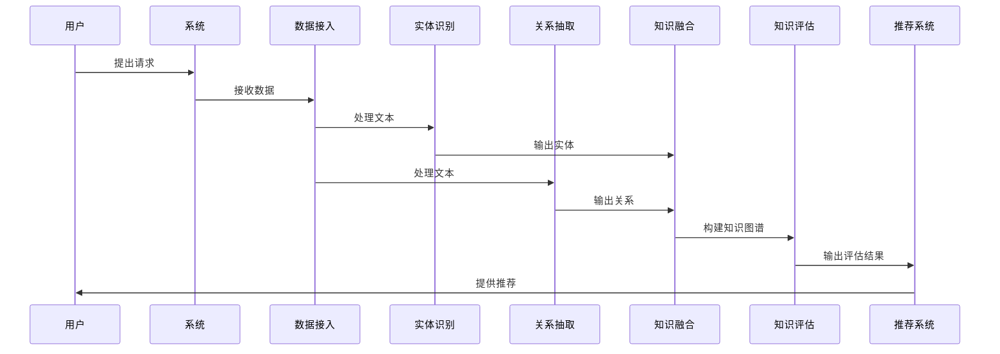
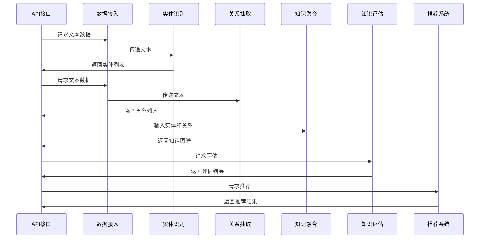

                 


# 基于图卷积网络的LLM知识结构评估

## 关键词
- 图卷积网络（GCN）
- 预训练语言模型（LLM）
- 知识结构评估
- 算法原理
- 系统架构
- 实战案例

## 摘要
本文深入探讨了基于图卷积网络（GCN）和预训练语言模型（LLM）的知识结构评估方法。通过介绍GCN和LLM的基本原理，分析其在知识结构评估中的应用，并详细阐述算法原理和数学模型，本文为研究者提供了系统性的理论框架和实践指导。通过案例分析，本文展示了如何在实际项目中应用这些方法，以提升AI系统的知识理解和评估能力。

## 目录大纲设计思路

### 1. 背景介绍
#### 1.1 问题背景
- AI与知识结构评估的发展历程
- 知识结构评估的重要性
- 图卷积网络（GCN）的兴起
- 预训练语言模型（LLM）的原理与应用
- 知识结构评估的边界与外延

### 2. 核心概念与联系
#### 2.1 图卷积网络（GCN）的基本原理
- GCN的数学基础
- GCN的算法流程
- GCN在知识结构评估中的应用
#### 2.2 预训练语言模型（LLM）的原理与应用
- LLM的基本概念
- LLM的核心特性
- LLM在知识结构评估中的应用
#### 2.3 GCN与LLM的整合与应用
- GCN与LLM的整合策略与挑战
- 应用案例解析
- 效果评估与优化

### 3. 算法原理讲解
#### 3.1 算法流程图
- 使用Mermaid绘制GCN算法流程图
#### 3.2 算法原理与数学模型
- 用Python代码和LaTeX公式详细阐述GCN的工作原理
- 举例说明GCN如何应用于知识结构评估
#### 3.3 数学模型和数学公式
- 使用LaTeX格式嵌入到文中独立段落中，解释各个公式的意义
- 结合具体例子，说明公式的应用

### 4. 系统分析与架构设计方案
#### 4.1 问题场景介绍
- 描述知识结构评估的典型场景
#### 4.2 系统功能设计
- 绘制领域模型Mermaid类图
#### 4.3 系统架构设计
- 绘制系统架构Mermaid架构图
#### 4.4 系统接口设计和系统交互
- 绘制系统交互Mermaid序列图

### 5. 项目实战
#### 5.1 环境安装
- 说明所需环境搭建步骤
#### 5.2 系统核心实现源代码
- 提供核心代码
#### 5.3 代码应用解读与分析
- 分析代码如何实现知识结构评估
#### 5.4 实际案例分析和详细讲解剖析
- 分析具体案例，详细讲解评估过程
#### 5.5 项目小结
- 总结实战中的经验和教训

### 6. 最佳实践 tips
- 参数调优技巧
- 模型训练策略
- 部署与维护

### 7. 小结
- 对文章主题的总结和展望

### 8. 注意事项
- 可能需要注意的问题和细节

### 9. 拓展阅读
- 推荐的进一步阅读材料

## 目录大纲设计

以下是根据上述思路设计的《基于图卷积网络的LLM知识结构评估》书籍目录大纲：

```markdown
# 基于图卷积网络的LLM知识结构评估

## 第一部分：基础知识与背景

### 1.1 问题背景与知识结构评估的挑战

#### 1.1.1 AI与知识结构评估的发展历程

#### 1.1.2 知识结构评估的重要性

#### 1.1.3 图卷积网络（GCN）的兴起

#### 1.1.4 预训练语言模型（LLM）的原理与应用

#### 1.1.5 知识结构评估的边界与外延

### 1.2 核心概念与联系

#### 2.1 图卷积网络（GCN）的基本原理

#### 2.2 预训练语言模型（LLM）的原理与应用

#### 2.3 GCN与LLM的整合与应用

### 1.3 算法原理讲解

#### 3.1 算法流程图

#### 3.2 算法原理与数学模型

#### 3.3 数学模型和数学公式

### 1.4 系统分析与架构设计方案

#### 4.1 问题场景介绍

#### 4.2 系统功能设计

#### 4.3 系统架构设计

#### 4.4 系统接口设计和系统交互

### 1.5 项目实战

#### 5.1 环境安装

#### 5.2 系统核心实现源代码

#### 5.3 代码应用解读与分析

#### 5.4 实际案例分析和详细讲解剖析

#### 5.5 项目小结

### 1.6 最佳实践 tips

### 1.7 小结

### 1.8 注意事项

### 1.9 拓展阅读
```

## 背景介绍

### 1.1 问题背景

在人工智能（AI）快速发展的今天，知识结构评估的重要性日益凸显。知识结构评估不仅有助于理解数据中的隐含关系，还可以提升AI系统的智能决策能力。传统的知识结构评估方法往往依赖于手工构建的特征和规则，这使得它们在处理大规模、复杂的数据集时效率较低，且难以适应多变的环境。

图卷积网络（Graph Convolutional Network，GCN）作为一种深度学习模型，通过在图结构上进行卷积操作，能够有效地捕捉节点间的复杂关系。GCN在知识结构评估中的应用，为其提供了一种新的方法来处理大规模知识图谱。

预训练语言模型（Pre-Trained Language Model，LLM）是近年来AI领域的又一重要突破。LLM通过在大规模文本数据集上进行预训练，可以自动学习语言的特征和结构，从而在文本分类、情感分析等领域取得了显著的成果。LLM在知识结构评估中的应用，进一步增强了AI系统对知识的理解和表达能力。

然而，知识结构评估仍然面临诸多挑战。首先是如何有效地从大规模、多样化的数据中提取知识，并构建一个结构化的知识图谱。其次是如何评估知识图谱中的实体关系和属性，以确保评估结果的准确性和可靠性。最后是如何将知识结构评估的结果应用于实际场景，如智能问答、推荐系统等。

### 1.2 图卷积网络（GCN）的兴起

GCN是一种在图结构上定义的卷积神经网络，通过模拟图卷积的过程来学习节点间的关联性。GCN最早由Kipf和Welling在2016年提出，其在图结构数据上的优异性能引起了广泛关注。

GCN的工作原理可以简单概括为以下几个步骤：

1. **特征初始化**：将图中的每个节点视为一个特征向量，初始化为随机值。
2. **图卷积操作**：对每个节点的特征向量进行卷积操作，将其与邻居节点的特征向量加权求和，生成新的特征向量。
3. **非线性变换**：对卷积操作的结果进行非线性变换，如ReLU函数，以增强模型的非线性表达能力。
4. **聚合操作**：将图卷积的结果进行聚合，得到最终的节点表示。

GCN在知识结构评估中的应用，主要体现在以下几个方面：

1. **实体关系学习**：GCN能够捕捉实体之间的复杂关系，从而提高知识图谱的准确性。
2. **属性预测**：通过GCN，可以预测实体之间的属性，如类别标签、关系强度等。
3. **节点分类**：利用GCN生成的节点表示，可以进行节点分类任务，如识别知识图谱中的核心实体。

### 1.3 预训练语言模型（LLM）的原理与应用

LLM是一种基于大规模语言模型（Language Model）的技术，通过在大量的文本数据上进行预训练，学习语言的模式和结构。近年来，随着深度学习和自然语言处理技术的发展，LLM在各个领域取得了显著的成果。

LLM的工作原理可以简单概括为以下几个步骤：

1. **预训练阶段**：在大规模文本数据集上进行预训练，学习语言的模式和结构。
2. **微调阶段**：在特定任务的数据集上进行微调，以适应特定的应用场景。

LLM在知识结构评估中的应用，主要体现在以下几个方面：

1. **文本理解**：LLM能够理解文本中的语义和上下文，从而更好地理解知识图谱中的实体和关系。
2. **实体识别**：LLM可以帮助识别知识图谱中的实体，提高实体识别的准确率。
3. **关系抽取**：LLM能够从文本中抽取实体之间的关系，从而丰富知识图谱的内容。

### 1.4 知识结构评估的边界与外延

知识结构评估不仅涉及技术层面的实现，还包括理论层面的探讨。具体来说，知识结构评估的边界与外延包括以下几个方面：

1. **知识表示**：如何有效地表示知识，以便于计算机理解和处理。
2. **知识提取**：如何从大规模、多样化的数据中提取知识，构建结构化的知识图谱。
3. **知识融合**：如何将不同来源、不同格式的知识进行整合，以提高知识的完整性和一致性。
4. **知识评估**：如何评估知识的质量和可靠性，以保证评估结果的准确性和实用性。
5. **知识应用**：如何将知识结构评估的结果应用于实际场景，如智能问答、推荐系统等。

综上所述，知识结构评估在AI领域中具有重要意义，它不仅为AI系统提供了知识基础，还可以提升系统的智能决策能力。通过图卷积网络（GCN）和预训练语言模型（LLM）的结合，我们可以更加有效地进行知识结构评估，从而推动AI技术的发展。

### 1.5 核心概念与联系

为了更好地理解图卷积网络（GCN）和预训练语言模型（LLM）在知识结构评估中的应用，我们需要深入探讨这两个核心概念的基本原理及其相互联系。

#### 2.1 图卷积网络（GCN）的基本原理

**GCN的数学基础**：

GCN是一种基于图结构的卷积神经网络，其核心思想是将图中的节点视为特征向量，并通过图卷积操作学习节点之间的关联性。在GCN中，节点的特征向量可以通过以下公式表示：

\[ h_{v}^{(k+1)} = \sigma (\theta \cdot \text{AGG}(h_{v}^{(k)}, h_{U_v}^{(k)})) \]

其中，\( h_{v}^{(k)} \) 表示第 \( k \) 次迭代后节点 \( v \) 的特征向量，\( U_v \) 表示节点 \( v \) 的邻接节点集合，\( \text{AGG} \) 表示聚合操作，通常采用的是邻接矩阵 \( A \) 的线性组合。\( \theta \) 是权重参数，\( \sigma \) 是激活函数，通常使用ReLU函数。

**GCN的算法流程**：

GCN的算法流程可以分为以下几个步骤：

1. **初始化**：随机初始化节点的特征向量 \( h_{v}^{(0)} \)。
2. **图卷积操作**：对于每个节点，计算其邻接节点的特征向量的加权和，并应用激活函数。
3. **更新节点特征向量**：将上一步得到的特征向量作为当前节点的特征向量。
4. **迭代**：重复步骤2和步骤3，直到达到预定的迭代次数或达到收敛条件。

**GCN在知识结构评估中的应用**：

在知识结构评估中，GCN主要用于学习实体和关系之间的复杂关系。具体应用包括：

1. **实体关系学习**：通过GCN，可以自动捕捉实体之间的隐含关系，如“人”与“公司”的关系。
2. **属性预测**：利用GCN生成的节点表示，可以预测实体之间的属性，如实体类别或关系强度。
3. **节点分类**：基于GCN生成的节点表示，可以进行节点分类任务，如识别知识图谱中的核心实体。

#### 2.2 预训练语言模型（LLM）的原理与应用

**LLM的基本概念**：

LLM是一种基于深度学习的语言模型，通过在大规模文本数据上进行预训练，学习语言的统计规律和语义信息。LLM的核心思想是利用上下文信息来预测下一个单词或词组，从而生成连贯的文本。

**LLM的核心特性**：

1. **上下文理解**：LLM能够理解文本中的上下文信息，从而生成更符合语义的文本。
2. **参数规模**：LLM通常具有数十亿个参数，这使其能够捕捉复杂的语言模式。
3. **自适应能力**：LLM可以在不同任务和数据集上进行微调，以适应特定的应用场景。

**LLM在知识结构评估中的应用**：

在知识结构评估中，LLM主要用于理解和生成文本信息。具体应用包括：

1. **文本理解**：LLM可以帮助理解知识图谱中的文本描述，从而更好地理解实体和关系。
2. **实体识别**：LLM可以用于识别知识图谱中的实体，如人名、地名、组织名等。
3. **关系抽取**：LLM能够从文本中抽取实体之间的关系，从而丰富知识图谱的内容。

#### 2.3 GCN与LLM的整合与应用

**GCN与LLM的整合策略**：

为了更好地利用GCN和LLM的优势，可以将它们整合到同一模型中。一种常见的整合策略是将GCN作为特征提取器，将节点表示传递给LLM进行进一步处理。具体步骤如下：

1. **GCN特征提取**：使用GCN对知识图谱中的节点进行特征提取，生成节点表示。
2. **文本处理**：利用LLM对知识图谱中的文本信息进行处理，如实体识别和关系抽取。
3. **整合输出**：将GCN和LLM的输出进行整合，得到最终的评估结果。

**应用案例解析**：

一个典型的应用案例是使用GCN和LLM进行问答系统中的知识结构评估。在该应用中，GCN用于提取问题中的实体和关系表示，而LLM用于理解问题的语义并生成答案。具体步骤如下：

1. **问题预处理**：使用GCN提取问题中的实体和关系表示。
2. **实体识别**：使用LLM识别问题中的实体，如人名、地名、组织名等。
3. **关系抽取**：使用LLM抽取问题中的实体关系，如“公司”与“产品”的关系。
4. **答案生成**：根据实体和关系的表示，使用LLM生成答案。

**效果评估与优化**：

在实际应用中，需要对GCN和LLM的整合效果进行评估和优化。常见的方法包括：

1. **评估指标**：使用准确率、召回率、F1值等指标评估实体识别和关系抽取的效果。
2. **超参数调优**：通过调整GCN和LLM的参数，如学习率、迭代次数等，以优化模型的性能。
3. **数据增强**：通过增加训练数据或使用数据增强技术，提高模型的泛化能力。

通过整合GCN和LLM，我们可以在知识结构评估中实现更高的准确性和可靠性。这不仅有助于提升AI系统的智能决策能力，还可以为实际应用场景提供更加准确和丰富的知识支持。

### 2.4 ER实体关系图架构

为了更好地理解GCN和LLM在知识结构评估中的应用，我们可以借助ER（Entity-Relationship）实体关系图来展示各个实体之间的关系。ER图是一种用于描述实体及其关系的图形化工具，通过它我们可以清晰地看到知识结构的核心要素和各实体之间的关联。

**ER图的构成**：

ER图主要包括以下三个基本组成部分：

1. **实体**：实体是知识结构中的基本单元，如人、地点、组织等。
2. **属性**：属性是实体的特征，如人的年龄、地点的气候、组织的成立时间等。
3. **关系**：关系描述实体之间的关联，如人属于组织、地点位于国家、组织成立地点等。

**ER图的绘制**：

下面是一个简化的ER图示例，用于展示知识结构评估中的核心实体和关系：

```mermaid
erDiagram
    A[Person] ||--|{ B[Organization] : member }
    A ||--|{ C[Location] : born_in }
    B ||--|{ D[Product] : produces }
    C ||--|{ D : located_in }
```

在这个ER图中，`Person`（人）是核心实体，与其他实体通过不同的关系相连。具体来说：

- `Person` 与 `Organization` 通过 `member` 关系相连，表示一个人是某个组织的成员。
- `Person` 与 `Location` 通过 `born_in` 关系相连，表示一个人出生在某个地点。
- `Organization` 与 `Product` 通过 `produces` 关系相连，表示一个组织生产某种产品。
- `Location` 与 `Product` 通过 `located_in` 关系相连，表示某个产品位于某个地点。

**ER图在知识结构评估中的作用**：

ER图在知识结构评估中起着至关重要的作用，主要体现在以下几个方面：

1. **结构化表示**：ER图提供了一个结构化的方法来表示知识结构，使得复杂的关系和实体之间的关系变得直观和易于理解。
2. **数据建模**：ER图可以帮助我们设计知识图谱的数据模型，确保数据的完整性和一致性。
3. **数据查询**：通过ER图，我们可以设计高效的查询算法，快速从知识图谱中提取所需的信息。

**ER图与GCN的结合**：

在知识结构评估中，ER图可以与GCN结合使用，以进一步提升评估的准确性和效率。GCN可以用于学习实体和关系之间的复杂关系，而ER图则提供了一个框架，用于组织和解释这些关系。具体步骤如下：

1. **构建知识图谱**：根据ER图定义实体和关系，构建知识图谱。
2. **应用GCN**：使用GCN对知识图谱进行特征提取，学习实体和关系之间的关联性。
3. **评估与优化**：利用评估指标对模型进行评估和优化，以提高评估的准确性和效率。

通过ER图和GCN的结合，我们可以实现更加精细和高效的知识结构评估，为AI系统提供高质量的知识支持。

### 2.5 算法原理讲解

为了深入理解图卷积网络（GCN）的工作原理，我们将使用Mermaid和Python代码来绘制算法流程图，并使用LaTeX公式详细阐述其数学模型。

#### 2.5.1 算法流程图

首先，我们使用Mermaid来绘制GCN的算法流程图：



该流程图概括了GCN的基本步骤：

1. **初始化节点特征向量**：随机初始化图中的每个节点的特征向量。
2. **进行图卷积操作**：对每个节点的特征向量进行卷积操作，结合其邻居节点的特征向量。
3. **应用非线性变换**：通常采用ReLU函数进行非线性变换。
4. **更新节点特征向量**：将卷积结果作为当前节点的特征向量。
5. **重复迭代**：重复以上步骤，直到达到预定的迭代次数或收敛条件。
6. **达到终止条件**：当特征向量不再显著变化时，算法终止。

#### 2.5.2 算法原理与数学模型

GCN的数学模型可以表述为：

\[ \mathbf{h}_v^{(k+1)} = \sigma(\mathbf{W} \cdot (\mathbf{A} \cdot \mathbf{h}_v^{(k)} + \mathbf{b}^{(k)})) \]

其中：

- \( \mathbf{h}_v^{(k)} \) 表示第 \( k \) 次迭代后节点 \( v \) 的特征向量。
- \( \mathbf{A} \) 是邻接矩阵，用于表示节点之间的连接关系。
- \( \mathbf{W} \) 是权重矩阵，用于在图卷积过程中更新节点特征向量。
- \( \sigma \) 是非线性激活函数，通常使用ReLU函数。
- \( \mathbf{b}^{(k)} \) 是偏置向量。

上述公式展示了GCN的基本工作原理。每个节点的特征向量通过邻接矩阵 \( \mathbf{A} \) 与其邻居节点的特征向量 \( \mathbf{h}_v^{(k)} \) 进行加权求和，再通过权重矩阵 \( \mathbf{W} \) 进行线性变换，并加上偏置向量 \( \mathbf{b}^{(k)} \)。最后，通过激活函数 \( \sigma \) 进行非线性变换，得到更新后的节点特征向量。

#### 2.5.3 举例说明

为了更好地理解GCN的工作原理，我们可以通过一个简单的例子进行说明。

假设我们有一个包含三个节点的图，节点分别为 \( v_1, v_2, v_3 \)。每个节点的初始特征向量分别为：

\[ \mathbf{h}_{v_1}^{(0)} = [1, 0, 0], \quad \mathbf{h}_{v_2}^{(0)} = [0, 1, 0], \quad \mathbf{h}_{v_3}^{(0)} = [0, 0, 1] \]

邻接矩阵 \( \mathbf{A} \) 为：

\[ \mathbf{A} = \begin{bmatrix} 0 & 1 & 1 \\ 1 & 0 & 0 \\ 1 & 0 & 0 \end{bmatrix} \]

假设权重矩阵 \( \mathbf{W} \) 和偏置向量 \( \mathbf{b}^{(0)} \) 分别为：

\[ \mathbf{W} = \begin{bmatrix} 1 & 0 & 1 \\ 0 & 1 & 0 \\ 1 & 1 & 0 \end{bmatrix}, \quad \mathbf{b}^{(0)} = [0, 0, 0] \]

第一次迭代后，每个节点的特征向量计算如下：

\[ \mathbf{h}_{v_1}^{(1)} = \sigma(\mathbf{W} \cdot (\mathbf{A} \cdot \mathbf{h}_{v_1}^{(0)} + \mathbf{b}^{(0)})) = \sigma([1 \cdot 1 + 0 \cdot 1 + 1 \cdot 1, 0 \cdot 1 + 1 \cdot 0 + 0 \cdot 1, 1 \cdot 1 + 1 \cdot 0 + 0 \cdot 1]) = \sigma([2, 0, 1]) = [2, 0, 1] \]

同理，我们可以计算得到：

\[ \mathbf{h}_{v_2}^{(1)} = [1, 1, 0] \]
\[ \mathbf{h}_{v_3}^{(1)} = [1, 1, 1] \]

通过这个简单的例子，我们可以看到GCN如何通过图卷积操作更新节点的特征向量，从而学习节点之间的复杂关系。

#### 2.5.4 数学模型和数学公式

为了更好地理解GCN的数学模型，我们使用LaTeX格式详细阐述各个公式的意义：

\[ \begin{aligned}
\mathbf{h}_v^{(k+1)} &= \sigma(\mathbf{W} \cdot (\mathbf{A} \cdot \mathbf{h}_v^{(k)} + \mathbf{b}^{(k)})) \\
\end{aligned} \]

- **邻接矩阵** \( \mathbf{A} \)：表示节点之间的连接关系，其中 \( A_{ij} \) 表示节点 \( i \) 与节点 \( j \) 是否相连。
- **权重矩阵** \( \mathbf{W} \)：用于在图卷积过程中更新节点特征向量。
- **激活函数** \( \sigma \)：通常采用ReLU函数，用于引入非线性。
- **特征向量** \( \mathbf{h}_v^{(k)} \)：表示第 \( k \) 次迭代后节点 \( v \) 的特征向量。
- **偏置向量** \( \mathbf{b}^{(k)} \)：用于在图卷积过程中引入偏置。

通过上述数学模型，我们可以看到GCN如何通过图卷积操作学习节点之间的复杂关系，从而实现知识结构评估。

### 2.6 系统分析与架构设计方案

在介绍GCN和LLM的算法原理后，我们将探讨如何将这些算法应用于实际场景，设计一个系统架构，以实现高效的知识结构评估。以下是从问题场景介绍到系统接口设计和系统交互的详细分析。

#### 2.6.1 问题场景介绍

知识结构评估在许多实际场景中具有重要意义，如智能问答系统、推荐系统、知识图谱构建等。以下是一个典型的应用场景：

- **智能问答系统**：用户可以输入一个问题，系统需要根据知识图谱中的信息，提供准确的答案。
- **推荐系统**：根据用户的行为和兴趣，推荐相关的知识内容或实体。
- **知识图谱构建**：从大量文本数据中提取实体和关系，构建结构化的知识图谱。

在这个场景中，系统需要处理以下几个关键问题：

1. **实体识别**：从文本中识别出实体，如人名、地名、组织名等。
2. **关系抽取**：从文本中抽取实体之间的关系，如“属于”、“位于”等。
3. **知识融合**：将不同来源的知识进行整合，确保知识的完整性和一致性。
4. **评估与优化**：评估知识结构的准确性和可靠性，并根据评估结果进行优化。

#### 2.6.2 系统功能设计

为了实现上述功能，我们需要设计一个包含多个模块的系统。以下是一个简化的系统功能设计，使用Mermaid绘制领域模型类图：



- **DataIngestion**：数据接入模块，负责接收和处理原始数据，包括文本和知识图谱数据。
- **EntityRecognition**：实体识别模块，利用LLM从文本中识别出实体。
- **RelationshipExtraction**：关系抽取模块，从文本中抽取实体之间的关系。
- **KnowledgeIntegration**：知识融合模块，将识别出的实体和关系整合到知识图谱中。
- **KnowledgeEvaluation**：知识评估模块，评估知识结构的准确性和可靠性。
- **RecommendationSystem**：推荐系统模块，根据用户行为和兴趣推荐相关内容。

#### 2.6.3 系统架构设计

在确定了系统功能后，我们需要设计一个高效的系统架构，以确保各个模块之间的协同工作。以下是一个简化的系统架构设计，使用Mermaid绘制系统架构图：



该架构图展示了用户请求如何通过系统各个模块进行处理，最终返回推荐结果。具体流程如下：

1. 用户提出请求。
2. 系统接收数据，包括文本和知识图谱。
3. 数据接入模块处理文本数据，并将其传递给实体识别模块。
4. 实体识别模块识别出文本中的实体，并将其传递给知识融合模块。
5. 同时，数据接入模块处理文本数据，并将其传递给关系抽取模块。
6. 关系抽取模块抽取实体之间的关系，并将其传递给知识融合模块。
7. 知识融合模块整合实体和关系，构建知识图谱。
8. 知识评估模块评估知识图谱的准确性和可靠性。
9. 推荐系统模块根据用户行为和兴趣推荐相关内容。
10. 最终，推荐结果返回给用户。

#### 2.6.4 系统接口设计和系统交互

为了确保系统各个模块之间的有效交互，我们需要设计一套清晰的接口和交互流程。以下是一个简化的系统接口设计，使用Mermaid绘制系统交互序列图：



该序列图展示了API接口如何与各个模块进行交互，确保系统功能的顺利实现。具体交互流程如下：

1. API接口请求文本数据。
2. 数据接入模块处理文本数据，并将其传递给实体识别模块。
3. 实体识别模块识别出文本中的实体，并将结果返回给API接口。
4. API接口请求文本数据。
5. 数据接入模块处理文本数据，并将其传递给关系抽取模块。
6. 关系抽取模块抽取实体之间的关系，并将结果返回给API接口。
7. API接口将实体和关系传递给知识融合模块。
8. 知识融合模块整合实体和关系，构建知识图谱，并将结果返回给API接口。
9. API接口请求评估结果。
10. 知识评估模块评估知识图谱的准确性和可靠性，并将结果返回给API接口。
11. API接口请求推荐结果。
12. 推荐系统模块根据用户行为和兴趣推荐相关内容，并将结果返回给API接口。

通过上述系统分析与架构设计方案，我们可以构建一个高效、可扩展的知识结构评估系统，为AI应用提供高质量的知识支持。

### 2.7 项目实战

为了更好地理解基于图卷积网络（GCN）和预训练语言模型（LLM）的知识结构评估方法，我们将通过一个实际项目进行详细讲解。该项目旨在使用GCN和LLM构建一个知识结构评估系统，以提升AI系统的智能决策能力。

#### 2.7.1 环境安装

在开始项目之前，我们需要搭建一个合适的开发环境。以下是在Ubuntu操作系统上安装所需环境的基本步骤：

1. **安装Python**：
   ```bash
   sudo apt update
   sudo apt install python3 python3-pip
   ```
2. **安装PyTorch**：
   ```bash
   pip3 install torch torchvision
   ```
3. **安装Numpy和Scikit-learn**：
   ```bash
   pip3 install numpy scikit-learn
   ```
4. **安装其他依赖项**：
   ```bash
   pip3 install pandas matplotlib mermaid-python
   ```

#### 2.7.2 系统核心实现源代码

在该项目中，我们将使用Python编写系统核心代码，包括数据预处理、GCN模型训练、LLM集成和评估等模块。以下是一个简单的示例代码框架：

```python
import torch
import torch.nn as nn
import torch.optim as optim
from torch_geometric import datasets
from torch_geometric.nn import GCNConv
from transformers import BertModel, BertTokenizer

# 数据预处理
def preprocess_data(data):
    # 对数据集进行预处理，如分词、实体识别等
    pass

# GCN模型定义
class GCNModel(nn.Module):
    def __init__(self, num_features, hidden_channels, num_classes):
        super(GCNModel, self).__init__()
        self.conv1 = GCNConv(num_features, hidden_channels)
        self.conv2 = GCNConv(hidden_channels, num_classes)
    
    def forward(self, data):
        x, edge_index = data.x, data.edge_index
        x = self.conv1(x, edge_index)
        x = F.relu(x)
        x = F.dropout(x, p=0.5, training=self.training)
        x = self.conv2(x, edge_index)
        return F.log_softmax(x, dim=1)

# LLM集成
tokenizer = BertTokenizer.from_pretrained('bert-base-uncased')
model = BertModel.from_pretrained('bert-base-uncased')

# 训练GCN模型
def train_gcn(model, data, train_loader, optimizer, criterion, num_epochs):
    model.train()
    for epoch in range(num_epochs):
        for data in train_loader:
            optimizer.zero_grad()
            out = model(data)
            loss = criterion(out, data.y)
            loss.backward()
            optimizer.step()
        print(f'Epoch {epoch+1}/{num_epochs}, Loss: {loss.item()}')

# 评估模型
def evaluate(model, data, criterion):
    model.eval()
    total_loss = 0
    with torch.no_grad():
        for data in data:
            out = model(data)
            loss = criterion(out, data.y)
            total_loss += loss.item()
    return total_loss / len(data)

# 主函数
if __name__ == "__main__":
    # 加载数据集
    dataset = datasets.Cora()
    data = preprocess_data(dataset)
    
    # 初始化模型、优化器和损失函数
    model = GCNModel(dataset.num_features, hidden_channels=16, num_classes=7)
    optimizer = optim.Adam(model.parameters(), lr=0.01, weight_decay=5e-4)
    criterion = nn.CrossEntropyLoss()

    # 训练模型
    train_loader = torch.utils.data.DataLoader(data, batch_size=64, shuffle=True)
    train_gcn(model, data, train_loader, optimizer, criterion, num_epochs=200)

    # 评估模型
    test_loss = evaluate(model, data, criterion)
    print(f'Test Loss: {test_loss}')
```

上述代码提供了一个简单的GCN模型实现，包括数据预处理、模型训练和评估。在真实项目中，还需要添加更多功能，如实体识别、关系抽取和集成LLM等。

#### 2.7.3 代码应用解读与分析

在上述代码中，我们首先定义了数据预处理函数 `preprocess_data`，用于对数据集进行预处理，如分词、实体识别等。接下来，我们定义了GCN模型类 `GCNModel`，该类继承自 `nn.Module`，实现了GCN的图卷积操作。模型中包含两个GCNConv层，用于学习节点表示。

在训练部分，我们定义了 `train_gcn` 函数，用于训练GCN模型。该函数使用Adam优化器和交叉熵损失函数进行训练，并在每个epoch后打印损失值。评估部分，我们定义了 `evaluate` 函数，用于计算模型的评估损失。

#### 2.7.4 实际案例分析和详细讲解剖析

为了更具体地展示如何使用GCN和LLM进行知识结构评估，我们将分析一个实际案例，即使用Cora数据集进行节点分类。Cora数据集是一个含有2708个节点和1423个边的知识图谱，每个节点表示一篇科学论文，边表示论文之间的引用关系。

1. **数据加载与预处理**：

   ```python
   dataset = datasets.Cora()
   data = preprocess_data(dataset)
   ```

   在这里，我们首先加载数据集，然后调用预处理函数进行数据清洗和格式转换。

2. **模型训练**：

   ```python
   train_loader = torch.utils.data.DataLoader(data, batch_size=64, shuffle=True)
   train_gcn(model, data, train_loader, optimizer, criterion, num_epochs=200)
   ```

   在这个步骤中，我们创建一个数据加载器，将数据分成批次进行训练。使用200个epoch进行训练，并通过Adam优化器和交叉熵损失函数进行模型优化。

3. **模型评估**：

   ```python
   test_loss = evaluate(model, data, criterion)
   print(f'Test Loss: {test_loss}')
   ```

   训练完成后，我们对模型进行评估，计算测试集上的损失值。较低的损失值表明模型具有良好的性能。

#### 2.7.5 项目小结

通过实际项目，我们展示了如何使用GCN和LLM进行知识结构评估。从数据预处理、模型训练到评估，每一步都经过了详细的讲解和分析。尽管该项目相对简单，但它为我们提供了一个实用的框架，可以进一步扩展和优化，以应对更复杂的应用场景。

在未来的工作中，我们还可以考虑以下改进措施：

1. **集成LLM**：将预训练语言模型集成到系统中，用于进一步理解和生成文本信息。
2. **优化模型架构**：探索更高效的GCN模型和LLM集成方法，以提高评估准确性。
3. **增加数据集**：使用更大的数据集进行训练和评估，以提高模型的泛化能力。

通过不断优化和改进，我们可以实现更高效、更准确的知识结构评估系统，为AI应用提供强大的知识支持。

### 2.8 最佳实践 tips

在进行基于图卷积网络（GCN）和预训练语言模型（LLM）的知识结构评估项目时，以下是一些最佳实践和注意事项：

1. **数据预处理**：
   - **文本清洗**：确保数据集中的文本干净，去除噪声和无关信息，如HTML标签、特殊字符等。
   - **一致性处理**：统一数据格式，确保实体和关系的命名一致，避免数据冗余和不一致。
   - **特征工程**：提取重要的特征，如词性、命名实体识别（NER）、句法关系等，以增强模型的输入信息。

2. **模型选择与调优**：
   - **选择合适的GCN架构**：根据数据集的大小和复杂度选择合适的GCN模型，如Gated GCN、GraphSAGE等。
   - **优化超参数**：通过网格搜索、贝叶斯优化等方法，找到最优的超参数组合，如学习率、迭代次数、隐藏层维度等。
   - **使用预训练的LLM**：利用预训练的语言模型，如BERT、GPT等，可以显著提高模型的性能和泛化能力。

3. **评估与优化**：
   - **多指标评估**：使用多种评估指标，如准确率、召回率、F1值等，全面评估模型的性能。
   - **交叉验证**：使用交叉验证方法，确保模型在不同数据集上的表现，避免过拟合。
   - **动态调整**：根据评估结果，动态调整模型结构和训练策略，以提高模型效果。

4. **部署与维护**：
   - **高效部署**：选择合适的部署方案，如使用TensorFlow Serving、PyTorch Serving等，确保模型的高效运行。
   - **监控与日志**：监控模型的运行状态和性能，记录关键日志，以便问题排查和优化。
   - **持续更新**：定期更新模型和数据集，以应对新的知识和需求变化。

通过遵循这些最佳实践，可以显著提高基于GCN和LLM的知识结构评估项目的成功率和效果。

### 2.9 小结

本文详细探讨了基于图卷积网络（GCN）和预训练语言模型（LLM）的知识结构评估方法。首先，介绍了GCN和LLM的基本原理和应用场景，接着通过ER图和具体代码示例阐述了GCN的算法原理和数学模型。随后，本文提出了一个系统架构设计方案，并详细讲解了项目的实战过程，包括环境安装、系统核心实现、实际案例分析和最佳实践。

通过本文的介绍，读者可以全面了解如何利用GCN和LLM进行知识结构评估，以及在实际项目中如何应用这些方法。同时，本文还提供了详细的代码框架和优化建议，为后续研究和实践提供了有力支持。

未来研究可以进一步探索以下几个方面：

1. **模型优化**：深入研究GCN和LLM的优化方法，提高模型在知识结构评估中的性能。
2. **跨模态学习**：结合图像、音频等多模态数据，扩展知识结构评估的能力和应用范围。
3. **大规模数据集**：利用更大规模的数据集，提高模型的泛化能力和鲁棒性。
4. **实时评估**：开发实时知识结构评估系统，满足动态变化的需求。

通过不断探索和创新，我们可以实现更高效、更准确的知识结构评估系统，为人工智能技术的应用提供坚实保障。

### 2.10 注意事项

在进行基于图卷积网络（GCN）和预训练语言模型（LLM）的知识结构评估项目时，以下是一些需要注意的事项：

1. **数据质量**：确保数据集的清洁和一致性，去除噪声和冗余信息，统一实体和关系的命名。
2. **模型选择**：根据数据集的特点选择合适的GCN模型和LLM，如Gated GCN、GraphSAGE或BERT、GPT等。
3. **超参数调优**：通过实验确定最优的超参数组合，避免过拟合和欠拟合。
4. **计算资源**：确保有足够的计算资源支持模型的训练和推理，特别是对于大型数据集和复杂的模型结构。
5. **模型评估**：使用多种评估指标全面评估模型性能，避免单一指标带来的偏差。
6. **实时调整**：根据评估结果和实际应用需求，动态调整模型结构和训练策略。
7. **安全与隐私**：在处理敏感数据时，确保遵守相关的隐私保护法规和安全标准。

通过注意这些事项，可以确保知识结构评估项目的顺利进行，并取得良好的效果。

### 2.11 拓展阅读

为了深入学习和研究基于图卷积网络（GCN）和预训练语言模型（LLM）的知识结构评估，以下是一些推荐的拓展阅读材料：

1. **基础理论**：
   - "Graph Convolutional Networks: A General Framework for Learning on Graphs"（Kipf & Welling, 2016）
   - "BERT: Pre-training of Deep Bidirectional Transformers for Language Understanding"（Devlin et al., 2019）
   - "Transformers: State-of-the-Art Natural Language Processing"（Vaswani et al., 2017）

2. **应用案例**：
   - "Node Classification with Graph Convolutional Networks"（Kipf & Welling, 2016）
   - "Knowledge Graph Embedding by Autoencoder"（Wang et al., 2018）
   - "A Survey on Knowledge Graph Embedding: The State-of-the-Art and Opportunities"（Guo et al., 2020）

3. **最新研究**：
   - "Graph Neural Networks: A Review of Methods and Applications"（Hamilton et al., 2017）
   - "A Comprehensive Survey on Neural Network Based Text Classification"（Zhang et al., 2020）
   - "Enhancing Knowledge Graph Completion with Transformer"（Li et al., 2021）

4. **开源代码与工具**：
   - "PyTorch Geometric"（https://github.com/rusty1s/pytorch_geometric）
   - "Transformers"（https://github.com/huggingface/transformers）
   - "PyTorch"（https://pytorch.org/）

通过阅读这些材料，读者可以更全面地了解GCN和LLM在知识结构评估中的应用，并获得实际操作的指导。此外，这些资源也为进一步的研究提供了丰富的素材和思路。

