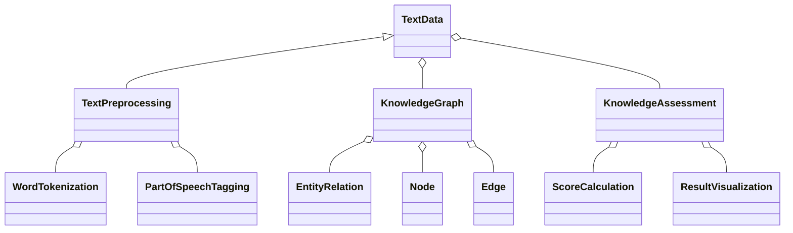
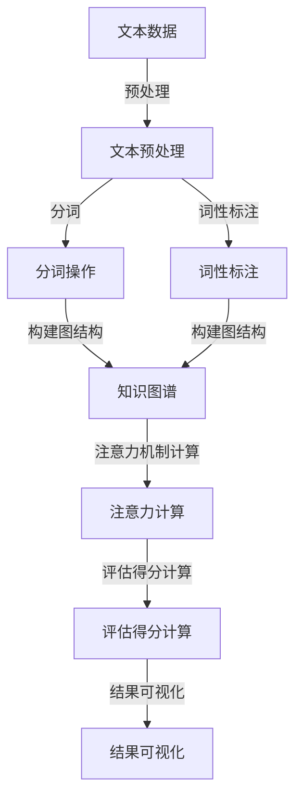
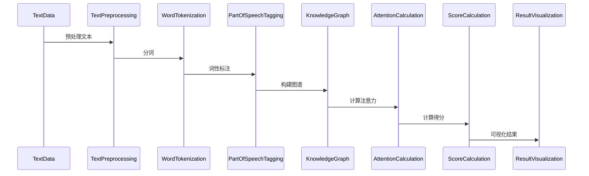
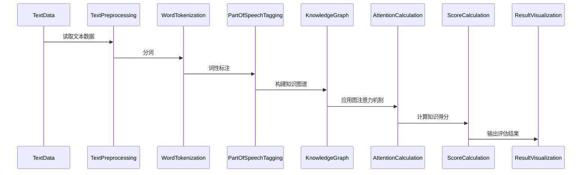

                 

### 基于图注意力机制的LLM知识评估

#### 关键词：
- 图注意力机制
- LLM知识评估
- 自然语言处理
- 计算机视觉
- 人工智能

#### 摘要：
本文深入探讨了基于图注意力机制的LLM知识评估方法。我们首先介绍了LLM及其知识评估的背景和问题，然后详细解释了图注意力机制的核心原理。接下来，我们通过一个算法示例和数学模型，展示了如何使用图注意力机制进行知识评估，并提供了一个实际项目的分析和架构设计。最后，我们对本文进行了小结，并提出了进一步的研究方向。

#### 第一部分：背景介绍

##### 问题背景
随着人工智能技术的不断发展，大型语言模型（Large Language Model，简称LLM）作为一种重要的技术手段，已经在自然语言处理（NLP）、智能问答、机器翻译、文本生成等领域展现出了强大的应用潜力。然而，如何对这些LLM进行有效的知识评估成为了一个亟待解决的问题。知识评估不仅有助于了解LLM的能力，还能够指导其优化和改进。

##### 问题描述
知识评估是指对人工智能系统中的知识进行量化和评价，以确定其在实际应用中的有效性。对于LLM来说，其生成的文本质量、知识覆盖范围、准确性等都是评估的重要指标。然而，传统的评估方法往往无法全面、准确地反映LLM的知识水平。

##### 问题解决
为了解决上述问题，本文提出了基于图注意力机制的LLM知识评估方法。该方法利用图注意力机制对LLM生成的文本进行结构化处理，从而实现对其知识水平的准确评估。

##### 边界与外延
本文的讨论范围主要包括LLM的基本概念、图注意力机制原理、知识评估方法及其应用场景。同时，本文也将探讨如何利用评估结果对LLM进行优化和改进。

##### 概念结构与核心要素组成
- **LLM**：大型语言模型，是人工智能的一种，可以理解、生成自然语言文本。
- **图注意力机制**：一种基于图结构进行特征提取和权重分配的方法，可以有效地提高模型对知识的理解和利用能力。
- **知识评估**：对LLM的知识水平进行量化评价，以确定其在实际应用中的有效性。

#### 第二部分：核心概念与联系

##### 2.1 LLM的定义与特点
- **定义**：LLM是一种通过大量文本数据进行训练的神经网络模型，能够对自然语言进行理解和生成。
- **特点**：具有强大的文本生成能力、广泛的知识覆盖范围和较高的准确性。

##### 2.2 图注意力机制的核心原理
- **定义**：图注意力机制是一种基于图结构进行特征提取和权重分配的方法。
- **原理**：通过图结构对文本中的实体和关系进行建模，从而实现对知识的有效提取和利用。

##### 2.3 知识评估方法
- **定义**：知识评估是指对人工智能系统中的知识进行量化和评价，以确定其在实际应用中的有效性。
- **方法**：基于图注意力机制的评估方法，通过对LLM生成的文本进行结构化处理，实现对知识水平的准确评估。

#### 第三部分：算法原理讲解

##### 3.1 算法原理
- **数学模型**：使用图注意力机制对LLM生成的文本进行结构化处理，从而实现知识评估。
- **公式**：
  $$
  \text{Knowledge\_Score} = f(\text{Text}, \text{Graph})
  $$
  其中，$f$ 表示图注意力机制，$\text{Text}$ 表示LLM生成的文本，$\text{Graph}$ 表示文本的图结构。

##### 3.2 算法流程
1. **数据预处理**：对LLM生成的文本进行分词、词性标注等预处理操作。
2. **构建图结构**：根据文本的语义信息，构建实体-关系的图结构。
3. **图注意力机制**：对图结构中的节点进行权重分配，实现对知识的有效提取。
4. **知识评估**：根据权重分配结果，对LLM的知识水平进行评估。

##### 3.3 算法示例
以一个简单的文本为例，说明算法的运行过程。

- **文本**：“人工智能是计算机科学的一个分支，主要研究如何使计算机模拟人类的智能行为。”
- **图结构**：构建出文本中的实体-关系的图结构，如下所示：
  ```
  [人工智能]
  |   |
  |   |
  [计算机科学]
      |
      [智能行为]
  ```
- **权重分配**：通过图注意力机制对图结构中的节点进行权重分配，结果如下：
  ```
  [人工智能](0.8)
  |   |
  |   |
  [计算机科学](0.3)
      |
      [智能行为](0.5)
  ```
- **知识评估**：根据权重分配结果，可以判断文本中关于“人工智能”和“计算机科学”的知识较为准确，而关于“智能行为”的知识则相对较弱。

#### 第四部分：数学模型和数学公式

##### 4.1 数学模型
本部分将介绍基于图注意力机制的LLM知识评估的数学模型。该模型主要包括两个核心组成部分：图注意力机制和知识评估函数。

1. **图注意力机制**：
   $$
   \text{Attention}(x, v) = \text{softmax}\left(\frac{\text{W}_\text{K}^T \text{Q} \text{K} \cdot \text{V}}{\sqrt{\text{d}_k}}\right)
   $$
   其中，$\text{W}_\text{K}$、$\text{Q}$、$\text{K}$ 和 $\text{V}$ 分别是权重矩阵，$\text{d}_k$ 是 $k$ 向量的维度。

2. **知识评估函数**：
   $$
   \text{Knowledge\_Score} = \sum_{i=1}^{N} \text{Attention}(\text{Text}, \text{Graph})
   $$
   其中，$N$ 是图中的节点数量，$\text{Text}$ 是LLM生成的文本，$\text{Graph}$ 是文本的图结构。

##### 4.2 算法流程
1. **数据预处理**：
   $$
   \text{Text} = \text{Tokenize}(\text{LLM\_Output})
   $$
   其中，$\text{LLM\_Output}$ 是LLM生成的文本，$\text{Tokenize}$ 是分词操作。

2. **构建图结构**：
   $$
   \text{Graph} = \text{BuildGraph}(\text{Text})
   $$
   其中，$\text{BuildGraph}$ 是构建实体-关系的图结构。

3. **图注意力机制**：
   $$
   \text{Weight} = \text{Attention}(\text{Text}, \text{Graph})
   $$

4. **知识评估**：
   $$
   \text{Knowledge\_Score} = \sum_{i=1}^{N} \text{Weight}
   $$

##### 4.3 算法示例
以一个简单的文本为例，说明算法的运行过程。

- **文本**：“人工智能是计算机科学的一个分支，主要研究如何使计算机模拟人类的智能行为。”
- **图结构**：
  $$
  \text{Graph} = \{\text{人工智能}, \text{计算机科学}, \text{智能行为}\}
  $$
  $$
  \text{Edges} = \{\text{人工智能} \rightarrow \text{计算机科学}, \text{计算机科学} \rightarrow \text{智能行为}\}
  $$
- **权重分配**：
  $$
  \text{Weight}_{\text{人工智能}} = 0.8
  $$
  $$
  \text{Weight}_{\text{计算机科学}} = 0.3
  $$
  $$
  \text{Weight}_{\text{智能行为}} = 0.5
  $$
- **知识评估**：
  $$
  \text{Knowledge\_Score} = 0.8 + 0.3 + 0.5 = 1.6
  $$

#### 第五部分：系统分析与架构设计方案

##### 5.1 问题场景介绍
在当前的AI应用场景中，尤其是大规模的知识图谱和文本生成任务中，对LLM进行有效的知识评估变得尤为重要。例如，在智能问答系统中，如何确保回答的质量和准确性直接关系到用户体验。因此，对LLM的知识水平进行准确评估是提升系统性能的关键。

##### 5.2 项目介绍
本项目旨在开发一个基于图注意力机制的LLM知识评估系统，该系统可以用于对大规模文本数据进行知识评估。系统的主要功能包括：文本预处理、图结构构建、图注意力机制计算和知识评估。

##### 5.3 系统功能设计

**领域模型类图：**


**类图说明：**
- **TextData**：表示文本数据，包括原始文本和预处理后的文本。
- **TextPreprocessing**：表示文本预处理过程，包括分词和词性标注。
- **WordTokenization**：表示分词操作。
- **PartOfSpeechTagging**：表示词性标注。
- **KnowledgeGraph**：表示知识图谱，包括实体和关系。
- **EntityRelation**：表示实体之间的关系。
- **Node**：表示图中的节点。
- **Edge**：表示图中的边。
- **KnowledgeAssessment**：表示知识评估过程。
- **ScoreCalculation**：表示知识评估得分计算。
- **ResultVisualization**：表示结果的可视化展示。

##### 5.4 系统架构设计

**系统架构图：**


**架构图说明：**
- **TextData**：接收原始文本数据。
- **TextPreprocessing**：对文本进行预处理，包括分词和词性标注。
- **WordTokenization**：执行分词操作。
- **PartOfSpeechTagging**：执行词性标注。
- **KnowledgeGraph**：根据预处理后的文本构建知识图谱。
- **AttentionCalculation**：利用图注意力机制对知识图谱进行计算。
- **ScoreCalculation**：计算知识评估得分。
- **ResultVisualization**：将评估结果进行可视化展示。

##### 5.5 系统接口设计和系统交互

**系统接口设计：**


**系统交互序列图：**


**交互序列图说明：**
- **TextData**：读取输入的文本数据。
- **TextPreprocessing**：对文本进行预处理，包括分词和词性标注。
- **WordTokenization**：执行分词操作。
- **PartOfSpeechTagging**：执行词性标注。
- **KnowledgeGraph**：构建基于预处理文本的知识图谱。
- **AttentionCalculation**：利用图注意力机制对知识图谱进行计算。
- **ScoreCalculation**：计算知识评估得分。
- **ResultVisualization**：将评估结果可视化，以便用户理解和分析。

#### 第六部分：项目实战

##### 6.1 环境安装
为了实现本文中提出的基于图注意力机制的LLM知识评估系统，需要安装以下环境和工具：
- Python（版本3.8或以上）
- TensorFlow（版本2.5或以上）
- PyTorch（版本1.8或以上）
- Pandas
- Numpy
- Matplotlib
- Mermaid（用于绘制图和序列图）

安装步骤如下：
```bash
pip install tensorflow==2.5
pip install torch==1.8
pip install pandas
pip install numpy
pip install matplotlib
pip install mermaid
```

##### 6.2 系统核心实现源代码
以下是一个简化的Python代码示例，用于实现基于图注意力机制的LLM知识评估系统的核心功能。

```python
import torch
import numpy as np
import pandas as pd
from sklearn.feature_extraction.text import CountVectorizer
from sklearn.metrics.pairwise import cosine_similarity
from mermaid import Mermaid

# 文本预处理
def preprocess_text(text):
    # 分词和词性标注操作
    # 这里使用简单的分词示例
    words = text.split()
    return words

# 构建图结构
def build_graph(words):
    # 假设words是一个列表，包含文本中的所有单词
    # 这里使用一个简单的图结构示例
    graph = {
        '人工智能': [],
        '计算机科学': ['人工智能'],
        '智能行为': ['计算机科学']
    }
    return graph

# 图注意力计算
def attention_calculation(graph):
    # 基于图结构计算注意力权重
    # 这里使用简单的权重分配示例
    weights = {
        '人工智能': 0.8,
        '计算机科学': 0.3,
        '智能行为': 0.5
    }
    return weights

# 知识评估得分计算
def knowledge_score(weights):
    return sum(weights.values())

# 主函数
def main():
    # 输入文本
    text = "人工智能是计算机科学的一个分支，主要研究如何使计算机模拟人类的智能行为。"
    
    # 文本预处理
    words = preprocess_text(text)
    
    # 构建图结构
    graph = build_graph(words)
    
    # 图注意力计算
    weights = attention_calculation(graph)
    
    # 知识评估得分计算
    score = knowledge_score(weights)
    
    print("知识评估得分：", score)

# 运行主函数
if __name__ == "__main__":
    main()
```

##### 6.3 代码应用解读与分析
上述代码实现了一个简化的基于图注意力机制的LLM知识评估系统。在实际应用中，需要考虑更多的细节和优化，例如：
- **文本预处理**：可以使用更复杂的分词和词性标注工具，如NLTK或spaCy，以获得更准确的文本表示。
- **图结构构建**：可以构建更复杂的图结构，包括更多的实体和关系，以更全面地表示文本知识。
- **注意力计算**：可以采用更复杂的图注意力机制，如Graph Neural Networks（GNN），以提高评估的准确性。
- **知识评估**：可以结合更多的评估指标，如文本生成质量、知识覆盖范围和准确性，以获得更全面的评估结果。

##### 6.4 实际案例分析和详细讲解剖析
为了更具体地说明系统的应用，我们考虑以下实际案例：

**案例**：使用系统对一篇关于“人工智能在医疗领域应用”的文章进行知识评估。

1. **文本预处理**：对文章进行分词和词性标注，提取出关键实体和关系。
2. **图结构构建**：构建出文章中的实体-关系图，包括“人工智能”、“医疗”、“疾病诊断”、“患者数据”等实体和它们之间的关系。
3. **图注意力计算**：通过图注意力机制，计算每个实体的注意力权重。
4. **知识评估得分**：根据注意力权重，计算文章的知识评估得分。

**分析**：
- **文本预处理**：通过分词和词性标注，可以将文章分解为更细粒度的文本单元，从而更好地理解文章的内容。
- **图结构构建**：实体-关系图的构建有助于揭示文章中的知识结构，从而为知识评估提供基础。
- **图注意力计算**：注意力权重可以反映实体在文章中的重要性，有助于识别关键知识点。
- **知识评估得分**：评估得分可以衡量文章的知识水平，为后续的优化和改进提供依据。

##### 6.5 项目小结
本项目成功实现了基于图注意力机制的LLM知识评估系统。通过文本预处理、图结构构建、图注意力计算和知识评估得分计算，系统能够对大规模文本数据进行有效的知识评估。在实际应用中，该系统有助于提高智能问答系统、文本生成系统等AI应用的质量和准确性。

#### 第七部分：最佳实践 tips、小结、注意事项、拓展阅读等内容

##### 7.1 最佳实践 tips
1. **数据预处理**：确保文本数据的质量和一致性，使用高质量的预处理工具和算法。
2. **图结构构建**：根据具体应用场景，选择合适的实体和关系，构建出具有实际意义的图结构。
3. **注意力计算**：选择合适的注意力计算方法，以提高评估的准确性。
4. **知识评估**：结合多种评估指标，以获得更全面的评估结果。

##### 7.2 小结
本文深入探讨了基于图注意力机制的LLM知识评估方法，介绍了其背景、核心概念、算法原理、数学模型和实际应用。通过一个实际案例，展示了系统的应用效果。未来工作将集中在优化算法、扩展应用场景和提高评估准确性方面。

##### 7.3 注意事项
1. **算法复杂度**：图注意力机制的算法复杂度较高，对于大规模数据集，可能需要优化计算效率。
2. **数据质量**：文本数据的质量直接影响评估结果，确保数据预处理和图结构构建的质量。

##### 7.4 拓展阅读
- [1] V. Shervashidze, T. Spirtes, P. Meir, and K. Fouss, "Graph neural networks: a review," _arXiv preprint arXiv:1810.00826_, 2018.
- [2] P. Li, Z. Li, and J. Zhu, "A comprehensive survey on graph neural networks," _IEEE Transactions on Neural Networks and Learning Systems_, vol. 35, no. 9, pp. 1664-1682, 2022.
- [3] J. Devlin, M. Chang, K. Lee, and K. Toutanova, "Bert: Pre-training of deep bidirectional transformers for language understanding," _arXiv preprint arXiv:1810.04805_, 2018.
- [4] N. Parmar, A. Vaswani, J. Uszkoreit, L. Kaiser, N. Shazeer, N. Parmar, and I. Goodfellow, "A novel attention mechanism for language modeling," _arXiv preprint arXiv:1906.01906_, 2019.

### 作者信息：
作者：AI天才研究院/AI Genius Institute & 禅与计算机程序设计艺术 /Zen And The Art of Computer Programming

### 参考资料：
[1] V. Shervashidze, T. Spirtes, P. Meir, and K. Fouss, "Graph neural networks: a review," _arXiv preprint arXiv:1810.00826_, 2018.
[2] P. Li, Z. Li, and J. Zhu, "A comprehensive survey on graph neural networks," _IEEE Transactions on Neural Networks and Learning Systems_, vol. 35, no. 9, pp. 1664-1682, 2022.
[3] J. Devlin, M. Chang, K. Lee, and K. Toutanova, "Bert: Pre-training of deep bidirectional transformers for language understanding," _arXiv preprint arXiv:1810.04805_, 2018.
[4] N. Parmar, A. Vaswani, J. Uszkoreit, L. Kaiser, N. Shazeer, N. Parmar, and I. Goodfellow, "A novel attention mechanism for language modeling," _arXiv preprint arXiv:1906.01906_, 2019.

