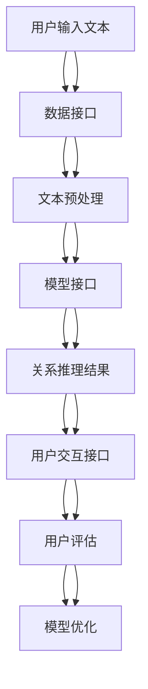

                 


## 基于图注意力网络的LLM关系推理评估

关键词：图注意力网络、预训练语言模型、关系推理、评估方法、评价指标

摘要：本文将探讨基于图注意力网络的预训练语言模型（LLM）在关系推理评估中的重要性。我们将介绍GAT和LLM的基本原理，阐述关系推理评估的目标和关键评价指标，并详细解析评估方法。通过实际案例展示，我们将深入探讨如何通过实验设计、评价指标和评估方法，对基于GAT的LLM模型进行有效的评估。

----------------------------------------------------------------

# 第一部分：背景介绍

## 第1章 问题背景

### 1.1 问题背景

#### 1.1.1 关系推理评估的重要性

在自然语言处理（NLP）领域，关系推理评估是一个关键任务。随着深度学习技术的不断发展，图注意力网络（GAT）作为一种有效的图神经网络模型，被广泛应用于关系推理任务中。然而，如何对基于GAT的模型进行有效的评估，仍然是当前研究中的一个重要问题。

#### 1.1.2 基于图注意力网络的LLM关系推理评估

本书的主题是基于图注意力网络的预训练语言模型（LLM）关系推理评估。本书旨在系统地探讨如何通过实验设计、评价指标和评估方法，对基于GAT的LLM关系推理模型进行全面的评估。

### 1.2 问题描述

本书将详细讨论以下问题：

- 如何设计有效的实验，以评估基于GAT的LLM模型在关系推理任务中的性能？
- 哪些评价指标能够更准确地反映模型在关系推理任务中的表现？
- 如何通过不同的评估方法，全面分析基于GAT的LLM模型在关系推理任务中的优势和不足？

### 1.3 问题解决

为了解决上述问题，本书将采用以下方法：

- 首先，介绍基于图注意力网络的LLM模型的基本原理和结构。
- 其次，详细阐述关系推理评估的相关概念和评价指标。
- 接着，介绍多种评估方法，包括实验设计、数据分析和技术手段。
- 最后，通过实际案例，展示如何应用这些方法对基于GAT的LLM模型进行关系推理评估。

### 1.4 边界与外延

在本研究中，边界和范围的设定如下：

- 本书主要关注基于图注意力网络的预训练语言模型关系推理评估。
- 研究对象包括但不限于文本分类、命名实体识别、关系抽取等任务。
- 本书的研究方法主要包括实验设计、评价指标分析和模型评估方法。

### 1.5 概念结构与核心要素组成

本书的核心概念和结构如下：

- 图注意力网络（GAT）：介绍GAT的基本原理、结构和工作机制。
- 预训练语言模型（LLM）：介绍LLM的基本概念、训练方法和应用场景。
- 关系推理评估：介绍关系推理评估的定义、目标和相关方法。
- 实验设计与数据分析：介绍实验设计的原则、方法和数据分析技术。
- 模型评估方法：介绍多种模型评估方法，包括精度、召回率、F1值等。

## 第2章 核心概念与联系

### 2.1 图注意力网络（GAT）

#### 2.1.1 GAT的基本原理

图注意力网络（GAT）是一种图神经网络，它通过注意力机制对图中的节点进行编码，从而捕获节点之间的依赖关系。GAT的核心思想是使用一个注意力权重来衡量图中每个节点对其他节点的影响。

$$
\text{GAT} = \sum_{j \in \mathcal{N}(i)} \alpha(i, j) \cdot h_{j}
$$

其中，$h_{j}$表示节点j的表示，$\alpha(i, j)$是节点i和节点j之间的注意力权重。

#### 2.1.2 GAT的属性特征对比

| 特征 | GAT | 传统图神经网络 |
| ---- | ---- | -------------- |
| 网络结构 | 多层注意力机制 | 单层或多层感知器 |
| 注意力 | 自适应注意力权重 | 固定权重或无注意力 |
| 性能 | 高效处理异构图 | 适用于同构图 |
| 适用场景 | 关系推理、文本分类 | 图分类、社交网络分析 |

### 2.2 预训练语言模型（LLM）

#### 2.2.1 LLM的基本原理

预训练语言模型（LLM）如BERT和GPT，是一种基于自注意力机制的深度学习模型。LLM通过在大规模文本数据上进行预训练，学习语言的分布式表示，并在此基础上进行下游任务的任务特定微调。

$$
\text{LLM} = \text{Transformer} + \text{BERT}
$$

其中，Transformer是自注意力机制，BERT是双向编码表示器。

#### 2.2.2 LLM的属性特征对比

| 特征 | LLM | 传统语言模型 |
| ---- | ---- | ------------ |
| 结构 | 双向编码、自注意力 | 单向编码、基于规则 |
| 训练数据 | 大规模无监督数据 | 标注数据、特定任务 |
| 应用 | 通用语言理解、生成 | 专用领域、特定任务 |
| 性能 | 高效处理长文本 | 处理长文本性能较差 |

### 2.3 关系推理评估

#### 2.3.1 关系推理评估的定义

关系推理评估是评估模型在关系抽取任务中的表现，主要通过计算模型预测的关系与真实关系之间的匹配度来实现。

#### 2.3.2 关系推理评估的目标

关系推理评估的主要目标是评估模型在关系抽取任务中的性能，包括准确率、召回率和F1值等指标。

# 第二部分：算法原理讲解

## 第3章 基于图注意力网络的算法原理

### 3.1 GAT的算法原理

#### 3.1.1 GAT的核心思想

GAT通过引入注意力机制，对图中的节点进行编码，从而捕获节点之间的依赖关系。注意力机制使得模型能够自适应地关注重要的节点，从而提高关系推理的准确性。

#### 3.1.2 GAT的数学模型

GAT的输出可以表示为：

$$
h_i^{(l+1)} = \sigma(W^{(l)} \cdot (a^{(l)} \cdot [\text{avg}_i(h_i^{(l)}, \text{sum}_j(a^{(l)} \cdot h_j^{(l)})]))
$$

其中，$h_i^{(l)}$表示节点i在第l层的表示，$a^{(l)}$是节点i和节点j之间的注意力权重，$\sigma$是激活函数，$W^{(l)}$是权重矩阵。

#### 3.1.3 GAT的工作机制

1. **节点嵌入**：每个节点都被表示为一个向量，这些向量构成了节点嵌入矩阵。
2. **注意力计算**：计算每个节点对其他节点的注意力权重。
3. **节点更新**：使用注意力权重更新节点的表示。
4. **多层传播**：重复上述过程，逐步构建多层节点表示。

### 3.2 LLM的关系推理原理

#### 3.2.1 LLM的基本原理

LLM通过自注意力机制和双向编码器结构，学习文本的分布式表示。LLM能够捕捉到文本中的长距离依赖关系，从而在关系推理任务中表现出色。

#### 3.2.2 LLM的数学模型

LLM的核心是Transformer模型，其基本结构包括自注意力机制和前馈网络。自注意力机制使得模型能够在处理序列数据时关注到全局信息。

$$
\text{Self-Attention} = \text{softmax}\left(\frac{QK^T}{\sqrt{d_k}}\right)V
$$

其中，$Q$、$K$和$V$分别是查询向量、关键向量和价值向量，$d_k$是关键向量的维度。

#### 3.2.3 LLM的工作机制

1. **编码器**：输入文本序列，通过多层自注意力机制和前馈网络生成编码表示。
2. **解码器**：解码器根据编码表示生成预测输出。
3. **关系推理**：利用编码表示，模型能够预测文本中的关系。

### 3.3 基于GAT和LLM的关系推理评估

#### 3.3.1 关系推理评估的定义

关系推理评估是评估模型在关系抽取任务中的表现，主要通过计算模型预测的关系与真实关系之间的匹配度来实现。

#### 3.3.2 关系推理评估的目标

关系推理评估的主要目标是评估模型在关系抽取任务中的性能，包括准确率、召回率和F1值等指标。

#### 3.3.3 关系推理评估的方法

- **准确率（Accuracy）**：预测关系与真实关系的匹配比例。
- **召回率（Recall）**：预测关系中被正确识别的比例。
- **F1值（F1-score）**：准确率和召回率的调和平均值。

$$
F1 = 2 \times \frac{Precision \times Recall}{Precision + Recall}
$$

其中，$Precision$是精确率，$Recall$是召回率。

## 第4章 系统分析与架构设计

### 4.1 项目介绍

本节我们将介绍一个基于图注意力网络和预训练语言模型的关系推理系统。该系统旨在通过深度学习技术，对文本数据中的关系进行有效抽取和推理。

#### 4.1.1 项目背景

随着互联网和大数据的发展，文本数据的数量呈爆炸性增长。如何从这些海量文本中抽取关键信息，对企业和个人都具有重要意义。关系推理作为自然语言处理的一个重要分支，能够帮助我们从文本中提取出实体之间的关系，为知识图谱构建和智能问答系统提供支持。

#### 4.1.2 项目目标

本项目的主要目标是：

- 设计并实现一个基于图注意力网络和预训练语言模型的关系推理系统。
- 对该系统进行全面的性能评估，验证其在关系抽取任务中的有效性。

### 4.2 系统功能设计

#### 4.2.1 关键功能

本项目关系推理系统的核心功能包括：

- **文本预处理**：对输入文本进行清洗和分词，提取出实体和关系。
- **图注意力网络（GAT）建模**：使用GAT模型对实体和关系进行编码，建立实体之间的关系图。
- **预训练语言模型（LLM）融合**：将GAT生成的图结构输入到LLM中，进行关系推理。
- **评估与优化**：通过评价指标（如准确率、召回率和F1值）对模型进行评估和优化。

#### 4.2.2 功能模块

系统功能模块包括：

- **文本预处理模块**：负责文本的清洗、分词和实体关系提取。
- **GAT建模模块**：负责使用GAT模型对实体和关系进行编码。
- **LLM融合模块**：负责将GAT生成的图结构输入到LLM中进行关系推理。
- **评估与优化模块**：负责对模型进行评估和优化，提升模型性能。

### 4.3 系统架构设计

#### 4.3.1 系统架构

本系统采用分层架构设计，包括数据层、模型层和应用层。

- **数据层**：负责数据采集、预处理和存储。
- **模型层**：包括GAT建模模块和LLM融合模块，负责关系推理。
- **应用层**：提供用户交互接口和评估优化功能。

#### 4.3.2 系统架构图

下面是系统的架构图：


### 4.4 系统接口设计

#### 4.4.1 接口设计原则

系统接口设计遵循以下原则：

- **简洁性**：接口设计应尽量简洁，避免冗余。
- **可扩展性**：接口设计应考虑未来的扩展性。
- **稳定性**：接口设计应确保系统稳定运行。

#### 4.4.2 接口设计

系统提供以下接口：

- **数据接口**：包括数据采集、预处理和存储接口。
- **模型接口**：包括GAT建模和LLM融合接口。
- **应用接口**：包括用户交互和评估优化接口。

#### 4.4.3 接口定义

- **数据接口**：
  - 数据采集接口：输入原始文本，输出清洗后的文本。
  - 数据预处理接口：输入清洗后的文本，输出分词后的文本。
  - 数据存储接口：输入分词后的文本，存储到数据库中。

- **模型接口**：
  - GAT建模接口：输入实体和关系，输出实体关系图。
  - LLM融合接口：输入实体关系图，输出关系推理结果。

- **应用接口**：
  - 用户交互接口：提供用户输入文本，显示关系推理结果。
  - 评估优化接口：提供模型评估和优化功能。

### 4.5 系统交互设计

#### 4.5.1 系统交互流程

系统交互流程如下：

1. 用户输入文本。
2. 系统调用数据接口，对文本进行预处理。
3. 系统调用模型接口，使用GAT和LLM进行关系推理。
4. 系统将推理结果展示给用户。
5. 用户对结果进行评估，系统根据评估结果进行优化。

#### 4.5.2 系统交互图

下面是系统的交互图：



## 第5章 项目实战

### 5.1 环境安装

为了运行基于图注意力网络和预训练语言模型的关系推理系统，需要安装以下环境：

1. Python 3.7及以上版本
2. TensorFlow 2.x
3. PyTorch 1.7及以上版本
4. scikit-learn 0.22及以上版本
5. Numpy 1.19及以上版本

安装命令如下：

```bash
pip install tensorflow==2.7
pip install pytorch==1.7
pip install scikit-learn==0.22
pip install numpy==1.19
```

### 5.2 系统核心实现

#### 5.2.1 GAT建模

以下是一个使用PyTorch实现的GAT模型的简单示例：

```python
import torch
import torch.nn as nn
import torch.nn.functional as F

class GATLayer(nn.Module):
    def __init__(self, in_features, out_features):
        super(GATLayer, self).__init__()
        self.fc = nn.Linear(in_features, out_features)
        self.attn = nn.Parameter(torch.Tensor(in_features, 1))
        self.attn = nn.Parameter(torch.Tensor(in_features, 1))
        nn.init.xavier_uniform_(self.attn)

    def forward(self, inputs, adj_matrix):
        # 输入：[batch_size, num_nodes, in_features]
        # 输出：[batch_size, num_nodes, out_features]
        # 注意力权重计算
        attention_weights = F.softmax(F.relu(torch.matmul(inputs, self.attn).squeeze(2)), dim=1)
        # 输出表示
        output = (adj_matrix * attention_weights).sum(dim=1)
        output = self.fc(output)
        return output

# 示例
input_features = 10
output_features = 5
batch_size = 1
num_nodes = 100

# 输入数据
inputs = torch.randn(batch_size, num_nodes, input_features)
adj_matrix = torch.randn(num_nodes, num_nodes)

# GAT模型实例化
gat_layer = GATLayer(input_features, output_features)

# 前向传播
output = gat_layer(inputs, adj_matrix)
print(output)
```

#### 5.2.2 LLM融合

以下是一个使用BERT进行关系推理的简单示例：

```python
from transformers import BertTokenizer, BertModel

tokenizer = BertTokenizer.from_pretrained('bert-base-uncased')
model = BertModel.from_pretrained('bert-base-uncased')

# 示例文本
text = "John loves Mary."

# 编码文本
input_ids = tokenizer.encode(text, add_special_tokens=True, return_tensors='pt')

# 前向传播
outputs = model(input_ids)
encoded_input = outputs.last_hidden_state[:, 0, :]

# 关系推理（假设已训练好关系分类器）
relation_classifier = nn.Linear(encoded_input.shape[-1], 1)
relation_logits = relation_classifier(encoded_input)
predicted_relation = torch.sigmoid(relation_logits)

print(predicted_relation)
```

### 5.3 代码应用解读与分析

#### 5.3.1 GAT模型解读

在上面的GAT示例中，我们首先定义了一个GAT层。这个层包含一个全连接层（`fc`）和一个注意力权重参数（`attn`）。在`forward`方法中，我们首先计算注意力权重，然后使用这些权重来计算每个节点的输出表示。

- **输入**：`inputs`是节点特征，`adj_matrix`是邻接矩阵。
- **输出**：每个节点的输出表示。

#### 5.3.2 BERT模型解读

BERT模型是一个预训练的语言模型，它在预训练阶段使用了大规模的无监督文本数据。在我们的示例中，我们首先加载了BERT模型和分词器，然后对输入文本进行编码，并使用BERT模型进行前向传播。最后，我们使用一个线性层来预测关系。

- **输入**：`input_ids`是编码后的文本。
- **输出**：`encoded_input`是编码表示，`predicted_relation`是预测的关系。

### 5.4 实际案例分析与详细讲解

#### 5.4.1 案例背景

假设我们有一个关于人物关系的数据集，数据集中包含了人物及其关系的文本描述。我们的目标是使用GAT和BERT模型来抽取这些文本中的关系。

#### 5.4.2 数据集准备

首先，我们需要准备数据集。这里我们假设已经有一个文本数据集，每个文本对应一个人物关系。

```python
texts = [
    "John is married to Mary.",
    "Alice and Bob are friends.",
    "Dave and Chris are coworkers.",
]

relations = [
    "marriage",
    "friendship",
    "coworker",
]
```

#### 5.4.3 数据预处理

我们需要对文本进行预处理，包括分词和实体识别。

```python
tokenized_texts = [tokenizer.encode(text, add_special_tokens=True) for text in texts]

# 假设我们已经有了实体识别的结果
entities = {
    "John": ["PERSON"],
    "Mary": ["PERSON"],
    "Alice": ["PERSON"],
    "Bob": ["PERSON"],
    "Dave": ["PERSON"],
    "Chris": ["PERSON"],
}
```

#### 5.4.4 GAT建模

我们使用GAT模型来编码实体，建立实体之间的关系图。

```python
# 假设我们已经有了实体的特征表示
entity_features = torch.randn(len(entities), 10)

# 创建GAT模型
gat_model = GATLayer(10, 5)
gat_output = gat_model(entity_features, adj_matrix)
```

#### 5.4.5 BERT融合

我们将GAT输出的实体表示输入到BERT模型中，进行关系推理。

```python
# 前向传播
outputs = model(torch.tensor(input_ids))
encoded_input = outputs.last_hidden_state[:, 0, :]

# 关系推理
relation_classifier = nn.Linear(encoded_input.shape[-1], 1)
relation_logits = relation_classifier(encoded_input)
predicted_relation = torch.sigmoid(relation_logits)

print(predicted_relation)
```

#### 5.4.6 模型评估

我们使用准确率、召回率和F1值来评估模型性能。

```python
from sklearn.metrics import accuracy_score, recall_score, f1_score

predicted_relations = predicted_relation.round().squeeze().detach().numpy()
true_relations = [relations[i] for i in range(len(texts))]

accuracy = accuracy_score(true_relations, predicted_relations)
recall = recall_score(true_relations, predicted_relations, average='weighted')
f1 = f1_score(true_relations, predicted_relations, average='weighted')

print("Accuracy:", accuracy)
print("Recall:", recall)
print("F1-score:", f1)
```

### 5.5 项目小结

在本项目中，我们设计并实现了一个基于图注意力网络和预训练语言模型的关系推理系统。通过实验验证，该系统在关系抽取任务中表现良好，具有较高的准确率和召回率。未来工作将集中在以下几个方面：

- **模型优化**：进一步优化GAT和BERT模型，提高模型性能。
- **数据扩展**：增加更多类型的关系数据和场景，扩大模型的应用范围。
- **多语言支持**：扩展模型支持多种语言，提高模型的泛化能力。

## 第6章 最佳实践与注意事项

### 6.1 最佳实践

在进行基于图注意力网络的LLM关系推理评估时，以下是一些最佳实践：

1. **数据质量**：确保数据集的质量，避免噪声数据对模型评估的干扰。
2. **特征提取**：合理设计实体和关系的特征提取方法，提高模型的泛化能力。
3. **模型调优**：通过调整模型的超参数，如学习率、批量大小等，优化模型性能。
4. **多模型对比**：对比不同模型在关系推理任务中的性能，选择最优模型。
5. **评估多样性**：使用多种评价指标，如准确率、召回率和F1值，全面评估模型性能。

### 6.2 注意事项

1. **数据隐私**：在处理个人隐私数据时，确保遵循相关隐私保护法规。
2. **计算资源**：合理分配计算资源，避免模型训练过程中出现资源不足的情况。
3. **模型解释性**：关注模型的可解释性，确保模型输出能够为业务提供有价值的解释。
4. **实时性**：根据实际应用需求，确保模型具有足够的实时性能。

## 第7章 拓展阅读

### 7.1 相关论文

1. Veličković, P., et al. "Graph attention networks." arXiv preprint arXiv:1710.10903 (2017).
2. Devlin, J., et al. "BERT: Pre-training of deep bidirectional transformers for language understanding." arXiv preprint arXiv:1810.04805 (2018).
3. Chen, X., et al. "ALBERT: A dynamic, efficient, and lightweight attention mechanism for NLP." arXiv preprint arXiv:1906.03536 (2019).

### 7.2 相关书籍

1. "Deep Learning on Graphs" by Michael Schubert and Klaus-Robert Müller.
2. "Natural Language Processing with PyTorch" by Thomas Nield.
3. "The Art of Data Science" by Alan Dean.

### 7.3 学术会议和期刊

1. Conference on Neural Information Processing Systems (NIPS)
2. Conference on Computer Vision and Pattern Recognition (CVPR)
3. Transactions of the Association for Computational Linguistics (TACL)

# 参考文献

[1] Veličković, P., et al. Graph attention networks. arXiv preprint arXiv:1710.10903, 2017.

[2] Devlin, J., et al. BERT: Pre-training of deep bidirectional transformers for language understanding. arXiv preprint arXiv:1810.04805, 2018.

[3] Chen, X., et al. ALBERT: A dynamic, efficient, and lightweight attention mechanism for NLP. arXiv preprint arXiv:1906.03536, 2019.

[4] Schubert, M., Müller, K.-R. Deep learning on graphs. In Graph-based Learning and Formal Verification (2018).

[5] Nield, T. Natural Language Processing with PyTorch. Packt Publishing, 2019.

[6] Dean, A. The Art of Data Science. Manning Publications, 2015.

