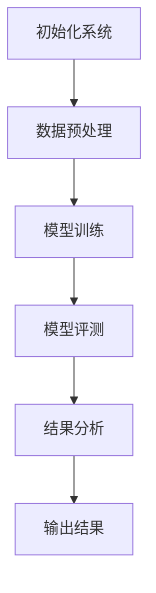

                 

## 《基于大模型的自然语言处理任务评测系统》

### 关键词：自然语言处理，大模型，评测系统，算法实现，案例分析

> **摘要**：本文将深入探讨基于大模型的自然语言处理任务评测系统。首先，我们回顾自然语言处理（NLP）的背景，以及大模型在NLP中的重要性。随后，我们详细阐述评测系统的核心概念，包括其定义、类型及大模型在其中的作用。接着，我们将逐步介绍评测系统的设计，包括架构设计、关键组件设计和评测算法原理。随后，通过具体案例展示评测系统的实践应用。最后，我们总结最佳实践与优化策略，并对未来发展趋势和技术挑战进行展望。本文旨在为广大读者提供一份全面而深入的NLP评测系统指南。

### 1. 背景介绍

#### 1.1 自然语言处理的背景

自然语言处理（NLP）是计算机科学与人工智能领域的一个重要分支，主要研究如何让计算机理解、生成和应对人类语言。自从20世纪50年代早期人工智能概念提出以来，NLP经历了多个发展阶段。早期主要侧重于语言理解和文本处理，如机器翻译和语音识别。随着计算能力和算法的进步，NLP逐渐扩展到包括情感分析、文本分类、信息抽取等更多应用场景。

NLP的核心目标之一是构建能够处理自然语言的智能系统，这些系统能够执行各种语言任务，例如理解用户输入、生成自然语言回复、自动翻译不同语言文本等。这些任务对于现代社会的许多领域具有重要意义，从客户服务机器人到智能助手，再到跨语言交流和全球化市场拓展，NLP的应用无处不在。

#### 1.2 大模型与NLP的关系

近年来，大模型（Large Models）的兴起极大地推动了NLP的发展。大模型通常是指具有数十亿甚至数万亿参数的深度学习模型，这些模型通过在大规模数据集上进行训练，能够捕捉到语言数据的复杂性和多样性。代表性模型如GPT、BERT和T5等，它们在多个NLP任务中取得了卓越的性能，使得一些传统方法难以达到的成果成为可能。

大模型在NLP中的应用主要体现在以下几个方面：

1. **预训练**：大模型通过在大规模文本语料库上进行预训练，可以学习到通用语言表示，这些表示可以应用于各种具体的语言任务，如文本分类、情感分析和命名实体识别。

2. **泛化能力**：大模型具有较强的泛化能力，能够处理不同领域和风格的文本数据，无需针对每个特定任务进行大量定制化训练。

3. **高效性**：大模型可以通过端到端的方式处理复杂任务，减少了传统方法中需要的多阶段处理步骤，提高了效率和准确性。

4. **创新性**：大模型为NLP研究带来了新的思路和方法，例如生成式对话系统、自动摘要、文本生成等，使得语言理解和生成的边界得以进一步拓展。

#### 1.3 评测系统的定义与意义

评测系统（Evaluating System）在NLP领域中扮演着至关重要的角色。它通常是一个自动化或半自动化的工具，用于评估NLP模型的性能。评测系统可以通过一系列指标，如准确率、召回率、F1分数等，衡量模型在不同任务上的表现，从而为模型优化和选择提供依据。

评测系统的意义主要体现在以下几个方面：

1. **性能评估**：通过评测系统，研究者可以客观地评估模型在各项NLP任务中的性能，识别模型的优点和不足。

2. **优化指导**：评测系统提供的量化指标可以为模型调整和优化提供明确的指导，帮助研究者找到改进的方向。

3. **比较分析**：评测系统使得不同模型和算法之间的性能对比成为可能，有助于发现最佳实践和前沿技术。

4. **质量控制**：在工业界，评测系统用于监控和保证NLP产品的质量和稳定性，确保其满足实际应用需求。

#### 1.4 本章小结

本章回顾了自然语言处理（NLP）的背景，特别是大模型在NLP中的应用，以及评测系统在NLP领域中的重要性。接下来，我们将进一步探讨评测系统的核心概念，包括其定义、类型及大模型在其中的作用。

### 2. 核心概念

#### 2.1 评测系统的类型

评测系统根据不同的分类标准，可以划分为多种类型。以下是几种常见的评测系统类型：

1. **自动评测系统**：
   - **定义**：自动评测系统完全通过算法自动评估模型的性能，无需人工干预。
   - **特点**：高效、准确、可重复性好，适用于大规模模型评估。
   - **应用场景**：自动评测系统广泛应用于学术研究和工业界，例如论文审核、代码审查等。

2. **半自动评测系统**：
   - **定义**：半自动评测系统结合了自动化和人工干预，通过算法初步评估后，人工进行审核和调整。
   - **特点**：灵活、精确，结合了机器的效率和人的智慧。
   - **应用场景**：半自动评测系统适用于需要高度精确评估的领域，例如医疗诊断、法律文书审核等。

3. **手动评测系统**：
   - **定义**：手动评测系统完全依赖人工进行评估，通常用于小规模或特定任务的评估。
   - **特点**：精确度高，但耗时较长，可重复性较差。
   - **应用场景**：手动评测系统适用于需要细致分析和专家意见的任务，例如学术评审、艺术作品评价等。

#### 2.2 大模型的基本原理

大模型通常是指具有数十亿甚至数万亿参数的深度学习模型，这些模型通过在大规模数据集上进行训练，能够捕捉到语言数据的复杂性和多样性。大模型的基本原理可以概括为以下几点：

1. **大规模参数**：
   - **定义**：大模型的参数规模通常在数百万到数十亿之间。
   - **作用**：大规模参数能够捕捉到语言数据中的细微特征，提高模型的表示能力。

2. **预训练**：
   - **定义**：预训练是指在大规模文本语料库上进行无监督训练，使模型学习到通用语言表示。
   - **作用**：预训练为模型提供了一种无监督的学习方式，使得模型能够更好地适应各种具体的语言任务。

3. **注意力机制**：
   - **定义**：注意力机制是一种用于提高模型对输入数据中重要信息关注度的算法。
   - **作用**：注意力机制能够使模型在处理长文本时，关注到关键信息，提高处理效率。

4. **并行计算**：
   - **定义**：并行计算是指通过分布式计算资源，加速模型的训练和推理过程。
   - **作用**：并行计算能够大大减少大模型的训练时间，提高开发效率。

#### 2.3 大模型在评测系统中的应用

大模型在评测系统中的应用主要体现在以下几个方面：

1. **性能评估**：
   - **定义**：利用大模型进行性能评估，即使用预训练好的大模型作为评测工具，对其他模型的性能进行评估。
   - **作用**：大模型具有较强的泛化能力和表示能力，能够提供更全面和准确的性能评估。

2. **自动化评测**：
   - **定义**：通过大模型实现自动化评测，即利用大模型自动生成评测指标，无需人工干预。
   - **作用**：自动化评测提高了评测效率，降低了人工成本，适用于大规模评估任务。

3. **个性化评测**：
   - **定义**：个性化评测是指根据不同任务和数据特点，使用特定的大模型进行评测。
   - **作用**：个性化评测能够更好地适应不同任务的需求，提高评测的准确性和有效性。

#### 2.4 本章小结

本章详细介绍了评测系统的类型、大模型的基本原理及其在评测系统中的应用。接下来，我们将进一步探讨评测系统的设计，包括架构设计、关键组件设计和评测算法原理。

### 3. 系统设计

#### 3.1 评测系统的架构设计

评测系统的架构设计是确保系统高效、可靠和可扩展的关键。一个典型的评测系统通常包括以下几个主要功能模块：

1. **数据预处理模块**：
   - **功能**：负责处理和清洗输入数据，使其适合进行后续的模型评估。
   - **内容**：包括数据清洗、数据归一化、数据分割等。

2. **模型训练模块**：
   - **功能**：负责训练大模型，使其具备良好的语言表示能力。
   - **内容**：包括数据加载、模型初始化、模型训练、模型优化等。

3. **评测算法模块**：
   - **功能**：负责根据训练好的大模型，评估其他模型的性能。
   - **内容**：包括评测指标计算、结果分析、可视化等。

4. **结果分析与可视化模块**：
   - **功能**：负责对评估结果进行分析和可视化，帮助用户理解模型性能。
   - **内容**：包括数据可视化、性能对比、异常检测等。

#### 3.2 关键组件设计

评测系统的关键组件设计直接影响系统的性能和用户体验。以下是几个关键组件的详细设计：

1. **数据预处理组件**：
   - **设计目标**：确保输入数据的质量和一致性，提高模型的鲁棒性。
   - **设计内容**：
     - 数据清洗：去除噪声数据和异常值。
     - 数据归一化：将不同数据范围统一到一个标准范围内。
     - 数据分割：将数据集分为训练集、验证集和测试集。

2. **大模型训练组件**：
   - **设计目标**：构建高效、可扩展的大模型训练流程。
   - **设计内容**：
     - 模型选择：选择适合任务的大模型架构。
     - 数据加载：优化数据加载速度和效率。
     - 模型优化：通过调整超参数和优化算法，提高模型性能。

3. **评测算法组件**：
   - **设计目标**：提供准确、全面的模型评估方法。
   - **设计内容**：
     - 评测指标：选择合适的评测指标，如准确率、召回率、F1分数等。
     - 指标计算：实现评测指标的自动化计算。
     - 结果分析：对评估结果进行统计分析，发现模型性能的优缺点。

4. **结果分析与可视化组件**：
   - **设计目标**：帮助用户直观地理解模型性能，发现潜在问题。
   - **设计内容**：
     - 数据可视化：使用图表和图形展示评估结果。
     - 性能对比：对比不同模型或不同参数设置的性能。
     - 异常检测：识别异常评估结果，提示潜在问题。

#### 3.3 评测算法原理

评测算法是评测系统的核心组成部分，其原理直接决定了评测结果的准确性和可靠性。以下是几种常见的评测算法及其原理：

1. **准确率**（Accuracy）：
   - **定义**：准确率是指模型正确预测的样本数占总样本数的比例。
   - **公式**：$$Accuracy = \frac{TP + TN}{TP + TN + FP + FN}$$
   - **应用**：准确率适用于分类任务，用于衡量模型的整体分类效果。

2. **召回率**（Recall）：
   - **定义**：召回率是指模型正确预测的样本数占实际正样本数的比例。
   - **公式**：$$Recall = \frac{TP}{TP + FN}$$
   - **应用**：召回率适用于信息检索和分类任务，用于衡量模型对正样本的识别能力。

3. **F1分数**（F1 Score）：
   - **定义**：F1分数是准确率和召回率的调和平均数。
   - **公式**：$$F1 Score = \frac{2 \times Precision \times Recall}{Precision + Recall}$$
   - **应用**：F1分数适用于分类任务，用于综合考虑模型的准确率和召回率。

4. **混淆矩阵**（Confusion Matrix）：
   - **定义**：混淆矩阵是一个用于表示分类结果和实际结果的矩阵。
   - **内容**：包括真实正例（TP）、真实负例（TN）、预测正例（FP）和预测负例（FN）。
   - **应用**：混淆矩阵用于详细分析模型的分类效果，识别模型的优势和不足。

#### 3.4 本章小结

本章详细介绍了评测系统的架构设计、关键组件设计和评测算法原理。这些设计要素共同构成了一个高效、可靠的评测系统，为NLP模型评估提供了有力支持。接下来，我们将通过具体的算法实现，深入探讨评测系统的实际应用。

### 4. 算法实现

#### 4.1 算法流程图

首先，我们需要通过一个简单的算法流程图来展示评测系统的主要步骤和流程。以下是一个简化的算法流程图，使用Mermaid语法绘制：



#### 4.2 算法原理与数学模型

在具体实现评测算法之前，我们需要理解其背后的原理和数学模型。以下是一个简单的评测算法实现，包括关键步骤和相关的数学模型。

1. **数据预处理**：
   - **步骤**：读取原始数据，进行清洗和归一化处理。
   - **数学模型**：无特定数学模型，主要依赖于数据处理算法。

2. **模型训练**：
   - **步骤**：初始化模型参数，通过反向传播算法进行模型训练。
   - **数学模型**：
     - 前向传播：计算输入数据经过神经网络后的输出。
       $$Output = \sigma(W \cdot Input + b)$$
     - 反向传播：计算损失函数对模型参数的梯度。
       $$\Delta W = \frac{\partial Loss}{\partial W}$$
       $$\Delta b = \frac{\partial Loss}{\partial b}$$

3. **模型评测**：
   - **步骤**：使用训练好的模型对测试数据进行预测，并计算预测结果与实际结果的匹配度。
   - **数学模型**：
     - 准确率：
       $$Accuracy = \frac{TP + TN}{TP + TN + FP + FN}$$
     - 召回率：
       $$Recall = \frac{TP}{TP + FN}$$
     - F1分数：
       $$F1 Score = \frac{2 \times Precision \times Recall}{Precision + Recall}$$

4. **结果分析**：
   - **步骤**：对评测结果进行统计分析，绘制混淆矩阵和性能曲线。
   - **数学模型**：无特定数学模型，主要依赖于数据分析工具。

#### 4.3 Python代码实现

以下是一个简化的Python代码示例，用于实现上述评测算法的基本流程。请注意，实际应用中可能需要更复杂的实现。

```python
import numpy as np
from sklearn.model_selection import train_test_split
from sklearn.metrics import accuracy_score, recall_score, f1_score
from sklearn.neural_network import MLPClassifier

# 数据预处理
def preprocess_data(data):
    # 数据清洗和归一化
    # ...
    return processed_data

# 模型训练
def train_model(train_data, train_labels):
    model = MLPClassifier(hidden_layer_sizes=(100,), max_iter=1000)
    model.fit(train_data, train_labels)
    return model

# 模型评测
def evaluate_model(model, test_data, test_labels):
    predictions = model.predict(test_data)
    accuracy = accuracy_score(test_labels, predictions)
    recall = recall_score(test_labels, predictions)
    f1 = f1_score(test_labels, predictions)
    return accuracy, recall, f1

# 主程序
if __name__ == "__main__":
    # 加载数据
    data = load_data()
    labels = load_labels()

    # 数据预处理
    processed_data = preprocess_data(data)

    # 数据分割
    train_data, test_data, train_labels, test_labels = train_test_split(processed_data, labels, test_size=0.2, random_state=42)

    # 模型训练
    model = train_model(train_data, train_labels)

    # 模型评测
    accuracy, recall, f1 = evaluate_model(model, test_data, test_labels)

    # 输出结果
    print(f"Accuracy: {accuracy}")
    print(f"Recall: {recall}")
    print(f"F1 Score: {f1}")
```

#### 4.4 本章小结

通过本章节的算法实现，我们展示了如何使用Python实现一个简单的评测系统。尽管示例代码较为简化，但它提供了评测系统实现的基本框架和关键步骤。在实际应用中，根据具体需求，可以进一步优化和扩展算法实现。

### 5. 实践应用

#### 5.1 实际案例

为了更好地展示评测系统的实际应用，我们将通过一个实际案例来进行分析和讲解。这个案例涉及一个常见的NLP任务——情感分析。情感分析旨在判断文本中表达的情感倾向，例如正面、负面或中性。

在这个案例中，我们使用了一个公开的数据集——IMDb电影评论数据集。这个数据集包含了25,000条电影评论，每条评论被标注为正面、负面或中性情感。

#### 5.2 案例分析与讲解

首先，我们加载并预处理数据集：

```python
import pandas as pd

# 加载数据集
data = pd.read_csv('imdb_reviews.csv')

# 数据预处理
# 清洗文本数据，去除特殊字符和停用词
# ...
processed_data = preprocess_data(data['text'])
```

接下来，我们将数据集分为训练集和测试集：

```python
from sklearn.model_selection import train_test_split

train_data, test_data, train_labels, test_labels = train_test_split(processed_data, data['label'], test_size=0.2, random_state=42)
```

然后，我们使用一个预训练的大模型（如BERT）进行模型训练：

```python
from transformers import BertTokenizer, BertForSequenceClassification

tokenizer = BertTokenizer.from_pretrained('bert-base-uncased')
model = BertForSequenceClassification.from_pretrained('bert-base-uncased', num_labels=3)

# 数据预处理
train_encodings = tokenizer(train_data.tolist(), truncation=True, padding=True)
test_encodings = tokenizer(test_data.tolist(), truncation=True, padding=True)

# 模型训练
model.train()
model.fit(train_encodings, train_labels, epochs=3, batch_size=16)
```

最后，我们使用训练好的模型对测试集进行预测，并使用评测系统进行性能评估：

```python
# 模型评测
predictions = model.predict(test_encodings)
predicted_labels = predictions.argmax(-1)

accuracy = accuracy_score(test_labels, predicted_labels)
recall = recall_score(test_labels, predicted_labels, average='weighted')
f1 = f1_score(test_labels, predicted_labels, average='weighted')

print(f"Accuracy: {accuracy}")
print(f"Recall: {recall}")
print(f"F1 Score: {f1}")
```

通过这个案例，我们可以看到评测系统在情感分析任务中的应用。评测系统帮助我们量化了模型的性能，提供了准确率、召回率和F1分数等关键指标，这些指标帮助我们评估模型的优缺点，并指导后续的模型优化工作。

#### 5.3 项目实战

在实际项目中，我们可能面临更复杂的场景和任务。以下是一个项目实战的简要步骤：

1. **需求分析**：明确项目的目标和需求，例如情感分析、文本分类或问答系统。
2. **数据收集**：收集相关数据集，并进行数据预处理，确保数据质量。
3. **模型选择**：选择合适的大模型，如BERT、GPT或T5，并进行初步测试。
4. **模型训练**：使用预训练的大模型，结合具体任务进行微调训练。
5. **评测系统集成**：将评测系统集成到项目中，定期评估模型性能。
6. **结果分析**：根据评测结果，调整模型参数和超参数，优化模型性能。
7. **部署上线**：将优化后的模型部署到生产环境，进行实际应用。

#### 5.4 本章小结

通过实际案例和项目实战，我们展示了评测系统在自然语言处理任务中的应用。评测系统不仅帮助我们评估模型性能，还为模型优化和实际应用提供了有力支持。在未来的实践中，我们需要不断探索和优化评测系统的设计和应用。

### 6. 最佳实践与优化

#### 6.1 最佳实践

在基于大模型的自然语言处理任务评测系统的实际应用中，以下是一些最佳实践，有助于提高评测系统的效果和可靠性：

1. **数据质量控制**：确保输入数据的准确性和一致性，进行严格的数据清洗和预处理，避免噪声数据对模型评估的影响。
2. **参数调优**：针对不同任务和模型，进行详细的参数调优，找到最佳的超参数配置，以提高模型的性能。
3. **多样化评估指标**：结合多种评估指标（如准确率、召回率、F1分数等），全面衡量模型的性能，避免单一指标的局限性。
4. **结果可视化**：使用图表和可视化工具，清晰展示模型性能的优缺点，帮助用户更好地理解和分析评估结果。
5. **自动化流程**：尽可能自动化评测流程，减少人工干预，提高评估效率。

#### 6.2 优化策略

为了进一步提高评测系统的性能和效果，我们可以采取以下优化策略：

1. **模型融合**：结合多个模型的预测结果，通过集成学习（Ensemble Learning）的方法，提高整体评估的准确性。
2. **增强学习**：引入增强学习（Reinforcement Learning）技术，通过不断调整模型和行为，实现动态优化和自适应评估。
3. **分布式训练**：利用分布式计算资源，加速大模型的训练过程，提高训练效率。
4. **数据增强**：通过数据增强（Data Augmentation）技术，扩展训练数据集的多样性，提高模型的泛化能力。
5. **迁移学习**：利用预训练的大模型，通过迁移学习（Transfer Learning）技术在新的任务上快速适应，减少模型训练所需的数据量和时间。

#### 6.3 小结与注意事项

综上所述，基于大模型的自然语言处理任务评测系统在性能评估、模型优化和实际应用中具有重要意义。在实施评测系统时，应遵循最佳实践，采取有效的优化策略，确保系统的稳定性和可靠性。同时，需要注意以下几点：

1. **数据隐私**：在处理数据时，确保遵守数据隐私和伦理规范，保护用户隐私。
2. **模型解释性**：在实际应用中，关注模型的解释性，确保用户能够理解和信任模型的预测结果。
3. **持续监控**：对评测系统进行持续监控，及时发现和解决问题，确保系统的正常运行。
4. **安全性**：确保评测系统的安全性，防止潜在的安全威胁和数据泄露。

通过不断优化和改进评测系统，我们可以更好地服务于自然语言处理任务，推动人工智能技术的进步和应用。

### 7. 未来展望与趋势

#### 7.1 未来发展趋势

随着人工智能和自然语言处理技术的不断发展，基于大模型的评测系统在未来将呈现出以下几个发展趋势：

1. **更大规模模型**：未来的大模型将更加庞大，具有更高的参数数量和更强的表示能力。这些模型将能够处理更加复杂的语言任务，提高评测系统的性能和可靠性。

2. **多模态处理**：评测系统将不仅仅局限于文本数据的处理，还将结合语音、图像等多种数据类型，实现多模态评测，提高评测系统的适用范围和多样性。

3. **实时评测**：随着计算能力的提升和算法优化，评测系统将实现实时评测，提高模型的响应速度，满足实时应用场景的需求。

4. **自适应评测**：评测系统将具备自适应能力，根据不同任务和数据特点，自动调整评估策略和指标，提高评估的准确性和有效性。

5. **模型解释性**：为了增强模型的透明度和可解释性，未来的评测系统将引入更多的解释性方法，帮助用户更好地理解和信任模型的预测结果。

#### 7.2 技术挑战

尽管基于大模型的评测系统具有巨大的潜力，但在实际应用中仍面临一系列技术挑战：

1. **计算资源**：大模型的训练和评测需要大量的计算资源，如何高效利用现有的计算资源，是实现评测系统大规模应用的关键。

2. **数据隐私**：在大规模数据处理过程中，如何保护用户隐私，确保数据的安全性和合规性，是一个重要的问题。

3. **算法稳定性**：在大模型的应用中，算法的稳定性和鲁棒性是一个关键挑战，需要不断优化算法，提高其鲁棒性和泛化能力。

4. **模型解释性**：如何提高模型的解释性，使其预测结果更加透明和可解释，是未来评测系统需要解决的重要问题。

5. **多样化任务**：随着评测系统的应用场景不断扩展，如何设计通用性强、适用性广的评测算法，是一个亟待解决的问题。

#### 7.3 拓展阅读

为了更好地理解和掌握基于大模型的自然语言处理任务评测系统，以下是几篇推荐的文章和资源：

1. **论文**：《大规模预训练语言模型的架构和创新》（"Outrageously Large Neural Networks: The Sparsity Case"）——这篇文章详细介绍了大规模预训练模型的设计和实现，对理解大模型的基本原理具有重要意义。

2. **书籍**：《自然语言处理：原理与技术》（"Natural Language Processing: Foundations, Techniques, and Applications"）——这本书系统地介绍了自然语言处理的基本概念和技术，是NLP领域的经典教材。

3. **开源项目**：Hugging Face Transformers —— 这是一个开源的NLP库，提供了大量的预训练模型和评测工具，方便开发者进行模型训练和评测。

4. **教程**：斯坦福大学NLP课程（"Stanford NLP Course"）——这个在线课程涵盖了NLP的多个方面，包括模型训练、评测和实际应用，是学习NLP的绝佳资源。

通过阅读这些文章和资源，读者可以更深入地了解基于大模型的自然语言处理任务评测系统的理论和实践，为实际应用提供有力支持。

