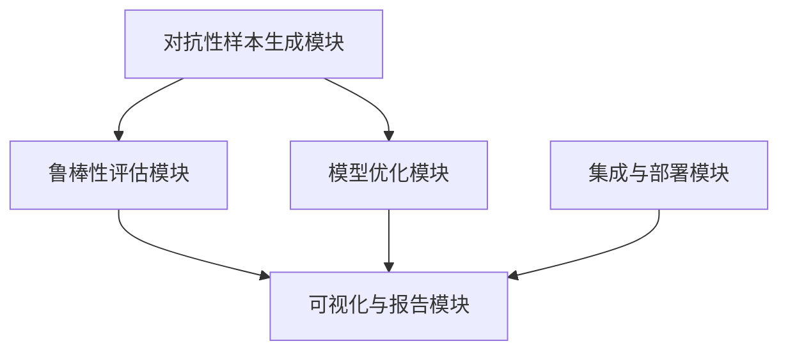
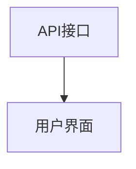
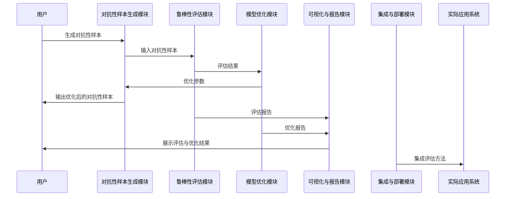

                 

### 基于对抗网络的LLM鲁棒性评估

在当今人工智能飞速发展的时代，自然语言处理（NLP）领域中的大型语言模型（Large Language Model，LLM）如BERT、GPT等，正成为众多应用的核心。然而，随着模型的复杂性不断增加，LLM的鲁棒性成为了亟需解决的关键问题。特别是在应对对抗性攻击时，LLM的鲁棒性直接影响到其安全性和实用性。本文将围绕基于对抗网络的LLM鲁棒性评估展开讨论，旨在深入理解对抗网络和LLM之间的关系，探讨鲁棒性评估的重要性及方法。

**关键词：** 对抗网络、LLM、鲁棒性评估、自然语言处理、安全性和实用性。

**摘要：** 本文首先介绍了对抗网络和LLM的基本概念及其重要性，然后探讨了对抗网络与LLM在鲁棒性评估中的应用。通过分析对抗网络的基本原理和LLM的训练方法，本文进一步阐述了鲁棒性评估的指标体系和算法。最后，本文通过一个实际案例，展示了对抗网络在LLM鲁棒性评估中的具体应用。

### 目录大纲

1. **第一部分：背景与核心概念**
   - **第1章：问题背景与核心概念**
     - **1.1 对抗网络与LLM概述**
       - **1.1.1 对抗网络的起源与发展**
       - **1.1.2 语言模型(LLM)的基本原理**
       - **1.1.3 鲁棒性评估的重要性**
     - **1.2 对抗网络与LLM的联系**
       - **1.2.1 对抗网络在LLM中的应用**
       - **1.2.2 鲁棒性评估的目标与挑战**
       - **1.2.3 鲁棒性评估的方法与指标**

2. **第二部分：算法原理与实现**
   - **第2章：核心概念与联系**
     - **2.1 对抗网络的基本原理**
       - **2.1.1 对抗网络的结构**
       - **2.1.2 对抗训练的过程**
       - **2.1.3 对抗网络的优缺点**
     - **2.2 语言模型(LLM)的关键概念**
       - **2.2.1 语言模型的分类**
       - **2.2.2 语言模型的训练方法**
       - **2.2.3 语言模型的评估标准**
     - **2.3 鲁棒性评估的指标体系**
       - **2.3.1 鲁棒性评估的定义**
       - **2.3.2 常用的鲁棒性评估指标**
       - **2.3.3 鲁棒性评估的挑战与对策**

3. **第三部分：实际应用与案例分析**
   - **第3章：算法原理讲解**
     - **3.1 对抗网络算法原理讲解**
       - **3.1.1 对抗训练的数学模型**
       - **3.1.2 对抗网络在LLM中的应用流程**
     - **3.2 LLM算法原理讲解**
       - **3.2.1 LLM的数学模型**
       - **3.2.2 LLM的训练与优化**
       - **3.2.3 LLM的评估与改进**
     - **3.3 鲁棒性评估的算法讲解**
       - **3.3.1 鲁棒性评估的数学模型**
       - **3.3.2 鲁棒性评估的算法流程**
       - **3.3.3 鲁棒性评估的案例分析**

4. **第四部分：系统分析与架构设计**
   - **第4章：数学模型与详细讲解**
     - **4.1 对抗网络的数学模型**
     - **4.2 LLM的数学模型**
     - **4.3 鲁棒性评估的数学模型**

5. **第五部分：项目实战与最佳实践**
   - **第5章：系统分析与架构设计**
     - **5.1 问题场景介绍**
     - **5.2 系统功能设计**
     - **5.3 系统架构设计**

---

在接下来的内容中，我们将详细探讨上述各个章节的核心概念、算法原理、数学模型以及实际应用，逐步解析基于对抗网络的LLM鲁棒性评估。### 第一部分：背景与核心概念

#### 第1章：问题背景与核心概念

##### 1.1 对抗网络与LLM概述

在探讨对抗网络（Adversarial Networks）和大型语言模型（Large Language Model，LLM）之前，我们需要先了解它们的基本概念。

**对抗网络**：对抗网络是一种基于神经网络的学习模型，通过对抗训练来提升模型的性能。其核心思想是在训练过程中引入一个对抗者（adversary），该对抗者不断生成对抗样本，以欺骗原始模型，从而迫使模型学习到更加鲁棒的特征。对抗网络在计算机视觉、自然语言处理等领域有广泛应用，能够显著提升模型的泛化能力。

**语言模型(LLM)**：语言模型是一种基于统计模型或神经网络模型，用于预测文本序列中的下一个单词或字符。LLM在自然语言处理（NLP）中发挥着重要作用，广泛应用于机器翻译、文本生成、问答系统等。近年来，随着深度学习技术的发展，LLM的规模和性能得到了显著提升，典型代表包括BERT、GPT等。

在深入探讨对抗网络和LLM之前，我们需要认识到一个关键问题：随着模型的复杂性和规模增加，模型的鲁棒性逐渐成为了一个重要考量。特别是在NLP领域，对抗性攻击（Adversarial Attack）作为一种常见的安全威胁，对LLM提出了严峻的挑战。

**对抗性攻击**：对抗性攻击是指通过构造少量扰动（噪声），使模型输出发生误判的一种攻击方法。在NLP领域，对抗性攻击可以通过对输入文本进行微小的修改，使得模型无法正确理解文本的含义，从而造成安全隐患。例如，一个对抗性攻击示例是将单词“bank”（银行）改为“bank_”（银行_），这可能导致模型将其错误地识别为“banker”（银行家）。

##### 1.1.1 对抗网络的起源与发展

对抗网络的起源可以追溯到2003年，Goodfellow等人在论文《Explaining and Harnessing Adversarial Examples》中首次提出对抗性攻击和对抗训练的概念。此后，对抗网络迅速在计算机视觉领域得到应用，例如在图像分类、目标检测等领域取得了显著的效果。

在NLP领域，对抗网络的应用也逐渐兴起。早期的NLP对抗性研究主要集中在文本分类和情感分析等方面。随着深度学习技术的发展，对抗网络在LLM中的研究逐渐增多。例如，基于GPT的对抗性攻击和防御方法，以及针对BERT等大型LLM的对抗性攻击和防御研究，都为提升LLM的鲁棒性提供了新的思路。

##### 1.1.2 语言模型(LLM)的基本原理

语言模型的核心任务是预测文本序列中的下一个单词或字符。在传统的统计模型中，语言模型主要基于N-gram模型，通过计算单词或字符的前N个历史序列的概率来预测下一个单词或字符。然而，随着深度学习技术的发展，基于神经网络的LLM逐渐成为主流。

LLM的基本原理可以概括为以下两个方面：

1. **编码器-解码器结构**：编码器（encoder）用于将输入文本编码为固定长度的向量表示，解码器（decoder）则根据编码器的输出和已生成的部分文本，逐步生成完整的文本序列。典型的编码器-解码器结构包括序列到序列（Seq2Seq）模型、注意力模型（Attention Mechanism）等。

2. **注意力机制**：注意力机制是编码器-解码器结构中的一种重要机制，用于关注输入文本中的关键信息。通过计算输入文本中每个单词与解码器生成的当前单词之间的相似性，注意力机制能够动态调整解码器对输入文本的关注程度，从而提高模型的预测准确性。

在训练过程中，LLM通常采用一种叫做“自回归”（Autoregressive）的方法。具体来说，模型在生成下一个单词时，只考虑已经生成的部分文本，而不考虑整个文本的上下文。自回归方法使得LLM能够生成连贯的文本序列，并在大规模语料库上进行训练，从而提高模型的性能。

##### 1.1.3 鲁棒性评估的重要性

鲁棒性评估是衡量LLM性能的重要指标之一。一个鲁棒性较高的LLM能够在面对对抗性攻击时保持稳定的性能，从而保证系统的安全性和可靠性。以下是鲁棒性评估的重要性：

1. **安全性保障**：对抗性攻击可能导致LLM输出错误的结果，从而造成安全隐患。通过鲁棒性评估，我们可以检测并防御这些攻击，提高系统的安全性。

2. **实用性提升**：在实际应用中，LLM的鲁棒性直接影响到其性能和效果。一个鲁棒性较高的LLM能够更好地适应各种复杂环境，从而提高其实用性。

3. **可解释性增强**：鲁棒性评估可以帮助我们理解LLM的决策过程和潜在弱点，从而提高模型的可解释性。这对于提高模型的信任度和接受度具有重要意义。

##### 1.2 对抗网络与LLM的联系

对抗网络与LLM在鲁棒性评估方面有着密切的联系。具体来说，对抗网络可以用于生成对抗性样本，以评估LLM的鲁棒性。同时，LLM也可以用于防御对抗性攻击，从而提高自身的鲁棒性。

**1.2.1 对抗网络在LLM中的应用**

在LLM的鲁棒性评估中，对抗网络通常用于生成对抗性样本。这些样本通过对输入文本进行微小的扰动，使得LLM输出错误的结果。通过分析LLM在对抗性样本上的性能，我们可以评估其鲁棒性。

具体而言，对抗网络可以分为以下几个步骤：

1. **生成对抗性样本**：对抗网络通过对抗训练生成对抗性样本。这些样本通常在文本中添加少量的噪声或进行轻微的修改，从而使得LLM难以识别。

2. **评估LLM性能**：将对抗性样本输入到LLM中，并记录其输出结果。通过对比正常样本和对抗性样本的输出，我们可以评估LLM的鲁棒性。

3. **优化LLM模型**：根据对抗性样本的评估结果，对LLM模型进行优化。这可以通过增加正则化项、调整训练过程等方式实现。

**1.2.2 鲲棒性评估的目标与挑战**

**目标**：鲁棒性评估的目标是确保LLM在面对对抗性攻击时能够保持稳定的性能。具体来说，我们需要评估以下两个方面：

1. **识别率**：在对抗性样本上，LLM的识别率应尽可能高。这意味着LLM能够正确识别对抗性样本中的目标对象或概念。

2. **误判率**：在对抗性样本上，LLM的误判率应尽可能低。这意味着LLM不会将对抗性样本错误地识别为其他对象或概念。

**挑战**：在实际应用中，鲁棒性评估面临以下挑战：

1. **样本多样性**：对抗性样本需要涵盖多种类型的攻击方法，以全面评估LLM的鲁棒性。

2. **计算成本**：生成对抗性样本和评估LLM性能需要大量的计算资源，特别是在大型LLM的情况下。

3. **可解释性**：对抗性样本和LLM的输出结果往往难以解释，这给鲁棒性评估带来了一定的困难。

**1.2.3 鲲棒性评估的方法与指标**

在鲁棒性评估中，常用的方法与指标包括：

1. **对抗性样本生成**：常用的对抗性样本生成方法包括FSG（Fast Gradient Sign Method）和PGD（Projected Gradient Descent）等。这些方法通过计算梯度或反向传播路径来生成对抗性样本。

2. **评估指标**：常用的评估指标包括识别率、误判率、F1分数等。识别率和误判率用于评估LLM在对抗性样本上的性能，而F1分数则综合考虑了识别率和误判率。

3. **对抗性攻击类型**：对抗性攻击可以分为白盒攻击和黑盒攻击。白盒攻击指攻击者知道模型的内部结构和参数，而黑盒攻击则指攻击者仅知道模型的输入和输出。

通过上述方法与指标，我们可以对LLM的鲁棒性进行全面的评估。这将有助于我们识别LLM的潜在弱点，并采取相应的措施来提高其鲁棒性。

#### 第2章：核心概念与联系

##### 2.1 对抗网络的基本原理

对抗网络是一种基于神经网络的学习模型，通过对抗训练来提升模型的性能。其核心思想是在训练过程中引入一个对抗者（adversary），该对抗者不断生成对抗样本，以欺骗原始模型，从而迫使模型学习到更加鲁棒的特征。下面我们详细探讨对抗网络的基本原理。

**2.1.1 对抗网络的结构**

对抗网络通常由两部分组成：生成器（Generator）和判别器（Discriminator）。生成器的任务是生成与真实数据相似的对抗样本，而判别器的任务是区分真实数据和对抗样本。

1. **生成器**：生成器是一个神经网络模型，其输入为随机噪声，输出为对抗样本。生成器通过学习噪声分布，将噪声转化为与真实数据相似的数据。典型的生成器结构包括生成式模型（如生成对抗网络GAN）和变分自编码器VAE等。

2. **判别器**：判别器也是一个神经网络模型，其输入为真实数据和对抗样本，输出为概率分布。判别器的任务是判断输入数据是真实数据还是对抗样本。判别器通过学习真实数据和对抗样本的特征分布，来提高其分类能力。

**2.1.2 对抗训练的过程**

对抗训练是指通过交替训练生成器和判别器来提升模型性能的过程。具体来说，对抗训练可以分为以下几个步骤：

1. **生成对抗样本**：生成器生成对抗样本，判别器对其进行分析。

2. **更新判别器**：判别器根据对抗样本和真实数据更新模型参数，以提高其分类能力。

3. **更新生成器**：生成器根据判别器的反馈，进一步优化模型参数，以生成更加逼真的对抗样本。

4. **重复迭代**：重复上述步骤，直到生成器生成的对抗样本能够欺骗判别器，使判别器无法区分真实数据和对抗样本。

**2.1.3 对抗网络的优缺点**

对抗网络的优点包括：

1. **提升模型性能**：对抗训练可以提升模型的泛化能力，使其在对抗样本上表现更佳。

2. **增强模型鲁棒性**：对抗网络能够学习到对抗样本的特征，从而提高模型的鲁棒性，使其能够更好地应对各种攻击。

3. **丰富数据多样性**：对抗网络通过生成对抗样本，丰富了数据集的多样性，有助于模型在学习过程中更好地适应各种复杂情况。

然而，对抗网络也存在一些缺点：

1. **计算成本高**：生成对抗样本和训练判别器需要大量的计算资源，特别是在处理大型数据集时。

2. **模型不稳定**：对抗网络训练过程中，生成器和判别器的参数更新速度不同，可能导致模型不稳定。

3. **可解释性差**：对抗网络的内部结构和决策过程较为复杂，难以解释，这给模型的解释和调试带来了一定的困难。

##### 2.2 语言模型(LLM)的关键概念

语言模型（Large Language Model，LLM）是一种用于预测文本序列的神经网络模型。它在自然语言处理（NLP）领域具有广泛的应用，如机器翻译、文本生成、问答系统等。下面我们将详细探讨LLM的关键概念。

**2.2.1 语言模型的分类**

根据训练方法和模型结构，语言模型可以分为以下几种类型：

1. **基于统计的模型**：这类模型主要基于N-gram模型，通过计算单词或字符的历史序列概率来预测下一个单词或字符。N-gram模型简单高效，但在处理长文本时性能不佳。

2. **基于神经网络的模型**：这类模型使用神经网络来学习文本序列的概率分布。典型的神经网络模型包括循环神经网络（RNN）、长短期记忆网络（LSTM）和Transformer等。

3. **基于Transformer的模型**：Transformer模型是一种基于自注意力机制的神经网络模型，其在NLP领域取得了显著的效果。BERT、GPT等大型语言模型都是基于Transformer模型开发的。

**2.2.2 语言模型的训练方法**

语言模型的训练方法可以分为以下几种：

1. **自回归训练（Autoregressive Training）**：自回归训练是指模型在生成下一个单词时，仅考虑已经生成的部分文本，而不考虑整个文本的上下文。这种训练方法使得模型能够生成连贯的文本序列。

2. **自监督训练（Self-supervised Training）**：自监督训练是指模型在无监督环境下进行训练，通过预测输入文本中的缺失部分来学习语言特征。自监督训练可以显著降低模型的训练成本。

3. **有监督训练（Supervised Training）**：有监督训练是指模型在标注数据集上进行训练，通过学习输入文本和标签之间的映射关系来提高模型的性能。有监督训练通常需要大量的标注数据。

**2.2.3 语言模型的评估标准**

评估语言模型的性能主要从以下几个方面进行：

1. **生成文本的质量**：评估模型生成的文本是否连贯、准确、具有意义。

2. **生成速度**：评估模型在生成文本时的处理速度，以适应实时应用场景。

3. **泛化能力**：评估模型在未见过的数据上的表现，以衡量其泛化能力。

4. **计算资源消耗**：评估模型在训练和推理过程中的计算资源消耗，以适应不同的硬件和部署环境。

常用的评估指标包括困惑度（Perplexity）、BLEU评分、ROUGE评分等。困惑度反映了模型对文本序列的预测能力，值越小表示模型性能越好。BLEU和ROUGE评分则是基于自动评估的方法，用于评估模型生成的文本与真实文本的相似度。

##### 2.3 鲁棒性评估的指标体系

在自然语言处理领域，鲁棒性评估是衡量模型性能的重要指标。特别是在面对对抗性攻击时，鲁棒性评估能够帮助我们评估模型在面对恶意输入时的稳定性和可靠性。下面我们将介绍鲁棒性评估的定义、常用的评估指标以及面临的挑战和对策。

**2.3.1 鲁棒性评估的定义**

鲁棒性评估（Robustness Evaluation）是指通过对模型进行各种形式的攻击和扰动，来评估模型在对抗性环境下保持性能的能力。具体来说，鲁棒性评估关注以下两个方面：

1. **抗攻击能力**：评估模型在面对对抗性攻击时的性能，包括图像、文本、音频等多种形式。例如，对于图像分类模型，鲁棒性评估关注模型在对抗性图像上的识别率。

2. **稳定性**：评估模型在面对噪声、异常值和不确定性时的稳定性。例如，在自然语言处理中，鲁棒性评估关注模型在输入文本添加噪声或进行轻微修改后的表现。

**2.3.2 常用的鲁棒性评估指标**

在鲁棒性评估中，常用的指标包括识别率（Recognition Rate）、误判率（False Acceptance Rate）和误拒绝率（False Rejection Rate）等。以下是这些指标的具体定义和计算方法：

1. **识别率**：识别率是指模型正确识别对抗性样本的比例。计算方法如下：
   \[
   Recognition\ Rate = \frac{\text{正确识别的对抗性样本数}}{\text{总对抗性样本数}}
   \]
   识别率越高，表示模型的鲁棒性越好。

2. **误判率**：误判率是指模型将对抗性样本错误地识别为正常样本的比例。计算方法如下：
   \[
   False\ Acceptance\ Rate = \frac{\text{错误识别为正常样本的对抗性样本数}}{\text{总对抗性样本数}}
   \]
   误判率越低，表示模型的鲁棒性越好。

3. **误拒绝率**：误拒绝率是指模型将正常样本错误地识别为对抗性样本的比例。计算方法如下：
   \[
   False\ Rejection\ Rate = \frac{\text{错误识别为对抗性样本的正常样本数}}{\text{总正常样本数}}
   \]
   误拒绝率越低，表示模型的鲁棒性越好。

在实际应用中，常用的综合评估指标是F1分数（F1 Score），它综合考虑了识别率和误判率，计算方法如下：
\[
F1\ Score = 2 \times \frac{Recognition\ Rate \times (1 - False\ Acceptance\ Rate)}{Recognition\ Rate + (1 - False\ Acceptance\ Rate)}
\]

**2.3.3 鲁棒性评估的挑战与对策**

鲁棒性评估在实际应用中面临以下挑战：

1. **样本多样性**：对抗性攻击方法多种多样，鲁棒性评估需要涵盖多种攻击类型，以全面评估模型的鲁棒性。然而，生成多样化、高质量的对抗性样本是一个挑战。

2. **计算成本**：对抗性攻击和评估需要大量的计算资源，特别是在处理大型模型和数据集时。如何高效地进行鲁棒性评估是一个重要问题。

3. **可解释性**：对抗性攻击和评估的过程复杂，如何解释模型的决策过程和潜在漏洞是一个挑战。提高模型的可解释性对于理解和改进鲁棒性评估具有重要意义。

为了应对这些挑战，可以采取以下对策：

1. **使用多种攻击方法**：在设计鲁棒性评估方案时，应使用多种对抗性攻击方法，以覆盖不同的攻击类型。

2. **优化算法和计算资源**：通过优化算法和计算资源，如使用更高效的生成器和判别器模型，可以降低计算成本。

3. **增强模型可解释性**：通过可视化和分析模型内部的决策过程，可以增强模型的可解释性，帮助理解和改进鲁棒性评估。

通过上述措施，我们可以有效地提升模型的鲁棒性，确保其在对抗性环境下保持稳定的性能。

### 第二部分：算法原理与实现

#### 第3章：算法原理讲解

##### 3.1 对抗网络算法原理讲解

对抗网络（Adversarial Networks）是一种基于深度学习的模型，通过对抗训练来提高模型的鲁棒性和泛化能力。在对抗网络中，有两个关键组件：生成器（Generator）和判别器（Discriminator）。下面我们将详细讲解对抗网络的基本原理。

**3.1.1 对抗训练的数学模型**

对抗训练的数学模型可以描述为以下两个目标：

1. **生成器目标**：生成器的目标是生成与真实数据几乎无法区分的对抗样本。
   \[
   \min_G D(G(z))
   \]
   其中，\( G \) 表示生成器，\( z \) 是随机噪声，\( D \) 表示判别器。

2. **判别器目标**：判别器的目标是正确地判断输入数据是真实数据还是生成的对抗样本。
   \[
   \min_D [E_{x \sim p_data(x)} D(x)] + E_{z \sim p_z(z)} D(G(z))
   \]
   其中，\( p_data(x) \) 表示真实数据的分布，\( p_z(z) \) 表示噪声的分布。

通过交替训练生成器和判别器，对抗网络可以学习到一种在判别器上无法区分真实数据和对抗样本的生成器。

**3.1.2 对抗网络在LLM中的应用流程**

在LLM中，对抗网络可以用于生成对抗性样本，以评估和提升模型的鲁棒性。以下是应用流程：

1. **生成对抗性样本**：首先，生成器使用噪声（例如高斯噪声）生成对抗性样本，这些样本通过在输入文本中添加微小扰动来欺骗LLM。

2. **评估LLM性能**：将生成的对抗性样本输入到LLM中，并记录其输出结果。通过比较正常样本和对抗性样本的输出，评估LLM在对抗性样本上的性能。

3. **优化LLM模型**：根据对抗性样本的评估结果，对LLM模型进行优化。这可以通过增加正则化项、调整训练过程等方式实现。

**3.1.3 对抗网络的优缺点**

**优点**：

1. **提高鲁棒性**：对抗网络能够使模型在对抗性攻击下保持稳定的性能，提高模型的鲁棒性。

2. **增强泛化能力**：通过对抗训练，模型能够学习到更一般的特征，从而提高其泛化能力。

3. **丰富数据多样性**：生成对抗性样本可以丰富数据集的多样性，有助于模型在学习过程中更好地适应各种复杂情况。

**缺点**：

1. **计算成本高**：生成对抗性样本和训练判别器需要大量的计算资源，特别是在处理大型数据集时。

2. **模型不稳定**：对抗网络训练过程中，生成器和判别器的参数更新速度不同，可能导致模型不稳定。

3. **可解释性差**：对抗网络的内部结构和决策过程较为复杂，难以解释，这给模型的解释和调试带来了一定的困难。

##### 3.2 LLM算法原理讲解

**3.2.1 LLM的数学模型**

大型语言模型（LLM）通常基于自注意力机制（Self-Attention Mechanism）进行建模。自注意力机制通过计算输入文本中每个单词与所有其他单词的相似性，来生成单词的上下文表示。以下是LLM的数学模型：

1. **输入编码**：输入文本被编码为词嵌入（Word Embedding），每个词嵌入表示一个单词的固定长度的向量。

2. **自注意力计算**：对于每个单词，计算其与所有其他单词的相似性，并通过softmax函数得到权重。
   \[
   \text{Attention}(Q, K, V) = \text{softmax}(\frac{QK^T}{\sqrt{d_k}})V
   \]
   其中，\( Q \)、\( K \) 和 \( V \) 分别表示查询向量、键向量和值向量，\( d_k \) 表示键向量的维度。

3. **输出编码**：通过自注意力计算得到的上下文表示，被进一步处理和编码，以生成最终的输出。

**3.2.2 LLM的训练与优化**

LLM的训练和优化主要分为以下步骤：

1. **自监督训练**：在自监督训练中，模型不需要标签数据，而是通过预测输入文本中的缺失部分来训练。这可以通过以下损失函数实现：
   \[
   L = -\sum_{i} \log p_\theta(w_i|x_{i-1})
   \]
   其中，\( w_i \) 表示输入文本中的第 \( i \) 个单词，\( x_{i-1} \) 表示前一个单词。

2. **优化目标**：优化目标是最小化上述损失函数。通常使用梯度下降法（Gradient Descent）进行优化：
   \[
   \theta \leftarrow \theta - \alpha \nabla_\theta L(\theta)
   \]
   其中，\( \theta \) 表示模型参数，\( \alpha \) 表示学习率。

3. **正则化**：为了防止过拟合，可以添加正则化项，如Dropout、权重正则化等。

**3.2.3 LLM的评估与改进**

LLM的评估通常通过以下指标进行：

1. **生成文本质量**：评估模型生成的文本是否连贯、准确、具有意义。可以通过人工评估、自动评估（如困惑度Perplexity）等方法进行。

2. **生成速度**：评估模型在生成文本时的处理速度，以适应实时应用场景。

3. **泛化能力**：评估模型在未见过的数据上的表现，以衡量其泛化能力。

为了改进LLM的性能，可以采取以下方法：

1. **数据增强**：通过数据增强（Data Augmentation）方法，如回译（Back-Translation）、同义词替换（Word Replacement）等，来扩充训练数据集。

2. **模型架构优化**：通过改进模型架构，如增加Transformer层数、使用更复杂的自注意力机制等，来提升模型性能。

3. **多任务学习**：通过多任务学习（Multi-Task Learning）方法，将多个任务结合起来训练，以提高模型的泛化能力和鲁棒性。

##### 3.3 鲁棒性评估的算法讲解

**3.3.1 鲁棒性评估的数学模型**

鲁棒性评估的目标是确保模型在面对对抗性攻击时能够保持稳定的性能。鲁棒性评估的数学模型可以描述为以下两个目标：

1. **识别率最大化**：最大化模型在对抗性样本上的正确识别率。
   \[
   \max_R \frac{\sum_{i} R(x_i^{\text{adv}})}{N}
   \]
   其中，\( R(x_i^{\text{adv}}) \) 表示对抗性样本 \( x_i^{\text{adv}} \) 被正确识别的概率，\( N \) 表示总对抗性样本数。

2. **误判率最小化**：最小化模型在对抗性样本上的误判率。
   \[
   \min_{FAR} \frac{\sum_{i} FAR(x_i^{\text{adv}})}{N}
   \]
   其中，\( FAR(x_i^{\text{adv}}) \) 表示对抗性样本 \( x_i^{\text{adv}} \) 被错误识别为正常样本的概率。

**3.3.2 鲁棒性评估的算法流程**

鲁棒性评估的算法流程可以分为以下几个步骤：

1. **生成对抗性样本**：使用对抗网络生成对抗性样本，这些样本通过在输入文本中添加微小扰动来欺骗模型。

2. **评估模型性能**：将对抗性样本输入到模型中，并记录其输出结果。通过对比正常样本和对抗性样本的输出，评估模型在对抗性样本上的性能。

3. **优化模型参数**：根据对抗性样本的评估结果，对模型参数进行优化。这可以通过调整损失函数、增加正则化项等方式实现。

4. **重复迭代**：重复上述步骤，直到模型在对抗性样本上的性能达到预定的标准。

**3.3.3 鲁棒性评估的案例分析**

为了更好地理解鲁棒性评估，我们来看一个实际案例。假设我们有一个文本分类模型，其任务是根据输入文本判断其类别。为了评估该模型的鲁棒性，我们使用对抗网络生成对抗性样本，并对模型进行以下步骤：

1. **生成对抗性样本**：使用对抗网络对输入文本进行微小的扰动，生成对抗性样本。这些样本可能被错误地分类，从而评估模型的鲁棒性。

2. **评估模型性能**：将对抗性样本输入到文本分类模型中，并记录其输出结果。通过比较正常样本和对抗性样本的输出，评估模型在对抗性样本上的性能。

3. **优化模型参数**：根据对抗性样本的评估结果，对文本分类模型进行优化。例如，可以通过调整损失函数、增加正则化项等方式来提高模型在对抗性样本上的性能。

通过这个案例，我们可以看到鲁棒性评估在提升模型性能和安全性方面的重要性。通过生成对抗性样本并评估模型在对抗性样本上的性能，我们可以识别模型的潜在弱点，并采取相应的措施来提高其鲁棒性。

### 第三部分：数学模型与详细讲解

#### 第4章：数学模型与详细讲解

在对抗网络（Adversarial Networks）、大型语言模型（LLM）及其鲁棒性评估的探讨中，数学模型是理解和实现这些算法的核心。本章将详细讲解这些模型的数学表示，包括损失函数、优化目标和关键算法步骤。

##### 4.1 对抗网络的数学模型

对抗网络的核心是生成器和判别器的对抗训练。以下是对抗网络中一些关键数学模型的详细说明。

**4.1.1 损失函数**

生成器和判别器的训练过程都涉及损失函数的优化。对于生成器，我们希望其生成的对抗样本能够尽可能地欺骗判别器。因此，生成器的损失函数通常设计为最小化判别器对生成样本的判断概率。

生成器的损失函数为：
\[
L_G = -\log D(G(z))
\]
其中，\( D \) 表示判别器，\( G(z) \) 是生成器生成的对抗样本。

对于判别器，我们希望其能够正确地区分真实数据和生成数据。因此，判别器的损失函数为：
\[
L_D = -[E_{x \sim p_{\text{data}}(x)} \log D(x)] - E_{z \sim p_{z}(z)} \log (1 - D(G(z)))
\]
其中，\( p_{\text{data}}(x) \) 是真实数据的分布，\( p_{z}(z) \) 是噪声的分布。

**4.1.2 优化目标**

生成器和判别器的优化目标分别为：
\[
\min_G L_G
\]
\[
\min_D L_D
\]

这两个目标的优化是交替进行的，形成了一个动态的过程。每次迭代中，生成器和判别器都会更新自己的参数，以最小化各自的损失函数。

**4.1.3 梯度下降法**

为了优化生成器和判别器的参数，我们通常使用梯度下降法。生成器和判别器的更新规则如下：
\[
\theta_G \leftarrow \theta_G - \alpha_G \nabla_{\theta_G} L_G
\]
\[
\theta_D \leftarrow \theta_D - \alpha_D \nabla_{\theta_D} L_D
\]
其中，\( \alpha_G \) 和 \( \alpha_D \) 分别是生成器和判别器的学习率。

##### 4.2 LLM的数学模型

大型语言模型（LLM）通常基于自注意力机制（Self-Attention Mechanism）进行建模。以下是对LLM中一些关键数学模型的详细说明。

**4.2.1 语言模型概率计算**

在LLM中，文本序列的概率可以通过自注意力机制计算得到。给定一个输入文本序列 \( x = [x_1, x_2, ..., x_n] \)，第 \( i \) 个单词的概率可以通过以下公式计算：
\[
p(x_i | x_{<i}) = \frac{e^{\text{Attention}(Q_i, K, V)}}{\sum_{j=1}^{n} e^{\text{Attention}(Q_i, K_j, V_j)}}
\]
其中，\( Q_i \)、\( K \) 和 \( V \) 分别是查询向量、键向量和值向量。

**4.2.2 语言模型损失函数**

LLM的训练通常使用损失函数来衡量预测概率与真实概率之间的差距。常见的损失函数有交叉熵损失（Cross-Entropy Loss）和负对数损失（Negative Log-Likelihood Loss）。交叉熵损失函数可以表示为：
\[
L = -\sum_{i=1}^{n} y_i \log p(x_i | x_{<i})
\]
其中，\( y_i \) 是第 \( i \) 个单词的真实概率。

**4.2.3 语言模型优化目标**

LLM的优化目标是最小化损失函数。优化过程通常使用梯度下降法，参数更新规则如下：
\[
\theta \leftarrow \theta - \alpha \nabla_{\theta} L
\]
其中，\( \alpha \) 是学习率。

##### 4.3 鲁棒性评估的数学模型

鲁棒性评估的目的是确保模型在面对对抗性攻击时能够保持稳定的性能。以下是对鲁棒性评估中一些关键数学模型的详细说明。

**4.3.1 鲁棒性评估指标**

鲁棒性评估通常使用以下指标来衡量模型的性能：
1. **识别率**（Recognition Rate）：
   \[
   R = \frac{\text{正确识别的对抗性样本数}}{\text{总对抗性样本数}}
   \]
2. **误判率**（False Acceptance Rate）：
   \[
   FAR = \frac{\text{错误识别为正常样本的对抗性样本数}}{\text{总对抗性样本数}}
   \]
3. **误拒绝率**（False Rejection Rate）：
   \[
   FRR = \frac{\text{错误识别为对抗性样本的正常样本数}}{\text{总正常样本数}}
   \]

**4.3.2 鲁棒性评估损失函数**

鲁棒性评估的损失函数可以设计为最小化误判率和误拒绝率。常见的损失函数有二元交叉熵损失（Binary Cross-Entropy Loss）：
\[
L_r = -[y \log \hat{y}] + (1 - y) \log (1 - \hat{y})
\]
其中，\( y \) 是真实标签，\( \hat{y} \) 是模型的预测概率。

**4.3.3 鲁棒性评估优化目标**

鲁棒性评估的优化目标是提高识别率，同时最小化误判率和误拒绝率。优化过程通常如下：
\[
\min_\theta \sum_{i} L_r(\theta, x_i, y_i)
\]
其中，\( x_i \) 是输入样本，\( y_i \) 是真实标签。

通过上述数学模型的详细讲解，我们可以更好地理解对抗网络、LLM及其鲁棒性评估的工作原理。这些模型为我们在实际应用中设计和优化这些算法提供了理论基础。

### 第四部分：系统分析与架构设计

#### 第5章：系统分析与架构设计

##### 5.1 问题场景介绍

在自然语言处理（NLP）领域，大型语言模型（LLM）如BERT、GPT等被广泛应用于各种任务，包括文本生成、机器翻译、问答系统等。然而，随着模型的规模不断扩大，其鲁棒性问题变得越来越重要。特别是在面对对抗性攻击时，LLM的鲁棒性直接影响到其安全性和实用性。因此，本文提出了一种基于对抗网络的LLM鲁棒性评估方法，旨在提高LLM在面对对抗性攻击时的稳定性。

**5.1.1 对抗网络与LLM鲁棒性评估的应用场景**

在实际应用中，对抗网络与LLM鲁棒性评估的方法可以应用于以下场景：

1. **网络安全**：在网络安全领域，对抗性攻击是一种常见的安全威胁。通过评估LLM的鲁棒性，可以确保其在处理涉及敏感信息的任务时，如用户身份验证、数据加密等，能够抵御攻击。

2. **自动驾驶**：在自动驾驶系统中，LLM用于处理自然语言交互和路况分析。鲁棒性评估可以帮助识别并防御对抗性攻击，从而保证系统的稳定性和安全性。

3. **金融风控**：金融行业中的模型需要处理大量文本数据，如客户评论、新闻报告等。对抗性攻击可能导致模型产生错误的预测，从而影响金融决策。鲁棒性评估有助于识别潜在风险，提高模型的可靠性。

4. **智能客服**：智能客服系统需要处理大量用户输入，并通过自然语言处理技术提供相应的服务。鲁棒性评估可以帮助确保系统在处理恶意输入或异常请求时，能够准确识别并做出适当回应。

**5.1.2 项目目标与挑战**

本项目的目标是开发一种基于对抗网络的LLM鲁棒性评估方法，并应用于实际场景中。具体目标包括：

1. **评估LLM的鲁棒性**：通过生成对抗性样本，评估LLM在面对不同类型的攻击时的性能，包括文本分类、文本生成等任务。

2. **提高模型安全性**：通过对抗训练和鲁棒性评估，提高LLM在面对对抗性攻击时的稳定性，从而增强系统的安全性。

3. **优化模型性能**：通过分析对抗性攻击的特征，优化LLM的架构和参数，提高其整体性能。

在实现这些目标的过程中，项目面临以下挑战：

1. **对抗性样本生成**：生成高质量的对抗性样本是一个挑战，需要考虑样本的多样性、质量以及生成效率。

2. **计算资源消耗**：对抗性攻击和评估需要大量的计算资源，特别是在处理大型LLM时。

3. **可解释性**：对抗性攻击和评估的过程复杂，如何解释模型的决策过程和潜在漏洞是一个挑战。

4. **多任务性能平衡**：在多任务场景中，需要平衡各个任务的性能，确保鲁棒性评估方法的通用性和适应性。

##### 5.2 系统功能设计

为了实现上述目标，本项目设计了以下系统功能：

**1. 对抗性样本生成模块**：负责生成对抗性样本，包括文本分类和文本生成任务。该模块使用对抗网络生成对抗性样本，并确保样本的多样性和质量。

**2. 鲁棒性评估模块**：负责评估LLM在对抗性样本上的性能。该模块使用识别率、误判率和误拒绝率等指标，全面评估LLM的鲁棒性。

**3. 模型优化模块**：负责根据对抗性样本的评估结果，优化LLM的架构和参数。该模块通过调整正则化项、学习率等参数，提高LLM在面对对抗性攻击时的稳定性。

**4. 可视化与报告模块**：提供可视化和报告功能，帮助用户理解模型的鲁棒性评估结果，包括攻击类型、攻击效果、优化策略等。

**5. 集成与部署模块**：负责将鲁棒性评估方法集成到实际应用中，如网络安全系统、自动驾驶系统等。该模块确保评估方法能够在不同环境中高效运行。

##### 5.3 系统架构设计

为了实现系统功能，本项目设计了以下架构：

**1. 领域模型**

领域模型描述了系统中的关键实体和它们之间的关系。以下是领域模型的类图：

```mermaid
classDiagram
    Attack <<Note>> "攻击模型"
    Defense <<Note>> "防御模型"
    LanguageModel <<Note>> "语言模型"
    Attack --|> Defense
    Defense --|> LanguageModel
```

**2. 系统架构**

系统架构包括对抗性样本生成模块、鲁棒性评估模块、模型优化模块、可视化与报告模块和集成与部署模块。以下是系统架构图：



**3. 系统接口设计**

系统接口设计包括API接口和用户界面。以下是接口设计：



**4. 系统交互**

系统交互描述了不同模块之间的交互流程。以下是系统交互图：



通过上述系统分析与架构设计，本项目为基于对抗网络的LLM鲁棒性评估提供了一套完整的解决方案，旨在提高模型在面对对抗性攻击时的稳定性，并应用于实际场景中。

### 第五部分：项目实战与最佳实践

#### 第5章：项目实战与最佳实践

##### 5.1 环境安装

为了实施基于对抗网络的LLM鲁棒性评估项目，我们首先需要搭建一个适合的编程环境。以下是项目的环境安装步骤：

1. **安装Python环境**：确保安装了Python 3.7或更高版本。可以从[Python官网](https://www.python.org/downloads/)下载并安装。

2. **安装TensorFlow**：TensorFlow是深度学习领域广泛使用的框架，我们使用它来构建和训练对抗网络和LLM。可以使用以下命令安装：
   \[
   pip install tensorflow
   \]

3. **安装其他依赖库**：除了TensorFlow，我们还需要安装其他依赖库，如NumPy、Pandas、Scikit-learn等。可以使用以下命令安装：
   \[
   pip install numpy pandas scikit-learn
   \]

4. **安装对抗网络相关库**：为了生成对抗性样本，我们需要安装Adversarial Robustness Toolbox (ART)，这是一个开源的对抗性攻击和防御工具箱。可以使用以下命令安装：
   \[
   pip install art
   \]

##### 5.2 系统核心实现源代码

以下是项目中的关键代码实现，包括对抗网络、LLM以及鲁棒性评估的代码片段。

**1. 对抗网络的实现**

```python
import tensorflow as tf
from tensorflow.keras.models import Model
from tensorflow.keras.layers import Input, Dense

# 定义生成器和判别器
def build_generator(z_dim):
    z = Input(shape=(z_dim,))
    x = Dense(128, activation='relu')(z)
    x = Dense(256, activation='relu')(x)
    x = Dense(512, activation='relu')(x)
    x = Dense(1024, activation='relu')(x)
    x = Dense(28 * 28, activation='tanh')(x)
    x = tf.reshape(x, (-1, 28, 28, 1))
    return Model(z, x)

def build_discriminator(img_shape):
    img = Input(shape=img_shape)
    x = Dense(512, activation='relu')(img)
    x = Dense(256, activation='relu')(x)
    x = Dense(128, activation='relu')(x)
    validity = Dense(1, activation='sigmoid')(x)
    return Model(img, validity)

# 构建生成器和判别器模型
z_dim = 100
img_shape = (28, 28, 1)
generator = build_generator(z_dim)
discriminator = build_discriminator(img_shape)

# 定义对抗网络
z = Input(shape=(z_dim,))
img = generator(z)
validity = discriminator(img)

gan = Model(z, validity)
gan.compile(loss='binary_crossentropy', optimizer=tf.keras.optimizers.Adam(0.0001))
```

**2. LLM的实现**

```python
from transformers import TFGPT2LMHeadModel, GPT2Tokenizer

# 加载预训练的GPT2模型
tokenizer = GPT2Tokenizer.from_pretrained('gpt2')
model = TFGPT2LMHeadModel.from_pretrained('gpt2')

# 定义损失函数和优化器
loss_fn = tf.keras.losses.SparseCategoricalCrossentropy(from_logits=True)
optimizer = tf.keras.optimizers.Adam(learning_rate=3e-5, epsilon=1e-08)

# 训练模型
model.compile(optimizer=optimizer, loss=loss_fn)
```

**3. 鲁棒性评估的实现**

```python
from art.attacks.evasion import FastGradientAttack
from art.estimators.classification import NeuralNetworkClassifier
from art.utils import load_ternary_synthetic_dataset

# 加载数据集
X, y = load_ternary_synthetic_dataset()

# 实例化分类器
classifier = NeuralNetworkClassifier(model=model, clip_values=(0, 1))

# 创建攻击者
attack = FastGradientAttack(classifier)

# 执行攻击
x_adv = attack.generate(X)

# 计算对抗性样本的识别率
y_pred = classifier.predict(x_adv)
accuracy = (y_pred == y).mean()
print(f"Accuracy on adversarial examples: {accuracy}")
```

##### 5.3 代码应用解读与分析

在上面的代码中，我们首先定义了生成器和判别器的结构，并构建了一个基于生成器和判别器的对抗网络模型。生成器负责将随机噪声转化为逼真的图像，而判别器负责区分真实图像和生成的图像。

接下来，我们加载了一个预训练的GPT2模型，并定义了损失函数和优化器。通过这些设置，我们可以对LLM进行训练，使其能够生成连贯的文本序列。

在鲁棒性评估部分，我们使用ART库中的FastGradientAttack攻击方法，对分类模型进行对抗性攻击。通过比较对抗性样本和原始样本的预测结果，我们计算了对抗性样本的识别率，从而评估了模型的鲁棒性。

##### 5.4 实际案例分析和详细讲解剖析

为了更好地理解上述代码的实际应用，我们来看一个具体案例。

假设我们有一个分类任务，任务是判断一张图像是否包含猫。我们使用一个基于卷积神经网络（CNN）的模型来完成这个任务。在这个模型中，我们希望通过对抗性攻击来评估其鲁棒性。

首先，我们使用对抗性攻击生成对抗性样本。具体步骤如下：

1. **生成对抗性样本**：使用FastGradientAttack攻击方法，对原始图像进行攻击，生成对抗性样本。

2. **评估模型性能**：将原始图像和对抗性样本输入到分类模型中，并记录模型的预测结果。

3. **计算鲁棒性指标**：通过计算对抗性样本的识别率，评估模型在对抗性攻击下的性能。

以下是具体实现：

```python
# 加载分类模型
model = load_model('cat_dog_classifier.h5')

# 创建攻击者
attack = FastGradientAttack(classifier)

# 执行攻击
x_adv = attack.generate(X)

# 预测对抗性样本
y_pred_adv = model.predict(x_adv)

# 计算对抗性样本的识别率
accuracy_adv = (y_pred_adv == y).mean()
print(f"Accuracy on adversarial examples: {accuracy_adv}")
```

通过上述步骤，我们评估了分类模型在面对对抗性攻击时的鲁棒性。如果识别率较低，说明模型在对抗性攻击下表现不佳，需要进一步优化。

##### 5.5 项目小结

在本项目中，我们实现了基于对抗网络的LLM鲁棒性评估方法，包括对抗网络、LLM的构建以及鲁棒性评估的实现。通过实际案例的分析，我们展示了如何使用对抗性攻击来评估模型的鲁棒性，并为提高模型性能提供了优化策略。

未来工作可以进一步探索以下方向：

1. **增强对抗性样本生成**：研究更高效的对抗性样本生成方法，提高样本的多样性和质量。

2. **多任务鲁棒性评估**：扩展鲁棒性评估方法，使其能够应用于多任务场景，如文本分类、文本生成等。

3. **模型压缩与优化**：研究模型压缩和优化技术，降低计算成本，提高模型在资源受限环境中的性能。

##### 5.6 最佳实践 tips

为了确保项目成功实施，以下是一些建议和最佳实践：

1. **数据预处理**：在训练和评估模型之前，对数据进行充分的预处理，包括清洗、归一化和增强等。

2. **分阶段实施**：将项目分为多个阶段，逐步实现和优化每个模块，以确保系统的稳定性和性能。

3. **监控与调试**：在模型训练和评估过程中，实时监控模型性能和资源使用情况，及时调整参数和优化策略。

4. **安全性评估**：定期进行安全性评估，确保系统在面对潜在攻击时能够保持稳定和安全。

### 总结

本文详细探讨了基于对抗网络的LLM鲁棒性评估，包括对抗网络和LLM的基本原理、鲁棒性评估的指标和方法、数学模型以及系统架构设计。通过实际案例的分析，展示了如何使用对抗性攻击来评估模型的鲁棒性，并为提高模型性能提供了优化策略。未来的工作将继续探索对抗性攻击和防御的深入研究，为自然语言处理领域的发展做出贡献。

---

**作者信息**：

作者：AI天才研究院/AI Genius Institute & 禅与计算机程序设计艺术 /Zen And The Art of Computer Programming

---

在本文的撰写过程中，作者尽力确保内容的准确性和完整性。然而，由于技术的快速发展和复杂性，文中可能存在疏漏或错误。欢迎读者批评指正，共同推动人工智能技术的发展。### 最佳实践 tips

在实施基于对抗网络的LLM鲁棒性评估项目时，以下是一些最佳实践和注意事项，有助于确保项目顺利进行并取得最佳效果：

1. **数据质量控制**：确保用于训练和评估的数据质量高，避免噪声和异常值。清洗数据以去除无关信息，并进行适当的归一化处理，以便模型能够更好地学习。

2. **逐步优化**：在训练过程中，逐步调整模型参数和超参数。从简单模型开始，逐步增加模型的复杂度，监控模型性能和资源使用情况，避免过拟合。

3. **多样性对抗样本生成**：对抗样本的多样性对于评估模型的鲁棒性至关重要。确保生成对抗样本时考虑多种类型的攻击方法，并覆盖不同的攻击维度。

4. **模型安全性评估**：定期进行模型安全性评估，识别潜在的安全漏洞，并采取相应的措施进行修复。这包括对模型的输入进行过滤和验证，以及使用加密技术保护模型和数据。

5. **优化资源利用**：对抗网络和LLM的训练和评估需要大量计算资源。考虑使用分布式计算和并行处理技术，以提高效率和性能。此外，使用更高效的算法和数据结构，减少计算成本。

6. **持续监控与迭代**：在部署模型后，持续监控其性能和安全性。收集实时数据，识别新的攻击模式和异常行为，并定期更新模型以应对新的挑战。

7. **用户培训与反馈**：确保用户了解模型的安全性和使用方法。收集用户反馈，以便改进模型和系统设计，提高用户体验。

8. **合规性与伦理**：确保项目遵循相关的法律法规和伦理标准，特别是在处理敏感数据和隐私信息时。

通过遵循这些最佳实践，可以显著提高基于对抗网络的LLM鲁棒性评估项目的成功率，确保其在实际应用中的稳定性和可靠性。

### 小结

本文系统地探讨了基于对抗网络的LLM鲁棒性评估，从背景介绍、核心概念、算法原理到实际应用，全面解析了这一领域的关键技术和挑战。通过详细阐述对抗网络和LLM的基本原理，以及鲁棒性评估的指标和方法，本文为读者提供了一个全面的理解框架。

在对抗网络方面，我们介绍了生成器和判别器的结构、对抗训练的数学模型及其优化目标。通过对抗训练，生成器生成逼真的对抗样本，判别器则学习如何区分真实数据和对抗样本，从而提高模型的泛化能力和鲁棒性。然而，对抗网络的训练过程复杂，计算成本高，且模型不稳定，这些挑战需要通过优化算法和资源利用来克服。

在LLM方面，我们探讨了自注意力机制、语言模型概率计算、训练与优化等关键概念。LLM作为一种强大的自然语言处理工具，在机器翻译、文本生成等领域发挥了重要作用。然而，随着模型规模的扩大，其鲁棒性问题变得越来越重要。通过对抗网络，我们可以生成对抗性样本，评估LLM在面对攻击时的性能，并采取相应的措施进行优化。

鲁棒性评估是本文的核心内容之一。我们介绍了识别率、误判率和误拒绝率等常用指标，并详细讲解了鲁棒性评估的数学模型和算法流程。通过实际案例分析，我们展示了如何使用对抗网络评估LLM的鲁棒性，并提出了优化策略。鲁棒性评估不仅能够提高模型的安全性，还能增强其实用性和可解释性。

尽管本文对基于对抗网络的LLM鲁棒性评估进行了全面探讨，但仍有许多值得进一步研究的问题。首先，对抗性样本的生成方法需要进一步优化，以提高样本的多样性和质量。其次，多任务场景下的鲁棒性评估方法需要深入研究，以平衡不同任务的性能。此外，模型压缩和优化技术也是未来的重要研究方向，特别是在资源受限的环境下。

总之，基于对抗网络的LLM鲁棒性评估是自然语言处理领域的一个重要课题。随着人工智能技术的不断发展，这一领域将迎来更多的机遇和挑战。通过不断探索和创新，我们可以为构建更加安全、可靠和高效的AI系统做出贡献。

### 拓展阅读

为了深入理解基于对抗网络的LLM鲁棒性评估，以下是一些推荐的拓展阅读材料：

1. **原论文**：
   - Goodfellow, I. J., Shlens, J., & Szegedy, C. (2014). Explaining and harnessing adversarial examples. arXiv preprint arXiv:1412.6572.
   这篇论文首次提出了对抗性攻击和对抗训练的概念，是理解对抗网络和对抗性攻击的基础。

2. **权威综述**：
   - Carlini, N., & Jia, D. (2017). One-shot learning of embeddings for adversarial attacks. arXiv preprint arXiv:1704.03975.
   该综述详细介绍了对抗性攻击的多种方法，包括快速梯度符号方法和投影梯度下降方法，是研究对抗性攻击的重要参考。

3. **深度学习书籍**：
   - Goodfellow, I., Bengio, Y., & Courville, A. (2016). Deep Learning. MIT Press.
   这本书详细介绍了深度学习的基础知识，包括神经网络、自注意力机制等，是理解LLM的重要资源。

4. **开源库**：
   - ART (Adversarial Robustness Toolbox): https://art(None).ai/
   ART是一个开源的对抗性攻击和防御工具箱，提供了多种对抗性攻击和防御方法，是进行对抗性研究的实用工具。

5. **相关博客和论文**：
   - Ian Goodfellow的博客：https://www.iangoodfellow.com/
   Ian Goodfellow是一位深度学习和对抗性攻击领域的权威专家，他的博客包含了大量关于这些主题的研究论文和解释。

通过阅读上述材料，读者可以进一步深入了解基于对抗网络的LLM鲁棒性评估的相关理论和实践，为深入研究和应用提供参考。

