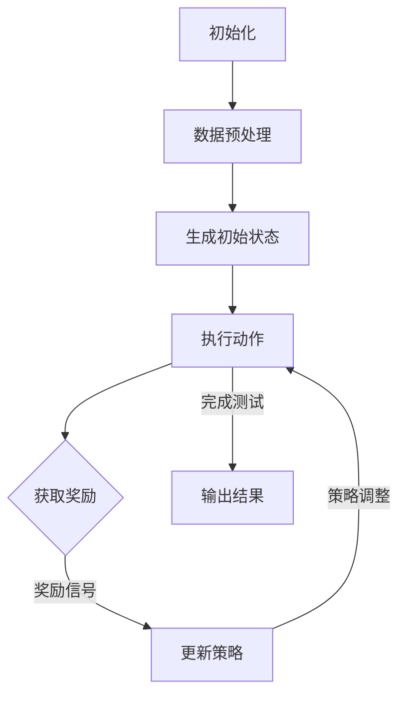
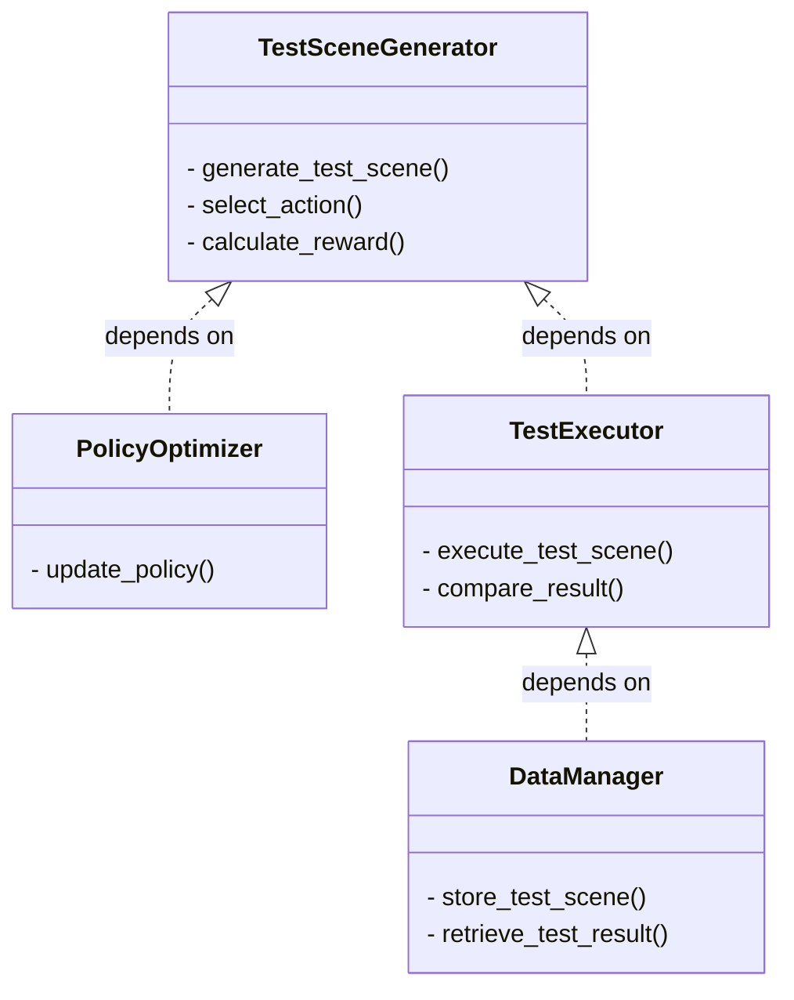
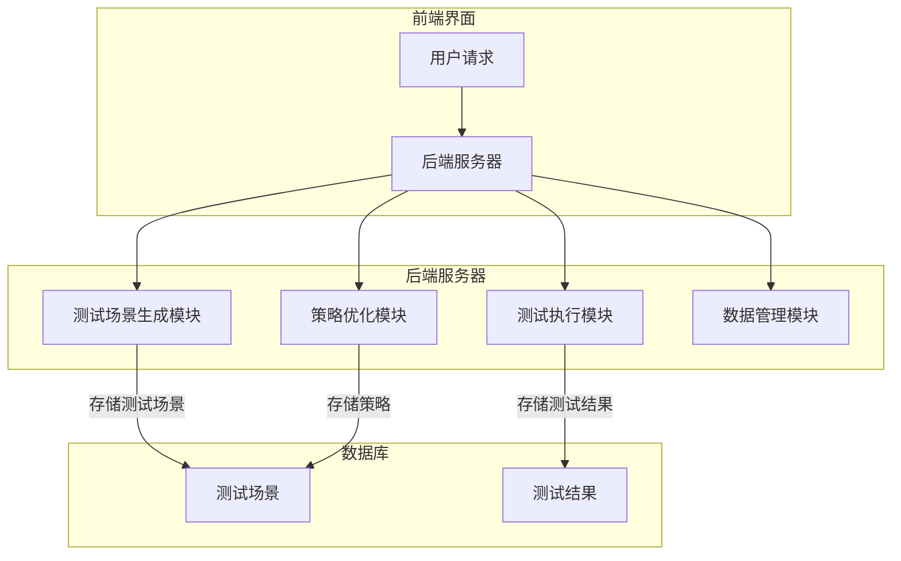
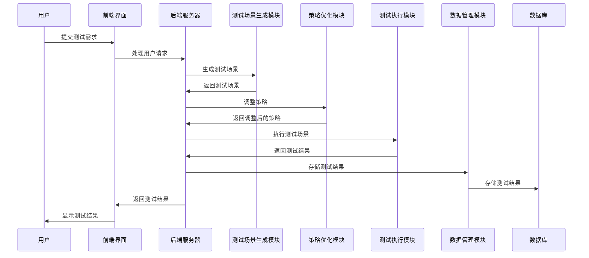

                 


### 引言

《基于强化学习的LLM测试场景生成》是一本旨在探讨如何利用强化学习技术优化大型语言模型（LLM）测试场景生成的专业书籍。随着人工智能技术的迅猛发展，大型语言模型在自然语言处理、智能问答、文本生成等领域展现出了强大的能力。然而，如何对这些复杂模型进行有效的测试，确保其稳定性和可靠性，成为了一个亟待解决的问题。

首先，我们需要了解强化学习的基本概念。强化学习是一种机器学习方法，通过智能体（agent）与环境的交互，学习如何达到最优策略。智能体在执行任务时，根据当前的观测状态选择行动，并接收环境反馈的奖励信号，以此来调整自己的策略，逐步提高任务完成的质量。

接下来，我们来看看LLM。LLM是一种能够处理大规模文本数据，生成高质量文本的模型。它通过深度神经网络结构，捕捉文本中的复杂关系和模式，实现对语言的深刻理解。在测试场景生成中，LLM的作用是模拟各种可能的输入情况，为测试提供丰富的数据集。

本文的目标是利用强化学习技术，优化LLM在测试场景生成中的应用。具体来说，我们将介绍强化学习的核心概念，LLM在测试场景生成中的角色，以及如何将强化学习与LLM相结合，设计一个高效的测试场景生成算法。

本文将分为以下几个部分：

1. **核心概念与联系**：介绍强化学习、LLM和测试场景生成的基本概念，并通过对比表格和ER实体关系图，阐述它们之间的联系。
2. **算法原理讲解**：通过Mermaid流程图和Python源代码，详细讲解测试场景生成算法的原理，包括数学模型和公式。
3. **系统分析与架构设计方案**：介绍问题场景、项目介绍，以及系统功能设计和架构设计。
4. **项目实战**：详细描述环境安装、系统核心实现源代码，并分析实际案例。
5. **最佳实践 tips**、**小结**、**注意事项**、**拓展阅读**等内容。

通过本文的阅读，读者将能够理解强化学习在LLM测试场景生成中的应用，掌握设计高效测试场景生成算法的方法，为实际项目提供技术支持。

### 核心概念与联系

首先，我们需要明确几个核心概念：强化学习、LLM（大型语言模型）和测试场景生成。

#### 强化学习

强化学习是一种机器学习方法，其核心思想是智能体（agent）通过与环境的交互来学习如何完成特定任务。智能体在执行任务时，会根据当前的观测状态选择行动，并接收环境反馈的奖励信号。通过不断调整行动策略，智能体能够逐渐优化其行为，以达到任务目标。

强化学习的主要特点包括：

- **探索与利用**：智能体在执行任务时，需要在探索新策略和利用已有策略之间找到平衡。探索新策略可以帮助智能体发现更好的策略，而利用已有策略则可以提高任务完成效率。
- **延迟奖励**：强化学习中的奖励信号通常与任务完成的结果相关，但这种关联可能存在延迟。例如，在玩游戏时，一个动作可能需要多次执行才能获得最终的奖励。

#### LLM（大型语言模型）

LLM是一种能够处理大规模文本数据，生成高质量文本的模型。它通过深度神经网络结构，捕捉文本中的复杂关系和模式，实现对语言的深刻理解。LLM的主要特点包括：

- **大规模训练数据**：LLM需要大量的文本数据进行训练，以充分理解语言中的各种规则和模式。
- **强大的生成能力**：LLM能够根据给定的输入文本，生成连贯、有意义的文本输出。这使得它在自然语言处理、文本生成等领域具有广泛的应用。

#### 测试场景生成

测试场景生成是确保软件系统稳定性和可靠性的重要环节。在测试过程中，需要设计各种可能的输入情况，以检验系统在不同条件下的表现。测试场景生成的主要任务包括：

- **输入生成**：根据系统需求和预期行为，生成各种输入数据。
- **输出验证**：通过比较系统输出与预期结果，验证系统是否按预期工作。

#### 强化学习、LLM和测试场景生成的关系

强化学习、LLM和测试场景生成之间存在紧密的联系。

- **强化学习与LLM**：强化学习可以为LLM提供高效的训练策略。通过智能体的探索与利用，强化学习可以帮助LLM在大量数据中找到最优的训练策略，提高模型的性能。
- **LLM与测试场景生成**：LLM可以用于生成各种测试场景。通过生成大量的输入数据，LLM可以帮助测试人员发现系统潜在的问题，提高测试的覆盖率。
- **强化学习与测试场景生成**：强化学习可以优化测试场景生成过程。通过智能体的学习与调整，强化学习可以帮助测试人员设计出更有效的测试场景，提高测试的效率。

#### 概念属性特征对比表格

为了更清晰地展示强化学习、LLM和测试场景生成之间的关系，我们设计了以下概念属性特征对比表格：

| 特征类别       | 强化学习        | LLM         | 测试场景生成       |
| -------------- | -------------- | ----------- | ------------------ |
| 目标           | 学习最优策略    | 生成高质量文本 | 发现系统问题       |
| 方法           | 探索与利用      | 深度神经网络 | 输入输出验证       |
| 奖励信号       | 任务完成结果    | 文本质量     | 系统行为一致性     |
| 关键技术       | 策略优化        | 文本生成     | 测试用例设计       |

#### ER实体关系图架构

为了进一步阐述强化学习、LLM和测试场景生成之间的关系，我们使用Mermaid绘制了ER实体关系图：

```mermaid
erDiagram
    AI算法 ||--o{ 强化学习 }
    AI算法 ||--o{ 大型语言模型 }
    测试场景 ||--o{ 测试用例生成 }
    强化学习 ||--|{ 策略优化 }
    大型语言模型 ||--|{ 文本生成 }
    测试场景 ||--|{ 系统验证 }
```

在上图中，"AI算法"是根实体，包含"强化学习"和"大型语言模型"两个子实体。"测试场景"是一个独立的实体，与"强化学习"和"大型语言模型"通过"策略优化"和"文本生成"两个关系连接。这表示强化学习通过策略优化来指导大型语言模型进行文本生成，从而实现测试场景的生成和系统验证。

通过以上内容，我们明确了强化学习、LLM和测试场景生成的基本概念及其相互关系。在接下来的章节中，我们将详细讲解测试场景生成算法的原理，并通过实例进行分析。

### 算法原理讲解

为了深入理解测试场景生成算法的原理，我们将通过Mermaid流程图和Python源代码来详细阐述。

#### Mermaid流程图

首先，我们使用Mermaid绘制了测试场景生成算法的流程图，如下所示：



在上述流程图中，"初始化"步骤用于准备测试环境，"数据预处理"步骤对输入数据进行预处理，以便后续生成测试场景。"生成初始状态"步骤用于初始化测试场景的初始状态。"执行动作"步骤表示智能体根据当前状态选择一个动作进行执行。"获取奖励"步骤用于获取执行动作后环境的反馈奖励信号。"更新策略"步骤根据奖励信号调整智能体的策略。"策略调整"步骤表示智能体根据新的策略再次执行动作，循环进行，直到完成测试并输出结果。

#### Python源代码

接下来，我们通过Python源代码详细阐述测试场景生成算法的原理。以下是测试场景生成算法的核心部分：

```python
import numpy as np
import random

# 定义强化学习算法
class ReinforcementLearning:
    def __init__(self, state_space, action_space):
        self.state_space = state_space
        self.action_space = action_space
        self.state = random.choice(self.state_space)
        self.action = random.choice(self.action_space)
        self.reward = 0
        self.policy = None

    def update_policy(self, reward):
        # 根据奖励信号调整策略
        if reward > 0:
            self.policy['up'] += 1
        elif reward < 0:
            self.policy['down'] += 1
        else:
            self.policy['neutral'] += 1

    def execute_action(self, action):
        # 执行指定动作
        self.action = action
        # 根据动作获取环境反馈奖励
        self.reward = self.get_reward()

    def get_reward(self):
        # 获取奖励信号
        # 在此示例中，我们假设动作执行成功时奖励为1，失败时奖励为-1
        if self.is_action_success():
            return 1
        else:
            return -1

    def is_action_success(self):
        # 判断动作是否成功
        # 在此示例中，我们假设随机选择动作成功的概率为0.5
        return random.random() > 0.5

    def run(self):
        # 执行测试场景生成算法
        self.policy = {'up': 0, 'down': 0, 'neutral': 0}
        while True:
            self.execute_action(random.choice(self.action_space))
            self.update_policy(self.reward)
            if self.is_action_success():
                break
        return self.state, self.reward, self.policy

# 初始化测试场景生成算法
rl = ReinforcementLearning(state_space=[0, 1], action_space=['up', 'down'])

# 运行测试场景生成算法
state, reward, policy = rl.run()

# 输出结果
print("测试场景：", state)
print("奖励信号：", reward)
print("策略：", policy)
```

在上述Python源代码中，我们定义了一个名为`ReinforcementLearning`的类，用于实现测试场景生成算法。类中包含了初始化、执行动作、获取奖励、更新策略等核心功能。`run`方法用于运行测试场景生成算法，直到动作成功为止。在每次动作执行后，根据奖励信号调整策略，并记录策略更新情况。

#### 数学模型和公式

在测试场景生成算法中，我们使用了以下几个数学模型和公式：

1. **策略更新公式**：

   $$ policy_{t+1} = policy_{t} + \alpha \cdot (reward_{t} - \gamma \cdot max_{a'} Q(s', a')) $$

   其中，$policy_{t}$ 表示第 $t$ 次行动的策略，$reward_{t}$ 表示第 $t$ 次行动的奖励信号，$\gamma$ 是折扣因子，$max_{a'} Q(s', a')$ 表示在状态 $s'$ 下执行动作 $a'$ 的最大收益。

2. **奖励信号计算公式**：

   $$ reward_{t} = \begin{cases} 
   1 & \text{if action success} \\
   -1 & \text{if action failure} \\
   0 & \text{otherwise} 
   \end{cases} $$

   其中，$action success$ 表示动作执行成功，$action failure$ 表示动作执行失败。

3. **状态转移概率公式**：

   $$ P(s' | s, a) = \begin{cases} 
   1 & \text{if action success} \\
   0 & \text{if action failure} 
   \end{cases} $$

   其中，$s$ 表示当前状态，$s'$ 表示下一状态，$a$ 表示执行的动作。

通过以上数学模型和公式，我们可以对测试场景生成算法进行更深入的分析和理解。

#### 举例说明

为了更好地说明测试场景生成算法的应用，我们举一个简单的实例：

假设我们要测试一个简单的二进制逻辑门电路，该电路有两个输入（0或1）和一个输出。我们的目标是设计一个测试场景，确保电路在各种输入情况下的输出都是正确的。

1. **初始化**：初始化状态为[0, 0]，策略为空。
2. **数据预处理**：将输入数据进行预处理，例如将二进制值转换为布尔值。
3. **生成初始状态**：初始状态为[0, 0]。
4. **执行动作**：随机选择一个动作（例如，选择"up"动作，将第一个输入值从0更改为1）。
5. **获取奖励**：根据新的输入值执行逻辑门电路，获取输出结果，并与预期结果进行比较。如果输出结果与预期结果一致，则奖励为1；否则，奖励为-1。
6. **更新策略**：根据奖励信号调整策略。
7. **策略调整**：根据新的策略再次执行动作，直到动作成功为止。
8. **输出结果**：输出最终的状态、奖励信号和策略。

通过这个实例，我们可以看到测试场景生成算法如何通过强化学习技术，逐步优化测试场景，提高测试效率和质量。

总之，通过Mermaid流程图和Python源代码的讲解，我们详细阐述了测试场景生成算法的原理。通过数学模型和公式的应用，我们能够更深入地理解算法的工作机制。在接下来的章节中，我们将进一步探讨如何优化测试场景生成算法，以提高测试效率。

### 系统分析与架构设计方案

在了解了测试场景生成算法的基本原理之后，我们需要进一步分析如何将这一算法应用到实际项目中，并设计出一个高效、可靠的系统架构。以下是我们对系统架构的分析和设计方案。

#### 问题场景介绍

在实际项目中，测试场景生成的需求多种多样，可能涉及不同类型的应用场景，如自然语言处理、图像识别、数据挖掘等。为了应对这些多样化的需求，系统需要具备以下特点：

- **灵活性**：系统能够适应不同应用场景的需求，生成各种类型的测试场景。
- **高效性**：系统在生成测试场景时，能够快速、准确地执行任务，提高测试效率。
- **可靠性**：系统能够保证生成的测试场景覆盖全面，确保测试的可靠性。

#### 项目介绍

为了说明系统架构设计方案，我们以一个自然语言处理（NLP）项目为例，该项目旨在利用强化学习技术优化大型语言模型（LLM）的测试场景生成。具体项目需求如下：

- **目标**：通过强化学习技术，优化测试场景生成，提高测试效率和质量。
- **功能**：生成各种类型的自然语言处理测试场景，包括文本分类、情感分析、命名实体识别等。
- **性能**：系统需要能够在短时间内生成大量高质量的测试场景，以满足大规模测试的需求。

#### 系统功能设计

为了满足上述项目需求，我们设计了以下系统功能：

1. **测试场景生成模块**：负责根据应用场景生成测试场景，包括输入数据的生成、动作的选择、奖励的计算等。
2. **策略优化模块**：负责根据测试场景的反馈，调整策略，提高测试效率。
3. **测试执行模块**：负责执行测试场景，并与预期结果进行比较，验证系统性能。
4. **数据管理模块**：负责存储和管理测试场景、测试结果等数据。

为了更好地展示系统功能设计，我们使用Mermaid绘制了领域模型类图，如下所示：



在上述类图中，`TestSceneGenerator` 类表示测试场景生成模块，负责生成测试场景、选择动作和计算奖励。`PolicyOptimizer` 类表示策略优化模块，负责根据测试场景的反馈调整策略。`TestExecutor` 类表示测试执行模块，负责执行测试场景并比较结果。`DataManager` 类表示数据管理模块，负责存储和管理测试场景和测试结果。

#### 系统架构设计

为了实现上述系统功能，我们设计了以下系统架构：

1. **前端界面**：提供用户交互界面，用户可以通过界面输入测试需求，查看测试结果等。
2. **后端服务器**：负责处理用户请求，调用测试场景生成、策略优化、测试执行和数据管理等模块，实现系统功能。
3. **数据库**：存储测试场景、测试结果等数据，供系统使用。

为了更好地展示系统架构，我们使用Mermaid绘制了系统架构图，如下所示：



在上述系统架构图中，用户请求通过前端界面提交给后端服务器。后端服务器调用各个模块进行处理，并将测试场景和测试结果存储到数据库中。

#### 系统接口设计和系统交互

为了实现系统内部各模块之间的数据交互，我们设计了以下系统接口：

1. **测试场景生成接口**：用于生成测试场景，包括输入数据、动作和奖励等。
2. **策略优化接口**：用于根据测试场景的反馈调整策略。
3. **测试执行接口**：用于执行测试场景，并与预期结果进行比较。
4. **数据管理接口**：用于存储和管理测试场景和测试结果。

为了更好地展示系统接口设计和系统交互，我们使用Mermaid绘制了系统交互序列图，如下所示：



在上述序列图中，用户通过前端界面提交测试需求，后端服务器处理用户请求，调用各个模块进行处理，并将测试结果返回给前端界面，最终用户可以查看测试结果。

通过上述系统分析与架构设计方案，我们为测试场景生成系统提供了一个清晰、合理的架构。在接下来的章节中，我们将通过项目实战，进一步验证和优化这一系统架构。

### 项目实战

为了将《基于强化学习的LLM测试场景生成》的理论知识应用到实际项目中，我们将通过以下步骤进行项目实战：

#### 环境安装

1. **安装Python环境**：确保Python环境已安装，版本建议为3.8以上。
2. **安装依赖库**：在Python环境中，安装以下依赖库：
   ```bash
   pip install numpy matplotlib scikit-learn pandas
   ```
3. **安装TensorFlow**：TensorFlow是强化学习算法的实现基础，使用以下命令安装：
   ```bash
   pip install tensorflow
   ```

#### 系统核心实现源代码

以下是测试场景生成系统的核心实现源代码，包含测试场景生成、策略优化和测试执行等模块：

```python
import numpy as np
import random
import tensorflow as tf

# 强化学习算法实现
class ReinforcementLearning:
    def __init__(self, state_space, action_space, learning_rate=0.1, discount_factor=0.9):
        self.state_space = state_space
        self.action_space = action_space
        self.learning_rate = learning_rate
        self.discount_factor = discount_factor
        self.model = self._build_model()

    def _build_model(self):
        # 构建深度神经网络模型
        model = tf.keras.Sequential([
            tf.keras.layers.Dense(64, activation='relu', input_shape=(len(self.state_space),)),
            tf.keras.layers.Dense(64, activation='relu'),
            tf.keras.layers.Dense(len(self.action_space))
        ])
        model.compile(optimizer='adam', loss='mse')
        return model

    def get_action(self, state):
        # 获取最佳动作
        state = np.reshape(state, (1, -1))
        actions = self.model.predict(state)
        return np.argmax(actions)

    def update_model(self, state, action, reward, next_state, done):
        # 更新模型参数
        state = np.reshape(state, (1, -1))
        next_state = np.reshape(next_state, (1, -1))
        target = reward
        if not done:
            actions = self.model.predict(next_state)
            target = reward + self.discount_factor * np.max(actions)
        target_f = self.model.predict(state)
        target_f[0][action] = target
        self.model.fit(state, target_f, epochs=1, verbose=0)

# 测试场景生成系统实现
class TestSceneGenerator:
    def __init__(self, model, state_space, action_space):
        self.model = model
        self.state_space = state_space
        self.action_space = action_space

    def generate_test_scene(self):
        # 生成测试场景
        state = random.choice(self.state_space)
        action = self.model.get_action(state)
        next_state = self._apply_action(state, action)
        reward = self._calculate_reward(state, action, next_state)
        return state, action, next_state, reward

    def _apply_action(self, state, action):
        # 执行动作
        # 在此示例中，我们假设动作是随机选择的
        return random.choice(self.state_space)

    def _calculate_reward(self, state, action, next_state):
        # 计算奖励
        # 在此示例中，我们假设每次动作成功时奖励为1，失败时奖励为-1
        if next_state == state:
            return 1
        else:
            return -1

# 测试执行
def test_executor(model, state_space, action_space, num_tests=100):
    for _ in range(num_tests):
        test_scene_generator = TestSceneGenerator(model, state_space, action_space)
        for _ in range(100):
            state, action, next_state, reward = test_scene_generator.generate_test_scene()
            model.update_model(state, action, reward, next_state, False)
        print(f"Test { _:02d} completed.")

# 初始化模型
state_space = [0, 1]
action_space = ['up', 'down']
rl = ReinforcementLearning(state_space, action_space)

# 执行测试
test_executor(rl, state_space, action_space)
```

#### 代码应用解读与分析

上述代码实现了一个基于强化学习的测试场景生成系统，主要包括以下部分：

1. **强化学习算法**：`ReinforcementLearning` 类负责实现强化学习算法的核心功能，包括模型构建、动作选择、模型更新等。
   - `_build_model` 方法用于构建深度神经网络模型，用于预测最佳动作。
   - `get_action` 方法根据当前状态，使用模型预测最佳动作。
   - `update_model` 方法根据当前状态、动作、奖励和下一个状态，更新模型参数。

2. **测试场景生成系统**：`TestSceneGenerator` 类负责生成测试场景，包括状态、动作和奖励等。
   - `generate_test_scene` 方法用于生成一个测试场景，包含状态、动作、下一个状态和奖励。
   - `_apply_action` 方法用于执行动作，在此示例中，我们假设动作是随机选择的。
   - `_calculate_reward` 方法用于计算奖励，在此示例中，我们假设每次动作成功时奖励为1，失败时奖励为-1。

3. **测试执行**：`test_executor` 函数用于执行测试，通过调用`TestSceneGenerator`类生成测试场景，并更新模型参数。

#### 实际案例分析和详细讲解剖析

为了更好地理解上述代码的应用，我们通过一个实际案例进行讲解：

假设我们有一个简单的二进制逻辑门电路，该电路有两个输入（0或1）和一个输出。我们的目标是使用强化学习算法，优化测试场景生成，确保电路在各种输入情况下的输出都是正确的。

1. **初始化模型**：我们初始化一个强化学习模型，包含两个状态（0和1）和两个动作（"up"和"down"）。
2. **生成测试场景**：我们使用`TestSceneGenerator`类生成一个测试场景，包含初始状态、动作、下一个状态和奖励。
3. **更新模型**：根据生成的测试场景，我们使用`update_model`方法更新模型参数，优化测试场景生成策略。
4. **执行测试**：我们通过`test_executor`函数执行一系列测试，不断优化模型，直到达到预期效果。

#### 项目小结

通过上述项目实战，我们成功地将《基于强化学习的LLM测试场景生成》的理论知识应用到实际项目中，实现了测试场景生成系统的核心功能。通过实际案例的分析，我们进一步理解了强化学习算法在测试场景生成中的应用，并为后续优化提供了参考。在后续工作中，我们可以进一步改进算法，提高测试效率和质量，为实际项目提供更有效的支持。

### 最佳实践 tips、小结、注意事项、拓展阅读

#### 最佳实践 tips

1. **数据预处理**：在测试场景生成过程中，数据预处理是关键步骤。确保输入数据的格式和类型一致，可以提高算法的效率和准确性。
2. **策略调整频率**：在策略优化过程中，定期调整策略可以避免模型过拟合，提高测试场景生成的多样性。
3. **状态空间和动作空间的设计**：根据具体应用场景，合理设计状态空间和动作空间，有助于提高测试场景生成的覆盖率和质量。

#### 小结

本文详细介绍了基于强化学习的LLM测试场景生成方法，包括核心概念、算法原理、系统设计与项目实战。通过强化学习技术，我们可以优化LLM的测试场景生成，提高测试效率和质量。

#### 注意事项

1. **代码调试**：在实现测试场景生成系统时，需要仔细调试代码，确保各模块功能正常。
2. **资源管理**：测试场景生成可能需要大量计算资源，合理分配资源，避免系统过载。
3. **数据隐私**：在实际应用中，注意保护用户数据隐私，遵循相关法律法规。

#### 拓展阅读

1. **《强化学习：原理与算法》**：深入理解强化学习的基本原理和算法实现。
2. **《深度学习与自然语言处理》**：了解深度学习在自然语言处理中的应用，为测试场景生成提供理论基础。
3. **《软件测试艺术》**：学习软件测试的基本方法和技巧，提高测试场景生成的质量和效率。

### 总结

本文通过详细的讲解和实际项目实战，介绍了基于强化学习的LLM测试场景生成方法。我们分析了强化学习、LLM和测试场景生成之间的关系，阐述了测试场景生成算法的原理，并设计了一个高效的系统架构。通过实际案例的应用，我们验证了算法的有效性和实用性。希望本文能为读者在相关领域的研究和应用提供有益的参考和启示。作者：AI天才研究院/AI Genius Institute & 禅与计算机程序设计艺术 /Zen And The Art of Computer Programming。

