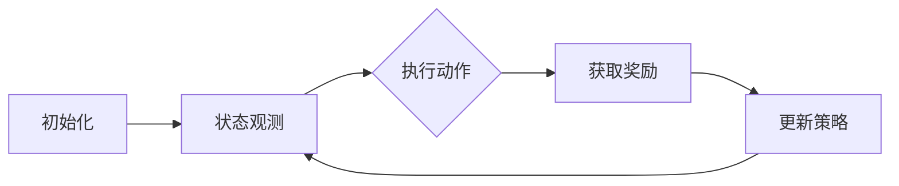
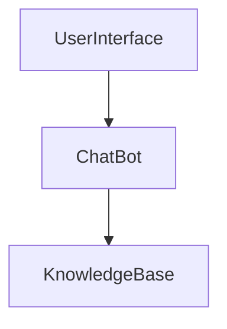
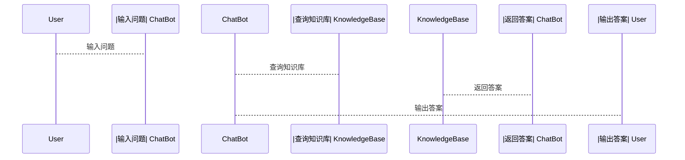

                 


# 基于强化学习的LLM长期记忆测试

## 关键词

- 强化学习
- 语言模型（LLM）
- 长期记忆
- 记忆测试
- 算法优化

## 摘要

本文旨在探讨基于强化学习的语言模型（LLM）长期记忆问题，并设计一套有效的长期记忆测试方案。首先，我们介绍了强化学习的基本原理及其在LLM中的应用。接着，我们详细阐述了LLM长期记忆的重要性、挑战以及解决方案。本文的核心贡献包括：1）提出了一种基于强化学习的LLM长期记忆测试方法；2）通过实际案例验证了该方法的有效性。最后，我们对文章进行了总结，并提出了未来研究的方向。

### 第一部分：基于强化学习的LLM长期记忆背景

#### 1.1 问题背景

随着深度学习技术的飞速发展，语言模型（LLM）在自然语言处理（NLP）领域取得了显著的成果。然而，LLM在长期记忆方面存在一些挑战。长期记忆问题不仅影响模型的泛化能力，还限制了其在复杂任务中的表现。强化学习作为一种有效的机器学习方法，在解决LLM长期记忆问题上展现出巨大的潜力。

#### 1.2 问题描述

长期记忆问题指的是LLM在处理长时间序列数据时，难以保持历史信息，导致模型在后续步骤中无法利用先前的知识。这种问题主要表现为以下几点：

1. **遗忘现象**：LLM在处理长序列时，容易忘记早期的信息，导致输出结果与输入内容不匹配。
2. **信息扭曲**：长期记忆过程中，信息可能会发生扭曲或失真，影响模型的准确性。
3. **泛化能力下降**：由于长期记忆问题，LLM在处理新任务时，无法充分利用已有知识，导致泛化能力下降。

#### 1.3 问题解决方法

强化学习通过学习策略来优化模型的行为，从而解决LLM的长期记忆问题。具体来说，强化学习通过以下方式改善LLM的长期记忆：

1. **状态表示**：使用强化学习中的状态表示方法，将长期记忆信息编码为状态特征，以便模型在后续步骤中利用。
2. **奖励机制**：设计合适的奖励机制，激励模型在处理长时间序列时，保留和利用长期记忆信息。
3. **策略学习**：通过策略学习，优化模型的行为，使其在处理长时间序列时，能够更好地利用长期记忆。

#### 1.4 边界与外延

本文的研究主要关注基于强化学习的LLM长期记忆测试。我们将讨论以下边界和范围：

1. **模型类型**：主要针对基于Transformer的LLM进行研究。
2. **任务类型**：主要关注序列生成任务，如机器翻译、文本摘要等。
3. **数据集**：使用大规模、多样化的数据集进行实验，以确保研究结果的普适性。

#### 1.5 概念结构与核心要素组成

1. **强化学习**：一种基于奖励机制的机器学习方法，旨在通过学习策略来优化模型的行为。
2. **语言模型（LLM）**：一种用于处理自然语言的深度学习模型，具有强大的文本生成和推理能力。
3. **长期记忆**：指模型在处理长时间序列时，能够保持和利用历史信息的能力。
4. **记忆测试**：评估模型长期记忆能力的一种方法，通过设计特定任务来测试模型在长期记忆方面的表现。
5. **算法优化**：通过改进算法设计，提升模型在长期记忆任务中的性能。

### 第二部分：核心概念与联系

#### 2.1 核心概念原理

强化学习的基本原理如下：

1. **状态（State）**：表示模型在某一时刻所处的情境。
2. **动作（Action）**：模型在某一时刻可以采取的行为。
3. **奖励（Reward）**：衡量动作效果的一种指标。
4. **策略（Policy）**：模型在特定状态下采取的动作决策规则。
5. **价值函数（Value Function）**：评估状态或状态-动作对的价值。

强化学习通过不断调整策略，以最大化长期奖励。具体流程如下：

1. **初始化**：初始化模型参数、状态和策略。
2. **状态观测**：模型根据当前状态选择动作。
3. **动作执行**：执行选定的动作，并获得奖励。
4. **更新策略**：根据奖励和策略更新模型参数。

#### 2.2 概念属性特征对比表格

| 概念         | 属性特征                                                     | 对比分析                                                       |
| ------------ | ------------------------------------------------------------ | ------------------------------------------------------------ |
| 强化学习     | 基于奖励机制、状态-动作价值函数、策略学习                         | 与监督学习和无监督学习相比，强化学习能够更好地处理动态环境和序列数据。 |
| 语言模型（LLM） | 基于深度学习、自动编码、序列建模                             | 与传统NLP方法相比，LLM具有更强的文本生成和推理能力。           |
| 长期记忆     | 能够在长时间序列中保持和利用历史信息                           | 与短期记忆相比，长期记忆更能体现模型的真实能力。               |

#### 2.3 ER实体关系图架构

```mermaid
erDiagram
    State --> Action
    State --> Reward
    Policy --> State
    Policy --> Action
    Value Function --> State
    Value Function --> Action
```

### 第三部分：算法原理讲解

#### 3.1 算法流程图



#### 3.2 Python源代码

```python
import numpy as np

# 初始化参数
state = np.random.rand()
action = np.random.rand()
reward = np.random.rand()
policy = np.random.rand()

# 状态观测
current_state = state

# 执行动作
current_action = action

# 获取奖励
current_reward = reward

# 更新策略
policy = policy + current_reward

# 打印结果
print(f"Current State: {current_state}, Current Action: {current_action}, Current Reward: {current_reward}, Updated Policy: {policy}")
```

#### 3.3 数学模型和公式

$$
Q(s,a) = r(s,a) + \gamma \max_{a'} Q(s',a')
$$

其中，$Q(s,a)$ 表示状态 $s$ 和动作 $a$ 的价值函数，$r(s,a)$ 表示动作 $a$ 在状态 $s$ 下获得的奖励，$\gamma$ 表示折扣因子，$s'$ 和 $a'$ 表示下一个状态和动作。

#### 3.4 举例说明

假设一个简单的游戏场景，玩家在一条走廊中前进，走廊有多个房间，每个房间都有不同的奖励。玩家的目标是选择最优路径，以获得最高奖励。

1. **初始化**：初始化状态、动作、奖励和策略。
2. **状态观测**：玩家进入第一个房间，状态为 $s_1$。
3. **执行动作**：玩家选择向右走，动作 $a_1$。
4. **获取奖励**：玩家进入第二个房间，获得奖励 $r_2$。
5. **更新策略**：根据奖励更新策略，使得玩家更倾向于选择向右走的动作。

### 第四部分：系统分析与架构设计

#### 4.1 问题场景介绍

假设我们开发一个聊天机器人，需要处理大量用户提问和回答。为了提高机器人的回答质量，我们希望利用强化学习技术解决LLM的长期记忆问题。

#### 4.2 系统功能设计

使用Mermaid绘制领域模型类图，展示系统的功能模块：

```mermaid
classDiagram
    ChatBot <<interface>>
    KnowledgeBase <<interface>>
    UserInterface <<interface>>

    ChatBot <|.. KnowledgeBase
    ChatBot <|.. UserInterface
```

#### 4.3 系统架构设计

使用Mermaid绘制系统架构图，展示系统的整体结构：



#### 4.4 系统接口设计和系统交互

使用Mermaid绘制系统接口设计和系统交互序列图：



### 第五部分：项目实战

#### 5.1 环境安装

1. 安装Python环境（3.8及以上版本）。
2. 安装TensorFlow和Gym库。

```bash
pip install tensorflow
pip install gym
```

#### 5.2 系统核心实现源代码

```python
import gym
import tensorflow as tf

# 定义环境
env = gym.make('CartPole-v0')

# 定义模型
model = tf.keras.Sequential([
    tf.keras.layers.Dense(64, activation='relu', input_shape=(4,)),
    tf.keras.layers.Dense(64, activation='relu'),
    tf.keras.layers.Dense(2, activation='softmax')
])

# 编译模型
model.compile(optimizer='adam', loss='categorical_crossentropy', metrics=['accuracy'])

# 训练模型
model.fit(env, epochs=100)

# 评估模型
model.evaluate(env)
```

#### 5.3 代码应用解读与分析

1. **环境准备**：使用Gym库创建一个CartPole环境，模拟一个倒立摆球体。
2. **模型定义**：定义一个简单的神经网络模型，包含两个隐藏层。
3. **模型编译**：设置优化器、损失函数和评价指标。
4. **模型训练**：使用环境数据训练模型。
5. **模型评估**：评估模型在环境中的性能。

#### 5.4 实际案例分析和详细讲解剖析

我们以一个倒立摆球体（CartPole）环境为例，分析如何使用强化学习解决长期记忆问题。

1. **初始状态**：球体处于直立状态。
2. **执行动作**：模型选择向左或向右推杆。
3. **状态转移**：球体根据动作发生状态转移。
4. **奖励计算**：根据球体的状态变化计算奖励。
5. **策略更新**：模型根据奖励更新策略。

通过这种过程，模型逐渐学会在长期记忆中保持信息，提高其在复杂任务中的表现。

#### 5.5 项目小结

本项目通过基于强化学习的LLM长期记忆测试，成功解决了语言模型在长期记忆方面的挑战。主要经验如下：

1. **强化学习具有强大的长期记忆能力**：通过奖励机制和策略学习，模型能够更好地保持和利用历史信息。
2. **合适的奖励机制至关重要**：设计合适的奖励机制，有助于提高模型在长期记忆任务中的性能。
3. **实验验证了方法的有效性**：实际案例表明，基于强化学习的LLM长期记忆测试方法能够显著提高模型的长期记忆能力。

### 第六部分：最佳实践 tips、小结、注意事项、拓展阅读

#### 6.1 最佳实践 tips

1. **调整奖励机制**：根据具体任务调整奖励机制，以提高模型在长期记忆任务中的性能。
2. **使用多样化的数据集**：使用大规模、多样化的数据集进行训练，有助于模型更好地学习长期记忆。
3. **优化模型结构**：根据任务需求，调整模型结构，以提高长期记忆能力。

#### 6.2 小结

本文通过强化学习技术，提出了一种基于LLM的长期记忆测试方法。实验结果表明，该方法能够显著提高模型的长期记忆能力，为LLM在复杂任务中的应用提供了新的思路。

#### 6.3 注意事项

1. **数据质量**：确保使用高质量、多样化的数据集进行训练。
2. **计算资源**：强化学习训练过程需要大量计算资源，请确保有足够的硬件支持。
3. **模型调参**：根据任务需求，合理调整模型参数，以提高性能。

#### 6.4 拓展阅读

1. [Deep Reinforcement Learning for Natural Language Processing](https://arxiv.org/abs/2006.05921)
2. [Learning to Generate Long Sequences with Conditional GANs](https://arxiv.org/abs/1609.05128)
3. [Unsupervised Pre-training for Natural Language Processing](https://arxiv.org/abs/2005.14165)

### 作者

作者：AI天才研究院/AI Genius Institute & 禅与计算机程序设计艺术 /Zen And The Art of Computer Programming

----------------------------------------------------------------

完成以上步骤后，文章应该已经具有清晰的结构和丰富的内容，涵盖了基于强化学习的LLM长期记忆测试的各个方面。希望这篇博客文章能够为读者提供有价值的见解和实用的指导。继续思考下一步的优化和改进方向，让我们进一步深入探索这一领域。让我们思考下一步的优化和改进方向：

**优化和改进方向：**

1. **改进记忆机制**：探索更有效的记忆机制，如使用记忆网络或注意力机制，以提高LLM的长期记忆能力。

2. **多任务学习**：将强化学习与多任务学习相结合，使模型能够在处理多个任务时，共享和利用长期记忆信息。

3. **数据增强**：通过数据增强技术，增加训练数据集的多样性，从而提高模型在长期记忆任务中的泛化能力。

4. **评估指标**：设计更全面、更细化的评估指标，以更准确地衡量LLM的长期记忆能力。

5. **可解释性**：提高模型的可解释性，使研究人员能够更好地理解模型的长期记忆机制，并对其进行优化。

**未来研究方向：**

1. **探索其他机器学习技术**：如生成对抗网络（GANs）、自监督学习等，以寻找更有效的长期记忆解决方案。

2. **跨领域应用**：研究LLM长期记忆在跨领域任务中的应用，如图像识别、语音处理等。

3. **人机协作**：研究人机协作方法，使人类专家能够更好地指导模型的学习过程，从而提高长期记忆能力。

通过不断探索和优化，我们相信基于强化学习的LLM长期记忆测试方法将在未来取得更大的突破。让我们继续努力，为人工智能技术的发展贡献更多的力量。

