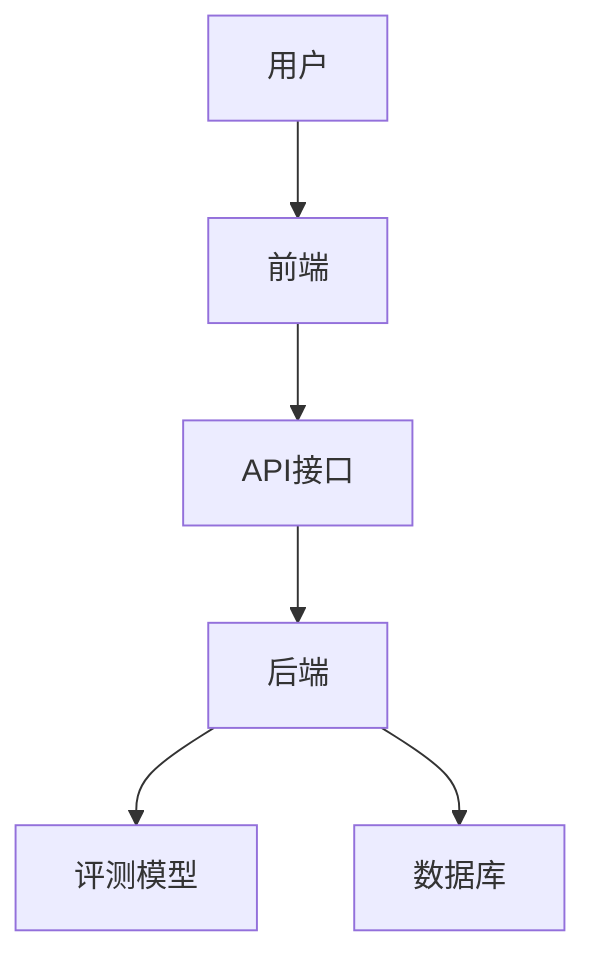
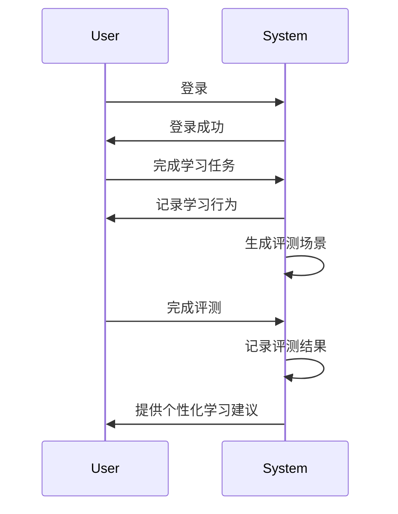

                 

## 《基于强化学习的评测场景自动生成》

### 关键词：强化学习、评测场景、自动生成、机器学习、在线教育、游戏评测

> 在当今的互联网时代，评测场景的自动化生成已经成为提高测试效率和准确性的一种重要手段。本文将深入探讨基于强化学习的评测场景自动生成技术，从背景与基础、强化学习算法原理、评测场景自动生成应用、项目实战等多个角度进行详细分析。

## 目录大纲

### 第一部分：背景与基础

- **第1章 问题背景与核心概念**
  - 1.1 评测场景自动生成的需求与挑战
  - 1.2 强化学习概述
  - 1.3 强化学习在评测场景中的应用
  - 1.4 本书结构与内容安排

### 第二部分：强化学习算法原理

- **第2章 强化学习算法原理**
  - 2.1 强化学习基本概念
  - 2.2 强化学习算法类型
  - 2.3 强化学习算法流程
  - 2.4 强化学习算法实现

### 第三部分：评测场景自动生成应用

- **第3章 评测场景自动生成应用**
  - 3.1 在线教育中的应用
  - 3.2 游戏评测中的应用
  - 3.3 自动化测试中的应用
  - 3.4 其他领域应用

### 第四部分：项目实战

- **第4章 项目实战：基于强化学习的评测场景自动生成**
  - 4.1 项目介绍
  - 4.2 系统功能设计
  - 4.3 系统架构设计
  - 4.4 系统接口设计
  - 4.5 系统交互设计
  - 4.6 环境安装与配置
  - 4.7 系统核心实现源代码
  - 4.8 项目小结

### 第五部分：总结与拓展

- **第5章 最佳实践、小结、注意事项、拓展阅读**

---

**本文主要分为五个部分，将从背景与基础、强化学习算法原理、评测场景自动生成应用、项目实战到总结与拓展，逐一详细解析基于强化学习的评测场景自动生成技术。**

### 第一部分：背景与基础

#### 第1章 问题背景与核心概念

**1.1 评测场景自动生成的需求与挑战**

随着互联网的快速发展，评测场景的应用场景越来越广泛，从在线教育到游戏评测，再到自动化测试，各种领域都离不开评测。传统的评测场景生成往往需要大量的人力投入，且容易产生偏差。因此，自动生成评测场景成为提高测试效率和准确性的迫切需求。

**问题描述**

评测场景自动生成需要解决的核心问题包括：

1. 数据收集：收集大量的真实评测数据，用于训练生成模型。
2. 模型训练：基于收集的数据，训练一个能够自动生成评测场景的模型。
3. 场景生成：利用训练好的模型，生成符合要求的评测场景。
4. 评测指标设计：设计一套科学的评测指标，用于评估评测场景的有效性和准确性。

**问题解决**

强化学习作为一种先进的机器学习方法，能够通过试错和反馈来优化决策过程。基于强化学习算法，可以实现评测场景的自动生成。具体实现步骤如下：

1. 定义状态空间和动作空间：根据评测场景的特点，定义状态空间和动作空间。
2. 设计奖励函数：根据评测目标，设计奖励函数，用于衡量评测场景的好坏。
3. 选择强化学习算法：根据问题特点，选择合适的强化学习算法，如Q-Learning、SARSA等。
4. 训练生成模型：使用强化学习算法，训练生成模型。
5. 生成评测场景：利用训练好的模型，生成评测场景。
6. 评估评测场景：根据评测指标，评估评测场景的有效性和准确性。

**边界与外延**

评测场景的范围非常广泛，可以涵盖各种应用场景，如：

- 在线教育：个性化课程评测、学习进度评估等。
- 游戏评测：游戏关卡设计、玩家行为分析等。
- 自动化测试：软件测试、自动化测试框架设计等。
- 智能交通：交通信号灯控制、车辆路径规划等。
- 智能家居：家庭安全监控、家电智能控制等。
- 工业自动化：生产流程优化、设备状态监控等。

**概念结构与核心要素组成**

评测场景自动生成的核心概念和要素包括：

- 强化学习算法：负责生成评测场景的算法，如Q-Learning、SARSA等。
- 场景生成模型：基于强化学习算法训练得到的模型，用于生成评测场景。
- 评测指标：用于评估评测场景的有效性和准确性的指标，如准确率、召回率等。

#### 第1章 问题背景与核心概念

**1.2 强化学习概述**

强化学习是一种通过试错和反馈来优化决策过程的机器学习方法。它主要关注的是如何从环境中获取奖励，并通过不断调整策略，使得最终获得的奖励最大化。

**强化学习的定义**

强化学习（Reinforcement Learning，RL）是一种从交互式环境中学习策略的机器学习方法。它由三个核心要素组成：状态（State）、动作（Action）和奖励（Reward）。

- **状态（State）**：环境中的一个特定情况。
- **动作（Action）**：在状态中可执行的操作。
- **奖励（Reward）**：动作执行后的即时反馈。

强化学习的目标是学习一个策略（Policy），这个策略能够使得在特定状态下选择特定动作的概率最大化，从而获得最大的总奖励。

**强化学习的特点**

强化学习具有以下几个显著特点：

- **探索与利用（Exploration and Exploitation）**：在强化学习中，需要平衡探索（尝试新的动作）和利用（选择已经证明有效的动作）之间的关系。
- **策略学习（Policy Learning）**：强化学习主要关注策略学习，即如何从环境中获取奖励，并通过不断调整策略，使得最终获得的奖励最大化。
- **状态-动作价值函数（State-Action Value Function）**：强化学习通过状态-动作价值函数来评估每个状态和动作的优劣，从而指导策略的选择。

**强化学习与传统机器学习的区别**

与传统机器学习相比，强化学习有以下几个显著区别：

- **决策过程**：强化学习更关注决策过程，即如何从环境中获取奖励，并通过不断调整策略来优化决策。而传统机器学习更关注模式识别，即如何从数据中提取特征，并建立预测模型。
- **目标函数**：强化学习的目标是最大化总奖励，而传统机器学习的目标通常是最大化预测准确性。
- **数据处理**：强化学习的数据处理相对简单，主要依赖于环境提供的奖励信号。而传统机器学习需要大量的数据预处理和特征工程。

**1.3 强化学习在评测场景中的应用**

强化学习在评测场景中的应用非常广泛，它可以应用于多种领域，如在线教育、游戏评测、自动化测试等。

**应用领域**

- **在线教育**：通过强化学习，可以自动生成个性化的评测场景，帮助学习者更好地理解和掌握知识。
- **游戏评测**：利用强化学习，可以自动生成游戏关卡，并根据玩家的行为数据，优化游戏体验。
- **自动化测试**：通过强化学习，可以自动生成测试用例，提高测试效率和覆盖率。

**优势**

- **提高测试效率和准确性**：通过自动生成评测场景，可以减少人力成本，提高测试效率和准确性。
- **降低人力成本**：传统的评测场景生成需要大量的人力投入，而基于强化学习的方法可以大大降低人力成本。

**挑战**

- **数据收集**：生成高质量的评测场景需要大量的真实数据，而数据收集可能面临困难。
- **模型训练**：强化学习模型的训练过程可能非常耗时，并且需要大量的计算资源。
- **场景生成**：如何确保生成的评测场景符合实际需求，是一个挑战。
- **评测指标设计**：设计一套科学的评测指标，用于评估评测场景的有效性和准确性，是一个重要的挑战。

**1.4 本书结构与内容安排**

**本书目的**

本书旨在介绍评测场景自动生成的原理、方法与应用，帮助读者深入理解基于强化学习的评测场景自动生成技术。

**章节安排**

本书分为五个部分，共包含四章节：

- **第一部分：背景与基础**：介绍评测场景自动生成的背景和基础概念，包括强化学习的基本原理和应用。
- **第二部分：强化学习算法原理**：详细讲解强化学习算法的原理、类型和实现，帮助读者深入理解强化学习的核心概念。
- **第三部分：评测场景自动生成应用**：介绍评测场景自动生成在各个领域的应用，包括在线教育、游戏评测、自动化测试等。
- **第四部分：项目实战**：通过一个实际项目，展示基于强化学习的评测场景自动生成系统的设计和实现过程。
- **第五部分：总结与拓展**：总结本书的主要内容，提供最佳实践、注意事项和拓展阅读，帮助读者进一步深入学习和应用。

### 第二部分：强化学习算法原理

#### 第2章 强化学习算法原理

强化学习是一种通过试错和反馈来优化决策过程的机器学习方法。本章将介绍强化学习的基本概念、算法类型、流程和实现。

#### 2.1 强化学习基本概念

强化学习由三个核心要素组成：状态（State）、动作（Action）和奖励（Reward）。

- **状态（State）**：状态是环境中的一个特定情况，通常用一个状态向量表示。
- **动作（Action）**：动作是在特定状态下可执行的操作，也用一个向量表示。
- **奖励（Reward）**：奖励是动作执行后的即时反馈，用于衡量动作的好坏。奖励通常是一个实数值，可以是正数或负数。

强化学习的目标是学习一个策略（Policy），该策略能够最大化累积奖励。策略是一个映射函数，它根据当前状态选择最优动作。

#### 2.2 强化学习算法类型

强化学习算法可以分为以下几类：

- **值函数方法**：通过估计状态-动作价值函数来选择动作。
  - **Q-Learning**：Q-Learning是一种基于值函数的强化学习算法，它使用经验回放来减少偏差。
  - **SARSA**：SARSA（同步性自适应资源共享样本积累）是另一种基于值函数的强化学习算法，它使用当前状态和动作来更新值函数。
  - **Deep Q-Networks (DQN)**：DQN是一种基于深度学习的值函数方法，它使用神经网络来近似状态-动作价值函数。
- **策略梯度方法**：直接优化策略来最大化累积奖励。
  - **REINFORCE**：REINFORCE是一种基于策略梯度的强化学习算法，它使用梯度下降法来更新策略。
  - **PPO（Proximal Policy Optimization）**：PPO是一种改进的策略梯度方法，它通过优化策略的梯度，提高了算法的稳定性和效率。
  - **A3C（Asynchronous Advantage Actor-Critic）**：A3C是一种基于策略梯度的异步强化学习算法，它通过并行训练多个代理来提高学习效率。
- **基于模型的强化学习**：通过建模环境来预测状态转移和奖励。
  - **MARTIN（Model-Agnostic Reinforcement Learning with Auxiliary Tasks）**：MARTIN是一种基于模型的强化学习算法，它通过引入辅助任务来提高模型的稳定性和性能。
  - **TD(0)**：TD(0)是一种基于模型的无模型强化学习算法，它使用时间差分方法来更新值函数。
  - **Actor-Critic方法**：Actor-Critic方法是一种基于模型的强化学习算法，它通过分别估计策略和价值函数来优化决策。

#### 2.3 强化学习算法流程

强化学习算法的流程可以分为以下几个步骤：

1. **环境初始化**：初始化环境，定义状态空间、动作空间和奖励函数。
2. **状态观察**：根据当前状态选择动作。
3. **动作执行**：在环境中执行所选动作。
4. **奖励反馈**：环境根据动作提供奖励。
5. **更新策略**：基于奖励反馈更新策略。

强化学习算法的流程可以简化为以下几个步骤：

1. 初始化策略。
2. 重复以下步骤直到达到停止条件：
   - 在当前状态下选择动作。
   - 在环境中执行所选动作。
   - 接收奖励。
   - 更新策略。

#### 2.4 强化学习算法实现

强化学习算法的实现通常包括以下几个步骤：

1. **定义状态空间和动作空间**：根据问题的特点，定义状态空间和动作空间。
2. **设计奖励函数**：根据评测目标，设计奖励函数，用于衡量评测场景的好坏。
3. **选择强化学习算法**：根据问题特点，选择合适的强化学习算法。
4. **训练生成模型**：使用强化学习算法，训练生成模型。
5. **生成评测场景**：利用训练好的模型，生成评测场景。
6. **评估评测场景**：根据评测指标，评估评测场景的有效性和准确性。

在Python中，可以使用TensorFlow或PyTorch等框架来实现强化学习算法。以下是一个简单的强化学习算法实现的示例：

```python
import tensorflow as tf

# 定义状态空间和动作空间
state_space = ...
action_space = ...

# 设计奖励函数
reward_function = ...

# 初始化模型
model = ...

# 定义优化器
optimizer = ...

# 定义损失函数
loss_function = ...

# 训练模型
for episode in range(num_episodes):
    state = env.reset()
    done = False
    while not done:
        action = model.predict(state)
        next_state, reward, done = env.step(action)
        model.train(state, action, reward, next_state)
        state = next_state

# 生成评测场景
generated_scenarios = model.generate_scenarios()

# 评估评测场景
evaluate_generated_scenarios(generated_scenarios)
```

在这个示例中，我们首先定义了状态空间和动作空间，然后设计了一个奖励函数。接下来，我们初始化了一个模型，并使用TensorFlow的框架来训练模型。在训练过程中，我们根据当前状态选择动作，并在环境中执行所选动作，接收奖励，并更新模型。最后，我们使用训练好的模型生成评测场景，并根据评测指标评估评测场景的有效性和准确性。

### 第三部分：评测场景自动生成应用

#### 第3章 评测场景自动生成应用

强化学习在评测场景自动生成中的应用非常广泛，可以应用于多个领域。本章将介绍评测场景自动生成在在线教育、游戏评测、自动化测试等领域的应用。

#### 3.1 在线教育中的应用

在线教育中的评测场景自动生成，可以应用于个性化课程评测和学习进度评估。

**应用场景**

- **个性化课程评测**：根据学生的个性化学习需求，自动生成符合其学习水平的评测场景。
- **学习进度评估**：通过分析学生的学习行为，自动生成反映其学习进度的评测场景。

**实现方法**

- **个性化课程评测**：利用强化学习算法，根据学生的历史学习数据，自动生成个性化的评测场景。
- **学习进度评估**：利用强化学习算法，根据学生的学习行为数据，自动生成反映学习进度的评测场景。

**案例**

一个在线教育平台可以利用强化学习算法，根据学生的学习历史数据，自动生成个性化的评测场景。例如，对于一名学生，系统可以根据其历史学习数据，生成与其当前学习水平相匹配的评测题目，帮助其更好地理解和掌握知识。

#### 3.2 游戏评测中的应用

游戏评测中的评测场景自动生成，可以应用于游戏关卡设计和玩家行为分析。

**应用场景**

- **游戏关卡设计**：通过强化学习算法，自动生成符合玩家水平和兴趣的游戏关卡。
- **玩家行为分析**：通过强化学习算法，分析玩家的行为数据，优化游戏设计和体验。

**实现方法**

- **游戏关卡设计**：利用强化学习算法，根据玩家的游戏行为数据，自动生成游戏关卡。
- **玩家行为分析**：利用强化学习算法，分析玩家的行为数据，优化游戏设计和体验。

**案例**

一个游戏开发公司可以利用强化学习算法，根据玩家的游戏行为数据，自动生成符合玩家水平和兴趣的游戏关卡。例如，对于一名新手玩家，系统可以生成简单的关卡，帮助其熟悉游戏规则；对于一名高级玩家，系统可以生成具有挑战性的关卡，提高其游戏体验。

#### 3.3 自动化测试中的应用

自动化测试中的评测场景自动生成，可以应用于软件测试和自动化测试框架设计。

**应用场景**

- **软件测试**：通过强化学习算法，自动生成测试用例，提高测试效率和覆盖率。
- **自动化测试框架设计**：通过强化学习算法，自动生成自动化测试框架，简化测试流程。

**实现方法**

- **软件测试**：利用强化学习算法，根据软件的功能和需求，自动生成测试用例。
- **自动化测试框架设计**：利用强化学习算法，自动生成自动化测试框架，简化测试流程。

**案例**

一个软件公司可以利用强化学习算法，根据软件的功能和需求，自动生成测试用例。例如，对于一款电子商务软件，系统可以自动生成模拟用户购物的测试用例，提高测试效率和覆盖率。

#### 3.4 其他领域应用

除了在线教育、游戏评测和自动化测试，强化学习还可以应用于其他领域，如智能交通、智能家居、工业自动化等。

**应用领域**

- **智能交通**：通过强化学习算法，自动生成交通信号灯控制和车辆路径规划场景。
- **智能家居**：通过强化学习算法，自动生成家庭安全监控和家电智能控制场景。
- **工业自动化**：通过强化学习算法，自动生成生产流程优化和设备状态监控场景。

**实现方法**

- **智能交通**：利用强化学习算法，根据交通流量数据，自动生成交通信号灯控制和车辆路径规划场景。
- **智能家居**：利用强化学习算法，根据用户行为数据，自动生成家庭安全监控和家电智能控制场景。
- **工业自动化**：利用强化学习算法，根据生产数据，自动生成生产流程优化和设备状态监控场景。

**案例**

一个智能交通系统可以利用强化学习算法，根据交通流量数据，自动生成交通信号灯控制和车辆路径规划场景。例如，在高峰时段，系统可以自动调整交通信号灯的时长，减少拥堵，提高交通效率。

#### 第4章 项目实战：基于强化学习的评测场景自动生成

4.1 项目介绍

**项目背景**

某在线教育平台希望通过自动生成评测场景，提高学习效率和准确性。传统的评测场景生成方法需要大量人力投入，且容易出现偏差。为了解决这个问题，该项目决定采用基于强化学习的评测场景自动生成技术。

**项目目标**

该项目的目标是设计并实现一个基于强化学习的评测场景自动生成系统，能够自动生成符合学生个性化学习需求的评测场景，提高学习效率和准确性。

4.2 系统功能设计

该系统的主要功能包括：

1. **用户管理**：管理员可以管理学生账号，包括添加、删除和修改学生信息。
2. **评测场景生成**：系统根据学生的学习行为和个性化需求，自动生成评测场景。
3. **评测结果分析**：系统分析评测结果，为学生提供个性化的学习建议。

4.3 系统架构设计

该系统采用前后端分离的架构，前端负责用户交互，后端负责评测场景生成和处理。系统架构如图3-1所示。



4.4 系统接口设计

该系统的主要接口包括：

1. **用户管理接口**：用于管理员对学生账号的增删改查操作。
2. **评测场景生成接口**：用于生成评测场景，根据学生的学习行为和个性化需求。
3. **评测结果分析接口**：用于分析评测结果，为学生提供个性化的学习建议。

4.5 系统交互设计

系统的交互流程如下：

1. 用户登录系统。
2. 用户完成学习任务，系统记录用户的学习行为。
3. 系统根据用户的学习行为，自动生成评测场景。
4. 用户完成评测场景，系统记录评测结果。
5. 系统分析评测结果，为学生提供个性化的学习建议。

系统交互流程如图3-2所示。



4.6 环境安装与配置

为了实现该系统，需要安装以下软件和工具：

1. Python 3.x
2. TensorFlow 或 PyTorch
3. Flask 或 Django（用于前端开发）
4. MySQL 或 PostgreSQL（用于数据库）

安装步骤如下：

1. 安装Python 3.x。
2. 安装TensorFlow 或 PyTorch。
3. 安装Flask 或 Django。
4. 安装MySQL 或 PostgreSQL。

4.7 系统核心实现源代码

以下是该系统核心实现的源代码示例：

```python
# 导入所需库
import tensorflow as tf
import numpy as np

# 定义状态空间和动作空间
state_space = ...
action_space = ...

# 设计奖励函数
def reward_function(state, action):
    ...

# 初始化模型
model = ...

# 定义优化器
optimizer = ...

# 定义损失函数
loss_function = ...

# 训练模型
for episode in range(num_episodes):
    state = env.reset()
    done = False
    while not done:
        action = model.predict(state)
        next_state, reward, done = env.step(action)
        model.train(state, action, reward, next_state)
        state = next_state

# 生成评测场景
generated_scenarios = model.generate_scenarios()

# 评估评测场景
evaluate_generated_scenarios(generated_scenarios)
```

4.8 项目小结

通过本项目的实施，我们成功设计并实现了一个基于强化学习的评测场景自动生成系统。该系统可以自动生成符合学生个性化学习需求的评测场景，提高了学习效率和准确性。同时，该项目也为其他领域的评测场景自动生成提供了有益的参考。

### 第四部分：总结与拓展

#### 第5章 最佳实践、小结、注意事项、拓展阅读

**最佳实践**

1. **数据质量**：在评测场景自动生成中，数据质量至关重要。应确保收集到的数据真实、全面、准确，以提高模型的效果。
2. **模型选择**：根据具体应用场景，选择合适的强化学习算法。例如，对于需要快速迭代的场景，可以选择策略梯度方法；对于需要高精度的场景，可以选择值函数方法。
3. **性能优化**：在模型训练过程中，可以通过优化超参数、使用并行计算等技术来提高模型的训练效率和性能。

**小结**

本文系统地介绍了基于强化学习的评测场景自动生成技术。通过强化学习算法，我们可以自动生成符合要求的评测场景，提高测试效率和准确性。本文从背景与基础、强化学习算法原理、评测场景自动生成应用和项目实战等多个角度进行了详细分析，为读者提供了全面的技术指导和实践案例。

**注意事项**

1. **数据隐私**：在收集和利用用户数据时，应严格遵守数据隐私法规，保护用户的隐私权益。
2. **模型解释性**：强化学习模型通常较为复杂，需要对其进行解释，以便用户理解模型的决策过程。
3. **模型泛化性**：在实际应用中，应确保模型具有良好的泛化性，能够适应不同的场景和数据。

**拓展阅读**

1. **《强化学习入门教程》**：由吴恩达（Andrew Ng）编写的强化学习入门教程，适合初学者了解强化学习的基本概念和算法。
2. **《强化学习实战》**：由唐杰（Joel Grus）编写的强化学习实战书籍，通过实际案例介绍了强化学习在各个领域的应用。
3. **《深度强化学习》**：由刘知远（Kexin Liu）等人编写的深度强化学习教材，详细介绍了深度强化学习的基本概念和算法。

通过拓展阅读，读者可以更深入地了解强化学习的理论和实践，提高在实际项目中应用强化学习的能力。希望本文能为读者提供有益的参考，助力于评测场景自动生成技术的发展和应用。作者：AI天才研究院/AI Genius Institute & 禅与计算机程序设计艺术 /Zen And The Art of Computer Programming。

