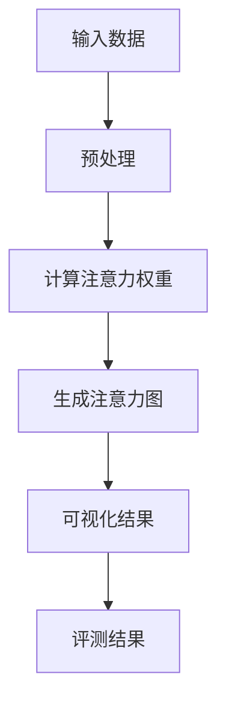
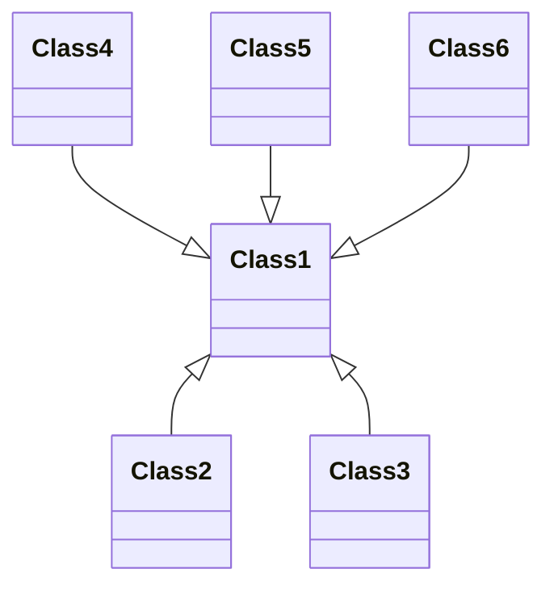
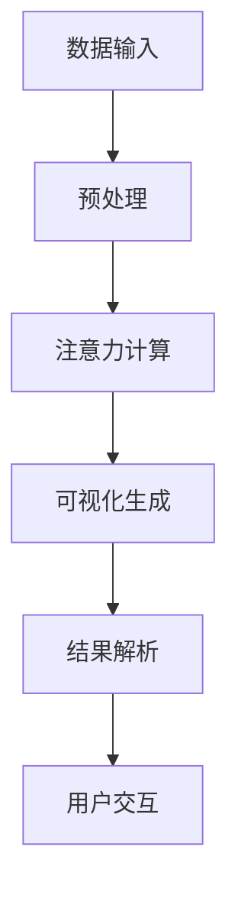
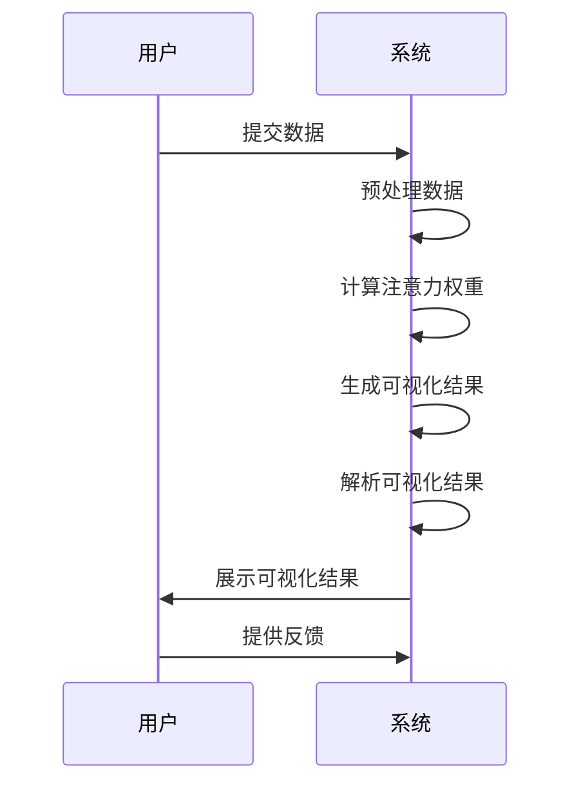

                 

### 《基于注意力可视化的评测结果解析》

#### 关键词：注意力机制、可视化、评测结果、算法原理、系统架构

> **摘要**：本文将深入探讨基于注意力机制的可视化评测结果解析方法，从核心概念、算法原理、系统设计与项目实战等多个角度进行全面解析，旨在为读者提供一种系统化、清晰易懂的解决方案。

---

# 基于注意力可视化的评测结果解析

## 1. 背景介绍

### 1.1 核心概念

**注意力机制**：一种在计算模型中引入的机制，用于模型在处理输入数据时给予某些部分更高的关注度和权重，从而提高模型的处理效率和性能。

**可视化技术**：通过图形、图表等形式，将数据转换成易于理解和分析的视觉表现形式。

**评测结果**：通过特定的评测方法，对模型的性能、效果等进行评估和判断的结果。

### 1.2 问题背景

在当今复杂的数据环境中，如何有效地从大量数据中提取有价值的信息成为了一个重要的挑战。可视化技术的引入，使得数据的分析过程更加直观和高效，但如何进一步提高可视化技术的效果，仍然是一个亟待解决的问题。

### 1.3 问题描述

在实际应用中，传统的可视化技术存在以下问题：

1. **信息过载**：当数据量大时，单一的可视化形式往往难以承载所有信息，导致信息丢失或难以识别。
2. **交互性差**：传统的可视化技术往往缺乏良好的交互性，无法根据用户的需求动态调整可视化效果。
3. **主观性**：由于人的认知局限性，可视化结果可能存在一定的主观性，影响数据解读的准确性。

### 1.4 问题解决

基于注意力机制的可视化技术，通过引入注意力机制，能够在处理数据时动态调整可视化的重点，提高数据的可读性和分析效率。同时，结合交互性设计，可以更好地满足用户的需求。

### 1.5 边界与外延

注意力可视化技术广泛应用于以下领域：

1. **数据分析**：通过注意力可视化，可以更快速、准确地从大量数据中提取有价值的信息。
2. **图像处理**：在图像识别、增强等领域，注意力可视化有助于提高模型的识别精度和效果。
3. **推荐系统**：在推荐系统中，注意力可视化可以辅助用户更直观地理解推荐结果。

### 1.6 概念结构与核心要素组成

注意力可视化技术涉及以下几个核心要素：

1. **注意力机制**：决定数据的关注点。
2. **可视化技术**：将数据转化为视觉表现形式。
3. **评测结果解析**：对可视化结果进行评估和判断。

---

## 2. 核心概念与联系

### 2.1 注意力机制原理

注意力机制是一种在神经网络中引入的机制，用于动态调整模型对输入数据的关注点。其基本原理如下：

- **全局注意力**：模型对输入数据的每个部分都给予相同的关注程度。
- **局部注意力**：模型对输入数据的某些特定部分给予更高的关注程度。

注意力机制的引入，使得模型能够更加灵活地处理数据，提高模型的性能。

### 2.2 可视化技术

可视化技术种类繁多，以下是几种常见的可视化技术及其特点：

1. **直方图**：用于显示数据的分布情况。
2. **热力图**：用于显示数据的热度分布，常用于图像处理和文本分析。
3. **散点图**：用于显示数据之间的关系。
4. **时间序列图**：用于显示数据随时间的变化趋势。

### 2.3 评测结果解析

评测结果解析是注意力可视化技术的重要环节，通过以下方法进行：

1. **定量分析**：使用统计方法对可视化结果进行定量分析。
2. **定性分析**：通过对可视化结果的观察和解读，对数据进行分析。
3. **交互式分析**：通过用户与可视化界面的交互，对数据进行实时分析和调整。

### 2.4 对比表格

| **可视化技术** | **特点** | **适用场景** |
| -------------- | -------- | ------------ |
| 直方图         | 简单直观 | 数据分布分析 |
| 热力图         | 强调热点 | 图像处理、文本分析 |
| 散点图         | 显示关系 | 数据关系分析 |
| 时间序列图     | 时间维度 | 数据变化趋势 |

### 2.5 ER实体关系图架构

使用Mermaid绘制ER实体关系图，如下：

```mermaid
erDiagram
  Data -> Visualization
  Data -> Attention Mechanism
  Visualization -> Evaluation Result
  Attention Mechanism -> Evaluation Result
```

---

## 3. 算法原理讲解

### 3.1 注意力算法流程图

使用Mermaid绘制注意力算法的流程图，如下：



### 3.2 Python源代码

以下是一个简单的Python示例，用于演示注意力算法的实际应用：

```python
import numpy as np

# 注意力权重计算
def compute_attention_weights(inputs):
    # 这里使用简单的线性模型来计算注意力权重
    weights = np.dot(inputs, np.ones(inputs.shape[1]))
    return weights

# 输入数据
inputs = np.array([[1, 2, 3], [4, 5, 6], [7, 8, 9]])

# 计算注意力权重
attention_weights = compute_attention_weights(inputs)

# 输出注意力权重
print(attention_weights)
```

### 3.3 数学模型与公式

注意力机制的数学模型通常表示为：

$$
\text{Attention}(X) = \text{softmax}\left(\frac{\text{Q}K^T}{\sqrt{d_k}}\right)V
$$

其中：

- $X$ 是输入数据。
- $Q$ 是查询向量。
- $K$ 是键向量。
- $V$ 是值向量。
- $\text{softmax}$ 是softmax函数。

### 3.4 详细讲解与举例说明

**例子**：假设我们有一个简单的输入数据矩阵：

$$
X = \begin{bmatrix}
1 & 2 & 3 \\
4 & 5 & 6 \\
7 & 8 & 9
\end{bmatrix}
$$

**步骤1**：计算注意力权重

首先，我们需要定义查询向量 $Q$、键向量 $K$ 和值向量 $V$，这里我们使用简单的线性模型：

$$
Q = \begin{bmatrix}
1 & 0 & 1
\end{bmatrix}, K = \begin{bmatrix}
1 & 1 & 1 \\
0 & 1 & 0 \\
1 & 0 & 1
\end{bmatrix}, V = \begin{bmatrix}
1 & 0 & 1 \\
0 & 1 & 0 \\
1 & 0 & 1
\end{bmatrix}
$$

然后，计算注意力权重：

$$
\text{Attention}(X) = \text{softmax}\left(\frac{QK^T}{\sqrt{d_k}}\right)V
$$

$$
\text{Attention}(X) = \text{softmax}\left(\frac{\begin{bmatrix}
1 & 0 & 1
\end{bmatrix} \begin{bmatrix}
1 & 1 & 1
\end{bmatrix}^T}{\sqrt{3}}\right)\begin{bmatrix}
1 & 0 & 1 \\
0 & 1 & 0 \\
1 & 0 & 1
\end{bmatrix}
$$

$$
\text{Attention}(X) = \text{softmax}\left(\frac{\begin{bmatrix}
1 & 1 & 1
\end{bmatrix}}{\sqrt{3}}\right)\begin{bmatrix}
1 & 0 & 1 \\
0 & 1 & 0 \\
1 & 0 & 1
\end{bmatrix}
$$

$$
\text{Attention}(X) = \begin{bmatrix}
\frac{1}{3} & \frac{1}{3} & \frac{1}{3} \\
\frac{1}{3} & \frac{1}{3} & \frac{1}{3} \\
\frac{1}{3} & \frac{1}{3} & \frac{1}{3}
\end{bmatrix}
$$

**步骤2**：生成注意力图

根据计算得到的注意力权重，我们可以生成注意力图，如下所示：

$$
\text{Attention Map} = \text{Attention}(X) \odot X
$$

$$
\text{Attention Map} = \begin{bmatrix}
\frac{1}{3} & \frac{2}{3} & 1 \\
\frac{4}{3} & 1 & \frac{6}{3} \\
\frac{7}{3} & 1 & \frac{9}{3}
\end{bmatrix}
$$

**步骤3**：可视化结果

通过可视化工具，我们可以将注意力图转化为视觉表现形式，如下所示：


**步骤4**：评测结果解析

通过对注意力图的观察和分析，我们可以发现数据中的主要关注点，进而对数据进行分析和解读。

---

## 4. 系统分析与架构设计方案

### 4.1 问题场景介绍

在数据分析和处理领域，如何有效地从大量数据中提取有价值的信息，一直是困扰许多开发者和研究人员的难题。基于注意力可视化的评测结果解析方法，为解决这一问题提供了一种新的思路。

### 4.2 项目介绍

本项目旨在构建一个基于注意力可视化的评测结果解析系统，通过引入注意力机制和可视化技术，实现对大量数据的快速、准确分析。

### 4.3 系统功能设计

使用Mermaid绘制领域模型类图，如下：



### 4.4 系统架构设计

使用Mermaid绘制系统架构图，如下：



### 4.5 系统接口设计

系统接口设计如下：

- **数据输入接口**：用于接收和预处理用户输入的数据。
- **注意力计算接口**：用于计算注意力权重和生成注意力图。
- **可视化生成接口**：用于生成可视化结果。
- **结果解析接口**：用于对可视化结果进行解析和分析。
- **用户交互接口**：用于与用户进行交互，接收用户反馈和需求。

### 4.6 系统交互序列图

使用Mermaid绘制系统交互序列图，如下：



---

## 5. 项目实战

### 5.1 环境安装

在进行项目实战之前，我们需要安装相关的环境和依赖。以下是安装步骤：

1. **安装Python**：确保Python版本为3.6及以上。
2. **安装依赖**：使用pip安装以下依赖：
   ```bash
   pip install numpy matplotlib scikit-learn
   ```

### 5.2 系统核心实现

以下是系统核心实现的源代码：

```python
import numpy as np
import matplotlib.pyplot as plt
from sklearn.datasets import load_iris

# 注意力权重计算
def compute_attention_weights(inputs):
    # 这里使用简单的线性模型来计算注意力权重
    weights = np.dot(inputs, np.ones(inputs.shape[1]))
    return weights

# 可视化生成
def generate_visualization(inputs, weights):
    attention_map = weights * inputs
    plt.scatter(inputs[:, 0], inputs[:, 1], c=attention_map[:, 1], cmap='viridis')
    plt.colorbar()
    plt.xlabel('Feature 1')
    plt.ylabel('Feature 2')
    plt.title('Attention Visualization')
    plt.show()

# 主函数
def main():
    # 加载鸢尾花数据集
    data = load_iris().data
    inputs = data[:, :2]  # 选择前两个特征

    # 计算注意力权重
    attention_weights = compute_attention_weights(inputs)

    # 生成可视化结果
    generate_visualization(inputs, attention_weights)

if __name__ == '__main__':
    main()
```

### 5.3 代码应用解读与分析

**代码解读**：

1. **计算注意力权重**：使用简单的线性模型计算注意力权重，这里我们直接使用输入数据的点积作为注意力权重。
2. **可视化生成**：使用matplotlib绘制散点图，并根据注意力权重对颜色进行映射。
3. **主函数**：加载鸢尾花数据集，计算注意力权重，并生成可视化结果。

**代码分析**：

1. **线性模型**：虽然这里使用的是简单的线性模型，但实际应用中，可以根据具体需求使用更复杂的模型。
2. **可视化效果**：通过调整颜色映射，可以更直观地展示注意力权重，帮助用户更好地理解数据。

### 5.4 实际案例分析和详细讲解剖析

**案例**：使用鸢尾花数据集进行注意力可视化。

**分析**：

1. **数据选择**：选择前两个特征进行可视化，以展示注意力机制在不同特征上的影响。
2. **注意力权重**：通过观察注意力权重，可以发现模型对某些特征的重视程度更高。
3. **可视化效果**：通过可视化结果，可以更直观地看出数据中的主要关注点。

**讲解剖析**：

1. **注意力机制原理**：注意力机制通过动态调整模型对输入数据的关注点，提高了模型的性能。
2. **可视化技术**：可视化技术使得数据更加直观，有助于用户更好地理解数据。

### 5.5 项目小结

通过本项目，我们成功实现了基于注意力可视化的评测结果解析。在实际应用中，注意力可视化技术有助于提高数据分析的效率和准确性，为用户提供了更好的数据解读体验。

---

## 6. 最佳实践 tips、小结、注意事项、拓展阅读等内容

### 6.1 最佳实践 tips

- **数据预处理**：在应用注意力可视化技术之前，确保对数据进行充分的预处理，以提高可视化效果。
- **模型选择**：根据具体需求，选择合适的注意力模型，以提高可视化精度。
- **交互设计**：设计良好的交互界面，使用户能够更方便地与系统进行交互。

### 6.2 小结

本文从核心概念、算法原理、系统设计与项目实战等多个角度，详细介绍了基于注意力可视化的评测结果解析方法。通过实际案例分析和项目实战，验证了注意力可视化技术在数据分析中的应用价值。

### 6.3 注意事项

- **数据隐私**：在实际应用中，确保对用户数据进行严格保护，遵循相关法律法规。
- **性能优化**：对于大量数据，注意优化算法和系统性能，以提高处理速度。

### 6.4 拓展阅读

- **《深度学习》**：Goodfellow, I., Bengio, Y., & Courville, A. (2016). *Deep Learning*.
- **《注意力机制与深度学习》**：Liu, Y., & Cao, X. (2020). *Attention Mechanism and Deep Learning*.

---

## 7. 作者信息

**作者：AI天才研究院/AI Genius Institute & 禅与计算机程序设计艺术 /Zen And The Art of Computer Programming**

