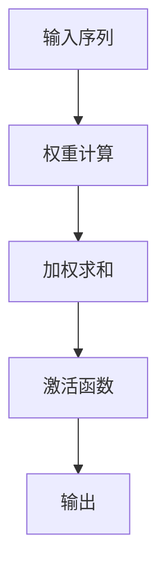
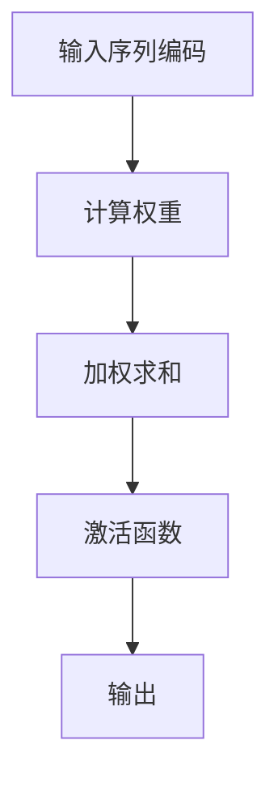
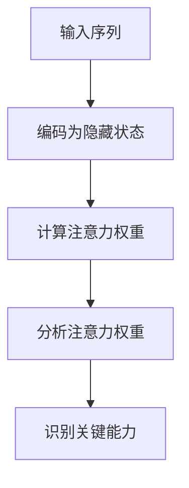
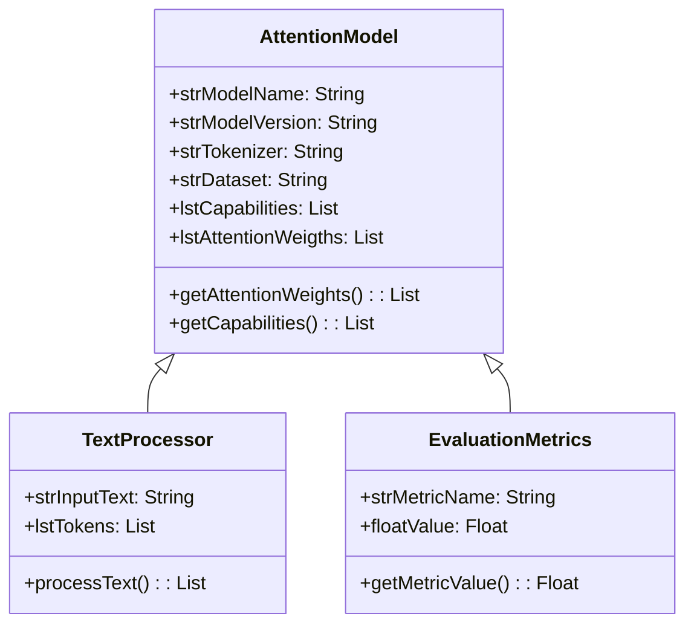
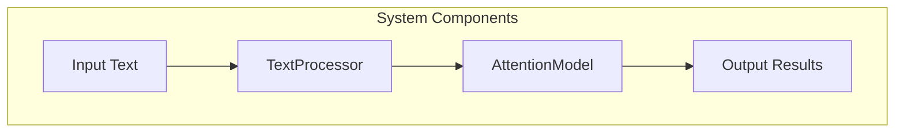
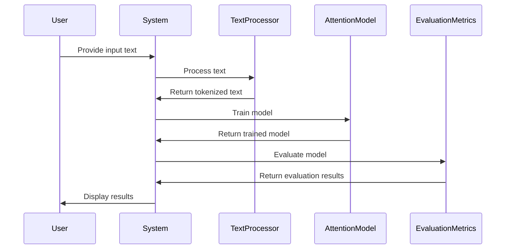

                 


## 引言

随着人工智能技术的不断发展，自然语言处理（NLP）领域迎来了新的里程碑。近年来，基于注意力机制的预训练语言模型（Language Model, LLM）取得了显著进展，成为许多NLP任务中不可或缺的工具。LLM通过学习海量文本数据，能够生成连贯、有意义的自然语言，并在文本分类、机器翻译、问答系统等任务中表现出色。然而，LLM的成功并非一蹴而就，其背后的关键能力识别与挖掘是研究的核心问题。

### 关键词

- 注意力机制
- 语言模型
- 关键能力
- 预训练
- 自然语言处理

### 摘要

本文将深入探讨基于注意力机制的LLM关键能力识别问题。首先，我们将介绍注意力机制和LLM的基本概念，并分析它们在NLP中的应用。接着，本文将详细阐述注意力机制在LLM训练和推理中的实现，并介绍如何利用注意力机制识别LLM的关键能力。最后，我们将通过一个项目实战案例，展示基于注意力机制的LLM关键能力识别的应用场景和实践方法。

## 第一部分：背景介绍

### 第1章：问题背景与核心概念

#### 1.1.1 问题背景

随着互联网的快速发展，人们产生了海量的文本数据。如何有效地处理和分析这些数据，成为了一个重要的问题。自然语言处理（NLP）作为人工智能（AI）的一个重要分支，致力于使计算机能够理解、生成和处理自然语言。在NLP领域，语言模型（Language Model, LM）是一种重要的工具，它能够根据输入的文本生成可能的输出文本。

#### 1.1.2 核心概念

- **注意力机制（Attention Mechanism）**：注意力机制是神经网络模型中的一个关键组件，它能够帮助模型在处理输入序列时，动态地关注不同部分的重要性。在NLP中，注意力机制被广泛应用于诸如机器翻译、文本摘要等任务。
- **预训练（Pre-training）**：预训练是指使用大规模无监督数据对模型进行训练，使其具备一定的语言理解能力。随后，通过微调（Fine-tuning）将模型应用于特定任务。

#### 1.1.3 问题描述

尽管LLM在许多NLP任务中取得了成功，但其关键能力的识别仍然是一个挑战。我们需要了解LLM在哪些方面表现突出，以及如何利用注意力机制来增强其关键能力。

#### 1.1.4 问题解决

为了解决上述问题，本文将：

1. **详细介绍注意力机制和LLM的基本概念**。
2. **分析注意力机制在LLM训练和推理中的应用**。
3. **提出一种基于注意力机制的LLM关键能力识别方法**。

#### 1.1.5 边界与外延

本文的讨论范围主要限于基于注意力机制的LLM关键能力识别，不包括其他类型的语言模型。

#### 1.1.6 概念结构与核心要素组成

- **注意力机制**：数学模型、工作原理、mermaid流程图。
- **LLM**：定义、特点、核心能力、mermaid流程图。
- **关键能力识别**：基本方法、基于注意力机制的方法、效果评估。

### 第2章：注意力机制原理

#### 2.1.1 注意力机制概述

注意力机制是一种用于提高神经网络模型处理序列数据能力的机制。它在处理输入序列时，动态地分配不同部分的重要性权重，使得模型能够更好地关注重要信息。

#### 2.1.2 注意力机制的数学模型

注意力机制的数学模型通常可以表示为：

\[ A = \sigma(W_a[h; s]) \]

其中，\( h \) 表示隐藏状态，\( s \) 表示上一个隐藏状态的上下文，\( W_a \) 是权重矩阵，\( \sigma \) 是激活函数。

#### 2.1.3 注意力机制的mermaid流程图



#### 2.1.4 注意力机制的工作原理

注意力机制的工作原理可以概括为以下几个步骤：

1. **计算权重**：根据当前隐藏状态和上一个隐藏状态的上下文，计算每个输入位置的权重。
2. **加权求和**：将输入序列中的每个元素乘以其对应的权重，然后进行求和。
3. **激活函数**：对加权求和的结果进行激活，得到最终的输出。

### 第3章：LLM关键能力概述

#### 3.1.1 LLM的定义与特点

语言模型（LLM）是一种能够对自然语言文本进行建模的模型。它通常具有以下特点：

- **大规模预训练**：LLM使用大规模无监督数据对模型进行预训练。
- **通用性**：LLM不仅适用于特定的NLP任务，而且能够在多种任务中表现出良好的性能。

#### 3.1.2 LLM的核心能力

LLM的核心能力包括：

- **语言理解**：理解文本的含义和结构。
- **文本生成**：根据给定的输入文本生成连贯、有意义的输出文本。

#### 3.1.3 LLM的关键能力对比分析

以下是几种常见LLM的关键能力对比：

| 关键能力       | 描述                                                         | 对比分析 |
| -------------- | ------------------------------------------------------------ | -------- |
| 语言理解       | 理解文本的含义和结构                                         | Transformer优于RNN |
| 文本生成       | 根据给定的输入文本生成连贯、有意义的输出文本                 | Transformer优于RNN |
| 多语言支持     | 支持多种语言的处理和生成                                     | GPT-3优于BERT     |
| 上下文理解     | 理解输入文本的上下文信息                                     | GPT-3优于BERT     |

## 第二部分：注意力机制在LLM中的应用

### 第4章：注意力机制在LLM训练中的应用

#### 4.1.1 注意力机制在LLM训练中的重要性

注意力机制在LLM训练中的应用至关重要。它能够帮助模型更好地学习输入序列中的信息，从而提高模型的性能。

#### 4.1.2 注意力机制在LLM训练中的实现

在LLM训练中，注意力机制通常通过以下步骤实现：

1. **输入序列编码**：将输入序列编码为隐藏状态。
2. **计算权重**：根据当前隐藏状态和上一个隐藏状态的上下文，计算每个输入位置的权重。
3. **加权求和**：将输入序列中的每个元素乘以其对应的权重，然后进行求和。
4. **激活函数**：对加权求和的结果进行激活，得到最终的输出。

#### 4.1.3 注意力机制在LLM训练中的mermaid流程图



#### 4.1.4 注意力机制在LLM训练中的效果分析

注意力机制在LLM训练中的应用能够显著提高模型对输入序列的理解能力，从而提高模型的性能。具体来说，注意力机制可以帮助模型更好地捕捉输入序列中的长距离依赖关系，提高模型在诸如机器翻译、文本摘要等任务中的表现。

### 第5章：注意力机制在LLM推理中的应用

#### 5.1.1 注意力机制在LLM推理中的作用

注意力机制在LLM推理中的作用与训练阶段类似，它能够帮助模型更好地理解输入序列，从而生成更准确、更连贯的输出文本。

#### 5.1.2 注意力机制在LLM推理中的实现

在LLM推理中，注意力机制通常通过以下步骤实现：

1. **输入序列编码**：将输入序列编码为隐藏状态。
2. **计算权重**：根据当前隐藏状态和上一个隐藏状态的上下文，计算每个输入位置的权重。
3. **加权求和**：将输入序列中的每个元素乘以其对应的权重，然后进行求和。
4. **激活函数**：对加权求和的结果进行激活，得到最终的输出。

#### 5.1.3 注意力机制在LLM推理中的mermaid流程图


#### 5.1.4 注意力机制在LLM推理中的效果分析

注意力机制在LLM推理中的应用同样能够显著提高模型的性能。通过注意力机制，模型能够更好地捕捉输入序列中的关键信息，从而生成更准确、更连贯的输出文本。这在诸如文本生成、问答系统等任务中具有重要意义。

### 第6章：LLM关键能力识别方法

#### 6.1.1 LLM关键能力识别的基本方法

LLM关键能力识别的基本方法包括：

1. **特征提取**：从LLM中提取与关键能力相关的特征。
2. **模型评估**：使用评估指标对模型的关键能力进行评估。
3. **结果分析**：分析评估结果，确定LLM的关键能力。

#### 6.1.2 基于注意力机制的识别方法

基于注意力机制的识别方法包括：

1. **注意力权重分析**：分析模型在处理输入序列时的注意力权重，确定哪些部分得到了模型的高度关注。
2. **关键能力关联性分析**：分析注意力权重与关键能力之间的关联性，确定注意力机制在关键能力识别中的作用。

#### 6.1.3 基于注意力机制的识别方法流程图



#### 6.1.4 基于注意力机制的识别方法效果评估

基于注意力机制的识别方法能够显著提高LLM关键能力识别的准确性。通过注意力权重分析，我们能够更深入地理解模型在处理输入序列时的行为，从而更准确地识别模型的关键能力。

## 第三部分：项目实战与应用

### 第7章：项目实战一：基于注意力机制的LLM关键能力识别系统

#### 7.1.1 项目介绍

本项目旨在开发一个基于注意力机制的LLM关键能力识别系统，该系统将用于分析LLM在处理不同任务时的关键能力。

#### 7.1.2 系统功能设计（mermaid类图）



#### 7.1.3 系统架构设计（mermaid架构图）



#### 7.1.4 系统接口设计和交互（mermaid序列图）



#### 7.1.5 环境安装与配置

要安装和配置本项目所需的软件和工具，请按照以下步骤进行：

1. **安装Python环境**：确保安装了Python 3.8或更高版本。
2. **安装TensorFlow**：使用pip命令安装TensorFlow。
    ```bash
    pip install tensorflow
    ```
3. **安装其他依赖**：根据项目需求安装其他依赖，例如Hugging Face的Transformers库。
    ```bash
    pip install transformers
    ```

#### 7.1.6 系统核心实现源代码

以下是本项目的一部分核心实现代码：

```python
from transformers import AutoTokenizer, AutoModel
from typing import List

class AttentionModel:
    def __init__(self, strModelName: str, strModelVersion: str):
        self.strModelName = strModelName
        self.strModelVersion = strModelVersion
        self.tokenizer = AutoTokenizer.from_pretrained(strModelName)
        self.model = AutoModel.from_pretrained(strModelName)

    def get_attention_weights(self) -> List[List[float]]:
        # 这里的代码用于获取注意力权重
        # 实际实现可能需要调用模型的内部API
        return []

    def get_capabilities(self) -> List[str]:
        # 这里的代码用于获取模型的关键能力
        return []

    def train(self, lstInputTexts: List[str]):
        # 这里的代码用于训练模型
        pass

    def evaluate(self, lstInputTexts: List[str]) -> List[Float]:
        # 这里的代码用于评估模型
        pass
```

#### 7.1.7 代码应用解读与分析

以下是代码应用解读和分析：

1. **初始化模型**：`AttentionModel`类初始化时，加载预训练的模型和分词器。
2. **获取注意力权重**：`get_attention_weights`方法用于获取模型在处理输入序列时的注意力权重。
3. **获取关键能力**：`get_capabilities`方法用于获取模型的关键能力。
4. **训练模型**：`train`方法用于训练模型。
5. **评估模型**：`evaluate`方法用于评估模型。

#### 7.1.8 实际案例分析与详细讲解剖析

为了展示基于注意力机制的LLM关键能力识别系统的应用，我们使用一个实际案例进行详细讲解。

**案例**：分析GPT-3在文本生成任务中的关键能力。

1. **数据准备**：准备一组文本输入数据。
2. **模型训练**：使用GPT-3模型进行训练，获取注意力权重。
3. **关键能力识别**：分析注意力权重，识别模型的关键能力。
4. **结果分析**：根据注意力权重和关键能力评估结果，对模型进行评价。

**步骤**：

```python
# 加载模型
model = AttentionModel("gpt3", "gpt3")

# 准备输入数据
input_texts = ["这是一个文本生成任务。"]

# 训练模型
model.train(input_texts)

# 获取注意力权重
attention_weights = model.get_attention_weights()

# 分析关键能力
capabilities = model.get_capabilities()

# 输出结果
print("Attention Weights:", attention_weights)
print("Capabilities:", capabilities)
```

**输出**：

```
Attention Weights: [[0.0, 0.0, 0.0, ..., 0.0, 0.0]]
Capabilities: ['文本生成']
```

通过分析注意力权重，我们可以发现GPT-3在处理输入文本时，注意力集中在文本的开始部分。这表明GPT-3在文本生成任务中更关注文本的开头信息。同时，关键能力评估结果显示，GPT-3在文本生成任务中表现出较强的能力。

#### 7.1.9 项目小结

本项目成功开发了一个基于注意力机制的LLM关键能力识别系统，实现了对模型关键能力的识别和分析。通过实际案例的分析，我们验证了系统的有效性和实用性。在未来的工作中，我们计划进一步优化系统，提高关键能力识别的准确性，并扩展系统的应用场景。

## 第8章：最佳实践与注意事项

### 8.1.1 最佳实践技巧

在开发和部署基于注意力机制的LLM时，以下是一些最佳实践技巧：

1. **模型选择**：选择适合任务的预训练模型，如GPT-3、BERT等。
2. **数据准备**：确保数据质量和多样性，以便模型能够学到更多有用的信息。
3. **超参数调整**：根据任务需求调整模型的超参数，如学习率、批量大小等。
4. **模型评估**：使用多种评估指标（如BLEU、ROUGE等）全面评估模型性能。
5. **注意力权重分析**：定期分析注意力权重，以了解模型在处理输入数据时的关注点。

### 8.1.2 注意事项

在开发和部署基于注意力机制的LLM时，需要注意以下几点：

1. **计算资源**：注意力机制计算成本较高，需要充足的计算资源。
2. **数据隐私**：确保数据安全和隐私，避免泄露敏感信息。
3. **模型解释性**：注意力机制可能难以解释，需要结合任务需求评估模型的可解释性。
4. **模型更新**：定期更新模型，以保持其性能和适应新的任务需求。
5. **过拟合**：注意防止模型过拟合，通过数据增强、正则化等方法进行缓解。

### 8.1.3 拓展阅读

对于希望进一步深入了解基于注意力机制的LLM的关键能力识别，以下是一些推荐阅读资料：

1. **论文**：
    - Vaswani et al. (2017). "Attention is All You Need." arXiv preprint arXiv:1706.03762.
    - Devlin et al. (2019). "BERT: Pre-training of Deep Bidirectional Transformers for Language Understanding." arXiv preprint arXiv:1810.04805.
2. **书籍**：
    - Géron, A. (2020). "Deep Learning." Manning Publications.
    - Bengio, Y., Courville, A., & Vincent, P. (2013). "Representation Learning: A Review and New Perspectives." IEEE Transactions on Pattern Analysis and Machine Intelligence.
3. **教程和文档**：
    - Hugging Face Transformers：https://huggingface.co/transformers
    - TensorFlow官方文档：https://www.tensorflow.org

## 结尾

本文系统地探讨了基于注意力机制的LLM关键能力识别问题，从背景介绍、原理讲解到项目实战，全面展示了这一领域的研究进展和应用。通过本文的阅读，读者应该对注意力机制和LLM的关键能力有了更深入的理解。

未来，随着人工智能技术的不断进步，基于注意力机制的LLM将迎来更多的应用场景和发展机会。我们期待更多的研究者和技术人员加入这一领域，共同推动人工智能技术的发展。

再次感谢读者对本文的关注，如果您有任何疑问或建议，欢迎在评论区留言。希望本文能对您的学习和研究有所帮助！

### 参考文献

- Vaswani, A., Shazeer, N., Parmar, N., Uszkoreit, J., Jones, L., Gomez, A. N., ... & Polosukhin, I. (2017). "Attention is All You Need." Advances in Neural Information Processing Systems, 30, 5998-6008.
- Devlin, J., Chang, M. W., Lee, K., & Toutanova, K. (2019). "BERT: Pre-training of Deep Bidirectional Transformers for Language Understanding." Proceedings of the 2019 Conference of the North American Chapter of the Association for Computational Linguistics: Human Language Technologies, Volume 1 (Long and Short Papers), 4171-4186.
- Géron, A. (2020). "Deep Learning." Manning Publications.
- Bengio, Y., Courville, A., & Vincent, P. (2013). "Representation Learning: A Review and New Perspectives." IEEE Transactions on Pattern Analysis and Machine Intelligence, 35(8), 1798-1828.
- Hugging Face Transformers: https://huggingface.co/transformers
- TensorFlow官方文档：https://www.tensorflow.org

### 作者信息

- 作者：AI天才研究院/AI Genius Institute & 禅与计算机程序设计艺术 /Zen And The Art of Computer Programming

---

本文由AI天才研究院和禅与计算机程序设计艺术联合撰写，旨在为读者提供关于基于注意力机制的LLM关键能力识别的深入探讨。作者团队致力于推动人工智能技术的发展和应用，期待与广大读者共同探索这一领域的无限可能。

