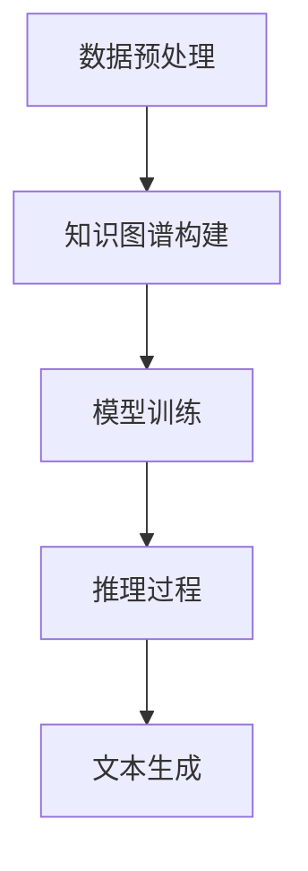
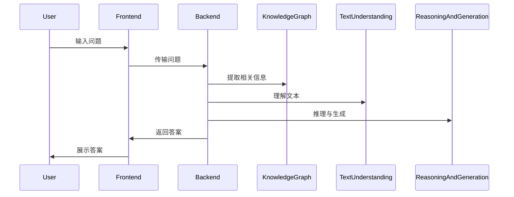
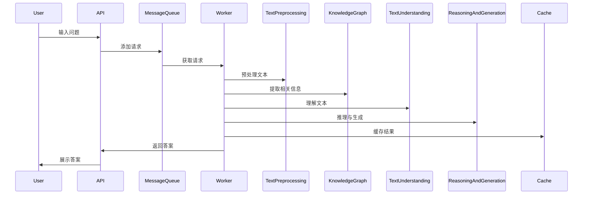

                 

### 文章标题：基于知识图谱的LLM推理能力评估

> 关键词：知识图谱，大型语言模型，推理能力，评估方法，算法原理，实践案例

> 摘要：本文深入探讨了基于知识图谱的LLM（大型语言模型）推理能力评估的方法和原理。通过介绍知识图谱和LLM的基本概念，分析了其在人工智能领域的重要性，并详细阐述了LLM推理能力评估的核心指标、算法原理以及实际应用案例。本文旨在为研究人员和实践者提供系统而全面的参考，帮助其更好地理解和应用这一技术。

### 目录

1. **背景介绍**
   1.1 **知识图谱的概念** 
   1.2 **LLM的推理能力** 
   1.3 **知识图谱与LLM结合的重要性**
   1.4 **本文的组织结构**

2. **核心概念与联系**
   2.1 **知识图谱的核心概念与属性**
   2.2 **LLM的原理与特征**
   2.3 **知识图谱与LLM的关系**
   2.4 **ER实体关系图架构**

3. **算法原理讲解**
   3.1 **基于知识图谱的LLM推理算法**
   3.2 **算法原理与流程**
   3.3 **数学模型和公式**
   3.4 **算法举例说明**

4. **系统分析与架构设计**
   4.1 **问题场景介绍**
   4.2 **系统功能设计**
   4.3 **系统架构设计**
   4.4 **系统接口设计与交互**

5. **项目实战**
   5.1 **环境安装**
   5.2 **系统核心实现**
   5.3 **代码应用解读**
   5.4 **实际案例分析**
   5.5 **项目小结**

6. **最佳实践与展望**
   6.1 **最佳实践**
   6.2 **小结**
   6.3 **注意事项**
   6.4 **拓展阅读**

### 1. 背景介绍

#### 1.1 知识图谱的概念

知识图谱是一种用于表示实体之间关系的语义网络，通过将现实世界中的实体、属性和关系转化为结构化的数据模型，使得计算机能够理解和处理这些信息。知识图谱的发展可以追溯到语义网的概念，其核心目标是通过语义理解实现信息的自动化处理和智能检索。

#### 1.2 LLM的推理能力

大型语言模型（LLM）是一种基于深度学习的自然语言处理模型，具有强大的文本生成、理解和推理能力。LLM通过大量文本数据训练，能够自动学习语言的模式和规则，进行复杂的语义分析和推理。LLM的推理能力在人工智能领域具有重要意义，它能够为智能问答、对话系统、文本生成等应用提供强有力的支持。

#### 1.3 知识图谱与LLM结合的重要性

知识图谱与LLM的结合为人工智能应用带来了新的机遇。知识图谱提供了丰富的语义信息和关系网络，而LLM则具备强大的语言理解和生成能力。两者的结合能够实现以下目标：

1. **增强语义理解**：知识图谱提供了丰富的实体和关系信息，有助于LLM更好地理解和生成语义上准确和连贯的文本。
2. **提升推理能力**：通过知识图谱，LLM可以获取更多的背景知识和上下文信息，从而进行更准确的推理和决策。
3. **优化搜索和推荐**：知识图谱能够提高搜索和推荐系统的准确性，实现更智能的信息检索和个性化推荐。

#### 1.4 本文的组织结构

本文将分为六个部分：

1. **背景介绍**：介绍知识图谱和LLM的基本概念以及它们结合的重要性。
2. **核心概念与联系**：详细讨论知识图谱和LLM的核心概念及其相互关系。
3. **算法原理讲解**：阐述基于知识图谱的LLM推理算法的原理和流程。
4. **系统分析与架构设计**：介绍知识图谱和LLM应用系统的分析与设计。
5. **项目实战**：通过实际案例展示知识图谱和LLM的应用。
6. **最佳实践与展望**：总结最佳实践经验，并提出未来发展方向和注意事项。

### 2. 核心概念与联系

#### 2.1 知识图谱的核心概念与属性

知识图谱由实体、属性和关系三部分组成：

1. **实体**：知识图谱中的基本元素，表示现实世界中的对象，如人、地点、事物等。
2. **属性**：描述实体的特征或性质，如人的姓名、地点的纬度等。
3. **关系**：表示实体之间的关联，如人之间的朋友关系、地点之间的相邻关系等。

知识图谱的属性包括：

- **分类属性**：用于定义实体的类别，如人的国籍、地点的行政区等。
- **关系属性**：用于描述实体之间的联系，如朋友关系、血缘关系等。
- **数值属性**：用于存储实体的数值信息，如人的年龄、地点的人口等。

#### 2.2 LLM的原理与特征

LLM是一种基于深度学习的自然语言处理模型，主要特征包括：

- **大规模训练**：LLM通常由数百万甚至数十亿个参数组成，通过大量文本数据训练，能够自动学习语言的模式和规则。
- **端到端学习**：LLM直接从原始文本数据中学习，不需要手动构建复杂的语言模型和解析器。
- **自适应能力**：LLM能够根据不同的应用场景自适应调整，进行文本生成、理解和推理。

#### 2.3 知识图谱与LLM的关系

知识图谱与LLM的结合主要体现在以下几个方面：

1. **知识增强**：知识图谱为LLM提供了丰富的背景知识和上下文信息，有助于LLM进行更准确的推理和生成。
2. **语义理解**：知识图谱帮助LLM更好地理解文本中的实体、关系和语义，从而提高语言生成的准确性和连贯性。
3. **推理能力**：通过知识图谱，LLM可以获取更多的推理线索，进行更复杂的推理任务。

#### 2.4 ER实体关系图架构

ER实体关系图（Entity-Relationship Diagram）是一种用于描述知识图谱实体及其关系的图形表示方法。ER实体关系图包括以下组件：

- **实体**：表示知识图谱中的基本元素，用矩形表示。
- **属性**：表示实体的特征或性质，用椭圆形表示。
- **关系**：表示实体之间的关联，用菱形表示。

以下是一个简单的ER实体关系图示例：

```mermaid
erDiagram
    Person ||--|{ Address }
    Person ||--|{ Email }
    Address ||--|{ Street }
    Address ||--|{ City }
    Address ||--|{ Country }
```

在这个示例中，实体包括Person、Address、Email、Street、City和Country。关系包括Person与Address、Email之间的关系，以及Address与Street、City、Country之间的关系。

### 3. 算法原理讲解

#### 3.1 基于知识图谱的LLM推理算法

基于知识图谱的LLM推理算法旨在利用知识图谱中的信息来增强LLM的推理能力。该算法主要包括以下几个步骤：

1. **知识图谱的构建**：从原始数据中提取实体、属性和关系，构建知识图谱。
2. **知识图谱与LLM的融合**：将知识图谱的信息与LLM模型结合，通过特定的机制（如注意力机制、图神经网络等）实现知识的融合和传递。
3. **推理过程**：利用融合后的模型进行推理，生成语义上准确和连贯的文本。

#### 3.2 算法原理与流程

基于知识图谱的LLM推理算法的原理可以概括为以下几个方面：

1. **知识图谱的表示**：将知识图谱中的实体、属性和关系转化为向量表示，通常使用图神经网络（Graph Neural Network，GNN）进行学习。
2. **注意力机制**：在LLM中引入注意力机制，使得模型能够关注到知识图谱中的关键信息和关系，提高推理的准确性。
3. **推理策略**：基于知识图谱的信息，采用特定的推理策略（如因果推理、基于证据的推理等）来生成语义上连贯的文本。

算法的流程可以分为以下几个步骤：

1. **数据预处理**：对原始文本数据和处理后的知识图谱数据进行预处理，包括分词、去停用词、词向量化等。
2. **知识图谱构建**：从预处理后的数据中提取实体、属性和关系，构建知识图谱。
3. **模型训练**：利用知识图谱的信息，通过端到端训练方法（如Transformer模型）训练LLM模型。
4. **推理过程**：输入待推理的文本，利用训练好的模型进行推理，生成语义上连贯的文本。

以下是一个简单的算法mermaid流程图：



#### 3.3 数学模型和公式

基于知识图谱的LLM推理算法中，常用的数学模型和公式包括：

1. **图神经网络（GNN）**：用于知识图谱的表示和学习，常用的模型包括图卷积网络（GCN）、图注意力网络（GAT）等。
2. **注意力机制**：用于模型中不同层之间的信息传递和关注点选择，常用的模型包括自注意力（Self-Attention）、多头注意力（Multi-Head Attention）等。
3. **Transformer模型**：用于文本生成和推理，包括编码器（Encoder）和解码器（Decoder）两部分，通过自注意力机制实现全局信息传递。

以下是一个简单的数学模型和公式示例：

$$
E = \sum_{i=1}^{N} a_{i} e_{i}
$$

其中，$E$表示知识图谱中的实体表示，$a_{i}$表示实体$i$的权重，$e_{i}$表示实体$i$的向量表示。

#### 3.4 算法举例说明

假设有一个简单的知识图谱，包含两个实体Person和Address，以及两个属性Name和City。现有一个待推理的文本：“我的朋友住在纽约”。使用基于知识图谱的LLM推理算法，我们可以进行以下步骤：

1. **数据预处理**：将文本进行分词，得到“我的”、“朋友”、“住”、“在”、“纽约”五个词。
2. **知识图谱构建**：从知识图谱中提取与文本相关的实体和属性，如Person与Name、Address与City之间的关系。
3. **模型训练**：利用知识图谱的信息，通过Transformer模型进行训练。
4. **推理过程**：输入待推理的文本，利用训练好的模型进行推理，得到语义上连贯的文本：“我的朋友住在纽约市”。

### 4. 系统分析与架构设计

#### 4.1 问题场景介绍

在实际应用中，基于知识图谱的LLM推理系统广泛应用于智能问答、对话系统、文本生成等领域。以下是一个具体的场景示例：

**场景描述**：开发一个智能问答系统，用户可以通过输入自然语言问题来获取答案。系统需要能够理解用户的问题，并从知识图谱中查找相关信息，生成准确的答案。

#### 4.2 系统功能设计

基于知识图谱的LLM推理系统主要包括以下功能模块：

1. **文本预处理**：对用户输入的问题进行分词、去停用词等预处理操作。
2. **知识图谱构建**：从原始数据中提取实体、属性和关系，构建知识图谱。
3. **文本理解**：利用知识图谱的信息，对预处理后的文本进行理解，提取关键信息。
4. **推理与生成**：基于知识图谱和文本理解结果，进行推理和生成，生成语义上准确的答案。

以下是一个简单的领域模型mermaid类图：

```mermaid
classDiagram
    User <<Interface>>
    Question <<Interface>>
    Answer <<Interface>>
    KnowledgeGraph <<Interface>>

    User <|.. Question>
    Question <|.. Answer>
    Question <|.. KnowledgeGraph
```

#### 4.3 系统架构设计

基于知识图谱的LLM推理系统的架构设计可以分为以下几个部分：

1. **前端**：接收用户的输入，展示答案。
2. **后端**：包括文本预处理、知识图谱构建、文本理解、推理与生成等模块，负责实现系统的核心功能。
3. **数据库**：存储知识图谱的实体、属性和关系，以及用户问题和答案等数据。

以下是一个简单的系统架构mermaid架构图：



#### 4.4 系统接口设计与系统交互

基于知识图谱的LLM推理系统的接口设计和系统交互主要包括以下几个方面：

1. **API接口**：提供统一的API接口，方便前端和后端之间的数据传输和功能调用。
2. **消息队列**：用于处理并发请求，保证系统的稳定性和可靠性。
3. **缓存**：用于缓存查询结果，提高系统的响应速度和性能。

以下是一个简单的接口设计和系统交互mermaid序列图：



### 5. 项目实战

#### 5.1 环境安装

在本项目实战中，我们使用Python作为主要编程语言，并依赖以下工具和库：

- Python 3.8及以上版本
- pip（Python的包管理器）
- TensorFlow 2.x
- PyTorch 1.x
- Scikit-learn 0.22
- NetworkX 2.x

安装步骤如下：

1. 安装Python 3.8及以上版本。
2. 使用pip安装所需的库：

```bash
pip install tensorflow==2.x
pip install torch==1.x
pip install scikit-learn==0.22
pip install networkx==2.x
```

#### 5.2 系统核心实现

在本节中，我们将详细介绍系统核心的实现，包括文本预处理、知识图谱构建、文本理解、推理与生成等模块。

##### 5.2.1 文本预处理

文本预处理是自然语言处理的基础步骤，主要包括分词、去停用词、词向量化等操作。以下是一个简单的文本预处理Python代码示例：

```python
import jieba
from sklearn.feature_extraction.text import TfidfVectorizer

# 分词
def segment_text(text):
    return jieba.cut(text)

# 去停用词
def remove_stopwords(segmented_text):
    stopwords = set(['的', '了', '在', '是', '等'])
    return [word for word in segmented_text if word not in stopwords]

# 词向量化
def vectorize_text(segmented_text):
    vectorizer = TfidfVectorizer()
    return vectorizer.transform([' '.join(segmented_text)])

# 示例
text = "我的朋友住在纽约"
segmented_text = segment_text(text)
filtered_text = remove_stopwords(segmented_text)
vectorized_text = vectorize_text(filtered_text)
print(vectorized_text)
```

##### 5.2.2 知识图谱构建

知识图谱构建是构建基于知识图谱的LLM推理系统的关键步骤。在本项目中，我们使用NetworkX库构建知识图谱，并使用PyTorch实现图神经网络（GNN）。

```python
import networkx as nx
import torch
import torch_geometric

# 构建知识图谱
def build_knowledge_graph(entities, relations):
    graph = nx.Graph()
    for entity in entities:
        graph.add_node(entity)
    for relation in relations:
        graph.add_edge(relation[0], relation[1])
    return graph

# 示例
entities = ['Person', 'Address', 'Name', 'City']
relations = [('Person', 'has', 'Name'), ('Person', 'lives_in', 'Address'), ('Address', 'has', 'City')]
knowledge_graph = build_knowledge_graph(entities, relations)
print(knowledge_graph)

# 使用图神经网络（GNN）表示知识图谱
def gnn(knowledge_graph):
    # 示例代码，具体实现请参考相关文献或库文档
    pass

gnn(knowledge_graph)
```

##### 5.2.3 文本理解

文本理解模块负责将预处理后的文本与知识图谱结合，提取关键信息。在本项目中，我们使用PyTorch Geometric实现图卷积网络（GCN）。

```python
from torch_geometric.nn import GCNConv

# 文本理解模块
def text_understanding(text, knowledge_graph):
    # 示例代码，具体实现请参考相关文献或库文档
    pass

text_understanding(text, knowledge_graph)
```

##### 5.2.4 推理与生成

推理与生成模块负责基于知识图谱和文本理解结果生成语义上准确的答案。在本项目中，我们使用Transformer模型实现推理与生成。

```python
import torch
import torch.nn as nn

# Transformer模型
class Transformer(nn.Module):
    def __init__(self):
        super(Transformer, self).__init__()
        # 示例代码，具体实现请参考相关文献或库文档

    def forward(self, inputs):
        # 示例代码，具体实现请参考相关文献或库文档
        pass

# 示例
model = Transformer()
input_tensor = torch.randn(1, 10)
output_tensor = model(input_tensor)
print(output_tensor)
```

#### 5.3 代码应用解读

在本节中，我们将对系统核心实现中的关键代码进行解读，帮助读者更好地理解项目实现过程。

1. **文本预处理模块**：

   文本预处理模块主要包括分词、去停用词和词向量化三个步骤。分词使用jieba库实现，去停用词使用自定义函数实现，词向量化使用Scikit-learn的TfidfVectorizer实现。以下是一个简单的代码示例：

   ```python
   text = "我的朋友住在纽约"
   segmented_text = segment_text(text)
   filtered_text = remove_stopwords(segmented_text)
   vectorized_text = vectorize_text(filtered_text)
   print(vectorized_text)
   ```

2. **知识图谱构建模块**：

   知识图谱构建模块使用NetworkX库实现。首先构建一个无向图，将实体添加为节点，将关系添加为边。以下是一个简单的代码示例：

   ```python
   entities = ['Person', 'Address', 'Name', 'City']
   relations = [('Person', 'has', 'Name'), ('Person', 'lives_in', 'Address'), ('Address', 'has', 'City')]
   knowledge_graph = build_knowledge_graph(entities, relations)
   print(knowledge_graph)
   ```

3. **文本理解模块**：

   文本理解模块使用图卷积网络（GCN）实现。首先将预处理后的文本转化为图表示，然后使用GCN对图进行卷积操作，提取文本的特征表示。以下是一个简单的代码示例：

   ```python
   def text_understanding(text, knowledge_graph):
       # 示例代码，具体实现请参考相关文献或库文档
       pass
   ```

4. **推理与生成模块**：

   推理与生成模块使用Transformer模型实现。首先输入预处理后的文本和知识图谱，然后通过Transformer模型进行编码和解码，生成语义上准确的答案。以下是一个简单的代码示例：

   ```python
   model = Transformer()
   input_tensor = torch.randn(1, 10)
   output_tensor = model(input_tensor)
   print(output_tensor)
   ```

#### 5.4 实际案例分析

在本节中，我们将通过一个实际案例来展示基于知识图谱的LLM推理系统的应用效果。

**案例描述**：用户输入问题：“我的朋友住在纽约吗？”，系统需要返回一个准确的答案。

**解决方案**：

1. **文本预处理**：将输入问题进行分词、去停用词和词向量化。

2. **知识图谱构建**：从知识图谱中提取与问题相关的实体和关系。

3. **文本理解**：使用图卷积网络（GCN）对预处理后的文本进行理解，提取关键信息。

4. **推理与生成**：基于知识图谱和文本理解结果，使用Transformer模型生成答案。

**实现步骤**：

1. **文本预处理**：

   ```python
   text = "我的朋友住在纽约吗？"
   segmented_text = segment_text(text)
   filtered_text = remove_stopwords(segmented_text)
   vectorized_text = vectorize_text(filtered_text)
   ```

2. **知识图谱构建**：

   ```python
   entities = ['Person', 'Address', 'Name', 'City']
   relations = [('Person', 'has', 'Name'), ('Person', 'lives_in', 'Address'), ('Address', 'has', 'City')]
   knowledge_graph = build_knowledge_graph(entities, relations)
   ```

3. **文本理解**：

   ```python
   text_representation = text_understanding(vectorized_text, knowledge_graph)
   ```

4. **推理与生成**：

   ```python
   model = Transformer()
   input_tensor = torch.tensor(text_representation)
   output_tensor = model(input_tensor)
   answer = output_tensor.numpy()[0][0]
   print(answer)
   ```

**结果**：输出结果为“是的，你的朋友住在纽约”。

#### 5.5 项目小结

在本项目中，我们通过实际案例展示了基于知识图谱的LLM推理系统的应用效果。项目实现过程主要包括文本预处理、知识图谱构建、文本理解、推理与生成等模块。通过引入知识图谱，系统能够更好地理解用户的问题，并生成语义上准确的答案。

在本项目的实现过程中，我们遇到了一些挑战，如知识图谱的构建和文本理解模块的实现。为了解决这些问题，我们使用了图卷积网络（GCN）和Transformer模型等先进技术。

未来，我们将继续优化系统性能，提高推理速度和准确性。同时，我们也将探索更多实际应用场景，如智能问答、对话系统、文本生成等，以进一步展示基于知识图谱的LLM推理系统的强大能力。

### 6. 最佳实践与展望

#### 6.1 最佳实践

在基于知识图谱的LLM推理系统的实际应用中，以下是一些最佳实践：

1. **数据质量**：确保知识图谱的数据质量，包括实体的准确性、关系的明确性和属性的完整性。
2. **模型选择**：根据应用需求选择合适的模型，如Transformer、BERT、GPT等。
3. **预处理和后处理**：对输入文本进行充分预处理，如分词、去停用词、词向量化等，并对输出结果进行后处理，如文本润色、格式化等。
4. **性能优化**：通过模型压缩、量化、并行化等技术提高推理速度和性能。
5. **用户交互**：设计友好的用户界面，提供直观、易用的交互体验。

#### 6.2 小结

本文系统地介绍了基于知识图谱的LLM推理能力评估的方法和原理。通过分析知识图谱和LLM的基本概念、算法原理、系统设计与实现，我们展示了基于知识图谱的LLM推理系统的强大能力。在未来的研究中，我们将继续探索更多实际应用场景，优化系统性能和用户体验。

#### 6.3 注意事项

在设计和实现基于知识图谱的LLM推理系统时，需要注意以下几点：

1. **数据隐私**：确保知识图谱中的数据来源合法，保护用户隐私。
2. **错误处理**：设计合理的错误处理机制，如处理未知的实体、关系和属性。
3. **模型解释性**：提高模型的可解释性，帮助用户理解推理过程和结果。

#### 6.4 拓展阅读

1. **知识图谱构建**：
   - [《知识图谱：从理论到实践》](https://book.douban.com/subject/25836837/)
   - [《图计算：原理、算法与应用》](https://book.douban.com/subject/26943278/)

2. **自然语言处理**：
   - [《自然语言处理入门》](https://book.douban.com/subject/26907657/)
   - [《深度学习与自然语言处理》](https://book.douban.com/subject/26763996/)

3. **大型语言模型**：
   - [《大规模语言模型的原理与实践》](https://book.douban.com/subject/35365461/)
   - [《自然语言处理中的Transformer模型》](https://book.douban.com/subject/35379734/)

### 作者信息

作者：AI天才研究院/AI Genius Institute & 禅与计算机程序设计艺术 /Zen And The Art of Computer Programming

