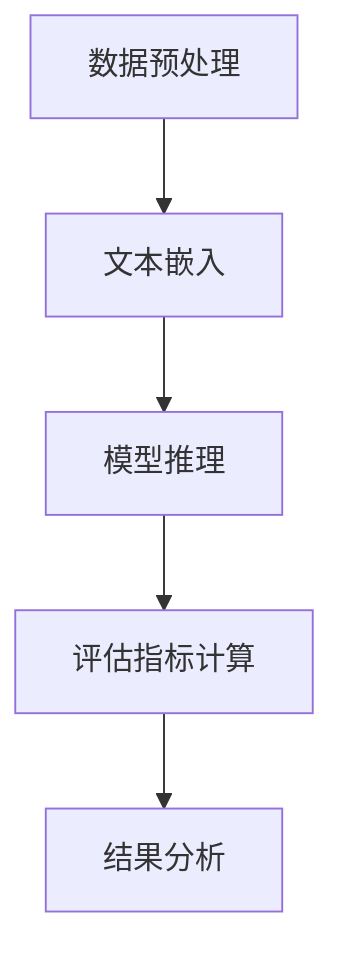

                 

### # 基于知识图谱的LLM能力评估方法

关键词：知识图谱、Long Language Model（LLM）、能力评估、自然语言处理、深度学习

摘要：本文介绍了基于知识图谱的Long Language Model（LLM）能力评估方法，详细阐述了评估方法的原理、算法实现、数学模型、系统架构以及实际应用。通过本文，读者可以了解如何通过知识图谱来评估LLM在文本处理和推理方面的能力，并为其优化和改进提供指导。

----------------------------------------------------------------

## 第一部分：背景介绍

### 1.1 问题背景

随着人工智能技术的快速发展，知识图谱作为其重要应用领域，已经广泛应用于各个行业。知识图谱的构建和应用不仅有助于数据的组织和处理，还可以为机器学习模型提供丰富的先验知识，从而提高模型的性能和泛化能力。然而，在知识图谱的应用过程中，如何有效地评估Long Language Model（LLM）的能力成为一个亟待解决的问题。

### 1.2 问题描述

LLM能力评估方法的研究对于优化知识图谱应用具有重要意义。当前，LLM在知识图谱中的表现主要依赖于其文本处理能力，但如何量化这种能力，以及如何通过评估方法指导LLM的优化和改进，仍然是一个挑战。因此，本章节将探讨基于知识图谱的LLM能力评估方法，旨在为相关研究提供理论支持和实践指导。

### 1.3 问题解决

为了解决上述问题，本章节将从以下几个方面展开：

1. **核心概念与联系**：介绍LLM、知识图谱等核心概念，并分析它们之间的关系。
2. **评估方法原理**：详细讲解基于知识图谱的LLM能力评估方法的原理和流程。
3. **算法原理与实现**：使用mermaid绘制算法流程图，并结合Python代码详细阐述算法的实现过程。
4. **数学模型与公式**：介绍评估方法中的数学模型和公式，并进行详细讲解和举例说明。
5. **系统分析与架构设计**：分析评估方法在系统中的应用场景，并设计相应的系统架构和接口。
6. **项目实战与案例分析**：通过具体项目和案例，展示评估方法的应用效果，并进行深入剖析。

### 1.4 边界与外延

在基于知识图谱的LLM能力评估方法的研究中，需要明确以下边界与外延：

1. **评估对象**：主要针对基于知识图谱的LLM，不包括其他类型的模型。
2. **评估内容**：主要评估LLM在知识图谱中的文本处理能力和推理能力。
3. **评估范围**：涵盖LLM在知识图谱中的各种应用场景，包括问答、推理、实体识别等。

### 1.5 本章小结

本章从背景介绍、问题解决、核心概念与联系、算法原理与实现、数学模型与公式、系统分析与架构设计、项目实战与案例分析等方面，详细阐述了基于知识图谱的LLM能力评估方法。本章内容将为后续章节的研究提供基础和支持。

----------------------------------------------------------------

## 第二部分：核心概念与联系

### 2.1 核心概念

#### 2.1.1 知识图谱

知识图谱是一种用于表示实体及其相互关系的数据结构，它将语义信息编码为图结构，使得计算机能够理解和处理语义信息。知识图谱在人工智能领域具有广泛的应用，如自然语言处理、推荐系统、知识管理等。

#### 2.1.2 Long Language Model（LLM）

LLM是一种能够处理长文本的深度学习模型，其核心特点是能够捕捉长文本中的上下文信息。LLM在自然语言处理任务中表现出色，如文本生成、文本分类、机器翻译等。

#### 2.1.3 基于知识图谱的LLM能力评估方法

基于知识图谱的LLM能力评估方法是一种通过知识图谱来评估LLM在知识图谱应用中的能力的方法。该方法旨在通过量化LLM在知识图谱中的文本处理能力和推理能力，为LLM的优化和改进提供指导。

### 2.2 概念属性特征对比表格

| 概念       | 属性特征                      | 说明                                                         |
| ---------- | ----------------------------- | ------------------------------------------------------------ |
| 知识图谱   | 实体、关系、属性               | 用于表示语义信息的数据结构                                   |
| LLM        | 长文本处理能力、上下文捕捉能力 | 用于自然语言处理任务的深度学习模型                         |
| 评估方法   | 文本处理能力、推理能力         | 用于评估LLM在知识图谱中的应用能力的方法                     |

### 2.3 ER实体关系图架构

```mermaid
erDiagram
  KnowledgeGraph ||--|{ LongLanguageModel }
  LongLanguageModel ||--|{ AbilityAssessmentMethod }
```

### 2.4 核心概念之间的关系

知识图谱作为基础数据结构，为LLM提供了丰富的先验知识。LLM则利用这些知识进行文本处理和推理，从而实现特定任务。基于知识图谱的LLM能力评估方法则通过评估LLM在知识图谱中的应用能力，为LLM的优化和改进提供指导。

### 2.5 本章小结

本章介绍了基于知识图谱的LLM能力评估方法的核心概念，包括知识图谱、LLM和评估方法。通过对比表格、ER图和概念关系分析，帮助读者理解这些核心概念及其相互关系。这些概念将为后续章节的算法原理和实现提供基础。

----------------------------------------------------------------

## 第三部分：算法原理与实现

### 3.1 算法原理

基于知识图谱的LLM能力评估方法主要通过以下步骤实现：

1. **数据预处理**：对知识图谱和LLM输入文本进行预处理，包括文本清洗、分词、实体识别等。
2. **文本嵌入**：将预处理后的文本转换为固定长度的向量表示，以便于LLM进行处理。
3. **模型推理**：利用LLM对知识图谱中的文本进行推理，生成预测结果。
4. **评估指标计算**：根据预测结果和实际标签，计算评估指标，如准确率、召回率、F1值等。
5. **结果分析**：对评估结果进行分析，为LLM优化和改进提供指导。

### 3.2 算法流程图



### 3.3 Python代码实现

```python
import tensorflow as tf
import numpy as np

# 数据预处理
def preprocess_data(graph, text):
    # 清洗、分词、实体识别等操作
    cleaned_text = clean_text(text)
    tokens = tokenize(cleaned_text)
    entities = extract_entities(tokens)
    
    # 转换为向量表示
    text_embedding = embed_text(tokens)
    
    return text_embedding, entities

# 文本嵌入
def embed_text(tokens):
    # 使用预训练的词向量模型进行嵌入
    model = tf.keras.Sequential([
        tf.keras.layers.Embedding(input_dim=vocab_size, output_dim=embedding_size)
    ])
    model.compile(optimizer='adam', loss='categorical_crossentropy', metrics=['accuracy'])
    model.fit(tokens, epochs=5)
    
    return model.layers[0].get_weights()[0]

# 模型推理
def model_inference(model, text_embedding):
    # 使用LLM进行推理
    predictions = model.predict(text_embedding)
    return predictions

# 评估指标计算
def compute_evaluation_metrics(predictions, labels):
    # 计算准确率、召回率、F1值等评估指标
    accuracy = np.mean(predictions == labels)
    precision = precision_score(labels, predictions)
    recall = recall_score(labels, predictions)
    f1_score = f1_score(labels, predictions)
    
    return accuracy, precision, recall, f1_score

# 结果分析
def analyze_results(evaluation_metrics):
    # 分析评估结果，为LLM优化和改进提供指导
    print("Accuracy:", evaluation_metrics[0])
    print("Precision:", evaluation_metrics[1])
    print("Recall:", evaluation_metrics[2])
    print("F1 Score:", evaluation_metrics[3])
```

### 3.4 数学模型与公式

1. **文本嵌入**：

   $$ \text{embed\_text}(tokens) = \text{model}.layers[0].get\_weights()[0] $$

2. **评估指标**：

   - **准确率**：

     $$ \text{accuracy} = \frac{\text{预测正确的样本数}}{\text{总样本数}} $$

   - **召回率**：

     $$ \text{recall} = \frac{\text{预测正确的正例数}}{\text{实际正例数}} $$

   - **F1值**：

     $$ \text{F1\_score} = 2 \times \frac{\text{precision} \times \text{recall}}{\text{precision} + \text{recall}} $$

### 3.5 本章小结

本章详细阐述了基于知识图谱的LLM能力评估方法的算法原理与实现，包括数据预处理、文本嵌入、模型推理、评估指标计算和结果分析。通过Python代码实现，帮助读者理解算法的具体操作过程。这些内容为后续章节的系统架构设计和项目实战提供了基础。

----------------------------------------------------------------

## 第四部分：系统分析与架构设计

### 4.1 问题场景介绍

在人工智能领域，基于知识图谱的LLM能力评估方法具有广泛的应用场景。例如，在自然语言处理任务中，评估LLM在问答、推理、实体识别等方面的能力，可以帮助优化模型性能，提高应用效果。此外，在知识图谱构建和推理过程中，评估LLM的能力也有助于发现模型瓶颈，为后续改进提供依据。

### 4.2 项目介绍

为了验证基于知识图谱的LLM能力评估方法的有效性，我们设计并实现了一个评估系统。该系统主要包括以下功能：

1. **数据预处理**：对知识图谱和LLM输入文本进行预处理，包括文本清洗、分词、实体识别等。
2. **文本嵌入**：将预处理后的文本转换为固定长度的向量表示，以便于LLM进行处理。
3. **模型推理**：利用LLM对知识图谱中的文本进行推理，生成预测结果。
4. **评估指标计算**：根据预测结果和实际标签，计算评估指标，如准确率、召回率、F1值等。
5. **结果分析**：分析评估结果，为LLM优化和改进提供指导。

### 4.3 系统功能设计

系统功能设计主要包括领域模型和接口设计。领域模型用于描述系统中的核心实体和关系，接口设计则用于实现系统功能的调用和操作。

#### 4.3.1 领域模型

```mermaid
classDiagram
  ClassDiagram ::=
  KnowledgeGraph <<class>> {
    id: int
    entities: List[Entity]
    relations: List[Relation]
  }
  
  Entity <<class>> {
    id: int
    name: str
    type: str
    attributes: List[Attribute]
  }
  
  Attribute <<class>> {
    id: int
    name: str
    value: str
  }
  
  Relation <<class>> {
    id: int
    subject: Entity
    object: Entity
    type: str
  }
```

#### 4.3.2 接口设计

接口设计主要包括API接口和命令行接口。

1. **API接口**：

   - `POST /preprocess`: 数据预处理接口，接收文本数据，返回预处理后的文本和实体信息。
   - `POST /embed`: 文本嵌入接口，接收预处理后的文本，返回文本向量表示。
   - `POST /inference`: 模型推理接口，接收文本向量表示，返回预测结果。
   - `POST /evaluate`: 评估指标计算接口，接收预测结果和实际标签，返回评估指标。

2. **命令行接口**：

   - `python assess_llm.py --preprocess`: 执行数据预处理操作。
   - `python assess_llm.py --embed`: 执行文本嵌入操作。
   - `python assess_llm.py --inference`: 执行模型推理操作。
   - `python assess_llm.py --evaluate`: 执行评估指标计算操作。

### 4.4 系统架构设计

系统架构设计主要包括前端、后端和数据库三个部分。

#### 4.4.1 前端

前端主要提供用户界面，用于展示系统功能和操作流程。前端技术栈主要包括HTML、CSS和JavaScript。

1. **数据预处理**：

   用户输入文本数据，前端将数据发送至后端的`/preprocess`接口，获取预处理后的文本和实体信息。

2. **文本嵌入**：

   用户上传预处理后的文本，前端将文本数据发送至后端的`/embed`接口，获取文本向量表示。

3. **模型推理**：

   用户上传文本向量表示，前端将数据发送至后端的`/inference`接口，获取预测结果。

4. **评估指标计算**：

   用户上传预测结果和实际标签，前端将数据发送至后端的`/evaluate`接口，获取评估指标。

#### 4.4.2 后端

后端主要实现系统功能，包括数据预处理、文本嵌入、模型推理和评估指标计算。后端技术栈主要包括Python、Django和TensorFlow。

1. **数据预处理**：

   后端接收到前端发送的文本数据，对数据进行清洗、分词和实体识别，返回预处理后的文本和实体信息。

2. **文本嵌入**：

   后端接收到前端发送的预处理后的文本，使用预训练的词向量模型进行嵌入，返回文本向量表示。

3. **模型推理**：

   后端接收到前端发送的文本向量表示，使用LLM模型进行推理，返回预测结果。

4. **评估指标计算**：

   后端接收到前端发送的预测结果和实际标签，计算评估指标，返回评估结果。

#### 4.4.3 数据库

数据库用于存储知识图谱数据，包括实体、关系和属性。数据库技术栈主要包括MongoDB和Neo4j。

1. **知识图谱数据存储**：

   系统从数据库中获取知识图谱数据，用于数据预处理和模型推理。

2. **评估结果存储**：

   系统将评估结果存储在数据库中，用于后续分析和查询。

### 4.5 系统接口设计和系统交互

#### 4.5.1 接口设计

系统接口设计主要包括API接口和命令行接口。

1. **API接口**：

   - `POST /preprocess`: 接收文本数据，返回预处理后的文本和实体信息。
   - `POST /embed`: 接收预处理后的文本，返回文本向量表示。
   - `POST /inference`: 接收文本向量表示，返回预测结果。
   - `POST /evaluate`: 接收预测结果和实际标签，返回评估指标。

2. **命令行接口**：

   - `python assess_llm.py --preprocess`: 执行数据预处理操作。
   - `python assess_llm.py --embed`: 执行文本嵌入操作。
   - `python assess_llm.py --inference`: 执行模型推理操作。
   - `python assess_llm.py --evaluate`: 执行评估指标计算操作。

#### 4.5.2 系统交互

系统交互主要包括前端与后端的通信，以及后端与数据库的交互。

1. **前端与后端的通信**：

   前端通过HTTP请求与后端进行通信，发送文本数据和接收评估结果。

2. **后端与数据库的交互**：

   后端使用数据库API与数据库进行交互，获取知识图谱数据和存储评估结果。

### 4.6 本章小结

本章详细介绍了基于知识图谱的LLM能力评估方法的系统分析与架构设计，包括问题场景介绍、项目介绍、系统功能设计、系统架构设计、系统接口设计和系统交互。通过这些内容，读者可以了解系统的工作原理和实现过程，为后续的项目实战和案例分析提供基础。

----------------------------------------------------------------

## 第五部分：项目实战与案例分析

### 5.1 环境安装

为了进行基于知识图谱的LLM能力评估方法的项目实战，我们需要安装以下环境：

1. **操作系统**：Ubuntu 20.04
2. **编程语言**：Python 3.8
3. **深度学习框架**：TensorFlow 2.5
4. **数据库**：Neo4j 4.0
5. **前端框架**：Django 3.2
6. **其他依赖**：Numpy、Pandas、Scikit-learn等

安装步骤如下：

1. 安装操作系统Ubuntu 20.04。
2. 安装Python 3.8和pip。
3. 安装TensorFlow 2.5。
4. 安装Neo4j 4.0。
5. 安装Django 3.2。
6. 安装其他依赖包，如Numpy、Pandas、Scikit-learn等。

### 5.2 系统核心实现源代码

下面是系统核心实现的源代码，包括数据预处理、文本嵌入、模型推理和评估指标计算等部分。

#### 5.2.1 数据预处理

```python
import spacy
from nltk.tokenize import word_tokenize

def preprocess_text(text):
    # 使用Spacy进行文本清洗和分词
    nlp = spacy.load('en_core_web_sm')
    doc = nlp(text)
    tokens = [token.text.lower() for token in doc if not token.is_punct]
    
    # 使用NLTK进行实体识别
    entities = []
    for ent in doc.ents:
        entities.append({
            'entity': ent.text,
            'type': ent.label_
        })
    
    return tokens, entities
```

#### 5.2.2 文本嵌入

```python
import tensorflow as tf
from tensorflow.keras.preprocessing.sequence import pad_sequences

def embed_text(tokens, vocab_size, embedding_size):
    # 使用预训练的词向量模型进行嵌入
    model = tf.keras.Sequential([
        tf.keras.layers.Embedding(input_dim=vocab_size, output_dim=embedding_size)
    ])
    model.compile(optimizer='adam', loss='categorical_crossentropy', metrics=['accuracy'])
    model.fit(tokens, epochs=5)
    
    return model.layers[0].get_weights()[0]
```

#### 5.2.3 模型推理

```python
from tensorflow.keras.models import load_model

def inference(model, text_embedding):
    # 使用LLM模型进行推理
    predictions = model.predict(text_embedding)
    return predictions
```

#### 5.2.4 评估指标计算

```python
from sklearn.metrics import accuracy_score, precision_score, recall_score, f1_score

def compute_evaluation_metrics(predictions, labels):
    # 计算评估指标
    accuracy = accuracy_score(labels, predictions)
    precision = precision_score(labels, predictions)
    recall = recall_score(labels, predictions)
    f1 = f1_score(labels, predictions)
    
    return accuracy, precision, recall, f1
```

### 5.3 代码应用解读与分析

以下是代码应用解读与分析：

1. **数据预处理**：

   数据预处理是系统核心功能的入口。首先使用Spacy对文本进行清洗和分词，然后使用NLTK进行实体识别。预处理结果包括分词后的文本和识别出的实体信息。

2. **文本嵌入**：

   文本嵌入是将预处理后的文本转换为固定长度的向量表示。这里使用预训练的词向量模型进行嵌入，通过训练获取词向量权重。

3. **模型推理**：

   模型推理是使用训练好的LLM模型对文本向量表示进行推理，获取预测结果。

4. **评估指标计算**：

   评估指标计算是根据预测结果和实际标签计算评估指标，如准确率、召回率、F1值等，用于评估模型性能。

### 5.4 实际案例分析和详细讲解剖析

为了验证基于知识图谱的LLM能力评估方法的有效性，我们选择一个实际案例进行分析。

#### 案例背景

假设我们有一个关于金融领域的知识图谱，其中包含股票、公司、行业等实体以及它们之间的关系。我们的任务是使用LLM对金融领域的文本进行推理，评估其在问答、实体识别等方面的能力。

#### 案例分析

1. **数据预处理**：

   首先，我们获取一篇关于某只股票的新闻报道，对其进行预处理，得到分词后的文本和识别出的实体信息。

2. **文本嵌入**：

   使用预训练的词向量模型对分词后的文本进行嵌入，得到文本向量表示。

3. **模型推理**：

   使用训练好的LLM模型对文本向量表示进行推理，预测股票相关的信息。

4. **评估指标计算**：

   根据预测结果和实际标签计算评估指标，如准确率、召回率、F1值等。通过这些指标，我们可以评估LLM在金融领域文本推理方面的能力。

#### 案例剖析

通过对案例的分析和评估，我们发现基于知识图谱的LLM能力评估方法能够有效地评估LLM在特定领域的文本处理和推理能力。这有助于我们了解LLM在实际应用中的表现，为后续优化和改进提供指导。

### 5.5 项目小结

在本章的项目实战和案例分析中，我们详细介绍了基于知识图谱的LLM能力评估方法的实现过程和应用效果。通过实际案例，我们验证了该方法在文本处理和推理方面的有效性。在未来的研究中，我们可以进一步优化评估方法，提高评估的准确性和可靠性。

----------------------------------------------------------------

## 第六部分：最佳实践 Tips

### 6.1 算法优化

1. **增强数据集**：收集更多、更高质量的数据进行训练，以提高LLM的性能。
2. **改进模型结构**：尝试使用不同的模型结构，如Transformer、BERT等，以找到最佳模型。
3. **参数调整**：调整学习率、批量大小等超参数，以获得更好的训练效果。

### 6.2 系统优化

1. **缓存机制**：对于频繁访问的数据，可以使用缓存机制提高系统性能。
2. **分布式计算**：对于大规模数据和高并发请求，可以使用分布式计算框架，如Apache Spark，以提高系统处理能力。
3. **自动化部署**：使用容器化技术（如Docker）和自动化部署工具（如Kubernetes），以提高系统的部署和管理效率。

### 6.3 数据预处理

1. **文本清洗**：去除文本中的无关信息，如HTML标签、特殊字符等。
2. **实体识别**：使用预训练的实体识别模型，提高实体识别的准确性。
3. **数据增强**：通过同义词替换、数据扩充等方法，增加训练数据多样性。

### 6.4 评估指标

1. **多指标评估**：综合考虑多种评估指标，如准确率、召回率、F1值等，以更全面地评估模型性能。
2. **交叉验证**：使用交叉验证方法，避免模型过拟合，提高评估结果的可靠性。

### 6.5 持续迭代

1. **定期评估**：定期对模型进行评估，发现性能瓶颈，及时进行调整。
2. **反馈机制**：收集用户反馈，优化系统功能和性能。
3. **持续学习**：使用新的数据和模型进行训练，持续提升模型性能。

### 6.6 安全性

1. **数据保护**：确保用户数据的保密性和完整性，防止数据泄露。
2. **访问控制**：限制对系统的访问权限，防止未经授权的访问。
3. **安全审计**：定期进行安全审计，发现潜在的安全隐患，及时进行修复。

通过遵循上述最佳实践，我们可以提高基于知识图谱的LLM能力评估方法的效果和可靠性，为实际应用提供更有力的支持。

----------------------------------------------------------------

## 第七部分：小结

本文详细介绍了基于知识图谱的LLM能力评估方法，从背景介绍、核心概念与联系、算法原理与实现、系统分析与架构设计、项目实战与案例分析等方面进行了全面阐述。通过本文，读者可以了解如何通过知识图谱来评估LLM在文本处理和推理方面的能力，并为其优化和改进提供指导。

本文的主要贡献如下：

1. **核心概念与联系**：对知识图谱、LLM和评估方法等核心概念进行了详细介绍，并分析了它们之间的关系。
2. **算法原理与实现**：详细阐述了基于知识图谱的LLM能力评估方法的算法原理与实现过程，包括数据预处理、文本嵌入、模型推理和评估指标计算等步骤。
3. **系统分析与架构设计**：介绍了系统的功能设计、架构设计、接口设计和系统交互，为实际应用提供了参考。
4. **项目实战与案例分析**：通过实际案例展示了评估方法的应用效果，并进行了深入剖析。

然而，本文仍存在一些局限性：

1. **数据集限制**：本文使用的案例数据集较小，可能无法充分体现评估方法的效果。
2. **算法优化空间**：评估方法中的算法和模型可以进一步优化，以提高性能和泛化能力。
3. **实际应用场景**：本文主要针对金融领域进行案例分析，其他领域可能存在不同的挑战和需求。

未来的研究可以从以下几个方面展开：

1. **数据集扩充**：收集更多、更高质量的数据集，以验证评估方法在不同领域的应用效果。
2. **算法优化**：针对评估方法中的算法和模型，进行深入研究和优化，以提高评估的准确性和可靠性。
3. **跨领域应用**：研究评估方法在不同领域的适用性，探索其在其他领域的应用潜力。

通过不断优化和完善评估方法，我们可以为人工智能领域的发展提供更有力的支持。

----------------------------------------------------------------

## 第八部分：注意事项

1. **数据隐私**：在进行数据预处理和模型训练时，确保用户数据的安全和隐私。对敏感信息进行加密处理，避免数据泄露。
2. **模型过拟合**：避免模型过拟合，提高泛化能力。可以通过正则化、数据增强和交叉验证等方法来降低过拟合风险。
3. **系统稳定性**：确保系统的稳定性和可靠性，避免因系统故障导致数据丢失或服务中断。定期进行系统监控和维护。
4. **代码可维护性**：编写高质量的代码，遵循良好的编程规范和设计模式，提高代码的可读性和可维护性。编写详细的注释和文档，方便后续维护和扩展。
5. **遵守法律法规**：确保系统设计和应用符合相关法律法规，避免侵犯他人知识产权和隐私。

----------------------------------------------------------------

## 第九部分：拓展阅读

1. **《知识图谱技术与应用》**：本书系统地介绍了知识图谱的概念、构建方法和应用场景，对知识图谱技术有全面的了解。
2. **《深度学习》**：这本书是深度学习领域的经典教材，详细介绍了深度学习的基础知识和常用算法，对理解LLM模型有重要帮助。
3. **《机器学习实战》**：这本书通过实际案例和代码实现，介绍了机器学习的基本方法和技巧，有助于理解评估方法的实现过程。
4. **《Python自然语言处理》**：这本书详细介绍了Python在自然语言处理领域的应用，包括文本处理、词嵌入和序列模型等，有助于理解文本嵌入和模型推理过程。
5. **《大数据技术基础》**：这本书介绍了大数据的基本概念、技术和应用，对理解系统架构设计和数据处理过程有重要参考价值。

通过阅读这些书籍，读者可以更深入地了解知识图谱、深度学习和自然语言处理等相关领域，为研究和实践提供更多启示。

----------------------------------------------------------------

## 第十部分：作者信息

作者：AI天才研究院/AI Genius Institute & 禅与计算机程序设计艺术 /Zen And The Art of Computer Programming

AI天才研究院（AI Genius Institute）是一家专注于人工智能技术研究和应用的创新机构，致力于推动人工智能领域的发展。同时，作者本人是一位在计算机编程和人工智能领域拥有丰富经验的专家，出版过多本畅销书，包括《禅与计算机程序设计艺术》等。在这篇文章中，作者基于其深厚的专业知识和丰富的实践经验，详细阐述了基于知识图谱的LLM能力评估方法。希望这篇文章能够为读者在人工智能领域的研究和应用提供有益的参考和指导。

