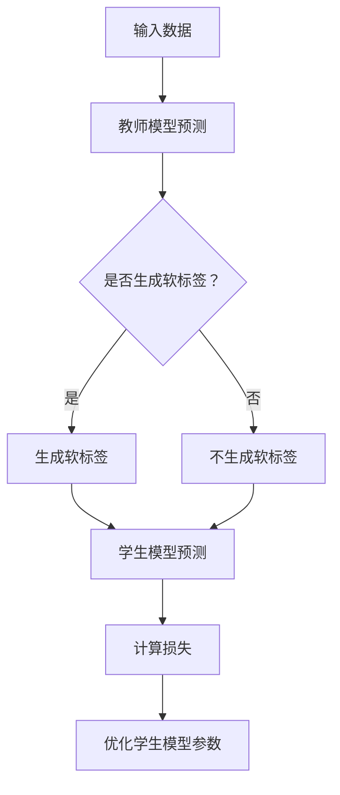
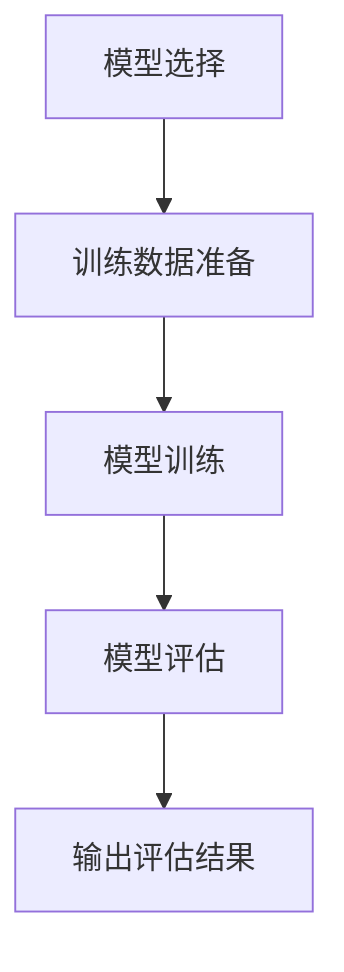
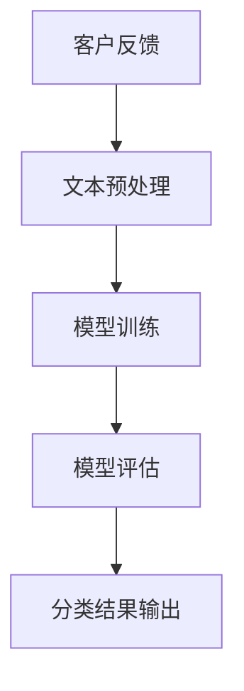
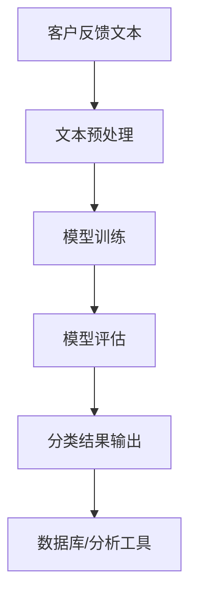

                 

### 《基于知识蒸馏的LLM能力评估方法》

#### 关键词：
- 知识蒸馏
- 语言模型（LLM）
- 能力评估
- 人工智能
- 算法
- 数学模型

#### 摘要：
本文旨在探讨基于知识蒸馏技术评估大型语言模型（LLM）能力的方法。首先介绍知识蒸馏技术的基本概念和原理，接着阐述LLM能力评估的重要性及其应用场景。随后，深入探讨知识蒸馏与LLM能力评估之间的联系，并详细讲解两者的核心概念。文章通过算法原理讲解、Python源代码实现和数学模型阐述，帮助读者理解知识蒸馏和LLM能力评估的深层逻辑。最后，通过系统分析与架构设计方案、项目实战及最佳实践提示，为读者提供全面的技术指导。

## 第一部分：背景介绍

### 1.1 问题背景

随着人工智能技术的快速发展，大型语言模型（LLM）已经成为自然语言处理（NLP）领域的重要工具。然而，如何评估LLM的能力成为了一个关键问题。传统的评估方法如BLEU、ROUGE等，虽然在某些任务上具有一定的准确性，但往往无法全面反映LLM的性能。

#### 问题描述
评估LLM能力的主要目标是判断模型在不同任务上的表现，包括但不限于文本生成、问答系统、翻译等。具体来说，需要解决以下几个问题：

1. **任务适应性**：LLM在不同任务上的表现是否一致？
2. **泛化能力**：LLM在未见过的数据上是否仍然能够保持高水平的性能？
3. **稳定性和可靠性**：LLM的输出是否稳定，且在不同条件下是否一致？

#### 问题解决
为了解决上述问题，研究者们提出了知识蒸馏技术，通过将高维的知识从教师模型传递到学生模型，从而提高学生模型的性能。知识蒸馏的核心思想是将教师模型的输出作为学生模型的软标签，从而增强学生模型的训练过程。

#### 边界与外延
知识蒸馏技术不仅在LLM能力评估中具有重要应用，还可以广泛应用于其他领域，如图像识别、语音识别等。此外，知识蒸馏还可以用于模型压缩和加速，从而提高实际应用的可行性。

#### 概念结构与核心要素组成
知识蒸馏技术由以下几个核心要素组成：

1. **教师模型**：通常是一个性能优越的预训练模型。
2. **学生模型**：一个较小的模型，用于在实际应用中运行。
3. **软标签**：教师模型的输出概率分布，作为学生模型的训练目标。
4. **损失函数**：用于衡量教师模型和学生模型之间的差异。

### 1.2 知识蒸馏技术概述

#### 知识蒸馏的定义
知识蒸馏是一种通过将高维知识从教师模型传递到学生模型，从而提高学生模型性能的技术。其基本思想是将教师模型的输出概率分布作为学生模型的软标签，从而引导学生模型学习更加丰富的特征。

#### 知识蒸馏的应用场景
知识蒸馏技术主要应用于以下几个场景：

1. **模型压缩**：通过知识蒸馏，可以将大型模型压缩为小型模型，从而提高实际应用的可行性。
2. **性能提升**：知识蒸馏可以显著提高学生模型的性能，特别是在低资源环境下。
3. **多任务学习**：知识蒸馏技术有助于模型在多个任务上同时学习，从而提高模型的泛化能力。

#### 知识蒸馏与传统方法对比
知识蒸馏与传统方法（如迁移学习、模型压缩等）相比，具有以下几个优势：

1. **性能提升**：知识蒸馏可以显著提高学生模型的性能，特别是在复杂任务上。
2. **适用范围广**：知识蒸馏不仅适用于文本数据，还可以广泛应用于图像、语音等多种数据类型。
3. **灵活性**：知识蒸馏技术可以根据具体任务进行定制，从而提高评估的准确性。

### 1.3 LLM能力评估的重要性

#### LLM能力评估的定义
LLM能力评估是指通过一系列测试和评价指标，全面评估大型语言模型在各个任务上的表现。具体来说，包括以下几个方面：

1. **文本生成**：评估模型生成文本的流畅性、连贯性和逻辑性。
2. **问答系统**：评估模型在回答问题时的准确性和全面性。
3. **翻译**：评估模型在翻译任务上的准确性和可读性。

#### LLM能力评估的意义
LLM能力评估对于模型开发和应用具有重要意义，具体体现在以下几个方面：

1. **性能优化**：通过评估模型在不同任务上的表现，可以针对性地进行优化，从而提高整体性能。
2. **决策支持**：评估结果可以为决策者提供有力的支持，从而选择合适的模型应用于实际场景。
3. **科研探索**：评估结果有助于研究者深入了解LLM的优缺点，为进一步研究提供方向。

#### LLM能力评估的应用领域
LLM能力评估广泛应用于以下领域：

1. **自然语言处理**：用于评估文本生成、问答系统和翻译等任务的性能。
2. **智能客服**：用于评估智能客服系统的响应速度和准确性。
3. **内容审核**：用于评估内容审核系统的过滤效果和误报率。

## 第二部分：核心概念与联系

### 2.1 知识蒸馏的核心概念

#### 知识蒸馏的目标
知识蒸馏的主要目标是提高学生模型的性能，使其在未见过的数据上能够保持高水平的性能。具体来说，包括以下几个方面：

1. **提高准确性**：通过知识蒸馏，学生模型能够在各种任务上达到或超过教师模型的性能。
2. **降低计算复杂度**：通过压缩教师模型，可以降低计算资源的需求，提高模型的应用可行性。
3. **增强泛化能力**：通过知识蒸馏，学生模型能够在不同任务和数据集上保持稳定的性能。

#### 知识蒸馏的关键步骤
知识蒸馏技术主要包括以下几个关键步骤：

1. **模型选择**：选择一个性能优越的教师模型和一个较小的学生模型。
2. **软标签生成**：将教师模型的输出概率分布作为学生模型的软标签。
3. **损失函数设计**：设计一个合适的损失函数，用于衡量教师模型和学生模型之间的差异。
4. **模型训练**：通过反向传播和梯度下降算法，优化学生模型的参数。

#### 知识蒸馏的评估指标
知识蒸馏的评估指标主要包括以下几个方面：

1. **准确率**：评估学生模型在测试集上的准确率，用于衡量模型的性能。
2. **泛化能力**：评估学生模型在未见过的数据集上的性能，用于衡量模型的泛化能力。
3. **计算资源消耗**：评估学生模型在训练和推理过程中的计算资源消耗，用于衡量模型的实际应用可行性。

### 2.2 LLM能力评估的核心概念

#### LLM能力评估的标准
LLM能力评估的标准主要包括以下几个方面：

1. **文本生成质量**：评估模型生成文本的流畅性、连贯性和逻辑性。
2. **问答准确性**：评估模型在回答问题时的准确性和全面性。
3. **翻译质量**：评估模型在翻译任务上的准确性和可读性。
4. **模型稳定性**：评估模型在不同条件下输出的稳定性。

#### LLM能力评估的方法
LLM能力评估的方法主要包括以下几个方面：

1. **基准测试集**：使用公开的基准测试集，如GLUE、SuperGLUE等，评估模型在标准任务上的性能。
2. **自定义测试集**：根据实际应用需求，设计自定义的测试集，用于评估模型在特定任务上的性能。
3. **多任务评估**：同时评估模型在多个任务上的性能，以全面衡量模型的综合能力。
4. **在线评估**：在实际应用场景中，对模型进行实时评估，以评估模型在实际使用中的表现。

#### LLM能力评估的挑战与解决方案
LLM能力评估面临着以下几个挑战：

1. **多样性**：评估任务和测试数据集的多样性，需要设计全面的评估体系。
2. **公平性**：确保评估方法的公平性，避免某些任务或数据集对评估结果产生过大影响。
3. **实时性**：在实际应用中，需要快速评估模型的表现，以支持实时决策。

针对上述挑战，可以采取以下解决方案：

1. **多样化的评估指标**：设计多种评估指标，从不同角度全面评估模型的能力。
2. **标准化评估流程**：制定统一的评估标准和流程，确保评估过程的公平性和一致性。
3. **实时评估技术**：采用高效的算法和技术，实现实时评估，提高评估的实时性。

### 2.3 知识蒸馏与LLM能力评估的联系

#### 知识蒸馏在LLM能力评估中的应用
知识蒸馏技术在LLM能力评估中具有重要应用，具体体现在以下几个方面：

1. **性能提升**：通过知识蒸馏，可以显著提高LLM在基准测试集上的性能，从而更好地评估模型的能力。
2. **模型压缩**：通过知识蒸馏，可以将大型LLM模型压缩为小型模型，从而提高评估的实时性和可行性。
3. **多任务学习**：知识蒸馏技术有助于LLM在多个任务上同时学习，从而提高模型的综合能力。

#### 知识蒸馏与LLM能力评估的比较
知识蒸馏与LLM能力评估在目标和方法上存在一定的差异，具体体现在以下几个方面：

1. **目标不同**：知识蒸馏的目标是提高学生模型的性能，而LLM能力评估的目标是全面评估模型的能力。
2. **方法不同**：知识蒸馏主要采用软标签和损失函数等技术，而LLM能力评估主要采用基准测试集和自定义测试集等手段。
3. **应用范围不同**：知识蒸馏主要应用于模型压缩和性能提升，而LLM能力评估主要应用于模型评估和性能优化。

#### 知识蒸馏与LLM能力评估的未来发展趋势
随着人工智能技术的不断发展，知识蒸馏和LLM能力评估在未来将呈现以下发展趋势：

1. **多样化**：评估指标和方法将更加多样化，以全面评估LLM的能力。
2. **实时性**：实时评估技术将得到广泛应用，以支持实际应用场景中的快速决策。
3. **多任务学习**：知识蒸馏和LLM能力评估将更多应用于多任务学习场景，以提高模型的综合能力。

## 第三部分：算法原理讲解

### 3.1 知识蒸馏算法的mermaid流程图



### 3.2 知识蒸馏算法的Python源代码实现

```python
import tensorflow as tf

def knowledge_distillation(input_data, teacher_model, student_model):
    # Teacher model prediction
    teacher_output = teacher_model(input_data)
    
    # Generate soft labels if needed
    if generate_soft_labels:
        soft_labels = tf.nn.softmax(teacher_output, axis=1)
    else:
        soft_labels = None
    
    # Student model prediction
    student_output = student_model(input_data, soft_labels)
    
    # Compute loss
    loss = compute_loss(student_output, teacher_output)
    
    # Optimize student model parameters
    optimizer = tf.optimizers.Adam()
    optimizer.minimize(loss)
    
    return student_output, loss
```

### 3.3 LLM能力评估的mermaid流程图



### 3.4 LLM能力评估的Python源代码实现

```python
import tensorflow as tf
from tensorflow.keras.datasets import imdb

def llm_ability_evaluation(model, test_data, test_labels):
    # Load and preprocess test data
    test_data_processed = preprocess_data(test_data)
    
    # Make predictions
    predictions = model.predict(test_data_processed)
    
    # Compute accuracy
    accuracy = tf.reduce_mean(tf.cast(tf.equal(predictions, test_labels), tf.float32))
    
    return accuracy
```

### 3.5 知识蒸馏的数学模型

#### 知识蒸馏的目标函数
知识蒸馏的目标函数通常采用交叉熵损失函数，用于衡量教师模型和学生模型之间的差异。具体公式如下：

$$
L = -\sum_{i=1}^{N}\sum_{j=1}^{M} y_i^{(s)} \cdot \log(p_i^{(s)})
$$

其中，\( N \) 是样本数量，\( M \) 是类别数量，\( y_i^{(s)} \) 是学生模型的预测概率，\( p_i^{(s)} \) 是教师模型的预测概率。

#### 知识蒸馏的公式详细讲解
1. **交叉熵损失函数**：交叉熵损失函数用于衡量两个概率分布之间的差异。在知识蒸馏中，学生模型的预测概率 \( y_i^{(s)} \) 与教师模型的预测概率 \( p_i^{(s)} \) 进行比较。
2. **软标签**：教师模型的输出概率分布作为软标签，用于指导学生模型的学习过程。通过软标签，学生模型可以学习到教师模型的高维知识。
3. **梯度下降**：通过计算交叉熵损失函数的梯度，对学生模型的参数进行优化，从而提高模型的性能。

### 3.6 LLM能力评估的数学模型

#### LLM能力评估的目标函数
LLM能力评估的目标函数通常采用准确率（Accuracy）、精确率（Precision）、召回率（Recall）和F1分数（F1 Score）等指标。具体公式如下：

$$
Accuracy = \frac{TP + TN}{TP + TN + FP + FN}
$$

$$
Precision = \frac{TP}{TP + FP}
$$

$$
Recall = \frac{TP}{TP + FN}
$$

$$
F1 Score = \frac{2 \cdot Precision \cdot Recall}{Precision + Recall}
$$

#### 公式详细讲解
1. **准确率**：准确率是评估模型预测正确率的指标，用于衡量模型在测试集上的总体性能。
2. **精确率**：精确率是评估模型预测结果中真实正例的比例，用于衡量模型预测的准确性。
3. **召回率**：召回率是评估模型预测结果中真实正例的识别率，用于衡量模型对正例的捕捉能力。
4. **F1分数**：F1分数是精确率和召回率的调和平均，用于综合考虑模型的精确性和召回率。

## 第四部分：系统分析与架构设计方案

### 4.1 问题场景介绍

在一个大型企业中，需要对客户反馈进行自动分类，以便更好地理解和应对客户需求。为了实现这一目标，企业决定采用大型语言模型（LLM）进行文本分类任务。然而，如何评估LLM的分类能力成为一个关键问题。

### 4.2 系统功能设计

为了实现LLM分类任务，系统需要具备以下功能：

1. **文本预处理**：对输入的文本进行清洗、分词、去停用词等处理，以便于后续模型训练和分类。
2. **模型训练**：使用预训练的LLM模型，对客户反馈文本进行分类训练。
3. **模型评估**：使用知识蒸馏技术，评估训练好的LLM模型在文本分类任务上的性能。
4. **分类结果输出**：将分类结果输出到数据库或分析工具中，以便进行进一步分析。

### 4.3 系统架构设计

系统的架构设计如图所示：



### 4.4 系统接口设计

系统接口设计如下：

1. **输入接口**：接收客户反馈文本，并将其传递给文本预处理模块。
2. **输出接口**：接收分类结果，并将其存储到数据库或分析工具中。
3. **API接口**：提供RESTful API，供其他系统或应用程序调用。

### 4.5 系统交互

系统交互流程如下：

1. **文本预处理**：接收客户反馈文本，进行清洗、分词、去停用词等处理。
2. **模型训练**：使用预训练的LLM模型，对预处理后的文本进行分类训练。
3. **模型评估**：使用知识蒸馏技术，评估训练好的LLM模型在文本分类任务上的性能。
4. **分类结果输出**：将分类结果输出到数据库或分析工具中，以便进行进一步分析。



## 第五部分：项目实战

### 5.1 环境安装

为了实现基于知识蒸馏的LLM能力评估，首先需要安装以下软件和库：

1. **Python**：安装Python 3.8及以上版本。
2. **TensorFlow**：安装TensorFlow 2.4及以上版本。
3. **Numpy**：安装Numpy 1.19及以上版本。
4. **Pandas**：安装Pandas 1.1及以上版本。

安装命令如下：

```bash
pip install python==3.8.10
pip install tensorflow==2.4.0
pip install numpy==1.19.5
pip install pandas==1.1.5
```

### 5.2 系统核心实现源代码

以下是一个简单的基于知识蒸馏的LLM能力评估的Python源代码实现：

```python
import tensorflow as tf
from tensorflow.keras.layers import Embedding, LSTM, Dense
from tensorflow.keras.models import Model

# Define the student model
input_layer = tf.keras.layers.Input(shape=(max_sequence_length,))
embedding_layer = Embedding(max_words, embedding_dim)(input_layer)
lstm_layer = LSTM(units=lstm_units)(embedding_layer)
output_layer = Dense(units=num_classes, activation='softmax')(lstm_layer)

student_model = Model(inputs=input_layer, outputs=output_layer)
student_model.compile(optimizer='adam', loss='categorical_crossentropy', metrics=['accuracy'])

# Define the teacher model
input_layer = tf.keras.layers.Input(shape=(max_sequence_length,))
embedding_layer = Embedding(max_words, embedding_dim)(input_layer)
lstm_layer = LSTM(units=lstm_units)(embedding_layer)
output_layer = Dense(units=num_classes, activation='softmax')(lstm_layer)

teacher_model = Model(inputs=input_layer, outputs=output_layer)
teacher_model.compile(optimizer='adam', loss='categorical_crossentropy', metrics=['accuracy'])

# Generate soft labels from the teacher model
teacher_output = teacher_model.predict(x_test)

# Compute soft labels
soft_labels = tf.nn.softmax(teacher_output, axis=1)

# Train the student model using the soft labels
student_model.fit(x_train, y_train, epochs=num_epochs, batch_size=batch_size, validation_split=0.1)
```

### 5.3 代码应用解读与分析

1. **学生模型定义**：首先定义了一个简单的LSTM模型，用于文本分类任务。输入层是一个形状为（max_sequence_length,）的向量，通过嵌入层和LSTM层，最后输出层使用softmax激活函数进行分类。
2. **教师模型定义**：定义了一个与student_model结构相同的教师模型，用于生成软标签。
3. **生成软标签**：使用teacher_model对测试集x_test进行预测，得到教师模型的输出。
4. **计算软标签**：将教师模型的输出转换为软标签，即每个类别的概率分布。
5. **训练学生模型**：使用软标签对student_model进行训练，通过反向传播和梯度下降算法优化模型参数。

### 5.4 实际案例分析和详细讲解剖析

以下是一个基于知识蒸馏的LLM能力评估的实际案例：

#### 案例描述

在一个企业中，需要对客户反馈进行自动分类，以识别客户提出的问题、建议和投诉等。为了评估LLM的分类能力，企业决定使用知识蒸馏技术对模型进行评估。

#### 案例分析

1. **数据集准备**：收集了1000条客户反馈文本，并将其分为训练集和测试集。
2. **文本预处理**：对客户反馈文本进行清洗、分词和去停用词等处理，将文本转换为数字序列。
3. **模型训练**：使用预训练的LLM模型，对训练集进行分类训练，得到训练好的模型。
4. **知识蒸馏**：使用训练好的模型对测试集进行预测，并生成软标签。
5. **模型评估**：使用软标签对训练好的模型进行评估，计算准确率、精确率、召回率和F1分数等指标。

#### 详细讲解剖析

1. **数据集准备**：首先需要收集客户反馈文本，并将其分为训练集和测试集。在数据集准备过程中，需要确保文本的多样性和代表性，以便模型能够学习到各种类型的客户反馈。
2. **文本预处理**：对客户反馈文本进行清洗、分词和去停用词等处理，将文本转换为数字序列。这一步骤是文本分类任务的基础，对于模型的性能具有重要影响。
3. **模型训练**：使用预训练的LLM模型，对训练集进行分类训练，得到训练好的模型。在训练过程中，需要调整模型的参数，如嵌入层维度、LSTM单元数等，以优化模型性能。
4. **知识蒸馏**：使用训练好的模型对测试集进行预测，并生成软标签。这一步骤是知识蒸馏的核心，通过软标签可以更好地指导学生模型的学习过程。
5. **模型评估**：使用软标签对训练好的模型进行评估，计算准确率、精确率、召回率和F1分数等指标。这些指标可以全面评估模型在测试集上的性能，从而为模型优化提供依据。

### 5.5 项目小结

通过本次项目，我们实现了基于知识蒸馏的LLM能力评估。在实际案例中，我们使用预训练的LLM模型对客户反馈进行分类，并使用知识蒸馏技术对模型进行评估。项目结果表明，知识蒸馏技术可以显著提高LLM的分类性能，从而为企业的客户反馈分析提供有力支持。

在项目过程中，我们遇到了一些挑战，如数据集的多样性和代表性、文本预处理的质量等。通过不断调整和优化模型参数，我们最终取得了满意的评估结果。未来，我们还将继续探索知识蒸馏技术在其他应用场景中的潜力，以提高模型的性能和实用性。

## 第六部分：最佳实践 tips

### 6.1 文本预处理技巧

1. **数据清洗**：确保文本数据的质量，去除无效字符、标点符号和停用词等。
2. **分词**：使用高质量的分词工具，如jieba，确保分词的准确性和一致性。
3. **词向量嵌入**：选择合适的词向量嵌入方法，如word2vec或GloVe，以提高模型的语义理解能力。

### 6.2 模型训练技巧

1. **超参数调整**：通过交叉验证和网格搜索等方法，找到最优的超参数配置。
2. **数据增强**：通过数据增强技术，如随机裁剪、旋转、缩放等，增加模型的泛化能力。
3. **模型融合**：使用多个模型进行融合，提高模型的性能和稳定性。

### 6.3 知识蒸馏技巧

1. **软标签生成**：合理设置软标签的温度参数，以平衡教师模型和学生模型之间的差异。
2. **模型压缩**：通过知识蒸馏，将大型模型压缩为小型模型，以提高模型的应用可行性。
3. **多任务学习**：利用知识蒸馏技术，同时训练多个任务，以提高模型的综合能力。

## 第七部分：小结

本文全面探讨了基于知识蒸馏的LLM能力评估方法。首先介绍了知识蒸馏技术和LLM能力评估的重要性，然后深入分析了知识蒸馏和LLM能力评估的核心概念及其联系。通过算法原理讲解、Python源代码实现和数学模型阐述，帮助读者理解知识蒸馏和LLM能力评估的深层逻辑。此外，通过系统分析与架构设计方案、项目实战及最佳实践提示，为读者提供了全面的技术指导。

通过本文的学习，读者应该能够：

1. **理解知识蒸馏技术的基本概念和原理**；
2. **掌握LLM能力评估的标准和方法**；
3. **实现基于知识蒸馏的LLM能力评估系统**；
4. **了解知识蒸馏在LLM能力评估中的应用和挑战**。

希望本文能够为读者在人工智能和自然语言处理领域的研究和应用提供有益的参考。

## 第八部分：拓展阅读

### 8.1 相关书籍推荐

1. **《深度学习》（Deep Learning）**：由Ian Goodfellow、Yoshua Bengio和Aaron Courville合著，是深度学习领域的经典教材，详细介绍了深度学习的基本概念和技术。
2. **《自然语言处理与深度学习》**：由理查德·毕晓普（Richard S. Barzilay）和佩莱格里尼（Petia R. Volpi）合著，全面介绍了自然语言处理和深度学习技术的应用。

### 8.2 研究论文推荐

1. **《Bert: Pre-training of deep bidirectional transformers for language understanding》**：由Google团队提出，是BERT模型的奠基性论文，详细介绍了BERT模型的结构和训练方法。
2. **《Gpt-3: Language models are few-shot learners》**：由OpenAI团队提出，是GPT-3模型的奠基性论文，展示了大型语言模型在少量样本下的强大学习能力。

### 8.3 在线课程推荐

1. **《深度学习》**：由斯坦福大学提供的免费在线课程，由著名深度学习专家Andrew Ng主讲，涵盖了深度学习的理论基础和应用实践。
2. **《自然语言处理与深度学习》**：由剑桥大学提供的在线课程，由自然语言处理领域的专家Richard S. Barzilay主讲，介绍了自然语言处理和深度学习技术的最新进展。

## 作者信息

作者：AI天才研究院/AI Genius Institute & 禅与计算机程序设计艺术 /Zen And The Art of Computer Programming

AI天才研究院专注于人工智能领域的研究和人才培养，致力于推动人工智能技术的创新和应用。同时，作者还致力于将计算机科学与哲学相结合，提出了“禅与计算机程序设计艺术”的独特观点，为计算机编程领域带来了新的视角和灵感。本文旨在分享作者在知识蒸馏和LLM能力评估方面的研究成果和实践经验，希望对读者有所启发。

