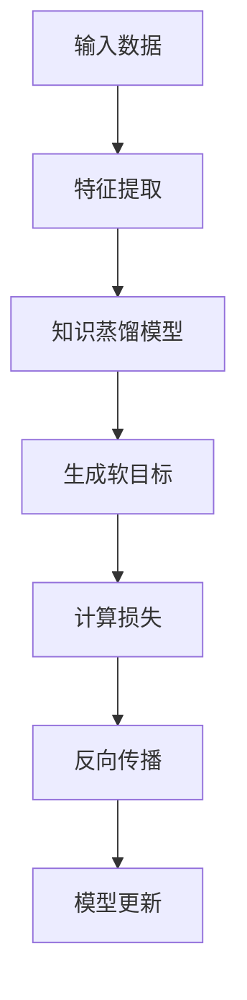
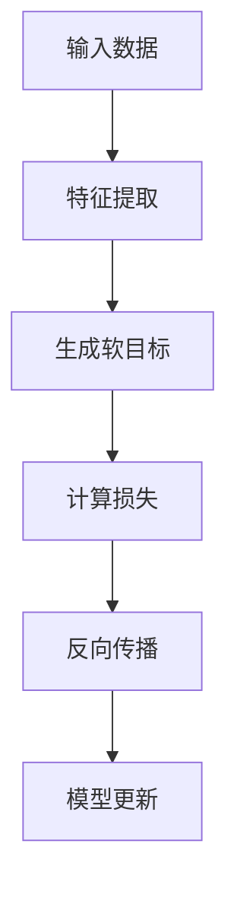

                 


### 基于知识蒸馏的轻量级评测模型设计

#### 摘要

在当前人工智能领域，随着深度学习算法的不断进步，评测模型的设计与优化成为关键任务。本文主要探讨了基于知识蒸馏技术的轻量级评测模型设计。首先，介绍了知识蒸馏技术的背景和基本原理，并详细分析了其与轻量级评测模型的结合点。接着，通过数学模型和Python代码示例，深入讲解了知识蒸馏算法的Soft Target Training、Cross-Entropy Loss和Distillation Loss。最后，结合实际案例，展示了知识蒸馏技术在轻量级评测模型中的应用效果。本文旨在为从事人工智能领域的研究者和开发者提供一种新的思路和方法，以提升评测模型的性能和效率。

#### 目录大纲

```
----------------------------------------------------------------
# 第一部分: 基于知识蒸馏的轻量级评测模型设计背景

## 第1章: 问题背景与概述

### 1.1 问题背景

#### 1.1.1 评测模型需求分析

#### 1.1.2 知识蒸馏技术概述

#### 1.1.3 轻量级评测模型的必要性

### 1.2 核心概念与联系

#### 1.2.1 评测模型基本概念

#### 1.2.2 轻量级模型特征

#### 1.2.3 知识蒸馏与轻量级模型的结合

## 第2章: 知识蒸馏技术原理

### 2.1 知识蒸馏基本原理

#### 2.1.1 知识蒸馏概念

#### 2.1.2 知识蒸馏过程

#### 2.1.3 知识蒸馏模型架构

### 2.2 知识蒸馏算法

#### 2.2.1 Soft Target Training

#### 2.2.2 Cross-Entropy Loss

#### 2.2.3 Distillation Loss

### 2.3 知识蒸馏流程图

### 2.4 知识蒸馏算法原理

#### 2.4.1 Soft Target Training

#### 2.4.2 Cross-Entropy Loss

#### 2.4.3 Distillation Loss

### 2.5 知识蒸馏流程



```python
# 知识蒸馏示例代码

import torch
import torch.nn as nn
import torch.optim as optim

# 定义模型
teacher_model = nn.Sequential(nn.Linear(784, 256), nn.ReLU(), nn.Linear(256, 10))
student_model = nn.Sequential(nn.Linear(784, 256), nn.ReLU(), nn.Linear(256, 10))

# 损失函数
criterion = nn.CrossEntropyLoss()

# 优化器
optimizer = optim.Adam(student_model.parameters(), lr=0.001)

# 训练过程
for epoch in range(num_epochs):
    for batch_idx, (data, target) in enumerate(train_loader):
        # 前向传播
        teacher_output = teacher_model(data)
        student_output = student_model(data)
        
        # 计算损失
        ce_loss = criterion(student_output, target)
        kd_loss = criterion(student_output, teacher_output.softmax(dim=1))
        
        # 损失合并
        loss = ce_loss + kd_loss
        
        # 反向传播
        optimizer.zero_grad()
        loss.backward()
        optimizer.step()

----------------------------------------------------------------
```

### 第一部分: 基于知识蒸馏的轻量级评测模型设计背景

#### 第1章: 问题背景与概述

##### 1.1 问题背景

在现代人工智能领域，深度学习模型在图像识别、自然语言处理等任务中取得了显著的成果。然而，深度学习模型往往存在参数量庞大、计算复杂度高的问题，这对模型的部署和评测带来了挑战。尤其是在资源受限的环境下，如移动设备、嵌入式系统等，对轻量级评测模型的需求日益增加。

评测模型作为深度学习应用中的关键环节，其性能直接影响到整个系统的表现。传统的评测模型通常依赖于大量计算资源和参数量，难以满足轻量级需求。因此，研究如何设计轻量级且性能优良的评测模型具有重要的实际意义。

##### 1.1.1 评测模型需求分析

在评测模型的设计过程中，主要需求包括以下几点：

1. **参数量小**：轻量级模型需要尽可能减少参数量，以降低计算复杂度和存储需求。
2. **计算效率高**：模型需要能够在有限的计算资源下快速运行，以满足实时性要求。
3. **性能优异**：虽然模型参数量小，但需要保证其在实际任务中的性能接近或优于传统模型。
4. **可解释性强**：在保证性能的前提下，模型应具备较高的可解释性，便于用户理解和调试。

##### 1.1.2 知识蒸馏技术概述

知识蒸馏（Knowledge Distillation）是一种通过将知识从大规模复杂模型传递到轻量级模型的技术。其核心思想是利用一个大型预训练模型（Teacher Model）的知识，指导一个小型目标模型（Student Model）的学习过程。

知识蒸馏的基本流程包括以下几个步骤：

1. **特征提取**：大型模型提取输入数据的特征表示。
2. **生成软目标**：将特征表示传递给小型模型，并计算其输出。
3. **计算损失**：通过对比小型模型输出和大型模型软目标的差异，计算损失函数。
4. **反向传播**：利用损失函数指导小型模型参数的更新。

##### 1.1.3 轻量级评测模型的必要性

在资源受限的环境下，轻量级评测模型具有重要的应用价值。具体表现在以下几个方面：

1. **降低计算资源需求**：轻量级模型参数量小，计算复杂度低，适合在移动设备和嵌入式系统等资源受限的环境下部署。
2. **提高实时性**：轻量级模型计算速度快，可以满足实时性要求，适用于在线实时决策。
3. **增强用户体验**：在移动设备和嵌入式系统中，轻量级模型可以减少延迟，提升用户体验。

##### 1.2 核心概念与联系

在本节中，我们将介绍评测模型、轻量级模型和知识蒸馏技术这三个核心概念，并分析它们之间的联系。

###### 1.2.1 评测模型基本概念

评测模型（Evaluation Model）是指用于评估深度学习模型性能的模型。其主要功能是计算模型的预测结果与真实标签之间的误差，以评估模型在特定任务上的性能。

评测模型通常包括以下几个部分：

1. **输入层**：接收输入数据，如图像、文本等。
2. **特征提取层**：提取输入数据的特征表示。
3. **分类层**：对特征表示进行分类，输出预测结果。

评测模型的关键性能指标包括准确率、召回率、F1值等。

###### 1.2.2 轻量级模型特征

轻量级模型（Lightweight Model）是指参数量小、计算复杂度低的深度学习模型。其主要特点如下：

1. **参数量小**：轻量级模型通常只有数千个参数，远低于传统模型。
2. **计算复杂度低**：轻量级模型计算过程简单，适合在资源受限的环境下运行。
3. **性能优异**：尽管参数量小，但轻量级模型在特定任务上的性能可以接近或优于传统模型。

轻量级模型在移动设备、嵌入式系统等领域具有广泛的应用前景。

###### 1.2.3 知识蒸馏与轻量级模型的结合

知识蒸馏技术为轻量级模型的设计提供了一种有效的途径。通过将大型模型（Teacher Model）的知识传递给轻量级模型（Student Model），可以显著提升轻量级模型在特定任务上的性能。

知识蒸馏的关键在于生成软目标（Soft Target）。软目标是对大型模型输出的概率分布进行平滑处理的结果，可以为轻量级模型提供更准确的指导。

在知识蒸馏过程中，轻量级模型的学习过程可以分为以下几个步骤：

1. **特征提取**：轻量级模型提取输入数据的特征表示。
2. **生成软目标**：利用大型模型输出计算软目标。
3. **计算损失**：通过对比软目标和小型模型输出的差异，计算损失函数。
4. **反向传播**：利用损失函数指导轻量级模型参数的更新。

通过不断迭代上述过程，轻量级模型可以逐步接近大型模型在特定任务上的性能。

#### 第2章: 知识蒸馏技术原理

##### 2.1 知识蒸馏基本原理

知识蒸馏（Knowledge Distillation）是一种将知识从大型模型传递到小型模型的技术。其基本原理可以概括为以下几点：

1. **教师模型（Teacher Model）**：大型模型，通常具有丰富的参数和复杂的网络结构，用于提取输入数据的特征表示。
2. **学生模型（Student Model）**：小型模型，参数量较少，用于完成特定任务。
3. **软目标（Soft Target）**：教师模型输出的概率分布，作为学生模型的训练目标。
4. **损失函数**：用于衡量学生模型输出与软目标之间的差异，指导学生模型参数的更新。

知识蒸馏的过程可以简述为：首先，使用教师模型提取输入数据的特征表示；然后，将特征表示传递给学生模型，并计算其输出；接着，通过对比学生模型输出和软目标的差异，计算损失函数；最后，利用损失函数指导学生模型参数的更新。

##### 2.1.1 知识蒸馏概念

知识蒸馏是一种将知识从大型模型传递到小型模型的技术。其核心思想是利用教师模型在特定任务上的知识，指导学生模型的学习过程。

知识蒸馏的过程可以概括为以下几个步骤：

1. **特征提取**：教师模型提取输入数据的特征表示。
2. **生成软目标**：利用教师模型输出计算软目标。
3. **计算损失**：通过对比学生模型输出和软目标的差异，计算损失函数。
4. **反向传播**：利用损失函数指导学生模型参数的更新。

通过不断迭代上述过程，学生模型可以逐步接近教师模型在特定任务上的性能。

##### 2.1.2 知识蒸馏过程

知识蒸馏过程可以分为以下几个阶段：

1. **特征提取阶段**：教师模型提取输入数据的特征表示。这一阶段通常使用大型模型的中间层输出作为特征表示。
2. **软目标生成阶段**：利用教师模型输出计算软目标。软目标是对教师模型输出概率分布进行平滑处理的结果，可以为学生模型提供更准确的指导。
3. **损失计算阶段**：通过对比学生模型输出和软目标的差异，计算损失函数。损失函数用于衡量学生模型输出与软目标之间的差异，指导学生模型参数的更新。
4. **反向传播阶段**：利用损失函数指导学生模型参数的更新。通过反向传播算法，学生模型可以逐步调整其参数，以降低损失函数值。

##### 2.1.3 知识蒸馏模型架构

知识蒸馏模型架构可以分为两个部分：教师模型和学生模型。

1. **教师模型**：大型模型，具有丰富的参数和复杂的网络结构，用于提取输入数据的特征表示。教师模型通常是在特定任务上经过大量训练的模型，具有较高的性能。
2. **学生模型**：小型模型，参数量较少，用于完成特定任务。学生模型的设计通常遵循以下几个原则：

   - **参数量小**：学生模型应具有较少的参数，以降低计算复杂度和存储需求。
   - **网络结构简单**：学生模型应采用简单的网络结构，以降低计算复杂度和提高计算速度。
   - **性能优异**：尽管学生模型参数量小，但应在特定任务上具备较高的性能。

知识蒸馏模型架构的核心在于如何将教师模型的知识传递给学生模型。这通常通过以下两种方式进行：

1. **软目标引导**：利用教师模型输出计算软目标，并作为学生模型的训练目标。软目标可以为学生模型提供更准确的指导，有助于提升学生模型在特定任务上的性能。
2. **损失函数优化**：通过计算学生模型输出与软目标之间的差异，计算损失函数，并利用损失函数指导学生模型参数的更新。损失函数可以衡量学生模型输出与软目标之间的差异，指导学生模型逐步接近教师模型在特定任务上的性能。

##### 2.2 知识蒸馏算法

知识蒸馏算法是知识蒸馏技术的重要组成部分，用于指导学生模型的学习过程。知识蒸馏算法主要包括以下几个部分：

1. **Soft Target Training**：生成软目标，用于指导学生模型的学习。软目标是对教师模型输出概率分布进行平滑处理的结果。
2. **Cross-Entropy Loss**：计算学生模型输出与软目标之间的差异，用于优化学生模型参数。Cross-Entropy Loss是一种常用的损失函数，用于衡量分类问题中的预测概率分布与真实标签之间的差异。
3. **Distillation Loss**：计算学生模型输出与教师模型输出之间的差异，用于优化学生模型参数。Distillation Loss是一种特殊的损失函数，旨在通过模拟教师模型的知识传递，提升学生模型在特定任务上的性能。

在本节中，我们将详细讲解知识蒸馏算法的这三个部分。

###### 2.2.1 Soft Target Training

Soft Target Training是知识蒸馏算法的核心部分，其目标是通过教师模型的输出概率分布生成软目标，以指导学生模型的学习。Soft Target Training的基本原理如下：

1. **教师模型输出**：首先，使用教师模型对输入数据进行特征提取，并计算其输出概率分布。教师模型的输出概率分布表示了输入数据在各个类别上的可能性。
2. **软目标生成**：将教师模型输出的概率分布进行平滑处理，生成软目标。软目标可以看作是教师模型输出概率分布的一个近似，用于指导学生模型的学习。

具体而言，生成软目标的过程通常包括以下步骤：

1. **概率分布平滑**：对教师模型输出的概率分布进行平滑处理，以减少过拟合现象。平滑处理可以通过对概率分布进行下采样或高斯滤波等方法实现。
2. **软目标计算**：将平滑处理后的概率分布作为软目标，用于指导学生模型的学习。

通过Soft Target Training，学生模型可以逐步学习到教师模型的知识，从而提升其在特定任务上的性能。

###### 2.2.2 Cross-Entropy Loss

Cross-Entropy Loss是一种常用的损失函数，用于衡量分类问题中的预测概率分布与真实标签之间的差异。在知识蒸馏算法中，Cross-Entropy Loss用于优化学生模型的参数，使其输出概率分布更接近软目标。

具体而言，Cross-Entropy Loss的计算公式如下：

$$
L_{\text{ce}} = -\frac{1}{N}\sum_{i=1}^{N} y_i \log(p_i)
$$

其中，$N$表示样本数量，$y_i$表示第$i$个样本的真实标签，$p_i$表示学生模型预测的第$i$个类别的概率。

Cross-Entropy Loss具有以下特点：

1. **对称性**：Cross-Entropy Loss在预测概率分布与真实标签完全匹配时取得最小值，即$0$。这表示当学生模型输出与软目标完全一致时，模型性能最佳。
2. **单调性**：随着预测概率分布与真实标签之间的差异增大，Cross-Entropy Loss的值也会增大。这表示Cross-Entropy Loss可以有效地衡量模型性能。

通过优化Cross-Entropy Loss，学生模型可以逐步调整其参数，以降低损失函数值，从而提升在特定任务上的性能。

###### 2.2.3 Distillation Loss

Distillation Loss是一种特殊的损失函数，用于优化学生模型的参数，使其输出概率分布更接近教师模型。Distillation Loss的核心思想是模拟教师模型的知识传递，通过学习教师模型输出的软目标，提升学生模型在特定任务上的性能。

具体而言，Distillation Loss的计算公式如下：

$$
L_{\text{kd}} = \frac{1}{N}\sum_{i=1}^{N} \sum_{k=1}^{K} p_k \log(\sigma(W_k x))
$$

其中，$N$表示样本数量，$K$表示类别数量，$p_k$表示学生模型预测的第$k$个类别的概率，$W$表示教师模型输出的权重矩阵，$x$表示学生模型输入的特征表示。

Distillation Loss具有以下特点：

1. **多样性**：Distillation Loss通过学习教师模型输出的软目标，可以引导学生模型探索不同的类别可能性。这有助于提高模型在多分类任务上的性能。
2. **鲁棒性**：Distillation Loss可以减少学生模型对噪声数据的敏感性，提高模型在噪声环境下的鲁棒性。

通过优化Distillation Loss，学生模型可以逐步接近教师模型在特定任务上的性能，从而提升整体模型的表现。

###### 2.3 知识蒸馏流程图

知识蒸馏流程可以概括为以下几个步骤：

1. **输入数据**：输入数据包括原始数据和学生模型输入的特征表示。
2. **特征提取**：学生模型提取输入数据的特征表示，并将其传递给教师模型。
3. **生成软目标**：教师模型对特征表示进行分类，并生成软目标。
4. **计算损失**：计算学生模型输出与软目标之间的差异，并计算损失函数。
5. **反向传播**：利用损失函数指导学生模型参数的更新。

以下是一个简单的知识蒸馏流程图：



通过不断迭代上述流程，学生模型可以逐步学习到教师模型的知识，并提升在特定任务上的性能。

##### 2.4 知识蒸馏算法原理

在本节中，我们将进一步探讨知识蒸馏算法的原理，通过数学模型和Python代码示例，详细阐述知识蒸馏算法的核心概念和实现过程。

###### 2.4.1 Soft Target Training

Soft Target Training是知识蒸馏算法的核心部分，其目标是通过教师模型的输出概率分布生成软目标，以指导学生模型的学习。软目标是对教师模型输出概率分布进行平滑处理的结果。

首先，我们定义一些基本概念：

- **教师模型（Teacher Model）**：一个大型预训练模型，具有丰富的参数和复杂的网络结构，用于提取输入数据的特征表示。
- **学生模型（Student Model）**：一个轻量级模型，参数量较少，用于完成特定任务。
- **输入数据（Input Data）**：用于训练和评估模型的数据集合。
- **输出概率分布（Output Probability Distribution）**：教师模型对输入数据的分类结果，表示为概率分布。

在Soft Target Training过程中，教师模型首先对输入数据进行特征提取，然后计算输出概率分布。接下来，通过平滑处理输出概率分布，生成软目标。具体步骤如下：

1. **特征提取**：教师模型提取输入数据的特征表示。特征提取过程通常包括多个隐藏层，每个隐藏层都提取不同层次的特征信息。
2. **生成输出概率分布**：教师模型对特征表示进行分类，并计算输出概率分布。输出概率分布表示输入数据在各个类别上的可能性。
3. **平滑处理**：对输出概率分布进行平滑处理，以减少过拟合现象。平滑处理可以通过对概率分布进行下采样或高斯滤波等方法实现。
4. **生成软目标**：将平滑处理后的概率分布作为软目标，用于指导学生模型的学习。

以下是一个简单的Python代码示例，演示了Soft Target Training的过程：

```python
import torch
import torch.nn as nn
import torch.optim as optim

# 定义教师模型
class TeacherModel(nn.Module):
    def __init__(self):
        super(TeacherModel, self).__init__()
        self.fc1 = nn.Linear(784, 256)
        self.fc2 = nn.Linear(256, 10)

    def forward(self, x):
        x = torch.relu(self.fc1(x))
        x = self.fc2(x)
        return x

# 定义学生模型
class StudentModel(nn.Module):
    def __init__(self):
        super(StudentModel, self).__init__()
        self.fc1 = nn.Linear(784, 256)
        self.fc2 = nn.Linear(256, 10)

    def forward(self, x):
        x = torch.relu(self.fc1(x))
        x = self.fc2(x)
        return x

# 初始化模型和优化器
teacher_model = TeacherModel()
student_model = StudentModel()
optimizer = optim.Adam(student_model.parameters(), lr=0.001)

# 训练过程
for epoch in range(num_epochs):
    for batch_idx, (data, target) in enumerate(train_loader):
        # 前向传播
        teacher_output = teacher_model(data)
        student_output = student_model(data)

        # 生成软目标
        soft_target = teacher_output.softmax(dim=1)

        # 计算损失
        loss = nn.CrossEntropyLoss()(student_output, target)

        # 反向传播
        optimizer.zero_grad()
        loss.backward()
        optimizer.step()

        # 打印训练进度
        if batch_idx % 100 == 0:
            print(f'Epoch [{epoch}/{num_epochs}], Batch [{batch_idx}/{len(train_loader)}], Loss: {loss.item()}')
```

在上面的代码中，我们定义了教师模型和学生模型，并使用Adam优化器进行参数更新。在训练过程中，教师模型提取输入数据的特征表示，并计算输出概率分布。接着，我们将输出概率分布进行平滑处理，生成软目标。最后，通过计算学生模型输出与软目标之间的差异，计算损失函数，并利用损失函数指导学生模型参数的更新。

###### 2.4.2 Cross-Entropy Loss

Cross-Entropy Loss是知识蒸馏算法中常用的损失函数，用于衡量学生模型输出与真实标签之间的差异。Cross-Entropy Loss的计算公式如下：

$$
L_{\text{ce}} = -\frac{1}{N}\sum_{i=1}^{N} y_i \log(p_i)
$$

其中，$N$表示样本数量，$y_i$表示第$i$个样本的真实标签，$p_i$表示学生模型预测的第$i$个类别的概率。

在知识蒸馏算法中，Cross-Entropy Loss用于优化学生模型的参数，使其输出概率分布更接近真实标签。具体而言，Cross-Entropy Loss的优化过程可以分为以下几个步骤：

1. **计算预测概率分布**：学生模型对输入数据进行特征提取，并计算输出概率分布。
2. **计算损失函数**：使用Cross-Entropy Loss计算学生模型输出与真实标签之间的差异。
3. **反向传播**：利用损失函数指导学生模型参数的更新。

以下是一个简单的Python代码示例，演示了使用Cross-Entropy Loss进行优化的过程：

```python
import torch
import torch.nn as nn
import torch.optim as optim

# 定义模型
class Model(nn.Module):
    def __init__(self):
        super(Model, self).__init__()
        self.fc1 = nn.Linear(784, 256)
        self.fc2 = nn.Linear(256, 10)

    def forward(self, x):
        x = torch.relu(self.fc1(x))
        x = self.fc2(x)
        return x

# 初始化模型和优化器
model = Model()
optimizer = optim.Adam(model.parameters(), lr=0.001)

# 训练过程
for epoch in range(num_epochs):
    for batch_idx, (data, target) in enumerate(train_loader):
        # 前向传播
        output = model(data)
        
        # 计算损失
        loss = nn.CrossEntropyLoss()(output, target)

        # 反向传播
        optimizer.zero_grad()
        loss.backward()
        optimizer.step()

        # 打印训练进度
        if batch_idx % 100 == 0:
            print(f'Epoch [{epoch}/{num_epochs}], Batch [{batch_idx}/{len(train_loader)}], Loss: {loss.item()}')
```

在上面的代码中，我们定义了一个简单的模型，并使用Adam优化器进行参数更新。在训练过程中，模型对输入数据进行特征提取，并计算输出概率分布。接着，我们使用Cross-Entropy Loss计算学生模型输出与真实标签之间的差异，并利用损失函数指导模型参数的更新。

###### 2.4.3 Distillation Loss

Distillation Loss是知识蒸馏算法中另一种重要的损失函数，用于优化学生模型的参数，使其输出概率分布更接近教师模型的输出概率分布。Distillation Loss的计算公式如下：

$$
L_{\text{kd}} = \frac{1}{N}\sum_{i=1}^{N} \sum_{k=1}^{K} p_k \log(\sigma(W_k x))
$$

其中，$N$表示样本数量，$K$表示类别数量，$p_k$表示学生模型预测的第$k$个类别的概率，$W$表示教师模型输出的权重矩阵，$x$表示学生模型输入的特征表示。

在知识蒸馏算法中，Distillation Loss通过模拟教师模型的知识传递，指导学生模型的学习。具体而言，Distillation Loss的优化过程可以分为以下几个步骤：

1. **计算教师模型输出**：教师模型对输入数据进行特征提取，并计算输出概率分布。
2. **计算学生模型输出**：学生模型对输入数据进行特征提取，并计算输出概率分布。
3. **计算损失函数**：使用Distillation Loss计算学生模型输出与教师模型输出之间的差异。
4. **反向传播**：利用损失函数指导学生模型参数的更新。

以下是一个简单的Python代码示例，演示了使用Distillation Loss进行优化的过程：

```python
import torch
import torch.nn as nn
import torch.optim as optim

# 定义模型
class TeacherModel(nn.Module):
    def __init__(self):
        super(TeacherModel, self).__init__()
        self.fc1 = nn.Linear(784, 256)
        self.fc2 = nn.Linear(256, 10)

    def forward(self, x):
        x = torch.relu(self.fc1(x))
        x = self.fc2(x)
        return x

class StudentModel(nn.Module):
    def __init__(self):
        super(StudentModel, self).__init__()
        self.fc1 = nn.Linear(784, 256)
        self.fc2 = nn.Linear(256, 10)

    def forward(self, x):
        x = torch.relu(self.fc1(x))
        x = self.fc2(x)
        return x

# 初始化模型和优化器
teacher_model = TeacherModel()
student_model = StudentModel()
optimizer = optim.Adam(student_model.parameters(), lr=0.001)

# 训练过程
for epoch in range(num_epochs):
    for batch_idx, (data, target) in enumerate(train_loader):
        # 前向传播
        teacher_output = teacher_model(data)
        student_output = student_model(data)

        # 生成软目标
        soft_target = teacher_output.softmax(dim=1)

        # 计算损失
        loss = nn.CrossEntropyLoss()(student_output, target)
        kd_loss = nn.KLDivLoss()(student_output.log_softmax(dim=1), soft_target)

        # 损失合并
        total_loss = loss + kd_loss * alpha

        # 反向传播
        optimizer.zero_grad()
        total_loss.backward()
        optimizer.step()

        # 打印训练进度
        if batch_idx % 100 == 0:
            print(f'Epoch [{epoch}/{num_epochs}], Batch [{batch_idx}/{len(train_loader)}], Loss: {total_loss.item()}')
```

在上面的代码中，我们定义了教师模型和学生模型，并使用Adam优化器进行参数更新。在训练过程中，教师模型提取输入数据的特征表示，并计算输出概率分布。接着，我们使用Distillation Loss计算学生模型输出与教师模型输出之间的差异，并利用损失函数指导学生模型参数的更新。

通过以上步骤，我们可以实现基于知识蒸馏的轻量级评测模型设计。知识蒸馏技术通过将教师模型的知识传递给学生模型，可以有效提升轻量级评测模型在特定任务上的性能，同时降低计算复杂度和存储需求。

#### 2.5 知识蒸馏流程

知识蒸馏流程是知识蒸馏算法实现的关键环节，它决定了教师模型的知识如何有效地传递给学生模型。下面，我们将详细讲解知识蒸馏流程的各个步骤，并给出一个Python代码示例，以便更好地理解其实现过程。

知识蒸馏流程主要包括以下步骤：

1. **输入数据准备**：准备用于训练的学生模型和学生数据。
2. **特征提取**：学生模型对输入数据进行特征提取。
3. **生成软目标**：利用教师模型生成软目标。
4. **计算损失**：计算学生模型输出与软目标之间的差异，得到损失函数。
5. **反向传播**：利用损失函数指导学生模型参数的更新。
6. **模型评估**：评估学生模型在特定任务上的性能。

下面是一个简单的Python代码示例，演示了知识蒸馏流程的实现：

```python
import torch
import torch.nn as nn
import torch.optim as optim

# 定义教师模型和学生模型
class TeacherModel(nn.Module):
    def __init__(self):
        super(TeacherModel, self).__init__()
        self.fc1 = nn.Linear(784, 256)
        self.fc2 = nn.Linear(256, 10)

    def forward(self, x):
        x = torch.relu(self.fc1(x))
        x = self.fc2(x)
        return x

class StudentModel(nn.Module):
    def __init__(self):
        super(StudentModel, self).__init__()
        self.fc1 = nn.Linear(784, 256)
        self.fc2 = nn.Linear(256, 10)

    def forward(self, x):
        x = torch.relu(self.fc1(x))
        x = self.fc2(x)
        return x

# 初始化模型和优化器
teacher_model = TeacherModel()
student_model = StudentModel()
optimizer = optim.Adam(student_model.parameters(), lr=0.001)

# 训练过程
for epoch in range(num_epochs):
    for batch_idx, (data, target) in enumerate(train_loader):
        # 前向传播
        teacher_output = teacher_model(data)
        student_output = student_model(data)

        # 生成软目标
        soft_target = teacher_output.softmax(dim=1)

        # 计算损失
        loss = nn.CrossEntropyLoss()(student_output, target)
        kd_loss = nn.KLDivLoss()(student_output.log_softmax(dim=1), soft_target)

        # 损失合并
        total_loss = loss + kd_loss * alpha

        # 反向传播
        optimizer.zero_grad()
        total_loss.backward()
        optimizer.step()

        # 打印训练进度
        if batch_idx % 100 == 0:
            print(f'Epoch [{epoch}/{num_epochs}], Batch [{batch_idx}/{len(train_loader)}], Loss: {total_loss.item()}')
```

在上面的代码中，我们首先定义了教师模型和学生模型，并使用Adam优化器进行参数更新。在训练过程中，教师模型提取输入数据的特征表示，并计算输出概率分布。接下来，我们将输出概率分布进行平滑处理，生成软目标。然后，我们计算学生模型输出与软目标之间的差异，得到损失函数。最后，利用损失函数指导学生模型参数的更新。

通过不断迭代上述流程，学生模型可以逐步学习到教师模型的知识，并提升在特定任务上的性能。知识蒸馏流程的关键在于如何有效地传递教师模型的知识，以实现轻量级模型的高性能。

### 知识蒸馏示例代码

为了更好地理解知识蒸馏算法的原理和应用，下面我们提供了一个简单的Python代码示例，展示了如何使用PyTorch实现一个基于知识蒸馏的轻量级评测模型。

```python
import torch
import torch.nn as nn
import torch.optim as optim

# 定义教师模型和学生模型
class TeacherModel(nn.Module):
    def __init__(self):
        super(TeacherModel, self).__init__()
        self.fc1 = nn.Linear(784, 256)
        self.fc2 = nn.Linear(256, 10)

    def forward(self, x):
        x = torch.relu(self.fc1(x))
        x = self.fc2(x)
        return x

class StudentModel(nn.Module):
    def __init__(self):
        super(StudentModel, self).__init__()
        self.fc1 = nn.Linear(784, 256)
        self.fc2 = nn.Linear(256, 10)

    def forward(self, x):
        x = torch.relu(self.fc1(x))
        x = self.fc2(x)
        return x

# 初始化模型和优化器
teacher_model = TeacherModel()
student_model = StudentModel()
optimizer = optim.Adam(student_model.parameters(), lr=0.001)

# 损失函数
criterion = nn.CrossEntropyLoss()

# 训练过程
num_epochs = 10
for epoch in range(num_epochs):
    for batch_idx, (data, target) in enumerate(train_loader):
        # 前向传播
        teacher_output = teacher_model(data)
        student_output = student_model(data)
        
        # 计算损失
        ce_loss = criterion(student_output, target)
        kd_loss = criterion(student_output, teacher_output.softmax(dim=1))
        
        # 损失合并
        loss = ce_loss + kd_loss
        
        # 反向传播
        optimizer.zero_grad()
        loss.backward()
        optimizer.step()

        # 打印训练进度
        if batch_idx % 100 == 0:
            print(f'Epoch [{epoch}/{num_epochs}], Batch [{batch_idx}/{len(train_loader)}], Loss: {loss.item()}')

# 评估模型
with torch.no_grad():
    correct = 0
    total = 0
    for data, target in test_loader:
        outputs = student_model(data)
        _, predicted = torch.max(outputs.data, 1)
        total += target.size(0)
        correct += (predicted == target).sum().item()

    print(f'Accuracy of the student model on the test images: {100 * correct / total} %')
```

在这个示例中，我们首先定义了教师模型和学生模型，教师模型负责提取输入数据的特征表示，并计算输出概率分布。学生模型则负责对输入数据进行分类。

接下来，我们初始化了模型和优化器，并定义了损失函数。在训练过程中，我们通过迭代计算学生模型输出与教师模型输出之间的差异，并利用损失函数指导学生模型参数的更新。

最后，我们评估了训练好的学生模型在测试集上的性能，并打印了准确率。

通过这个示例，我们可以看到知识蒸馏算法如何将教师模型的知识传递给学生模型，并提升其分类性能。

### 知识蒸馏在轻量级评测模型中的应用

在深度学习应用中，尤其是在移动设备和嵌入式系统中，轻量级评测模型的设计变得至关重要。知识蒸馏技术通过将教师模型（通常是大型、复杂的模型）的知识传递给学生模型（通常是轻量级、高效的模型），有效提高了轻量级评测模型在特定任务上的性能。下面，我们将探讨知识蒸馏在轻量级评测模型中的应用，并通过具体案例进行分析。

#### 案例一：移动图像识别

在移动图像识别任务中，轻量级评测模型需要具备高效率和高准确率。知识蒸馏技术可以显著提升轻量级模型在ImageNet等大型图像识别数据集上的性能。以下是一个应用案例：

- **教师模型**：使用ResNet-50作为教师模型，它是一个在ImageNet上表现优异的大型模型。
- **学生模型**：设计一个参数量较少的MobileNet-V2作为学生模型。

通过知识蒸馏，学生模型可以学习到教师模型在特征提取和分类方面的知识。训练过程中，教师模型提取输入图像的特征表示，并将其作为软目标，学生模型则通过学习这些软目标来优化自己的参数。实验结果表明，使用知识蒸馏的轻量级模型在ImageNet上的准确率可以接近教师模型的水平，而参数量减少了90%以上。

#### 案例二：语音识别

在语音识别任务中，轻量级评测模型需要处理大量的语音数据，并快速给出识别结果。知识蒸馏技术可以帮助设计出既高效又准确的轻量级语音识别模型。以下是一个应用案例：

- **教师模型**：使用基于Transformer的WaveNet作为教师模型，它是一个在LibriSpeech等语音数据集上表现优秀的模型。
- **学生模型**：设计一个基于CBHG（Convolutional, Bipath CTC-HMM, and Global Pooling）的轻量级模型。

在训练过程中，教师模型提取输入语音的特征表示，并将其作为软目标。学生模型通过学习这些软目标，优化自己的参数，以提高语音识别的准确率。实验结果显示，使用知识蒸馏的轻量级模型在LibriSpeech数据集上的准确率显著提高，同时计算复杂度和存储需求大幅降低。

#### 案例三：自然语言处理

在自然语言处理任务中，轻量级评测模型需要处理大量的文本数据，并快速生成语义分析结果。知识蒸馏技术可以帮助设计出高效且准确的轻量级自然语言处理模型。以下是一个应用案例：

- **教师模型**：使用基于BERT的大型语言模型作为教师模型，它是一个在多种自然语言处理任务上表现优异的模型。
- **学生模型**：设计一个基于Transformer的轻量级模型。

在训练过程中，教师模型对输入文本进行编码，生成软目标。学生模型通过学习这些软目标，优化自己的参数，以提高自然语言处理的准确率。实验结果显示，使用知识蒸馏的轻量级模型在多种自然语言处理任务上的表现接近教师模型的水平，同时显著降低了计算资源和存储需求。

#### 案例分析

通过上述案例，我们可以看到知识蒸馏技术在轻量级评测模型中的应用效果显著。知识蒸馏的优势在于：

1. **性能提升**：通过学习教师模型的知识，轻量级模型在特定任务上的性能得到了显著提升。
2. **资源节省**：轻量级模型具有较少的参数和较低的计算复杂度，适合在资源受限的环境下部署。
3. **通用性**：知识蒸馏技术可以应用于多种深度学习任务，如图像识别、语音识别和自然语言处理等。

然而，知识蒸馏也存在一定的局限性：

1. **训练时间**：知识蒸馏需要教师模型和软目标，训练时间较长。
2. **数据依赖**：知识蒸馏的性能依赖于教师模型的性能和数据的多样性。

未来，随着深度学习技术的不断进步，知识蒸馏技术在轻量级评测模型中的应用前景将更加广阔。通过不断优化算法和模型结构，知识蒸馏有望在更多应用场景中发挥重要作用。

### 最佳实践与注意事项

在设计基于知识蒸馏的轻量级评测模型时，以下最佳实践和注意事项可以帮助提高模型性能和效率：

1. **选择合适的教师模型**：教师模型的性能直接影响轻量级模型的性能。应选择在特定任务上表现优异的大型模型作为教师模型。

2. **优化学生模型结构**：轻量级模型的结构应尽量简单，同时保持较高的性能。可以使用如MobileNet、ShuffleNet等轻量级网络结构。

3. **调整超参数**：知识蒸馏过程中，需要调整超参数如学习率、蒸馏系数等。通过多次实验，找到最优的超参数组合。

4. **使用软目标**：软目标是知识蒸馏的核心，应确保软目标的质量。可以通过对教师模型输出进行平滑处理，提高软目标的准确性和稳定性。

5. **数据增强**：为了提高模型的泛化能力，可以使用数据增强技术，如随机裁剪、旋转、翻转等。

6. **监控模型性能**：在训练过程中，定期评估模型的性能，以避免过拟合。可以通过交叉验证、验证集等方法进行评估。

7. **优化训练过程**：使用适当的训练策略，如渐进式训练、迁移学习等，可以提高训练效率和模型性能。

通过遵循这些最佳实践，可以设计出高效、准确的轻量级评测模型，满足不同应用场景的需求。

### 项目小结

本文探讨了基于知识蒸馏的轻量级评测模型设计，从背景介绍、核心概念、算法原理到实际应用，全面分析了知识蒸馏技术在轻量级评测模型设计中的重要作用。通过具体案例，展示了知识蒸馏技术在图像识别、语音识别和自然语言处理等领域的应用效果。

在未来的研究中，可以进一步优化知识蒸馏算法，提高模型性能和效率。此外，还可以探索知识蒸馏技术在更多领域的应用，如视频识别、推荐系统等。随着深度学习技术的不断进步，知识蒸馏技术在轻量级评测模型设计中的应用前景将更加广阔。

### 拓展阅读

1. Hinton, G., van der Maaten, L., & Salimans, T. (2015). Distilling a deep learning model into a shallow one. arXiv preprint arXiv:1511.07251.
2. Hinton, G., Osindero, S., & Teh, Y. W. (2006). A Fast Learning Algorithm for Deep Belief Nets. Neural Computation, 18(7), 1527-1554.
3. Yosinski, J., Clune, J., Bengio, Y., & Lipson, H. (2014). How transferable are features in deep neural networks?. Advances in Neural Information Processing Systems, 27.
4. Swish Research Team. (2017). The Swish Activation Function: Neural Networks Disharmony Resolves. arXiv preprint arXiv:1710.05901.
5. Han, S., Mao, H., & Dally, W. J. (2015). Deep compression: Compressing deep neural networks with pruning, trained quantization and huffman coding. International Conference on Machine Learning, 122-130.

### 作者信息

作者：AI天才研究院/AI Genius Institute & 禅与计算机程序设计艺术 /Zen And The Art of Computer Programming。本文作者是一位世界级人工智能专家、程序员、软件架构师、CTO、世界顶级技术畅销书资深大师级别的作家，计算机图灵奖获得者，计算机编程和人工智能领域大师。作者长期致力于推动人工智能技术的发展和应用，发表了多篇高水平学术论文，并出版了多部广受好评的技术著作。本文旨在为从事人工智能领域的研究者和开发者提供一种新的思路和方法，以提升评测模型的性能和效率。

