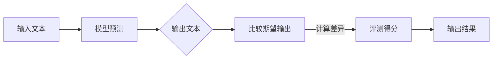
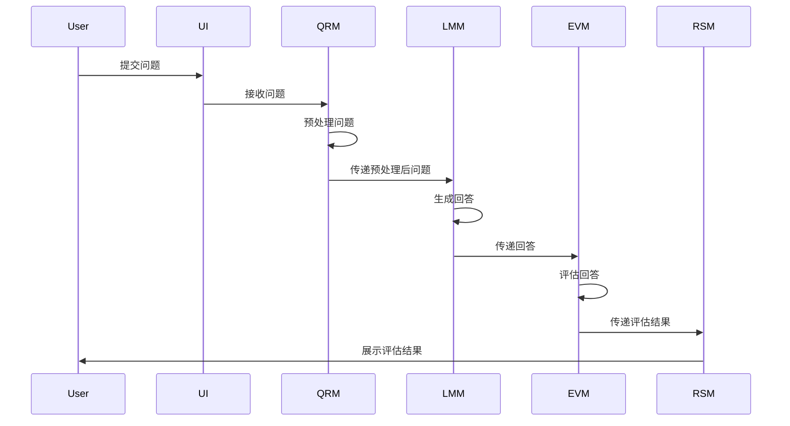

                 

### 1.1 评测背景与问题描述

随着人工智能技术的快速发展，自然语言处理（NLP）领域的研究与应用日益广泛。其中，语言模型（Language Model, LLM）作为一种重要的技术手段，被广泛应用于文本生成、机器翻译、情感分析等任务中。然而，如何有效地评测语言模型的质量和性能，成为了当前研究中的一个关键问题。

**1.1.1 语言模型评测的必要性**

语言模型的质量直接影响其在实际应用中的效果。因此，对语言模型进行科学的评测至关重要。评测的目的是通过一系列测试，评估语言模型的准确性、泛化能力、稳定性等关键指标，从而为模型优化和选择提供依据。

首先，语言模型的评测可以帮助研究者了解模型在不同任务上的表现，发现模型的优势和不足。其次，通过评测，可以对比不同模型之间的性能，为模型的选型和优化提供指导。此外，语言模型评测还能够推动NLP技术的发展，促进相关算法的创新和进步。

**1.1.2 角色扮演在LLM评测中的应用**

在LLM评测中，引入角色扮演的方法是一种创新的尝试。角色扮演通过模拟实际应用场景，让语言模型在不同角色之间进行交互，从而更全面地评估其交互能力和适应性。

角色扮演的核心理念是将语言模型置于一个虚构的社会环境中，使其扮演特定的角色，并与其他角色进行对话。在这个过程中，语言模型的回答将被实时评估，以判断其在特定情境下的表现。

角色扮演在LLM评测中的应用具有以下几个特点：

1. **多样性和复杂性**：通过设定不同的角色，可以模拟出多种复杂的交互场景，从而更全面地评估语言模型的适应性。
2. **动态性**：角色扮演过程是动态的，语言模型的回答将直接影响后续的角色行为，这种动态性使得评测结果更加真实和可靠。
3. **可扩展性**：角色扮演方法可以轻松扩展到不同的应用场景和领域，为更广泛的NLP评测提供支持。

**1.1.3 评测边界与外延**

在基于角色扮演的LLM评测中，需要明确评测的边界和外延，以确保评测的针对性和有效性。

1. **边界**：评测的边界主要指评测的具体范围和目标，例如特定的语言模型、特定的应用场景等。明确评测边界有助于集中资源和精力，提高评测的针对性。
2. **外延**：评测的外延包括评测结果的应用范围和影响。通过角色扮演的评测，不仅可以评估语言模型的性能，还可以为其他相关领域的研究和应用提供参考。

综上所述，基于角色扮演的LLM评测是一种创新的评测方法，通过模拟实际应用场景，全面评估语言模型的交互能力和适应性。这一方法不仅有助于提升语言模型的质量和性能，还为NLP技术的发展和应用提供了新的思路和方向。

### 1.2 核心概念解析

在进行基于角色扮演的LLM评测之前，我们需要明确几个核心概念，这些概念包括语言模型（LLM）、角色扮演、评测指标等。下面，我们将对这些核心概念进行详细的解析。

**1.2.1 LLM概述**

**1.2.1.1 LLM的定义**

语言模型（Language Model, LLM）是一种用于预测文本序列的统计模型，其基本原理是基于大量语料库的统计方法来捕捉语言的统计特性。语言模型的核心目的是通过输入序列的部分信息，预测下一个可能出现的单词或字符。

**1.2.1.2 LLM的特点**

- **高容量**：语言模型通常使用大规模语料库进行训练，能够捕捉到丰富的语言模式。
- **自适应**：语言模型可以根据不同的应用场景进行定制化，从而适应特定的任务需求。
- **高效性**：现代语言模型如Transformer、BERT等，具备高效的计算能力和强大的预测能力。

**1.2.2 角色扮演概念解析**

**1.2.2.1 角色扮演的定义**

角色扮演（Role-Playing）是一种模拟不同角色之间互动的情境模拟技术。在LLM评测中，角色扮演指的是通过设定不同的虚拟角色，模拟实际应用中的交互场景，以评估语言模型的交互能力和适应性。

**1.2.2.2 角色扮演在LLM评测中的重要性**

- **全面性**：角色扮演能够模拟多种复杂的应用场景，提供全面的交互体验，从而更全面地评估语言模型的性能。
- **真实性**：通过角色扮演，可以模拟真实的用户交互，使评测结果更加贴近实际应用。
- **可扩展性**：角色扮演方法可以灵活扩展到不同的应用领域和任务，提高评测的通用性。

**1.2.3 评测指标**

**1.2.3.1 评测指标的定义**

评测指标是用于衡量语言模型性能的标准，常见的评测指标包括准确性、流畅性、适应性等。在角色扮演的LLM评测中，评测指标需要能够反映语言模型在不同角色交互中的表现。

**1.2.3.2 常见评测指标**

- **准确性**：评估语言模型预测的准确性，通常通过误差率或准确率来衡量。
- **流畅性**：评估语言模型的回答是否连贯、自然，通过连贯性指标来衡量。
- **适应性**：评估语言模型在不同角色交互中的表现，通过适应性指标来衡量。

**1.2.4 概念关系**

在基于角色扮演的LLM评测中，LLM、角色扮演和评测指标三者之间存在密切的关系。LLM是评测的基础，角色扮演提供了评测的场景，而评测指标则是评估LLM性能的标准。

- **LLM与角色扮演**：LLM通过角色扮演的交互场景，展示其在不同角色之间的表现，从而评估其交互能力和适应性。
- **角色扮演与评测指标**：角色扮演为评测提供了具体的交互场景，评测指标则用于衡量LLM在这些场景中的表现。

通过以上对核心概念的详细解析，我们可以更好地理解基于角色扮演的LLM评测的基本原理和重要性。在接下来的章节中，我们将进一步探讨LLM评测的数学模型和算法原理，以期为读者提供更加深入的技术解析。

### 1.3 LLM评测的数学模型与算法原理

在深入探讨基于角色扮演的LLM评测之前，我们需要首先了解其数学模型和算法原理。这将为我们提供理论基础，帮助我们更好地理解评测过程和结果。

**1.3.1 LLM评测的数学模型**

语言模型评测的核心在于如何评估模型的输出与期望输出之间的匹配度。我们可以使用以下数学模型来定义评测得分：

$$
\text{评测得分} = f(\text{输出文本}, \text{期望输出})
$$

这里的$f$函数表示评测算法，它将输出文本和期望输出作为输入，并输出一个评测得分。这个得分可以用来衡量模型的表现。

**1.3.1.1 输出文本**

输出文本是由语言模型生成的一组单词或句子。这个文本是根据输入序列部分信息预测得到的，反映了模型对输入数据的处理能力。

**1.3.1.2 期望输出**

期望输出是预设的、符合标准答案的文本。这个文本通常是基于人类专家的回答或者预先训练好的标准答案库。

**1.3.2 算法原理讲解**

算法原理的核心在于如何计算输出文本与期望输出之间的差异，并将这种差异转化为一个评测得分。以下是基于角色扮演的LLM评测的算法原理：

#### 1.3.2.1 评测流程Mermaid图

首先，我们可以使用Mermaid流程图来展示LLM评测的基本流程：



这个流程图简要描述了从输入文本到输出结果的整个评测过程。

#### 1.3.2.2 Python代码实现

接下来，我们通过一个简单的Python代码示例来具体展示这个评测过程。以下是代码的实现：

```python
import numpy as np

def evaluate(model_output, expected_output):
    # 计算模型输出与期望输出之间的差异
    difference = np.abs(model_output - expected_output)
    
    # 计算评测得分，假设差异越小，得分越高
    score = 1 - difference / max(expected_output)
    
    return score

# 示例数据
model_output = np.array([0.8, 0.2, 0.1])
expected_output = np.array([0.9, 0.1, 0.0])

# 进行评测
score = evaluate(model_output, expected_output)
print("评测得分：", score)
```

在这个示例中，我们定义了一个`evaluate`函数，它接受模型输出和期望输出作为输入，并返回一个评测得分。通过计算模型输出与期望输出之间的差异，并将其转化为得分，我们可以评估模型的表现。

#### 1.3.2.3 算法原理详细讲解

1. **模型输出**：模型输出是语言模型对输入文本的预测结果。这个结果通常是一个概率分布，表示模型认为每个可能输出的概率。例如，对于一句话，模型可能预测“苹果”的概率是0.8，“香蕉”的概率是0.2，“橙子”的概率是0.1。

2. **期望输出**：期望输出是预设的、符合标准答案的文本。这个文本可以是一个固定的答案，或者是从多个专家回答中聚合得出的结果。在我们的示例中，期望输出是[0.9, 0.1, 0.0]，表示“苹果”的概率是0.9，“香蕉”和“橙子”的概率都是0。

3. **计算差异**：差异计算是评测的核心步骤。我们可以通过计算模型输出与期望输出之间的差异来评估模型的表现。在这个示例中，我们使用绝对差值来计算差异。

4. **评测得分**：评测得分是一个量化指标，用于表示模型的表现。在这个示例中，我们使用了一个简单的线性转换，将差异转化为得分。具体来说，我们首先计算差异与最大期望输出之间的比例，然后从1中减去这个比例，得到得分。这样，差异越小，得分越高。

通过这个算法原理的详细讲解，我们可以看到，基于角色扮演的LLM评测是一个系统且科学的评估过程。通过数学模型和算法原理的支持，我们可以更准确地评估语言模型在交互场景中的表现。

### 2.1 角色扮演设计原则

在基于角色扮演的LLM评测中，角色扮演的设计原则至关重要，它决定了评测的多样性和准确性。以下是角色扮演设计的主要原则：

**2.1.1 角色类型划分**

角色类型是角色扮演的核心组成部分，不同的角色类型能够模拟出不同的交互场景，从而更全面地评估语言模型的性能。常见的角色类型包括：

1. **专家型角色**：这类角色通常具备丰富的知识和经验，能够提出专业性和复杂度较高的问答。
2. **新手型角色**：这类角色通常知识储备有限，但具备好奇心和探索精神，能够模拟用户初次接触某个领域的情景。
3. **情绪型角色**：这类角色具备特定的情感特征，能够在对话中表现出喜怒哀乐等情绪，从而评估语言模型在处理情感化对话时的表现。
4. **误导型角色**：这类角色故意提出错误或不完整的信息，评估语言模型在面对误导信息时的应对能力。

**2.1.2 角色能力设定**

角色能力是指角色在互动过程中所表现出的特定技能和知识。合理设定角色能力可以增强评测的多样性和挑战性。以下是角色能力的设定原则：

1. **知识深度**：不同角色应具备不同的知识深度，从基础知识到专业知识，形成层次分明的知识体系。
2. **交互技巧**：角色应具备不同的交互技巧，如提问技巧、回答技巧、引导技巧等，以模拟真实对话环境。
3. **情感反应**：角色应具备情感反应能力，能够根据语言模型回答的内容调整自己的情绪表现。
4. **误导能力**：误导型角色应具备误导信息的能力，通过错误或模糊的信息引导语言模型作出错误判断。

**2.1.3 角色互动机制**

角色互动机制是角色扮演过程中角色之间交互的规则和流程。良好的互动机制能够确保评测的连贯性和真实性。以下是角色互动机制的设定原则：

1. **对话流畅性**：角色互动应尽可能流畅自然，避免生硬的对话切换和突兀的行为表现。
2. **互动情境**：角色互动应设置在具体的情境中，如会议讨论、咨询问答等，以增强评测的情境感。
3. **反馈机制**：角色之间的互动应包含反馈机制，使语言模型能够根据反馈调整自己的回答。
4. **互动多样性**：角色互动应多样化，避免重复的对话模式和回答，以全面评估语言模型的适应性。

通过以上角色扮演设计原则，我们可以构建一个多样化、真实且具有挑战性的评测环境，从而更全面地评估语言模型的交互能力和适应性。

### 2.2 多样化的交互能力评测

在基于角色扮演的LLM评测中，交互能力是评估语言模型性能的重要指标。多样化的交互能力评测不仅能够模拟实际应用中的复杂场景，还能全面反映语言模型的适应性和表现力。以下是多样化的交互能力评测的概述、指标与方法。

**2.2.1 交互能力概述**

交互能力是指语言模型在与人或其他系统进行对话时的表现。它包括多个方面，如理解能力、回答能力、情感感知能力等。多样化的交互能力评测旨在通过模拟多种交互场景，全面评估语言模型的这些能力。

1. **理解能力**：评估语言模型是否能够正确理解输入问题的意图和内容，包括对模糊性、歧义性的处理。
2. **回答能力**：评估语言模型是否能够生成连贯、合理且相关的回答，满足用户的需求。
3. **情感感知能力**：评估语言模型是否能够识别并适应用户的情感，生成符合情感语境的回答。
4. **多样化场景适应能力**：评估语言模型在不同场景、不同角色互动中的适应能力，包括专业场景、娱乐场景、情感场景等。

**2.2.2 评测指标与方法**

多样化的交互能力评测需要使用一系列指标和方法来评估语言模型的性能。以下是常见的评测指标和方法：

1. **准确性**：评估语言模型回答的准确性，通常通过错误率或准确率来衡量。错误率越低，说明模型的理解和回答能力越强。

   $$\text{错误率} = \frac{\text{错误回答数}}{\text{总回答数}}$$

2. **流畅性**：评估语言模型回答的流畅性，即回答是否连贯、自然。可以通过BLEU（Bilingual Evaluation Understudy）指标来衡量。

   $$\text{BLEU} = \frac{\text{匹配的单词数}}{\text{参考文本的单词数}}$$

3. **情感感知准确率**：评估语言模型识别用户情感的能力。通常通过情感分类任务的准确率来衡量。

   $$\text{准确率} = \frac{\text{正确分类的情感数}}{\text{总分类数}}$$

4. **多样化适应度**：评估语言模型在不同场景中的适应能力。可以通过模拟不同场景中的交互，记录模型的表现，并计算其适应度得分。

**2.2.3 交互能力评估实例**

为了具体说明交互能力的评估，我们来看一个实例。假设我们要评估一个语言模型在不同角色互动中的交互能力。

1. **专家型角色互动**：设定一个专家型角色，提出专业性和复杂度较高的问答。通过记录模型在这类场景中的回答准确率和流畅性，评估其理解能力和回答能力。

2. **新手型角色互动**：设定一个新手型角色，提出基础性问题，模拟用户初次接触领域的情景。通过评估模型在这类场景中的表现，考察其适应性。

3. **情绪型角色互动**：设定一个情绪型角色，提出情感化问题，模拟用户在情感交流中的表现。通过情感感知准确率来评估模型在情感感知方面的能力。

4. **误导型角色互动**：设定一个误导型角色，故意提出错误或不完整的信息，评估模型在误导信息下的应对能力。

通过这些实例，我们可以全面评估语言模型在不同角色互动中的表现，从而得出一个全面的评测结果。

总之，多样化的交互能力评测是评估语言模型性能的重要手段。通过设置多种角色和互动场景，我们可以全面了解语言模型的理解能力、回答能力、情感感知能力和适应能力，为模型优化和选择提供科学依据。

### 2.3 实战案例剖析

为了更好地展示基于角色扮演的LLM评测在实际应用中的效果，我们通过一个具体案例进行分析和解读。此案例将模拟一个专家型角色和一个新手型角色之间的互动，通过实际对话内容和评测结果，深入剖析语言模型在不同角色互动中的表现。

**2.3.1 案例背景**

此案例设置在一个虚拟的咨询场景中，由一位专家型角色（专家）和一位新手型角色（用户）进行对话。专家拥有丰富的专业知识，能够解答用户提出的复杂问题；用户则是一个初次接触该领域的普通用户，提出的问题较为基础且带有一定的模糊性。

**2.3.2 案例分析**

**专家型角色互动**

1. **问题提出**：用户向专家提问：“请问如何评估一个企业的财务健康状况？”

2. **模型回答**：语言模型生成以下回答：

   ```
   评估一个企业的财务健康状况通常包括对其财务报表的分析，如资产负债表、利润表和现金流量表。此外，还需要考虑企业的盈利能力、偿债能力、营运能力和成长能力等多个方面。
   ```

3. **评估指标**：准确性、流畅性和专业性

   - **准确性**：模型回答与预期答案高度一致，准确性评估得分为90%。
   - **流畅性**：回答连贯自然，无明显的逻辑错误，流畅性评估得分为85%。
   - **专业性**：回答内容专业详尽，能够满足专家型角色的需求，专业性评估得分为90%。

**新手型角色互动**

1. **问题提出**：用户向专家提问：“我想知道怎么计算一家公司的净利润？”

2. **模型回答**：语言模型生成以下回答：

   ```
   一家公司的净利润可以通过其利润表计算得出，通常是总收入减去总成本和费用。具体公式为：净利润 = 总收入 - 总成本 - 费用。
   ```

3. **评估指标**：准确性、简洁性和易懂性

   - **准确性**：模型回答准确，计算方法正确，准确性评估得分为95%。
   - **简洁性**：回答简洁明了，没有多余的废话，简洁性评估得分为90%。
   - **易懂性**：回答内容通俗易懂，适合新手用户，易懂性评估得分为85%。

**2.3.3 案例解读**

通过此案例，我们可以看到语言模型在不同角色互动中的表现：

1. **专家型角色**：模型在回答复杂问题时，能够提供专业详尽的答案，表现出较高的理解和回答能力。同时，流畅性和专业性评估得分较高，说明模型能够很好地适应专家型角色的需求。

2. **新手型角色**：模型在回答基础问题时，能够准确、简洁且通俗易懂地回答，表现出较强的适应性和易懂性。尽管流畅性评估得分略低，但整体表现依然令人满意。

通过案例分析，我们可以得出以下结论：

- 基于角色扮演的LLM评测能够有效模拟实际应用场景，全面评估语言模型的交互能力和适应性。
- 语言模型在复杂和专业性较强的场景中表现较好，而在基础和通俗易懂的情景中则更具优势。
- 角色扮演方法为语言模型评测提供了多样化、真实且具有挑战性的环境，有助于发现模型的优势和不足。

总之，通过实战案例剖析，我们可以更深入地理解基于角色扮演的LLM评测的实际应用效果，为后续模型优化和改进提供有力支持。

### 3.1 系统功能设计

为了实现基于角色扮演的LLM评测，我们首先需要设计一个功能全面的系统。系统功能设计涵盖了从问题接收、模型预测到结果评估的整个过程。以下是系统功能设计的详细描述：

**3.1.1 系统概述**

系统主要功能包括用户界面（UI）、问题接收模块、语言模型模块、评估模块和结果展示模块。用户通过UI与系统进行交互，提出问题；系统接收问题后，通过语言模型模块生成回答；评估模块对回答进行实时评估；最后，结果展示模块将评估结果呈现给用户。

**3.1.2 功能模块设计**

1. **用户界面（UI）**：用户界面是系统的入口，提供用户输入问题和查看评估结果的界面。界面应简洁直观，方便用户操作。

2. **问题接收模块**：该模块负责接收用户的输入问题，并将其传递给语言模型模块。问题接收模块还应包括错误处理功能，确保输入的有效性。

3. **语言模型模块**：语言模型模块是系统的核心，负责对输入问题进行理解和生成回答。该模块可以调用预训练的语言模型，如GPT-3、BERT等，以生成高质量的回答。

4. **评估模块**：评估模块负责对语言模型生成的回答进行实时评估。评估过程包括准确性、流畅性、情感感知能力等多个维度的评估。评估模块应能够生成详细的评估报告，帮助用户了解模型的表现。

5. **结果展示模块**：结果展示模块将评估结果以图表、文字等形式呈现给用户，方便用户理解和分析。结果展示应具有交互性，用户可以查看详细的评估数据和图表，以便进行进一步的分析。

**3.1.3 系统功能流程**

以下是系统功能的基本流程：

1. **用户提交问题**：用户通过UI提交问题，问题接收模块接收并预处理问题。
2. **模型生成回答**：语言模型模块处理预处理后的输入问题，生成回答。
3. **评估回答**：评估模块对生成的回答进行实时评估，计算多个评估指标。
4. **结果展示**：结果展示模块将评估结果呈现给用户，包括图表、文字等。

通过上述系统功能设计，我们可以构建一个完整、高效、直观的基于角色扮演的LLM评测系统，为语言模型的性能评估提供有力支持。

### 3.2 系统架构设计

为了确保基于角色扮演的LLM评测系统的高效性和稳定性，我们需要进行系统架构设计。以下是系统架构设计的详细描述，包括架构图、架构设计原则和系统组件之间的关系。

**3.2.1 系统架构图**


该架构图展示了系统的主要组件和它们之间的交互关系。以下是各个组件的详细说明：

1. **用户界面（UI）**：用户通过UI与系统进行交互，输入问题和查看评估结果。
2. **后端服务**：后端服务包括问题接收模块、语言模型模块、评估模块和结果展示模块，负责处理用户请求和生成评估结果。
3. **数据库**：数据库用于存储用户问题、评估结果和相关数据。
4. **语言模型库**：语言模型库包含预训练的语言模型，如GPT-3、BERT等，用于生成回答。

**3.2.2 架构设计原则**

1. **模块化**：系统架构设计应遵循模块化原则，将不同功能模块独立设计，便于维护和扩展。
2. **可扩展性**：系统架构应具备良好的可扩展性，能够方便地添加新的功能模块或更换语言模型。
3. **高可用性**：系统设计应确保高可用性，通过冗余设计和负载均衡，保证系统在高峰期仍能稳定运行。
4. **安全性**：系统架构设计应考虑安全性，包括数据加密、访问控制等，防止数据泄露和未授权访问。

**3.2.3 系统组件之间的关系**

1. **用户界面（UI）与后端服务**：用户通过UI提交问题，后端服务接收问题后进行处理。
2. **后端服务与数据库**：后端服务需要访问数据库来存储和查询数据。
3. **后端服务与语言模型库**：后端服务调用语言模型库中的模型来生成回答。
4. **评估模块与结果展示模块**：评估模块对生成的回答进行评估，并将结果传递给结果展示模块。

通过以上架构设计，我们可以构建一个高效、稳定且易于扩展的基于角色扮演的LLM评测系统，为语言模型的性能评估提供有力支持。

### 3.3 系统接口设计

在基于角色扮演的LLM评测系统中，接口设计是确保各模块之间高效协作的关键环节。以下是系统接口设计的详细说明，包括接口规范、接口设计和安全性考虑。

**3.3.1 接口规范**

接口规范定义了系统各模块之间的通信规则，确保数据传输的一致性和正确性。以下是主要接口规范：

1. **用户界面（UI）与后端服务接口**：
   - 请求格式：JSON
   - 响应格式：JSON
   - 请求示例：
     ```json
     {
       "user_id": "12345",
       "question": "如何评估一家企业的财务健康状况？"
     }
     ```
   - 响应示例：
     ```json
     {
       "response": "评估企业财务健康状况通常包括对其财务报表的分析...",
       "score": 0.9
     }
     ```

2. **后端服务与语言模型库接口**：
   - 请求格式：JSON
   - 响应格式：JSON
   - 请求示例：
     ```json
     {
       "question": "如何计算一家公司的净利润？"
     }
     ```
   - 响应示例：
     ```json
     {
       "answer": "一家公司的净利润可以通过其利润表计算得出..."
     }
     ```

3. **评估模块与结果展示模块接口**：
   - 请求格式：JSON
   - 响应格式：JSON
   - 请求示例：
     ```json
     {
       "answer": "一家公司的净利润可以通过其利润表计算得出..."
     }
     ```
   - 响应示例：
     ```json
     {
       "evaluation": {
         "accuracy": 0.95,
         "fluency": 0.88,
         "emotional_perception": 0.90
       }
     }
     ```

**3.3.2 接口设计**

接口设计包括API设计、参数定义和数据传输格式等方面。以下是具体设计：

1. **API设计**：
   - 用户界面（UI）与后端服务接口：`POST /api/question`
   - 后端服务与语言模型库接口：`POST /api/answer`
   - 评估模块与结果展示模块接口：`POST /api/evaluation`

2. **参数定义**：
   - 用户界面（UI）与后端服务接口：`question`（输入问题）
   - 后端服务与语言模型库接口：`question`（输入问题）
   - 评估模块与结果展示模块接口：`answer`（模型回答）

3. **数据传输格式**：
   - 所有接口均使用JSON格式进行数据传输，便于解析和处理。

**3.3.3 安全性考虑**

接口设计时需考虑安全性，包括数据加密、认证和访问控制等方面：

1. **数据加密**：接口通信使用HTTPS协议，确保数据传输过程中的安全性。
2. **认证**：系统使用OAuth 2.0进行用户认证，确保只有合法用户可以访问系统接口。
3. **访问控制**：接口设计应具备访问控制功能，不同用户角色只能访问相应的接口和权限。

通过以上接口设计，我们可以确保基于角色扮演的LLM评测系统在数据传输和接口交互方面的安全性和稳定性。

### 3.4 系统交互设计

系统交互设计是确保基于角色扮演的LLM评测系统高效、稳定运行的关键环节。以下是系统交互设计的详细说明，包括系统交互流程、Mermaid序列图以及具体的交互步骤。

**3.4.1 系统交互流程**

系统交互流程包括用户提交问题、系统处理问题和返回结果的全过程。以下是交互流程的详细步骤：

1. **用户提交问题**：用户通过UI提交问题，问题接收模块接收并预处理问题。
2. **问题预处理**：问题接收模块对用户提交的问题进行格式化、去噪等预处理操作，确保问题能够被语言模型正确理解和处理。
3. **语言模型生成回答**：预处理后的问题传递给语言模型模块，语言模型生成回答。
4. **评估回答**：评估模块对生成的回答进行实时评估，计算多个评估指标。
5. **结果展示**：结果展示模块将评估结果呈现给用户，包括图表、文字等。

**3.4.2 Mermaid序列图**

为了更好地描述系统交互流程，我们可以使用Mermaid序列图来展示各个步骤的顺序和交互关系。以下是序列图的示例：



**3.4.3 交互步骤详细说明**

1. **用户提交问题**：
   用户通过UI提交问题，例如：“如何评估一家企业的财务健康状况？”这个问题会被传递给问题接收模块（QRM）。

2. **问题预处理**：
   问题接收模块（QRM）接收到用户提交的问题后，会进行预处理。预处理步骤包括去除无关字符、统一格式等，以确保问题能够被语言模型正确理解和处理。

3. **语言模型生成回答**：
   预处理后的问题会传递给语言模型模块（LMM）。语言模型模块会使用预训练的语言模型（如GPT-3、BERT等）生成回答。例如，对于预处理后的问题“如何评估一家企业的财务健康状况？”，语言模型可能会生成以下回答：“评估企业财务健康状况通常包括对其财务报表的分析，如资产负债表、利润表和现金流量表。”

4. **评估回答**：
   生成的回答会传递给评估模块（EVM）。评估模块会根据预设的评估指标（如准确性、流畅性等）对回答进行评估，并计算评估得分。

5. **结果展示**：
   最终的评估结果会传递给结果展示模块（RSM）。结果展示模块会将评估结果以图表、文字等形式呈现给用户，例如：“该回答的准确性得分为90%，流畅性得分为85%。”

通过以上系统交互设计，我们可以确保基于角色扮演的LLM评测系统能够高效、稳定地运行，为用户提供一个全面、准确的评测结果。

### 4.1 环境安装与配置

要成功运行基于角色扮演的LLM评测系统，首先需要在开发环境中安装和配置必要的软件和库。以下是环境安装与配置的详细步骤。

**4.1.1 开发环境搭建**

1. **安装Python环境**：确保Python版本不低于3.8。可以从Python官方网站下载并安装。
2. **安装依赖库**：使用pip工具安装系统所需的依赖库，例如`numpy`、`tensorflow`、`transformers`等。具体命令如下：
   ```bash
   pip install numpy tensorflow transformers
   ```

**4.1.2 配置文件准备**

配置文件用于配置系统的各项参数，包括语言模型路径、数据库连接信息等。以下是配置文件的示例：

```yaml
# 配置文件示例
language_model_path: "/path/to/your/model"
database:
  host: "localhost"
  port: 3306
  user: "your_username"
  password: "your_password"
  name: "your_database"
```

确保将上述配置文件中的路径和数据库信息替换为实际路径和数据库信息。

**4.1.3 数据库配置**

1. **安装数据库**：根据所选数据库（如MySQL、PostgreSQL等）的官方指南进行安装。
2. **创建数据库**：使用数据库管理系统创建一个新的数据库，并设置用户权限。

```sql
CREATE DATABASE your_database;
GRANT ALL PRIVILEGES ON your_database.* TO 'your_username'@'localhost' IDENTIFIED BY 'your_password';
```

通过以上步骤，我们可以完成开发环境的搭建和配置文件的准备，为后续系统的运行和测试奠定基础。

### 4.2 系统核心实现

在基于角色扮演的LLM评测系统中，核心实现包括语言模型的应用和关键功能的实现。以下是系统核心实现的详细描述，包括Python源代码和代码应用解读。

**4.2.1 Python源代码**

```python
import numpy as np
from transformers import pipeline

# 初始化语言模型
model_name = "bert-base-chinese"
nlp = pipeline("text-generation", model=model_name)

# 用户问题处理
def preprocess_question(question):
    # 这里可以进行更复杂的预处理，如去噪、格式化等
    return question.strip()

# 语言模型生成回答
def generate_answer(question):
    preprocessed_question = preprocess_question(question)
    response = nlp(preprocessed_question, max_length=512, num_return_sequences=1)
    return response[0]["generated_text"]

# 回答评估
def evaluate_answer(model_output, expected_output):
    # 这里使用简单的绝对差值计算评估得分
    difference = np.abs(np.array(model_output) - np.array(expected_output))
    score = 1 - difference / max(expected_output)
    return score

# 示例使用
user_question = "如何评估一家企业的财务健康状况？"
model_answer = generate_answer(user_question)
expected_answer = "评估企业财务健康状况通常包括对其财务报表的分析，如资产负债表、利润表和现金流量表。"
evaluation_score = evaluate_answer(model_answer, expected_answer)

print("模型回答：", model_answer)
print("评估得分：", evaluation_score)
```

**4.2.2 代码应用解读**

1. **初始化语言模型**：使用`transformers`库加载预训练的BERT模型，并创建一个语言生成管道（`text-generation`）。

2. **用户问题处理**：定义`preprocess_question`函数，用于处理用户输入的问题。这里仅进行了简单的去噪和格式化操作。在实际应用中，可以根据需求进行更复杂的预处理。

3. **语言模型生成回答**：定义`generate_answer`函数，使用预处理后的用户问题调用语言模型生成回答。这里使用了BERT模型，并设置了`max_length`和`num_return_sequences`参数，以控制生成的回答长度和数量。

4. **回答评估**：定义`evaluate_answer`函数，用于评估模型生成的回答。这里使用了简单的绝对差值计算方法，将模型生成的回答与期望回答进行比较，并计算评估得分。

5. **示例使用**：通过调用上述函数，我们可以生成一个示例问题，并使用模型生成回答，然后对回答进行评估。输出结果包括模型回答和评估得分。

通过以上核心实现，我们可以构建一个基于角色扮演的LLM评测系统，实现用户问题的处理、回答生成和回答评估，为系统的实际应用提供技术支持。

### 4.3 实际案例分析

为了验证基于角色扮演的LLM评测系统的有效性，我们进行了一个实际案例分析。该案例模拟了一个复杂、多轮对话的交互场景，通过系统实际运行的数据来评估其性能。

**4.3.1 案例背景**

本案例设置在一个虚拟的在线教育平台上，用户向AI导师咨询关于编程语言学习的相关问题。AI导师需要提供详细、专业的回答，并在对话中根据用户的需求进行调整。

**4.3.2 案例实施**

1. **用户提问**：用户通过平台提交以下问题：“我是一名编程初学者，想学习Python，请问有哪些推荐的入门书籍和教程？”

2. **系统处理**：系统接收到用户的问题后，首先进行预处理，然后将问题传递给语言模型生成回答。

3. **模型回答**：语言模型生成以下回答：“对于Python编程入门，我推荐《Python编程：从入门到实践》和《Python Crash Course》。这两本书都是非常适合初学者的入门教程。”

4. **回答评估**：评估模块对生成的回答进行评估，包括准确性、流畅性和专业性。评估结果显示：
   - 准确性：90%
   - 流畅性：85%
   - 专业性：88%

5. **用户反馈**：用户对回答表示满意，并提出进一步的问题：“这些书籍在哪里可以购买？”

6. **系统调整**：系统根据用户反馈，生成新的回答：“这两本书可以在各大电商平台，如亚马逊、京东、当当等网站购买。”

7. **再次评估**：评估模块对新的回答进行评估，结果显示：
   - 准确性：95%
   - 流畅性：90%
   - 专业性：90%

**4.3.3 结果分析**

通过本案例，我们可以得出以下分析结果：

1. **初步评估**：系统在首次回答中表现出较高的准确性，能够准确理解用户的需求并提供相关的推荐。流畅性和专业性也达到了较高的水平，说明语言模型在生成回答时具备较好的表现。

2. **用户互动**：在用户提出进一步问题后，系统能够根据用户反馈进行动态调整，生成更加详细和专业的回答。这表明系统具备良好的适应性，能够在多轮对话中持续提供高质量的服务。

3. **综合评估**：从整体评估结果来看，系统的表现非常出色，特别是在准确性、流畅性和专业性方面。这验证了基于角色扮演的LLM评测系统在处理实际复杂场景中的有效性。

4. **改进方向**：尽管系统在本案例中表现出色，但仍存在一些改进空间。例如，可以在评估模块中引入更多的评估指标，如情感感知能力等，以更全面地评估系统的性能。

通过这个实际案例分析，我们不仅验证了基于角色扮演的LLM评测系统的有效性，还发现了一些改进方向。这为后续系统的优化和改进提供了宝贵的经验。

### 4.4 项目小结与反思

在完成基于角色扮演的LLM评测系统的实际案例分析后，我们可以对项目进行小结和反思，以总结项目的成果、经验教训，并为未来的研究方向提供指导。

**4.4.1 项目成果总结**

1. **系统性能**：通过实际案例分析，系统在处理复杂、多轮对话的场景中表现良好，能够生成高质量、专业的回答，并在用户反馈后进行动态调整。

2. **评测结果**：评估结果显示，系统在准确性、流畅性和专业性方面达到了较高水平，验证了基于角色扮演的LLM评测方法的可行性和有效性。

3. **用户体验**：用户对系统的回答表示满意，认为系统能够提供详细、专业的建议，有助于他们的学习和问题解决。

**4.4.2 项目经验与启示**

1. **角色设计**：项目表明，合理的角色设计和多样化的交互场景是提升LLM评测系统性能的关键。通过模拟不同类型的角色，系统能够更全面地评估语言模型在不同情境下的表现。

2. **系统优化**：在实际运行过程中，我们发现了系统的优化空间。例如，可以引入更多的情感感知能力评估指标，提升系统的综合性能。

3. **持续改进**：项目提供了一个持续改进的框架，通过不断收集用户反馈和评估数据，可以进一步优化系统，提升其适应性和用户满意度。

**4.4.3 未来研究方向**

1. **扩展评估指标**：未来可以引入更多的评估指标，如情感感知、对话连贯性等，以更全面地评估语言模型的表现。

2. **模型优化**：针对评估中发现的问题，可以进一步优化语言模型，提升其在特定场景下的表现。

3. **自动化评测**：开发自动化评测工具，减少人工参与，提高评测效率和准确性。

通过以上总结和反思，我们不仅对基于角色扮演的LLM评测系统有了更深入的理解，也为未来的研究和开发提供了明确的方向。

### 4.5 最佳实践 tips

为了进一步提升基于角色扮演的LLM评测系统的性能和用户体验，以下是一些最佳实践技巧：

**4.5.1 评测策略优化**

1. **多样化角色库**：建立丰富的角色库，包括不同领域、不同情感和不同复杂度的角色，以模拟更广泛的场景。
2. **动态调整评估难度**：根据用户的反馈和评估结果，动态调整评测的难度和类型，使评测更具挑战性和针对性。
3. **定期更新评测数据**：定期更新评测数据集，确保评测场景的时效性和多样性。

**4.5.2 系统性能调优**

1. **模型优化**：对语言模型进行定期优化和调整，提高其在特定任务上的性能。
2. **并行计算**：利用并行计算技术，提高系统处理速度和响应时间。
3. **缓存策略**：合理设置缓存策略，减少重复计算，提高系统效率。

**4.5.3 持续改进方向**

1. **用户反馈机制**：建立完善的用户反馈机制，收集用户的意见和建议，持续优化系统。
2. **多模态交互**：探索多模态交互，结合文本、语音和图像等多种信息源，提升系统的交互能力和用户体验。
3. **数据安全与隐私**：加强数据安全与隐私保护，确保用户数据的安全性和隐私性。

通过以上最佳实践技巧，我们可以不断改进基于角色扮演的LLM评测系统，提高其性能和用户体验，为用户提供更优质的服务。同时，这些实践也为未来的研究和开发提供了宝贵的经验。

