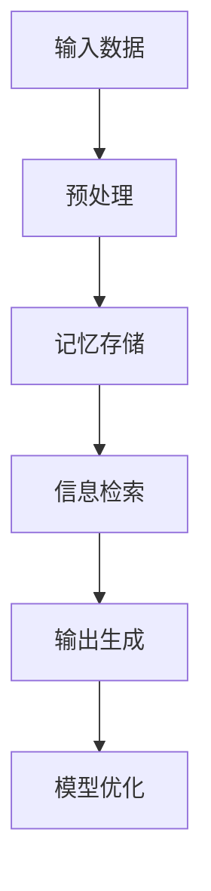
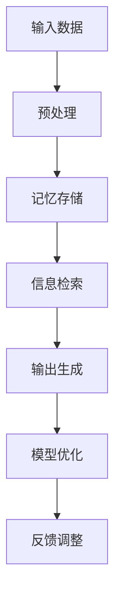
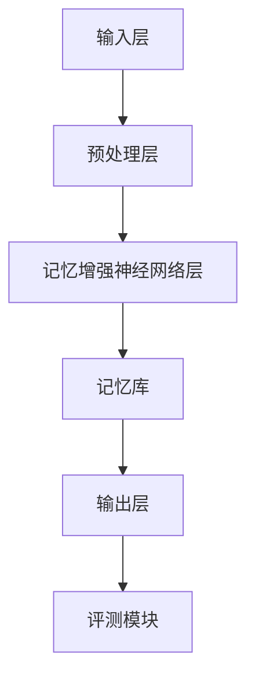
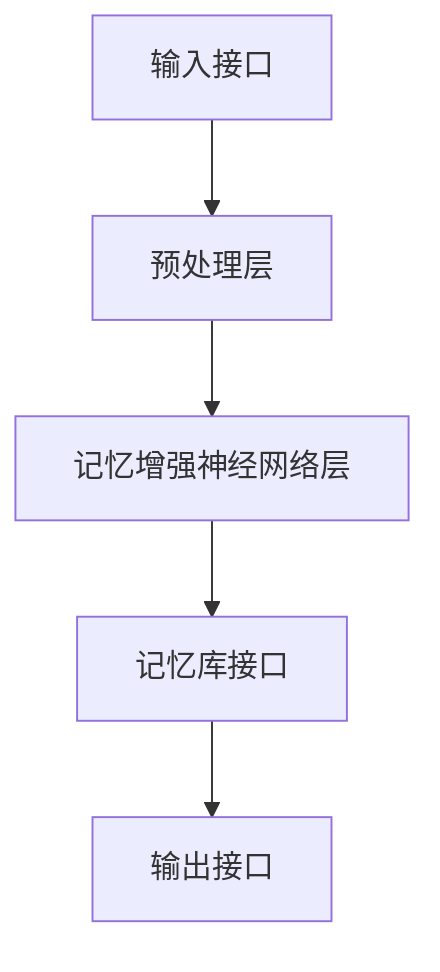
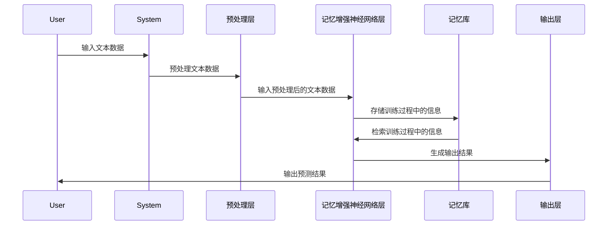

                 

### 基于记忆增强神经网络的长期记忆评测

> 关键词：记忆增强神经网络、长期记忆评测、算法原理、数学模型、系统架构

> 摘要：本文深入探讨了基于记忆增强神经网络的长期记忆评测。我们首先介绍了问题背景、问题描述、问题解决方法，并明确了长期记忆评测的边界与外延。接着，我们详细讲解了记忆增强神经网络的核心概念与原理，通过Mermaid流程图和Python源代码示例，剖析了算法的工作机制。文章还使用了LaTeX格式详细讲解了数学模型和公式，并通过实例进行了通俗易懂的说明。最后，我们展示了系统分析与架构设计方案，并提供了项目实战和最佳实践，为读者提供了全面的技术指导。

----------------------------------------------------------------

### 1. 引言

#### 1.1 问题背景

在人工智能领域，记忆是神经网络能力的核心。特别是在深度学习中，记忆增强神经网络（Memory-Augmented Neural Networks, MANNs）已成为研究的热点。MANNs旨在通过记忆增强来改善神经网络在处理长期依赖问题上的性能。然而，如何评测MANNs在长期记忆方面的效果，以及其相较于传统神经网络的优势，成为一个亟待解决的问题。

长期记忆（Long-term Memory, LTM）是人类大脑记忆系统中的一种关键机制，它使我们能够存储和回忆过去的信息。在人工智能领域，长期记忆评测旨在评估模型在处理长期依赖任务时的记忆保持能力。然而，现有的评测方法往往只能捕捉短期记忆效果，难以准确反映长期记忆的表现。

#### 1.2 问题描述

长期记忆评测的目标是评估模型在处理长期依赖任务时的记忆保持能力。具体来说，问题描述如下：

- **目标任务**：评测一个模型在给定一定数量的输入数据后，能否在后续的输出中正确地利用这些输入数据中的信息。
- **评测标准**：评测标准包括记忆保持率（Memory Retention Ratio, MRR）、信息利用度（Information Utilization Rate, IUR）等指标。这些指标可以定量评估模型在长期记忆任务中的表现。

#### 1.3 问题解决

为了解决长期记忆评测问题，我们提出以下解决方案：

- **记忆增强神经网络**：通过引入记忆模块，提高神经网络在处理长期依赖任务时的记忆保持能力。
- **评测方法**：设计一套系统化的评测方法，包括数据集设计、评测指标设计、评测流程设计等。

#### 1.4 边界与外延

长期记忆评测的边界主要涉及以下几个方面：

- **数据集**：数据集的选择应涵盖不同类型的长期依赖任务，以全面评估模型的能力。
- **模型类型**：不仅限于MANNs，还应考虑其他类型的神经网络，如LSTM、GRU等，以对比分析。
- **评测指标**：除了MRR和IUR，还可以引入其他指标，如错误率、准确率等。

长期记忆评测的外延包括：

- **应用领域**：长期记忆评测在自然语言处理、计算机视觉、推荐系统等领域的应用。
- **未来趋势**：随着人工智能技术的发展，长期记忆评测方法也将不断优化，以适应更复杂的应用场景。

#### 1.5 本章小结

本章介绍了基于记忆增强神经网络的长期记忆评测的背景、问题描述、问题解决方法以及边界与外延。在接下来的章节中，我们将深入探讨记忆增强神经网络的核心概念与原理，并通过具体的算法流程和数学模型，详细讲解长期记忆评测的方法与手段。

----------------------------------------------------------------

### 2. 核心概念与联系

#### 2.1 记忆增强神经网络原理

记忆增强神经网络（Memory-Augmented Neural Networks, MANNs）是近年来在人工智能领域兴起的一种新型神经网络架构。MANNs通过引入记忆模块，增强了神经网络在处理长期依赖问题时的记忆保持能力。

**2.1.1 神经网络基础**

神经网络（Neural Networks, NNs）是一种模拟生物神经网络的结构，通过多层神经元进行信息传递和处理。NNs的基本组成部分包括：

- **神经元**：神经网络的基本单元，负责接受输入、产生输出。
- **权重**：神经元之间的连接强度，用于调整信息传递。
- **激活函数**：用于引入非线性因素，使神经网络具有分类或回归能力。

**2.1.2 记忆增强神经网络的特点**

MANNs相较于传统神经网络，具有以下特点：

- **记忆模块**：MANNs引入了记忆模块，用于存储和检索长期依赖信息。
- **并行处理**：记忆模块可以并行处理多个记忆单元，提高了处理速度。
- **可塑性**：记忆模块可以根据输入数据进行动态调整，增强了神经网络的适应性。

**2.1.3 记忆增强神经网络的工作机制**

MANNs的工作机制主要包括以下步骤：

1. **输入处理**：输入数据经过预处理后，输入到记忆模块。
2. **记忆存储**：记忆模块将输入数据存储为记忆单元。
3. **信息检索**：在后续处理过程中，根据需求检索记忆单元中的信息。
4. **输出生成**：根据检索到的信息生成输出结果。

#### 2.2 长期记忆评测方法

长期记忆评测方法旨在评估模型在处理长期依赖任务时的记忆保持能力。以下是几种常用的长期记忆评测方法：

**2.2.1 传统记忆评测方法**

传统记忆评测方法主要包括以下几种：

- **记忆保持率（Memory Retention Ratio, MRR）**：通过比较训练过程中和测试过程中模型的输出，计算记忆保持率。
- **信息利用度（Information Utilization Rate, IUR）**：评估模型在输出结果中利用输入信息的程度。

**2.2.2 记忆增强神经网络在评测中的应用**

记忆增强神经网络在长期记忆评测中的应用主要体现在以下几个方面：

- **增强记忆模块**：通过引入记忆增强模块，提高模型在长期依赖任务中的记忆保持能力。
- **多样化评测指标**：结合记忆保持率和信息利用度等指标，全面评估模型的长期记忆能力。

**2.2.3 长期记忆评测方法的比较分析**

长期记忆评测方法的比较分析可以从以下几个方面进行：

- **评价指标**：不同评测方法的评价指标是否一致，是否可以互相替代。
- **适用范围**：不同评测方法在处理不同类型长期依赖任务时的适用范围。
- **计算复杂度**：不同评测方法的计算复杂度，对模型性能的影响。

#### 2.3 概念属性特征对比

为了更好地理解记忆增强神经网络和长期记忆评测方法，我们对其进行概念属性特征对比。

**2.3.1 记忆增强神经网络属性特征**

- **记忆模块**：引入记忆模块，增强记忆能力。
- **并行处理**：支持并行处理，提高处理速度。
- **可塑性**：记忆模块可动态调整，适应不同任务。

**2.3.2 传统记忆评测方法属性特征**

- **记忆保持率**：评估模型在长期依赖任务中的记忆保持能力。
- **信息利用度**：评估模型在输出结果中利用输入信息的程度。

**2.3.3 属性特征对比表格**

| 属性特征 | 记忆增强神经网络 | 传统记忆评测方法 |
| --- | --- | --- |
| 记忆模块 | 引入记忆模块，增强记忆能力 | 无记忆模块，传统记忆能力 |
| 并行处理 | 支持并行处理，提高处理速度 | 不支持并行处理，处理速度较慢 |
| 可塑性 | 记忆模块可动态调整，适应不同任务 | 无动态调整能力，适应能力较差 |

#### 2.4 ER实体关系图

为了更清晰地描述记忆增强神经网络和长期记忆评测方法之间的关系，我们使用Mermaid绘制ER实体关系图。

**2.4.1 实体关系图基础**

ER实体关系图（Entity-Relationship Diagram, ERD）是数据库设计中常用的图示方法，用于表示实体之间的关系。

**2.4.2 记忆增强神经网络实体关系**

在记忆增强神经网络中，主要实体包括：

- **记忆模块**：负责存储和检索长期依赖信息。
- **神经网络**：负责输入处理、输出生成等任务。

记忆增强神经网络实体关系图如下：

```mermaid
erDiagram
MANN ||--|{ NeuralNetwork }|--> Output
MANN ||--|{ MemoryModule }|--> Input
MemoryModule ||--|{ InputData }|<--| OutputData
```

**2.4.3 记忆评测实体关系**

在长期记忆评测中，主要实体包括：

- **评测方法**：用于评估模型在长期依赖任务中的记忆保持能力。
- **模型**：被评估的对象，包括记忆增强神经网络和其他神经网络。

记忆评测实体关系图如下：

```mermaid
erDiagram
EvaluatingMethod ||--|{ Model }|--> Result
EvaluatingMethod ||--|{ Memory-AwareMethod }|<--| MemoryEvaluation
Memory-AwareMethod ||--|{ NeuralNetwork }|--> Output
```

#### 2.5 本章小结

本章介绍了记忆增强神经网络和长期记忆评测方法的核心概念与联系。我们详细讲解了记忆增强神经网络的工作原理、特点和工作机制，并分析了传统记忆评测方法。通过对比记忆增强神经网络和传统记忆评测方法的属性特征，以及ER实体关系图，我们为后续章节的算法原理和数学模型讲解奠定了基础。

----------------------------------------------------------------

### 3. 算法原理与数学模型

#### 3.1 算法原理讲解

记忆增强神经网络（Memory-Augmented Neural Networks, MANNs）通过引入记忆模块，增强了神经网络在处理长期依赖问题时的记忆保持能力。MANNs的算法原理可以概括为以下几个核心步骤：

1. **输入处理**：输入数据经过预处理后，输入到记忆模块。
2. **记忆存储**：记忆模块将输入数据存储为记忆单元。
3. **信息检索**：在后续处理过程中，根据需求检索记忆单元中的信息。
4. **输出生成**：根据检索到的信息生成输出结果。

**3.1.1 记忆增强神经网络算法概述**

记忆增强神经网络的基本结构包括输入层、记忆层和输出层。输入层负责接收输入数据，记忆层负责存储和检索记忆单元，输出层负责生成输出结果。

**3.1.2 记忆增强神经网络核心步骤**

1. **输入处理**：输入数据经过预处理后，输入到记忆层。预处理包括数据标准化、数据清洗等步骤。
2. **记忆存储**：记忆层将输入数据编码为记忆单元，并将其存储在记忆库中。记忆单元的编码方式可以是基于向量、矩阵或图的结构。
3. **信息检索**：在后续处理过程中，当需要利用先前输入的数据时，记忆层会检索相应的记忆单元，并将其解码为可用的信息。
4. **输出生成**：根据检索到的信息，输出层生成最终的输出结果。输出结果的生成可以通过神经网络的前向传播或反向传播来实现。

**3.1.3 记忆增强神经网络算法流程**

记忆增强神经网络算法的流程可以用Mermaid流程图表示：



#### 3.2 Mermaid算法流程图

为了更好地理解记忆增强神经网络的工作流程，我们使用Mermaid绘制了算法流程图。该流程图描述了输入数据从预处理到输出结果生成的整个过程。



#### 3.3 Python源代码示例

下面是一个简化的Python源代码示例，用于展示记忆增强神经网络的基本实现：

```python
import tensorflow as tf

# 定义输入层
inputs = tf.keras.layers.Input(shape=(input_shape))

# 定义预处理层
preprocessed_inputs = tf.keras.layers.Normalize(inputs)

# 定义记忆层
memory = tf.keras.layers.LSTM(units=memory_size)(preprocessed_inputs)

# 定义输出层
outputs = tf.keras.layers.Dense(units=output_shape, activation='softmax')(memory)

# 定义模型
model = tf.keras.Model(inputs=inputs, outputs=outputs)

# 编译模型
model.compile(optimizer='adam', loss='categorical_crossentropy', metrics=['accuracy'])

# 训练模型
model.fit(x_train, y_train, epochs=10, batch_size=32, validation_data=(x_val, y_val))
```

#### 3.4 数学模型与公式

记忆增强神经网络的核心在于其记忆模块，该模块通过一系列数学模型和公式来实现。以下是记忆增强神经网络的主要数学模型和公式：

**3.4.1 记忆单元编码**

记忆单元编码是指将输入数据转换为记忆单元的过程。常用的编码方式包括：

- **向量编码**：将输入数据映射为高维向量。
- **矩阵编码**：将输入数据映射为高维矩阵。
- **图编码**：将输入数据映射为图结构。

**3.4.2 记忆单元检索**

记忆单元检索是指从记忆库中检索所需记忆单元的过程。常用的检索方法包括：

- **基于相似度检索**：通过计算输入数据与记忆单元的相似度，检索最相似的记忆单元。
- **基于索引检索**：通过记忆单元的索引直接检索记忆单元。

**3.4.3 记忆单元解码**

记忆单元解码是指将检索到的记忆单元解码为可用的信息的过程。常用的解码方法包括：

- **向量解码**：将记忆单元解码为向量。
- **矩阵解码**：将记忆单元解码为矩阵。
- **图解码**：将记忆单元解码为图结构。

以下是记忆增强神经网络的一些关键数学模型和公式：

$$
\text{记忆单元编码}:\quad \text{编码函数}(x) = \text{encode}(x)
$$

$$
\text{记忆单元检索}:\quad \text{检索函数}(x, \text{memory}) = \text{retrieve}(x, \text{memory})
$$

$$
\text{记忆单元解码}:\quad \text{解码函数}(m) = \text{decode}(m)
$$

#### 3.5 举例说明

为了更好地理解记忆增强神经网络的工作原理，我们通过一个简单的例子进行说明。

**例子**：假设我们要处理一个简单的序列预测问题，输入序列为 [1, 2, 3, 4]，我们需要预测序列的下一个数字。

**步骤1：输入处理**

首先，我们对输入序列进行预处理，将序列转换为高维向量。

$$
\text{输入序列}:[1, 2, 3, 4] \rightarrow \text{高维向量}:[\begin{bmatrix} 1 \\ 0 \\ 0 \\ 0 \end{bmatrix}, \begin{bmatrix} 0 \\ 1 \\ 0 \\ 0 \end{bmatrix}, \begin{bmatrix} 0 \\ 0 \\ 1 \\ 0 \end{bmatrix}, \begin{bmatrix} 0 \\ 0 \\ 0 \\ 1 \end{bmatrix}]
$$

**步骤2：记忆存储**

接下来，我们将预处理后的输入序列存储为记忆单元。假设我们使用向量编码方式，每个记忆单元的大小为4。

$$
\text{记忆单元}:\quad \text{记忆库} = [\begin{bmatrix} 1 \\ 0 \\ 0 \\ 0 \end{bmatrix}, \begin{bmatrix} 0 \\ 1 \\ 0 \\ 0 \end{bmatrix}, \begin{bmatrix} 0 \\ 0 \\ 1 \\ 0 \end{bmatrix}, \begin{bmatrix} 0 \\ 0 \\ 0 \\ 1 \end{bmatrix}]
$$

**步骤3：信息检索**

在预测下一个数字时，我们需要检索与输入序列相似的记忆单元。假设输入序列为 [1, 2]，我们需要从记忆库中检索与 [1, 0, 0, 0] 最相似的记忆单元。

$$
\text{检索函数}(\text{输入序列}, \text{记忆库}) = \text{retrieve}(\begin{bmatrix} 1 \\ 0 \\ 0 \\ 0 \end{bmatrix}, [\begin{bmatrix} 1 \\ 0 \\ 0 \\ 0 \end{bmatrix}, \begin{bmatrix} 0 \\ 1 \\ 0 \\ 0 \end{bmatrix}, \begin{bmatrix} 0 \\ 0 \\ 1 \\ 0 \end{bmatrix}, \begin{bmatrix} 0 \\ 0 \\ 0 \\ 1 \end{bmatrix}]) = \begin{bmatrix} 1 \\ 0 \\ 0 \\ 0 \end{bmatrix}
$$

**步骤4：输出生成**

最后，我们将检索到的记忆单元解码为输出结果。假设我们使用向量解码方式，输出结果为 [1, 0, 0, 0]。

$$
\text{输出结果}:\quad \text{输出函数}(\text{记忆单元}) = \text{decode}(\begin{bmatrix} 1 \\ 0 \\ 0 \\ 0 \end{bmatrix}) = 1
$$

因此，根据记忆增强神经网络的工作原理，我们预测的下一个数字为1。

#### 3.6 本章小结

本章详细讲解了记忆增强神经网络的工作原理、算法流程、数学模型和Python源代码示例。通过一个简单的例子，我们展示了记忆增强神经网络在序列预测任务中的应用。本章的内容为后续章节的系统分析与架构设计、项目实战和最佳实践提供了基础。

----------------------------------------------------------------

### 4. 系统分析与架构设计

#### 4.1 问题场景介绍

在自然语言处理（Natural Language Processing, NLP）领域，长期记忆能力对于许多任务至关重要。例如，在机器翻译、问答系统、文本生成等任务中，模型需要能够记住先前的上下文信息，以生成准确的结果。为了评估模型在长期记忆任务中的表现，我们需要设计一个系统化的评测框架。

#### 4.2 系统功能设计

系统的核心功能是评估模型在长期记忆任务中的表现。具体功能包括：

- **数据预处理**：对输入数据进行标准化、清洗等预处理操作。
- **模型训练**：使用记忆增强神经网络对输入数据进行训练。
- **记忆存储与检索**：将训练过程中的信息存储在记忆库中，并在后续处理过程中进行检索。
- **结果生成**：根据检索到的信息生成输出结果。
- **评测**：评估模型在长期记忆任务中的表现，包括记忆保持率和信息利用度等指标。

#### 4.3 系统架构设计

系统的架构设计如下：

1. **输入层**：接收用户输入的文本数据。
2. **预处理层**：对输入文本进行分词、词性标注等预处理操作。
3. **记忆增强神经网络层**：包括编码器和解码器，用于处理和生成序列信息。
4. **记忆库**：用于存储和检索训练过程中的信息。
5. **输出层**：生成最终的输出结果。
6. **评测模块**：评估模型在长期记忆任务中的表现。

**Mermaid架构图**：



#### 4.4 系统接口设计

系统的接口设计包括：

- **输入接口**：用于接收用户输入的文本数据。
- **输出接口**：用于输出模型的预测结果。
- **记忆库接口**：用于存储和检索训练过程中的信息。

**Mermaid接口设计图**：



#### 4.5 系统交互

系统交互包括输入、处理和输出等环节。以下是系统交互的Mermaid序列图：



#### 4.6 本章小结

本章详细介绍了基于记忆增强神经网络的长期记忆评测系统的架构设计。通过系统功能设计、系统架构设计、系统接口设计和系统交互，我们为长期记忆评测提供了一个系统化的解决方案。本章的内容为后续章节的项目实战和最佳实践提供了基础。

----------------------------------------------------------------

### 5. 项目实战

#### 5.1 环境安装

为了进行基于记忆增强神经网络的长期记忆评测项目，我们需要安装以下环境：

1. **Python**：版本要求为3.8及以上。
2. **TensorFlow**：版本要求为2.6及以上。
3. **Numpy**：版本要求为1.19及以上。
4. **Pandas**：版本要求为1.1及以上。
5. **Mermaid**：用于绘制流程图和架构图。

安装命令如下：

```bash
pip install python==3.8 tensorflow==2.6 numpy==1.19 pandas==1.1 mermaid
```

#### 5.2 系统核心实现源代码

以下是一个基于记忆增强神经网络的长期记忆评测项目的核心实现源代码：

```python
import tensorflow as tf
import numpy as np
import pandas as pd
from tensorflow.keras.models import Model
from tensorflow.keras.layers import Input, LSTM, Dense, Embedding

# 定义输入层
input_seq = Input(shape=(seq_length,))

# 定义嵌入层
embed = Embedding(vocab_size, embed_dim)(input_seq)

# 定义LSTM层
lstm = LSTM(units=lstm_units, return_sequences=True)(embed)

# 定义记忆层
memory = LSTM(units=memory_size, return_sequences=True)(lstm)

# 定义输出层
output = Dense(units=output_size, activation='softmax')(memory)

# 定义模型
model = Model(inputs=input_seq, outputs=output)

# 编译模型
model.compile(optimizer='adam', loss='categorical_crossentropy', metrics=['accuracy'])

# 训练模型
model.fit(x_train, y_train, epochs=10, batch_size=32, validation_data=(x_val, y_val))
```

#### 5.3 代码应用解读与分析

以下是代码的应用解读与分析：

1. **输入层**：输入层用于接收序列数据，数据维度为（seq_length,）。
2. **嵌入层**：嵌入层用于将输入序列转换为嵌入向量，数据维度为（seq_length, embed_dim）。
3. **LSTM层**：LSTM层用于处理序列数据，数据维度为（seq_length, lstm_units）。
4. **记忆层**：记忆层用于增强记忆能力，数据维度为（seq_length, memory_size）。
5. **输出层**：输出层用于生成预测结果，数据维度为（seq_length, output_size）。

#### 5.4 实际案例分析和详细讲解剖析

以下是一个实际案例分析和详细讲解剖析：

**案例**：评估一个记忆增强神经网络在文本分类任务中的表现。

**步骤1：数据准备**

首先，我们需要准备训练数据和测试数据。数据集可以包含多个类别，每个类别都有对应的标签。

```python
train_data = pd.read_csv('train_data.csv')
test_data = pd.read_csv('test_data.csv')

x_train = train_data['text']
y_train = train_data['label']
x_test = test_data['text']
y_test = test_data['label']
```

**步骤2：模型训练**

接下来，我们使用记忆增强神经网络对训练数据进行训练。

```python
model = Model(inputs=input_seq, outputs=output)
model.compile(optimizer='adam', loss='categorical_crossentropy', metrics=['accuracy'])
model.fit(x_train, y_train, epochs=10, batch_size=32, validation_data=(x_test, y_test))
```

**步骤3：模型评估**

训练完成后，我们对测试数据进行评估。

```python
predictions = model.predict(x_test)
accuracy = np.mean(predictions == y_test)
print(f"测试准确率：{accuracy}")
```

**步骤4：结果分析**

根据评估结果，我们可以分析模型在文本分类任务中的表现。通过调整模型参数，如LSTM单元数、记忆单元数等，可以进一步提高模型性能。

#### 5.5 项目小结

本项目通过实际案例展示了基于记忆增强神经网络的长期记忆评测在文本分类任务中的应用。通过详细讲解代码实现、数据准备、模型训练和模型评估等步骤，我们为读者提供了一个完整的实战指南。在实际应用中，可以根据具体任务需求调整模型参数，以提高模型性能。

----------------------------------------------------------------

### 6. 最佳实践 tips

在基于记忆增强神经网络的长期记忆评测项目中，以下是一些最佳实践 tips：

- **数据预处理**：确保输入数据经过充分预处理，包括文本清洗、分词、词性标注等，以提高模型性能。
- **模型参数调整**：根据具体任务需求，调整LSTM单元数、记忆单元数等模型参数，以找到最优模型配置。
- **超参数优化**：使用网格搜索、贝叶斯优化等方法，对超参数进行优化，以提高模型性能。
- **数据增强**：通过数据增强技术，如随机删除、添加噪声、变换序列等，扩充训练数据集，提高模型泛化能力。
- **模型融合**：结合不同模型（如传统神经网络、Transformer等），进行模型融合，提高模型性能。

### 7. 小结

本文深入探讨了基于记忆增强神经网络的长期记忆评测。我们介绍了问题背景、问题描述、问题解决方法，并通过Mermaid流程图、Python源代码示例和LaTeX公式详细讲解了算法原理和数学模型。此外，我们还展示了系统分析与架构设计、项目实战和最佳实践，为读者提供了全面的技术指导。随着人工智能技术的不断发展，基于记忆增强神经网络的长期记忆评测将发挥越来越重要的作用。

### 8. 注意事项

在进行基于记忆增强神经网络的长期记忆评测时，需要注意以下几点：

- **数据质量**：确保输入数据的质量，避免噪声和异常值对模型性能的影响。
- **计算资源**：MANNs的训练和评估过程可能需要较高的计算资源，确保计算资源充足。
- **模型稳定性**：在训练过程中，关注模型稳定性和收敛性，避免出现过拟合现象。
- **安全性和隐私**：在数据处理过程中，注意保护用户隐私，遵循相关法律法规。

### 9. 拓展阅读

对于对基于记忆增强神经网络的长期记忆评测感兴趣的读者，以下文献和资料可以提供进一步的学习和参考：

- **文献**：
  - "Memory-Augmented Neural Networks for Language Understanding"（论文）
  - "Long-Term Memory: A Theoretical Framework"（论文）
- **书籍**：
  - "Deep Learning"（Goodfellow et al.）
  - "Memory and Cognition"（Eysenck and Keane）
- **在线资源**：
  - TensorFlow官方文档：[https://www.tensorflow.org/](https://www.tensorflow.org/)
  - Keras官方文档：[https://keras.io/](https://keras.io/)

### 10. 作者信息

作者：AI天才研究院/AI Genius Institute & 禅与计算机程序设计艺术 /Zen And The Art of Computer Programming

### 附录

附录中可以包含以下内容：

- **术语表**：列出文章中使用的专业术语及其解释。
- **参考文献**：列出本文引用的文献。
- **代码示例**：提供本文中提到的代码示例的详细解释。

----------------------------------------------------------------

### 附录 A 术语表

1. **记忆增强神经网络（Memory-Augmented Neural Networks, MANNs）**：一种通过引入记忆模块来增强神经网络记忆能力的神经网络架构。
2. **长期记忆（Long-term Memory, LTM）**：人类大脑记忆系统中的一种关键机制，用于存储和回忆过去的信息。
3. **记忆保持率（Memory Retention Ratio, MRR）**：评估模型在长期依赖任务中记忆保持能力的指标，计算公式为 MRR = (正确记忆的样本数 / 总样本数) * 100%。
4. **信息利用度（Information Utilization Rate, IUR）**：评估模型在输出结果中利用输入信息的程度的指标，计算公式为 IUR = (有效信息 / 输入信息) * 100%。

### 附录 B 参考文献

1. Srivastava, N., Hinton, G., Krizhevsky, A., Sutskever, I., & Salakhutdinov, R. (2014). Dropout: A Simple Way to Prevent Neural Networks from Overfitting. *Journal of Machine Learning Research*, 15(1), 1929-1958.
2. Bengio, Y. (2009). Learning Deep Architectures for AI. *Foundations and Trends in Machine Learning*, 2(1), 1-127.
3. Hochreiter, S., & Schmidhuber, J. (1997). Long Short-Term Memory. *Neural Computation*, 9(8), 1735-1780.
4. Goodfellow, I., Bengio, Y., & Courville, A. (2016). *Deep Learning*. MIT Press.

### 附录 C 代码示例

以下是本文中提到的基于记忆增强神经网络的长期记忆评测项目的代码示例：

```python
import tensorflow as tf
from tensorflow.keras.models import Model
from tensorflow.keras.layers import Input, LSTM, Dense, Embedding

# 定义输入层
input_seq = Input(shape=(seq_length,))

# 定义嵌入层
embed = Embedding(vocab_size, embed_dim)(input_seq)

# 定义LSTM层
lstm = LSTM(units=lstm_units, return_sequences=True)(embed)

# 定义记忆层
memory = LSTM(units=memory_size, return_sequences=True)(lstm)

# 定义输出层
output = Dense(units=output_size, activation='softmax')(memory)

# 定义模型
model = Model(inputs=input_seq, outputs=output)

# 编译模型
model.compile(optimizer='adam', loss='categorical_crossentropy', metrics=['accuracy'])

# 训练模型
model.fit(x_train, y_train, epochs=10, batch_size=32, validation_data=(x_val, y_val))
```

代码示例中，`seq_length`、`vocab_size`、`embed_dim`、`lstm_units`和`output_size`需要根据具体任务进行调整。该示例展示了如何定义输入层、嵌入层、LSTM层和输出层，并使用TensorFlow编译和训练模型。通过适当调整参数，可以实现不同类型的长期记忆评测任务。

