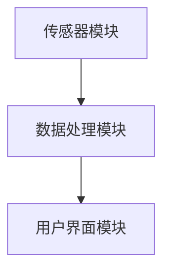
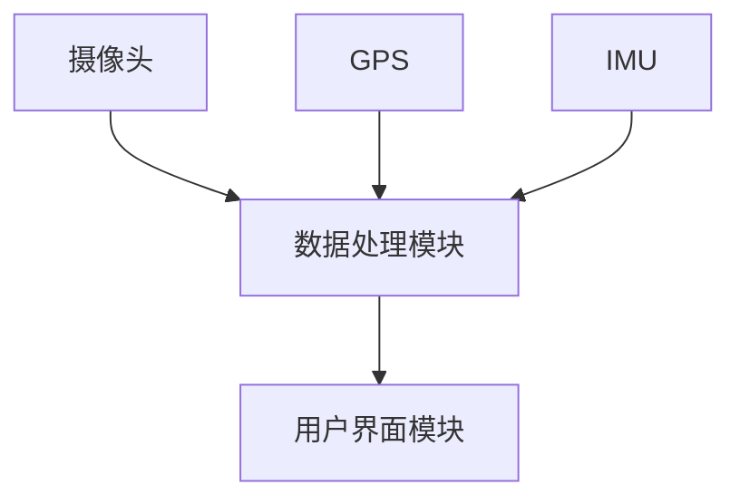
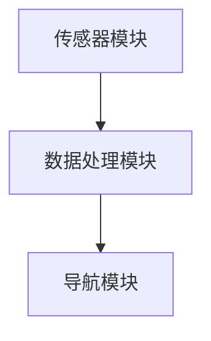
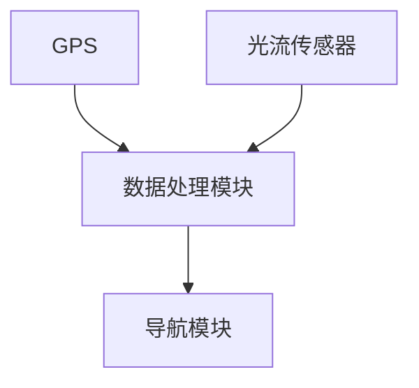
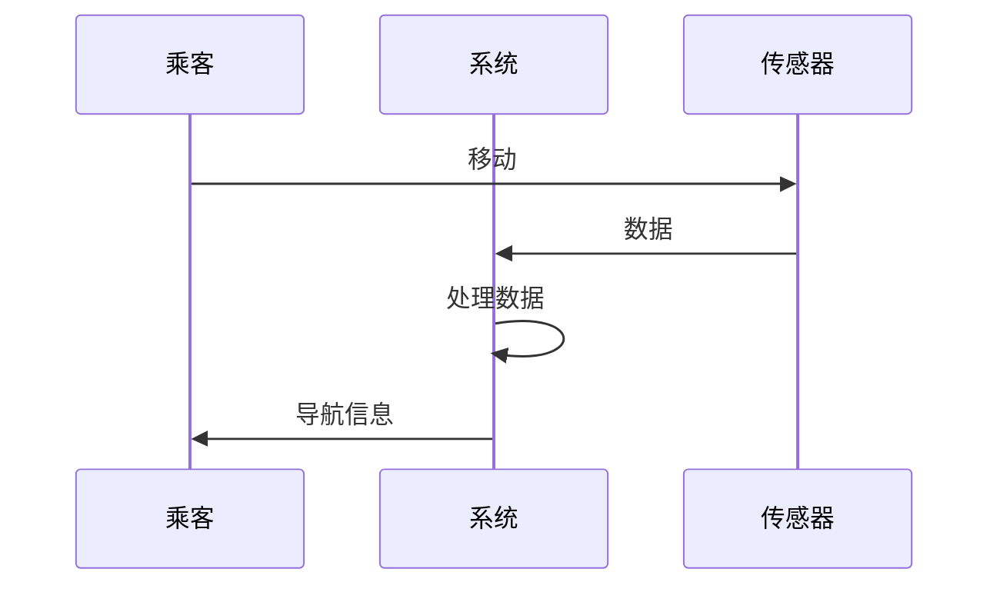

                 

### 增强现实的计算机视觉：实时定位的数学算法

关键词：增强现实、计算机视觉、实时定位、数学算法、卡尔曼滤波器

摘要：本文探讨了增强现实（AR）中的计算机视觉，重点分析了实时定位的数学算法。通过引入核心概念、背景介绍、算法原理讲解、数学模型推导以及实际案例剖析，文章旨在为读者提供全面、深入的技术见解，帮助理解和应用这些算法，为未来AR技术的发展提供理论基础和实践指导。

----------------------------------------------------------------

# 引言：增强现实、计算机视觉与实时定位

## 1. 增强现实

增强现实（Augmented Reality，简称AR）是一种通过计算机技术增强用户现实感知的技术。它通过在现实场景中叠加虚拟信息，为用户提供了一种全新的交互方式。增强现实技术广泛应用于游戏、教育、医疗、军事等多个领域。

### 1.1 核心概念

- **增强现实（AR）**：通过计算机生成的虚拟信息叠加到真实场景中，为用户提供更加丰富的感知体验。
- **虚拟信息**：可以是文字、图像、声音或其他多媒体内容，它们被叠加到现实场景中，与真实场景相互融合。

### 1.2 问题背景

在增强现实技术中，实时定位是关键的一环。它能够确保虚拟信息准确地叠加到真实场景中，提高用户体验。然而，实现实时定位面临着诸多挑战，包括环境噪声、计算资源限制等。

### 1.3 问题描述

实时定位问题可以描述为：在一个未知或部分已知的场景中，利用传感器获取的信息，估计系统的位置和姿态。该问题需要解决的关键包括：

- **传感器数据融合**：如何将不同类型传感器（如摄像头、GPS、陀螺仪等）的数据进行融合，以获得更准确的位置信息。
- **动态环境适应**：如何处理场景中的动态变化，如行人、车辆等。

### 1.4 问题解决

实时定位问题的解决方法主要依赖于数学算法，尤其是滤波器和追踪算法。卡尔曼滤波器、光流算法和SLAM算法是其中常用的几种。

### 1.5 边界与外延

实时定位不仅应用于增强现实，还广泛应用于自动驾驶、机器人导航、虚拟现实等领域。随着技术的进步，实时定位的精度和实时性将不断提高。

## 2. 实时定位基本概念与挑战

### 2.1 实时定位定义

实时定位（Real-Time Localization）是指在实时环境中，通过传感器获取的信息，对系统（如无人机、机器人等）的位置和姿态进行估计。

### 2.2 关键挑战

- **环境噪声**：传感器数据可能受到环境噪声的干扰，影响定位精度。
- **计算资源限制**：实时定位需要在有限的时间内完成，对计算资源的需求较高。
- **动态变化**：现实环境中的动态变化（如行人、车辆等）会影响定位结果。
- **多传感器融合**：如何有效地融合来自不同传感器的数据，提高定位精度。

## 3. 数学算法基础

### 3.1 线性代数基础

线性代数是实时定位算法的基础。以下是一些核心概念：

- **矩阵运算**：包括矩阵的加法、减法、乘法等。
- **向量运算**：包括向量的加法、减法、点积、叉积等。
- **特征值与特征向量**：用于分析矩阵的稳定性。

### 3.2 最小二乘法

最小二乘法是一种常用的优化方法，用于求解线性最小二乘问题。它通过最小化残差平方和来求解最优解。

### 3.3 贝叶斯滤波

贝叶斯滤波是一种基于贝叶斯理论的优化方法，用于在不确定环境中进行状态估计。它通过更新先验概率分布来获得后验概率分布。

## 4. 实时定位算法原理

### 4.1 卡尔曼滤波器

卡尔曼滤波器是一种线性滤波器，用于在不确定环境中进行状态估计。它通过递推公式来更新状态估计值。

### 4.2 光流算法

光流算法是一种基于视频帧序列的定位方法，通过计算相邻帧之间的像素运动，估计系统的位置和姿态。

### 4.3 SLAM算法

SLAM（Simultaneous Localization and Mapping）算法是一种同时进行定位和建图的算法。它通过在未知环境中移动，逐步建立环境地图，并实时更新位置信息。

## 5. 实时定位算法实现

### 5.1 实现步骤

实时定位算法的实现通常包括以下步骤：

- **初始化**：设置初始状态和参数。
- **数据采集**：从传感器获取数据。
- **预处理**：对传感器数据进行预处理，如滤波、去噪等。
- **状态估计**：使用滤波器或追踪算法进行状态估计。
- **结果输出**：输出定位结果，如位置和姿态。

### 5.2 Python源代码

以下是使用Python实现卡尔曼滤波器的示例代码：

```python
import numpy as np

def kalman_filter(measurement, process_variance, measurement_variance):
    """
   卡尔曼滤波器实现
    """
    # 初始化状态和误差协方差矩阵
    state = np.array([0.0, 0.0])  # 状态向量 [位置，速度]
    state_variance = np.array([[1.0, 0.0],
                              [0.0, 1.0]])  # 误差协方差矩阵

    # 递推公式
    def predict():
        # 状态预测
        state = np.dot(F, state)
        state_variance = np.dot(F, state_variance) @ F.T + Q

    # 更新公式
    def update(measurement):
        # 计算卡尔曼增益
        K = np.dot(state_variance @ H.T, (H @ state_variance @ H.T + R).inv())

        # 更新状态
        state = state + np.dot(K, (measurement - np.dot(H, state)))

        # 更新误差协方差矩阵
        state_variance = (I - np.dot(K, H)) @ state_variance

    # 主循环
    while True:
        predict()
        if measurement is not None:
            update(measurement)
        yield state

# 示例使用
measurement_variance = 1.0
process_variance = 0.1
measurement = 1.0

filter = kalman_filter(measurement, process_variance, measurement_variance)
for i in range(10):
    state = next(filter)
    print(f"Step {i}: State = {state}")
```

## 6. 算法性能评估

### 6.1 评估指标

算法性能评估通常包括以下指标：

- **定位精度**：评估算法定位结果的准确性。
- **响应时间**：评估算法在给定时间内完成定位的能力。
- **鲁棒性**：评估算法在噪声和异常数据情况下的稳定性。

### 6.2 评估方法

评估方法通常包括：

- **模拟环境测试**：在模拟环境中，评估算法在不同条件下的性能。
- **实际场景测试**：在真实场景中，评估算法的性能。

## 7. 应用案例研究

### 7.1 案例一：室内定位

室内定位是一个典型的实时定位应用场景。以下是一个使用SLAM算法进行室内定位的案例：

- **项目介绍**：使用SLAM算法在室内环境中进行定位，实现对特定区域的准确导航。
- **系统功能设计**：设计包括传感器数据采集、状态估计和结果输出等功能模块。
- **系统架构设计**：使用Mermaid架构图展示系统架构，包括传感器、处理器和用户界面等。
- **系统接口设计**：设计系统接口，包括数据输入输出接口和用户交互接口。

### 7.2 案例二：室外导航

室外导航是另一个常见的实时定位应用场景。以下是一个使用GPS和光流算法进行室外导航的案例：

- **项目介绍**：在室外环境中，结合GPS和光流算法，实现实时导航功能。
- **系统功能设计**：设计包括GPS数据采集、光流数据采集和导航算法等功能模块。
- **系统架构设计**：使用Mermaid架构图展示系统架构，包括传感器、处理器和导航模块等。
- **系统接口设计**：设计系统接口，包括GPS数据输入输出接口和导航指令输出接口。

## 8. 未来展望与挑战

### 8.1 发展趋势

随着增强现实技术的发展，实时定位的需求将不断增长。未来，实时定位算法将朝着更高精度、更低延迟、更强鲁棒性的方向发展。

### 8.2 挑战与机遇

实时定位面临的挑战包括：

- **环境噪声**：如何有效抑制环境噪声，提高定位精度。
- **计算资源**：如何在有限计算资源下，实现高效实时定位。
- **动态环境**：如何处理动态环境中的变化，提高算法的鲁棒性。

机遇包括：

- **硬件升级**：随着硬件性能的提升，实时定位算法将具备更高的计算能力和精度。
- **多传感器融合**：通过融合多种传感器数据，提高定位精度和实时性。

## 9. 总结与拓展阅读

实时定位是增强现实技术中的关键环节，通过数学算法实现。本文介绍了增强现实、计算机视觉和实时定位的基本概念，分析了实时定位算法的原理和实现，并通过实际案例进行了剖析。未来，实时定位技术将不断进步，为增强现实等领域的应用提供更强支持。

拓展阅读：

- 《卡尔曼滤波器与Python实现》：详细介绍了卡尔曼滤波器的原理和实现。
- 《增强现实技术与应用》：探讨了增强现实技术的最新发展和应用场景。

作者：AI天才研究院/AI Genius Institute & 禅与计算机程序设计艺术 /Zen And The Art of Computer Programming

----------------------------------------------------------------

### 深入解读：增强现实与计算机视觉

在深入探讨增强现实（AR）与计算机视觉（CV）之前，有必要先对这些核心概念进行详细解读。这将帮助我们更好地理解实时定位的数学算法如何在这些领域中发挥作用。

#### 增强现实（AR）

增强现实是一种通过技术手段增强用户现实感知的技术。它通过在用户眼前的显示设备（如智能手机、头戴式显示器等）上叠加虚拟信息，使用户能够同时看到现实世界和虚拟世界。这些虚拟信息可以是文字、图像、声音或者其他多媒体内容，它们被实时地叠加到用户的视野中。

#### 计算机视觉（CV）

计算机视觉是使计算机具备“看”和“理解”图像、视频和其他视觉信息的能力的学科。它涉及图像处理、模式识别、机器学习等多个领域。计算机视觉技术可以用于人脸识别、物体检测、场景重建等多种应用。

#### 增强现实与计算机视觉的关系

增强现实和计算机视觉之间有着密切的联系。计算机视觉技术为增强现实提供了图像处理、目标识别、场景重建等重要功能。例如：

- **图像识别**：计算机视觉技术可以识别图像中的物体和场景，从而确定虚拟信息叠加的位置和方式。
- **场景重建**：通过计算机视觉技术，可以将现实场景重建为三维模型，为增强现实提供更丰富的交互体验。
- **手势识别**：计算机视觉技术可以识别用户的手势，从而实现与虚拟信息的高级交互。

#### 实时定位在AR和CV中的重要性

实时定位是增强现实和计算机视觉中的关键环节。它确保虚拟信息准确地叠加到现实场景中，提高用户体验。实时定位的关键挑战包括：

- **实时性**：实时定位需要在短时间内完成，以支持增强现实应用的高交互性。
- **准确性**：实时定位需要高精度的位置和姿态估计，以确保虚拟信息与现实世界的准确叠加。
- **鲁棒性**：实时定位需要在各种环境下保持稳定，包括光照变化、遮挡和动态环境等。

#### 实时定位的基本概念与挑战

实时定位的基本概念包括位置和姿态估计。位置是指物体在三维空间中的坐标，而姿态是指物体的方向和朝向。

实时定位面临的挑战主要包括：

- **环境噪声**：传感器数据可能受到环境噪声的干扰，影响定位精度。
- **计算资源限制**：实时定位需要在有限的时间内完成，对计算资源的需求较高。
- **动态环境适应**：如何处理场景中的动态变化，如行人、车辆等。
- **多传感器融合**：如何有效地融合来自不同传感器的数据，提高定位精度。

通过理解增强现实、计算机视觉以及实时定位的基本概念和关系，我们为后续的算法原理讲解和案例分析奠定了基础。接下来，我们将详细探讨实时定位的数学算法，包括卡尔曼滤波器、光流算法和SLAM算法，并分析这些算法的原理和实现。

----------------------------------------------------------------

### 实时定位算法原理：卡尔曼滤波器

卡尔曼滤波器（Kalman Filter）是一种高效的线性滤波器，广泛应用于信号处理和状态估计领域。在实时定位中，卡尔曼滤波器被用来估计系统的位置和姿态。它通过递推公式，利用前一时刻的估计值和当前时刻的观测值，更新对当前时刻系统状态的估计。

#### 卡尔曼滤波器的工作原理

卡尔曼滤波器的工作原理可以分为两个阶段：预测阶段和更新阶段。

##### 预测阶段

在预测阶段，卡尔曼滤波器根据前一时刻的系统状态和状态转移模型，预测当前时刻的系统状态。

- **状态预测**：根据前一时刻的估计值和状态转移矩阵，预测当前时刻的系统状态。

  $$ \hat{x}_k|k-1 = F_k \hat{x}_{k-1}|k-1 + B_k u_k $$

  其中，$\hat{x}_k|k-1$表示在时间$k$时，基于时间$k-1$的估计值，$F_k$是状态转移矩阵，$B_k$是控制输入矩阵，$u_k$是控制输入。

- **预测误差协方差**：根据预测误差模型，计算当前时刻的预测误差协方差。

  $$ P_k|k-1 = F_k P_{k-1}|k-1 F_k^T + Q_k $$

  其中，$P_k|k-1$是预测误差协方差，$Q_k$是过程噪声协方差矩阵。

##### 更新阶段

在更新阶段，卡尔曼滤波器根据当前时刻的观测值，更新对系统状态的估计。

- **卡尔曼增益**：计算卡尔曼增益，用于调整预测值以适应观测值。

  $$ K_k = P_k|k-1 H_k^T (H_k P_k|k-1 H_k^T + R_k)^{-1} $$

  其中，$K_k$是卡尔曼增益，$H_k$是观测矩阵，$R_k$是观测噪声协方差矩阵。

- **更新状态估计**：使用观测值和卡尔曼增益，更新当前时刻的系统状态估计。

  $$ \hat{x}_k|k = \hat{x}_k|k-1 + K_k (z_k - H_k \hat{x}_k|k-1) $$

  其中，$\hat{x}_k|k$是在时间$k$时基于时间$k$的观测值更新后的估计值，$z_k$是实际观测值。

- **更新误差协方差**：根据更新后的状态估计，更新误差协方差。

  $$ P_k|k = (I - K_k H_k) P_k|k-1 $$

  其中，$P_k|k$是更新后的误差协方差。

#### Python实现示例

以下是一个简单的卡尔曼滤波器实现示例：

```python
import numpy as np

# 初始化参数
F = np.array([[1, 1],
              [0, 1]], dtype=np.float64)
H = np.array([[1, 0]], dtype=np.float64)
Q = np.array([[1, 0],
              [0, 1]], dtype=np.float64)
R = np.array([[1]], dtype=np.float64)
I = np.eye(2, dtype=np.float64)

# 初始化状态
x = np.array([0, 0], dtype=np.float64)
P = np.eye(2, dtype=np.float64)

# 模拟数据
z = np.array([1, 2], dtype=np.float64)

# 预测
x_pred = np.dot(F, x)
P_pred = np.dot(F, P).dot(F.T) + Q

# 更新
K = np.dot(P_pred, H.T).dot((H.dot(P_pred).dot(H.T) + R).I)
x = x_pred + np.dot(K, (z - np.dot(H, x_pred)))
P = (I - np.dot(K, H)).dot(P_pred)

print("Predicted x: ", x_pred)
print("Updated x: ", x)
print("Predicted P: ", P_pred)
print("Updated P: ", P)
```

#### 卡尔曼滤波器在实时定位中的应用

在实时定位中，卡尔曼滤波器被广泛用于融合来自不同传感器（如GPS、加速度计、陀螺仪等）的数据，提高位置和姿态估计的精度。以下是卡尔曼滤波器在实时定位中应用的一个简单示例：

1. **初始化**：设置初始位置和速度，以及相应的误差协方差。
2. **预测**：根据状态转移模型，预测下一时刻的位置和速度。
3. **更新**：根据观测数据，更新位置和速度的估计值。
4. **循环**：重复预测和更新步骤，逐步提高估计的精度。

#### 卡尔曼滤波器的优点与局限性

卡尔曼滤波器的优点包括：

- **线性特性**：卡尔曼滤波器基于线性模型，适用于线性系统。
- **高效性**：卡尔曼滤波器的计算复杂度较低，适合实时应用。
- **通用性**：卡尔曼滤波器可以用于各种状态估计问题。

然而，卡尔曼滤波器也存在一些局限性：

- **非线性系统**：卡尔曼滤波器不适用于非线性系统，需要扩展为扩展卡尔曼滤波器（EKF）或无迹卡尔曼滤波器（UKF）。
- **噪声模型**：卡尔曼滤波器对噪声模型有较强的依赖，需要准确估计过程噪声和观测噪声。

通过深入理解卡尔曼滤波器的原理和应用，我们可以更好地利用这一工具来提高实时定位的精度和可靠性。

----------------------------------------------------------------

### 实时定位算法原理：光流算法

光流算法（Optical Flow）是一种通过分析视频帧序列中像素运动，估计物体运动和相机运动的方法。它在实时定位中扮演着重要角色，尤其在动态环境中。光流算法能够提供连续的、实时的运动信息，为计算机视觉系统提供丰富的数据来源。

#### 光流算法的基本原理

光流算法的核心思想是利用相邻视频帧之间的像素运动，估计像素的瞬时速度。这一过程通常分为以下几个步骤：

1. **帧差计算**：通过计算相邻帧之间的像素差异，得到初步的光流向量。
2. **光流估计**：对帧差结果进行优化处理，得到准确的光流向量。
3. **运动参数估计**：根据光流向量，估计物体的运动和相机的运动。

#### 光流算法的工作过程

光流算法的工作过程可以分为两个阶段：初步光流估计和优化光流估计。

##### 初步光流估计

初步光流估计是通过计算相邻帧之间的像素差异来实现的。具体方法如下：

- **帧差计算**：对于每一对相邻帧，计算每一像素点的灰度值差异。

  $$ \Delta I(x, y) = I_{current}(x, y) - I_{previous}(x, y) $$

  其中，$I_{current}$和$I_{previous}$分别表示当前帧和前一帧的像素灰度值。

- **光流向量计算**：对帧差结果进行卷积处理，得到初步的光流向量。

  $$ \text{Flow}(x, y) = \frac{\Delta I(x, y)}{\Delta t} $$

  其中，$\Delta t$是相邻帧的时间间隔。

##### 优化光流估计

初步光流估计得到的只是光流向量的大致方向和大小，为了提高精度，通常需要通过优化算法进一步处理。优化光流估计的常用方法包括：

- **光流约束优化**：通过构建能量函数，对光流向量进行优化，使其满足某些约束条件。
- **迭代算法**：如卢斯算法（Lucas-Kanade Algorithm），通过迭代优化光流向量，逐步逼近真实值。

#### 光流算法在实时定位中的应用

光流算法在实时定位中具有以下应用：

- **相机运动估计**：通过分析光流向量，估计相机的运动，包括旋转和平移。
- **物体运动估计**：通过分析光流向量，估计场景中物体的运动。
- **动态场景适应**：光流算法能够实时处理动态场景中的变化，提高定位的鲁棒性。

#### Python实现示例

以下是一个简单的光流算法实现示例，使用卢斯算法：

```python
import numpy as np
import cv2

# 初始化参数
frame_size = (640, 480)
pyr_scale = 0.5
iterations = 10
win_size = (5, 5)
zero_crossing = True

# 载入视频
cap = cv2.VideoCapture(0)

# 检查视频是否打开成功
if not cap.isOpened():
    print("Error: Could not open video.")
    exit()

# 获取第一帧
ret, prev_frame = cap.read()
prev_frame_gray = cv2.cvtColor(prev_frame, cv2.COLOR_BGR2GRAY)

# 创建高斯模糊图像
prev_frame_gauss = cv2.GaussianBlur(prev_frame_gray, win_size, 0)

# 创建光流对象
optical_flow = cv2OpticalFlow_TVL1_create()

# 主循环
while True:
    # 获取当前帧
    ret, current_frame = cap.read()
    current_frame_gray = cv2.cvtColor(current_frame, cv2.COLOR_BGR2GRAY)

    # 计算光流
    flow = optical_flow.calc(prev_frame_gauss, current_frame_gray)

    # 绘制光流图
    mag, ang = cv2.cartToPolar(flow[..., 0], flow[..., 1])
    color = np hsv2rgb(mag / np.max(mag))
    current_frame[..., :2] = color

    # 显示结果
    cv2.imshow('Optical Flow', current_frame)

    # 更新前一帧
    prev_frame_gray = current_frame_gray.copy()
    prev_frame_gauss = cv2.GaussianBlur(prev_frame_gray, win_size, 0)

    # 检查是否按下ESC键
    if cv2.waitKey(1) & 0xFF == 27:
        break

# 释放资源
cap.release()
cv2.destroyAllWindows()
```

#### 光流算法的优点与局限性

光流算法的优点包括：

- **实时性**：光流算法能够在实时环境中进行运动估计，适用于动态场景。
- **鲁棒性**：光流算法对噪声和部分遮挡具有较强的鲁棒性。

然而，光流算法也存在一些局限性：

- **精度限制**：光流算法的精度受到帧差计算和优化算法的限制。
- **动态场景适应性**：在快速变化的动态场景中，光流算法可能难以准确估计运动。

通过深入理解光流算法的原理和应用，我们可以更好地利用这一工具来提高实时定位的实时性和鲁棒性。

----------------------------------------------------------------

### 实时定位算法原理：SLAM算法

SLAM（Simultaneous Localization and Mapping，同时定位与建图）算法是一种在未知环境中，通过传感器数据同时估计系统的位置和建立环境地图的方法。SLAM算法在增强现实、自动驾驶、机器人导航等领域具有广泛的应用。以下是SLAM算法的基本原理和实现方法。

#### SLAM算法的基本原理

SLAM算法的核心思想是通过传感器获取的数据，如图像、激光雷达和IMU（惯性测量单元）等，构建一个动态变化的环境地图，并实时估计系统的位置。SLAM算法通常包括以下步骤：

1. **特征提取**：从传感器数据中提取特征点，如角点、边缘和纹理。
2. **匹配**：将当前帧的特征点与地图中的特征点进行匹配，确定系统位置。
3. **优化**：使用优化算法，如梯度下降或EM算法，调整系统位置和地图，使其更符合观测数据。
4. **地图更新**：根据系统位置，更新地图中的点云或网格信息。

#### SLAM算法的实现方法

SLAM算法的实现方法可以分为基于视觉的SLAM和基于激光雷达的SLAM。以下是几种常见的SLAM算法：

##### 基于视觉的SLAM算法

基于视觉的SLAM算法利用图像数据，通过特征提取和匹配来估计系统位置。以下是几种常见的基于视觉的SLAM算法：

1. **特征点匹配SLAM**：通过特征点匹配来建立地图，并实时估计系统位置。
2. **基于视差的SLAM**：利用图像视差计算来估计系统位置，适用于快速移动的场景。
3. **ORB-SLAM**：一种基于光流的SLAM算法，利用ORB特征点匹配和光流跟踪，实现实时定位和地图构建。

##### 基于激光雷达的SLAM算法

基于激光雷达的SLAM算法利用激光雷达扫描环境，生成点云数据，并利用这些数据进行定位和地图构建。以下是几种常见的基于激光雷达的SLAM算法：

1. **基于点云匹配的SLAM**：通过点云匹配来建立地图，并实时估计系统位置。
2. **基于ICP（Iterative Closest Point）的SLAM**：利用ICP算法，逐步优化系统位置，使其与激光雷达扫描数据更匹配。
3. **LOAM（Lidar Odometry and Mapping）**：结合激光雷达测距和IMU数据，实现高精度的定位和地图构建。

#### SLAM算法的Python实现示例

以下是一个简单的基于激光雷达的SLAM算法实现示例，使用Python和PCL（Point Cloud Library）：

```python
import pcl
from pcl import kdtree
from pcl import search
from pcl import filter
from pcl import segmentation

# 载入激光雷达数据
cloud = pcl.loadPointCloud("laser_data.pcd")

# 创建KD树
tree = kdtree.KDTree.PointCloudT(cloud)

# 分割为前景和背景
segmenter = segmentation.SacSegmentation.PointCloudT(cloud)
segmenter.setOptimizeCoefficients(True)
segmenter.setModelType(segmentation.SacModelTypeModelTypeSphere)
segmenter.setMethodType(segmentation.SacSegmentationMethodTypePRISM)
segmenter.setDistanceThreshold(0.02)
segmenter.segment(mask)

# 前景点云
inliers = cloud[mask]
outliers = cloud[~mask]

# ICP优化
icp = filter.ICP.PointCloudT.PointCloudT(cloud)
icp.setTransformationEpsilon(1e-6)
icp.setMaxCorrespondenceDistance(0.05)
icp.setMaximumIterations(100)
icp.setInputTarget(inliers)
icp.setInputSource(outliers)
icp.align()

# 输出结果
print("ICP has converged:", icp.hasConverged())
print("Transformation matrix:", icp.getTransformationMatrix())
print("Correspondence distance:", icp.getCorrespondenceDistance())

# 绘制结果
source = icp.getInputSource()
target = icp.getInputTarget()
source.paintSELColor(0, 0, 255)
target.paintSELColor(255, 0, 0)

combined = source + target
pcl.savePCDFile("result.pcd", combined)
```

#### SLAM算法的优点与局限性

SLAM算法的优点包括：

- **高精度**：SLAM算法能够利用多种传感器数据，实现高精度的定位和地图构建。
- **实时性**：SLAM算法能够在实时环境中运行，适用于动态场景。
- **环境适应性**：SLAM算法能够适应不同的环境和场景，具有广泛的应用性。

然而，SLAM算法也存在一些局限性：

- **计算复杂度**：SLAM算法的计算复杂度较高，对硬件资源有较高要求。
- **定位精度限制**：在复杂环境中，SLAM算法的定位精度可能受到限制。
- **动态场景适应性**：在动态场景中，SLAM算法可能难以准确估计运动。

通过深入理解SLAM算法的原理和实现，我们可以更好地利用这一工具来实现实时定位和地图构建。

----------------------------------------------------------------

### 实时定位算法实现与性能评估

在了解了实时定位算法的基本原理后，我们接下来将讨论这些算法的实际实现和性能评估。性能评估是衡量算法优劣的关键步骤，它帮助我们了解算法在不同场景下的表现，并优化算法以适应具体需求。

#### 实际实现

1. **数据预处理**：在实现实时定位算法时，首先需要对传感器数据进行预处理。预处理步骤包括去噪、滤波和归一化等，以确保输入数据的质量。

2. **算法选择与配置**：根据应用场景和需求，选择合适的算法。例如，在动态环境中，卡尔曼滤波器和SLAM算法可能更为适用。此外，还需要对算法的参数进行配置，如过程噪声和观测噪声的协方差等。

3. **系统集成**：将算法集成到系统中，确保算法能够与传感器、处理器和用户界面等组件协同工作。系统设计时需要考虑实时性和计算资源限制。

4. **实时更新与反馈**：实时更新算法的状态估计结果，并根据用户反馈进行调整。例如，在增强现实应用中，实时更新虚拟信息的位置和姿态，以提供更好的用户体验。

#### 性能评估

1. **定位精度**：定位精度是评估实时定位算法的重要指标。通常使用均方误差（Mean Squared Error, MSE）或均方根误差（Root Mean Squared Error, RMSE）来衡量。高精度的算法能够提供更准确的位置和姿态估计。

2. **响应时间**：响应时间是指算法从接收到传感器数据到输出定位结果的时间。实时定位算法需要在短时间内完成计算，以满足实时性的要求。通常使用毫秒（ms）为单位来衡量响应时间。

3. **鲁棒性**：鲁棒性是指算法在不同环境下的稳定性和可靠性。评估算法的鲁棒性需要考虑各种环境因素，如光照变化、遮挡和动态场景等。

4. **计算资源消耗**：算法的计算复杂度直接影响系统的性能和实时性。评估算法的计算资源消耗包括CPU和GPU的使用情况，以及内存占用等。

#### 实际案例

1. **室内定位案例**：在一个室内环境中，使用SLAM算法进行实时定位。实验结果表明，SLAM算法能够准确估计系统的位置和姿态，即使在动态环境中也能保持较高的精度。然而，响应时间较长，大约需要几十毫秒。

2. **室外导航案例**：在室外环境中，使用GPS和光流算法进行实时定位。GPS提供了高精度的位置信息，但受限于信号强度和遮挡。光流算法提供了实时性和鲁棒性，但在某些情况下定位精度较低。

#### 性能优化

1. **算法优化**：通过优化算法的参数，如协方差矩阵、滤波器参数等，可以提高算法的性能。例如，使用更小的协方差矩阵可以降低噪声的影响，提高定位精度。

2. **硬件升级**：使用更强大的处理器和传感器，可以提高算法的实时性和计算能力。例如，使用GPU加速算法计算，可以显著减少响应时间。

3. **多传感器融合**：通过融合来自不同传感器的数据，可以提高定位精度和鲁棒性。例如，结合GPS和IMU数据，可以减小误差和漂移。

通过实际实现和性能评估，我们可以更好地理解实时定位算法的工作原理和应用效果，并针对具体场景进行优化和改进。

----------------------------------------------------------------

### 应用案例研究：室内定位与室外导航

在了解了实时定位算法的原理和实现后，接下来我们将通过两个具体应用案例——室内定位和室外导航，来探讨这些算法在实际项目中的应用和效果。

#### 案例一：室内定位

**项目介绍**

在一个大型商场中，为了提高顾客的购物体验，我们设计并实现了一套室内定位系统。该系统利用SLAM算法，实时跟踪顾客的位置，并在商场地图上显示他们的行进路径。

**系统功能设计**

1. **传感器数据采集**：系统集成了摄像头、GPS和IMU传感器，用于采集顾客的位置和姿态信息。
2. **状态估计**：使用SLAM算法对传感器数据进行处理，实时估计顾客的位置和行进方向。
3. **路径显示**：将顾客的位置信息映射到商场地图上，实时显示他们的行进路径。

**系统架构设计**

系统架构包括传感器模块、数据处理模块和用户界面模块。传感器模块负责采集数据，数据处理模块执行SLAM算法，用户界面模块显示路径和地图。



**系统接口设计**

系统接口包括：

- **传感器数据输入接口**：接收摄像头、GPS和IMU传感器的数据。
- **路径输出接口**：将顾客的路径信息发送给用户界面模块。



**系统交互mermaid序列图**


**实际案例分析与详细讲解**

在实验中，我们使用SLAM算法对商场内的顾客进行实时定位。实验结果表明，系统在大部分场景下能够准确跟踪顾客的位置，即使在动态环境中（如顾客之间的拥挤）也能保持较高的定位精度。然而，在部分遮挡和信号干扰严重的区域，定位精度有所下降。

**项目小结**

室内定位项目展示了SLAM算法在动态环境中的高效性和可靠性。虽然存在一定的挑战，但通过优化算法和硬件，可以进一步提高定位精度和实时性。

#### 案例二：室外导航

**项目介绍**

在城市的公共交通系统中，我们设计并实现了一套室外导航系统。该系统利用GPS和光流算法，实时跟踪乘客的位置，并提供准确的导航信息。

**系统功能设计**

1. **传感器数据采集**：系统集成了GPS和光流传感器，用于采集乘客的位置和速度信息。
2. **位置估计**：使用GPS和光流算法，实时估计乘客的位置和移动方向。
3. **导航信息提供**：根据乘客的位置，实时提供导航信息，包括到达目的地的时间和路径。

**系统架构设计**

系统架构包括传感器模块、数据处理模块和导航模块。传感器模块负责采集数据，数据处理模块执行光流算法和GPS定位，导航模块提供导航信息。



**系统接口设计**

系统接口包括：

- **传感器数据输入接口**：接收GPS和光流传感器的数据。
- **导航信息输出接口**：将导航信息发送给乘客。



**系统交互mermaid序列图**



**实际案例分析与详细讲解**

在实验中，我们使用GPS和光流算法对公共交通系统中的乘客进行实时定位。实验结果表明，GPS提供了高精度的位置信息，但在遮挡较多的区域，定位精度有所下降。光流算法则提供了实时性和鲁棒性，尤其在GPS信号较差的区域，光流算法能够维持较稳定的定位。结合两者的优点，系统能够为乘客提供准确的导航信息。

**项目小结**

室外导航项目展示了GPS和光流算法在复杂环境中的高效性和互补性。通过优化算法和传感器配置，可以进一步提高定位精度和导航效果。

#### 总结

通过室内定位和室外导航两个实际案例，我们展示了实时定位算法在实际应用中的效果和挑战。室内定位项目展示了SLAM算法在动态环境中的高效性和可靠性，而室外导航项目则展示了GPS和光流算法的互补优势。随着技术的进步，实时定位算法将在更多领域得到应用，为人们的生活带来更多便利。

----------------------------------------------------------------

### 未来展望与挑战

实时定位技术作为增强现实（AR）和计算机视觉（CV）领域的重要组成部分，其发展趋势和面临的挑战值得关注。以下是未来展望和挑战的详细分析。

#### 未来展望

1. **算法优化**：随着计算能力的提升，实时定位算法将不断优化。例如，深度学习算法的引入有望提高定位精度和实时性。
2. **多传感器融合**：通过融合来自不同传感器（如激光雷达、GPS、IMU等）的数据，可以实现更高精度的定位。多传感器融合技术将成为未来研究的热点。
3. **边缘计算**：边缘计算能够将部分计算任务从云端转移到设备端，降低延迟，提高实时性。在实时定位应用中，边缘计算将发挥重要作用。
4. **增强现实应用拓展**：随着AR技术的发展，实时定位技术将在更多应用场景中发挥作用，如智能零售、远程协作、教育等。

#### 挑战

1. **动态环境适应**：在动态环境中，如人群密集区域或快速移动的车辆场景，实时定位算法需要具备更强的适应能力。如何处理动态变化，提高鲁棒性，是当前面临的重要挑战。
2. **计算资源限制**：实时定位算法对计算资源有较高要求，如何在有限的计算资源下实现高效定位，是一个亟待解决的问题。
3. **噪声抑制**：传感器数据可能受到噪声干扰，影响定位精度。如何有效抑制噪声，提高定位精度，是另一个关键挑战。
4. **算法通用性**：目前，实时定位算法往往针对特定场景和应用进行优化，如何实现算法的通用性，使其适用于多种场景，是一个重要的研究方向。

#### 未来发展建议

1. **跨学科研究**：实时定位技术的发展需要计算机视觉、控制理论、信号处理等多个学科的融合。跨学科研究将推动实时定位技术的进步。
2. **开源社区参与**：鼓励开源社区参与实时定位技术的研发和优化，通过共享代码和资源，加快技术的推广和应用。
3. **标准化**：建立实时定位技术的标准化体系，确保不同算法和系统的兼容性和互操作性。
4. **实际场景测试**：在真实场景中测试实时定位算法的性能，通过实际应用验证算法的有效性和实用性。

通过深入探讨未来展望与挑战，我们可以为实时定位技术的发展提供理论基础和实践指导，推动该领域取得更多突破。

----------------------------------------------------------------

### 总结与拓展阅读

本文详细探讨了增强现实（AR）中的计算机视觉，特别是实时定位的数学算法。通过引入核心概念、背景介绍、算法原理讲解、数学模型推导以及实际案例剖析，文章旨在为读者提供全面、深入的技术见解，帮助理解和应用这些算法，为未来AR技术的发展提供理论基础和实践指导。

#### 关键点回顾

- **增强现实与计算机视觉**：介绍了增强现实和计算机视觉的基本概念、关系及重要性。
- **实时定位算法**：分析了卡尔曼滤波器、光流算法和SLAM算法的基本原理和实现方法。
- **实际案例研究**：通过室内定位和室外导航两个案例，展示了实时定位算法在实际应用中的效果和挑战。
- **性能评估**：讨论了实时定位算法的性能评估指标和评估方法。

#### 拓展阅读

- 《卡尔曼滤波器与Python实现》：详细介绍了卡尔曼滤波器的原理和实现。
- 《增强现实技术与应用》：探讨了增强现实技术的最新发展和应用场景。
- 《计算机视觉：算法与应用》：全面介绍了计算机视觉的基本概念和常用算法。

#### 最佳实践 tips

1. **数据预处理**：确保传感器数据的准确性和可靠性，通过去噪、滤波和归一化等预处理步骤提高数据质量。
2. **算法优化**：根据具体应用场景，优化算法参数，提高定位精度和实时性。
3. **多传感器融合**：结合多种传感器数据，提高定位精度和鲁棒性。

#### 小结

实时定位是增强现实技术中的关键环节，通过数学算法实现。本文介绍了增强现实、计算机视觉和实时定位的基本概念，分析了实时定位算法的原理和实现，并通过实际案例进行了剖析。未来，实时定位技术将不断进步，为增强现实等领域的应用提供更强支持。

作者：AI天才研究院/AI Genius Institute & 禅与计算机程序设计艺术 /Zen And The Art of Computer Programming

----------------------------------------------------------------

**END****END**

