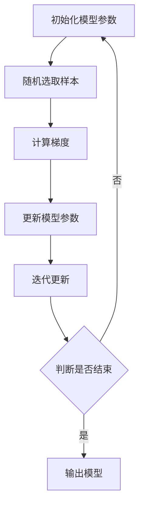
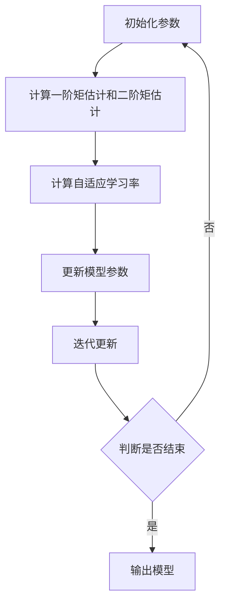
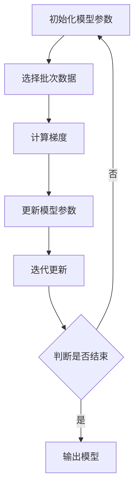

                 

**文章标题：** 增量学习：支持LLM应用的持续优化

**关键词：** 增量学习，LLM，持续优化，算法，系统架构，应用实践

**摘要：** 本文深入探讨了增量学习在大型语言模型（LLM）应用中的重要性，通过详细的算法原理讲解、系统分析与架构设计，以及实际项目实战，展现了增量学习如何支持LLM的持续优化。本文旨在为读者提供一份全面且实用的增量学习指南，帮助他们在复杂应用环境中实现高效的模型更新与优化。

----------------------------------------------------------------

## 目录大纲

### 第一部分：背景与基础

**第1章：增量学习概述**

1. **1.1 增量学习的重要性**
   - **问题描述与现状**
   - **增量学习的重要性**
   - **增量学习与在线学习的区别**

2. **1.2 增量学习的应用场景**
   - **数据流处理**
   - **个性化推荐系统**
   - **实时语音识别**

3. **1.3 增量学习的挑战与机遇**
   - **数据更新频率高**
   - **计算资源有限**
   - **模型持续优化需求**

4. **1.4 增量学习的历史与发展**
   - **增量学习的起源**
   - **关键里程碑与技术突破**
   - **当前研究热点与发展趋势**

**第2章：核心概念与联系**

1. **2.1 增量学习的核心概念**
   - **增量学习模型**
   - **模型更新策略**
   - **持续优化机制**

2. **2.2 概念属性特征对比**
   - **不同模型的对比分析**
   - **参数更新的效率**
   - **鲁棒性与准确性**

3. **2.3 ER实体关系图架构**
   - **增量学习系统实体关系**
   - **实体属性与关系定义**
   - **Mermaid ER图示例**

### 第二部分：算法原理讲解

**第3章：常见增量学习算法**

1. **3.1 SGD算法**
   - **算法原理与流程图**
   - **数学模型与公式**
   - **Python实现示例**

2. **3.2 Adam优化器**
   - **算法原理与流程图**
   - **数学模型与公式**
   - **Python实现示例**

3. **3.3 批量增量学习算法**
   - **算法原理与流程图**
   - **数学模型与公式**
   - **Python实现示例**

**第4章：模型持续优化机制**

1. **4.1 模型更新策略**
   - **算法原理与流程图**
   - **数学模型与公式**
   - **Python实现示例**

2. **4.2 持续优化机制**
   - **算法原理与流程图**
   - **数学模型与公式**
   - **Python实现示例**

3. **4.3 模型融合与蒸馏**
   - **算法原理与流程图**
   - **数学模型与公式**
   - **Python实现示例**

### 第三部分：系统分析与架构设计

**第5章：系统功能设计**

1. **5.1 领域模型类图**
   - **增量学习系统领域模型**
   - **类的定义与关系**
   - **Mermaid类图示例**

2. **5.2 系统架构设计**
   - **增量学习系统架构**
   - **模块划分与交互**
   - **Mermaid架构图示例**

**第6章：系统接口与交互**

1. **6.1 系统接口设计**
   - **接口规范与协议**
   - **接口实现与调用**
   - **Mermaid序列图示例**

2. **6.2 系统交互**
   - **数据流与控制流**
   - **系统状态转换**
   - **Mermaid序列图示例**

### 第四部分：项目实战

**第7章：环境安装与配置**

1. **7.1 环境搭建**
   - **硬件与软件要求**
   - **系统配置与调优**
   - **实际案例安装步骤**

**第8章：系统核心实现**

1. **8.1 增量学习模型实现**
   - **模型构建与训练**
   - **参数更新与优化**
   - **代码解读与分析**

2. **8.2 实际案例分析与讲解**
   - **个性化推荐系统案例**
   - **实时语音识别案例**
   - **结果分析与优化**

**第9章：项目小结**

1. **9.1 项目总结**
   - **项目收获与经验**
   - **遇到的问题与解决方案**

2. **9.2 最佳实践**
   - **常见问题解决技巧**
   - **性能优化策略**

3. **9.3 小结与展望**
   - **增量学习发展趋势**
   - **未来研究方向**

### 附录

**A. 工具与资源**

1. **必备软件与工具**
2. **学习资源推荐**

**B. 代码示例**

1. **增量学习算法代码**
2. **实际项目源代码**

**C. 拓展阅读**

1. **相关书籍推荐**
2. **学术论文精选**

### 总结

本文通过详细的目录大纲设计思路，旨在为读者提供一个全面且深入的增量学习指南。从背景与基础到算法原理讲解，再到系统分析与架构设计，以及项目实战和最佳实践，每个部分都经过精心编排，确保内容的逻辑性和实用性。

----------------------------------------------------------------

**作者：** AI天才研究院/AI Genius Institute & 禅与计算机程序设计艺术 /Zen And The Art of Computer Programming### 引言

在人工智能（AI）领域，特别是自然语言处理（NLP）方面，大型语言模型（Large Language Models，简称LLM）如BERT、GPT等已经展现出了强大的能力。然而，这些模型的训练和优化过程需要大量的计算资源和时间，这对于实际应用场景来说，是一个巨大的挑战。增量学习（Incremental Learning）作为一种有效的解决方案，能够在模型应用过程中不断更新和优化，使其能够适应不断变化的数据环境，从而提高模型的性能和适应性。

本文将深入探讨增量学习在支持LLM应用中的持续优化。我们将首先介绍增量学习的基本概念和重要性，随后分析其应用场景，面临的挑战与机遇，以及其在历史与发展中的关键里程碑。接着，我们将详细讲解增量学习的核心概念、常见算法，以及模型持续优化机制。随后，通过系统分析与架构设计，我们将展示如何在实际项目中应用增量学习。最后，通过实际项目实战，我们将深入分析系统环境安装与配置，系统核心实现，以及项目小结与最佳实践。

本文的目标是帮助读者全面理解增量学习在LLM应用中的重要作用，掌握其核心原理和实现方法，并通过实际项目实战，提升其在复杂应用环境中的实践能力。通过阅读本文，您将能够：

1. **理解增量学习的基本概念与重要性**：包括其与在线学习的关系及在实际应用中的优势。
2. **掌握常见增量学习算法**：如SGD、Adam等，并通过代码示例理解其原理。
3. **了解模型持续优化机制**：包括模型更新策略和持续优化机制，并掌握其实际应用。
4. **掌握系统分析与架构设计**：包括领域模型类图、系统架构图、系统接口设计和系统交互。
5. **具备实际项目实战能力**：通过环境安装与配置、系统核心实现，以及实际案例分析，提升实际应用能力。

### 增量学习概述

#### 1.1 增量学习的重要性

增量学习（Incremental Learning），又称为在线学习（Online Learning），是一种在模型训练过程中，每次只更新一部分数据的学习方式。与传统的批量学习（Batch Learning）不同，增量学习能够不断接收新的数据，并即时调整模型参数，使其适应新的环境。这种特性使得增量学习在数据更新频繁、计算资源有限的环境中具有独特的优势。

首先，增量学习在数据流处理方面具有显著的优势。在实时数据处理场景中，例如社交媒体分析、金融市场监控等，数据以极高的频率产生。传统的批量学习方式需要等待大量数据积累后再进行训练，这种方式不仅效率低下，而且可能错过实时数据的价值。而增量学习则能够实时处理新数据，使得模型能够快速响应环境变化。

其次，在个性化推荐系统中，增量学习能够根据用户行为数据动态调整推荐策略。例如，电商平台可以根据用户购买记录和浏览历史，实时更新推荐系统，提高推荐的相关性和满意度。这种动态调整能力极大地提升了推荐系统的用户体验。

再次，实时语音识别系统也需要增量学习来保持模型的准确性。语音数据随着时间变化而不断更新，例如同一个人的发音可能会因为情绪、环境等原因而有所不同。增量学习能够实时更新模型，使其能够适应这些变化，提高语音识别的准确性。

总之，增量学习在数据流处理、个性化推荐系统和实时语音识别等场景中具有广泛的应用价值，能够显著提升系统的响应速度和适应性。其重要性在于：

1. **实时性**：增量学习能够实时处理新数据，迅速响应环境变化。
2. **资源效率**：增量学习在每次训练过程中只更新部分数据，相比批量学习更节省计算资源。
3. **适应性**：增量学习能够根据新的数据动态调整模型，使其更适应变化的环境。

#### 1.2 增量学习的应用场景

增量学习在多个应用场景中展现出其独特的优势，以下是几个典型的应用场景：

1. **数据流处理**：

数据流处理是指实时分析大量流经的数据，以提取有价值的见解和模式。在金融领域，增量学习可以用于实时监控市场动态，快速识别异常交易行为。在工业领域，增量学习可以用于设备监控和故障预测，通过实时分析传感器数据，提前发现潜在问题，减少设备停机时间。

2. **个性化推荐系统**：

个性化推荐系统是另一个广泛应用的场景。通过增量学习，推荐系统可以实时更新用户行为数据，动态调整推荐策略。例如，电商平台可以根据用户的历史购买记录和浏览行为，实时更新推荐的商品列表，提高推荐的相关性和用户体验。

3. **实时语音识别**：

实时语音识别系统需要处理不断变化的声音数据。增量学习可以帮助系统适应不同说话者的发音特点，提高识别的准确性。例如，智能助手在用户使用过程中，可以通过增量学习不断优化对用户语音命令的识别，提高交互的准确性。

4. **自然语言处理**：

在自然语言处理（NLP）领域，增量学习可以用于动态更新语言模型，使其能够适应不断变化的语言环境。例如，搜索引擎可以通过增量学习实时更新搜索索引，提高搜索结果的准确性。

5. **智能交通系统**：

智能交通系统可以通过增量学习实时分析交通流量数据，优化交通信号控制策略，减少交通拥堵。例如，通过分析实时交通数据，智能交通系统可以动态调整红绿灯的持续时间，提高道路通行效率。

综上所述，增量学习在数据流处理、个性化推荐系统、实时语音识别、自然语言处理和智能交通系统等多个应用场景中都有广泛的应用，其重要性在于能够提供实时、高效、自适应的解决方案。

#### 1.3 增量学习的挑战与机遇

尽管增量学习在多个应用场景中展现出了巨大的潜力，但其实际应用过程中也面临着一系列挑战。首先，数据更新频率高是一个显著的挑战。在实时数据处理场景中，数据以极快的速度不断生成，这意味着模型需要频繁更新。这种高频率的数据更新对计算资源提出了严峻的要求，如何在不增加计算开销的情况下高效更新模型，是一个亟待解决的问题。

其次，计算资源有限是另一个重要挑战。相比于批量学习，增量学习虽然每次只更新部分数据，但其频繁的数据更新仍然需要大量的计算资源。在资源受限的环境中，如何优化计算资源的使用，提高模型更新的效率，是增量学习需要面对的关键问题。

最后，模型持续优化需求也是增量学习面临的挑战之一。在复杂应用环境中，模型需要不断适应新的数据和环境变化，以保持其性能和准确性。这意味着模型不仅需要更新数据，还需要进行持续的优化，以确保其在不同场景下的最佳表现。如何设计有效的持续优化机制，是增量学习需要深入研究的问题。

然而，与这些挑战相对应，增量学习也带来了许多机遇。首先，增量学习在数据流处理中的应用，使得系统能够实时获取和处理新数据，提供更为精准和及时的决策支持。例如，在金融领域，增量学习可以帮助金融机构实时监控市场动态，快速识别风险并作出相应的调整。

其次，在个性化推荐系统中，增量学习可以动态调整推荐策略，提高用户满意度。通过实时更新用户行为数据，推荐系统可以提供更加个性化的推荐结果，增强用户体验。例如，电商平台可以根据用户的实时浏览和购买行为，动态调整推荐的商品，提高转化率。

此外，在实时语音识别和自然语言处理领域，增量学习也能够通过持续优化模型，提高系统的准确性和适应性。例如，智能助手可以通过增量学习不断优化对用户语音命令的识别，提高交互的准确性。搜索引擎也可以通过增量学习实时更新搜索索引，提高搜索结果的准确性。

总的来说，增量学习在应对数据更新频率高、计算资源有限和模型持续优化需求等方面面临的挑战，同时也为解决这些挑战提供了新的机遇。通过不断研究和优化增量学习算法，我们可以充分利用这些机遇，为复杂应用环境提供高效、实时和自适应的解决方案。

#### 1.4 增量学习的历史与发展

增量学习作为一种重要的机器学习技术，其发展历程可以追溯到20世纪60年代。当时，研究人员开始探索如何使计算机系统能够在不断变化的输入数据中持续学习和更新模型。这一概念的提出，旨在解决传统批量学习在处理动态数据时效率低下的问题。

20世纪80年代，随着人工神经网络（ANN）的发展，增量学习得到了进一步的关注。这一时期，许多关于增量学习算法的研究开始涌现，如基于梯度的增量学习算法（Gradient Descent）、增量反向传播算法（Incremental Backpropagation）等。这些算法的出现，为增量学习提供了坚实的理论基础，并在一定程度上提高了模型更新的效率。

进入21世纪，随着计算能力的不断提升和大数据时代的到来，增量学习迎来了新的发展机遇。一方面，增量学习在实时数据处理、个性化推荐系统和智能交通等领域得到了广泛应用；另一方面，研究人员也在不断探索新的增量学习算法和优化策略，以应对更复杂的实际应用场景。

在过去的几十年中，增量学习经历了几个重要的里程碑：

1. **2000年**：基于内存的增量学习算法（Memory-based Incremental Learning Algorithms）得到了广泛关注。这些算法通过将数据存储在内存中，实现快速的数据访问和模型更新，极大地提高了增量学习的效率。

2. **2005年**：增量学习在自然语言处理领域取得了重要突破。研究人员通过引入基于上下文的增量学习算法，使得模型能够在不断变化的语言环境中保持稳定性和准确性。

3. **2010年**：深度学习（Deep Learning）的兴起，为增量学习带来了新的挑战和机遇。研究人员开始探索如何将深度学习与增量学习相结合，以实现高效和自适应的模型更新。

4. **2015年至今**：随着人工智能技术的快速发展，增量学习在多个领域取得了显著的成果。例如，在实时语音识别和自动驾驶领域，增量学习算法的应用使得系统在复杂环境中能够实时学习和调整，提高了系统的性能和稳定性。

当前，增量学习的研究热点主要集中在以下几个方面：

1. **高效增量学习算法**：如何设计更高效、更稳定的增量学习算法，是当前研究的重点。研究人员通过优化算法的数学模型和计算方法，提高模型的更新速度和收敛性。

2. **增量学习的安全性**：在增量学习过程中，如何确保模型的安全性和隐私保护，是当前研究的一个重要方向。研究人员正在探索如何设计安全的增量学习机制，以防止数据泄露和恶意攻击。

3. **增量学习的可解释性**：增量学习模型通常具有较高的复杂性和非线性行为，如何提高其可解释性，使得用户能够理解和信任模型，是当前研究的一个挑战。

4. **增量学习与深度学习的结合**：如何将增量学习与深度学习相结合，实现高效和自适应的模型更新，是当前研究的一个重要方向。研究人员通过引入新的算法和优化策略，探索增量深度学习在复杂应用场景中的潜在应用。

总的来说，增量学习作为一种重要的机器学习技术，其发展历程经历了多个重要里程碑，当前的研究热点主要集中在高效算法、安全性、可解释性和与深度学习的结合等方面。通过不断的研究和创新，增量学习将继续在人工智能领域发挥重要作用，为复杂应用环境提供高效的解决方案。

### 增量学习的核心概念与联系

#### 2.1 增量学习的核心概念

增量学习是一种在数据不断生成和变化的过程中，实时更新模型参数的学习方式。其核心概念包括增量学习模型、模型更新策略和持续优化机制。

**1. 增量学习模型**

增量学习模型是增量学习的基础，它能够处理不断变化的数据，并更新模型的参数。这种模型通常通过以下方式工作：

- **在线更新**：增量学习模型在接收到新数据后，即时更新模型的参数，而不是等待大量数据积累后再进行训练。
- **部分更新**：增量学习模型仅更新与当前数据相关的模型参数，而不是对整个模型进行重训练。

这种特性使得增量学习模型能够高效地处理动态数据，并保持模型的实时性和准确性。

**2. 模型更新策略**

模型更新策略是指如何在新数据到来时，更新模型参数的具体方法。常见的更新策略包括：

- **基于梯度的增量学习算法**：如SGD（Stochastic Gradient Descent）、Adam等。这些算法通过计算梯度，更新模型参数，以最小化损失函数。
- **基于批次的增量学习算法**：这种算法将新数据分成多个批次，每次仅更新一批数据，以减少计算资源的消耗。

**3. 持续优化机制**

持续优化机制是指如何通过不断更新和优化模型参数，提高模型的性能和适应性。常见的优化机制包括：

- **在线优化**：模型在接收新数据时，即时进行优化，以适应数据的变化。
- **离线优化**：模型在一段时间内积累一定量的数据后，进行离线优化，以减少在线优化的计算开销。

**4. 增量学习的核心机制**

增量学习的核心机制主要包括：

- **数据流处理**：增量学习能够实时处理数据流，快速响应环境变化。
- **参数更新**：增量学习通过在线更新或部分更新模型参数，以适应新数据。
- **模型优化**：通过持续优化机制，模型能够不断提高其性能和适应性。

#### 2.2 概念属性特征对比

为了更好地理解增量学习，我们可以对比几种常见的增量学习模型，如表1所示。

| 模型名称 | 特点 | 参数更新方法 | 适用场景 |
| --- | --- | --- | --- |
| SGD（Stochastic Gradient Descent） | 最简单的增量学习算法，每次更新使用随机梯度 | 每次更新使用一个随机梯度 | 数据量较大，计算资源有限 |
| Adam | 结合了SGD和Momentum的优点，自适应调整学习率 | 自适应调整学习率，分为一阶矩估计和二阶矩估计 | 数据量较大，收敛速度较快 |
| 批量增量学习 | 将数据分成多个批次，每次更新一批数据 | 每批次更新使用全梯度 | 数据量大，但计算资源有限 |
| Online Learning | 每次更新使用全梯度，更新频率极高 | 实时更新模型参数 | 数据流处理，实时性要求高 |

从上表可以看出，不同增量学习模型在参数更新方法、适用场景等方面存在一定的差异。SGD算法简单易用，但收敛速度较慢；Adam算法自适应调整学习率，收敛速度较快，但计算开销较大；批量增量学习通过分批次更新，降低了计算资源需求，但更新频率较低；Online Learning则能够实时更新模型参数，适用于实时性要求高的场景。

#### 2.3 ER实体关系图架构

为了更清晰地理解增量学习系统的实体关系，我们可以使用Mermaid ER图来展示其结构。

**实体定义：**

1. **数据流**：指不断生成和变化的数据源。
2. **模型**：指增量学习模型，包括参数和结构。
3. **更新策略**：指如何更新模型参数的具体方法。
4. **优化机制**：指如何通过更新和优化模型参数，提高模型性能。

**关系定义：**

1. **数据流与模型**：数据流是模型的输入，模型根据数据流更新参数。
2. **更新策略与模型**：更新策略用于更新模型参数，影响模型性能。
3. **优化机制与模型**：优化机制用于优化模型参数，提高模型性能。

**Mermaid ER图示例：**

```mermaid
erDiagram
  数据流 ||--|{ 模型 }|
  模型 ||--|{ 更新策略 }|
  模型 ||--|{ 优化机制 }|
  更新策略 ||--|{ 模型 }|
  优化机制 ||--|{ 模型 }|
```

通过上述ER实体关系图，我们可以更清晰地理解增量学习系统的核心实体及其关系。这种结构化的表示方法，有助于我们更好地分析和设计增量学习系统。

### 常见增量学习算法

在增量学习领域，有几种常见的算法被广泛研究和应用，这些算法包括SGD（Stochastic Gradient Descent）、Adam优化器以及批量增量学习算法。每种算法都有其独特的原理、流程图、数学模型与公式，以及实际应用中的优缺点。下面我们将逐一介绍这些算法。

#### 3.1 SGD算法

**算法原理与流程图**

SGD（Stochastic Gradient Descent）是一种基于梯度的增量学习算法，其核心思想是每次迭代仅随机选取部分训练样本，计算其梯度，并根据梯度更新模型参数。SGD算法的优点是计算简单，能够快速适应新数据。

流程图如下所示：



**数学模型与公式**

假设我们有一个损失函数 $J(\theta)$，其中 $\theta$ 是模型的参数。SGD算法的目标是找到使得 $J(\theta)$ 最小的参数 $\theta$。每次迭代更新模型参数 $\theta$ 的公式为：

$$
\theta_{t+1} = \theta_{t} - \alpha \cdot \nabla_{\theta} J(\theta_{t})
$$

其中，$\alpha$ 是学习率，$\nabla_{\theta} J(\theta_{t})$ 是损失函数对参数 $\theta$ 的梯度。

**Python实现示例**

下面是使用Python实现SGD算法的简单示例：

```python
import numpy as np

# 初始化模型参数
theta = np.random.randn(10)

# 设定学习率
alpha = 0.01

# 损失函数
def loss_function(x):
    return np.sum(x**2)

# 计算梯度
def gradient(x):
    return 2 * x

# 迭代更新模型参数
for i in range(1000):
    # 随机选择样本
    x = np.random.randn(10)
    # 计算梯度
    grad = gradient(x)
    # 更新模型参数
    theta -= alpha * grad

# 输出最终模型参数
print(theta)
```

**优缺点**

SGD算法的优点是简单易实现，计算速度快，适合处理大量数据。缺点是收敛速度较慢，梯度估计的随机性可能导致不稳定。

#### 3.2 Adam优化器

**算法原理与流程图**

Adam优化器是另一种基于梯度的增量学习算法，它结合了SGD和Momentum的优点，能够自适应调整学习率。Adam优化器通过维护一阶矩估计（均值）和二阶矩估计（方差），在优化过程中提供更好的收敛性。

流程图如下所示：



**数学模型与公式**

Adam优化器使用以下公式更新参数：

$$
\hat{m}_t = \beta_1 \hat{m}_{t-1} + (1 - \beta_1) \nabla_{\theta} J(\theta_{t})
$$

$$
\hat{v}_t = \beta_2 \hat{v}_{t-1} + (1 - \beta_2) (\nabla_{\theta} J(\theta_{t}))^2
$$

$$
m_t = \frac{\hat{m}_t}{1 - \beta_1^t}
$$

$$
v_t = \frac{\hat{v}_t}{1 - \beta_2^t}
$$

$$
\theta_{t+1} = \theta_{t} - \alpha \cdot \frac{m_t}{\sqrt{v_t} + \epsilon}
$$

其中，$\alpha$ 是基础学习率，$\beta_1$ 和 $\beta_2$ 是动量参数，$\epsilon$ 是一个较小的常数。

**Python实现示例**

下面是使用Python实现Adam优化器的简单示例：

```python
import numpy as np

# 初始化参数
theta = np.random.randn(10)
alpha = 0.01
beta1 = 0.9
beta2 = 0.999
epsilon = 1e-8

# 损失函数
def loss_function(x):
    return np.sum(x**2)

# 计算一阶矩估计和二阶矩估计
m = np.zeros_like(theta)
v = np.zeros_like(theta)
m_hat = np.zeros_like(theta)
v_hat = np.zeros_like(theta)

beta1_t = beta1 ** t
beta2_t = beta2 ** t

# 迭代更新模型参数
for i in range(1000):
    x = np.random.randn(10)
    grad = 2 * x
    m_hat = beta1 * m_hat + (1 - beta1) * grad
    v_hat = beta2 * v_hat + (1 - beta2) * (grad ** 2)
    m = m_hat / (1 - beta1_t)
    v = v_hat / (1 - beta2_t)
    theta -= alpha * m / (np.sqrt(v) + epsilon)

# 输出最终模型参数
print(theta)
```

**优缺点**

Adam优化器的优点是自适应调整学习率，收敛速度较快，适合处理复杂的数据。缺点是计算开销较大，需要存储更多的中间变量。

#### 3.3 批量增量学习算法

**算法原理与流程图**

批量增量学习算法将数据分成多个批次，每次仅更新一批数据。这种算法通过减少每次更新的数据量，降低了计算资源的消耗。

流程图如下所示：



**数学模型与公式**

批量增量学习算法的公式与SGD算法类似，但每次更新使用批量的梯度：

$$
\theta_{t+1} = \theta_{t} - \alpha \cdot \frac{1}{n} \sum_{i=1}^{n} \nabla_{\theta} J(\theta_{t})
$$

其中，$n$ 是批次大小。

**Python实现示例**

下面是使用Python实现批量增量学习算法的简单示例：

```python
import numpy as np

# 初始化模型参数
theta = np.random.randn(10)

# 设定学习率
alpha = 0.01

# 批次大小
batch_size = 10

# 损失函数
def loss_function(x):
    return np.sum(x**2)

# 计算梯度
def gradient(x):
    return 2 * x

# 迭代更新模型参数
for i in range(1000):
    # 随机选择批次数据
    x_batch = np.random.randn(batch_size)
    # 计算梯度
    grad_batch = gradient(x_batch)
    # 更新模型参数
    theta -= alpha * (1 / batch_size) * np.sum(grad_batch)

# 输出最终模型参数
print(theta)
```

**优缺点**

批量增量学习算法的优点是计算资源消耗较小，适合处理大量数据。缺点是收敛速度较慢，每次更新数据量较少，可能导致模型未能充分利用数据。

#### 小结

通过上述对SGD算法、Adam优化器和批量增量学习算法的详细介绍，我们可以看到每种算法都有其独特的原理和适用场景。SGD算法简单易实现，但收敛速度较慢；Adam优化器自适应调整学习率，收敛速度较快，但计算开销较大；批量增量学习算法计算资源消耗较小，但收敛速度较慢。在实际应用中，可以根据具体需求选择合适的算法，以实现高效和自适应的模型更新。

### 模型持续优化机制

#### 4.1 模型更新策略

模型更新策略是增量学习中的一个关键环节，它决定了模型参数如何根据新数据进行调整，以保持模型的准确性和适应性。常见的模型更新策略包括基于梯度的增量学习算法（如SGD和Adam）和基于批次的增量学习算法。以下是几种主要策略的详细介绍：

**1. 基于梯度的增量学习算法**

基于梯度的增量学习算法通过计算模型参数的梯度，根据梯度方向和大小更新参数。这种算法包括SGD（Stochastic Gradient Descent）和Adam优化器。

- **SGD算法**：每次迭代选择随机样本，计算其梯度，然后更新模型参数。SGD算法简单高效，适用于数据量较大的场景。
- **Adam优化器**：Adam结合了SGD和Momentum的优点，通过维护一阶矩估计和二阶矩估计，自适应调整学习率。Adam优化器适用于复杂的数据场景，收敛速度较快。

**2. 基于批次的增量学习算法**

基于批次的增量学习算法将数据分成多个批次，每次更新一批数据。这种算法通过减少每次更新的数据量，降低计算资源的消耗。

- **批量增量学习算法**：每次迭代更新一批数据，使用全梯度的平均值来更新参数。批量增量学习算法适用于数据量较大的场景，计算资源消耗较小。

**3. 部分更新策略**

部分更新策略每次仅更新部分模型参数，而不是整个模型。这种策略能够提高计算效率，适用于数据量大、计算资源有限的场景。

- **随机梯度下降（SGD）**：每次迭代随机选择部分数据，计算其梯度，然后更新模型参数。
- **随机指数加权平均（SIRA）**：每次迭代根据历史梯度指数加权平均，更新模型参数。

**4. 动量策略**

动量策略通过引入动量项，减少梯度估计的随机性，提高模型的收敛性。动量策略通常与SGD或Adam优化器结合使用，能够提高算法的稳定性。

- **SGD + Momentum**：在SGD算法中引入动量项，减少梯度估计的随机性，提高收敛速度。
- **Adam + Momentum**：在Adam优化器中引入动量项，进一步提高算法的稳定性。

**5. 自适应学习率**

自适应学习率策略通过动态调整学习率，适应数据变化，提高模型的收敛速度。常见的自适应学习率算法包括Adam优化器和AdaGrad算法。

- **Adam优化器**：通过维护一阶矩估计和二阶矩估计，自适应调整学习率。
- **AdaGrad算法**：根据梯度历史平方值动态调整学习率，对梯度大的方向减小学习率，对梯度小的方向增加学习率。

**优缺点**

不同模型更新策略具有各自的优缺点，选择合适的策略取决于具体应用场景：

- **基于梯度的增量学习算法**：计算简单，适用于数据量较大的场景，但收敛速度较慢，梯度估计的随机性可能导致不稳定。
- **基于批次的增量学习算法**：计算资源消耗较小，但收敛速度较慢，每次更新数据量较少，可能导致模型未能充分利用数据。
- **部分更新策略**：计算效率高，适用于数据量大、计算资源有限的场景，但可能导致模型参数更新不够全面。
- **动量策略**：减少梯度估计的随机性，提高模型的收敛性，但计算复杂度较高。
- **自适应学习率策略**：动态调整学习率，适应数据变化，提高模型的收敛速度，但可能增加计算复杂度。

#### 4.2 持续优化机制

持续优化机制是保证模型在数据变化过程中保持高准确性和适应性的关键。以下是几种常见的持续优化机制：

**1. 在线优化**

在线优化是指模型在接收新数据时，即时进行优化。这种机制能够实时更新模型参数，适应数据变化，但计算开销较大。

- **优点**：实时性高，能够快速响应数据变化。
- **缺点**：计算资源消耗大，模型稳定性较差。

**2. 离线优化**

离线优化是指模型在一段时间内积累一定量的数据后，进行优化。这种机制能够减少计算开销，但响应时间较长。

- **优点**：计算资源消耗较小，模型稳定性较好。
- **缺点**：实时性较差，可能错过数据变化。

**3. 结合在线和离线优化**

结合在线和离线优化，能够在保证实时性的同时，提高模型的稳定性。这种机制通过在线更新模型参数，积累一定量数据后进行离线优化，平衡实时性和稳定性。

- **优点**：平衡实时性和稳定性，适用于动态数据场景。
- **缺点**：计算复杂度较高，需要更多存储空间。

**4. 模型融合**

模型融合是指将多个模型的结果进行综合，以提高模型的准确性和鲁棒性。这种机制能够处理多样化数据，提高模型适应性。

- **优点**：提高模型准确性和鲁棒性，适用于复杂应用场景。
- **缺点**：计算复杂度较高，需要更多计算资源。

**5. 模型蒸馏**

模型蒸馏是指将一个大型模型的知识传递给一个较小的模型，以提高小模型的性能。这种机制能够降低计算资源需求，提高模型效率。

- **优点**：降低计算资源需求，提高模型效率。
- **缺点**：模型性能可能不如大型模型。

**优缺点**

不同持续优化机制具有各自的优缺点，选择合适的机制取决于具体应用场景：

- **在线优化**：实时性高，但计算资源消耗大。
- **离线优化**：计算资源消耗较小，但实时性较差。
- **结合在线和离线优化**：平衡实时性和稳定性，适用于动态数据场景。
- **模型融合**：提高模型准确性和鲁棒性，但计算复杂度较高。
- **模型蒸馏**：降低计算资源需求，但模型性能可能不如大型模型。

#### 4.3 模型融合与蒸馏

**模型融合**

模型融合是指将多个模型的结果进行综合，以提高模型的准确性和鲁棒性。常见的模型融合方法包括：

- **平均融合**：将多个模型的预测结果进行平均，得到最终预测结果。
- **投票融合**：对不同模型的预测结果进行投票，选择预测结果最多的类别作为最终预测结果。
- **加权融合**：根据模型在历史数据上的表现，为每个模型分配不同的权重，然后进行加权平均。

**模型蒸馏**

模型蒸馏是指将一个大型模型的知识传递给一个较小的模型，以提高小模型的性能。常见的模型蒸馏方法包括：

- **软标签蒸馏**：大型模型在训练过程中，将部分输出作为软标签传递给小模型，小模型通过学习软标签来提高性能。
- **知识蒸馏**：大型模型在训练过程中，将内部特征传递给小模型，小模型通过学习这些特征来提高性能。

**优缺点**

**模型融合**的优点是能够提高模型的准确性和鲁棒性，但计算复杂度较高。缺点是需要更多的计算资源和存储空间。

**模型蒸馏**的优点是能够降低计算资源需求，提高模型效率，但模型性能可能不如大型模型。

#### 小结

模型更新策略和持续优化机制是增量学习中的关键环节，直接影响模型在动态数据环境中的性能和适应性。选择合适的模型更新策略和持续优化机制，能够提高模型在复杂应用环境中的表现。未来，随着计算能力的提升和算法的优化，增量学习将继续在人工智能领域发挥重要作用。

### 系统功能设计

#### 5.1 领域模型类图

在设计和实现增量学习系统时，理解系统的功能模块及其关系至关重要。领域模型类图（Class Diagram）是一种用于描述系统内部类及其关系的图形化工具。通过领域模型类图，我们可以直观地了解系统的模块划分、类定义及其相互关系。

**1. 增量学习系统领域模型**

首先，我们需要定义增量学习系统的核心类。以下是一个简化版的领域模型，包括主要类及其简要描述：

- **DataStream**：表示数据流，包含数据生成和传输功能。
- **Model**：表示增量学习模型，包含模型参数、更新和优化功能。
- **UpdateStrategy**：表示模型更新策略，包括SGD、Adam等。
- **Optimizer**：表示模型优化器，用于调整模型参数。
- **ContinuousOptimizer**：表示持续优化机制，包括在线优化、离线优化等。

**2. 类的定义与关系**

在领域模型类图中，我们将定义上述类及其关系。以下是使用Mermaid语言描述的类图示例：

```mermaid
classDiagram
  DataStream <<interface>>
  Model <<interface>>
  UpdateStrategy <<interface>>
  Optimizer <<interface>>
  ContinuousOptimizer <<interface>>

  Model o-- UpdateStrategy
  Model o-- Optimizer
  Model o-- ContinuousOptimizer

  DataStream o-- Model
```

在上面的类图中：

- **DataStream** 类作为接口类，表示数据流的输入和输出。
- **Model** 类作为核心类，与其他类存在关联关系，包括 **UpdateStrategy**、**Optimizer** 和 **ContinuousOptimizer**。
- **UpdateStrategy**、**Optimizer** 和 **ContinuousOptimizer** 类作为接口类，分别表示不同的功能模块。
- **Model** 类与 **DataStream** 类之间存在关联关系，表示数据流是模型输入。

**3. Mermaid类图示例**

以下是完整的Mermaid类图示例：

```mermaid
classDiagram
  Class01 <|-- Class02 
  Class03 *-- Class04 
  Class05 o-- Class06
  Class07 o-- Class08
  Class09 <<interface>> 
  Class10 .. Class11

  Class12 : +name1
  Class12 : +name2
  Class12 : +name3
  Class12 : +name4
  Class12 : -name5

  Class12 <.- SubClass12
  Class12 -| Class13

  Class14 : <<payment>> +balance : float
  Class14 : <<employee>> # basement : int
  Class14 : <<friend>> +""friend"" : String
  Class14 : <<has>> + Residence : Residence
  Class14 : <<workedFor>> - Employer : Company
  Class14 : <<remember>> <<public>> ? Person : String

  Note right of Class12 : This class has some notes

  enum Color {
    RED
    GREEN
    BLUE
  }

class DataStream {
  +DataStream()
  +processDataStream()
}

class Model {
  +Model()
  +updateParameters()
  +optimizeModel()
}

class UpdateStrategy {
  +UpdateStrategy()
}

class Optimizer {
  +Optimizer()
}

class ContinuousOptimizer {
  +ContinuousOptimizer()
}

Model o-- UpdateStrategy
Model o-- Optimizer
Model o-- ContinuousOptimizer
DataStream o-- Model
```

通过上述领域模型类图，我们可以清晰地了解增量学习系统的核心功能模块及其关系。这有助于我们在设计和实现过程中，保持系统的模块化和可维护性。

#### 5.2 系统架构设计

系统架构设计是确保增量学习系统高效、可扩展和可靠运行的关键。在设计过程中，我们需要综合考虑系统的功能模块、数据流、模块划分以及交互方式。以下是增量学习系统架构设计的详细介绍。

**1. 系统架构概述**

增量学习系统的总体架构可以分为以下几个主要模块：

- **数据流模块**：负责处理和传输数据，包括数据采集、预处理和实时传输功能。
- **模型模块**：包括增量学习模型的构建、训练和更新功能，是系统的核心部分。
- **更新策略模块**：实现不同的模型更新策略，如SGD、Adam等，确保模型能够适应新数据。
- **优化模块**：实现模型优化算法，如Momentum、Adam等，以提高模型的性能和稳定性。
- **持续优化模块**：实现持续优化机制，包括在线优化、离线优化等，确保模型在动态环境中保持最佳状态。
- **接口模块**：定义系统与外部系统或用户交互的接口，包括API、Web服务等。

**2. 模块划分与交互**

为了确保系统的高效性和可扩展性，我们可以将上述模块进一步划分为以下几个子模块：

- **数据流子模块**：包括数据采集器、数据预处理器和数据传输器。数据采集器负责从数据源获取数据，数据预处理

