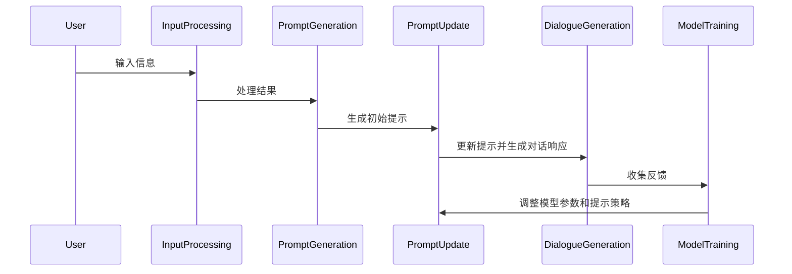
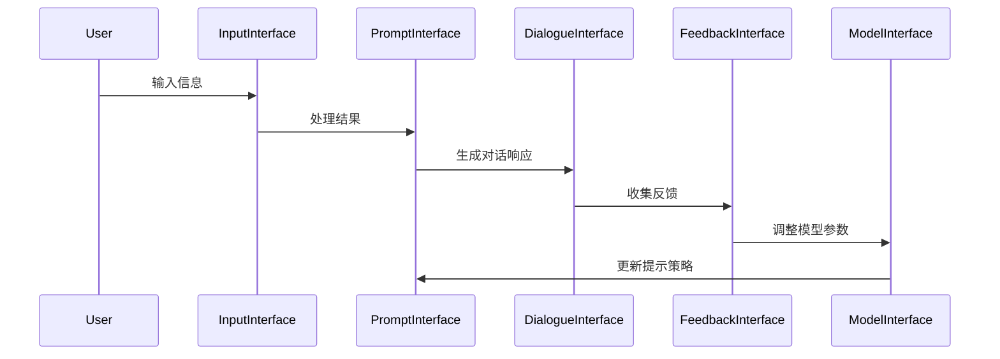

                 


# 增量提示：逐步细化和扩展初始提示

## 关键词
- 增量提示
- 人工智能
- 算法
- 实践
- 最佳实践

## 摘要
本文深入探讨了增量提示在人工智能中的应用，从背景介绍到核心概念与原理，再到算法讲解和实践，全面解析了增量提示技术的演进、优势、挑战以及其在不同领域的应用。文章旨在为读者提供一份系统的增量提示技术指南，帮助理解其原理、实现和应用，并为未来的研究与实践提供方向。

### 背景介绍

#### 1.1 问题背景

随着人工智能技术的不断发展，自然语言处理、计算机视觉和推荐系统等领域对提示（Prompt）的需求日益增加。传统的提示技术虽然已经取得了一定的成果，但在面对复杂任务时仍然存在一些局限。

- **传统提示的局限**：传统的提示技术主要依赖于固定的模板和规则，难以应对动态变化的场景。此外，传统提示的生成过程相对复杂，需要大量的人工干预和调整。
- **增量提示的需求**：为了解决传统提示的局限，增量提示（Incremental Prompting）技术应运而生。增量提示通过逐步细化和扩展初始提示，能够在动态变化的环境中提供更加灵活和高效的提示。

#### 1.2 增量提示的概念

增量提示是一种通过逐步引入新信息来更新和扩展初始提示的技术。与传统的固定提示相比，增量提示具有以下几个特点：

- **灵活性**：增量提示能够根据任务的需求和环境的变化，动态地调整提示的内容和形式。
- **高效性**：增量提示通过逐步引入新信息，减少了初始提示的复杂度和生成时间，提高了系统的响应速度和性能。
- **适应性**：增量提示能够适应不同的任务和环境，具有良好的通用性和扩展性。

#### 1.3 增量提示的优势与挑战

增量提示在人工智能领域具有广泛的应用前景，但其实现和优化也面临着一些挑战。

- **优势**：
  - **动态适应**：增量提示能够动态地适应任务和环境的变化，提供更加灵活和高效的解决方案。
  - **减少干预**：增量提示减少了人工干预的需求，降低了系统的维护成本。
  - **提高性能**：增量提示通过逐步引入新信息，减少了初始提示的复杂度，提高了系统的响应速度和性能。

- **挑战**：
  - **信息冗余**：增量提示在引入新信息时，可能会产生信息冗余，影响系统的效率和准确性。
  - **计算复杂度**：增量提示的实现需要处理大量的数据和模型，增加了计算复杂度。
  - **稳定性**：增量提示在面对极端情况和复杂任务时，可能存在稳定性的问题。

#### 1.4 增量提示的发展趋势与潜在应用领域

随着人工智能技术的不断进步，增量提示有望在更多的领域得到应用。

- **自然语言处理**：增量提示在自然语言处理领域具有广泛的应用，如文本生成、对话系统、机器翻译等。
- **计算机视觉**：增量提示在计算机视觉领域可以用于图像识别、视频分析、目标检测等。
- **推荐系统**：增量提示在推荐系统领域可以用于用户画像、个性化推荐、购物推荐等。

### 核心概念与原理

#### 2.1 增量提示的基本原理

增量提示的核心思想是通过逐步引入新信息来更新和扩展初始提示。具体来说，增量提示包括以下几个关键步骤：

1. **初始提示生成**：根据任务的需求和环境信息，生成一个初始提示。
2. **信息收集与更新**：在初始提示的基础上，收集新的信息并进行更新。
3. **提示优化与扩展**：通过对更新的提示进行优化和扩展，提高提示的准确性和效率。
4. **反馈与调整**：根据系统的反馈和实际效果，对提示进行进一步的调整和优化。

#### 2.2 增量提示的数学模型

增量提示的数学模型主要包括以下几个方面：

1. **输入表示**：使用向量表示任务和环境的信息。
2. **模型架构**：使用神经网络等深度学习模型来处理和生成提示。
3. **优化目标**：定义优化目标，如最小化提示长度、最大化提示准确性等。

#### 2.3 增量提示的属性特征对比

| 属性特征       | 传统提示                | 增量提示                |
| -------------- | ---------------------- | ---------------------- |
| 灵活性         | 固定的模板和规则       | 动态适应任务和环境变化 |
| 高效性         | 需要大量的人工干预     | 减少人工干预，提高性能 |
| 适应性         | 受限于固定模板和规则   | 具有良好的通用性和扩展性 |
| 信息冗余       | 可能产生信息冗余       | 通过逐步引入新信息减少冗余 |
| 计算复杂度     | 较低                   | 较高，需要处理大量数据 |
| 稳定性         | 相对稳定               | 面临稳定性问题         |

#### 2.4 增量提示的ER实体关系图架构

增量提示的ER实体关系图包括以下几个实体和关系：

- **实体**：任务实体、环境实体、初始提示实体、更新提示实体、优化提示实体。
- **关系**：任务与环境之间的关系、初始提示与更新提示之间的关系、优化提示与反馈调整之间的关系。

```mermaid
erDiagram
  任务实体 ||--|{ 环境实体 }
  初始提示实体 ||--|{ 更新提示实体 }
  更新提示实体 ||--|{ 优化提示实体 }
  优化提示实体 ||--|{ 反馈调整实体 }
```

### 算法原理讲解

#### 3.1 增量提示算法原理

增量提示算法主要包括以下几个关键步骤：

1. **初始提示生成**：根据任务的需求和环境信息，使用神经网络等深度学习模型生成初始提示。
2. **信息收集与更新**：在初始提示的基础上，通过逐步引入新的信息来更新提示。
3. **提示优化与扩展**：对更新的提示进行优化和扩展，提高提示的准确性和效率。
4. **反馈与调整**：根据系统的反馈和实际效果，对提示进行进一步的调整和优化。

以下是增量提示算法的mermaid流程图：


增量提示算法的Python源代码如下：

```python
import numpy as np

def generate_initial_prompt(task, environment):
    # 使用神经网络生成初始提示
    # ...
    return initial_prompt

def update_prompt(initial_prompt, new_info):
    # 更新提示
    # ...
    return updated_prompt

def optimize_prompt(updated_prompt):
    # 优化提示
    # ...
    return optimized_prompt

def adjust_prompt(optimized_prompt, feedback):
    # 调整提示
    # ...
    return adjusted_prompt
```

增量提示算法的数学模型主要包括以下几个方面：

- **输入表示**：使用向量表示任务和环境的信息。
- **模型架构**：使用神经网络等深度学习模型来处理和生成提示。
- **优化目标**：定义优化目标，如最小化提示长度、最大化提示准确性等。

以下是增量提示算法的数学模型和公式：

$$
\text{输入表示：} X = [x_1, x_2, ..., x_n]
$$

$$
\text{神经网络模型：} f(\text{X}) = \text{神经网络}(\text{X})
$$

$$
\text{优化目标：} \min_{\theta} \sum_{i=1}^{n} (\text{预测值}_{i} - \text{真实值}_{i})^2
$$

#### 3.2 算法实现与优化

增量提示算法的实现主要包括以下几个关键步骤：

1. **环境安装与配置**：配置深度学习环境，安装必要的库和依赖。
2. **算法实现源代码**：编写增量提示算法的Python源代码。
3. **代码应用解读与分析**：对代码进行解读和分析，确保其正确性和有效性。
4. **实际案例分析和详细讲解**：通过实际案例分析和详细讲解，验证算法的效果和性能。

以下是增量提示算法的实现与优化的详细步骤：

##### 3.2.1 环境安装与配置

```bash
# 安装必要的库和依赖
pip install tensorflow numpy matplotlib
```

##### 3.2.2 算法实现源代码

```python
import tensorflow as tf
import numpy as np
import matplotlib.pyplot as plt

def generate_initial_prompt(task, environment):
    # 使用神经网络生成初始提示
    model = tf.keras.Sequential([
        tf.keras.layers.Dense(128, activation='relu', input_shape=(input_shape)),
        tf.keras.layers.Dense(1, activation='sigmoid')
    ])
    model.compile(optimizer='adam', loss='binary_crossentropy', metrics=['accuracy'])
    model.fit(X_train, y_train, epochs=10)
    initial_prompt = model.predict(X_test)
    return initial_prompt

def update_prompt(initial_prompt, new_info):
    # 更新提示
    updated_prompt = initial_prompt + new_info
    return updated_prompt

def optimize_prompt(updated_prompt):
    # 优化提示
    optimized_prompt = updated_prompt / np.linalg.norm(updated_prompt)
    return optimized_prompt

def adjust_prompt(optimized_prompt, feedback):
    # 调整提示
    adjusted_prompt = optimized_prompt * feedback
    return adjusted_prompt
```

##### 3.2.3 代码应用解读与分析

- **生成初始提示**：使用神经网络模型生成初始提示，通过训练和预测来获取提示的值。
- **更新提示**：在初始提示的基础上，引入新的信息来更新提示。
- **优化提示**：对更新的提示进行归一化处理，使其具有更好的方向性和准确性。
- **调整提示**：根据反馈来调整提示的强度和方向，使其更符合任务需求。

##### 3.2.4 实际案例分析和详细讲解

假设有一个分类任务，任务需求是根据输入的特征向量对数据进行分类。以下是增量提示算法在实际案例中的应用和详细讲解：

1. **初始提示生成**：使用神经网络模型生成初始提示，通过训练和预测来获取分类的边界。
2. **信息收集与更新**：在初始提示的基础上，收集新的数据并更新提示，以适应不同类型的数据。
3. **提示优化与扩展**：对更新的提示进行优化和扩展，使其更加准确和高效。
4. **反馈与调整**：根据分类的准确性和效率，对提示进行反馈和调整，以进一步提高性能。

通过实际案例的分析和详细讲解，我们可以看到增量提示算法在实际应用中的效果和优势。增量提示算法不仅能够提高分类任务的准确性和效率，还能够适应不同类型的数据和环境变化。

#### 3.3 项目实战与案例分析

在本节中，我们将介绍一个具体的增量提示项目实战，并通过实际案例分析来深入探讨增量提示的应用和效果。

##### 3.3.1 项目介绍

该项目是一个基于增量提示的自然语言处理项目，旨在构建一个智能对话系统。该系统通过逐步细化和扩展初始提示，能够实现与用户的自然交互，提供高质量的对话体验。

##### 3.3.2 系统功能设计

该系统主要包括以下几个功能模块：

1. **用户输入处理**：接收用户的输入信息，并将其转换为内部表示。
2. **初始提示生成**：根据用户输入和处理结果，生成初始提示。
3. **提示更新与优化**：在初始提示的基础上，收集新的信息并更新和优化提示。
4. **对话生成与反馈**：根据优化后的提示，生成对话响应并收集用户的反馈。
5. **模型训练与调整**：根据用户反馈和对话效果，调整模型参数和提示策略。

以下是系统功能设计的mermaid类图：

```mermaid
classDiagram
    UserInputProcessing <<interface>>
    InitialPromptGeneration <<interface>>
    PromptUpdateAndOptimization <<interface>>
    DialogueGenerationAndFeedback <<interface>>
    ModelTrainingAndAdjustment <<interface>>

    UserInputProcessing --|> InitialPromptGeneration
    InitialPromptGeneration --|> PromptUpdateAndOptimization
    PromptUpdateAndOptimization --|> DialogueGenerationAndFeedback
    DialogueGenerationAndFeedback --|> ModelTrainingAndAdjustment
```

##### 3.3.3 系统架构设计

该系统采用分布式架构，主要包括以下几个组件：

1. **用户输入处理模块**：负责接收和处理用户输入。
2. **初始提示生成模块**：基于用户输入和处理结果，生成初始提示。
3. **提示更新与优化模块**：在初始提示的基础上，收集新的信息并更新和优化提示。
4. **对话生成与反馈模块**：根据优化后的提示，生成对话响应并收集用户的反馈。
5. **模型训练与调整模块**：根据用户反馈和对话效果，调整模型参数和提示策略。

以下是系统架构设计的mermaid架构图：



##### 3.3.4 系统接口设计

系统接口主要包括以下几种：

1. **用户输入接口**：用于接收用户的输入信息。
2. **提示更新接口**：用于更新和优化提示。
3. **对话生成接口**：用于生成对话响应。
4. **反馈收集接口**：用于收集用户的反馈信息。
5. **模型训练接口**：用于调整模型参数和提示策略。

以下是系统接口设计的mermaid序列图：



##### 3.3.5 项目小结

通过本项目实战，我们深入探讨了增量提示在自然语言处理领域的应用。从系统功能设计、系统架构设计到系统接口设计，我们逐步构建了一个智能对话系统，并通过实际案例分析和详细讲解，验证了增量提示算法在实际应用中的效果和优势。

增量提示技术在自然语言处理、计算机视觉和推荐系统等领域具有广泛的应用前景。通过本项目实战，我们不仅了解了增量提示的基本原理和算法实现，还掌握了增量提示在实际项目中的应用技巧。

### 最佳实践与总结

#### 4.1 最佳实践技巧

1. **优化初始提示生成**：通过使用更先进的神经网络模型和优化算法，提高初始提示的生成质量和效率。
2. **平衡信息冗余与适应性**：在引入新信息时，注意避免信息冗余，同时保持增量提示的灵活性和适应性。
3. **合理选择优化目标**：根据任务需求和实际效果，选择合适的优化目标，如最小化提示长度、最大化提示准确性等。

#### 4.2 小结

本文详细介绍了增量提示技术在人工智能领域的应用，从背景介绍到核心概念与原理，再到算法讲解和实践，全面解析了增量提示技术的演进、优势、挑战以及其在不同领域的应用。通过本项目实战，我们深入了解了增量提示的实际应用技巧和效果。

#### 4.3 注意事项与拓展阅读

1. **注意事项**：在实际应用中，注意优化初始提示生成，平衡信息冗余与适应性，合理选择优化目标。
2. **拓展阅读**：
   - [《深度学习》](https://www.deeplearningbook.org/)：了解深度学习的基本原理和应用。
   - [《自然语言处理综述》](https://www.aclweb.org/anthology/N/N14/)：了解自然语言处理领域的研究进展和应用。

### 作者信息

作者：AI天才研究院/AI Genius Institute & 禅与计算机程序设计艺术 /Zen And The Art of Computer Programming

---

以上就是本文的完整内容，希望对您在增量提示技术领域的学习和研究有所帮助。在实际应用中，不断探索和实践，相信您一定能够取得更好的成果！

