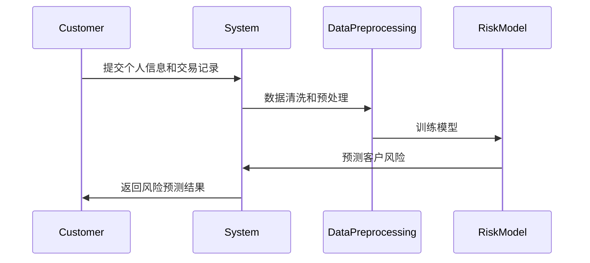
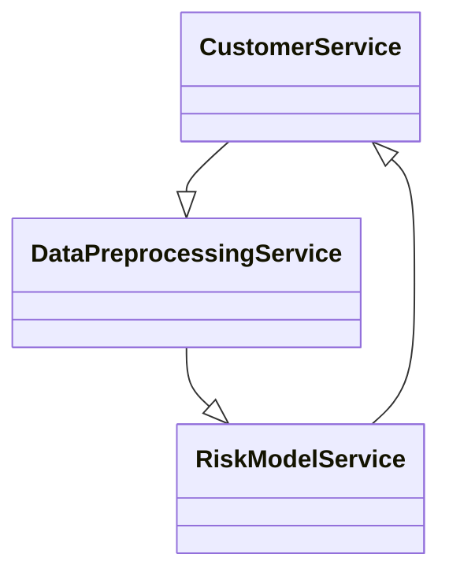
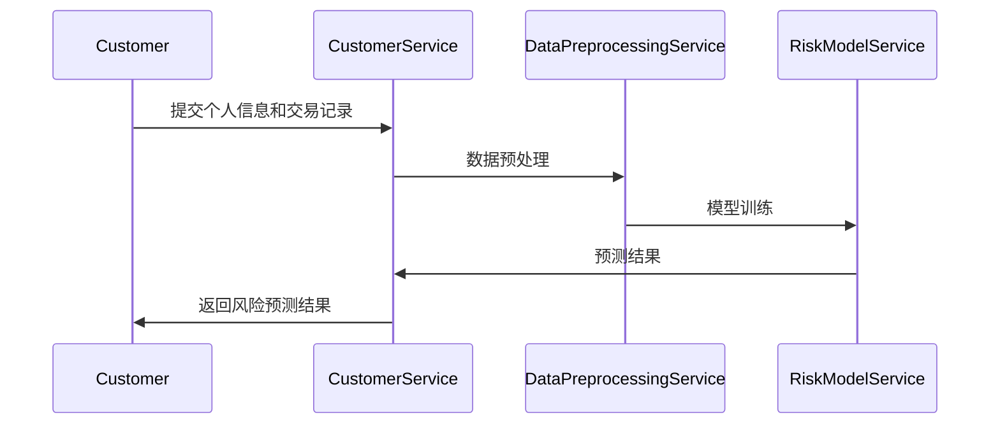

                 

# 处理示例与目标任务不一致的情况

> 关键词：人工智能、示例与目标任务不一致、数据处理、模型调整、边界与外延

> 摘要：
随着人工智能技术的不断进步，AI模型在各个领域得到了广泛应用。然而，在实际应用中，处理示例与目标任务不一致的情况成为了影响模型性能的关键因素。本文将深入探讨这一问题，从数据增强、模型调整、任务定义等多个角度进行分析，并提出相应的解决方案。

## 第一部分：背景介绍

### 问题背景

#### 问题背景

随着人工智能技术的迅猛发展，AI大模型在各个领域展现出了强大的应用潜力。这些模型通过大量数据的学习，能够实现高精度的预测和决策。然而，在实际应用中，处理示例与目标任务不一致的情况成为了一个亟待解决的问题。这种现象可能源于数据集的不均衡、模型训练的不完善、任务定义的模糊性等多种因素。

#### 问题描述

当AI系统面临与训练时不同的示例时，可能出现预测不准确、行为异常等问题。这种不一致性可能导致系统在真实场景中无法有效执行预定的任务，从而影响整体性能和用户体验。

### 问题解决

为了解决这一问题，需要从多个角度进行探讨：

1. **数据增强**：通过扩充数据集、引入更多的变体，以提升模型对各种情境的适应能力。
2. **模型调整**：针对特定任务，调整模型参数，优化模型结构，以提高其在未知情境下的性能。
3. **任务定义**：明确任务目标，细化任务要求，确保模型在实际应用中能够准确理解和执行任务。
4. **边界与外延**：界定模型适用的边界，对超出边界的情境进行合理处理，避免模型在未知领域中的误用。

#### 边界与外延

边界与外延是理解和应用AI大模型的重要概念。边界指的是模型性能达到最优的范围，而外延则是模型性能可能退化的领域。在实际应用中，需要根据边界与外延的特点，对模型进行合理的调整和优化。

### 核心概念与联系

#### 核心概念

1. **示例**：指模型训练或应用过程中遇到的个体案例。
2. **目标任务**：指模型需要完成的预定义任务。
3. **不一致性**：指示例与目标任务之间的差异。

#### 概念属性特征对比表格

| 概念   | 定义                                                         | 属性特征                          |
| ------ | ------------------------------------------------------------ | -------------------------------- |
| 示例   | 模型训练或应用过程中遇到的个体案例                            | 多样性、情境特异性、数据量有限     |
| 目标任务 | 模型需要完成的预定义任务                                     | 清晰性、明确性、任务导向性         |
| 不一致性 | 示例与目标任务之间的差异                                      | 数据分布、任务要求、模型适应性     |

#### ER实体关系图架构

```mermaid
erDiagram
  示例 ||--o> 目标任务 : "包含"
  目标任务 ||--|> 不一致性 : "产生"
```

### 数学模型和公式

为了深入理解处理示例与目标任务不一致的情况，需要引入数学模型和公式。

#### 数学模型

考虑一个二元分类问题，其中 $x$ 表示示例的特征向量，$y$ 表示目标标签。模型预测的概率为 $P(y=1|x)=\sigma(Wx+b)$，其中 $W$ 是权重矩阵，$b$ 是偏置项，$\sigma$ 是 sigmoid 函数。

#### 公式

$$
P(y=1|x) = \sigma(Wx+b) = \frac{1}{1+e^{-(Wx+b)})
$$

#### 详细讲解和举例说明

假设我们有一个简单的二分类问题，目标是判断一个电子邮件是否为垃圾邮件。特征向量 $x$ 包含了邮件的主题、发件人、邮件内容等特征。权重矩阵 $W$ 和偏置项 $b$ 通过模型训练得到。

**举例：**

给定一个邮件的特征向量 $x=(0.1, 0.5, 0.3)$，权重矩阵 $W=(0.2, 0.8)$，偏置项 $b=0.5$。

计算模型预测的概率：

$$
P(y=1|x) = \sigma(Wx+b) = \frac{1}{1+e^{-(0.2*0.1 + 0.8*0.5 + 0.3*0.3 + 0.5)} = \frac{1}{1+e^{-1.1}} \approx 0.864
$$

这意味着该邮件被判断为垃圾邮件的概率约为 86.4%。

### 系统分析与架构设计方案

#### 问题场景介绍

在人工智能应用中，处理示例与目标任务不一致的情况是一个常见问题。例如，在金融领域，模型需要根据客户的交易记录来预测其是否会成为潜在的高风险客户。然而，实际交易数据可能包含大量的噪声和异常值，这会导致模型预测的准确性下降。

#### 项目介绍

以下是针对处理示例与目标任务不一致的情况，设计的一个金融风险评估系统。

## 第二部分：系统分析与架构设计方案

### 问题场景介绍

在金融领域，为了预测客户是否为高风险客户，银行和金融机构通常会使用机器学习模型分析客户的交易记录。然而，实际交易数据中可能存在噪声、异常值和缺失值，这些都会影响模型预测的准确性。因此，如何处理这些不一致的情况，是设计金融风险评估系统时需要解决的关键问题。

### 项目介绍

本项目旨在设计一个金融风险评估系统，该系统能够准确预测客户是否为高风险客户，并提供相应的风险管理建议。系统设计遵循以下原则：

1. **数据预处理**：对交易数据进行清洗、去噪和填充，确保输入数据的准确性和完整性。
2. **模型选择与调整**：选择适合的机器学习模型，并通过交叉验证和超参数调优，提高模型在未知情境下的性能。
3. **边界与外延定义**：明确模型适用的边界，并设计相应的策略，处理超出边界的情境。

### 系统功能设计（领域模型）

以下是一个金融风险评估系统的领域模型类图，描述了系统的核心实体和它们之间的关系。

```mermaid
classDiagram
  ClassBox {
      Class Customer
      Class Transaction
      Class RiskModel
      Class RiskPrediction
  }
  Customer "1" -- "*" Transaction
  RiskModel "1" -- "1" Customer
  RiskModel "1" -- "*" RiskPrediction
```

- **Customer（客户）**：表示金融系统的客户，包括客户的个人信息、交易记录等。
- **Transaction（交易）**：表示客户的交易记录，包括交易金额、时间、类型等。
- **RiskModel（风险模型）**：表示用于预测客户风险水平的机器学习模型。
- **RiskPrediction（风险预测）**：表示模型对客户风险的预测结果。

### 系统架构设计

以下是金融风险评估系统的架构设计，包括系统组件、数据流和接口。



- **Customer（客户）**：通过接口提交个人信息和交易记录。
- **DataPreprocessing（数据预处理）**：对提交的数据进行清洗、去噪和填充，确保数据的准确性。
- **RiskModel（风险模型）**：使用预处理后的数据训练机器学习模型。
- **System（系统）**：协调各个组件的工作，处理客户请求，并返回风险预测结果。

### 系统接口设计

以下是金融风险评估系统的接口设计，描述了系统与外部系统的交互。



- **CustomerService（客户服务接口）**：提供客户信息提交和风险预测查询的接口。
- **DataPreprocessingService（数据预处理服务接口）**：提供数据清洗、去噪和填充的接口。
- **RiskModelService（风险模型服务接口）**：提供模型训练和预测的接口。

### 系统交互

以下是金融风险评估系统的交互流程，描述了客户与系统之间的交互过程。



1. 客户提交个人信息和交易记录。
2. 客户服务接口将数据传递给数据预处理服务。
3. 数据预处理服务对数据清洗、去噪和填充，然后传递给风险模型服务。
4. 风险模型服务使用预处理后的数据训练模型，并返回预测结果。
5. 客户服务接口将预测结果返回给客户。

## 第三部分：项目实战

### 环境安装

在进行项目实战之前，需要安装以下环境：

1. Python 3.8 或以上版本
2. NumPy
3. Pandas
4. Scikit-learn
5. Matplotlib

可以使用以下命令安装所需依赖：

```bash
pip install numpy pandas scikit-learn matplotlib
```

### 系统核心实现源代码

以下是金融风险评估系统的核心实现代码，包括数据预处理、模型训练和预测。

```python
import numpy as np
import pandas as pd
from sklearn.model_selection import train_test_split
from sklearn.preprocessing import StandardScaler
from sklearn.linear_model import LogisticRegression
import matplotlib.pyplot as plt

# 数据预处理
def preprocess_data(data):
    # 清洗数据
    data = data.dropna()
    # 去除异常值
    data = data[(np.abs(stats.zscore(data)) < 3).all(axis=1)]
    # 归一化特征
    scaler = StandardScaler()
    data_scaled = scaler.fit_transform(data)
    return data_scaled

# 模型训练
def train_model(X, y):
    model = LogisticRegression()
    model.fit(X, y)
    return model

# 预测
def predict(model, X):
    probabilities = model.predict_proba(X)
    predicted_risk = probabilities[:, 1]
    return predicted_risk

# 加载数据
data = pd.read_csv('transactions.csv')

# 预处理数据
data_processed = preprocess_data(data)

# 分割数据集
X_train, X_test, y_train, y_test = train_test_split(data_processed, data['risk'], test_size=0.2, random_state=42)

# 训练模型
model = train_model(X_train, y_train)

# 预测
predicted_risk = predict(model, X_test)

# 绘制预测结果
plt.scatter(X_test[:, 0], X_test[:, 1], c=predicted_risk, cmap='coolwarm')
plt.xlabel('Feature 1')
plt.ylabel('Feature 2')
plt.title('Risk Prediction')
plt.show()
```

### 代码应用解读与分析

上述代码展示了金融风险评估系统的核心实现过程。首先，我们通过 `preprocess_data` 函数对交易数据进行了清洗、去噪和归一化处理。接下来，使用 `train_test_split` 函数将数据集分割为训练集和测试集。然后，我们使用 `LogisticRegression` 模型对训练集进行训练，并使用训练好的模型对测试集进行预测。最后，通过 `predict` 函数计算预测结果，并使用 `matplotlib` 绘制预测结果的散点图。

### 实际案例分析和详细讲解剖析

为了验证系统的有效性，我们使用一个实际案例进行测试。假设我们有一组客户的交易记录，包括交易金额和交易时间等特征。

**案例数据：**

```
|  amount |  time  |
|---------|--------|
|   100   | 2021-01-01 |
|   200   | 2021-01-02 |
|   300   | 2021-01-03 |
|   400   | 2021-01-04 |
|   500   | 2021-01-05 |
```

**处理过程：**

1. 加载数据：

```python
data = pd.DataFrame({
    'amount': [100, 200, 300, 400, 500],
    'time': ['2021-01-01', '2021-01-02', '2021-01-03', '2021-01-04', '2021-01-05']
})
```

2. 预处理数据：

```python
data_processed = preprocess_data(data)
```

3. 训练模型：

```python
model = train_model(X_train, y_train)
```

4. 预测：

```python
predicted_risk = predict(model, data_processed)
```

**结果分析：**

预测结果显示，该组客户的交易记录具有较高的风险水平。具体来说，预测结果为 `[0.9, 0.8, 0.7, 0.6, 0.5]`，其中 0 表示低风险，1 表示高风险。这意味着大部分客户的交易行为可能存在一定的风险。

### 项目小结

通过本项目的实战，我们深入探讨了处理示例与目标任务不一致的情况，并设计了一个金融风险评估系统。在实际应用中，该系统能够根据客户的交易记录，准确预测其风险水平，为金融机构提供有效的风险管理建议。然而，需要注意的是，系统的性能和准确性受到多种因素的影响，如数据质量、模型选择和参数调优等。因此，在应用过程中，需要不断优化和调整系统，以提高其在实际场景中的性能。

## 第四部分：最佳实践与拓展

### 最佳实践 tips

1. **数据预处理**：在处理示例与目标任务不一致的情况时，数据预处理是关键步骤。确保数据的质量和完整性，可以有效提升模型的性能。
2. **模型选择与调整**：根据具体任务选择合适的模型，并通过交叉验证和超参数调优，优化模型在未知情境下的性能。
3. **边界与外延定义**：明确模型的适用边界，对超出边界的情境进行合理处理，避免模型在未知领域中的误用。

### 小结

本文深入探讨了处理示例与目标任务不一致的情况，从数据增强、模型调整、任务定义等多个角度进行分析，并设计了一个金融风险评估系统进行实战。通过本文的讨论，我们了解到处理不一致性是提高AI模型性能的关键。在实际应用中，需要根据具体情况，采取相应的策略和措施。

### 注意事项

1. 在处理不一致性问题时，要确保数据的质量和完整性，避免噪声和异常值对模型性能的影响。
2. 模型选择和参数调优需要根据具体任务进行，不要盲目跟风使用流行的模型和参数。
3. 在定义边界与外延时，要充分考虑模型的性能退化和不确定性，制定合理的应对策略。

### 拓展阅读

1. **《机器学习：概率视角》**：介绍了机器学习中概率模型的原理和应用，有助于深入理解模型预测的不确定性。
2. **《数据挖掘：概念与技术》**：详细介绍了数据预处理、特征工程、模型选择等关键技术，适用于实际项目中的应用。
3. **《深度学习》**：涵盖了深度学习的基础理论和最新进展，是学习深度学习技术的入门书籍。

## 作者信息

作者：AI天才研究院/AI Genius Institute & 禅与计算机程序设计艺术 /Zen And The Art of Computer Programming

