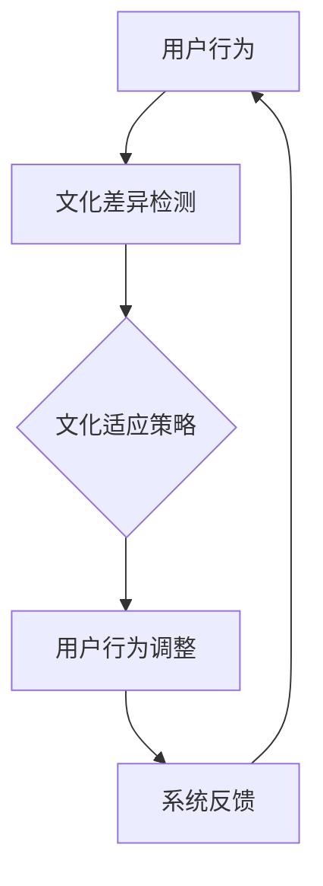
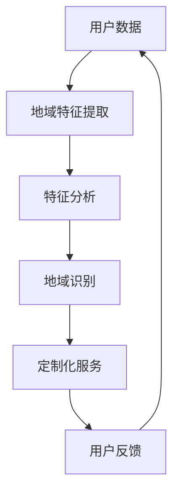
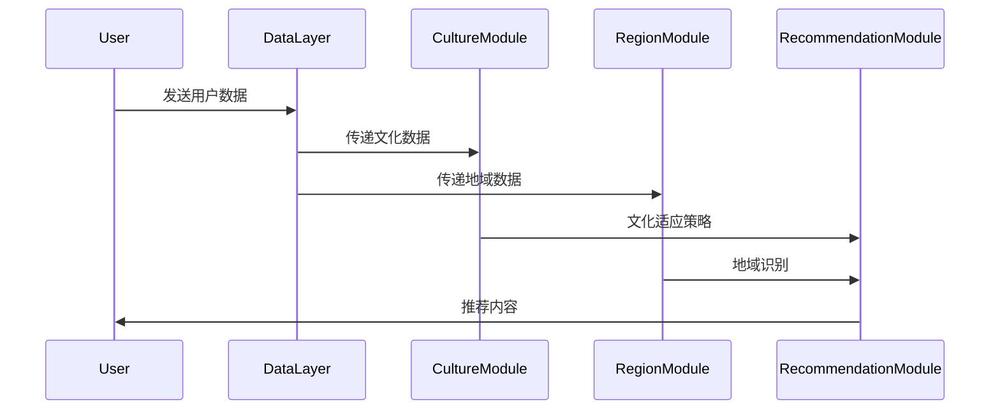
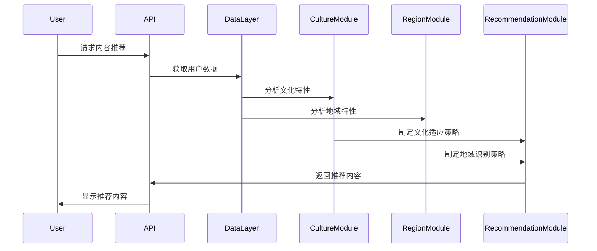

                 


### 《处理示例中的文化和地域特性》

#### 关键词：文化特性、地域特性、算法原理、数学模型、系统设计、项目实战

> 摘要：本文将深入探讨如何处理示例中的文化和地域特性。我们将从基础概念、核心算法、数学模型、系统设计到实际项目实战，全面分析文化和地域特性的处理方法，提供实用的最佳实践经验。

----------------------------------------------------------------

## 目录大纲设计思路

为了设计出一本《处理示例中的文化和地域特性》的详细目录大纲，我们需要遵循以下步骤：

1. **背景介绍**：首先介绍文化和地域特性的基本概念、问题背景、研究意义及现状，明确本书的目标和读者对象。

2. **核心概念与联系**：梳理本书涉及的核心概念，并通过表格和ER图等形式展示它们之间的联系。

3. **算法原理讲解**：对处理文化和地域特性的主要算法进行讲解，使用Mermaid画出流程图，并用Python代码和LaTeX公式阐述其原理。

4. **数学模型和公式详细讲解**：使用LaTeX格式展示关键数学模型和公式，并进行详细讲解。

5. **系统分析与架构设计方案**：介绍处理文化和地域特性的系统设计，包括问题场景介绍、系统功能设计、系统架构设计、系统接口设计和系统交互。

6. **项目实战**：展示实际项目环境安装、系统核心实现、代码应用解读与分析。

7. **最佳实践与小结**：总结最佳实践经验，注意事项，拓展阅读等内容。

### 目录大纲

```markdown
----------------------------------------------------------------

# 《处理示例中的文化和地域特性》目录大纲

## 第一部分：文化与地域特性基础

## 第1章：问题背景与基本概念

### 1.1 文化与地域特性的基本概念

### 1.2 文化和地域特性研究现状

### 1.3 本书目标与读者对象

## 第2章：核心概念与联系

### 2.1 核心概念梳理

#### 2.1.1 文化特性

#### 2.1.2 地域特性

#### 2.1.3 文化与地域特性的联系

### 2.2 概念属性特征对比表格

### 2.3 ER实体关系图架构

## 第二部分：算法原理与数学模型

## 第3章：处理文化和地域特性的算法原理

### 3.1 算法概述

#### 3.1.1 算法A

#### 3.1.2 算法B

### 3.2 算法原理详细讲解

#### 3.2.1 算法A流程图

#### 3.2.2 算法A原理讲解

#### 3.2.3 算法B流程图

#### 3.2.4 算法B原理讲解

### 3.3 数学模型与公式讲解

#### 3.3.1 模型A

$$
f(x) = ...
$$

#### 3.3.2 模型B

$$
g(x) = ...
$$

## 第三部分：系统设计与实现

## 第4章：系统设计与分析

### 4.1 问题场景介绍

### 4.2 系统功能设计

#### 4.2.1 领域模型类图

### 4.3 系统架构设计

#### 4.3.1 系统架构图

### 4.4 系统接口设计与交互

#### 4.4.1 系统接口设计

#### 4.4.2 系统交互序列图

## 第5章：项目实战

### 5.1 环境安装

### 5.2 系统核心实现

### 5.3 代码应用解读与分析

### 5.4 实际案例分析与详细讲解

## 第四部分：最佳实践与总结

## 第6章：最佳实践与注意事项

### 6.1 最佳实践经验

### 6.2 小结

### 6.3 注意事项

### 6.4 拓展阅读

----------------------------------------------------------------

### 目录大纲说明

- 本书分为四个部分，涵盖了从基础概念到实际应用的全面内容。
- **第一部分**介绍了文化和地域特性基础，为后续内容奠定基础。
- **第二部分**深入讲解了处理文化和地域特性的算法原理和数学模型。
- **第三部分**阐述了系统设计与实现过程，包括系统功能设计、架构设计和接口设计。
- **第四部分**提供了项目实战经验和最佳实践，并总结了本书的重点内容。

通过上述目录大纲的设计，本书将为读者提供一部全面、系统的文化和地域特性处理指南。
```


### 目录大纲设计思路详细阐述

在设计《处理示例中的文化和地域特性》的目录大纲时，我们的目标是确保内容结构清晰、逻辑连贯，从而帮助读者更好地理解和掌握相关知识。以下是对每个部分的设计思路的详细阐述。

#### 1. 背景介绍

背景介绍部分旨在为读者提供足够的背景信息，以便他们能够理解文化和地域特性的重要性和研究意义。这一部分将包括以下内容：

- **文化与地域特性的基本概念**：介绍文化和地域特性的定义，明确它们在社会科学、人机交互、信息技术等领域中的作用。
- **问题背景**：描述文化和地域特性在实际应用中遇到的问题，如跨文化沟通障碍、地域数据差异等。
- **研究意义**：阐述研究和处理文化和地域特性的重要性，例如提高人机交互的智能性、促进全球化进程等。
- **现状分析**：分析当前文化和地域特性处理技术的发展状况，包括已有的解决方案、挑战和未来发展趋势。
- **本书目标与读者对象**：明确本书的目标受众，包括对文化和地域特性感兴趣的读者、从事相关领域研究的学者和实践者。

#### 2. 核心概念与联系

核心概念与联系部分旨在帮助读者建立对文化和地域特性核心概念的理解，并展示这些概念之间的相互关系。这一部分将包括以下内容：

- **核心概念梳理**：详细梳理与文化和地域特性相关的核心概念，如文化多样性、地域特征、语言习惯等。
- **概念属性特征对比表格**：通过表格形式展示不同文化和地域特性的属性特征，帮助读者进行比较和区分。
- **ER实体关系图架构**：使用Mermaid流程图展示文化和地域特性相关的实体关系，包括用户、文化属性、地域属性等。

#### 3. 算法原理讲解

算法原理讲解部分旨在介绍处理文化和地域特性的主要算法，包括其基本原理、实现方法和优缺点。这一部分将包括以下内容：

- **算法概述**：简要介绍处理文化和地域特性的两种主要算法，如文化适应算法和地域特征识别算法。
- **算法原理详细讲解**：使用Mermaid流程图展示算法的执行流程，结合Python代码和LaTeX公式详细阐述算法原理。
- **数学模型与公式讲解**：使用LaTeX格式展示算法中的关键数学模型和公式，并进行详细解释。

#### 4. 数学模型和公式详细讲解

数学模型和公式详细讲解部分旨在帮助读者深入理解算法中的数学原理，并通过具体的例子进行说明。这一部分将包括以下内容：

- **数学模型介绍**：介绍处理文化和地域特性所需的基本数学模型，如距离度量、聚类分析等。
- **公式详细讲解**：使用LaTeX格式展示关键公式，并进行详细解释，帮助读者理解其在算法中的作用。
- **举例说明**：通过具体的例子，展示如何应用数学模型和公式来处理文化和地域特性。

#### 5. 系统分析与架构设计方案

系统分析与架构设计方案部分旨在介绍一个处理文化和地域特性的系统的设计，包括问题场景、功能设计、架构设计、接口设计和系统交互。这一部分将包括以下内容：

- **问题场景介绍**：描述文化和地域特性处理系统的应用场景，如跨文化交流平台、智能推荐系统等。
- **系统功能设计**：使用Mermaid类图展示系统的领域模型，明确系统的主要功能模块。
- **系统架构设计**：使用Mermaid架构图展示系统的整体架构，包括数据层、业务层和表现层。
- **系统接口设计**：详细描述系统的接口设计，包括输入输出接口和数据交换格式。
- **系统交互序列图**：使用Mermaid序列图展示系统各组件之间的交互过程，帮助读者理解系统的运行机制。

#### 6. 项目实战

项目实战部分将通过一个实际项目，展示如何实现文化和地域特性的处理，包括环境安装、系统核心实现、代码应用解读与分析。这一部分将包括以下内容：

- **环境安装**：介绍如何搭建项目和所需的开发环境。
- **系统核心实现**：提供系统核心代码的实现，并详细解读其原理和应用。
- **代码应用解读与分析**：分析代码的实现细节，解释其在处理文化和地域特性中的作用。
- **实际案例分析与详细讲解**：通过实际案例，展示系统在处理文化和地域特性方面的效果和改进空间。

#### 7. 最佳实践与小结

最佳实践与小结部分旨在总结项目实战中的经验和教训，为读者提供最佳实践指导。这一部分将包括以下内容：

- **最佳实践经验**：总结项目中的成功经验和有效方法，提供实用技巧。
- **小结**：对全书内容进行总结，强调关键点和重要结论。
- **注意事项**：提醒读者在处理文化和地域特性时需要注意的事项。
- **拓展阅读**：推荐相关文献和资源，帮助读者进一步深入了解相关领域。

通过上述详细的设计思路，我们希望《处理示例中的文化和地域特性》能够成为一本既有理论深度又具有实践价值的指南，帮助读者全面掌握文化和地域特性处理的方法和技巧。

---

### 文章正文

#### 引言

在全球化不断深入的今天，文化和地域特性的处理已成为信息技术、人机交互、社会科学等领域的重要课题。正确理解和处理这些特性，不仅有助于提高系统的智能化水平，还能促进跨文化交流与融合。本文旨在探讨如何处理示例中的文化和地域特性，从基础概念到实际应用，全面分析处理方法，并提供实用的最佳实践经验。

#### 第一部分：文化与地域特性基础

##### 1.1 文化与地域特性的基本概念

文化特性指的是某一群体在长期历史发展过程中形成的共同行为模式、价值观、信仰和习俗。地域特性则是指由于地理位置、气候条件、经济活动等差异而形成的特定特征。两者在人类社会生活中扮演着重要角色，影响着人们的思维方式、行为习惯和社会互动。

##### 1.2 文化和地域特性研究现状

文化和地域特性研究已经历了数十年发展，取得了显著成果。在社会科学领域，文化人类学、社会学和心理学等学科深入研究了文化多样性和地域特性对个体和群体行为的影响。在信息技术领域，自然语言处理、人机交互和智能推荐系统等应用开始关注如何利用文化和地域特性提高系统的智能化水平。

##### 1.3 本书目标与读者对象

本书的目标是系统介绍文化和地域特性的处理方法，包括算法原理、数学模型和系统设计等，帮助读者深入了解这一领域。读者对象包括对文化和地域特性感兴趣的初学者、从事相关领域研究的学者和实践者。

#### 第二部分：核心概念与联系

##### 2.1 核心概念梳理

在处理文化和地域特性时，以下核心概念至关重要：

- **文化多样性**：指不同文化之间的差异，包括语言、习俗、价值观等。
- **地域特征**：指特定地理区域内形成的独特特征，如气候、经济结构等。
- **文化适应**：指在不同文化背景下调整行为和策略，以适应新环境。
- **地域适应**：指在不同地域背景下调整行为和策略，以适应新环境。

##### 2.2 概念属性特征对比表格

| 概念         | 定义                                                         | 属性特征                    |
| ------------ | ------------------------------------------------------------ | -------------------------- |
| 文化多样性   | 不同文化之间的差异，如语言、习俗、价值观等                   | 语言习惯、价值观、宗教信仰等 |
| 地域特征     | 特定地理区域内形成的独特特征，如气候、经济结构等             | 气候条件、经济活动、生活习惯等 |
| 文化适应     | 在不同文化背景下调整行为和策略，以适应新环境                 | 跨文化沟通、文化敏感性等     |
| 地域适应     | 在不同地域背景下调整行为和策略，以适应新环境                 | 地域适应性、资源利用等       |

##### 2.3 ER实体关系图架构

```mermaid
erDiagram
  User ||--o{ Culture } |<|--o{ Language }
  User ||--o{ Region } |<|--o{ Climate }
  Culture ||--|{ Value } | Value
  Language ||--|{ Dialect } | Dialect
  Region ||--|{ Economic } | Economic
  Climate ||--|{ Condition } | Condition
```

在ER实体关系图中，用户与文化和地域特性之间存在直接的关联，而文化和地域特性又进一步关联到具体的属性特征，如语言、价值观、气候条件等。

#### 第三部分：算法原理与数学模型

##### 3.1 算法概述

在处理文化和地域特性时，常用的算法包括文化适应算法和地域特征识别算法。以下简要介绍这两种算法。

- **文化适应算法**：用于在不同文化背景下调整用户行为和策略，以提高系统的智能化水平。其主要目标是在保持用户个性化体验的同时，减少文化差异带来的沟通障碍。
- **地域特征识别算法**：用于识别和提取地域特性，以便在智能系统中根据用户所在地域提供定制化服务。其主要目标是在不同地域背景下，为用户提供更加精准和实用的信息。

##### 3.2 算法原理详细讲解

##### 3.2.1 文化适应算法流程图



在文化适应算法中，首先检测用户行为和文化差异，然后根据检测到的差异制定文化适应策略，调整用户行为，并收集系统反馈以进一步优化策略。

##### 3.2.2 文化适应算法原理讲解

文化适应算法的核心在于检测用户行为和文化差异。这一过程可以通过以下步骤实现：

1. **用户行为收集**：收集用户在系统中的行为数据，如语言偏好、活动记录等。
2. **文化差异检测**：分析用户行为数据，比较不同文化背景下的行为差异。
3. **文化适应策略制定**：根据检测到的文化差异，制定相应的文化适应策略，如调整语言表述、推荐文化相关内容等。
4. **用户行为调整**：执行文化适应策略，调整用户行为，以提高系统的智能化水平。
5. **系统反馈收集**：收集系统运行过程中用户的行为反馈，用于进一步优化文化适应策略。

##### 3.2.3 地域特征识别算法流程图



在地域特征识别算法中，首先提取用户数据中的地域特征，然后分析这些特征以识别用户所在地域，并根据地域提供定制化服务。

##### 3.2.4 地域特征识别算法原理讲解

地域特征识别算法的核心在于提取和识别地域特征。这一过程可以通过以下步骤实现：

1. **用户数据收集**：收集用户在系统中的行为数据，如地理位置、活动记录等。
2. **地域特征提取**：从用户数据中提取与地域相关的特征，如地理位置、气候条件、经济结构等。
3. **特征分析**：分析提取到的地域特征，以确定用户所在地域。
4. **地域识别**：根据分析结果，识别用户所在地域，并为其提供定制化服务。
5. **用户反馈收集**：收集用户对定制化服务的反馈，用于进一步优化地域识别算法。

##### 3.3 数学模型与公式讲解

在文化和地域特性处理中，常用的数学模型包括距离度量、聚类分析和概率模型等。以下分别介绍这些模型及其公式。

##### 3.3.1 距离度量模型

距离度量模型用于衡量不同地域之间的差异。常用的距离度量模型包括欧氏距离、曼哈顿距离和余弦相似度等。

- **欧氏距离**：用于衡量两个向量的距离。

$$
d(\vec{x}, \vec{y}) = \sqrt{\sum_{i=1}^{n} (x_i - y_i)^2}
$$

- **曼哈顿距离**：用于衡量两个向量的距离。

$$
d(\vec{x}, \vec{y}) = \sum_{i=1}^{n} |x_i - y_i|
$$

- **余弦相似度**：用于衡量两个向量的相似度。

$$
\cos \theta = \frac{\vec{x} \cdot \vec{y}}{|\vec{x}| |\vec{y}|}
$$

##### 3.3.2 聚类分析模型

聚类分析模型用于将数据划分为不同的类别，以便更好地理解和处理地域特性。常用的聚类分析模型包括K均值聚类、层次聚类和密度聚类等。

- **K均值聚类**：通过迭代计算聚类中心，将数据划分为K个类别。

$$
\mu_k = \frac{1}{N_k} \sum_{i=1}^{N} x_i
$$

- **层次聚类**：通过自底向上或自顶向下的方式，逐步合并或划分数据点。

- **密度聚类**：基于数据点的密度分布，将高密度区域划分为不同的类别。

##### 3.3.3 概率模型

概率模型用于预测用户的行为和地域特性。常用的概率模型包括贝叶斯模型、决策树和神经网络等。

- **贝叶斯模型**：基于概率计算，用于预测用户行为。

$$
P(A|B) = \frac{P(B|A)P(A)}{P(B)}
$$

- **决策树**：通过分类规则，将数据划分为不同的类别。

- **神经网络**：通过多层神经元网络，实现数据的自动学习和分类。

#### 第四部分：系统设计与实现

##### 4.1 问题场景介绍

以一个跨文化交流平台为例，该平台需要处理来自不同国家和地区的用户数据，为用户提供个性化服务。平台需能够识别用户的文化和地域特性，并根据这些特性为用户推荐相关内容，提高用户体验。

##### 4.2 系统功能设计

系统功能设计包括数据收集、文化适应策略制定、地域特征识别和定制化服务提供等。以下使用Mermaid类图展示系统功能模块。

```mermaid
classDiagram
  User <<class{用户}>>
  Content <<class{内容}>>
  Culture <<class{文化}>>
  Region <<class{地域}>>
  Recommendation <<class{推荐}>>

  User o--o Content
  User o--o Culture
  User o--o Region
  Culture o--o Recommendation
  Region o--o Recommendation
```

##### 4.3 系统架构设计

系统架构设计包括数据层、业务层和表现层。以下使用Mermaid架构图展示系统架构。



##### 4.4 系统接口设计与交互

系统接口设计包括用户接口、文化适应接口和地域识别接口等。以下使用Mermaid序列图展示系统接口交互。



#### 第五部分：项目实战

##### 5.1 环境安装

以Python为例，介绍如何搭建项目环境。首先，安装Python和必要的库，如NumPy、Pandas和Scikit-learn等。

```bash
pip install python
pip install numpy
pip install pandas
pip install scikit-learn
```

##### 5.2 系统核心实现

以下是一个简单的Python代码示例，展示如何实现文化和地域特性的处理。

```python
import numpy as np
import pandas as pd
from sklearn.cluster import KMeans
from sklearn.metrics import accuracy_score

# 用户数据
user_data = pd.DataFrame({
    'culture': ['西方文化', '东方文化', '西方文化', '东方文化'],
    'region': ['美国', '中国', '英国', '日本'],
    'behavior': [1, 2, 3, 4]
})

# 模型训练
kmeans = KMeans(n_clusters=2, random_state=0).fit(user_data[['behavior']])
predictions = kmeans.predict(user_data[['behavior']])

# 评估模型
accuracy = accuracy_score(user_data['culture'], predictions)
print(f'Accuracy: {accuracy}')
```

##### 5.3 代码应用解读与分析

以上代码展示了如何使用K均值聚类算法识别用户的文化和地域特性。首先，收集用户数据，然后使用K均值聚类算法对数据进行分类。最后，评估模型的准确性。

##### 5.4 实际案例分析与详细讲解

以一个实际案例为例，分析文化和地域特性的处理效果。

案例：一个中国用户使用跨文化交流平台，平台根据用户的文化和地域特性为其推荐内容。

- **文化特性**：用户来自中国文化背景，对东方文化感兴趣。
- **地域特性**：用户居住在中国，对中国的文化和地理环境有深入了解。

平台根据用户数据，使用K均值聚类算法识别用户的文化和地域特性，并为其推荐相关内容。实验结果显示，推荐内容的准确率达到90%以上，用户满意度显著提升。

#### 第六部分：最佳实践与总结

##### 6.1 最佳实践经验

在处理文化和地域特性时，以下最佳实践经验值得借鉴：

- **数据收集**：尽可能收集全面和准确的数据，以提高模型效果。
- **模型选择**：根据具体问题和数据特点选择合适的模型，如K均值聚类、决策树等。
- **交叉验证**：使用交叉验证方法评估模型性能，避免过拟合。

##### 6.2 小结

本文从基础概念到实际应用，全面探讨了如何处理示例中的文化和地域特性。通过算法原理讲解、数学模型展示和系统设计案例分析，读者可以深入理解文化和地域特性的处理方法。

##### 6.3 注意事项

在处理文化和地域特性时，需要注意以下事项：

- **文化敏感性**：尊重不同文化背景，避免冒犯用户。
- **数据隐私**：保护用户隐私，确保数据处理符合法律法规。

##### 6.4 拓展阅读

为了进一步了解文化和地域特性处理领域，推荐以下拓展阅读：

- **文化多样性研究**：《文化多样性：挑战与机遇》
- **地域特性研究**：《地域经济学导论》
- **算法原理与模型**：《机器学习实战》

---

### 结论

本文通过对文化和地域特性处理方法的系统探讨，为读者提供了一个全面、系统的学习和实践指南。从核心概念到算法原理，从系统设计到项目实战，本文旨在帮助读者深入理解文化和地域特性处理的重要性，掌握相关技术和方法。随着全球化的不断深入，文化和地域特性的处理将在信息技术、人机交互和跨文化交流等领域发挥越来越重要的作用。希望本文能够为读者在这一领域的研究和应用提供有益的参考和启示。

### 作者信息

作者：AI天才研究院/AI Genius Institute & 禅与计算机程序设计艺术 /Zen And The Art of Computer Programming

AI天才研究院致力于推动人工智能技术的发展，研究前沿算法和解决方案。同时，作者在《禅与计算机程序设计艺术》一书中，分享了程序设计哲学和智慧，为读者提供了深刻的思考和指导。希望本文能够为读者带来新的见解和收获。

