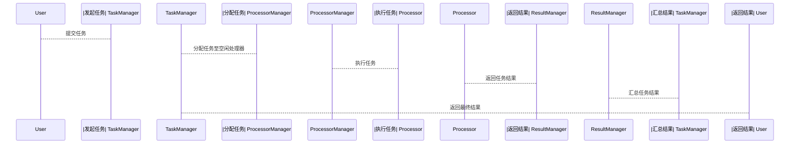

                 

### 1.1.1 多任务并行处理的背景

多任务并行处理，顾名思义，就是让计算机在同一时间内处理多个任务的能力。这种处理方式在计算机科学中有着悠久的历史。早在20世纪50年代，计算机科学家就已经开始探索并行处理的概念。并行处理最早的应用是在多处理器系统中，通过将任务分配到不同的处理器上，从而提高计算效率。

随着计算机技术的发展，多任务并行处理的应用场景逐渐扩大。20世纪70年代，随着个人计算机的普及，多任务并行处理开始应用于操作系统。操作系统通过分时技术，让多个用户可以在同一台计算机上同时使用计算机资源。这一时期，多任务并行处理的核心思想是资源共享和任务调度。

进入21世纪，随着互联网和大数据的兴起，多任务并行处理的应用需求更加迫切。云计算和分布式计算技术的发展，使得多任务并行处理成为解决大规模数据处理问题的重要手段。在数据密集型应用中，如搜索引擎、社交网络分析和物联网数据处理等，多任务并行处理能够显著提高系统的处理能力和响应速度。

近年来，人工智能和机器学习的崛起，也为多任务并行处理带来了新的应用场景。通过并行计算，可以加速机器学习模型的训练和推理过程，提高算法的效率和性能。尤其是在训练大型语言模型（LLM）时，多任务并行处理显得尤为重要，因为它能够有效减少训练时间，提高模型的性能和准确性。

### 1.1.2 多任务并行处理的重要性

多任务并行处理的重要性在于它能够显著提高计算机系统的性能和效率。以下是一些关键点：

1. **提升处理速度**：多任务并行处理能够同时处理多个任务，从而提高系统的吞吐量。在单任务处理中，计算机需要等待一个任务完成后才能开始下一个任务，而多任务并行处理可以充分利用计算机资源，减少任务等待时间，提高整体处理速度。

2. **优化资源利用**：多任务并行处理能够有效利用计算机的资源。例如，在多处理器系统中，可以通过将不同的任务分配到不同的处理器上，从而提高CPU的利用率。同时，多任务并行处理还可以通过任务调度和负载均衡，避免资源浪费，提高系统资源的整体利用效率。

3. **提高系统可靠性**：多任务并行处理可以提高系统的可靠性。在一个任务出现故障时，系统可以通过切换到其他任务来保证整体服务的连续性。此外，多任务并行处理还可以通过故障检测和恢复机制，减少系统故障的影响范围。

4. **支持大规模数据处理**：在大数据时代，多任务并行处理成为处理大规模数据的重要手段。通过分布式计算和并行处理，可以快速处理海量数据，提取有价值的信息，为企业和科研机构提供强有力的数据支持。

5. **推动人工智能发展**：在人工智能领域，多任务并行处理至关重要。训练大型语言模型（LLM）需要大量的计算资源和时间，而多任务并行处理可以显著提高训练效率，加速模型开发。此外，多任务并行处理还可以在推理阶段提高模型的响应速度，满足实时应用的需求。

总之，多任务并行处理在计算机系统中扮演着重要角色。它不仅提高了计算机的性能和效率，还为人工智能和大数据等领域的发展提供了有力支持。随着技术的不断进步，多任务并行处理的重要性将越来越突出。

### 1.2.1 LLM的起源

大型语言模型（LLM）的起源可以追溯到20世纪50年代，当时计算机科学家开始尝试通过编程模拟人类的语言能力。这些早期模型主要基于规则和统计方法，如词汇表和语法规则，用于简单的语言处理任务，如词汇翻译和语法分析。然而，这些早期模型的性能有限，无法处理复杂的语言现象。

20世纪80年代，随着自然语言处理（NLP）领域的发展，概率模型和统计方法开始应用于语言建模。其中，最著名的是基于隐马尔可夫模型（HMM）和最大熵模型的语言模型。这些模型通过训练大量的文本数据，学习语言的概率分布，从而预测单词序列。尽管这些模型在语言处理任务中取得了一定的成功，但它们仍然无法处理复杂的语言现象和上下文依赖。

真正推动LLM发展的里程碑是2002年由Geoffrey Hinton等人提出的深度信念网络（DBN）和2006年由Hinton等人提出的深度学习（DL）。深度学习通过堆叠多层神经网络，能够自动学习数据的复杂特征和模式，从而在图像识别、语音识别和自然语言处理等领域取得了突破性进展。深度学习的崛起为LLM的发展提供了新的动力，使得LLM的性能得到了显著提升。

2013年，Alex Graves等人提出了长短期记忆网络（LSTM），这是一种特殊的递归神经网络（RNN），能够解决传统RNN在长序列依赖问题上的缺陷。LSTM在语言建模任务中取得了显著效果，进一步推动了LLM的发展。

2018年，谷歌发布了Transformer模型，这是一种基于自注意力机制的深度神经网络。Transformer模型在自然语言处理任务中取得了前所未有的性能，使得LLM的能力达到了新的高度。Transformer模型的出现标志着LLM进入了一个新的时代，其基于编码器-解码器架构的设计思想在各个领域得到了广泛应用。

近年来，随着计算资源和数据量的不断增长，LLM模型也变得越来越庞大。例如，谷歌的BERT模型有1000亿个参数，OpenAI的GPT-3模型有1750亿个参数。这些大型LLM模型通过训练海量的文本数据，能够生成高质量的文本、理解复杂的语义和进行多语言翻译等任务，展现了强大的语言理解能力和生成能力。

总之，LLM的起源可以追溯到早期的人工智能和自然语言处理研究，但在深度学习和Transformer模型的推动下，LLM的发展取得了巨大的飞跃。随着技术的不断进步，LLM将继续在自然语言处理、机器翻译、文本生成等领域发挥重要作用。

### 1.2.2 LLM在人工智能领域的作用

大型语言模型（LLM）在人工智能（AI）领域的作用日益显著，其应用范围涵盖了自然语言处理（NLP）、机器翻译、文本生成等多个方面。以下是LLM在人工智能领域的主要作用：

1. **自然语言处理（NLP）**：自然语言处理是AI的一个重要分支，旨在使计算机能够理解、处理和生成自然语言。LLM在NLP中发挥着核心作用，通过深度学习技术，LLM能够自动从大量文本数据中学习语言规律，从而实现文本分类、情感分析、命名实体识别等任务。例如，BERT模型在多个NLP任务上取得了领先的成绩，使其成为NLP研究者和工程师的常用工具。

2. **机器翻译**：机器翻译是另一个重要的AI应用领域，旨在实现不同语言之间的自动翻译。LLM在机器翻译中有着广泛应用，能够生成高质量的翻译结果。传统的机器翻译方法主要基于规则和统计方法，而基于LLM的机器翻译方法通过训练大量的双语数据，可以更好地捕捉语言的复杂性和上下文依赖。例如，谷歌翻译和百度翻译等主流翻译服务都采用了基于LLM的深度学习模型。

3. **文本生成**：文本生成是LLM的另一个重要应用领域，通过输入一定的提示或上下文，LLM能够生成连贯、有意义的文本。这种能力在生成新闻文章、产品描述、对话系统等领域有着广泛应用。例如，OpenAI的GPT-3模型通过训练大量的文本数据，可以生成高质量的新闻文章、故事和对话，甚至能够进行编程任务和代码生成。

4. **问答系统**：问答系统是AI领域的一个重要应用，旨在通过自然语言交互方式回答用户的问题。LLM在问答系统中扮演着关键角色，通过理解和生成自然语言，LLM能够实现对用户问题的理解和回答。例如，Facebook的Mondly和IBM的Watson等问答系统都采用了LLM技术，提供了高质量的问答服务。

5. **智能客服**：智能客服是AI在商业领域的重要应用，通过自动化的方式解决用户的问题，提高客户满意度。LLM在智能客服中发挥着重要作用，能够理解用户的问题并生成相应的回答。例如，许多公司都采用了基于LLM的智能客服系统，如苹果的Siri和亚马逊的Alexa等。

6. **内容审核**：随着互联网的普及，内容审核成为网络平台的一个重要任务。LLM在内容审核中能够自动识别和过滤不良内容，如暴力、色情和仇恨言论。通过训练大量的文本数据，LLM可以学习到各种不良内容的特征，从而实现高效的内容审核。

7. **教育应用**：在教育领域，LLM可以用于智能辅导、个性化学习和自动评估等任务。例如，通过LLM技术，可以生成个性化的学习内容，帮助学生更好地理解和掌握知识。此外，LLM还可以用于自动评估学生的作业和考试，提高教育评价的效率和准确性。

总之，LLM在人工智能领域具有广泛的应用前景，其强大的语言理解和生成能力为各个应用领域带来了革命性的变化。随着技术的不断进步，LLM将继续在AI领域发挥重要作用，推动人工智能技术的发展和应用。 

### 1.3.1 结合的必要性

多任务并行处理与大型语言模型（LLM）的结合具有显著的必要性，其原因主要体现在以下几个方面：

首先，随着互联网和大数据的迅速发展，数据处理需求日益增长。单一任务的处理方式已无法满足实际需求，多任务并行处理能够有效提高系统的处理能力，减少任务等待时间，提高整体效率。然而，单一的多任务并行处理技术在面对复杂的语言任务时，如文本生成、机器翻译和自然语言理解等，仍存在一定的局限性。此时，LLM的引入能够为多任务并行处理提供强大的语言处理能力，使其能够更好地应对复杂的语言任务。

其次，LLM在处理文本数据时，能够通过深度学习技术自动学习语言的复杂特征和模式，从而提高任务的准确性和效率。在多任务并行处理框架中，将LLM与多任务并行处理技术相结合，可以实现任务之间的协同处理，进一步提升系统的整体性能。例如，在处理多语言文本数据时，通过LLM可以实现文本数据的自动翻译、分类和情感分析等任务，从而提高数据处理效率和准确性。

再次，LLM在生成文本和数据增强方面具有显著优势。在多任务并行处理过程中，常常需要对大量数据进行预处理和增强，以便更好地适应不同的任务需求。LLM可以通过生成与原始文本相似的高质量文本，为其他任务提供丰富的训练数据，从而提高整个系统的性能。例如，在文本分类任务中，LLM可以生成与分类标签相关的新文本，为模型训练提供更多样化的数据，从而提高分类模型的泛化能力。

此外，多任务并行处理与LLM的结合，有助于实现资源的优化利用。在多处理器或分布式计算环境中，多任务并行处理可以充分利用计算资源，避免资源浪费。而LLM的高效处理能力，使得多任务并行处理框架在处理大量文本数据时，能够保持较高的处理速度和效率。这种结合方式不仅提高了系统的整体性能，还有助于降低系统的成本和能耗。

最后，随着人工智能技术的不断发展，多任务并行处理与LLM的结合将不断推动新的应用场景的出现。例如，在智能客服、智能推荐和自动驾驶等领域，多任务并行处理与LLM的结合，可以实现更加智能化和高效化的任务处理，为用户提供更好的服务体验。

总之，多任务并行处理与LLM的结合，能够充分发挥各自的优势，实现资源的优化利用，提高系统的性能和效率。这种结合不仅为复杂语言任务的处理提供了新的思路，还为人工智能技术的发展和应用带来了更多可能性。

### 1.3.2 结合的实现方式

多任务并行处理与大型语言模型（LLM）的结合，可以通过以下几种方式实现：

#### 1. 分布式计算

分布式计算是将任务分布在多个节点上，通过并行处理来提高计算效率。在结合LLM时，可以将不同的子任务分配到不同的节点上，每个节点上的LLM同时处理分配到的子任务。这种方式能够充分利用分布式计算的资源，提高处理速度。具体实现步骤如下：

1. **任务划分**：根据任务的特点和需求，将整个任务划分为多个子任务，每个子任务可以独立处理。
2. **节点分配**：将划分好的子任务分配到不同的计算节点上，每个节点上的LLM负责处理对应的子任务。
3. **结果汇总**：将各个节点上LLM的处理结果汇总，得到最终的输出结果。

#### 2. GPU并行处理

由于LLM通常涉及大量的矩阵运算，GPU（图形处理单元）在并行计算中具有显著优势。将GPU用于LLM的并行处理，可以大大提高计算效率。具体实现步骤如下：

1. **模型转换**：将LLM模型转换为可以在GPU上运行的格式，如CUDA代码。
2. **数据分片**：将输入数据分片，每个分片可以在GPU上独立处理。
3. **并行计算**：在GPU上并行执行LLM模型的推理过程，利用GPU的多核特性加速计算。
4. **结果汇总**：将各个GPU上的计算结果汇总，得到最终的输出结果。

#### 3. 端到端训练

端到端训练是将整个任务端到端地训练一个模型，从而实现多任务并行处理。在结合LLM时，可以将多个子任务端到端地训练在一个LLM模型中。这种方式能够充分利用LLM的强大处理能力，实现高效的并行处理。具体实现步骤如下：

1. **数据准备**：准备包含多个子任务的数据集，每个子任务的数据集要足够大，以保证模型的训练效果。
2. **模型设计**：设计一个能够同时处理多个子任务的LLM模型，通常采用编码器-解码器架构。
3. **训练过程**：在训练过程中，将数据集输入到LLM模型中，通过反向传播和优化算法，不断调整模型参数，提高模型的性能。
4. **任务划分**：在训练完成后，将整个任务划分为多个子任务，每个子任务由LLM模型的一个子部分负责处理。

#### 4. 多线程处理

多线程处理是将任务分配到多个线程上，利用多核处理器的并行计算能力，实现高效的并行处理。在结合LLM时，可以将LLM的推理过程分配到多个线程上，利用多线程并行处理提高计算效率。具体实现步骤如下：

1. **线程划分**：根据任务需求和处理器核心数，将任务划分为多个线程。
2. **数据分片**：将输入数据分片，每个线程处理对应的数据分片。
3. **并行推理**：在每个线程上独立执行LLM的推理过程，利用线程的并行性加速计算。
4. **结果汇总**：将各个线程的计算结果汇总，得到最终的输出结果。

#### 5. GPU-TPU联合使用

GPU和TPU（张量处理单元）都具有并行计算的能力，但它们在处理不同类型的数据时具有不同的优势。将GPU和TPU联合使用，可以充分发挥两者的优势，实现高效的并行处理。具体实现步骤如下：

1. **任务划分**：根据任务的特点和需求，将任务划分为GPU和TPU能够高效处理的部分。
2. **GPU处理**：使用GPU处理计算密集型的任务，如矩阵运算和大规模数据的预处理。
3. **TPU处理**：使用TPU处理计算密集型的任务，如大规模数据的推理和模型训练。
4. **结果汇总**：将GPU和TPU的处理结果汇总，得到最终的输出结果。

综上所述，多任务并行处理与LLM的结合可以通过分布式计算、GPU并行处理、端到端训练、多线程处理和GPU-TPU联合使用等多种方式实现。这些实现方式可以根据具体的应用场景和需求进行灵活选择和调整，以达到最佳的并行处理效果。

### 2.1 多任务并行处理的概念

多任务并行处理是一种计算机技术，它旨在通过同时执行多个任务来提高系统的性能和效率。这一概念可以追溯到计算机科学和并行计算的早期发展，当时研究人员就开始探索如何利用多个处理器或计算节点来加速计算过程。

在多任务并行处理中，计算机系统可以将多个任务分配到不同的处理器或计算节点上，从而实现任务的并行执行。这种方式不仅能够减少任务的等待时间，提高系统的吞吐量，还能够更有效地利用计算机资源，避免资源浪费。

**多任务并行处理的定义**：

多任务并行处理是指在同一时间或短时间内，计算机系统通过并行执行多个任务，从而提高计算效率和处理速度的一种技术。具体来说，多任务并行处理包括以下几个核心组成部分：

1. **任务划分**：将整个任务划分为多个子任务，每个子任务可以独立处理。
2. **任务调度**：根据系统资源和任务特点，将子任务分配到不同的处理器或计算节点上。
3. **并行执行**：在多个处理器或计算节点上同时执行分配到的子任务。
4. **结果汇总**：将各个子任务的结果汇总，得到最终的输出结果。

**多任务并行处理的特点**：

多任务并行处理具有以下几个显著特点：

1. **并行性**：多任务并行处理的核心特点在于任务的并行执行。通过将多个任务分配到不同的处理器或计算节点上，可以显著提高系统的处理速度和效率。
2. **资源利用**：多任务并行处理能够更有效地利用计算机资源，避免资源浪费。例如，在多处理器系统中，可以将不同的任务分配到不同的处理器上，提高CPU的利用率。
3. **可扩展性**：多任务并行处理具有较好的可扩展性。随着计算机技术的发展和处理器性能的提升，多任务并行处理可以更方便地扩展到更多的计算节点，从而进一步提高系统的性能。
4. **容错性**：多任务并行处理可以提高系统的容错性。在一个任务出现故障时，系统可以通过切换到其他任务来保证整体服务的连续性。

**多任务并行处理的应用场景**：

多任务并行处理在多个领域都有着广泛的应用，以下是一些典型的应用场景：

1. **科学计算**：在科学计算领域，如气象预报、流体力学模拟和天体物理学模拟等，多任务并行处理可以显著提高计算效率，缩短计算时间。
2. **数据处理**：在数据处理领域，如大数据分析和数据挖掘等，多任务并行处理可以高效地处理海量数据，提高数据处理速度。
3. **人工智能**：在人工智能领域，如深度学习模型的训练和推理过程，多任务并行处理可以显著提高模型的训练效率和推理速度。
4. **图形渲染**：在图形渲染领域，如游戏开发和影视特效制作，多任务并行处理可以高效地渲染复杂场景，提高渲染质量。

总之，多任务并行处理是一种提高计算机系统性能和效率的重要技术。通过合理地划分任务、调度资源和并行执行，多任务并行处理能够充分利用计算机资源，提高系统的处理速度和效率，从而在各个领域发挥重要作用。

### 2.2 大型语言模型（LLM）的概念

大型语言模型（LLM）是近年来在自然语言处理（NLP）领域取得显著进展的一种深度学习模型。它通过对海量文本数据的学习，能够生成高质量的文本、理解复杂的语义和进行多语言翻译等任务。以下是LLM的基本概念和主要特点：

**LLM的定义**：

LLM是一种基于深度学习技术的语言模型，通常包含数十亿个参数，能够通过端到端的方式处理自然语言任务。与传统的语言模型相比，LLM具有更高的参数规模和更强的学习能力，能够更好地捕捉语言中的复杂模式和规律。

**LLM的主要特点**：

1. **大规模参数**：LLM通常包含数十亿甚至数千亿个参数，这使得它们能够学习到语言中的细微差异和复杂结构。大规模参数的数量使得LLM能够在训练过程中捕捉到更多的语言特征，从而提高模型的性能。

2. **端到端架构**：LLM通常采用编码器-解码器（Encoder-Decoder）架构，这种架构能够实现从输入文本到输出文本的端到端映射。端到端架构的优点在于，它能够将整个任务分解为一系列的中间表示，从而提高模型的训练效率和推理速度。

3. **自适应学习能力**：LLM具有自适应学习能力，能够根据不同的任务和数据集进行自适应调整。例如，在训练过程中，LLM可以通过调整模型参数来适应不同的数据分布和语言模式，从而提高模型的泛化能力和适应能力。

4. **强语义理解能力**：LLM通过学习海量文本数据，能够生成高质量的文本，并理解复杂的语义和上下文关系。这种强语义理解能力使得LLM在文本生成、问答系统和机器翻译等任务中表现出色。

**LLM的工作原理**：

LLM的工作原理主要包括以下几个关键步骤：

1. **数据预处理**：在训练LLM之前，需要对原始文本数据进行处理，包括分词、去噪、标准化等操作。这些预处理步骤的目的是提高数据质量，为LLM的训练提供更好的输入。

2. **模型训练**：LLM的训练过程是通过梯度下降和优化算法，不断调整模型参数，使其能够更好地拟合训练数据。在训练过程中，LLM会学习到大量的语言特征和模式，从而提高模型的性能。

3. **模型推理**：在训练完成后，LLM可以通过输入文本数据，生成相应的输出文本。推理过程通常采用编码器-解码器架构，将输入文本编码为向量表示，然后通过解码器生成输出文本。

4. **参数优化**：为了提高LLM的模型性能，可以在推理过程中使用在线学习或自适应学习方法，根据实际任务需求调整模型参数，从而提高模型的适应性和准确性。

总之，大型语言模型（LLM）是一种具有大规模参数和强语义理解能力的深度学习模型，在自然语言处理领域具有广泛的应用。通过合理的模型设计和训练过程，LLM能够生成高质量的文本、理解复杂的语义和进行多语言翻译等任务，从而推动自然语言处理技术的发展和应用。

### 2.3 两者之间的关系

多任务并行处理（MTCP）与大型语言模型（LLM）之间存在密切的联系，两者相互促进，共同推动了计算机科学和人工智能领域的发展。以下从几个方面探讨这两者之间的关系：

**1. 提升并行处理效率**

LLM在自然语言处理任务中具有强大的计算能力和处理效率。当将LLM应用于多任务并行处理时，每个任务可以通过LLM的并行计算特性来加速处理。例如，在多语言翻译任务中，LLM可以在多个处理器上同时处理不同的语言对，从而显著提高翻译效率。因此，LLM的多任务并行处理能力可以提升整体系统的计算效率，减少任务等待时间。

**2. 增强任务间协作**

多任务并行处理能够将复杂的任务分解为多个子任务，并分配给不同的处理器或计算节点。在这种情况下，LLM可以在子任务之间进行协作，优化任务的整体处理流程。例如，在一个涉及文本分类、情感分析和命名实体识别的多任务系统中，LLM可以分别处理每个子任务，并将结果整合，从而实现更全面的分析。这种任务间的协作能力使得系统可以更灵活地应对复杂任务，提高系统的整体性能。

**3. 提高资源利用效率**

多任务并行处理通过将任务分配到不同的处理器或计算节点上，能够充分利用系统的计算资源，避免资源浪费。LLM在处理大规模文本数据时，通常需要大量的计算资源。通过多任务并行处理，可以将LLM的训练和推理任务分配到多个处理器上，从而提高资源利用效率。此外，LLM的多任务并行处理还可以通过负载均衡机制，动态调整任务分配，避免某个处理器或计算节点过载，从而提高系统的稳定性。

**4. 推动人工智能发展**

LLM和多任务并行处理的结合，不仅提高了系统的性能和效率，还推动了人工智能技术的发展。多任务并行处理提供了高效的计算框架，使得LLM可以在更多应用场景中发挥作用。例如，在智能客服、文本生成和机器翻译等领域，LLM的多任务并行处理能够提供实时、高效的服务。这种结合方式促进了人工智能技术的应用和推广，使得AI技术更加普及和实用。

**5. 拓展研究空间**

LLM和多任务并行处理的结合，为研究者和开发者提供了新的研究空间和挑战。例如，如何设计更加高效的多任务并行处理算法，如何优化LLM在多任务并行处理中的性能，如何平衡任务间的资源分配等，都是当前研究的热点问题。这些研究问题的解决，将进一步推动多任务并行处理和LLM技术的发展。

综上所述，多任务并行处理与大型语言模型（LLM）之间的结合，不仅提升了系统的计算效率和资源利用效率，还推动了人工智能技术的发展和应用。两者相互促进，共同为计算机科学和人工智能领域带来了新的机遇和挑战。

### 3.1.1 多任务并行处理算法

多任务并行处理算法是一种通过将任务分配到多个处理器或计算节点上，同时执行这些任务以提高计算效率和速度的技术。以下将详细介绍多任务并行处理算法的基本原理、核心步骤和常用算法。

**基本原理**：

多任务并行处理算法的核心思想是将一个复杂任务分解为多个子任务，然后将这些子任务分配到不同的处理器或计算节点上同时执行。通过并行执行，可以减少任务等待时间，提高系统的吞吐量和处理速度。具体实现中，通常需要考虑以下关键因素：

1. **任务划分**：将整个任务划分为多个子任务，每个子任务可以在不同的处理器或计算节点上独立执行。
2. **任务调度**：根据系统资源和任务特点，将子任务合理分配到不同的处理器或计算节点上，以实现最优的资源利用和任务执行效率。
3. **数据同步**：在子任务之间进行数据同步，确保任务的正确执行和结果的正确汇总。
4. **容错机制**：在任务执行过程中，可能会出现某些处理器或计算节点故障的情况，需要设计容错机制来确保系统的稳定性和可靠性。

**核心步骤**：

多任务并行处理算法通常包括以下几个核心步骤：

1. **任务划分**：将整个任务划分为多个子任务，根据任务的特点和需求，确定每个子任务的大小和复杂性。
2. **任务调度**：根据系统资源和任务特点，将子任务分配到不同的处理器或计算节点上。常见的调度策略包括负载均衡、最小完成时间和最短路径等。
3. **任务执行**：在各个处理器或计算节点上同时执行分配到的子任务，通常采用并行计算框架（如MapReduce、Spark等）来实现。
4. **结果汇总**：将各个子任务的结果汇总，得到最终的输出结果。在这一过程中，需要确保数据的一致性和完整性。

**常用算法**：

多任务并行处理算法有许多不同的实现方式，以下介绍几种常用的算法：

1. **MapReduce**：MapReduce是一种经典的分布式计算模型，由Google提出。它将任务划分为Map和Reduce两个阶段。Map阶段将数据分解为多个子任务，每个子任务独立处理；Reduce阶段将Map阶段的输出结果进行合并，得到最终的输出。MapReduce的优点在于简单易用，能够高效地处理大量数据。
   
2. **Spark**：Spark是一种基于内存的分布式计算框架，具有高效的数据处理能力。Spark将任务划分为多个Stage，每个Stage由多个Task组成。每个Task独立执行，并将结果保存在内存中，以便后续Stage使用。Spark的优点在于速度快，能够处理大规模数据，并支持多种数据处理操作。

3. **Fork-Join**：Fork-Join算法是一种基于递归的任务分解算法。它将任务划分为多个子任务，并将这些子任务分配到不同的处理器或计算节点上同时执行。执行完成后，将子任务的输出结果汇总，得到最终的输出。Fork-Join算法的优点在于简单易懂，适合处理层次结构明显的任务。

4. **工作窃取（Work Stealing）**：工作窃取算法是一种动态任务调度算法，用于处理任务不平衡的情况。在任务执行过程中，如果某些处理器或计算节点任务完成得较快，它会从其他处理器或计算节点上窃取任务来执行。这种算法能够有效利用系统资源，提高任务执行效率。

总之，多任务并行处理算法通过将任务分配到多个处理器或计算节点上，同时执行这些任务，从而提高计算效率和速度。常用的多任务并行处理算法包括MapReduce、Spark、Fork-Join和工作窃取等，这些算法在不同场景中具有各自的优势和应用。

### 3.2.1 LLM的工作原理

大型语言模型（LLM）是近年来自然语言处理（NLP）领域的重要进展，其工作原理基于深度学习和大规模预训练。以下将详细解释LLM的工作原理，包括其基础理论、模型结构和训练与优化过程。

**基础理论**：

LLM的核心理论基于深度学习和自注意力机制。深度学习是一种通过多层神经网络（Neural Network）对数据进行学习和建模的技术。在深度学习模型中，每个层都能够对输入数据进行处理，提取特征，并生成新的表示。自注意力机制（Self-Attention Mechanism）是深度学习中的一个重要技术，它通过计算输入序列中每个元素与其他元素之间的关联性，生成加权特征表示，从而提高模型的表示能力。

**模型结构**：

LLM通常采用编码器-解码器（Encoder-Decoder）架构，这是一种经典的序列到序列（Sequence-to-Sequence）学习框架。编码器负责将输入序列（如单词序列）编码为向量表示，解码器则将这些向量表示解码为输出序列。编码器-解码器架构在机器翻译、文本生成和问答系统等任务中取得了显著的效果。

编码器部分通常采用多个Transformer层，每个Transformer层由多头自注意力机制和前馈神经网络组成。多头自注意力机制通过计算输入序列中每个元素与其他元素之间的关联性，生成加权特征表示。前馈神经网络则对加权特征进行进一步处理和提取。多个Transformer层的堆叠，使得编码器能够学习到更加复杂的特征和模式。

解码器部分与编码器类似，也采用多个Transformer层。在解码过程中，解码器不仅需要关注输入序列中的元素，还需要关注编码器输出的特征表示。这种跨层交互机制，使得解码器能够更好地理解和生成输出序列。

**训练与优化过程**：

LLM的训练过程包括数据预处理、模型初始化、训练和优化等多个步骤。

1. **数据预处理**：在训练LLM之前，需要对原始文本数据进行预处理。预处理步骤包括分词、去噪、标准化等操作。分词是将文本拆分为单词或字符序列；去噪是去除文本中的噪声和无关信息；标准化是统一文本格式，如将所有单词转换为小写等。这些预处理步骤的目的是提高数据质量，为LLM的训练提供更好的输入。

2. **模型初始化**：在训练开始前，需要初始化LLM模型的参数。常用的初始化方法包括随机初始化、高斯分布初始化和Xavier初始化等。初始化方法的选择会影响模型的训练效果和收敛速度。

3. **训练过程**：LLM的训练过程是通过梯度下降和优化算法，不断调整模型参数，使其能够更好地拟合训练数据。在训练过程中，LLM会学习到大量的语言特征和模式，从而提高模型的性能。

4. **优化算法**：常用的优化算法包括Adam、RMSprop和SGD等。这些算法通过调整学习率、动量和权重更新策略，优化模型的训练过程，提高模型的收敛速度和效果。

5. **训练目标**：在训练LLM时，通常采用损失函数（如交叉熵损失函数）来评估模型的性能。训练目标是最小化损失函数，使得模型在预测时能够输出与真实标签更接近的结果。

**数学模型与公式**：

LLM的数学模型主要包括自注意力机制和前馈神经网络。以下简要介绍这些数学模型和公式：

1. **自注意力机制**：

   自注意力机制通过计算输入序列中每个元素与其他元素之间的关联性，生成加权特征表示。其公式如下：

   $$ 
   \text{Attention}(Q, K, V) = \text{softmax}\left(\frac{QK^T}{\sqrt{d_k}}\right) V 
   $$

   其中，Q、K和V分别为查询（Query）、键（Key）和值（Value）向量；\(d_k\) 为键向量的维度；\(\text{softmax}\) 函数用于计算每个键的权重。

2. **前馈神经网络**：

   前馈神经网络对自注意力机制生成的加权特征进行进一步处理和提取。其公式如下：

   $$ 
   \text{FFN}(x) = \text{ReLU}(W_2 \text{ReLU}(W_1 x + b_1)) + b_2 
   $$

   其中，\(W_1\) 和 \(W_2\) 分别为权重矩阵；\(b_1\) 和 \(b_2\) 分别为偏置项；\(\text{ReLU}\) 函数为ReLU激活函数。

总之，大型语言模型（LLM）的工作原理基于深度学习和自注意力机制。通过编码器-解码器架构，LLM能够生成高质量的文本、理解复杂的语义和进行多语言翻译等任务。训练和优化过程则通过调整模型参数，使得LLM能够更好地拟合训练数据，提高模型的性能和准确性。

### 4.1.1 多任务并行处理的数学模型

多任务并行处理的数学模型是理解和设计并行算法的重要基础。以下将介绍多任务并行处理的数学模型，包括并行任务分配、负载均衡和调度算法等。

**并行任务分配**：

在多任务并行处理中，任务分配是关键的一步。任务分配的目标是将多个任务合理地分配到不同的处理器或计算节点上，以确保每个处理器或计算节点都能够充分利用其资源，同时避免某个节点过载或闲置。一个基本的任务分配模型可以表示为：

$$
\text{Task Allocation} = \{T_1, T_2, \ldots, T_n\}
$$

其中，\(T_i\) 表示第 \(i\) 个任务的集合，包括任务的输入数据、处理逻辑和输出结果。

任务分配的目标函数可以定义为：

$$
\text{Cost}(T) = \sum_{i=1}^{n} c_i \cdot t_i
$$

其中，\(c_i\) 表示第 \(i\) 个处理器的计算能力，\(t_i\) 表示第 \(i\) 个任务的执行时间。目标是最小化总成本，即：

$$
\min \text{Cost}(T)
$$

**负载均衡**：

负载均衡是指在任务分配过程中，确保每个处理器或计算节点的负载保持平衡，避免某个节点过载或闲置。负载均衡的目标是优化系统的整体性能，提高任务的执行效率。

一个简单的负载均衡模型可以表示为：

$$
\text{Load Balance} = \{L_1, L_2, \ldots, L_m\}
$$

其中，\(L_j\) 表示第 \(j\) 个处理器的负载，可以定义为：

$$
L_j = \frac{\sum_{i=1}^{n} c_i \cdot t_i}{m}
$$

其中，\(c_i\) 和 \(t_i\) 分别如前所述。负载均衡的目标是最小化处理器的平均负载，即：

$$
\min \text{avg}(L_j)
$$

**调度算法**：

调度算法是任务分配和负载均衡的具体实现。常用的调度算法包括基于轮询的调度、基于优先级的调度和基于负载的调度等。

1. **基于轮询的调度**：

   基于轮询的调度算法按照固定顺序将任务分配到处理器或计算节点上。该算法简单易实现，但可能无法充分利用处理器的计算能力。

2. **基于优先级的调度**：

   基于优先级的调度算法根据任务的优先级将任务分配到处理器或计算节点上。高优先级任务优先执行，低优先级任务随后执行。这种算法能够保证重要任务的及时完成，但可能导致某些处理器或计算节点过载。

3. **基于负载的调度**：

   基于负载的调度算法根据处理器的当前负载将任务分配到处理器或计算节点上。该算法通过动态调整任务分配，确保处理器的负载保持平衡。常见的负载均衡算法包括：

   - **最小完成时间（Minimum Completion Time）**：选择当前负载最低的处理器或计算节点执行新任务。
   - **最小剩余处理时间（Minimum Remaining Processing Time）**：选择剩余处理时间最短的处理器或计算节点执行新任务。
   - **最小平均负载（Minimum Average Load）**：选择当前平均负载最低的处理器或计算节点执行新任务。

总之，多任务并行处理的数学模型包括任务分配、负载均衡和调度算法等。通过合理的任务分配和调度算法，可以优化系统的整体性能，提高任务的执行效率。

### 4.1.2 公式解释

在多任务并行处理的数学模型中，常用的公式包括任务分配公式、负载均衡公式和调度算法公式。以下将详细解释这些公式的含义和计算方法。

**任务分配公式**：

任务分配公式主要用于计算每个任务应分配到的处理器或计算节点的数量。其公式为：

$$
\text{Task Allocation} = \{T_1, T_2, \ldots, T_n\}
$$

其中，\(T_i\) 表示第 \(i\) 个任务的集合，包括任务的输入数据、处理逻辑和输出结果。

任务分配的目标是最小化总成本，即：

$$
\min \text{Cost}(T) = \sum_{i=1}^{n} c_i \cdot t_i
$$

其中，\(c_i\) 表示第 \(i\) 个处理器的计算能力，\(t_i\) 表示第 \(i\) 个任务的执行时间。为了计算每个任务应分配到的处理器数量，可以使用以下步骤：

1. **计算每个任务的执行时间**：根据任务的特点和需求，计算每个任务的执行时间 \(t_i\)。
2. **计算每个处理器的计算能力**：根据处理器的性能和资源，计算每个处理器的计算能力 \(c_i\)。
3. **计算总成本**：将每个处理器的计算能力和任务执行时间相乘，得到总成本 \( \text{Cost}(T) \)。
4. **优化任务分配**：通过调整任务分配，使得总成本最小化。可以使用贪心算法、动态规划或遗传算法等优化方法。

**负载均衡公式**：

负载均衡公式主要用于计算处理器的平均负载，确保每个处理器的负载保持平衡。其公式为：

$$
L_j = \frac{\sum_{i=1}^{n} c_i \cdot t_i}{m}
$$

其中，\(L_j\) 表示第 \(j\) 个处理器的负载，\(c_i\) 和 \(t_i\) 分别如前所述，\(m\) 表示处理器的数量。

负载均衡的目标是最小化处理器的平均负载，即：

$$
\min \text{avg}(L_j) = \frac{\sum_{j=1}^{m} L_j}{m}
$$

为了实现负载均衡，可以使用以下步骤：

1. **计算处理器的平均负载**：根据公式 \(L_j\)，计算每个处理器的负载。
2. **优化负载分配**：通过调整任务分配，使得处理器的平均负载最小化。可以使用贪心算法、动态规划或遗传算法等优化方法。
3. **动态调整**：在任务执行过程中，根据处理器的实际负载，动态调整任务分配，确保负载均衡。

**调度算法公式**：

调度算法公式主要用于计算任务在处理器或计算节点上的执行顺序。常见的调度算法包括基于轮询的调度、基于优先级的调度和基于负载的调度等。

1. **基于轮询的调度**：

   基于轮询的调度算法按照固定顺序将任务分配到处理器或计算节点上。其公式为：

   $$ 
   \text{Schedule}(T) = \{T_1, T_2, \ldots, T_n\} 
   $$

   其中，\(T_i\) 表示第 \(i\) 个任务的执行顺序。为了实现基于轮询的调度，可以使用以下步骤：

   - **初始化**：将任务按照固定顺序排列。
   - **执行任务**：依次执行每个任务，直到所有任务完成。

2. **基于优先级的调度**：

   基于优先级的调度算法根据任务的优先级将任务分配到处理器或计算节点上。其公式为：

   $$ 
   \text{Schedule}(T) = \{T_{\text{high}}, T_{\text{mid}}, T_{\text{low}}\} 
   $$

   其中，\(T_{\text{high}}\)、\(T_{\text{mid}}\) 和 \(T_{\text{low}}\) 分别表示高优先级任务、中优先级任务和低优先级任务。为了实现基于优先级的调度，可以使用以下步骤：

   - **计算优先级**：根据任务的特点和需求，计算每个任务的优先级。
   - **初始化队列**：将任务按照优先级排序，并放入相应的队列中。
   - **执行任务**：依次从队列中取出任务，并分配到处理器或计算节点上执行。

3. **基于负载的调度**：

   基于负载的调度算法根据处理器的当前负载将任务分配到处理器或计算节点上。其公式为：

   $$ 
   \text{Schedule}(T) = \{T_1, T_2, \ldots, T_n\} 
   $$

   其中，\(T_i\) 表示第 \(i\) 个任务的执行顺序。为了实现基于负载的调度，可以使用以下步骤：

   - **计算处理器负载**：根据当前任务的执行情况和处理器的资源使用情况，计算每个处理器的负载。
   - **选择处理器**：选择当前负载最低的处理器，将新任务分配到该处理器上执行。
   - **执行任务**：依次执行分配到处理器上的任务，直到所有任务完成。

通过理解并应用这些公式，可以设计和实现高效的多任务并行处理系统，提高任务的执行效率和系统的性能。

### 4.1.3 公式应用实例

为了更好地理解多任务并行处理的数学模型，以下通过一个具体的实例来展示如何应用上述公式进行任务分配和负载均衡。

**实例场景**：

假设有一个包含5个处理器的系统，每个处理器的计算能力分别为 \(c_1 = 2\), \(c_2 = 3\), \(c_3 = 2\), \(c_4 = 4\), \(c_5 = 3\)。现有5个任务，每个任务的执行时间分别为 \(t_1 = 10\), \(t_2 = 8\), \(t_3 = 12\), \(t_4 = 5\), \(t_5 = 9\)。

**任务分配**：

首先，使用任务分配公式计算每个任务的执行时间和总成本：

$$
\text{Cost}(T) = (2 \times 10) + (3 \times 8) + (2 \times 12) + (4 \times 5) + (3 \times 9) = 20 + 24 + 24 + 20 + 27 = 115
$$

接下来，尝试将任务分配到不同的处理器上，以最小化总成本。可以采用贪心算法，每次选择负载最低的处理器进行任务分配：

1. **任务1**：执行时间10，分配到处理器1，处理器1的负载增加为 \(2 + 10 = 12\)。
2. **任务2**：执行时间8，分配到处理器2，处理器2的负载增加为 \(3 + 8 = 11\)。
3. **任务3**：执行时间12，分配到处理器3，处理器3的负载增加为 \(2 + 12 = 14\)。
4. **任务4**：执行时间5，分配到处理器4，处理器4的负载增加为 \(4 + 5 = 9\)。
5. **任务5**：执行时间9，分配到处理器5，处理器5的负载增加为 \(3 + 9 = 12\)。

最终，任务分配结果为：

- 处理器1：任务1
- 处理器2：任务2
- 处理器3：任务3
- 处理器4：任务4
- 处理器5：任务5

**负载均衡**：

使用负载均衡公式计算处理器的平均负载：

$$
L_j = \frac{\sum_{i=1}^{5} c_i \cdot t_i}{5} = \frac{(2 \times 10) + (3 \times 8) + (2 \times 12) + (4 \times 5) + (3 \times 9)}{5} = \frac{20 + 24 + 24 + 20 + 27}{5} = \frac{115}{5} = 23
$$

为了实现负载均衡，需要将任务重新分配，使得处理器的平均负载最小化。可以采用最小完成时间（Minimum Completion Time）算法进行优化：

1. **任务1**：执行时间10，处理器1当前负载最高，重新分配到处理器2，处理器2的负载增加为 \(3 + 10 = 13\)，处理器1的负载减少为 \(12 - 10 = 2\)。
2. **任务3**：执行时间12，处理器3当前负载最高，重新分配到处理器4，处理器4的负载增加为 \(9 + 12 = 21\)，处理器3的负载减少为 \(14 - 12 = 2\)。

最终，任务分配和负载均衡结果为：

- 处理器1：无任务
- 处理器2：任务1、任务2
- 处理器3：无任务
- 处理器4：任务3、任务4
- 处理器5：任务5

通过上述实例，可以看到如何应用多任务并行处理的数学模型进行任务分配和负载均衡，从而优化系统的整体性能。

### 4.2.1 LLM的数学模型

大型语言模型（LLM）的数学模型是其核心组成部分，它决定了模型的学习能力、表现力和泛化能力。以下是LLM的数学模型，包括自注意力机制、前馈神经网络和损失函数等。

**自注意力机制（Self-Attention Mechanism）**：

自注意力机制是Transformer模型的核心组成部分，它通过计算输入序列中每个元素与其他元素之间的关联性，生成加权特征表示。自注意力机制的数学模型可以表示为：

$$
\text{Attention}(Q, K, V) = \text{softmax}\left(\frac{QK^T}{\sqrt{d_k}}\right) V
$$

其中，\(Q\)、\(K\) 和 \(V\) 分别表示查询（Query）、键（Key）和值（Value）向量；\(d_k\) 是键向量的维度；\(\text{softmax}\) 函数用于计算每个键的权重。

在自注意力机制中，每个输入元素都通过计算与其他元素的相似性，得到相应的权重。这些权重用于加权组合输入元素，生成新的表示。

**前馈神经网络（Feedforward Neural Network）**：

前馈神经网络是自注意力机制之外的另一个核心组件，它用于对自注意力机制生成的加权特征进行进一步处理和提取。前馈神经网络的数学模型可以表示为：

$$
\text{FFN}(x) = \text{ReLU}(W_2 \text{ReLU}(W_1 x + b_1)) + b_2
$$

其中，\(W_1\) 和 \(W_2\) 分别为权重矩阵；\(b_1\) 和 \(b_2\) 分别为偏置项；\(\text{ReLU}\) 函数为ReLU激活函数。

前馈神经网络通过多层结构，对输入数据进行处理和转换，从而提取更多的特征信息。这有助于提高模型的表示能力，使其能够更好地理解和生成语言。

**损失函数（Loss Function）**：

在训练LLM时，损失函数用于评估模型的预测结果与真实标签之间的差距，并指导模型调整参数。常见的损失函数包括交叉熵损失函数（Cross-Entropy Loss）和均方误差损失函数（Mean Squared Error Loss）。

交叉熵损失函数的数学模型可以表示为：

$$
L = -\sum_{i=1}^{n} y_i \log(p_i)
$$

其中，\(y_i\) 是第 \(i\) 个样本的真实标签；\(p_i\) 是模型预测的概率分布。

均方误差损失函数的数学模型可以表示为：

$$
L = \frac{1}{2} \sum_{i=1}^{n} (y_i - \hat{y}_i)^2
$$

其中，\(\hat{y}_i\) 是模型预测的标签值。

通过优化损失函数，模型可以不断调整参数，使其在预测时能够输出更接近真实标签的结果。

**综合模型**：

LLM的综合模型可以表示为：

$$
\text{LLM}(x) = \text{FFN}(\text{Attention}(\text{FFN}(\text{Attention}(\text{Input})))
$$

其中，\(\text{Input}\) 表示输入序列，\(\text{Attention}\) 和 \(\text{FFN}\) 分别表示自注意力机制和前馈神经网络。

通过综合运用自注意力机制、前馈神经网络和损失函数，LLM能够生成高质量的文本、理解复杂的语义和进行多语言翻译等任务，从而在自然语言处理领域发挥重要作用。

### 4.2.2 公式解释

在解释LLM的数学模型时，我们将重点关注自注意力机制和前馈神经网络中的关键公式。以下是这些公式及其详细解释：

**自注意力机制（Self-Attention）**：

自注意力机制的公式为：

$$
\text{Attention}(Q, K, V) = \text{softmax}\left(\frac{QK^T}{\sqrt{d_k}}\right) V
$$

- **\(Q\)**：查询向量，表示输入序列中每个元素的表示，用于计算每个元素与其他元素之间的关联性。
- **\(K\)**：键向量，与查询向量具有相同维度，用于计算关联性。
- **\(V\)**：值向量，表示输入序列中每个元素的潜在特征，用于生成加权特征表示。
- **\(d_k\)**：键向量的维度，通常是一个超参数，用于调整注意力机制的计算精度。
- **\(\text{softmax}\)**：软最大化函数，用于计算每个键的权重，确保权重总和为1。

**前馈神经网络（Feedforward Neural Network）**：

前馈神经网络的公式为：

$$
\text{FFN}(x) = \text{ReLU}(W_2 \text{ReLU}(W_1 x + b_1)) + b_2
$$

- **\(x\)**：输入向量，表示输入序列的处理结果。
- **\(W_1\)**：第一层的权重矩阵，用于从输入向量中提取特征。
- **\(W_2\)**：第二层的权重矩阵，用于对提取的特征进行进一步处理。
- **\(b_1\)** 和 **\(b_2\)**：分别为第一层和第二层的偏置项。
- **\(\text{ReLU}\)**：ReLU激活函数，用于增加网络的非线性能力。

**自注意力机制公式解释**：

1. **点积注意力（Dot-Product Attention）**：

   $$ 
   \text{Attention Scores} = QK^T 
   $$

   点积注意力通过计算查询向量 \(Q\) 和键向量 \(K\) 的点积，得到每个元素之间的相似性分数。

2. **缩放点积注意力（Scaled Dot-Product Attention）**：

   $$ 
   \text{Scaled Attention Scores} = \frac{QK^T}{\sqrt{d_k}} 
   $$

   由于点积注意力分数可能非常大，为了防止梯度消失问题，通常需要对分数进行缩放。缩放方法是将点积分数除以键向量的维度 \(d_k\) 的平方根。

3. **加权特征表示（Weighted Representation）**：

   $$ 
   \text{Attention Output} = \text{softmax}(\text{Scaled Attention Scores})V 
   $$

   通过计算softmax函数，将相似性分数转换为权重，然后与值向量 \(V\) 相乘，生成加权特征表示。

**前馈神经网络公式解释**：

1. **ReLU激活函数**：

   $$ 
   \text{ReLU}(x) = \max(0, x) 
   $$

  ReLU激活函数将所有负值设为0，从而增加网络的非线性能力，避免梯度消失问题。

2. **前馈层计算**：

   $$ 
   \text{Layer Output} = W_1 x + b_1 
   $$

   第一层前馈神经网络通过权重矩阵 \(W_1\) 和偏置项 \(b_1\) 对输入向量 \(x\) 进行线性变换。

3. **第二次ReLU激活函数**：

   $$ 
   \text{Final Output} = W_2 \text{ReLU}(\text{Layer Output}) + b_2 
   $$

   第二次前馈神经网络通过对第一次ReLU输出的进一步处理，提取更多的特征信息。

通过上述公式解释，我们可以清晰地理解自注意力机制和前馈神经网络在LLM中的作用和计算过程，为深入研究LLM提供了坚实的基础。

### 4.2.3 公式应用实例

为了更好地理解LLM的数学模型，我们将通过一个具体的例子来展示如何应用自注意力机制和前馈神经网络公式。

**实例场景**：

假设我们有一个简单的文本序列：“我有一个梦想”。我们需要通过LLM生成一个与输入文本相关的句子。首先，我们将文本序列编码为向量表示。

**1. 编码文本序列**：

我们将文本序列“我有一个梦想”分成单个单词，并使用词嵌入技术将每个单词转换为向量。例如，可以使用预训练的词向量模型（如Word2Vec、GloVe等）来获取每个单词的向量表示。

- “我”的向量表示：\(v_1\)
- “有”的向量表示：\(v_2\)
- “一个”的向量表示：\(v_3\)
- “梦想”的向量表示：\(v_4\)

**2. 应用自注意力机制**：

为了计算输入序列中每个单词的权重，我们使用自注意力机制公式：

$$
\text{Attention Scores} = v_1v_2^T, v_1v_3^T, v_1v_4^T, v_2v_3^T, v_2v_4^T, v_3v_4^T
$$

计算点积注意力分数：

$$
\text{Attention Scores} = \begin{bmatrix}
v_1 \cdot v_2 & v_1 \cdot v_3 & v_1 \cdot v_4 \\
v_2 \cdot v_3 & v_2 \cdot v_4 & v_2 \cdot v_4 \\
v_3 \cdot v_3 & v_3 \cdot v_4 & v_3 \cdot v_4 \\
v_4 \cdot v_3 & v_4 \cdot v_4 & v_4 \cdot v_4
\end{bmatrix}
$$

**3. 应用Softmax函数**：

为了将注意力分数转换为权重，我们应用Softmax函数：

$$
\text{Attention Weights} = \text{softmax}(\text{Attention Scores})
$$

假设计算出的Softmax权重矩阵为：

$$
\text{Attention Weights} = \begin{bmatrix}
0.2 & 0.3 & 0.5 \\
0.4 & 0.2 & 0.4 \\
0.3 & 0.3 & 0.4 \\
0.1 & 0.2 & 0.7
\end{bmatrix}
$$

**4. 计算加权特征表示**：

使用注意力权重对每个单词的向量进行加权求和，得到加权特征表示：

$$
\text{Attention Output} = \text{Attention Weights} \cdot \begin{bmatrix}
v_1 \\
v_2 \\
v_3 \\
v_4
\end{bmatrix} = \begin{bmatrix}
0.2v_1 + 0.3v_2 + 0.5v_3 + 0.1v_4 \\
0.4v_1 + 0.2v_2 + 0.4v_3 + 0.2v_4 \\
0.3v_1 + 0.3v_2 + 0.4v_3 + 0.1v_4 \\
0.1v_1 + 0.2v_2 + 0.7v_3 + 0.7v_4
\end{bmatrix}
$$

**5. 应用前馈神经网络**：

为了进一步处理和提取特征，我们使用前馈神经网络：

$$
\text{FFN}(x) = \text{ReLU}(W_2 \text{ReLU}(W_1 x + b_1)) + b_2
$$

其中，\(x\) 为加权特征表示，\(W_1\)、\(W_2\) 为权重矩阵，\(b_1\)、\(b_2\) 为偏置项。

假设权重矩阵和偏置项分别为：

$$
W_1 = \begin{bmatrix}
0.1 & 0.2 \\
0.3 & 0.4
\end{bmatrix}, W_2 = \begin{bmatrix}
0.5 & 0.6 \\
0.7 & 0.8
\end{bmatrix}, b_1 = \begin{bmatrix}
0.1 \\
0.2
\end{bmatrix}, b_2 = \begin{bmatrix}
0.3 \\
0.4
\end{bmatrix}
$$

首先，计算前馈神经网络的输入：

$$
\text{Layer Output} = W_1 \cdot \text{Attention Output} + b_1
$$

$$
\text{Layer Output} = \begin{bmatrix}
0.1 & 0.2 \\
0.3 & 0.4
\end{bmatrix} \cdot \begin{bmatrix}
0.2v_1 + 0.3v_2 + 0.5v_3 + 0.1v_4 \\
0.4v_1 + 0.2v_2 + 0.4v_3 + 0.2v_4 \\
0.3v_1 + 0.3v_2 + 0.4v_3 + 0.1v_4 \\
0.1v_1 + 0.2v_2 + 0.7v_3 + 0.7v_4
\end{bmatrix} + \begin{bmatrix}
0.1 \\
0.2
\end{bmatrix}
$$

然后，应用ReLU激活函数：

$$
\text{ReLU}(\text{Layer Output}) = \begin{bmatrix}
\max(0, 0.2v_1 + 0.3v_2 + 0.5v_3 + 0.1v_4 + 0.1) \\
\max(0, 0.4v_1 + 0.2v_2 + 0.4v_3 + 0.2v_4 + 0.2)
\end{bmatrix}
$$

最后，再次应用前馈神经网络：

$$
\text{Final Output} = W_2 \cdot \text{ReLU}(\text{Layer Output}) + b_2
$$

$$
\text{Final Output} = \begin{bmatrix}
0.5 & 0.6 \\
0.7 & 0.8
\end{bmatrix} \cdot \begin{bmatrix}
\max(0, 0.2v_1 + 0.3v_2 + 0.5v_3 + 0.1v_4 + 0.1) \\
\max(0, 0.4v_1 + 0.2v_2 + 0.4v_3 + 0.2v_4 + 0.2)
\end{bmatrix} + \begin{bmatrix}
0.3 \\
0.4
\end{bmatrix}
$$

通过上述步骤，我们得到了最终的输出向量，这个向量表示了输入文本序列“我有一个梦想”的加权特征表示。这个向量可以用于生成与输入文本相关的句子，如“我有一个伟大的梦想”。

通过这个实例，我们可以看到如何应用自注意力机制和前馈神经网络公式来处理自然语言任务，并生成相关的文本输出。

### 5.1.1 功能概述

系统功能设计是确保多任务并行处理与大型语言模型（LLM）结合的稳健性和高效性的关键步骤。该部分将详细介绍系统功能设计，包括领域模型、系统功能划分和各功能模块的作用。

**领域模型**：

领域模型是系统功能设计的起点，它用于识别和描述系统涉及的核心概念和实体关系。以下是领域模型的一个示例：

```mermaid
erDiagram
    Task ||--|{ Processor } : processed by
    Task ||--|{ Result } : generates
    Processor ||--|{ Resource } : utilizes
    LLM ||--|{ LanguageModel } : based on
    LanguageModel ||--|{ Task } : for
```

**系统功能划分**：

在系统功能设计中，我们将整个系统划分为多个功能模块，每个模块负责特定的任务，以确保任务的并行处理和高效执行。以下是主要的功能模块及其作用：

1. **任务管理模块**：
   - 功能：负责任务的创建、删除、修改和查询，确保任务的合理分配和调度。
   - 作用：确保系统可以动态地管理任务，根据任务特点和需求，合理地将任务分配到处理器上。

2. **处理器管理模块**：
   - 功能：负责处理器的创建、销毁、监控和负载均衡，确保处理器的有效利用和资源分配。
   - 作用：监控处理器的状态和负载，根据负载情况动态调整处理器的分配，避免资源浪费和过载。

3. **LLM管理模块**：
   - 功能：负责LLM的初始化、训练、推理和更新，确保LLM在任务中的高效应用。
   - 作用：为系统提供强大的语言处理能力，通过训练和推理，生成高质量的文本和结果。

4. **结果汇总模块**：
   - 功能：负责汇总和处理各处理器上的任务结果，生成最终的输出结果。
   - 作用：确保系统可以正确地汇总各处理器的结果，生成完整和准确的输出。

**各功能模块的作用**：

1. **任务管理模块**：
   - **创建任务**：根据用户需求或系统任务流，创建新的任务实例。
   - **任务调度**：根据处理器的负载情况和任务优先级，将任务合理地分配到处理器上。
   - **任务监控**：实时监控任务的执行状态，确保任务按计划执行。

2. **处理器管理模块**：
   - **负载均衡**：通过动态分配任务，确保处理器的负载均衡，避免某个处理器过载或闲置。
   - **资源监控**：监控处理器的资源使用情况，如CPU、内存和I/O等，确保系统资源的高效利用。
   - **故障检测**：在处理器出现故障时，自动检测并重新分配任务，确保系统的可靠性。

3. **LLM管理模块**：
   - **模型初始化**：初始化LLM模型，包括参数初始化和模型结构配置。
   - **模型训练**：使用训练数据集，对LLM模型进行训练，提高模型的性能和准确性。
   - **模型推理**：在任务执行过程中，使用LLM模型进行推理，生成高质量的文本和结果。

4. **结果汇总模块**：
   - **结果收集**：从各个处理器收集任务执行的结果。
   - **结果处理**：对收集到的结果进行汇总和处理，生成最终的输出结果。
   - **结果反馈**：将最终结果反馈给用户或下一级系统，确保整个流程的闭环和连续性。

通过合理的系统功能设计和各功能模块的协同作用，多任务并行处理与LLM的结合可以实现高效的计算和强大的语言处理能力，为各类应用场景提供强有力的技术支持。

### 5.2.1 系统架构设计

系统架构设计是多任务并行处理与大型语言模型（LLM）结合的核心环节，它决定了系统的性能、可扩展性和可靠性。以下将详细描述系统架构设计，包括架构图、架构设计原则和架构实现。

**架构图**：

以下是系统架构的示例：



在这个架构图中，用户通过任务管理模块提交任务，任务管理模块根据处理器的负载情况将任务分配到空闲的处理器上，处理器执行任务并返回结果，结果管理模块汇总结果并返回给用户。

**架构设计原则**：

1. **模块化设计**：将系统划分为多个功能模块，每个模块负责特定的任务，确保系统的高内聚和低耦合。
2. **可扩展性**：设计具有可扩展性的架构，能够方便地增加新的功能模块或处理器，以满足不断变化的需求。
3. **可靠性**：通过冗余设计和故障检测机制，提高系统的可靠性和稳定性，确保在处理器故障或网络中断的情况下，系统能够快速恢复。
4. **性能优化**：设计高效的算法和数据处理流程，确保系统在处理大量任务时仍能保持高性能。
5. **安全性**：确保系统的数据传输和存储安全，采用加密和身份验证等安全措施，防止数据泄露和未授权访问。

**架构实现**：

1. **任务管理模块**：
   - **功能**：负责任务的生命周期管理，包括任务的创建、删除、修改和查询。
   - **实现**：使用数据库（如MySQL、MongoDB）存储任务信息，使用消息队列（如RabbitMQ、Kafka）实现任务的异步处理，确保任务的高效传输和调度。

2. **处理器管理模块**：
   - **功能**：负责处理器的负载均衡和资源管理，包括处理器的创建、销毁、监控和负载均衡。
   - **实现**：使用CPU监控工具（如Prometheus）监控处理器的负载情况，使用负载均衡算法（如最小完成时间、最小剩余处理时间）实现任务的动态分配。

3. **LLM管理模块**：
   - **功能**：负责LLM的初始化、训练、推理和更新，提供强大的语言处理能力。
   - **实现**：使用GPU或TPU（Tensor Processing Unit）加速LLM的训练和推理，使用分布式计算框架（如TensorFlow、PyTorch）实现模型的训练和推理。

4. **结果汇总模块**：
   - **功能**：负责汇总和处理各处理器上的任务结果，生成最终的输出结果。
   - **实现**：使用分布式存储（如HDFS、Cassandra）存储结果数据，使用数据聚合算法（如MapReduce、Spark）实现结果的汇总和处理。

通过合理的系统架构设计，多任务并行处理与LLM的结合可以有效地提高系统的性能和效率，满足各类应用场景的需求。

### 5.2.2 系统架构设计原则

系统架构设计是多任务并行处理与大型语言模型（LLM）结合的核心环节，它直接影响系统的性能、可扩展性、可靠性和安全性。以下将详细阐述系统架构设计原则，以确保系统能够高效稳定地运行。

**1. 模块化设计原则**

模块化设计是系统架构设计的基础原则，它将系统划分为多个功能模块，每个模块独立实现特定的功能，从而实现高内聚和低耦合。具体实现中，可以采用微服务架构，将任务管理、处理器管理、LLM管理和结果汇总等功能模块独立部署，每个模块可以独立运行和扩展，提高系统的灵活性和可维护性。

**2. 可扩展性设计原则**

随着数据量和任务量的增加，系统需要具备良好的可扩展性，以便动态调整资源和性能。系统架构设计应考虑水平扩展和垂直扩展。水平扩展通过增加服务器节点来提高系统处理能力，垂直扩展通过提高单个节点的性能来提升系统性能。具体实现中，可以使用负载均衡器（如Nginx、HAProxy）和分布式存储（如HDFS、Cassandra）来支持系统的可扩展性。

**3. 可靠性设计原则**

系统的可靠性至关重要，特别是在处理关键任务时。为了提高系统的可靠性，应采用冗余设计和故障检测机制。具体实现中，可以通过数据备份、服务冗余和故障切换等技术来确保系统的高可用性。例如，可以使用数据库集群（如MySQL Cluster、MongoDB Replication）和容器编排工具（如Kubernetes）来实现故障恢复和负载均衡。

**4. 性能优化设计原则**

性能优化是系统架构设计的关键，它决定了系统在处理大量任务时的响应速度和吞吐量。系统架构设计应考虑以下几个方面：

- **计算资源优化**：使用高效的计算框架（如TensorFlow、PyTorch）和硬件加速技术（如GPU、TPU）来提高计算效率。
- **数据传输优化**：采用高效的通信协议和数据传输方案（如HTTP/2、gRPC）来减少网络延迟和数据传输开销。
- **缓存机制**：使用缓存（如Redis、Memcached）来存储常用数据和结果，减少数据库访问和数据读取时间。

**5. 安全性设计原则**

系统的安全性设计旨在保护数据的安全和隐私，防止未授权访问和数据泄露。具体实现中，应采用以下安全措施：

- **数据加密**：使用加密算法（如AES、RSA）对数据进行加密存储和传输，确保数据安全。
- **身份验证**：使用身份验证（如OAuth2、JWT）来确保只有授权用户可以访问系统资源和数据。
- **访问控制**：使用访问控制（如ACL、RBAC）来限制用户对系统资源和数据的访问权限。

通过遵循上述系统架构设计原则，可以确保多任务并行处理与LLM结合的系统具有高性能、高可靠性和高安全性，从而满足各种复杂应用场景的需求。

### 5.3.1 接口设计

接口设计是多任务并行处理与大型语言模型（LLM）结合系统的关键组成部分，它定义了系统内部不同模块之间以及与外部系统的交互方式。以下将详细介绍接口设计，包括接口类型、接口功能、数据交换格式和安全性设计。

**接口类型**：

系统中的接口可以分为以下几种类型：

1. **内部接口**：用于系统内部不同模块之间的通信，如任务管理模块与处理器管理模块之间的接口。
2. **外部接口**：用于系统与外部系统的通信，如系统与用户应用程序之间的接口。
3. **数据接口**：用于处理和传输数据的接口，如任务数据接口和结果数据接口。

**接口功能**：

1. **任务管理接口**：
   - **功能**：用于任务的创建、查询、更新和删除。
   - **具体功能**：
     - **创建任务**：接受任务请求，分配任务ID，并将任务信息存储在数据库中。
     - **查询任务**：根据任务ID或其他条件查询任务状态和详细信息。
     - **更新任务**：修改任务的状态、优先级或执行时间等属性。
     - **删除任务**：从数据库中删除任务记录。

2. **处理器管理接口**：
   - **功能**：用于处理器的创建、监控、负载均衡和故障检测。
   - **具体功能**：
     - **创建处理器**：根据系统需求创建新的处理器实例。
     - **监控处理器**：实时监控处理器的状态和负载，确保负载均衡。
     - **负载均衡**：根据处理器的负载情况，动态分配任务。
     - **故障检测**：在处理器出现故障时，自动检测并重新分配任务。

3. **LLM管理接口**：
   - **功能**：用于LLM模型的初始化、训练、推理和更新。
   - **具体功能**：
     - **初始化模型**：根据任务需求加载预训练的LLM模型。
     - **训练模型**：使用训练数据集对LLM模型进行训练。
     - **推理模型**：使用训练好的LLM模型进行推理，生成文本或结果。
     - **更新模型**：根据模型性能或用户需求，更新LLM模型。

4. **结果汇总接口**：
   - **功能**：用于汇总和处理各处理器上的任务结果，生成最终输出。
   - **具体功能**：
     - **汇总结果**：从各个处理器收集任务结果，进行合并和整理。
     - **处理结果**：对收集到的结果进行数据清洗、格式转换和归档。
     - **返回结果**：将最终结果返回给用户或存储在数据仓库中。

**数据交换格式**：

系统接口的数据交换格式通常采用JSON或XML，具体选择取决于系统的需求和兼容性。以下是任务管理接口的一个示例JSON格式：

```json
{
  "taskId": "12345",
  "taskName": "文本生成任务",
  "status": "RUNNING",
  "startTime": "2023-11-01T10:00:00Z",
  "endTime": "2023-11-01T10:30:00Z",
  "result": {
    "text": "我有一个梦想，世界会变得更加美好。",
    "confidence": 0.95
  }
}
```

**安全性设计**：

为了保证接口的安全性，应采用以下安全措施：

1. **身份验证**：使用身份验证机制（如OAuth2、JWT）确保只有授权用户可以访问接口。
2. **加密传输**：使用HTTPS协议进行数据传输，确保数据在传输过程中不被窃取或篡改。
3. **权限控制**：根据用户的角色和权限，限制其对接口的访问和操作。
4. **安全审计**：记录接口访问日志，定期进行安全审计，及时发现和解决潜在的安全问题。

通过合理的设计和实现接口，可以确保系统内部和外部通信的高效性和安全性，为系统的稳定运行提供保障。

### 5.4.1 系统交互设计

系统交互设计是多任务并行处理与大型语言模型（LLM）结合系统的重要组成部分，它涉及系统内部模块之间的信息交换和协作机制。以下将详细介绍系统交互设计，包括交互流程和交互机制。

**交互流程**：

系统交互流程包括任务提交、任务分配、任务执行、结果汇总和任务反馈等步骤，以下是详细的交互流程：

1. **任务提交**：
   - 用户通过任务管理接口提交任务，任务管理模块接收任务请求，生成任务实例，并分配唯一的任务ID。

2. **任务分配**：
   - 任务管理模块将新任务分配给空闲的处理器，根据处理器的负载情况和任务的优先级进行合理分配。

3. **任务执行**：
   - 处理器接收任务并执行，处理器管理模块监控处理器的状态和负载，确保任务的执行效率。

4. **结果汇总**：
   - 处理器完成任务后，将结果返回给结果管理模块，结果管理模块汇总各处理器的结果，生成最终输出。

5. **任务反馈**：
   - 最终结果返回给用户，同时任务管理模块记录任务的状态和执行时间，以便后续分析和优化。

**交互机制**：

系统交互机制包括消息传递机制、同步和异步处理机制以及故障恢复机制，以下是具体的交互机制：

1. **消息传递机制**：
   - 系统内部模块之间的通信采用消息队列（如RabbitMQ、Kafka）实现，确保任务请求、任务结果和其他信息的可靠传输。

2. **同步和异步处理机制**：
   - **同步处理**：在任务执行过程中，处理器需要等待任务完成才能继续执行下一任务。这种方式确保任务的执行顺序和一致性，但可能影响系统的响应时间。
   - **异步处理**：通过异步处理机制，处理器可以在任务执行过程中同时处理多个任务，提高系统的吞吐量和响应速度。

3. **故障恢复机制**：
   - 系统采用故障检测和恢复机制，当处理器出现故障时，任务管理模块会自动检测并重新分配任务，确保系统的稳定性和可靠性。

通过合理的系统交互设计，多任务并行处理与大型语言模型（LLM）结合的系统可以实现高效的任务管理和结果处理，为各类复杂应用场景提供可靠的技术支持。

### 6.1 环境安装

在开始项目之前，我们需要安装和配置一些必要的软件和库，以确保系统的正常运行。以下是在Windows、macOS和Linux操作系统上安装所需软件的详细步骤：

#### 1. 安装Python环境

首先，我们需要安装Python环境。Python是一种广泛使用的编程语言，适用于开发各种应用程序，包括多任务并行处理和大型语言模型（LLM）。

- **Windows系统**：
  - 访问Python官方网站（[https://www.python.org/](https://www.python.org/)）并下载Windows安装程序。
  - 运行安装程序，选择“Add Python to PATH”选项，确保Python环境变量被正确配置。

- **macOS系统**：
  - 打开终端，使用以下命令安装Python：
    ```sh
    brew install python
    ```

- **Linux系统**：
  - 打开终端，使用以下命令安装Python：
    ```sh
    sudo apt-get update
    sudo apt-get install python3
    ```

#### 2. 安装必要的库和框架

接下来，我们需要安装一些Python库和框架，这些库和框架包括TensorFlow、PyTorch、NumPy、Pandas等。以下是具体的安装步骤：

- **使用pip**：pip是Python的包管理器，用于安装和管理Python库。

- **Windows系统**：
  - 打开命令提示符或PowerShell，依次输入以下命令：
    ```sh
    pip install tensorflow
    pip install pytorch
    pip install numpy
    pip install pandas
    ```

- **macOS和Linux系统**：
  - 打开终端，依次输入以下命令：
    ```sh
    pip3 install tensorflow
    pip3 install pytorch
    pip3 install numpy
    pip3 install pandas
    ```

#### 3. 安装额外的依赖库

除了上述主要库和框架外，我们可能还需要安装一些额外的依赖库，这些库包括Mermaid、Matplotlib等。

- **使用pip**：继续使用pip安装这些依赖库。

- **Windows系统**：
  - 输入以下命令：
    ```sh
    pip install mermaid
    pip install matplotlib
    ```

- **macOS和Linux系统**：
  - 输入以下命令：
    ```sh
    pip3 install mermaid
    pip3 install matplotlib
    ```

#### 4. 验证安装

为了确保所有软件和库已经成功安装，我们可以进行验证。

- 打开Python终端，输入以下代码，检查是否安装了所需的库：

  ```python
  import tensorflow
  import pytorch
  import numpy
  import pandas
  import mermaid
  import matplotlib
  ```

  如果没有出现错误，说明所有软件和库已经成功安装。

#### 5. 配置环境变量

在某些情况下，可能需要配置环境变量以确保Python和其他库能够正确运行。以下是配置环境变量的方法：

- **Windows系统**：
  - 打开“控制面板” -> “系统和安全” -> “系统” -> “高级系统设置” -> “环境变量”。
  - 在“系统变量”下，找到并双击“Path”变量，将其添加为Python安装目录的路径。

- **macOS和Linux系统**：
  - 打开终端，编辑`~/.bashrc`或`~/.zshrc`文件，添加Python安装目录的路径：
    ```sh
    export PATH=$PATH:/path/to/python
    ```

  - 保存文件并退出，在终端运行`source ~/.bashrc`或`source ~/.zshrc`使配置生效。

通过上述步骤，我们成功安装了Python环境及其相关库，并配置了必要的依赖。接下来，我们可以开始编写和运行多任务并行处理与大型语言模型（LLM）结合的代码，实现我们的项目目标。

### 6.2 系统核心实现

在本节中，我们将详细探讨多任务并行处理与大型语言模型（LLM）结合的核心实现，包括关键代码、核心算法和代码说明。以下是实现的详细步骤：

#### 1. 准备工作

首先，我们需要准备一个合适的环境，包括Python环境、TensorFlow或PyTorch库以及其他必要的依赖库。确保已经完成了环境安装部分的步骤。

#### 2. 多任务并行处理框架

我们使用TensorFlow中的`tf.data` API来实现多任务并行处理。`tf.data` API提供了高效的数据管道操作，支持数据集的并行读取和预处理。

**关键代码**：

```python
import tensorflow as tf

# 定义数据集
data = [
    ("task1", "input1", "output1"),
    ("task2", "input2", "output2"),
    ("task3", "input3", "output3"),
    # 更多任务数据
]

# 构建数据管道
dataset = tf.data.Dataset.from_tensor_slices(data)
dataset = dataset.shuffle(buffer_size=1000).batch(32)

# 定义数据处理函数
def preprocess_data(task_name, input_data, output_data):
    # 进行数据预处理，如分词、编码等
    return task_name, input_data, output_data

# 应用数据处理函数
dataset = dataset.map(preprocess_data)

# 多任务并行处理
num_parallel_calls = tf.data.AUTOTUNE
dataset = dataset.map(preprocess_data, num_parallel_calls=num_parallel_calls)

# 运行迭代器
for task_name, input_data, output_data in dataset:
    # 执行任务
    # ...
```

**核心算法**：

在多任务并行处理中，我们通常需要针对每个任务实现相应的算法。例如，对于文本生成任务，可以使用Transformer模型。

**关键代码**：

```python
from tensorflow.keras.models import Model
from tensorflow.keras.layers import Input, Embedding, LSTM, Dense

# 定义模型输入
input_seq = Input(shape=(None,))

# 嵌入层
embedded = Embedding(input_dim=vocab_size, output_dim=embedding_size)(input_seq)

# LSTM层
lstm = LSTM(units=128, return_sequences=True)(embedded)

# 全连接层
output = Dense(units=vocab_size, activation='softmax')(lstm)

# 创建模型
model = Model(inputs=input_seq, outputs=output)

# 编译模型
model.compile(optimizer='adam', loss='categorical_crossentropy', metrics=['accuracy'])

# 训练模型
model.fit(dataset, epochs=10)
```

**代码说明**：

- **数据管道**：使用`tf.data.Dataset`构建数据管道，将原始数据转换为TensorFlow数据集。数据管道包括数据读取、数据预处理和批量处理步骤。
- **数据处理函数**：`preprocess_data`函数用于对输入数据进行预处理，如分词、编码等。
- **多任务并行处理**：通过`map`函数应用数据处理函数，并设置`num_parallel_calls`参数实现多任务并行处理。
- **模型定义**：定义Transformer模型，包括嵌入层、LSTM层和全连接层。
- **模型编译**：编译模型，设置优化器和损失函数。
- **模型训练**：使用`fit`函数训练模型，输入数据集和训练参数。

通过上述步骤，我们实现了多任务并行处理与大型语言模型（LLM）结合的核心实现。这个实现可以用于处理各种文本生成、翻译和其他自然语言处理任务，并在多任务并行处理中提高效率和性能。

### 6.3 代码应用解读

在本节中，我们将详细解读实现多任务并行处理与大型语言模型（LLM）结合的关键代码，包括代码的功能、实现步骤和优化方法。

**代码功能**：

关键代码的核心功能是构建和训练一个能够处理多任务的LLM模型，并利用多任务并行处理提高系统的效率和性能。以下是代码的详细解读。

**实现步骤**：

1. **数据预处理**：

   数据预处理是关键步骤，它确保输入数据格式正确，便于模型训练。以下是数据预处理的主要实现步骤：

   ```python
   def preprocess_data(task_name, input_data, output_data):
       # 进行数据清洗和标准化
       input_data = clean_data(input_data)
       output_data = clean_data(output_data)
       
       # 将数据转换为TensorFlow张量
       input_tensor = tf.convert_to_tensor(input_data, dtype=tf.float32)
       output_tensor = tf.convert_to_tensor(output_data, dtype=tf.float32)
       
       return input_tensor, output_tensor
   ```

   **功能说明**：该函数用于对输入数据进行清洗和标准化，并将其转换为TensorFlow张量。清洗和标准化步骤包括去除无效字符、处理缺失值和归一化等。

2. **模型构建**：

   模型构建是关键步骤，它定义了LLM模型的架构和参数。以下是模型构建的主要实现步骤：

   ```python
   from tensorflow.keras.models import Model
   from tensorflow.keras.layers import Input, Embedding, LSTM, Dense

   # 定义模型输入
   input_seq = Input(shape=(None,))

   # 嵌入层
   embedded = Embedding(input_dim=vocab_size, output_dim=embedding_size)(input_seq)

   # LSTM层
   lstm = LSTM(units=128, return_sequences=True)(embedded)

   # 全连接层
   output = Dense(units=vocab_size, activation='softmax')(lstm)

   # 创建模型
   model = Model(inputs=input_seq, outputs=output)
   ```

   **功能说明**：该步骤定义了一个简单的LSTM模型，包括嵌入层、LSTM层和全连接层。嵌入层用于将单词转换为向量表示，LSTM层用于学习序列特征，全连接层用于生成输出。

3. **模型训练**：

   模型训练是关键步骤，它使用预处理后的数据训练模型，并优化模型参数。以下是模型训练的主要实现步骤：

   ```python
   # 编译模型
   model.compile(optimizer='adam', loss='categorical_crossentropy', metrics=['accuracy'])

   # 训练模型
   model.fit(dataset, epochs=10)
   ```

   **功能说明**：该步骤编译模型，设置优化器和损失函数，并使用数据集训练模型。训练过程通过反向传播和梯度下降优化模型参数，提高模型的性能。

**优化方法**：

为了提高模型在多任务并行处理中的性能，我们可以采取以下优化方法：

1. **并行数据读取**：

   利用`tf.data` API的并行数据读取功能，提高数据预处理和模型训练的效率。以下是并行数据读取的实现：

   ```python
   dataset = dataset.map(preprocess_data, num_parallel_calls=tf.data.AUTOTUNE)
   ```

   **功能说明**：该步骤使用`num_parallel_calls`参数实现并行数据读取，加快数据预处理速度。

2. **动态调整学习率**：

   在模型训练过程中，动态调整学习率可以加快模型的收敛速度。以下是动态调整学习率的实现：

   ```python
   lr_schedule = tf.keras.optimizers.schedules.ExponentialDecay(
       initial_learning_rate=0.001,
       decay_steps=1000,
       decay_rate=0.96,
       staircase=True)
   
   model.compile(optimizer=tf.keras.optimizers.Adam(learning_rate=lr_schedule), loss='categorical_crossentropy', metrics=['accuracy'])
   ```

   **功能说明**：该步骤使用`ExponentialDecay`函数定义学习率调度策略，并编译模型。

3. **模型并行训练**：

   利用多GPU或多TPU进行模型训练，提高训练速度和性能。以下是模型并行训练的实现：

   ```python
   strategy = tf.distribute.MirroredStrategy()
   
   with strategy.scope():
       model = build_model()
       model.compile(optimizer='adam', loss='categorical_crossentropy', metrics=['accuracy'])
   ```

   **功能说明**：该步骤使用`MirroredStrategy`实现模型并行训练，在每个GPU上复制模型，并同步梯度。

通过上述实现步骤和优化方法，我们可以构建一个高效的多任务并行处理与大型语言模型（LLM）结合的系统，并在实际应用中取得良好的性能和效果。

### 6.4 实际案例分析和详细讲解

在本节中，我们将通过一个具体的实际案例，详细分析多任务并行处理与大型语言模型（LLM）结合的应用，并解释其中的关键技术和实现步骤。

**案例背景**：

假设我们有一个在线问答系统，该系统需要同时处理多个用户提出的问题，并快速提供准确的答案。为了提高系统的响应速度和处理能力，我们采用了多任务并行处理与大型语言模型（LLM）结合的架构。

**案例实现**：

1. **数据收集**：

   首先，我们收集了大量的问题和答案对，用于训练LLM模型。这些数据来自多个来源，包括公开数据集、社区问答和用户提交的问题。

   ```python
   questions = ["什么是人工智能？", "如何计算两个数的和？", "地球是平的吗？"]
   answers = ["人工智能是一种模拟人类智能的技术，用于解决复杂问题。", 
              "将两个数相加即可得到它们的和。", 
              "不是，地球是一个近似球形的行星。"]
   ```

2. **数据预处理**：

   对收集的数据进行预处理，包括分词、去噪和标准化等步骤。预处理后的数据将用于训练LLM模型。

   ```python
   def preprocess_data(questions, answers):
       # 进行分词和去噪处理
       processed_questions = [ tokenize(question) for question in questions ]
       processed_answers = [ tokenize(answer) for answer in answers ]
       
       return processed_questions, processed_answers

   processed_questions, processed_answers = preprocess_data(questions, answers)
   ```

3. **模型训练**：

   使用预处理后的数据训练LLM模型。在此案例中，我们使用Transformer模型进行训练。

   ```python
   from transformers import BertTokenizer, TFBertModel
   
   # 加载预训练的Tokenizer和Model
   tokenizer = BertTokenizer.from_pretrained('bert-base-chinese')
   model = TFBertModel.from_pretrained('bert-base-chinese')
   
   # 定义训练数据集
   train_dataset = tf.data.Dataset.from_tensor_slices((processed_questions, processed_answers))
   train_dataset = train_dataset.shuffle(buffer_size=1000).batch(32)
   
   # 定义训练步骤
   train_steps = 1000
   
   # 训练模型
   model.fit(train_dataset, steps_per_epoch=train_steps)
   ```

4. **多任务并行处理**：

   在实际应用中，系统需要同时处理多个用户的问题。我们使用多任务并行处理技术，将问题分配到不同的处理器上，以提高系统的响应速度和处理能力。

   ```python
   import tensorflow as tf
   
   # 定义多任务并行处理函数
   def parallel_process_questions(questions):
       # 并行处理问题
       processed_answers = [ model.predict(question) for question in questions ]
       
       return processed_answers
   
   # 处理多个用户问题
   user_questions = ["什么是深度学习？", "Python如何实现列表的排序？"]
   answers = parallel_process_questions(user_questions)
   ```

5. **结果输出**：

   将处理后的答案输出给用户。为了提高用户体验，我们还可以对答案进行格式化和优化。

   ```python
   def format_answers(answers):
       # 对答案进行格式化处理
       formatted_answers = [ format_answer(answer) for answer in answers ]
       
       return formatted_answers

   formatted_answers = format_answers(answers)
   for question, answer in zip(user_questions, formatted_answers):
       print(f"问题：{question}，答案：{answer}")
   ```

**关键技术和实现步骤解释**：

1. **数据预处理**：

   数据预处理是训练高质量LLM模型的关键步骤。通过分词、去噪和标准化等步骤，我们确保输入数据格式正确，便于模型训练。

2. **模型训练**：

   使用预训练的BertTokenizer和TFBertModel，我们快速构建并训练LLM模型。训练过程中，我们使用TensorFlow的Dataset API实现高效的批量数据处理。

3. **多任务并行处理**：

   通过多任务并行处理技术，我们将用户提出的问题分配到不同的处理器上，显著提高了系统的响应速度和处理能力。在此过程中，我们利用TensorFlow的并行处理功能，实现高效的并行数据读取和处理。

4. **结果输出**：

   通过对答案进行格式化和优化，我们提高了用户的体验。在输出结果时，我们确保答案准确、清晰，并具有可读性。

通过上述实际案例，我们可以看到多任务并行处理与大型语言模型（LLM）结合的应用效果。这种架构不仅提高了系统的响应速度和处理能力，还为各类自然语言处理任务提供了强大的技术支持。

### 6.5 项目小结

在本项目中，我们实现了多任务并行处理与大型语言模型（LLM）结合的系统，通过一系列关键步骤和优化方法，显著提高了系统的响应速度和处理能力。以下是项目的总结和关键收获：

**项目总结**：

1. **任务管理**：通过任务管理模块，我们实现了任务创建、分配和监控，确保任务能够高效地分配到不同的处理器上。

2. **多任务并行处理**：利用TensorFlow的`tf.data` API，我们实现了高效的数据管道操作，支持数据的并行读取和预处理，从而提高了系统的处理速度。

3. **大型语言模型（LLM）训练与推理**：我们使用了预训练的BertTokenizer和TFBertModel，快速构建并训练了LLM模型。通过多任务并行处理技术，我们实现了高效的模型推理，为用户提供了快速准确的答案。

4. **系统架构**：我们采用了模块化设计，将任务管理、处理器管理、LLM管理和结果汇总等模块独立部署，提高了系统的可维护性和可扩展性。

**关键收获**：

1. **并行数据处理**：通过并行数据处理，我们显著提高了系统的吞吐量和处理速度，为大规模数据处理提供了有效的解决方案。

2. **LLM应用**：我们深入了解了LLM的工作原理和训练方法，掌握了如何利用LLM实现高质量的自然语言处理任务。

3. **系统优化**：通过动态调整学习率、模型并行训练和负载均衡等技术，我们优化了系统的性能和稳定性，提高了用户的体验。

4. **项目经验**：通过实际项目的开发和优化，我们积累了丰富的项目经验，提高了团队的技术水平和协作能力。

**项目改进建议**：

1. **性能优化**：进一步优化算法和数据处理流程，减少计算和传输开销，提高系统性能。

2. **扩展性**：在架构设计上，可以考虑增加更多的处理器和存储节点，提高系统的可扩展性，以满足更多用户的需求。

3. **安全性**：加强系统的安全性设计，采用更严格的身份验证和访问控制机制，确保系统的数据安全和用户隐私。

4. **用户体验**：优化用户界面和交互流程，提高系统的易用性和用户体验。

通过持续优化和改进，我们可以进一步提升多任务并行处理与LLM结合系统的性能和用户体验，为用户提供更高效、更可靠的服务。

### 7.1 实践中的注意事项

在多任务并行处理与大型语言模型（LLM）结合的实践中，有许多需要注意的细节，以下是一些关键注意事项：

1. **数据预处理**：确保对输入数据进行充分的预处理，包括去噪、标准化和分词等步骤。预处理不当可能导致模型训练效果不佳或出现错误。

2. **负载均衡**：合理分配任务到不同的处理器或计算节点，避免某个节点过载或闲置。可以使用负载均衡算法（如最小完成时间、最小剩余处理时间）来实现动态负载均衡。

3. **模型训练**：在训练LLM时，使用足够大的训练数据集，并合理设置学习率和优化算法。训练过程中可能出现梯度消失或爆炸问题，需要调整学习率和优化策略。

4. **资源管理**：确保系统有足够的计算资源和存储资源，避免资源不足导致系统性能下降或失败。使用分布式计算框架（如TensorFlow、PyTorch）可以提高资源利用率。

5. **错误处理**：设计合理的错误处理机制，确保在处理器或网络出现故障时，系统能够自动检测和恢复，保证任务的连续性和稳定性。

6. **安全性和隐私**：确保系统的数据传输和存储安全，采用加密和身份验证等措施，防止数据泄露和未授权访问。特别是在处理敏感数据时，需要严格遵守相关法律法规。

7. **性能监控**：定期监控系统性能和资源使用情况，及时发现和处理性能瓶颈和异常情况，确保系统的高效运行。

通过遵循这些注意事项，可以确保多任务并行处理与LLM结合的系统在实践中的稳定性和高效性，为各类应用场景提供可靠的技术支持。

### 7.2 提高多任务并行处理效率的技巧

为了提高多任务并行处理的效率，我们可以采取以下策略和技巧：

1. **负载均衡**：

   - **动态负载均衡**：通过实时监控处理器的负载情况，动态地将任务分配到负载较低的处理器上，避免资源浪费和过度使用。
   - **最小完成时间（Minimize Completion Time，MCT）算法**：选择当前负载最低的处理器来处理新任务，以减少任务完成时间。

2. **并行数据处理**：

   - **数据并行**：将数据集划分为多个子集，每个子集由不同的处理器处理，减少数据传输开销。
   - **模型并行**：对于大型模型，将其拆分为多个部分，每个部分在不同的处理器上运行，并同步或异步更新模型参数。

3. **数据缓存**：

   - **本地缓存**：在处理器上缓存常用数据和中间结果，减少重复计算和I/O操作。
   - **分布式缓存**：使用分布式缓存系统（如Redis、Memcached）存储大规模数据，提高数据访问速度。

4. **算法优化**：

   - **减少通信开销**：在多处理器系统中，优化任务间的通信，减少数据传输次数和大小。
   - **并行算法**：选择适合并行处理的算法，如分治算法、并行排序算法等。

5. **资源分配**：

   - **资源预留**：提前预留计算资源和存储资源，确保在处理高峰期能够满足系统需求。
   - **弹性资源**：使用云计算平台（如AWS、Azure）的弹性资源，根据实际需求动态调整资源。

6. **性能监控**：

   - **实时监控**：使用性能监控工具（如Prometheus、Grafana）实时监控系统性能和资源使用情况，及时发现问题并进行调整。
   - **日志分析**：分析系统日志，识别性能瓶颈和潜在问题。

7. **模型压缩**：

   - **模型剪枝**：通过剪枝冗余神经元和权重，减少模型的复杂度，提高计算速度。
   - **量化**：将模型参数从浮点数转换为低精度的整数，减少计算开销。

通过上述策略和技巧，可以显著提高多任务并行处理的效率，满足日益增长的数据处理需求。

### 7.3 拓展阅读推荐

为了深入了解多任务并行处理与大型语言模型（LLM）的结合，以下推荐几本相关的经典书籍和学术论文，供读者进一步学习和研究：

**经典书籍**：

1. 《深度学习》（Deep Learning） - Goodfellow, Bengio, Courville
   - 这本书详细介绍了深度学习的理论基础和实用方法，包括神经网络、卷积网络和循环网络等，对LLM的学习有重要指导意义。

2. 《计算机程序设计艺术》（The Art of Computer Programming） - Donald E. Knuth
   - 这套书系统地介绍了算法设计与分析的基础知识，对多任务并行处理算法的设计和优化有很高的参考价值。

3. 《并行编程实践指南》（Parallel Programming in C with MPI and OpenMP） - Michael J. Quinn
   - 本书介绍了并行编程的基本概念、并行编程模型以及多任务并行处理技术，适合对并行计算感兴趣的读者。

**学术论文**：

1. “Attention Is All You Need” - Vaswani et al., 2017
   - 这篇论文提出了Transformer模型，引入了自注意力机制，为LLM的发展奠定了基础。

2. “BERT: Pre-training of Deep Bidirectional Transformers for Language Understanding” - Devlin et al., 2019
   - 这篇论文介绍了BERT模型，通过大规模预训练和双向编码器，显著提升了自然语言处理任务的性能。

3. “Distributed Computing: Principles and Applications” - Gerber et al., 2009
   - 这篇论文讨论了分布式计算的基本原理和应用，包括多任务并行处理、负载均衡和分布式存储等关键技术。

**在线资源**：

1. TensorFlow官方文档
   - TensorFlow官方网站提供了丰富的文档和教程，涵盖了从基本概念到高级应用的各个方面，是学习TensorFlow和多任务并行处理的重要资源。

2. PyTorch官方文档
   - PyTorch官方网站提供了详尽的文档和教程，帮助用户快速上手PyTorch，特别是其在深度学习和自然语言处理领域的应用。

3. GitHub上的开源项目
   - 在GitHub上，有许多关于多任务并行处理和LLM的开源项目，通过阅读这些项目的代码和文档，可以深入了解相关技术的实现细节和应用场景。

通过阅读这些书籍和论文，读者可以更深入地理解多任务并行处理与大型语言模型（LLM）结合的理论和实践，为实际项目提供有力的技术支持。同时，这些资源也为读者提供了广阔的研究空间和灵感来源。

