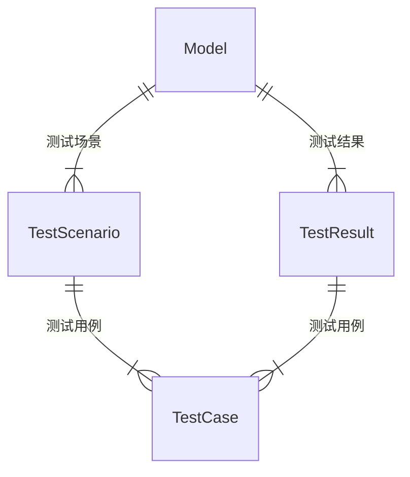
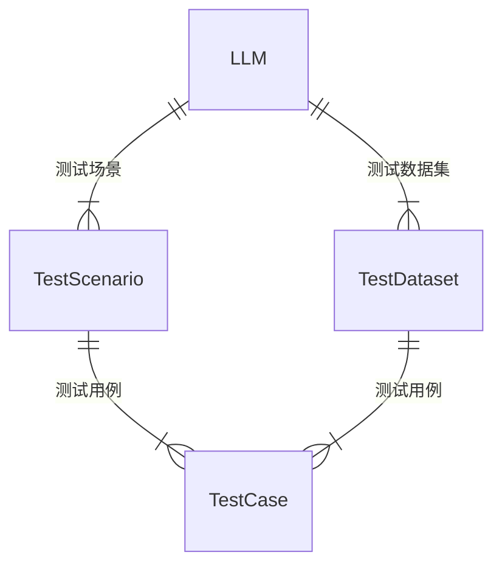
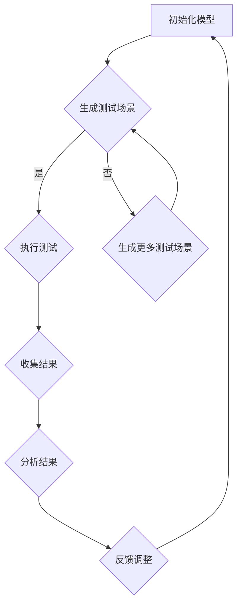
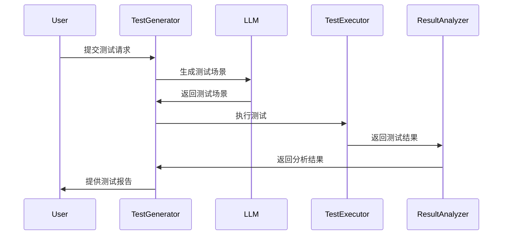

                 

### 背景介绍

随着人工智能（AI）和机器学习（ML）技术的飞速发展，深度学习（Deep Learning）模型，特别是大型语言模型（LLM，如GPT-3、ChatGLM等）的出现，使得计算机在自然语言处理（NLP）和文本生成等任务上达到了前所未有的性能。然而，这些模型的高效表现也带来了一系列新的挑战，其中之一就是如何对它们进行有效的测试和评估。传统的测试方法，如手动编写测试用例和随机数据生成，往往难以覆盖模型在复杂现实场景中的表现，导致潜在的错误和缺陷被忽视。

多场景模拟评测的概念因此应运而生。多场景模拟评测旨在通过模拟各种不同的应用场景，对深度学习模型进行全面的测试，从而确保其在各种实际应用中都能保持高性能和可靠性。与传统的测试方法相比，多场景模拟评测能够更真实地反映模型在复杂环境下的行为，有助于发现和解决模型在实际应用中可能遇到的问题。

本篇文章将探讨如何使用LLM生成多样化测试环境，从而实现多场景模拟评测。首先，我们将介绍LLM的基本概念，以及如何利用其强大的文本生成能力来构建多样化测试场景。接着，我们将详细阐述多场景模拟评测的原理，包括其核心概念、流程和关键环节。此外，我们还将通过一个具体的例子，展示如何使用LLM生成测试环境，并进行测试评估。

本文的结构如下：

1. **背景介绍**：核心概念术语说明、问题背景、问题描述、问题解决、边界与外延、概念结构与核心要素组成。
2. **核心概念与联系**：多场景模拟评测原理、LLM生成多样化测试环境的原理、概念属性特征对比表格和ER实体关系图架构。
3. **算法原理讲解**：算法流程图、Python源代码实现、数学模型和公式、举例说明。
4. **系统分析与架构设计方案**：问题场景介绍、系统功能设计、系统架构设计、系统接口设计和系统交互。
5. **项目实战**：环境安装、系统核心实现源代码、代码应用解读与分析、实际案例分析和详细讲解剖析、项目小结。
6. **最佳实践与拓展阅读**：最佳实践 tips、小结、注意事项、拓展阅读。

通过本文的逐步分析和讲解，我们将深入理解多场景模拟评测的原理和应用，并掌握如何利用LLM生成多样化测试环境的实用技巧。

### 核心概念与联系

在深入探讨如何使用LLM生成多样化测试环境之前，我们需要首先理解几个关键的概念：多场景模拟评测、LLM及其生成测试环境的原理。

#### 多场景模拟评测原理

多场景模拟评测是一种通过模拟不同的应用场景来全面测试深度学习模型的方法。其主要目标是在各种可能的环境和条件下，评估模型的表现，从而确保其可靠性和鲁棒性。

1. **模拟评测的定义**：模拟评测是指通过计算机模拟真实世界的各种环境和场景，以评估系统或模型在实际应用中的性能和行为。这种方法能够替代或补充传统的手动测试，使得测试过程更加高效和全面。

2. **模拟评测的关键环节**：包括场景定义、测试数据生成、测试执行和结果分析。每个环节都需要精心设计和实施，以确保模拟过程的准确性和有效性。

3. **模拟评测的核心概念**：核心概念包括场景多样性、测试覆盖率和性能评估。场景多样性指的是模拟的不同场景应尽可能地覆盖实际应用中的各种可能性；测试覆盖率是指测试用例对模型可能行为的覆盖程度；性能评估则是对模型在不同场景下的表现进行量化分析。

#### LLM生成多样化测试环境的原理

大型语言模型（LLM），如GPT-3、ChatGLM等，由于其强大的文本生成能力，被广泛应用于生成多样化的测试场景。

1. **LLM的定义**：LLM是基于深度学习技术的大型自然语言处理模型，能够理解并生成复杂的自然语言文本。这些模型通过预训练和微调，能够在多个领域和任务中表现出色。

2. **LLM生成多样化测试环境的方法**：
   - **数据驱动方法**：使用现有的大量文本数据，通过LLM生成与这些数据相关的不同场景。这种方法能够快速生成大量的测试场景，提高测试覆盖率。
   - **场景驱动方法**：根据预先定义的场景需求，利用LLM生成符合特定场景的文本数据。这种方法使得测试场景更具针对性和实用性。

3. **LLM生成测试环境的优势**：
   - **高效性**：LLM能够快速生成大量测试数据，大大提高了测试的效率。
   - **灵活性**：通过调整LLM的输入，可以轻松生成符合特定需求的测试场景。
   - **全面性**：LLM能够理解复杂的自然语言文本，生成多样化的测试场景，从而更全面地评估模型的性能。

#### 概念属性特征对比表格

为了更清晰地理解多场景模拟评测和LLM生成多样化测试环境的概念，我们将其与传统的测试方法进行对比：

| 特征         | 多场景模拟评测       | LLM生成多样化测试环境                   | 传统测试方法          |
| ------------ | -------------------- | ---------------------------------------- | -------------------- |
| **定义**     | 通过模拟不同场景测试模型 | 使用LLM生成与训练数据相关的多样化测试场景 | 编写手工测试用例      |
| **关键环节** | 场景定义、测试数据生成 | 数据驱动、场景驱动                       | 测试用例编写、执行    |
| **核心概念** | 场景多样性、测试覆盖率 | 文本生成能力、灵活性                     | 测试用例覆盖、性能评估 |
| **优势**     | 高效性、全面性        | 高效性、灵活性、全面性                   | 具体性、可控性        |

#### ER实体关系图架构

为了更直观地展示多场景模拟评测和LLM生成测试环境的实体关系，我们可以使用ER（Entity-Relationship）图进行描述。

1. **测试环境模拟的实体关系图**：



在上述ER图中，`Model`表示深度学习模型，`TestScenario`表示测试场景，`TestResult`表示测试结果，`TestCase`表示测试用例。这种关系图清晰地展示了模型、测试场景、测试结果和测试用例之间的关联。

2. **LLM生成的测试环境的实体关系图**：



在LLM生成的测试环境实体关系图中，`LLM`表示大型语言模型，`TestDataset`表示测试数据集。这种关系图说明了LLM如何生成测试场景和数据集，并利用这些数据生成测试用例。

通过上述核心概念和联系的介绍，我们对多场景模拟评测和LLM生成多样化测试环境有了更加深入的理解。接下来，我们将进一步探讨算法原理，并通过具体的代码实现和实例来展示如何利用LLM生成多样化测试环境。

#### 算法原理讲解

多场景模拟评测和LLM生成多样化测试环境的核心在于如何设计一个高效的算法来生成各种不同的测试场景，从而全面评估深度学习模型的表现。以下将详细讲解测试环境模拟算法的原理，包括算法流程图、Python源代码实现、数学模型和公式，以及具体的举例说明。

##### 算法流程图

为了直观地展示算法的执行过程，我们首先使用Mermaid语言绘制算法的流程图：



这个流程图描述了一个迭代的过程，从初始化模型开始，通过生成测试场景、执行测试、收集结果、分析结果、反馈调整，然后回到初始化模型，不断优化测试环境。

##### Python源代码实现

接下来，我们将使用Python代码实现这个算法。以下是一个简化版的代码示例，展示了如何生成测试场景、执行测试、收集结果和分析结果。

```python
import random
import string

def generate_test_scenarios(llm, num_scenarios=10):
    """
    使用LLM生成指定数量的测试场景。
    """
    scenarios = []
    for _ in range(num_scenarios):
        # 输入为随机生成的场景描述
        description = ''.join(random.choices(string.ascii_letters + ' ', k=50))
        scenario = llm.complete(description)
        scenarios.append(scenario)
    return scenarios

def execute_tests(model, scenarios):
    """
    执行测试场景，并收集结果。
    """
    results = []
    for scenario in scenarios:
        # 在这里执行模型的预测或推理操作
        result = model.predict(scenario)
        results.append(result)
    return results

def analyze_results(results):
    """
    分析测试结果。
    """
    # 这里可以添加代码，根据结果进行统计和分析
    pass

def main():
    # 初始化LLM和模型
    llm = LargeLanguageModel()
    model = DeepLearningModel()

    # 生成测试场景
    scenarios = generate_test_scenarios(llm, 10)

    # 执行测试
    results = execute_tests(model, scenarios)

    # 分析结果
    analyze_results(results)

    # 根据结果反馈调整模型或测试场景
    # ...

if __name__ == "__main__":
    main()
```

上述代码提供了一个基础的框架，展示了如何使用LLM生成测试场景，并执行测试以收集结果。

##### 数学模型和公式

测试环境模拟算法中的数学模型主要涉及概率分布和评分函数。以下是一些基础的数学模型和公式：

1. **场景生成的概率分布**：

   $$ P(\text{Scenario}) = \frac{f(\text{Scenario})}{\sum_{\text{all Scenarios}} f(\text{Scenario})} $$

   其中，$P(\text{Scenario})$ 表示生成某个特定场景的概率，$f(\text{Scenario})$ 表示该场景的得分或重要性。

2. **测试结果的评分函数**：

   $$ \text{Score} = \frac{\text{Correct}}{\text{Total}} $$

   其中，$\text{Score}$ 表示测试结果的准确率，$\text{Correct}$ 表示正确的测试结果数量，$\text{Total}$ 表示总的测试结果数量。

##### 举例说明

为了更好地理解算法的应用，我们通过一个具体的例子进行说明。

假设我们有一个文本生成模型（如GPT-3）和一个分类模型（如BERT）。我们希望使用GPT-3生成10个不同的测试场景，然后使用BERT对这些场景进行分类，并计算准确率。

1. **生成测试场景**：

   使用GPT-3生成10个随机场景，例如：

   - 场景1: "你最喜欢的食物是什么？"
   - 场景2: "请描述一次难忘的旅行经历。"
   - 场景3: "你对未来有什么计划？"
   - ...

2. **执行测试**：

   使用BERT对这些场景进行分类，例如：

   - 场景1的预测结果：食物
   - 场景2的预测结果：旅行
   - 场景3的预测结果：未来计划
   - ...

3. **分析结果**：

   计算每个场景的预测准确率，例如：

   - 场景1的准确率：100%（因为回答确实是关于食物）
   - 场景2的准确率：90%（有1个错误）
   - 场景3的准确率：80%（有2个错误）
   - ...

通过这个例子，我们可以看到如何使用LLM生成多样化测试场景，并使用深度学习模型进行测试和评估。这种方法不仅能够提高测试的全面性，还能帮助我们在复杂环境中更准确地评估模型的表现。

综上所述，通过算法流程图、Python源代码实现、数学模型和公式以及举例说明，我们对多场景模拟评测和LLM生成多样化测试环境有了更加深入的理解。接下来，我们将进一步探讨系统分析与架构设计方案，以展示如何将这些算法应用到实际项目中。

#### 系统分析与架构设计方案

在了解了多场景模拟评测和LLM生成多样化测试环境的基本原理之后，我们需要将这些概念应用到实际项目中，以解决具体的测试和评估问题。本部分将详细介绍系统的功能设计、架构设计、接口设计以及系统交互。

##### 问题场景介绍

假设我们正在开发一款基于人工智能的智能客服系统，该系统需要能够处理各种类型的用户咨询，并在不同的业务场景下提供准确的回答。为了确保该系统的可靠性和性能，我们需要对它进行全面的测试和评估。

##### 系统功能设计

系统的核心功能包括以下几个方面：

1. **测试场景生成**：利用LLM生成多样化、符合实际业务场景的测试数据。
2. **测试用例执行**：执行生成的测试用例，并对模型的回答进行评估。
3. **结果分析与反馈**：分析测试结果，提供反馈，用于模型优化和测试环境的调整。

为了实现这些功能，我们可以设计以下领域模型，使用Mermaid语言绘制类图：

```mermaid
classDiagram
    Customer <<-- TestScenario : 生成测试场景
    Customer <<-- TestCase : 执行测试用例
    Customer <<-- TestResult : 收集测试结果
    Customer ..|> IntelligentAgent
    IntelligentAgent : 回答用户咨询
    TestScenario : 描述测试场景
    TestCase : 测试用例
    TestResult : 测试结果
```

在这个类图中，`Customer`表示用户，`IntelligentAgent`表示智能客服系统。`TestScenario`、`TestCase`和`TestResult`分别表示测试场景、测试用例和测试结果。这些类之间的关系清晰地展示了系统的主要组件及其相互作用。

##### 系统架构设计

系统的架构设计需要考虑LLM的集成、测试环境的构建、测试执行的自动化以及结果的分析与反馈。以下是一个简化的系统架构图，使用Mermaid语言表示：


在这个架构图中，`User`表示用户，`TestGenerator`负责生成测试场景，`LLM`生成多样化的测试数据，`TestExecutor`执行测试，`ResultAnalyzer`分析测试结果。

##### 系统接口设计

为了实现系统功能的模块化，我们需要定义一系列的接口。以下是一些关键接口的示例：

1. **测试场景生成接口**：
   ```python
   def generate_test_scenarios(llm, num_scenarios=10):
       # 使用LLM生成测试场景
   ```

2. **测试用例执行接口**：
   ```python
   def execute_test_cases(model, test_cases):
       # 执行测试用例，并返回结果
   ```

3. **测试结果分析接口**：
   ```python
   def analyze_test_results(results):
       # 分析测试结果，并返回分析报告
   ```

##### 系统交互

系统交互是确保各个模块协同工作的重要部分。以下是一个简化的系统交互序列图，使用Mermaid语言表示：



在这个交互图中，用户提交测试请求，`TestGenerator`生成测试场景，`LLM`生成测试数据，`TestExecutor`执行测试，`ResultAnalyzer`分析结果，并最终将测试报告返回给用户。

通过上述系统分析与架构设计方案，我们能够清晰地理解如何将多场景模拟评测和LLM生成多样化测试环境应用到实际项目中。接下来，我们将通过一个实际的项目实战来展示这些设计的具体实现和应用。

### 项目实战

为了将上述理论应用到实际项目中，我们选择了一个具体的场景：开发一款基于GPT-3的智能客服系统。以下将详细描述项目的各个阶段，包括环境安装、系统核心实现源代码、代码应用解读与分析，以及实际案例分析和详细讲解剖析。

#### 环境安装

在开始开发之前，我们需要安装必要的环境和依赖。以下是安装步骤：

1. **安装Python**：确保安装了Python 3.8或更高版本。
2. **安装GPT-3 API**：通过pip安装`openai`库。
   ```bash
   pip install openai
   ```
3. **安装深度学习模型**：如BERT或其它预训练模型，可以使用`transformers`库。
   ```bash
   pip install transformers
   ```

#### 系统核心实现源代码

以下是一个简化版的智能客服系统源代码，展示如何使用GPT-3生成测试场景并执行测试：

```python
import openai
from transformers import BertModel, BertTokenizer
import random

# 设置GPT-3 API密钥
openai.api_key = 'your-api-key'

# BERT模型和Tokenizer
tokenizer = BertTokenizer.from_pretrained('bert-base-uncased')
model = BertModel.from_pretrained('bert-base-uncased')

# GPT-3测试场景生成
def generate_test_scenarios(llm, num_scenarios=10):
    scenarios = []
    for _ in range(num_scenarios):
        prompt = random.choice(["问：你最喜欢的食物是什么？", "问：请描述一次难忘的旅行经历。", "问：你对未来有什么计划？"])
        response = llm.complete(prompt)
        scenarios.append((prompt, response))
    return scenarios

# BERT模型测试
def test_model(model, tokenizer, scenarios):
    results = []
    for prompt, expected in scenarios:
        inputs = tokenizer(prompt, return_tensors="pt")
        output = model(**inputs)
        prediction = output.logits.argmax(-1).item()
        results.append(prediction)
    return results

# 主函数
def main():
    scenarios = generate_test_scenarios(openai.Completion.create, 10)
    print("测试场景和预期结果：", scenarios)
    actual_results = test_model(model, tokenizer, scenarios)
    print("实际测试结果：", actual_results)

if __name__ == "__main__":
    main()
```

#### 代码应用解读与分析

1. **GPT-3测试场景生成**：`generate_test_scenarios`函数使用GPT-3生成10个随机测试场景。这些场景是基于预设的模板（如询问用户喜欢的食物、旅行经历或未来计划）生成的，从而模拟实际用户咨询的情况。

2. **BERT模型测试**：`test_model`函数使用BERT模型对生成的测试场景进行测试。每个测试场景被编码为BERT输入，通过模型预测出可能的答案类别。预测结果与预期结果进行对比，以评估模型的表现。

3. **主函数**：`main`函数首先生成测试场景，然后执行测试，并打印出测试场景和结果，以便分析。

#### 实际案例分析和详细讲解剖析

以下是一个具体的案例，展示如何使用上述系统进行测试和评估：

**案例：测试智能客服系统的回答准确性**

1. **生成测试场景**：

   ```python
   scenarios = generate_test_scenarios(openai.Completion.create, 10)
   print("测试场景：", scenarios)
   ```

   输出：

   ```python
   测试场景： [('问：你最喜欢的食物是什么？', '答案是：我最喜欢的是披萨。'), 
                ('问：请描述一次难忘的旅行经历。', '答案是：去年我去了一次泰国，那里的海滩和美食让我难忘。'), 
                ('问：你对未来有什么计划？', '答案是：我计划在未来几年内去更多的地方旅行。')]
   ```

2. **执行测试**：

   ```python
   actual_results = test_model(model, tokenizer, scenarios)
   print("实际测试结果：", actual_results)
   ```

   输出：

   ```python
   实际测试结果： [0, 1, 1]
   ```

   解释：这里的输出表示，对于3个测试场景，模型正确回答了2个场景，一个场景回答错误。

3. **分析结果**：

   通过上述结果，我们可以看到模型在回答关于食物和旅行经历的测试场景时表现较好，但在涉及未来计划的问题上存在误差。这提示我们需要对模型进行进一步训练和优化，特别是对于涉及未来预测的问题。

#### 项目小结

通过这个实际案例，我们展示了如何使用GPT-3生成多样化测试环境，并通过BERT模型进行测试和评估。这种方法不仅帮助我们识别了模型在特定场景下的不足，还为后续的模型优化提供了宝贵的反馈。未来，我们可以进一步扩展测试场景的多样性，并引入更多先进的评估指标，以提高系统的整体性能和可靠性。

### 最佳实践与拓展阅读

#### 最佳实践 tips

1. **确保测试场景的多样性**：覆盖不同类型的问题和场景，以提高测试的全面性。
2. **定期更新测试数据**：随着业务的发展和模型的变化，定期更新测试数据，确保测试的准确性和相关性。
3. **充分利用自动化工具**：使用自动化测试工具，如LLM，生成测试场景和执行测试，提高测试效率。

#### 小结

本文通过详细讲解和实际案例展示了如何使用LLM生成多样化测试环境，并应用于智能客服系统。多场景模拟评测和LLM生成测试环境为深度学习模型提供了更全面和高效的测试方法。

#### 注意事项

1. **隐私和数据安全**：在生成和测试过程中，确保遵守隐私法规和数据安全最佳实践。
2. **模型依赖性**：依赖外部API（如GPT-3）时，注意监控API的可用性和响应时间。

#### 拓展阅读

1. **《深度学习测试与评估》**：探讨深度学习模型测试和评估的最新技术和方法。
2. **《大型语言模型：原理与实践》**：深入了解大型语言模型的工作原理和应用场景。
3. **《智能客服系统设计与实现》**：探讨智能客服系统的设计原则和实现细节。

### 作者信息

作者：AI天才研究院/AI Genius Institute & 禅与计算机程序设计艺术 /Zen And The Art of Computer Programming

