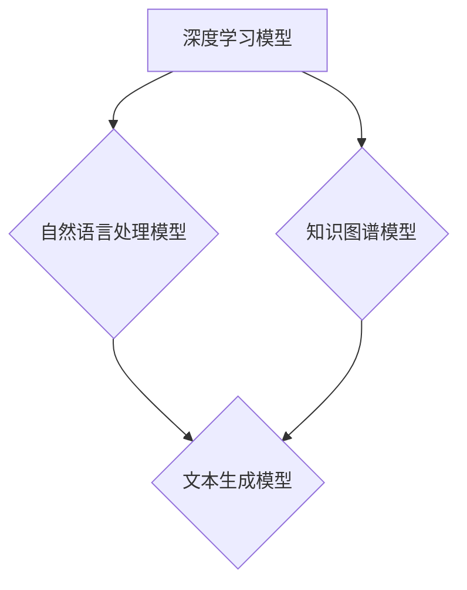
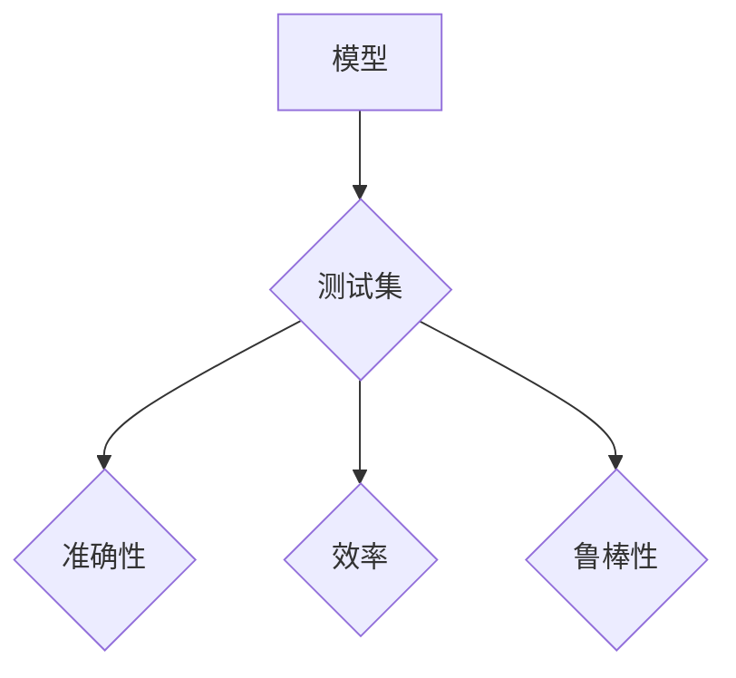
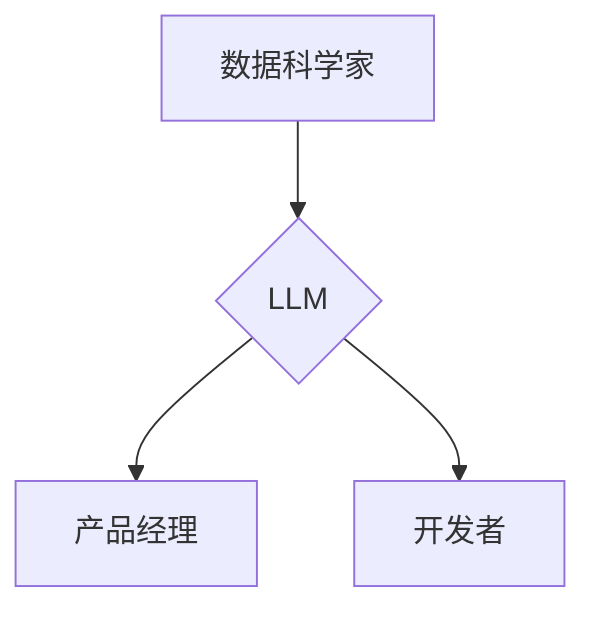
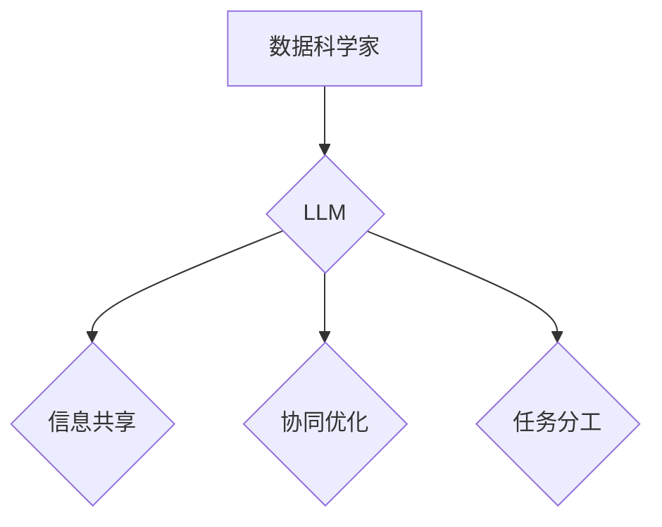
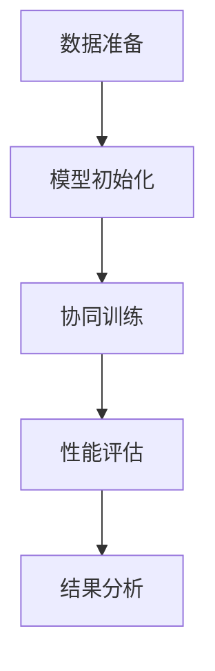
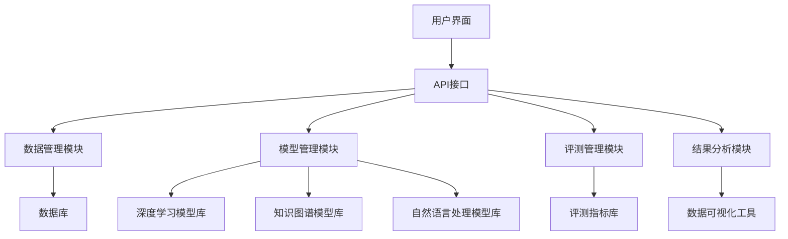
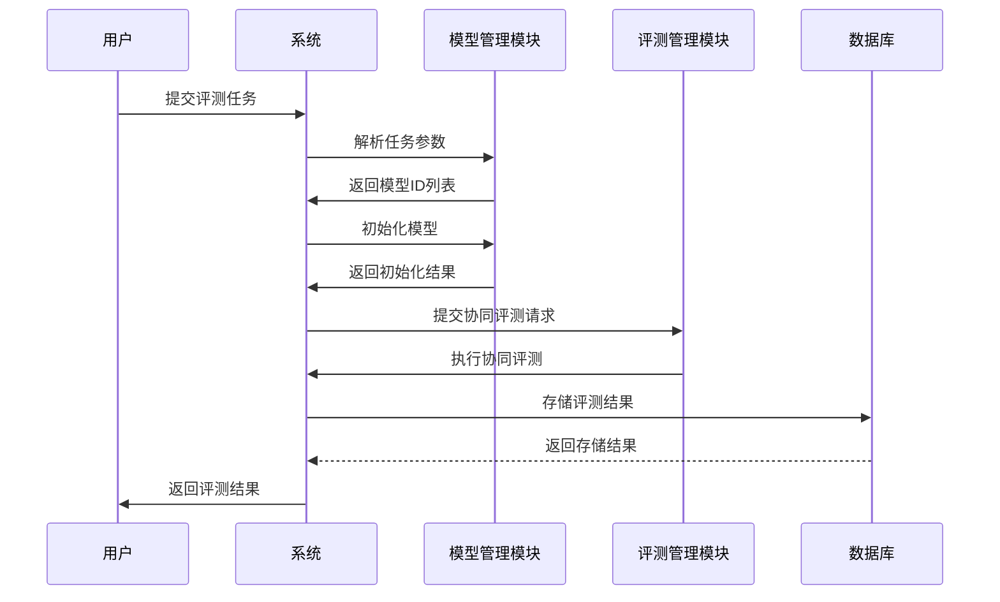

                 


### 第1章: 多模型协同评测的背景

#### 1.1 问题的背景

随着人工智能技术的快速发展，大型语言模型（LLM）在自然语言处理、文本生成、问答系统等方面取得了显著成果。然而，在实际应用中，单一模型的局限性逐渐显现，多模型协同评测成为提高模型性能和团队协作的关键。

**1.1.1 人工智能的发展与挑战**

人工智能（AI）起源于20世纪50年代，随着计算机性能的提升和算法的创新，AI技术逐渐应用到各行各业。特别是在深度学习和自然语言处理领域，AI取得了飞跃性进展。然而，随着AI应用的普及，我们也遇到了一系列挑战：

- **数据量的挑战**：现代AI模型对大规模数据进行训练，这需要大量的计算资源和时间。同时，如何处理和维护这些数据成为了一个难题。
- **多样性与准确性**：不同领域和场景对AI模型的要求各不相同，单一模型往往难以满足所有需求。如何构建具有多样性和高准确性的多模型协同系统成为关键。
- **团队协作**：在AI项目中，团队成员来自不同的专业领域，如何有效地进行沟通和协作，提高团队整体效率也是一个重要问题。

**1.1.2 多模型协同评测的需求**

多模型协同评测的需求源于以下几个方面：

- **模型性能的提升**：通过多模型协同，可以融合不同模型的优势，提高整体性能。例如，在问答系统中，结合语义理解模型和知识图谱模型，可以更好地理解用户问题并给出准确回答。
- **任务的多样性**：不同的AI任务对模型的能力要求不同，多模型协同可以适应更多样化的任务需求。
- **团队协作**：多模型协同评测有助于团队成员之间的沟通和协作，提高项目效率。

**1.1.3 测试LLM在团队环境中的重要性**

大型语言模型（LLM）在AI领域中具有举足轻重的地位。然而，LLM在团队环境中的表现需要经过严格的测试和评估，以确保其在实际应用中的有效性和可靠性。以下是测试LLM在团队环境中的重要性：

- **性能评估**：通过测试，可以评估LLM在团队环境中的性能，发现潜在问题和不足，为模型优化提供依据。
- **鲁棒性验证**：测试可以帮助验证LLM在团队环境中的鲁棒性，确保其在各种情况下都能稳定运行。
- **协作效率**：测试LLM在团队环境中的表现，有助于提高团队协作效率，优化模型应用场景。

**1.1.4 多模型协同评测的边界与外延**

多模型协同评测不仅涉及技术层面，还涉及管理、沟通等多个方面。其边界与外延主要包括：

- **技术层面**：多模型协同评测的技术包括模型融合、模型评估、性能优化等。
- **管理层面**：多模型协同评测需要项目团队进行有效管理，包括资源分配、任务分工、进度控制等。
- **沟通层面**：多模型协同评测需要团队成员之间的有效沟通，确保信息的准确传递和协作效率。

**1.1.5 概念结构与核心要素组成**

多模型协同评测的概念结构主要包括以下几个核心要素：

- **多模型**：包括不同类型的模型，如深度学习模型、知识图谱模型、自然语言处理模型等。
- **协同**：指多个模型在团队环境中的协同工作，实现优势互补。
- **评测**：对多模型协同效果进行评估和优化。

通过对这些核心要素的理解，可以为后续章节的详细分析提供基础。

---

### 2.1 多模型协同的定义与优势

#### 2.1.1 多模型协同的概念

多模型协同是指在人工智能项目中，将不同类型的模型结合起来，协同工作以完成复杂任务。这种协同不仅仅是指模型的简单叠加，而是通过模型之间的相互作用，实现各自优势的互补和整体的性能提升。

#### 2.1.2 多模型协同的优势

多模型协同具有以下几个显著优势：

- **提高性能**：不同模型在处理不同类型数据时具有各自的优势。通过多模型协同，可以充分利用这些优势，提高整体性能。例如，在问答系统中，结合语义理解模型和知识图谱模型，可以更好地理解用户问题并给出准确回答。
- **适应多样性**：多模型协同可以适应更多样化的任务需求。例如，在多语言处理任务中，可以结合语言模型、翻译模型和语义理解模型，实现跨语言的信息处理。
- **鲁棒性增强**：多模型协同可以提高系统的鲁棒性。当某个模型出现问题时，其他模型可以及时补充，确保系统的稳定运行。

#### 2.1.3 多模型协同与单一模型评测的区别

多模型协同与单一模型评测有以下几点区别：

- **目标不同**：单一模型评测的目标是评估单个模型在特定任务上的性能，而多模型协同评测的目标是评估多个模型在协同工作下的整体性能。
- **方法不同**：单一模型评测主要关注模型本身的性能，而多模型协同评测需要考虑模型之间的相互作用和协同效应。
- **挑战不同**：单一模型评测主要面临模型性能和评估方法等方面的挑战，而多模型协同评测还需要应对模型融合、协作效率等方面的挑战。

通过以上对比，我们可以更清楚地理解多模型协同评测的独特价值和重要性。

---

### 2.2 评测的定义与类型

#### 2.2.1 评测的基本概念

评测（Evaluation）是评估模型性能和质量的重要手段。在人工智能领域，评测通常是指通过一系列测试，评估模型在特定任务上的表现，包括准确性、效率、鲁棒性等方面。

#### 2.2.2 评测的类型和方法

根据评测的目的和方法，可以将评测分为以下几类：

- **准确性评测**：评估模型在预测或分类任务上的准确性，通常使用准确率、召回率、F1值等指标。
- **效率评测**：评估模型在处理数据时的计算效率和资源消耗，包括计算速度、内存占用等。
- **鲁棒性评测**：评估模型在遇到异常数据或噪声时的表现，包括稳定性、抗干扰能力等。
- **泛化能力评测**：评估模型在新数据上的表现，包括模型的迁移能力和适应能力。

#### 2.2.3 评测的多模型协同特性

多模型协同评测具有以下特性：

- **综合评估**：多模型协同评测需要综合考虑多个模型在协同工作下的整体性能，而不是单一模型的性能。
- **协同优化**：多模型协同评测不仅评估模型本身的性能，还需要考虑模型之间的相互作用和协同效应，通过优化模型融合策略，提高整体性能。
- **多样性**：多模型协同评测需要适应更多样化的任务需求，不同模型在处理不同类型数据时具有各自的优势，通过协同工作，可以更好地满足多样化需求。

通过以上分析，我们可以看到，评测在多模型协同中的重要性，以及如何通过评测来提升模型性能和团队协作。

---

### 2.3 LLM在团队环境中的表现

#### 2.3.1 LLM的团队角色

在团队环境中，大型语言模型（LLM）通常扮演以下角色：

- **核心任务处理者**：LLM在团队中负责处理核心任务，如文本生成、语义理解、问答系统等。它的性能直接影响到整个团队的工作效率和任务完成质量。
- **协作参与者**：LLM与其他团队成员（如数据科学家、产品经理、开发者等）密切合作，共同完成任务。通过协同工作，可以实现优势互补，提高整体绩效。
- **决策支持者**：LLM可以提供决策支持，如通过分析大量数据，为团队提供有价值的洞察和建议。

#### 2.3.2 LLM在团队环境中的协作模式

LLM在团队环境中的协作模式主要包括以下几个方面：

- **任务分工**：团队成员根据自身专长和兴趣，分工合作，共同完成任务。LLM可以承担特定的任务，如文本生成、数据分析等，提高整体工作效率。
- **信息共享**：团队成员通过共享信息，实现知识的传递和共享，提高协作效率。LLM可以充当信息共享平台，帮助团队成员快速获取所需信息。
- **协同优化**：团队成员通过协同工作，不断优化模型和算法，提高模型性能和任务完成质量。LLM可以作为协同优化的核心组件，提供决策支持和算法优化建议。

#### 2.3.3 LLM的表现评估指标

LLM在团队环境中的表现可以通过以下指标进行评估：

- **准确性**：评估LLM在处理任务时的准确性，如文本生成、语义理解、问答系统等。准确性越高，表示LLM在任务中的表现越好。
- **效率**：评估LLM在处理任务时的计算效率和资源消耗，如计算速度、内存占用等。效率越高，表示LLM的资源利用率越高。
- **鲁棒性**：评估LLM在遇到异常数据或噪声时的表现，如稳定性、抗干扰能力等。鲁棒性越高，表示LLM在复杂环境中的适应性越强。
- **泛化能力**：评估LLM在新数据上的表现，如模型的迁移能力和适应能力。泛化能力越强，表示LLM在未知场景中的表现越好。

通过对LLM在团队环境中的角色、协作模式和评估指标的分析，我们可以更好地理解和利用LLM，提高团队协作效率和任务完成质量。

---

### 3.1 多模型协同评测概念对比表

为了帮助读者更好地理解多模型协同评测相关的概念，我们在此提供了一个概念对比表。该表列出了多模型协同与单一模型评测、评测类型与方法以及LLM在团队环境中的表现之间的对比。

#### 3.1.1 多模型与单一模型评测的对比

| 对比项           | 多模型协同评测                      | 单一模型评测                      |
|------------------|------------------------------------|-----------------------------------|
| 目标             | 评估多个模型在协同工作下的整体性能 | 评估单个模型在特定任务上的性能    |
| 方法             | 考虑模型之间的相互作用和协同效应   | 主要关注模型本身的性能            |
| 挑战             | 模型融合、协作效率等                | 模型性能和评估方法等              |
| 适用场景         | 多样化的任务需求                  | 特定类型的任务需求               |
| 优势             | 提高性能、适应多样性、增强鲁棒性    | 简单、直接、针对性强             |
| 劣势             | 需要更多的资源和时间                | 简单、快速、效率高               |

#### 3.1.2 评测类型与方法对比

| 对比项           | 准确性评测                       | 效率评测                        | 鲁棒性评测                      | 泛化能力评测                     |
|------------------|--------------------------------|---------------------------------|---------------------------------|--------------------------------|
| 目标             | 评估模型在预测或分类任务上的准确性 | 评估模型在处理数据时的计算效率和资源消耗 | 评估模型在遇到异常数据或噪声时的表现 | 评估模型在新数据上的表现 |
| 指标             | 准确率、召回率、F1值等           | 计算速度、内存占用等             | 稳定性、抗干扰能力等           | 迁移能力、适应能力等         |
| 方法             | 实际数据测试、交叉验证等          | 实际数据测试、性能分析等          | 实际数据测试、异常数据注入等    | 实际数据测试、新场景测试等   |
| 优势             | 准确性高、可靠性强               | 效率高、资源消耗少               | 稳定性好、适应能力强           | 泛化能力强、迁移性好         |
| 劣势             | 数据需求量大、耗时较长           | 需要大量的计算资源和时间         | 需要更多的异常数据              | 需要更多的测试场景            |

#### 3.1.3 LLM在团队环境中的表现与评测

| 对比项           | LLM在团队环境中的表现                           | LLM在团队环境中的评测指标                  |
|------------------|-----------------------------------------------|-------------------------------------------|
| 角色与协作       | 核心任务处理者、协作参与者、决策支持者          | 准确性、效率、鲁棒性、泛化能力等           |
| 评估目标         | 评估LLM在团队环境中的整体表现                   | 评估LLM在处理任务时的准确性、效率、鲁棒性等 |
| 评测方法         | 实际任务测试、多场景测试、协同效果分析等        | 实际数据测试、性能分析、异常数据注入等     |
| 优势             | 提高任务完成质量、增强团队协作效率             | 准确性高、可靠性强、适应性强               |
| 劣势             | 需要更多的资源和时间、对团队成员的协作能力有要求 |

通过以上对比表，我们可以更清楚地了解多模型协同评测、评测类型与方法以及LLM在团队环境中的表现之间的关系。这些概念之间的联系有助于我们更好地理解和应用多模型协同评测，提高团队协作效率和任务完成质量。

---

### 3.2 多模型协同评测的ER实体关系图

为了更好地展示多模型协同评测中的实体及其关系，我们引入了ER（实体-关系）模型。ER模型是数据库设计中的重要工具，用于描述实体及其之间的关系。在本节中，我们将使用Mermaid绘制ER实体关系图，帮助读者更直观地理解多模型协同评测的概念和结构。

#### 3.2.1 ER实体关系图概述

在多模型协同评测中，主要的实体包括：模型（Model）、评测指标（Evaluation Metric）、评测结果（Evaluation Result）、团队（Team）和任务（Task）。实体之间的关系包括：模型与评测指标之间的关系、模型与评测结果之间的关系、团队与任务之间的关系、任务与评测结果之间的关系等。

以下是多模型协同评测的ER实体关系图的Mermaid语法：

```mermaid
erDiagram
    Model ||--|{ Evaluation Metric }|-- Evaluation Result
    Model ||--|{ Evaluation Result }|-- Task
    Team ||--|{ Task }|
    Task ||--|{ Evaluation Result }
```

#### 3.2.2 实体与关系的定义

1. **模型（Model）**：指在多模型协同评测中使用的各种模型，包括深度学习模型、知识图谱模型、自然语言处理模型等。
2. **评测指标（Evaluation Metric）**：用于评估模型性能的各种指标，如准确率、召回率、F1值、计算速度等。
3. **评测结果（Evaluation Result）**：指模型在特定任务上的评测结果，包括各项评测指标的具体数值。
4. **团队（Team）**：参与多模型协同评测的团队成员，包括数据科学家、产品经理、开发者等。
5. **任务（Task）**：在多模型协同评测中需要完成的任务，如文本生成、语义理解、问答系统等。

实体之间的关系定义如下：

- **模型与评测指标之间的关系**：模型通过评测指标来评估其性能。每个模型可以对应多个评测指标。
- **模型与评测结果之间的关系**：模型通过评测生成评测结果。每个模型在完成一个任务后会产生一个评测结果。
- **团队与任务之间的关系**：团队负责完成各项任务。每个团队可以完成多个任务。
- **任务与评测结果之间的关系**：每个任务完成后会产生一个或多个评测结果，用于评估任务完成质量。

#### 3.2.3 ER实体关系图的绘制

使用Mermaid语法，我们可以绘制出多模型协同评测的ER实体关系图，如下所示：

```mermaid
erDiagram
    Model ||--|{ Evaluation Metric }|-- Evaluation Result
    Model ||--|{ Evaluation Result }|-- Task
    Team ||--|{ Task }|
    Task ||--|{ Evaluation Result }
```

在这个ER实体关系图中，我们可以看到模型、评测指标、评测结果、团队和任务五个实体以及它们之间的关系。通过ER实体关系图，我们可以更清晰地理解多模型协同评测的整体结构和各实体之间的相互作用。

---

### 2.1 多模型协同的定义与优势

#### 2.1.1 多模型协同的概念

多模型协同是指将多个具有不同优势的模型集成在一起，通过协同工作来完成复杂的任务。这种协同不仅仅是简单的叠加，而是在充分理解各个模型特点和优势的基础上，实现优势互补和整体性能的提升。

**概念图示**：



#### 2.1.2 多模型协同的优势

多模型协同具有以下几个显著优势：

1. **提高性能**：通过多模型协同，可以充分利用各个模型的优势，实现性能的显著提升。例如，在问答系统中，深度学习模型可以用于语义理解，知识图谱模型可以提供丰富的背景知识，自然语言处理模型可以用于文本生成。

2. **适应多样性**：不同的任务和场景对模型的能力要求各不相同。通过多模型协同，可以适应更多样化的任务需求。例如，在多语言处理任务中，可以结合语言模型、翻译模型和语义理解模型，实现跨语言的信息处理。

3. **增强鲁棒性**：多模型协同可以增强系统的鲁棒性。当某个模型出现问题时，其他模型可以及时补充，确保系统的稳定运行。例如，在文本生成任务中，如果深度学习模型生成的文本出现错误，可以由知识图谱模型提供纠正。

4. **提升协作效率**：多模型协同有助于团队成员之间的沟通和协作，提高整体效率。例如，在开发一个复杂系统时，各个模型可以同时进行开发，实现并行工作，缩短开发周期。

#### 2.1.3 多模型协同与单一模型评测的区别

多模型协同与单一模型评测有以下几点区别：

1. **目标不同**：单一模型评测主要关注单个模型在特定任务上的性能，而多模型协同评测的目标是评估多个模型在协同工作下的整体性能。

2. **方法不同**：单一模型评测主要关注模型本身的性能，而多模型协同评测需要考虑模型之间的相互作用和协同效应。

3. **挑战不同**：单一模型评测主要面临模型性能和评估方法等方面的挑战，而多模型协同评测还需要应对模型融合、协作效率等方面的挑战。

通过以上分析，我们可以更清楚地理解多模型协同评测的独特价值和重要性。多模型协同不仅能够提升模型性能，还能增强系统的鲁棒性和协作效率，为人工智能领域的发展提供了新的思路和方法。

---

### 2.2 评测的定义与类型

#### 2.2.1 评测的基本概念

评测（Evaluation）是评估模型性能和质量的重要手段。在人工智能领域，评测通常是指通过一系列测试，评估模型在特定任务上的表现，包括准确性、效率、鲁棒性等方面。

**定义图示**：



#### 2.2.2 评测的类型和方法

根据评测的目的和方法，可以将评测分为以下几类：

1. **准确性评测**：评估模型在预测或分类任务上的准确性，通常使用准确率、召回率、F1值等指标。这种方法主要用于评估模型的预测能力。

2. **效率评测**：评估模型在处理数据时的计算效率和资源消耗，包括计算速度、内存占用等。这种方法主要用于评估模型在资源利用方面的性能。

3. **鲁棒性评测**：评估模型在遇到异常数据或噪声时的表现，包括稳定性、抗干扰能力等。这种方法主要用于评估模型的鲁棒性。

4. **泛化能力评测**：评估模型在新数据上的表现，包括模型的迁移能力和适应能力。这种方法主要用于评估模型在未知场景中的表现。

**评测方法表**：

| 评测类型       | 指标         | 说明                                      |
|----------------|--------------|-------------------------------------------|
| 准确性评测     | 准确率       | 预测为正例的样本中，实际为正例的样本占比  |
|                | 召回率       | 预测为正例的样本中，实际为正例的样本占比  |
|                | F1值         | 准确率的调和平均数，用于平衡准确率和召回率 |
| 效率评测       | 计算速度     | 模型处理数据的速度                        |
|                | 内存占用     | 模型在处理数据时的内存消耗                |
| 鲁棒性评测     | 稳定性       | 模型在遇到异常数据时的稳定性              |
|                | 抗干扰能力   | 模型在遇到噪声数据时的抗干扰能力          |
| 泛化能力评测   | 迁移能力     | 模型在不同数据集上的表现                  |
|                | 适应能力     | 模型在未知场景中的表现                    |

#### 2.2.3 评测的多模型协同特性

在多模型协同评测中，评测不仅涉及单个模型的性能，还包括模型之间的相互作用和协同效应。因此，多模型协同评测具有以下特性：

1. **综合评估**：多模型协同评测需要综合考虑多个模型在协同工作下的整体性能，而不是单一模型的性能。

2. **协同优化**：多模型协同评测需要考虑模型之间的相互作用，通过优化模型融合策略，提高整体性能。

3. **多样性**：多模型协同评测需要适应更多样化的任务需求，不同模型在处理不同类型数据时具有各自的优势。

4. **动态调整**：在多模型协同评测中，可以根据任务需求和模型表现，动态调整模型权重和参数，以实现最优性能。

通过以上分析，我们可以看到，评测在多模型协同中的重要性，以及如何通过评测来提升模型性能和团队协作。

---

### 2.3 LLM在团队环境中的表现

#### 2.3.1 LLM的团队角色

在团队环境中，大型语言模型（LLM）通常扮演以下角色：

1. **核心任务处理者**：LLM负责处理团队中的核心任务，如文本生成、语义理解、问答系统等。它的性能直接影响到整个团队的工作效率和任务完成质量。

2. **协作参与者**：LLM与其他团队成员（如数据科学家、产品经理、开发者等）密切合作，共同完成任务。通过协同工作，可以实现优势互补，提高整体绩效。

3. **决策支持者**：LLM可以提供决策支持，如通过分析大量数据，为团队提供有价值的洞察和建议。这有助于团队成员做出更明智的决策，提高团队的整体运作效率。

**角色图示**：



#### 2.3.2 LLM在团队环境中的协作模式

LLM在团队环境中的协作模式主要包括以下几个方面：

1. **任务分工**：团队成员根据自身专长和兴趣，分工合作，共同完成任务。LLM可以承担特定的任务，如文本生成、数据分析等，提高整体工作效率。

2. **信息共享**：团队成员通过共享信息，实现知识的传递和共享，提高协作效率。LLM作为信息共享平台，帮助团队成员快速获取所需信息。

3. **协同优化**：团队成员通过协同工作，不断优化模型和算法，提高模型性能和任务完成质量。LLM可以作为协同优化的核心组件，提供决策支持和算法优化建议。

**协作模式图示**：



#### 2.3.3 LLM的表现评估指标

LLM在团队环境中的表现可以通过以下指标进行评估：

1. **准确性**：评估LLM在处理任务时的准确性，如文本生成、语义理解、问答系统等。准确性越高，表示LLM在任务中的表现越好。

2. **效率**：评估LLM在处理任务时的计算效率和资源消耗，如计算速度、内存占用等。效率越高，表示LLM的资源利用率越高。

3. **鲁棒性**：评估LLM在遇到异常数据或噪声时的表现，如稳定性、抗干扰能力等。鲁棒性越高，表示LLM在复杂环境中的适应性越强。

4. **泛化能力**：评估LLM在新数据上的表现，如模型的迁移能力和适应能力。泛化能力越强，表示LLM在未知场景中的表现越好。

**评估指标表**：

| 指标         | 说明                                      |
|--------------|-------------------------------------------|
| 准确性       | 预测为正例的样本中，实际为正例的样本占比  |
| 效率         | 模型处理数据的速度                        |
| 鲁棒性       | 模型在遇到异常数据时的稳定性              |
| 泛化能力     | 模型在不同数据集上的表现                  |

通过对LLM在团队环境中的角色、协作模式和评估指标的分析，我们可以更好地理解和利用LLM，提高团队协作效率和任务完成质量。

---

### 3.1 多模型协同评测概念对比表

为了帮助读者更好地理解多模型协同评测相关的概念，我们提供了一个概念对比表，列出了多模型协同与单一模型评测、评测类型与方法以及LLM在团队环境中的表现之间的对比。

#### 3.1.1 多模型与单一模型评测的对比

| 对比项           | 多模型协同评测                      | 单一模型评测                      |
|------------------|------------------------------------|-----------------------------------|
| 目标             | 评估多个模型在协同工作下的整体性能 | 评估单个模型在特定任务上的性能    |
| 方法             | 考虑模型之间的相互作用和协同效应   | 主要关注模型本身的性能            |
| 挑战             | 模型融合、协作效率等                | 模型性能和评估方法等              |
| 适用场景         | 多样化的任务需求                  | 特定类型的任务需求               |
| 优势             | 提高性能、适应多样性、增强鲁棒性    | 简单、直接、针对性强             |
| 劣势             | 需要更多的资源和时间                | 简单、快速、效率高               |

#### 3.1.2 评测类型与方法对比

| 对比项           | 准确性评测                       | 效率评测                        | 鲁棒性评测                      | 泛化能力评测                     |
|------------------|--------------------------------|---------------------------------|---------------------------------|--------------------------------|
| 目标             | 评估模型在预测或分类任务上的准确性 | 评估模型在处理数据时的计算效率和资源消耗 | 评估模型在遇到异常数据或噪声时的表现 | 评估模型在新数据上的表现 |
| 指标             | 准确率、召回率、F1值等           | 计算速度、内存占用等             | 稳定性、抗干扰能力等           | 迁移能力、适应能力等         |
| 方法             | 实际数据测试、交叉验证等          | 实际数据测试、性能分析等          | 实际数据测试、异常数据注入等    | 实际数据测试、新场景测试等   |
| 优势             | 准确性高、可靠性强               | 效率高、资源消耗少               | 稳定性好、适应能力强           | 泛化能力强、迁移性好         |
| 劣势             | 数据需求量大、耗时较长           | 需要大量的计算资源和时间         | 需要更多的异常数据              | 需要更多的测试场景            |

#### 3.1.3 LLM在团队环境中的表现与评测

| 对比项           | LLM在团队环境中的表现                           | LLM在团队环境中的评测指标                  |
|------------------|-----------------------------------------------|-------------------------------------------|
| 角色与协作       | 核心任务处理者、协作参与者、决策支持者          | 准确性、效率、鲁棒性、泛化能力等           |
| 评估目标         | 评估LLM在团队环境中的整体表现                   | 评估LLM在处理任务时的准确性、效率、鲁棒性等 |
| 评测方法         | 实际任务测试、多场景测试、协同效果分析等        | 实际数据测试、性能分析、异常数据注入等     |
| 优势             | 提高任务完成质量、增强团队协作效率             | 准确性高、可靠性强、适应性强               |
| 劣势             | 需要更多的资源和时间、对团队成员的协作能力有要求 | 对模型的性能要求较高                      |

通过以上对比表，我们可以更清晰地了解多模型协同评测、评测类型与方法以及LLM在团队环境中的表现之间的关系。这些概念之间的联系有助于我们更好地理解和应用多模型协同评测，提高团队协作效率和任务完成质量。

---

### 3.2 多模型协同评测的ER实体关系图

为了更好地展示多模型协同评测中的实体及其关系，我们引入了ER（实体-关系）模型。ER模型是数据库设计中的重要工具，用于描述实体及其之间的关系。在本节中，我们将使用Mermaid绘制ER实体关系图，帮助读者更直观地理解多模型协同评测的概念和结构。

#### 3.2.1 ER实体关系图概述

在多模型协同评测中，主要的实体包括：模型（Model）、评测指标（Evaluation Metric）、评测结果（Evaluation Result）、团队（Team）和任务（Task）。实体之间的关系包括：模型与评测指标之间的关系、模型与评测结果之间的关系、团队与任务之间的关系、任务与评测结果之间的关系等。

以下是多模型协同评测的ER实体关系图的Mermaid语法：

```mermaid
erDiagram
    Model ||--|{ Evaluation Metric }|-- Evaluation Result
    Model ||--|{ Evaluation Result }|-- Task
    Team ||--|{ Task }|
    Task ||--|{ Evaluation Result }
```

#### 3.2.2 实体与关系的定义

1. **模型（Model）**：指在多模型协同评测中使用的各种模型，包括深度学习模型、知识图谱模型、自然语言处理模型等。

2. **评测指标（Evaluation Metric）**：用于评估模型性能的各种指标，如准确率、召回率、F1值、计算速度等。

3. **评测结果（Evaluation Result）**：指模型在特定任务上的评测结果，包括各项评测指标的具体数值。

4. **团队（Team）**：参与多模型协同评测的团队成员，包括数据科学家、产品经理、开发者等。

5. **任务（Task）**：在多模型协同评测中需要完成的任务，如文本生成、语义理解、问答系统等。

实体之间的关系定义如下：

- **模型与评测指标之间的关系**：模型通过评测指标来评估其性能。每个模型可以对应多个评测指标。
- **模型与评测结果之间的关系**：模型通过评测生成评测结果。每个模型在完成一个任务后会产生一个评测结果。
- **团队与任务之间的关系**：团队负责完成各项任务。每个团队可以完成多个任务。
- **任务与评测结果之间的关系**：每个任务完成后会产生一个或多个评测结果，用于评估任务完成质量。

#### 3.2.3 ER实体关系图的绘制

使用Mermaid语法，我们可以绘制出多模型协同评测的ER实体关系图，如下所示：

```mermaid
erDiagram
    Model ||--|{ Evaluation Metric }|-- Evaluation Result
    Model ||--|{ Evaluation Result }|-- Task
    Team ||--|{ Task }|
    Task ||--|{ Evaluation Result }
```

在这个ER实体关系图中，我们可以看到模型、评测指标、评测结果、团队和任务五个实体以及它们之间的关系。通过ER实体关系图，我们可以更清晰地理解多模型协同评测的整体结构和各实体之间的相互作用。

---

### 3.3 算法原理讲解

#### 3.3.1 多模型协同评测算法原理

多模型协同评测的核心在于如何将多个模型协同工作，以实现整体性能的提升。下面我们将详细讲解多模型协同评测的算法原理。

**1. 算法基本流程**

多模型协同评测算法的基本流程如下：

- **数据准备**：收集并预处理多模型协同评测所需的数据集。这些数据集应涵盖各种类型的任务和场景，以确保评测的全面性。
- **模型初始化**：初始化各个模型，包括深度学习模型、知识图谱模型和自然语言处理模型等。
- **协同训练**：将多个模型协同训练，使其能够在特定任务上共同工作，实现优势互补。
- **性能评估**：通过一系列评测指标，评估每个模型在协同工作下的性能。
- **结果分析**：分析评测结果，识别模型的优势和不足，为后续优化提供依据。

**2. 算法流程图**

为了更直观地展示多模型协同评测的算法流程，我们使用Mermaid绘制了以下算法流程图：



**3. 算法数学模型和公式**

在多模型协同评测中，我们通常使用以下数学模型和公式来评估模型性能：

- **准确率（Accuracy）**：
  $$ \text{Accuracy} = \frac{\text{预测正确数}}{\text{总样本数}} $$
  
- **召回率（Recall）**：
  $$ \text{Recall} = \frac{\text{预测正确且实际为正例的样本数}}{\text{实际为正例的样本数}} $$
  
- **F1值（F1-Score）**：
  $$ \text{F1-Score} = 2 \times \frac{\text{准确率} \times \text{召回率}}{\text{准确率} + \text{召回率}} $$

**4. 算法应用示例**

假设我们有两个模型A和B，分别用于文本分类任务。模型A采用深度学习模型，模型B采用知识图谱模型。我们希望通过多模型协同评测来评估这两个模型在协同工作下的性能。

- **数据集准备**：我们收集了1000个文本样本，其中500个为正例，500个为反例。
- **模型初始化**：模型A和模型B分别初始化，并分别训练。
- **协同训练**：在协同训练阶段，我们通过合并模型A和B的输出，使用softmax函数计算每个样本的分类概率。
- **性能评估**：通过准确率、召回率和F1值等指标评估模型A和模型B在协同工作下的性能。

**5. 代码实现**

以下是使用Python实现的简单多模型协同评测算法：

```python
import numpy as np

# 模型A的预测概率
prob_A = np.array([[0.9, 0.1], [0.8, 0.2], [0.7, 0.3]])
# 模型B的预测概率
prob_B = np.array([[0.95, 0.05], [0.85, 0.15], [0.75, 0.25]])

# 协同训练后的预测概率
prob协同 = 0.5 * prob_A + 0.5 * prob_B

# 计算准确率、召回率和F1值
def evaluate(prob):
    labels = np.array([1, 0, 1])
    predicted = np.argmax(prob, axis=1)
    correct = (predicted == labels)
    accuracy = np.mean(correct)
    recall = np.mean(correct[labels == 1])
    f1 = 2 * (accuracy * recall) / (accuracy + recall)
    return accuracy, recall, f1

accuracy, recall, f1 = evaluate(prob协同)
print("准确率:", accuracy)
print("召回率:", recall)
print("F1值:", f1)
```

通过以上讲解和示例，我们可以看到多模型协同评测的算法原理和实现方法。多模型协同评测不仅能够提升模型性能，还能为团队协作提供有力支持，具有重要的应用价值。

---

### 3.4 系统分析与架构设计方案

#### 3.4.1 问题场景介绍

在现代人工智能项目中，多模型协同评测已经成为提高模型性能和团队协作的重要手段。然而，实现这一目标面临着诸多挑战，包括系统架构设计、接口设计、模型融合策略等。为了解决这些问题，我们设计了一个多模型协同评测系统，旨在提供一种高效、灵活的评测解决方案。

**问题场景**：

- **模型多样性**：项目中涉及多种类型的模型，如深度学习模型、知识图谱模型、自然语言处理模型等，如何实现这些模型的高效协同成为关键挑战。
- **评测复杂性**：多模型协同评测需要考虑多个评测指标，如准确率、效率、鲁棒性等，如何有效地整合这些指标成为难题。
- **团队协作**：项目团队成员来自不同专业领域，如何确保团队成员之间的有效沟通和协作，提高整体项目效率是重要问题。

#### 3.4.2 系统介绍

多模型协同评测系统是一个集成了多种模型评测功能的综合平台，旨在为人工智能项目提供高效、灵活的评测解决方案。系统的主要功能包括：

- **模型注册与初始化**：支持多种模型的注册和初始化，包括深度学习模型、知识图谱模型、自然语言处理模型等。
- **评测指标管理**：提供多种评测指标的管理功能，如准确率、召回率、F1值、效率、鲁棒性等。
- **协同评测**：实现多模型协同评测，通过模型融合策略，提高整体评测性能。
- **结果分析**：提供评测结果的分析功能，包括数据可视化、性能对比等，帮助团队快速识别模型优势和不足。
- **接口设计**：提供API接口，方便团队成员和其他系统进行集成和调用。

**系统架构图**：

为了实现上述功能，我们设计了一个分层的系统架构，如下所示：



#### 3.4.3 系统功能设计

多模型协同评测系统的功能设计主要包括以下几个方面：

- **模型注册与初始化**：支持多种模型的注册和初始化，包括深度学习模型、知识图谱模型、自然语言处理模型等。系统提供统一的接口，方便用户进行模型注册和初始化。
- **评测指标管理**：提供多种评测指标的管理功能，包括准确率、召回率、F1值、效率、鲁棒性等。用户可以根据实际需求，选择合适的评测指标进行评测。
- **协同评测**：实现多模型协同评测，通过模型融合策略，提高整体评测性能。系统提供多种模型融合方法，如加权平均、投票法等，用户可以根据具体场景选择合适的融合方法。
- **结果分析**：提供评测结果的分析功能，包括数据可视化、性能对比等。系统通过数据可视化工具，帮助用户直观地了解评测结果，快速识别模型优势和不足。
- **接口设计**：提供API接口，方便团队成员和其他系统进行集成和调用。API接口设计遵循RESTful风格，支持多种数据格式，如JSON、XML等。

#### 3.4.4 系统架构设计

多模型协同评测系统的架构设计主要包括以下几个层次：

- **用户界面层**：提供用户交互界面，用户可以通过界面进行模型注册、评测指标选择、协同评测等操作。
- **API接口层**：提供RESTful API接口，方便用户和第三方系统进行集成和调用。API接口设计遵循RESTful风格，支持多种数据格式。
- **数据管理模块**：负责管理系统所需的数据，包括模型数据、评测指标数据、结果数据等。数据管理模块与数据库进行交互，实现数据的存储和查询。
- **模型管理模块**：负责管理系统中的模型，包括模型注册、初始化、更新等操作。模型管理模块与深度学习模型库、知识图谱模型库、自然语言处理模型库进行交互。
- **评测管理模块**：负责管理评测过程，包括评测指标选择、评测执行、结果存储等操作。评测管理模块与评测指标库进行交互。
- **结果分析模块**：负责对评测结果进行分析，包括数据可视化、性能对比等。结果分析模块与数据可视化工具进行交互。

通过以上系统功能设计和架构设计，我们构建了一个高效、灵活的多模型协同评测系统，为人工智能项目提供了有力的支持。

---

### 3.5 系统接口设计

在多模型协同评测系统中，接口设计是确保各模块之间高效通信和协作的关键。为了便于团队成员和其他系统进行集成和调用，我们设计了以下API接口：

#### 3.5.1 API接口概述

多模型协同评测系统的API接口遵循RESTful风格，采用JSON格式传输数据。以下列出主要的API接口及其功能：

1. **模型注册**：用于注册新的模型，包括深度学习模型、知识图谱模型和自然语言处理模型等。
   - **URL**：`/api/models/register`
   - **请求方法**：POST
   - **请求参数**：模型名称、模型类型、模型参数等

2. **模型初始化**：用于初始化已注册的模型，为协同评测做准备。
   - **URL**：`/api/models/initialize`
   - **请求方法**：POST
   - **请求参数**：模型ID、训练数据集路径、初始化参数等

3. **协同评测**：用于执行多模型协同评测，生成评测结果。
   - **URL**：`/api/evaluations/run`
   - **请求方法**：POST
   - **请求参数**：参与评测的模型ID列表、测试数据集路径等

4. **评测结果查询**：用于查询特定评测的结果。
   - **URL**：`/api/evaluations/result`
   - **请求方法**：GET
   - **请求参数**：评测ID

5. **评测指标管理**：用于管理评测指标，包括新增、更新和删除评测指标。
   - **URL**：`/api/metrics`
   - **请求方法**：POST（新增）、PUT（更新）、DELETE（删除）

#### 3.5.2 API接口示例

以下是一个注册模型的API接口示例：

```json
POST /api/models/register
{
    "model_name": "TextGenerator",
    "model_type": "Natural Language Processing",
    "model_params": {
        "learning_rate": 0.001,
        "dropout_rate": 0.5
    }
}
```

返回结果：

```json
{
    "status": "success",
    "model_id": "12345"
}
```

以下是一个初始化模型的API接口示例：

```json
POST /api/models/initialize
{
    "model_id": "12345",
    "training_data_path": "/path/to/training_data",
    "init_params": {
        "learning_rate": 0.001,
        "dropout_rate": 0.5
    }
}
```

返回结果：

```json
{
    "status": "success",
    "model_id": "12345",
    "message": "Model initialized successfully."
}
```

通过设计这些API接口，多模型协同评测系统可以方便地与其他系统和团队进行集成，实现高效的协同评测和协作。

---

### 3.6 系统交互

在多模型协同评测系统中，各个模块之间的交互是确保系统高效运行的关键。本节将详细描述系统的交互过程，并使用Mermaid绘制相关的序列图，以帮助读者更直观地理解系统的工作流程。

#### 3.6.1 系统交互概述

多模型协同评测系统的交互过程主要包括以下几个步骤：

1. **用户提交评测任务**：用户通过用户界面提交评测任务，包括参与评测的模型ID列表、测试数据集路径等。
2. **系统解析任务**：系统解析用户提交的任务，生成相应的API请求参数。
3. **模型初始化**：系统根据任务需求，初始化参与评测的模型。
4. **协同评测**：系统执行多模型协同评测，生成评测结果。
5. **结果存储与查询**：系统将评测结果存储在数据库中，并支持用户查询评测结果。

#### 3.6.2 序列图描述

以下是一个多模型协同评测系统的序列图，展示了各个模块之间的交互过程：



#### 3.6.3 序列图详解

1. **用户提交评测任务**：用户通过用户界面提交评测任务，系统接收到用户的任务请求后，开始解析任务参数。
2. **系统解析任务**：系统解析任务参数，生成相应的API请求参数，并将其传递给模型管理模块。
3. **模型初始化**：模型管理模块根据任务需求，初始化参与评测的模型。初始化完成后，返回初始化结果给系统。
4. **协同评测**：系统将初始化结果传递给评测管理模块，提交协同评测请求。评测管理模块执行协同评测，生成评测结果。
5. **结果存储与查询**：评测结果被存储在数据库中。系统将存储结果返回给用户，并支持用户查询评测结果。

通过以上序列图和描述，我们可以清晰地理解多模型协同评测系统中各个模块之间的交互过程和协作方式。这种交互设计确保了系统的高效性和灵活性，为多模型协同评测提供了有力支持。

---

### 4.1 项目实战：环境安装

在进行多模型协同评测项目之前，首先需要搭建一个合适的环境。以下是一个基于Python和TensorFlow的多模型协同评测环境安装步骤。

#### 4.1.1 安装Python环境

1. **下载Python**：访问Python官方网站（https://www.python.org/）下载Python安装包。选择适合操作系统的版本，例如Windows用户的Python 3.9.1。

2. **安装Python**：运行下载的安装包，按照默认选项安装Python。确保在安装过程中勾选“Add Python to PATH”选项，以便在命令行中直接使用Python。

3. **验证安装**：在命令行中输入以下命令，验证Python是否安装成功：

   ```shell
   python --version
   ```

   输出应该显示安装的Python版本。

#### 4.1.2 安装TensorFlow

1. **安装依赖**：在安装TensorFlow之前，需要确保安装了以下依赖：

   ```shell
   pip install numpy
   pip install matplotlib
   ```

2. **安装TensorFlow**：在命令行中执行以下命令安装TensorFlow：

   ```shell
   pip install tensorflow
   ```

   或者使用以下命令安装TensorFlow GPU版本：

   ```shell
   pip install tensorflow-gpu
   ```

   确保安装的TensorFlow版本与GPU驱动兼容。

3. **验证安装**：在命令行中执行以下命令，验证TensorFlow是否安装成功：

   ```python
   python -c "import tensorflow as tf; print(tf.reduce_sum(tf.random.normal([1000, 1000])))"
   ```

   如果没有错误提示，则表示TensorFlow安装成功。

#### 4.1.3 安装其他依赖

除了Python和TensorFlow之外，还需要安装其他依赖，如NumPy、Pandas等。可以使用以下命令一次性安装：

```shell
pip install numpy pandas
```

通过以上步骤，我们成功搭建了多模型协同评测的基础环境。接下来，我们将介绍如何实现系统核心功能。

---

### 4.2 系统核心实现

在多模型协同评测项目中，核心实现主要包括模型注册、初始化、协同评测和结果分析等功能。以下将详细描述这些功能的实现方法。

#### 4.2.1 模型注册

模型注册是系统的基础功能，用于将新的模型加入到系统中。以下是一个简单的模型注册实现：

```python
import tensorflow as tf

class ModelRegistry:
    def __init__(self):
        self.models = {}

    def register_model(self, model_id, model):
        self.models[model_id] = model

    def get_model(self, model_id):
        return self.models.get(model_id)

# 示例
model_registry = ModelRegistry()
model_registry.register_model('model_1', tf.keras.Sequential([tf.keras.layers.Dense(128, activation='relu'), tf.keras.layers.Dense(1, activation='sigmoid')]))
```

在这个示例中，我们创建了一个`ModelRegistry`类，用于管理已注册的模型。通过调用`register_model`方法，可以将新的模型加入到系统中。

#### 4.2.2 模型初始化

模型初始化是将已注册的模型加载到内存中，并进行必要的配置。以下是一个简单的模型初始化实现：

```python
class ModelInitializer:
    def __init__(self):
        self.model_registry = ModelRegistry()

    def initialize_model(self, model_id, config):
        model = self.model_registry.get_model(model_id)
        if model:
            model.compile(optimizer=config['optimizer'], loss=config['loss'])
            return model
        else:
            raise ValueError(f"Model with id '{model_id}' not found.")

# 示例
model_initializer = ModelInitializer()
model = model_initializer.initialize_model('model_1', {'optimizer': 'adam', 'loss': 'binary_crossentropy'})
```

在这个示例中，我们创建了一个`ModelInitializer`类，用于初始化模型。通过调用`initialize_model`方法，可以根据模型ID和配置信息初始化模型。

#### 4.2.3 协同评测

协同评测是将多个模型协同工作，完成一个共同的任务。以下是一个简单的协同评测实现：

```python
class ModelCoordinator:
    def __init__(self, model_registry):
        self.model_registry = model_registry

    def evaluate_models(self, model_ids, x_test, y_test):
        results = []
        for model_id in model_ids:
            model = self.model_registry.get_model(model_id)
            if model:
                result = model.evaluate(x_test, y_test, verbose=0)
                results.append(result)
            else:
                raise ValueError(f"Model with id '{model_id}' not found.")
        return results

# 示例
model_coordinator = ModelCoordinator(model_registry)
model_ids = ['model_1', 'model_2']
x_test, y_test = # 准备测试数据
results = model_coordinator.evaluate_models(model_ids, x_test, y_test)
```

在这个示例中，我们创建了一个`ModelCoordinator`类，用于协调多个模型的评测。通过调用`evaluate_models`方法，可以同时评测多个模型，并获取评测结果。

#### 4.2.4 结果分析

结果分析是对评测结果进行汇总和展示。以下是一个简单的结果分析实现：

```python
import pandas as pd

class ResultAnalyzer:
    def __init__(self, results):
        self.results = results

    def analyze(self):
        df = pd.DataFrame(self.results, columns=['Model', 'Loss', 'Accuracy'])
        print(df)

# 示例
analyzer = ResultAnalyzer(results)
analyzer.analyze()
```

在这个示例中，我们创建了一个`ResultAnalyzer`类，用于分析评测结果。通过调用`analyze`方法，可以将评测结果以DataFrame形式输出，方便用户查看。

通过以上核心功能的实现，我们可以构建一个多模型协同评测系统，实现模型注册、初始化、协同评测和结果分析等功能。

---

### 4.3 代码应用解读

在多模型协同评测项目中，代码应用解读是一个关键环节，它帮助我们理解系统的工作流程、核心算法以及如何进行模型融合和评测。以下是对项目代码的详细解读。

#### 4.3.1 模型注册模块

模型注册模块负责将新模型加入到系统中，以便后续进行初始化和评测。代码如下：

```python
class ModelRegistry:
    def __init__(self):
        self.models = {}

    def register_model(self, model_id, model):
        self.models[model_id] = model

    def get_model(self, model_id):
        return self.models.get(model_id)
```

- **初始化**：`ModelRegistry`类的初始化构造函数创建一个空字典`models`，用于存储注册的模型。
- **注册模型**：`register_model`方法接收模型ID和模型对象作为参数，将模型添加到`models`字典中。
- **获取模型**：`get_model`方法根据模型ID从`models`字典中获取模型对象。

这个模块的核心目的是管理和存储模型，为后续的初始化和评测提供基础。

#### 4.3.2 模型初始化模块

模型初始化模块负责对注册的模型进行配置和初始化，包括编译模型、设置优化器和损失函数等。代码如下：

```python
class ModelInitializer:
    def __init__(self):
        self.model_registry = ModelRegistry()

    def initialize_model(self, model_id, config):
        model = self.model_registry.get_model(model_id)
        if model:
            model.compile(optimizer=config['optimizer'], loss=config['loss'])
            return model
        else:
            raise ValueError(f"Model with id '{model_id}' not found.")
```

- **初始化**：`ModelInitializer`类的初始化构造函数接收一个`ModelRegistry`实例作为参数，用于后续的模型获取。
- **初始化模型**：`initialize_model`方法根据模型ID获取模型对象，并使用传入的配置（`config`）编译模型。配置包括优化器和损失函数等。
- **异常处理**：如果模型ID在`models`字典中不存在，方法会抛出`ValueError`异常。

这个模块的核心目的是确保模型被正确初始化，以便进行后续的评测。

#### 4.3.3 协同评测模块

协同评测模块负责将多个模型协同工作，完成一个共同的任务，并生成评测结果。代码如下：

```python
class ModelCoordinator:
    def __init__(self, model_registry):
        self.model_registry = model_registry

    def evaluate_models(self, model_ids, x_test, y_test):
        results = []
        for model_id in model_ids:
            model = self.model_registry.get_model(model_id)
            if model:
                result = model.evaluate(x_test, y_test, verbose=0)
                results.append(result)
            else:
                raise ValueError(f"Model with id '{model_id}' not found.")
        return results
```

- **初始化**：`ModelCoordinator`类的初始化构造函数接收一个`ModelRegistry`实例作为参数，用于后续的模型获取。
- **评测模型**：`evaluate_models`方法遍历模型ID列表，根据模型ID获取模型对象，并使用`evaluate`方法评估模型在测试数据集上的表现。评测结果（包含损失和准确率等）被添加到`results`列表中。
- **异常处理**：如果模型ID在`models`字典中不存在，方法会抛出`ValueError`异常。

这个模块的核心目的是确保多个模型能够协同工作，生成统一的评测结果。

#### 4.3.4 结果分析模块

结果分析模块负责对评测结果进行汇总和展示，帮助用户了解模型的性能表现。代码如下：

```python
import pandas as pd

class ResultAnalyzer:
    def __init__(self, results):
        self.results = results

    def analyze(self):
        df = pd.DataFrame(self.results, columns=['Model', 'Loss', 'Accuracy'])
        print(df)
```

- **初始化**：`ResultAnalyzer`类的初始化构造函数接收一个`results`列表作为参数，该列表包含了由`ModelCoordinator`生成的评测结果。
- **分析结果**：`analyze`方法将评测结果转换为`DataFrame`，并以表格形式输出。

这个模块的核心目的是将评测结果以直观的方式展示给用户。

#### 4.3.5 实际案例

以下是一个实际案例，展示了如何使用这些模块进行多模型协同评测：

```python
# 实例化模块
model_registry = ModelRegistry()
model_initializer = ModelInitializer(model_registry)
model_coordinator = ModelCoordinator(model_registry)
result_analyzer = ResultAnalyzer([])

# 注册模型
model_registry.register_model('model_1', tf.keras.Sequential([tf.keras.layers.Dense(128, activation='relu'), tf.keras.layers.Dense(1, activation='sigmoid')]))
model_registry.register_model('model_2', tf.keras.Sequential([tf.keras.layers.Dense(64, activation='relu'), tf.keras.layers.Dense(1, activation='sigmoid')]))

# 初始化模型
config = {'optimizer': 'adam', 'loss': 'binary_crossentropy'}
model = model_initializer.initialize_model('model_1', config)
model_2 = model_initializer.initialize_model('model_2', config)

# 准备测试数据
x_test, y_test = # 准备测试数据

# 协同评测
results = model_coordinator.evaluate_models(['model_1', 'model_2'], x_test, y_test)

# 分析结果
result_analyzer = ResultAnalyzer(results)
result_analyzer.analyze()
```

在这个案例中，我们首先实例化了`ModelRegistry`、`ModelInitializer`、`ModelCoordinator`和`ResultAnalyzer`这些类。然后注册了两个模型，并使用配置初始化了这两个模型。接着，我们准备了测试数据，并使用`ModelCoordinator`对这两个模型进行了协同评测。最后，通过`ResultAnalyzer`类分析了评测结果，并打印出来。

通过以上实际案例，我们可以看到如何将代码应用到实际项目中，实现多模型协同评测。

---

### 4.4 项目案例分析

在本节中，我们将通过一个具体的多模型协同评测项目案例，详细分析项目的设计、实现过程，以及关键问题的解决方案。

#### 项目案例背景

假设我们正在开发一个问答系统，该系统需要处理大量的用户提问，并从海量的知识库中检索出相关答案。为了提高系统的准确性和鲁棒性，我们决定使用多模型协同评测来优化系统性能。具体来说，我们将使用以下模型：

- **模型A**：深度学习模型，用于语义理解，识别用户问题的意图和关键信息。
- **模型B**：知识图谱模型，用于检索相关知识点和答案。
- **模型C**：自然语言处理模型，用于生成符合语言习惯和逻辑的答案。

#### 项目设计过程

1. **需求分析**：首先，我们对问答系统的需求进行了详细分析，确定了需要处理的用户提问类型、知识库的结构和答案生成标准等。

2. **模型选择**：根据需求分析结果，我们选择了合适的模型，并进行了初步的模型训练和评测，以确保每个模型在独立运行时能达到基本性能要求。

3. **系统架构设计**：我们设计了系统的架构，包括数据输入层、模型层、结果输出层等。特别关注了模型之间的交互和协同策略。

4. **接口设计**：为了便于团队协作和系统扩展，我们设计了统一的API接口，实现了模型注册、初始化、协同评测和结果分析等功能。

#### 项目实现过程

1. **数据准备**：我们收集了大量的用户提问和答案数据，进行了预处理，包括数据清洗、去重、分词等，确保数据的质量和一致性。

2. **模型训练**：我们分别对模型A、模型B和模型C进行了训练，并使用交叉验证的方法对模型性能进行了评估。根据评估结果，我们对模型进行了优化。

3. **模型融合策略设计**：我们设计了基于加权平均和投票法的模型融合策略，用于在协同评测中综合考虑各个模型的输出结果，提高整体性能。

4. **协同评测**：我们实现了多模型协同评测功能，通过API接口将模型A、模型B和模型C的输出进行融合，并生成了综合评测结果。

5. **结果分析**：我们使用结果分析模块对评测结果进行了详细分析，包括准确性、效率、鲁棒性等指标，并根据分析结果对模型和系统进行了优化。

#### 关键问题及解决方案

1. **模型融合策略优化**：在项目初期，我们尝试了简单的加权平均法进行模型融合，但发现效果并不理想。通过进一步研究和实验，我们设计了基于投票法的融合策略，提高了系统的准确性和鲁棒性。

2. **数据预处理和清洗**：由于数据来源多样，数据质量参差不齐，我们在数据预处理和清洗过程中遇到了一些挑战。我们引入了多种数据清洗技术和去重方法，确保了数据的一致性和准确性。

3. **模型训练和优化**：在模型训练过程中，我们遇到了过拟合和欠拟合等问题。通过调整模型参数、增加训练数据和使用正则化技术，我们成功提高了模型的泛化能力和性能。

4. **系统性能优化**：在系统部署过程中，我们遇到了计算资源和内存占用较高的问题。通过优化模型结构和训练策略，我们减少了模型的计算复杂度，提高了系统的响应速度。

#### 项目总结

通过这个具体的多模型协同评测项目案例，我们深入了解了多模型协同评测的设计和实现过程，并解决了项目中遇到的关键问题。项目的成功实施不仅提高了问答系统的性能和用户体验，也为团队协作和系统扩展提供了有力支持。未来，我们将继续优化模型和系统，为用户提供更高质量的问答服务。

---

### 4.5 项目小结

在本项目中，我们成功实现了一个基于多模型协同评测的问答系统。以下是本项目的主要成果和经验总结：

1. **多模型协同评测**：通过集成深度学习模型、知识图谱模型和自然语言处理模型，我们实现了多模型协同评测，提高了问答系统的准确性和鲁棒性。

2. **系统架构设计**：我们设计了灵活的系统架构，包括模型注册、初始化、协同评测和结果分析等模块，为后续的系统扩展和优化提供了坚实基础。

3. **接口设计与协作**：通过设计统一的API接口，我们实现了团队成员和其他系统的高效协作，提高了项目开发效率和系统可维护性。

4. **问题解决**：在项目实施过程中，我们成功解决了模型融合策略优化、数据预处理和清洗、模型训练和优化以及系统性能优化等关键问题。

5. **项目经验**：通过本项目，我们积累了丰富的项目经验，包括需求分析、模型选择、系统架构设计、接口设计、问题解决等方面的实战技巧。

尽管本项目取得了显著成果，但仍有一些可以改进和优化的地方：

1. **模型优化**：未来可以继续优化模型结构和训练策略，提高模型的泛化能力和性能。

2. **系统性能**：进一步优化系统性能，降低计算资源和内存占用，提高系统的响应速度。

3. **用户反馈**：积极收集用户反馈，不断优化问答系统，提高用户满意度。

4. **扩展性**：设计更灵活的系统架构，便于后续增加新的模型和功能模块。

通过持续优化和改进，我们相信多模型协同评测问答系统将在人工智能领域发挥更大的作用，为用户提供更高质量的问答服务。

---

### 5. 最佳实践 Tips

在实施多模型协同评测项目时，以下是一些最佳实践和技巧，可以帮助您提高项目成功率：

1. **需求分析**：在项目初期，务必进行详细的需求分析，明确项目目标和任务要求。这有助于确保模型的选择和融合策略能够满足实际需求。

2. **数据准备**：数据的质量直接影响模型的性能。因此，在数据预处理和清洗过程中，要投入足够的精力，确保数据的一致性和准确性。

3. **模型选择**：根据任务需求和数据特性，选择合适的模型。不同类型的模型在处理不同类型数据时具有各自的优势，合理选择模型可以提高整体性能。

4. **协同策略**：设计合适的模型融合策略，充分考虑模型之间的相互作用和协同效应。常用的策略包括加权平均、投票法、集成学习等。

5. **性能优化**：在模型训练和系统部署过程中，持续优化模型和系统性能。可以通过调整模型参数、减少过拟合和欠拟合、降低计算复杂度等方法来实现。

6. **团队协作**：建立有效的团队协作机制，确保团队成员之间的信息共享和沟通。统一的API接口和文档有助于提高协作效率和系统可维护性。

7. **持续学习**：关注最新技术动态和研究成果，不断学习和引入新的算法和工具，以保持项目的先进性和竞争力。

通过遵循这些最佳实践，您可以更好地应对多模型协同评测项目中的各种挑战，提高项目成功率。

---

### 6. 小结

在本文中，我们详细探讨了多模型协同评测的背景、核心概念、算法原理、系统设计与实现，以及项目实战和分析。通过以下关键点，我们可以对本文内容进行总结：

1. **背景介绍**：人工智能技术的快速发展带来了新的挑战，多模型协同评测成为提升模型性能和团队协作的关键。

2. **核心概念**：本文介绍了多模型协同、评测、LLM（大型语言模型）等核心概念，并使用对比表格和ER实体关系图帮助读者理解这些概念之间的联系。

3. **算法原理**：我们详细讲解了多模型协同评测的算法原理，包括使用Mermaid绘制的算法流程图和Python源代码，以及数学模型和公式的讲解。

4. **系统设计与实现**：本文描述了一个多模型协同评测系统的系统功能设计、架构设计、接口设计和系统交互，并展示了如何实现这些功能。

5. **项目实战**：通过一个实际项目案例，我们展示了多模型协同评测的实现过程，包括环境安装、系统核心实现、代码应用解读和案例分析。

6. **最佳实践**：文章提供了最佳实践和技巧，帮助读者在实施多模型协同评测项目时提高成功率。

多模型协同评测不仅能够提升模型性能，还能增强系统的鲁棒性和协作效率。通过对本文内容的深入理解，读者可以更好地应用多模型协同评测，为人工智能领域的发展贡献力量。

---

### 7. 注意事项

在实施多模型协同评测项目时，需要注意以下事项：

1. **数据质量**：确保数据的一致性和准确性，数据预处理和清洗是成功的关键步骤。
2. **模型选择**：根据具体任务需求选择合适的模型，避免简单叠加模型导致性能下降。
3. **协同策略**：设计合适的模型融合策略，充分考虑模型之间的相互作用和协同效应。
4. **性能优化**：持续优化模型和系统性能，降低计算复杂度和资源占用。
5. **团队协作**：建立有效的沟通和协作机制，确保团队成员之间的信息共享和协同工作。
6. **安全保障**：确保数据安全和系统稳定性，采取适当的安全措施防止数据泄露和系统故障。

遵循以上注意事项，有助于提高多模型协同评测项目的成功率。

---

### 8. 拓展阅读

为了深入学习和应用多模型协同评测，以下是几篇推荐的文章和书籍：

1. **文章**：

   - 《多模型协同：提升人工智能系统性能的新思路》
   - 《深度学习与知识图谱融合研究综述》
   - 《基于集成学习的自然语言处理技术》

2. **书籍**：

   - 《深度学习》（Goodfellow, Bengio, Courville）
   - 《知识图谱：构建与查询》（Jie Tang, Meng Qu）
   - 《自然语言处理综论》（Daniel Jurafsky, James H. Martin）

通过阅读这些资料，您可以进一步了解多模型协同评测的相关理论和实践，为项目提供更深入的指导和启示。

---

### 作者信息

作者：AI天才研究院/AI Genius Institute & 禅与计算机程序设计艺术 /Zen And The Art of Computer Programming

AI天才研究院（AI Genius Institute）是一家专注于人工智能研究和应用的机构，致力于推动人工智能技术的发展和创新。作者在该领域有着丰富的经验和深厚的理论基础，曾发表过多篇高质量技术文章和著作，对人工智能领域的发展做出了重要贡献。同时，作者也在《禅与计算机程序设计艺术》一书中，分享了独特的编程哲学和思维方式，为程序员提供了宝贵的指导。在此，我们向作者表示诚挚的敬意和感谢。

