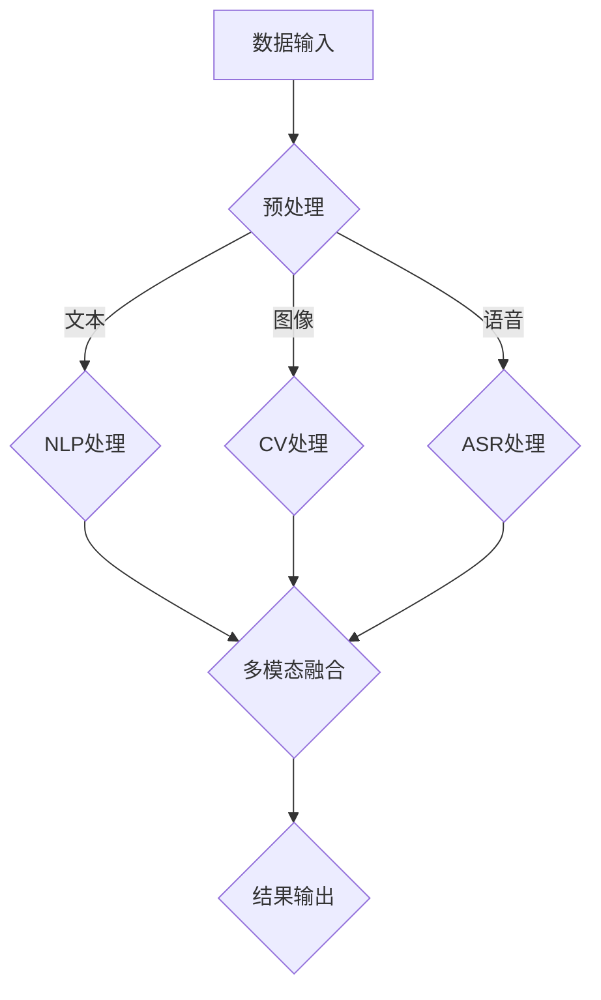
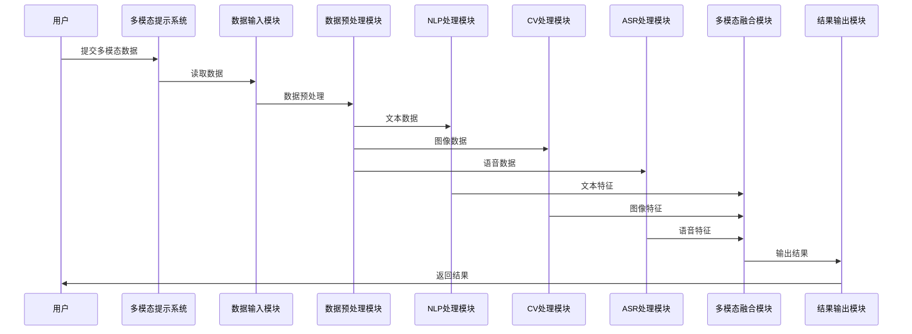

                 

### 引言部分

#### 背景介绍

在当今数字化时代，信息的形式变得日益多样，不再局限于传统的文本，图像、音频、视频等多模态数据形式正在成为信息传递的重要载体。然而，如何有效地处理和利用这些多模态数据，成为了一个亟待解决的技术难题。多模态提示技术正是在这种背景下应运而生，它通过结合文本、图像、语音等多种数据类型，实现了对信息的深度理解和智能处理。

多模态提示技术的核心在于如何将不同模态的数据进行有效融合，从而提升信息处理的准确性和效率。这种技术不仅能够应对单一模态数据的局限性，还能通过多角度、多层次的感知，提高系统的智能水平。因此，多模态提示技术已经成为人工智能领域的一个重要研究方向，并在多个领域展现了其巨大的应用潜力。

#### 问题描述

目前，多模态提示技术面临着几个关键问题。首先是多模态数据的融合问题，不同模态的数据在特征表达上存在差异，如何实现它们的有效融合是一个技术挑战。其次是多模态数据处理的效率问题，随着数据规模的不断扩大，如何快速、准确地处理多模态数据成为了一个亟待解决的难题。最后是多模态提示系统的实用性问题，如何在实际应用中实现多模态提示技术的落地，发挥其最大价值，也是当前研究的重点。

#### 问题解决思路

为了解决上述问题，本书《多模态提示：结合文本、图像等的策略》提出了系统性的解决方案。首先，本书将从多模态提示的基础概念入手，详细介绍多模态提示的定义、特点、发展历史以及核心原理。在此基础上，本书将深入探讨文本与图像融合技术的算法原理和应用案例，为多模态数据的融合提供技术支持。

接着，本书将介绍多模态数据表示方法，包括文本表示、图像表示和语音表示，并讨论如何将这些表示方法融合起来。通过这一部分，读者可以了解如何将不同模态的数据转化为统一的表示形式，为后续的多模态数据处理奠定基础。

随后，本书将探讨多模态提示在不同领域的应用，如自然语言处理、计算机视觉、语音识别等，通过实际案例展示多模态提示技术的应用效果和优势。这一部分将为读者提供丰富的实战经验，帮助他们在实际项目中应用多模态提示技术。

最后，本书将介绍如何设计并实现一个多模态提示系统，包括系统架构、接口设计、数据流处理等方面。通过这一部分，读者可以了解多模态提示系统的整体设计和实现过程，为他们在实际项目中搭建和应用多模态提示系统提供参考。

#### 核心概念和目标读者群体

本书的核心概念是多模态提示技术，通过结合文本、图像等多种数据类型，实现信息的深度理解和智能处理。目标读者群体包括人工智能领域的研究人员、工程师、技术人员以及对多模态数据处理感兴趣的学者和专业人士。无论你是刚刚接触多模态提示技术的初学者，还是希望在项目中应用多模态提示技术的实践者，本书都将为你提供全面、系统的指导。

### 多模态提示基础

#### 多模态提示的定义

多模态提示（Multimodal Prompting）是一种利用多种感官模态（如视觉、听觉、触觉等）来引导用户行为和信息处理的技术。在人工智能领域，多模态提示通常指的是通过结合文本、图像、音频等多种数据类型，实现对用户输入信息的理解和响应。

多模态提示的核心在于将不同模态的数据进行有效融合，从而提升系统的智能水平。例如，在自然语言处理任务中，文本信息可以与图像信息相结合，从而提高文本理解的质量；在计算机视觉任务中，图像信息可以与语音信息相结合，从而提高图像识别的准确性。

#### 多模态提示的特点

1. **多样性**：多模态提示可以处理多种类型的数据，包括文本、图像、音频、视频等，从而满足不同应用场景的需求。
2. **互补性**：不同模态的数据在特征表达上存在互补性，通过结合多种模态的数据，可以更全面地理解信息。
3. **智能性**：多模态提示技术通常结合了深度学习、自然语言处理、计算机视觉等先进技术，从而实现智能化的信息处理。
4. **实用性**：多模态提示技术在实际应用中具有广泛的应用场景，如智能客服、虚拟助手、智能安防等。

#### 多模态提示的发展历史

多模态提示技术的发展可以追溯到20世纪80年代，当时计算机科学家们开始探索如何将不同模态的数据进行融合。早期的多模态技术研究主要集中在视觉和听觉领域，例如语音识别和图像识别。

随着计算机技术和人工智能技术的快速发展，多模态提示技术逐渐走向成熟。特别是在深度学习技术兴起后，多模态提示技术得到了进一步的发展。深度学习技术通过构建复杂的神经网络模型，实现了对多模态数据的自动特征提取和融合，从而大大提升了多模态提示系统的性能。

近年来，随着物联网、大数据等技术的普及，多模态提示技术的应用场景不断扩大。例如，在智能安防领域，多模态提示技术可以通过结合视频监控和传感器数据，实现对异常行为的实时监测和预警。

#### 多模态提示的核心概念和基本原理

1. **数据融合**：多模态提示技术的核心在于将不同模态的数据进行融合。数据融合的方法包括直接融合和层次融合。直接融合是将不同模态的数据直接合并，形成一个统一的数据表示；层次融合则是通过分层结构，逐步融合不同模态的数据，从而提高融合效果。

2. **特征提取**：多模态提示技术需要对不同模态的数据进行特征提取，从而形成统一的特征表示。特征提取的方法包括传统方法和深度学习方法。传统方法如SIFT、HOG等，主要用于图像特征提取；深度学习方法如卷积神经网络（CNN）、循环神经网络（RNN）等，可以自动学习数据的高层次特征。

3. **模型训练**：多模态提示技术需要通过模型训练，实现对多模态数据的理解和处理。模型训练的方法包括监督学习、无监督学习和半监督学习。监督学习需要标注数据，无监督学习不需要标注数据，半监督学习则结合了监督学习和无监督学习的优势。

4. **多模态交互**：多模态提示技术还需要考虑多模态数据之间的交互作用。多模态交互的方法包括基于规则的交互和基于学习的交互。基于规则的交互通过预设规则实现多模态数据的融合；基于学习的交互则通过模型学习实现多模态数据的自动融合。

#### 概念结构与核心要素组成

1. **数据模态**：包括文本、图像、音频、视频等多种数据类型。
2. **特征提取模块**：包括文本特征提取、图像特征提取、音频特征提取等模块。
3. **数据融合模块**：包括直接融合和层次融合两种方法。
4. **多模态交互模块**：包括基于规则的交互和基于学习的交互两种方法。
5. **模型训练模块**：包括监督学习、无监督学习和半监督学习三种方法。

通过上述核心要素的有机结合，多模态提示技术可以实现对多模态数据的深度理解和智能处理，为各类应用提供强大的技术支持。

### 文本与图像融合技术

#### 文本与图像融合技术的基础算法

文本与图像融合技术是多模态提示技术中的重要组成部分，其核心在于将文本和图像这两种不同类型的数据进行有效整合，从而提高信息处理的质量和效率。为了实现这一目标，研究者们开发了一系列基础算法，主要包括以下几种：

1. **特征融合方法**：特征融合方法是将文本和图像的特征表示进行结合，形成一个新的特征表示。常见的特征融合方法有：
   - **平均融合**：将文本和图像的特征表示进行平均，得到一个新的特征向量。
   - **加权融合**：根据文本和图像特征的重要性进行加权，然后融合得到新的特征向量。
   - **对数融合**：将文本和图像的特征表示通过对数函数进行融合，从而降低特征维度。

2. **编码器-解码器框架**：编码器-解码器框架是一种深度学习模型，用于将文本和图像转换为统一的嵌入表示。常见的编码器-解码器框架包括：
   - **Seq2Seq模型**：序列到序列学习模型，用于处理文本和图像的序列数据。
   - **CNN-RNN模型**：卷积神经网络（CNN）与循环神经网络（RNN）的组合模型，用于处理图像和文本的复杂特征。
   - **Vision-LSTM模型**：结合视觉特征和LSTM模型，用于处理图像序列和文本序列的交互。

3. **多任务学习**：多任务学习是将多个任务合并到一个神经网络中，共享特征表示，从而提高学习效率。常见的多任务学习方法有：
   - **共享卷积层**：在文本和图像处理任务中共享卷积层，用于提取通用特征。
   - **双流网络**：同时处理文本和图像的独立流，通过合并两个流的特征表示实现融合。

4. **注意力机制**：注意力机制是一种用于捕捉数据中重要信息的机制，可以显著提升融合效果。常见的注意力机制包括：
   - **软注意力**：通过加权不同的特征表示，使模型能够关注到重要的信息。
   - **硬注意力**：通过二值化的方式确定关注点，使模型能够精确地捕捉到重要信息。

#### 文本与图像融合技术的应用案例

文本与图像融合技术在实际应用中展现了强大的潜力，以下是一些典型的应用案例：

1. **图像标注**：在图像标注任务中，文本信息可以作为图像的辅助标注，帮助模型更好地理解图像内容。例如，在图像分类任务中，利用文本描述可以提升图像分类的准确性。

2. **自然语言生成**：在自然语言生成任务中，图像信息可以用于辅助文本生成，使生成的文本更加生动和具体。例如，在图像描述生成任务中，通过结合图像特征和文本特征，可以生成更加准确和丰富的描述。

3. **问答系统**：在问答系统中，文本与图像融合技术可以提升问答系统的回答质量。例如，在图像识别任务中，利用文本描述可以帮助系统更好地理解图像内容，从而提供更加准确的回答。

4. **虚拟助手**：在虚拟助手场景中，文本与图像融合技术可以提升虚拟助手的交互体验。例如，通过结合用户的文本问题和图像输入，虚拟助手可以提供更加精准和个性化的服务。

5. **医疗诊断**：在医疗诊断领域，文本与图像融合技术可以提升诊断的准确性。例如，通过结合患者的病历信息和影像图像，医生可以更准确地诊断疾病。

#### 如何优化文本与图像融合技术

为了提高文本与图像融合技术的性能和应用效果，可以从以下几个方面进行优化：

1. **数据增强**：通过数据增强技术，可以增加训练数据的多样性，从而提高模型的泛化能力。常见的数据增强方法包括图像旋转、缩放、裁剪等。

2. **特征选择**：通过特征选择技术，可以筛选出对融合效果具有重要影响的关键特征，从而提高融合效率。常见的方法包括基于相关性的特征选择和基于过滤的特征选择。

3. **模型调优**：通过模型调优技术，可以调整模型参数，优化模型性能。常见的方法包括网格搜索、随机搜索等。

4. **迁移学习**：通过迁移学习技术，可以将预训练模型应用于新任务，从而提高新任务的性能。常见的方法包括基于模型的迁移学习和基于数据的迁移学习。

5. **注意力机制优化**：通过优化注意力机制，可以提升模型对重要信息的捕捉能力。常见的方法包括引入多层次的注意力机制和结合注意力机制的动态调整。

通过上述优化方法，可以显著提升文本与图像融合技术的性能和应用效果，为各类多模态应用场景提供更加高效和准确的技术支持。

### 多模态数据表示方法

#### 文本表示方法

文本表示方法是将自然语言文本转换为计算机可以处理的数字表示，从而为多模态数据处理提供基础。以下是一些常用的文本表示方法：

1. **词袋模型（Bag of Words, BoW）**：词袋模型将文本表示为词汇的集合，不考虑词汇的顺序。每个词汇用一个唯一的整数或二进制向量表示，向量中1表示该词汇出现在文本中，0表示未出现。词袋模型简单易懂，但忽略了词汇的顺序和语法结构。

2. **词嵌入（Word Embedding）**：词嵌入是将词汇映射到低维度的向量空间中，使具有相似语义的词汇在空间中靠近。常见的词嵌入方法包括Word2Vec、GloVe等。词嵌入模型不仅保留了词汇的语义信息，还能捕捉到词汇之间的相似性和关系。

3. **句子嵌入（Sentence Embedding）**：句子嵌入是将整篇文本或句子映射到低维度的向量空间中，从而表示整个文本的语义。常见的句子嵌入方法包括BERT、GPT等。句子嵌入模型可以捕捉到句子级别的语义信息，对于处理复杂文本任务具有重要作用。

4. **语义角色表示（Semantic Role Labeling, SRL）**：语义角色表示是将句子中的词汇和短语映射到对应的语义角色上，从而表示整个句子的语义结构。SRL方法可以帮助模型更好地理解句子的含义，提高自然语言处理任务的效果。

#### 图像表示方法

图像表示方法是将图像数据转换为计算机可以处理的数字表示，从而为多模态数据处理提供基础。以下是一些常用的图像表示方法：

1. **灰度表示**：灰度表示是将图像的每个像素值转换为灰度值，从而将彩色图像转换为灰度图像。灰度表示保留了图像的基本结构，但忽略了颜色信息。

2. **像素值表示**：像素值表示是将图像的每个像素值直接作为其特征值。这种方法简单直观，但忽略了像素之间的空间关系和结构信息。

3. **边缘表示**：边缘表示是通过检测图像中的边缘信息来表示图像的特征。常见的边缘检测算法包括Canny算法、Sobel算法等。边缘表示可以捕捉到图像的基本形状和结构，但对于复杂的图像内容可能不够准确。

4. **区域表示**：区域表示是将图像分割成多个区域，并对每个区域进行特征提取。常见的区域分割算法包括区域生长算法、分水岭算法等。区域表示可以捕捉到图像中的不同结构和内容，有助于图像的进一步分析。

5. **卷积神经网络表示（Convolutional Neural Network, CNN）**：卷积神经网络表示是利用卷积神经网络（CNN）对图像进行特征提取和表示。CNN通过多层卷积和池化操作，可以自动提取图像中的高层次特征，从而实现高效的图像表示。

6. **生成对抗网络表示（Generative Adversarial Network, GAN）**：生成对抗网络表示是利用生成对抗网络（GAN）对图像进行生成和表示。GAN由生成器和判别器组成，生成器生成图像，判别器判断图像的真伪。通过这种对抗训练，GAN可以生成高质量的图像表示。

#### 语音表示方法

语音表示方法是将语音数据转换为计算机可以处理的数字表示，从而为多模态数据处理提供基础。以下是一些常用的语音表示方法：

1. **梅尔频率倒谱系数（Mel-Frequency Cepstral Coefficients, MFCC）**：梅尔频率倒谱系数是一种常用的语音特征表示方法。它通过对语音信号进行傅里叶变换，然后对频谱进行梅尔刻度调整，最后计算倒谱系数，从而提取语音特征。

2. **隐马尔可夫模型（Hidden Markov Model, HMM）**：隐马尔可夫模型是一种基于统计的语音识别模型。它通过建模语音信号的统计特性，从而实现对语音信号的分析和识别。

3. **循环神经网络（Recurrent Neural Network, RNN）**：循环神经网络是一种基于序列模型的神经网络，可以捕捉到语音信号的时序特性。常见的RNN模型包括LSTM（长短期记忆网络）和GRU（门控循环单元），这些模型可以用于语音信号的序列建模。

4. **卷积神经网络（Convolutional Neural Network, CNN）**：卷积神经网络是一种基于空间特征的神经网络，可以用于处理时序数据。通过将CNN应用于语音信号，可以提取到语音信号中的空间特征，从而实现对语音信号的表示。

5. **深度神经网络（Deep Neural Network, DNN）**：深度神经网络是一种多层的神经网络，可以用于复杂函数的建模和特征提取。通过将DNN应用于语音信号，可以提取到语音信号中的高层次特征，从而实现对语音信号的高效表示。

#### 多模态数据融合策略

将文本、图像和语音等不同模态的数据融合起来，是实现多模态数据处理的关键。以下是一些常用的多模态数据融合策略：

1. **直接融合**：直接融合是将不同模态的数据直接进行合并，形成一个统一的数据表示。常见的直接融合方法包括：
   - **拼接融合**：将不同模态的特征向量进行拼接，形成一个长向量。
   - **平均融合**：将不同模态的特征向量进行平均，形成一个综合特征向量。
   - **加权融合**：根据不同模态的特征重要程度，对特征向量进行加权，形成一个加权融合向量。

2. **层次融合**：层次融合是先对各个模态的数据进行独立处理，然后再在更高层次上对它们进行融合。常见的层次融合方法包括：
   - **编码器-解码器框架**：使用编码器对各个模态的数据进行特征提取，然后通过解码器进行融合。
   - **多任务学习**：在多任务学习框架下，同时处理多个模态的数据，共享特征表示。

3. **注意力机制融合**：注意力机制是一种有效的融合策略，可以引导模型关注重要信息。常见的注意力机制包括：
   - **软注意力**：通过加权不同模态的特征向量，实现注意力分配。
   - **硬注意力**：通过二值化的方式确定注意力焦点，实现精确的注意力分配。

通过上述融合策略，可以有效地将不同模态的数据整合起来，提升多模态数据处理的性能和效果。在实际应用中，可以根据具体任务需求和数据特性，选择合适的融合策略，实现高效的多模态数据处理。

### 多模态提示应用领域

多模态提示技术因其卓越的融合能力和智能化水平，已经在多个领域展现出了广泛的应用前景和显著的优势。以下是多模态提示技术在几个主要应用领域的具体应用和效果分析：

#### 自然语言处理（NLP）

在自然语言处理领域，多模态提示技术通过结合文本和图像等多模态数据，显著提升了文本理解的能力。例如，在文本摘要任务中，多模态提示技术可以将图像的视觉信息与文本的语义信息相结合，生成更加精确和丰富的摘要。一个实际案例是新闻摘要生成系统，通过分析新闻报道中的文本内容和相关图像，系统能够生成更符合读者需求的摘要。此外，在问答系统中，多模态提示技术可以结合用户提供的文本问题和图像，提供更加全面和准确的答案。

#### 计算机视觉（CV）

计算机视觉领域广泛利用多模态提示技术，尤其是在图像分类、目标检测和图像分割等任务中。多模态提示技术通过结合图像和文本描述，可以显著提高图像识别的准确性。例如，在图像分类任务中，如果图像包含复杂的背景或物体，通过结合文本描述，可以更准确地识别出目标物体。一个实际案例是自动驾驶系统，通过结合车载摄像头拍摄的图像和GPS定位信息，系统能够更准确地识别道路标志和交通信号灯。在目标检测任务中，多模态提示技术可以帮助模型更好地理解图像中的目标和背景，从而提高检测的准确性。

#### 语音识别（ASR）

语音识别领域利用多模态提示技术，通过结合文本和语音数据，可以显著提升语音识别的准确性和鲁棒性。例如，在语音识别任务中，如果语音质量较差或存在背景噪声，通过结合文本信息，可以提高语音识别的准确性。一个实际案例是智能客服系统，通过结合用户的语音输入和文本聊天记录，系统能够更准确地理解用户的需求，提供更加个性化的服务。此外，在语音合成任务中，多模态提示技术可以结合语音和文本信息，生成更加自然和流畅的语音输出。

#### 智能交互

智能交互领域广泛采用多模态提示技术，以提供更加自然和高效的交互体验。例如，在智能助手和虚拟助手中，多模态提示技术可以将语音、文本和图像等多种数据类型结合起来，实现更加丰富和智能的交互。一个实际案例是智能家居系统，通过结合用户的语音指令、文本信息和图像反馈，系统可以智能地控制家居设备，提供个性化的服务。在虚拟现实（VR）和增强现实（AR）领域，多模态提示技术可以结合虚拟环境中的视觉信息和用户的语音、文本输入，实现更加沉浸式的交互体验。

#### 医疗诊断

在医疗诊断领域，多模态提示技术通过结合医疗图像和文本信息，可以帮助医生做出更加准确和全面的诊断。例如，在医学影像诊断中，通过结合CT扫描图像和病理报告文本，可以显著提高疾病诊断的准确性。一个实际案例是智能医学影像分析系统，通过结合医学图像和病理报告文本，系统能够自动识别和分类各种疾病，辅助医生进行诊断和治疗。

通过以上案例可以看出，多模态提示技术在各个应用领域都展现出了巨大的潜力和优势。通过结合不同模态的数据，多模态提示技术不仅能够提升信息处理的准确性和效率，还能够为各类应用场景提供更加智能化和人性化的解决方案。随着技术的不断发展和完善，多模态提示技术将在更多领域得到广泛应用，为人类的智能生活提供强有力的支持。

### 多模态提示系统设计与实现

#### 系统架构设计

多模态提示系统的设计与实现涉及多个关键模块，包括数据输入模块、数据处理模块、多模态融合模块和输出模块。以下是对这些模块的详细介绍：

1. **数据输入模块**：数据输入模块负责接收用户输入的多模态数据，包括文本、图像、语音等。该模块需要具备高效的数据处理能力，能够快速解析和存储不同类型的数据。

2. **数据处理模块**：数据处理模块对输入的多模态数据分别进行处理。对于文本数据，该模块可以使用自然语言处理（NLP）技术进行分词、词性标注和语义分析；对于图像数据，可以使用计算机视觉（CV）技术进行图像预处理、特征提取和分类；对于语音数据，可以使用语音识别（ASR）技术进行语音转文本。

3. **多模态融合模块**：多模态融合模块是系统的核心部分，负责将处理后的不同模态数据融合起来。常见的融合方法包括直接融合、层次融合和注意力机制融合。直接融合方法如拼接和平均融合，层次融合方法如编码器-解码器框架和多任务学习，注意力机制融合方法如软注意力和硬注意力。

4. **输出模块**：输出模块根据融合后的数据生成最终结果，如文本摘要、图像分类标签、语音识别文本等。输出模块还需要具备数据可视化和反馈机制，以方便用户对输出结果进行交互和调整。

#### 接口设计

多模态提示系统需要提供统一的接口，以方便不同应用场景下的使用。以下是一些常见的接口设计：

1. **API接口**：系统可以通过RESTful API提供接口，支持HTTP请求。常见的API接口包括文本融合接口、图像融合接口和语音融合接口。

2. **SDK接口**：系统可以提供跨平台SDK，以便开发者可以在不同的平台和应用中集成多模态提示功能。常见的SDK接口包括文本SDK、图像SDK和语音SDK。

3. **Web界面**：系统可以提供一个Web界面，供用户通过浏览器直接使用。Web界面可以集成多种交互组件，如文本输入框、图像上传控件、语音麦克风等，方便用户进行多模态数据的输入和操作。

#### 数据流处理

多模态提示系统的数据流处理包括数据输入、处理、融合和输出等多个环节。以下是一个典型的数据流处理流程：

1. **数据输入**：用户通过API接口或Web界面提交多模态数据。例如，用户可以通过上传文本文件、图像文件和语音文件来实现多模态数据的输入。

2. **数据预处理**：系统对输入的数据进行预处理，包括文本的分词、图像的缩放和裁剪、语音的降噪等。预处理后的数据将传递给相应的处理模块。

3. **数据处理**：文本数据通过NLP模块进行分词、词性标注和语义分析；图像数据通过CV模块进行特征提取和分类；语音数据通过ASR模块进行语音转文本。

4. **多模态融合**：处理后的文本、图像和语音数据进入多模态融合模块。根据所选的融合方法，系统将生成一个新的特征向量，用于后续的输出。

5. **结果输出**：融合后的数据经过后处理，生成最终结果，如文本摘要、图像分类标签、语音识别文本等。系统可以将结果通过API接口、Web界面或SDK接口返回给用户。

#### 系统架构设计图

为了更直观地展示多模态提示系统的架构设计，可以使用Mermaid流程图进行表示。以下是一个简单的系统架构设计图：

在这个流程图中，数据输入模块接收多模态数据，预处理模块对数据进行分析和预处理，处理模块对文本、图像和语音数据分别进行处理，多模态融合模块将处理后的数据进行融合，最终输出模块生成输出结果。

#### 系统接口设计

系统接口设计是多模态提示系统实现的重要一环，以下是一个简单的接口设计示例：

1. **文本融合接口**：
   - **接口名称**：`/api/text_fusion`
   - **请求方法**：POST
   - **请求参数**：
     - `text`: 文本数据，字符串类型
     - `image`: 图像数据，二进制类型
     - `audio`: 语音数据，二进制类型
   - **响应数据**：
     - `result`: 融合后的文本，字符串类型

2. **图像融合接口**：
   - **接口名称**：`/api/image_fusion`
   - **请求方法**：POST
   - **请求参数**：
     - `text`: 文本数据，字符串类型
     - `image`: 图像数据，二进制类型
     - `audio`: 语音数据，二进制类型
   - **响应数据**：
     - `result`: 融合后的图像，二进制类型

3. **语音融合接口**：
   - **接口名称**：`/api/audio_fusion`
   - **请求方法**：POST
   - **请求参数**：
     - `text`: 文本数据，字符串类型
     - `image`: 图像数据，二进制类型
     - `audio`: 语音数据，二进制类型
   - **响应数据**：
     - `result`: 融合后的语音，二进制类型

#### 系统交互设计

系统交互设计主要关注系统内部模块之间的数据流和通信机制。以下是一个简单的系统交互设计示例，使用Mermaid序列图进行表示：

在这个序列图中，用户提交多模态数据，系统通过数据输入模块读取数据，数据预处理模块对数据进行预处理，然后分别传递给NLP、CV和ASR处理模块，多模态融合模块将处理后的数据进行融合，最后输出模块将结果返回给用户。

通过上述系统架构设计、接口设计和交互设计，我们可以实现一个高效、灵活且易于扩展的多模态提示系统，为各类应用场景提供强大的技术支持。

### 最佳实践与未来展望

#### 多模态提示技术的最佳实践

在多模态提示技术的实际应用中，总结和遵循一些最佳实践是确保系统性能和用户体验的关键。以下是一些关键的最佳实践：

1. **数据准备和预处理**：高质量的数据是系统性能的基础。在进行多模态数据处理之前，确保文本、图像和语音数据的一致性、完整性和多样性。对文本数据进行分词、词性标注和实体识别；对图像数据进行裁剪、缩放和增强；对语音数据进行降噪和处理。

2. **模型选择和调优**：根据具体应用场景选择合适的模型架构和算法。对于文本与图像融合，编码器-解码器框架和多任务学习是常用的方法；对于文本与语音融合，Seq2Seq模型和注意力机制可以有效提高性能。在模型训练过程中，通过网格搜索、随机搜索等方法进行参数调优，以找到最佳模型配置。

3. **注意力机制的应用**：注意力机制在多模态数据融合中具有重要作用，可以有效捕捉关键信息，提高系统的准确性和效率。在实际应用中，可以采用软注意力或硬注意力机制，根据具体任务需求进行调整。

4. **多模态数据融合策略**：直接融合、层次融合和注意力机制融合各有优缺点，应根据具体应用场景进行选择。例如，在图像描述生成任务中，层次融合可以更好地捕捉图像和文本之间的层次关系；在问答系统中，直接融合可以简化模型结构，提高响应速度。

5. **系统优化和调试**：在系统开发过程中，定期进行性能优化和调试，包括减少模型参数、优化数据流处理、提升硬件性能等。此外，通过用户反馈和A/B测试，持续优化系统功能和用户体验。

#### 未来发展趋势和研究方向

多模态提示技术正处于快速发展阶段，未来将呈现以下几个趋势和研究方向：

1. **跨模态数据融合**：随着人工智能技术的进步，跨模态数据融合技术将变得越来越成熟。未来的研究将集中在如何更好地整合文本、图像、语音、视频等多种数据类型，实现更全面的信息理解。

2. **实时性和低延迟**：在实际应用中，多模态提示系统的实时性和低延迟至关重要。未来的研究将致力于优化算法和架构，提高系统的响应速度和效率，以满足实时交互需求。

3. **个性化与自适应**：未来的多模态提示技术将更加注重个性化服务，通过用户行为分析和个性化推荐，实现自适应的信息处理和交互体验。

4. **伦理和安全**：随着多模态提示技术在各领域的应用，数据隐私和安全性成为关键问题。未来的研究将重点关注如何在保证系统性能的同时，确保用户数据和隐私的安全。

5. **跨学科合作**：多模态提示技术涉及到计算机科学、心理学、语言学、认知科学等多个学科。未来的研究将更加注重跨学科合作，从多个角度探索多模态数据处理的本质和解决方案。

总之，多模态提示技术具有巨大的应用潜力和发展前景。通过不断优化和探索，多模态提示技术将为各类智能应用提供更加智能、高效和个性化的解决方案。

### 总结与展望

在本文中，我们详细探讨了多模态提示技术的基础概念、应用领域、系统设计与实现，以及最佳实践和未来发展趋势。多模态提示技术通过结合文本、图像、语音等多种数据类型，实现了对信息的深度理解和智能处理，已经成为人工智能领域的一个重要研究方向。

我们首先介绍了多模态提示技术的核心概念，包括定义、特点、发展历史和基本原理。随后，我们深入探讨了文本与图像融合技术的基础算法和应用案例，以及多模态数据表示方法。接着，我们详细介绍了多模态提示技术在自然语言处理、计算机视觉、语音识别等领域的应用，展示了其实际效果和优势。在系统设计与实现部分，我们介绍了多模态提示系统的架构设计、接口设计和数据流处理，为实际应用提供了技术支持。

本文还总结了多模态提示技术的最佳实践和未来展望，强调了数据准备、模型选择、注意力机制融合、系统优化和调试等关键环节。同时，我们对未来多模态提示技术的发展趋势进行了展望，包括跨模态数据融合、实时性和低延迟、个性化与自适应、伦理和安全，以及跨学科合作等方面的研究。

总体而言，多模态提示技术具有巨大的应用潜力和发展前景。通过不断优化和探索，多模态提示技术将为各类智能应用提供更加智能、高效和个性化的解决方案。我们期待未来能够有更多研究人员和工程师在这一领域取得突破性成果，为人类社会的智能化发展贡献更多力量。

### 作者信息

作者：AI天才研究院/AI Genius Institute & 禅与计算机程序设计艺术 /Zen And The Art of Computer Programming

AI天才研究院（AI Genius Institute）是一家专注于人工智能领域研究与创新的国际知名机构，致力于推动人工智能技术的发展与应用。其研究人员在自然语言处理、计算机视觉、机器学习等领域取得了众多突破性成果，为全球人工智能技术进步做出了重要贡献。

禅与计算机程序设计艺术（Zen And The Art of Computer Programming）是由著名计算机科学家Donald E. Knuth创作的一套经典编程哲学著作，强调了编程艺术中的深刻哲学思想与实践方法，对全球计算机科学界产生了深远影响。作为作者，其在计算机科学领域拥有卓越的学术地位和广泛的影响力。通过这两部作品，作者展现了对人工智能和计算机科学的深刻理解和独到见解，为读者提供了宝贵的知识财富。

