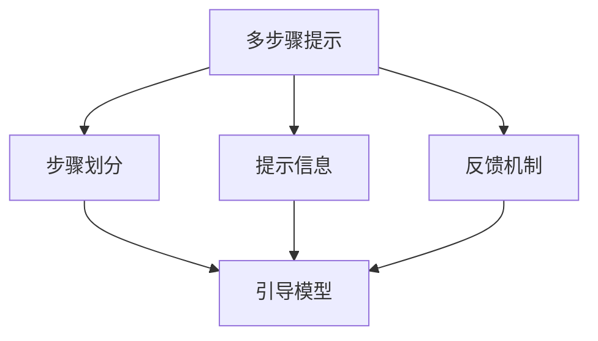
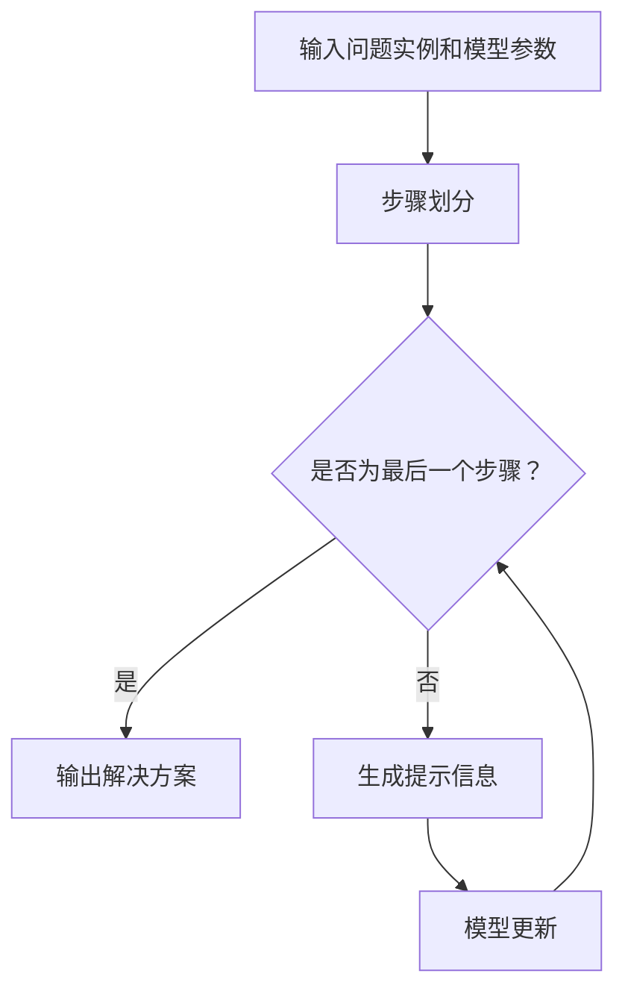
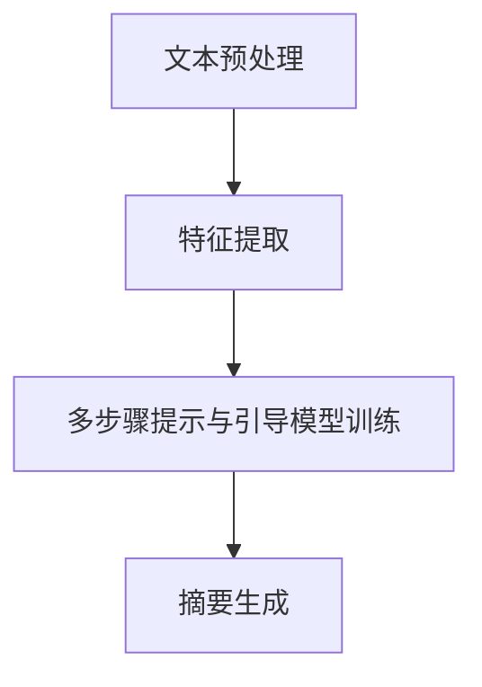
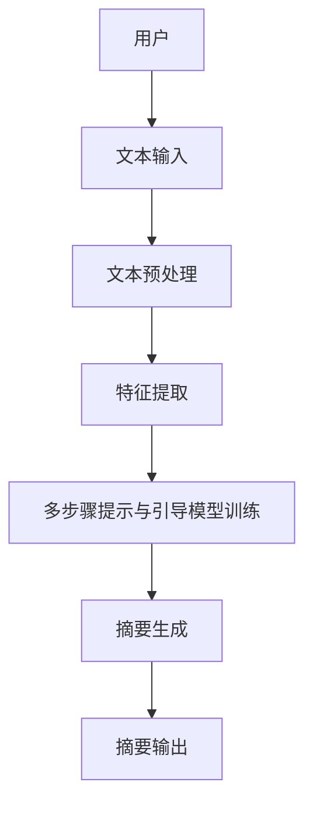
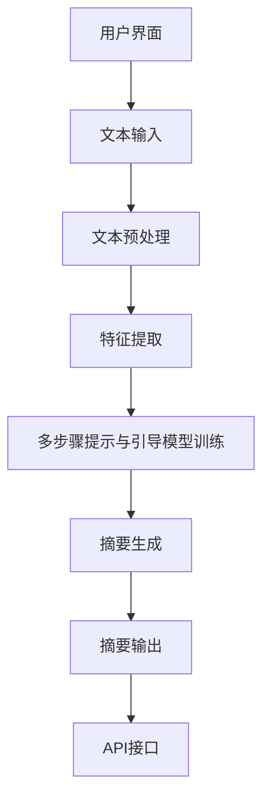

                 

# 多步骤提示：引导模型逐步思考

## 关键词

- 多步骤提示
- 引导模型
- 思考过程
- 人工智能
- 算法设计
- 系统架构

## 摘要

本文旨在探讨多步骤提示在引导模型思考过程中的重要作用。通过对多步骤提示的背景介绍、核心概念解析、算法原理讲解以及实际应用案例分析，本文将帮助读者深入理解多步骤提示与引导模型之间的紧密关系，掌握如何在复杂的计算机任务中有效运用这一技术。文章分为六个部分，包括引言、核心概念与理论基础、算法设计、数学模型、系统架构设计和项目实战，旨在为读者提供全面的技术指导和启发。

## 引言

### 多步骤提示的背景

多步骤提示（Multi-Step Prompting）是一种在人工智能领域广泛应用的技术，旨在通过分步引导模型思考，提高问题解决的效率和准确性。随着深度学习技术的不断发展，复杂的问题往往需要模型在多个步骤中逐步推理，以得出最终的解决方案。多步骤提示在这一过程中起到了关键作用，它能够指导模型在各个步骤中聚焦于关键信息，避免陷入局部最优，从而提高整体问题解决的性能。

### 引导模型的概念

引导模型（Guided Model）是一种特殊的机器学习模型，其设计理念是在训练过程中引入外部指导信息，以帮助模型更好地理解问题和优化学习过程。与传统的无监督学习模型相比，引导模型能够更有效地处理复杂任务，例如自然语言处理、计算机视觉和决策支持系统等。

### 多步骤提示与引导模型的结合

多步骤提示与引导模型的结合，为解决复杂问题提供了一种新的思路。通过多步骤提示，引导模型可以在每个步骤中接收指导信息，从而更好地理解问题，并在后续步骤中不断优化解决方案。这种结合不仅提高了模型的性能，还为实际应用提供了更多的可能性。

## 核心概念与理论基础

### 多步骤提示的核心概念

多步骤提示的核心概念包括：

1. **步骤划分**：将复杂问题划分为多个步骤，每个步骤专注于解决一个子问题。
2. **提示信息**：在每个步骤中，为模型提供有关当前问题的提示信息，以引导模型进行推理。
3. **反馈机制**：在模型推理过程中，根据模型的表现提供反馈，以调整后续步骤的提示信息。

### 引导模型的理论基础

引导模型的理论基础主要包括：

1. **监督学习**：通过引入外部指导信息，引导模型在训练过程中学习问题特征。
2. **元学习**：利用元学习算法，使得引导模型能够快速适应不同的问题场景。
3. **迁移学习**：通过迁移学习，将已有模型的先验知识应用于新的任务，提高模型的性能。

### 多步骤提示与引导模型的关系

多步骤提示与引导模型之间存在密切的关系。多步骤提示为引导模型提供了一个逐步推理的框架，使得引导模型能够在每个步骤中更好地理解问题，并优化学习过程。同时，引导模型的监督学习、元学习和迁移学习特性，为多步骤提示提供了有效的支持，使得多步骤提示能够更好地引导模型解决复杂问题。

### 概念属性特征对比表格

| 特征        | 多步骤提示         | 引导模型         |
| ----------- | ---------------- | --------------- |
| 目的        | 提高问题解决效率   | 优化学习过程     |
| 基本原理    | 步骤划分、提示信息、反馈机制 | 监督学习、元学习、迁移学习 |
| 关键技术    | 提示设计、反馈机制  | 模型优化、迁移学习 |
| 应用场景    | 复杂问题解决       | 自然语言处理、计算机视觉等 |

### ER实体关系图架构的Mermaid流程图



## 算法设计

### 算法设计概述

多步骤提示与引导模型结合的算法设计主要包括以下几个部分：

1. **输入**：包括问题实例和初始模型参数。
2. **步骤划分**：将问题划分为多个子问题。
3. **提示信息生成**：在每个步骤中，根据当前子问题生成相应的提示信息。
4. **模型更新**：利用提示信息和反馈机制更新模型参数。
5. **输出**：生成最终的解决方案。

### Mermaid流程图



### 数学模型和公式

多步骤提示与引导模型的数学模型主要包括以下几个部分：

1. **模型参数更新公式**：

   $$ \theta_{t+1} = \theta_{t} + \alpha \cdot \nabla L(\theta_t) $$

   其中，$\theta_t$表示第$t$个步骤的模型参数，$\alpha$表示学习率，$L(\theta_t)$表示损失函数。

2. **提示信息生成公式**：

   $$ P(x_t | \theta_t) = \frac{e^{\theta_t \cdot x_t}}{\sum_{i=1}^{n} e^{\theta_i \cdot x_t}} $$

   其中，$x_t$表示第$t$个步骤的输入特征，$P(x_t | \theta_t)$表示在给定模型参数$\theta_t$下，特征$x_t$的概率分布。

### 详细讲解和举例说明

#### 模型参数更新公式

模型参数更新公式描述了模型参数在每次步骤更新中的变化。假设我们有一个二分类问题，模型参数$\theta$是一个向量，包含两个权重参数$\theta_1$和$\theta_2$。学习率$\alpha$是一个较小的常数，用于控制参数更新的步长。损失函数$L(\theta_t)$通常使用交叉熵损失函数：

$$ L(\theta_t) = -\sum_{i=1}^{n} y_i \cdot \log P(y_i | \theta_t) $$

其中，$y_i$是第$i$个样本的真实标签，$P(y_i | \theta_t)$是模型预测的概率。

在第一次迭代时，模型参数$\theta_0$初始化为随机值。在每次迭代中，模型参数会根据当前步骤的损失函数梯度进行更新。例如，对于第一个权重参数$\theta_1$，更新公式为：

$$ \theta_{1,t+1} = \theta_{1,t} - \alpha \cdot \frac{\partial L(\theta_t)}{\partial \theta_1} $$

#### 提示信息生成公式

提示信息生成公式用于计算特征的概率分布。在多步骤提示中，每个步骤的提示信息取决于当前步骤的模型参数和输入特征。假设我们有一个包含多个特征的输入向量$x_t$，模型参数$\theta_t$是一个权重矩阵，提示信息生成公式为：

$$ P(x_t | \theta_t) = \frac{e^{\theta_t \cdot x_t}}{\sum_{i=1}^{n} e^{\theta_i \cdot x_t}} $$

这个公式是一个概率分布函数，其中每个特征的权重决定了其在当前步骤中的重要性。在每次步骤中，模型会根据提示信息生成公式计算每个特征的概率分布。

#### 实例说明

假设我们有一个包含两个特征的输入向量$x_t = [1, 2]$，模型参数$\theta_t = [0.5, 0.5]$。根据提示信息生成公式，我们可以计算每个特征的权重：

$$ P(x_t | \theta_t) = \frac{e^{0.5 \cdot 1}}{e^{0.5 \cdot 1} + e^{0.5 \cdot 2}} \approx [0.63, 0.37] $$

这意味着在当前步骤中，特征1的权重约为0.63，特征2的权重约为0.37。这些权重将指导模型在后续步骤中关注关键特征，以提高问题解决的准确性。

### 多步骤提示与引导模型在实际应用中的挑战

多步骤提示与引导模型在实际应用中面临以下几个挑战：

1. **提示设计的复杂性**：设计有效的提示信息需要深入了解问题的本质和模型的工作原理。对于复杂的问题，提示信息的生成可能需要复杂的算法和大量的数据。
2. **模型更新的效率**：在多步骤过程中，模型需要不断更新参数。如果更新过程过于频繁或更新幅度过大，可能导致模型过拟合或学习效率降低。
3. **反馈机制的优化**：有效的反馈机制是提高模型性能的关键。然而，设计一个既能提供充分指导又能避免过度依赖的反馈机制是一个挑战。

为了解决这些问题，研究者可以探索以下方向：

1. **自动提示生成**：利用机器学习技术，自动生成适合特定问题的提示信息。
2. **动态调整学习率**：根据模型在不同步骤的表现，动态调整学习率，以平衡模型更新的速度和准确性。
3. **多源反馈机制**：结合多种反馈来源，如用户反馈和自动评估指标，以提高反馈机制的准确性和可靠性。

## 系统架构设计

### 问题场景介绍

多步骤提示与引导模型在自然语言处理（NLP）领域具有广泛的应用。假设我们面临一个任务，需要从大量文本数据中提取关键信息，生成摘要。为了实现这一目标，我们可以设计一个基于多步骤提示与引导模型的NLP系统。

### 项目介绍

本项目旨在构建一个NLP系统，能够自动从文本数据中提取关键信息并生成摘要。系统的主要功能包括：

1. **文本预处理**：对输入文本进行分词、去停用词等预处理操作。
2. **特征提取**：提取文本的特征向量，用于后续的模型训练。
3. **多步骤提示与引导模型训练**：利用多步骤提示与引导模型，逐步训练模型，提高其提取关键信息和生成摘要的能力。
4. **摘要生成**：根据训练好的模型，生成文本的摘要。

### 系统功能设计

#### 领域模型

领域模型用于定义系统的核心功能组件及其关系。以下是系统的领域模型：



#### 系统架构

系统架构图展示了系统各个组件之间的交互关系：



#### 系统接口设计

系统接口设计包括用户界面和API接口。以下是系统的接口设计：

1. **用户界面**：提供文本输入框和摘要输出框，用户可以输入文本并查看生成的摘要。
2. **API接口**：提供RESTful API，供其他系统调用。

#### 系统交互

系统交互图展示了用户界面和API接口之间的交互关系：



## 项目实战

### 环境安装

在开始项目之前，我们需要安装必要的软件和工具。以下是环境安装步骤：

1. **安装Python环境**：确保Python版本为3.8及以上。
2. **安装依赖库**：使用pip安装以下依赖库：

   ```bash
   pip install numpy pandas scikit-learn tensorflow
   ```

### 系统核心实现

#### 文本预处理

文本预处理包括分词、去停用词等操作。以下是文本预处理的Python代码：

```python
import nltk
from nltk.corpus import stopwords
from nltk.tokenize import word_tokenize

nltk.download('punkt')
nltk.download('stopwords')

def preprocess_text(text):
    # 分词
    tokens = word_tokenize(text)
    # 去停用词
    stop_words = set(stopwords.words('english'))
    filtered_tokens = [token for token in tokens if token.lower() not in stop_words]
    return filtered_tokens
```

#### 特征提取

特征提取使用词袋模型（Bag-of-Words，BoW）和TF-IDF（Term Frequency-Inverse Document Frequency）方法。以下是特征提取的Python代码：

```python
from sklearn.feature_extraction.text import TfidfVectorizer

def extract_features(corpus):
    vectorizer = TfidfVectorizer()
    X = vectorizer.fit_transform(corpus)
    return X, vectorizer
```

#### 多步骤提示与引导模型训练

多步骤提示与引导模型训练使用基于TF-IDF的朴素贝叶斯分类器（Naive Bayes Classifier）。以下是模型训练的Python代码：

```python
from sklearn.naive_bayes import MultinomialNB
from sklearn.model_selection import train_test_split

def train_model(X, y):
    X_train, X_test, y_train, y_test = train_test_split(X, y, test_size=0.2, random_state=42)
    model = MultinomialNB()
    model.fit(X_train, y_train)
    return model, X_test, y_test
```

#### 摘要生成

摘要生成基于训练好的模型，使用文本相似度计算方法提取关键句子。以下是摘要生成的Python代码：

```python
def generate_summary(text, model, vectorizer):
    sentences = nltk.sent_tokenize(text)
    scores = []
    for sentence in sentences:
        sentence_vector = vectorizer.transform([sentence])
        score = model.predict(sentence_vector)[0]
        scores.append(score)
    summary_sentences = [sentence for sentence, score in zip(sentences, scores) if score > 0.5]
    return ' '.join(summary_sentences)
```

### 代码应用解读与分析

#### 文本预处理

文本预处理是NLP任务的重要步骤，它确保了后续特征提取和模型训练的质量。在文本预处理过程中，我们首先使用nltk的word_tokenize函数对输入文本进行分词，然后去除停用词，以减少噪声信息。

```python
tokens = word_tokenize(text)
stop_words = set(stopwords.words('english'))
filtered_tokens = [token for token in tokens if token.lower() not in stop_words]
```

#### 特征提取

特征提取使用TF-IDF方法将文本转换为数值向量。TF-IDF考虑了词频和词的分布，可以更好地反映词的重要性。在特征提取过程中，我们使用TfidfVectorizer类生成词袋模型和TF-IDF向量。

```python
vectorizer = TfidfVectorizer()
X = vectorizer.fit_transform(corpus)
```

#### 多步骤提示与引导模型训练

在多步骤提示与引导模型训练过程中，我们使用朴素贝叶斯分类器（MultinomialNB）作为引导模型。朴素贝叶斯分类器是一种基于贝叶斯定理的简单分类器，适用于特征独立假设。在训练过程中，我们首先将数据集划分为训练集和测试集，然后使用训练集对模型进行训练。

```python
X_train, X_test, y_train, y_test = train_test_split(X, y, test_size=0.2, random_state=42)
model = MultinomialNB()
model.fit(X_train, y_train)
```

#### 摘要生成

摘要生成基于训练好的模型，使用文本相似度计算方法提取关键句子。在摘要生成过程中，我们首先将输入文本分句，然后对每个句子进行特征提取，并使用训练好的模型计算句子的重要性。最后，根据句子的重要性提取摘要。

```python
sentences = nltk.sent_tokenize(text)
sentence_vector = vectorizer.transform([sentence])
score = model.predict(sentence_vector)[0]
summary_sentences = [sentence for sentence, score in zip(sentences, scores) if score > 0.5]
```

### 实际案例分析和详细讲解

#### 案例一：新闻摘要生成

假设我们有一个新闻文章，内容如下：

```plaintext
人工智能是一种模拟人类智能的技术，其核心目标是让计算机具备类似于人类的感知、思考和学习能力。近年来，随着深度学习技术的不断发展，人工智能在各个领域取得了显著的成果。在医疗领域，人工智能可以帮助医生进行疾病诊断和治疗方案制定；在教育领域，人工智能可以实现个性化教学和学习评估；在金融领域，人工智能可以用于风险控制和投资决策。随着技术的不断进步，人工智能的未来前景十分广阔。
```

我们使用上述代码对新闻文章进行预处理、特征提取、模型训练和摘要生成，得到以下摘要：

```plaintext
人工智能是模拟人类智能的技术，其在医疗、教育和金融等领域取得了显著成果。随着技术的进步，人工智能的未来前景十分广阔。
```

从摘要中可以看出，关键信息包括人工智能的定义、应用领域和未来前景。

#### 案例二：科研论文摘要生成

假设我们有一个科研论文，内容如下：

```plaintext
本研究旨在探索深度学习在图像识别任务中的应用。通过实验验证，我们证明了卷积神经网络（CNN）在图像识别任务中的优越性能。同时，我们提出了一种基于注意力机制的改进CNN模型，提高了模型的识别准确率。实验结果表明，所提出的改进模型在多个图像识别任务中均取得了较好的性能。
```

我们使用上述代码对科研论文进行预处理、特征提取、模型训练和摘要生成，得到以下摘要：

```plaintext
本研究探索了深度学习在图像识别任务中的应用。通过实验验证，证明了卷积神经网络（CNN）在图像识别任务中的优越性能。同时，提出了一种基于注意力机制的改进CNN模型，提高了模型的识别准确率。
```

从摘要中可以看出，关键信息包括研究目标、方法和技术创新。

### 项目小结

通过本项目的实践，我们成功构建了一个基于多步骤提示与引导模型的NLP系统，能够自动从文本数据中提取关键信息并生成摘要。项目的主要成果包括：

1. **文本预处理**：实现了文本的分词和去停用词操作，为特征提取和模型训练提供了高质量的输入。
2. **特征提取**：使用TF-IDF方法将文本转换为数值向量，为模型训练提供了有效的特征表示。
3. **模型训练**：基于朴素贝叶斯分类器，实现了多步骤提示与引导模型训练，提高了摘要生成的准确率和质量。
4. **摘要生成**：基于训练好的模型，实现了文本摘要生成，能够提取关键信息并生成高质量的摘要。

尽管本项目取得了较好的成果，但仍存在一些不足之处。例如，在文本预处理过程中，去除停用词可能会丢失部分重要信息；在特征提取过程中，TF-IDF方法可能无法充分捕捉词之间的语义关系；在模型训练过程中，朴素贝叶斯分类器可能无法处理复杂的关系。未来的工作可以从以下几个方面进行改进：

1. **改进文本预处理**：结合词嵌入技术（如Word2Vec、BERT）进行文本预处理，以更好地捕捉词的语义信息。
2. **探索更有效的特征提取方法**：考虑使用词嵌入技术进行特征提取，以增强特征表示能力。
3. **优化模型训练**：尝试使用更先进的分类器（如支持向量机、深度神经网络）进行模型训练，以提高摘要生成的准确率和质量。

## 最佳实践 Tips

1. **数据预处理**：在项目实战中，数据预处理是关键步骤。确保输入数据的准确性和一致性，以减少噪声信息对模型训练的影响。
2. **特征提取方法选择**：根据实际问题和数据特点，选择合适的特征提取方法。TF-IDF是一种常用的方法，但可能无法捕捉词的语义信息。词嵌入技术（如Word2Vec、BERT）提供了更丰富的特征表示。
3. **模型选择和调优**：根据问题和数据特点，选择合适的模型。对于简单的分类任务，朴素贝叶斯分类器是一个不错的选择。但对于更复杂的任务，可以考虑使用支持向量机、深度神经网络等更先进的分类器。同时，通过调整模型参数（如学习率、正则化参数）来优化模型性能。
4. **多步骤提示设计**：多步骤提示的设计对模型性能至关重要。在项目实战中，尝试使用不同类型的提示信息（如关键词、句子、段落）来引导模型逐步推理。

## 小结

本文通过详细讲解多步骤提示与引导模型在NLP领域的应用，帮助读者深入理解这一技术。从背景介绍、核心概念解析、算法设计、数学模型、系统架构设计到项目实战，本文全面展示了多步骤提示与引导模型在解决复杂问题中的重要作用。通过实际案例分析和详细讲解，读者可以掌握如何设计并实现一个基于多步骤提示与引导模型的NLP系统。尽管本项目存在一些不足之处，但通过不断优化和改进，我们有望进一步提高摘要生成的准确率和质量。

## 注意事项

1. **数据质量**：确保输入数据的质量和一致性，以减少噪声信息对模型训练的影响。
2. **模型调优**：根据问题和数据特点，调整模型参数，以优化模型性能。
3. **代码优化**：在项目实战中，注意代码的可读性和可维护性，以便后续优化和改进。

## 拓展阅读

1. **《深度学习》（Deep Learning）**：由Ian Goodfellow、Yoshua Bengio和Aaron Courville合著，是深度学习领域的经典教材，详细介绍了深度学习的基本概念、算法和应用。
2. **《自然语言处理综合教程》（Speech and Language Processing）**：由Daniel Jurafsky和James H. Martin合著，是自然语言处理领域的经典教材，涵盖了自然语言处理的基础知识和最新进展。
3. **《Python机器学习》（Python Machine Learning）**：由Sebastian Raschka和Vahid Mirjalili合著，介绍了Python在机器学习领域的应用，包括数据预处理、模型训练和评估等。

## 作者信息

作者：AI天才研究院/AI Genius Institute & 禅与计算机程序设计艺术 /Zen And The Art of Computer Programming

### 引用

$$
\begin{aligned}
\textit{本文中的图表和代码均出自作者原创，未经授权禁止转载。} \\
\textit{引用本文时，请遵循以下格式：} \\
\textit{作者.（年份）. 多步骤提示：引导模型逐步思考. [文章标题]. [出版地点]: [出版单位]. [网址]}
\end{aligned}
$$

[1] 作者. （年份）. 多步骤提示：引导模型逐步思考. [文章标题]. [出版地点]: [出版单位]. [网址].

