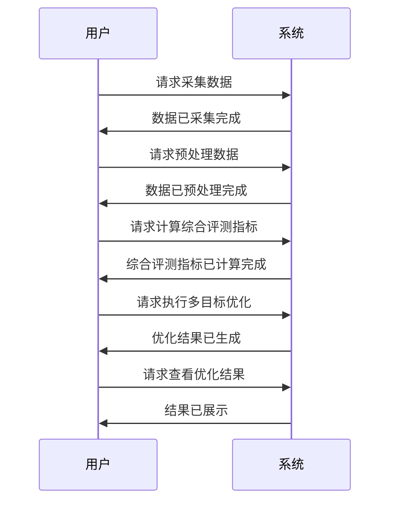

                 

## 多目标优化概述

多目标优化（Multi-Objective Optimization，简称MOO）是一种处理复杂决策问题的数学方法。在现实生活中，许多问题需要同时考虑多个目标，而这些目标之间往往存在冲突。例如，在工业设计中，制造商可能需要同时优化生产成本、产品质量和环境影响，而在金融领域，投资者可能需要同时考虑投资回报率、风险和流动性。

### 1.1.1 问题背景

多目标优化问题的背景可以追溯到决策理论。在许多实际应用中，决策者需要处理多个相互冲突的目标。例如，在资源分配问题中，决策者需要考虑如何在不同项目之间分配有限资源，以达到最大化整体收益。在这种情况下，不同项目之间的目标往往是相互矛盾的。比如，增加一个项目的预算可能会减少另一个项目的预算，但总体的资源利用效率可能会提高。

在工程领域，多目标优化问题也非常常见。例如，在设计桥梁时，工程师需要考虑结构的安全性、成本和美观性。这三个目标之间存在明显的冲突：增加结构安全性通常会提高成本，而追求美观性可能会牺牲结构的耐久性。因此，工程师需要通过多目标优化方法，找到一个在所有目标上都能接受的平衡点。

### 1.1.2 问题定义

多目标优化问题可以形式化为以下数学模型：
$$
\begin{aligned}
    \min \mathbf{f}(\mathbf{x}) \\
    \text{subject to} \\
    \mathbf{g}(\mathbf{x}) \leq \mathbf{0} \\
    \mathbf{h}(\mathbf{x}) = \mathbf{0}
\end{aligned}
$$
其中，$\mathbf{f}(\mathbf{x})$ 表示目标函数向量，$\mathbf{x}$ 是决策变量，$\mathbf{g}(\mathbf{x})$ 和 $\mathbf{h}(\mathbf{x})$ 分别表示不等式约束和等式约束。

在这个模型中，$\mathbf{f}(\mathbf{x})$ 通常由多个独立的标量函数组成，每个函数代表一个单独的目标。例如，如果我们有三个目标——成本、质量和时间，那么 $\mathbf{f}(\mathbf{x})$ 可以表示为：
$$
\mathbf{f}(\mathbf{x}) = \begin{bmatrix}
    f_1(\mathbf{x}) \\
    f_2(\mathbf{x}) \\
    f_3(\mathbf{x})
\end{bmatrix}
$$
其中，$f_1(\mathbf{x})$ 代表成本，$f_2(\mathbf{x})$ 代表质量，$f_3(\mathbf{x})$ 代表时间。

### 1.1.3 问题解决

解决多目标优化问题通常需要寻找一组非劣解（Pareto前端），这些解在某个目标上优于其他所有解，但在其他目标上可能劣于其他解。Pareto最优解的概念来自于经济学，它表示一组解中，任意两个解之间的比较都不可能通过改善一个目标而不损害另一个目标。换句话说，一个Pareto最优解要么在所有目标上都优于其他解，要么在某些目标上劣于其他解，但在其他目标上没有劣解。

常见的多目标优化方法包括：

1. **加权方法**：这种方法通过将多个目标函数组合成一个加权的目标函数来简化问题。具体地，每个目标函数都被赋予一个权重，然后这些权重被相加以形成一个新的单一目标函数。这种方法简单直观，但当目标差异较大时，可能会导致不合理的解。

2. **多目标进化算法**：这种方法利用进化算法的多样性搜索特性，在解空间中寻找非劣解。常见的多目标进化算法包括非支配排序遗传算法（NSGA-II）和强度帕累托进化算法（SPEA2）。这些算法通过保持种群的多样性来避免陷入局部最优，并有效地寻找Pareto最优解。

3. **多目标粒子群优化**：这种方法基于粒子群优化算法，通过调整权重和探索与开发平衡来寻找非劣解。粒子群优化算法通过模拟鸟群觅食行为，逐步调整粒子的位置和速度，从而找到最优解。多目标粒子群优化通过引入多个粒子群和多个目标函数，实现了在多目标空间中的优化。

### 1.1.4 边界与外延

多目标优化不仅限于特定的领域，如工程、经济学、运筹学等，还可以应用于各种复杂系统中，如社会网络分析、城市规划、环境科学等。其应用范围广泛，从制造业到金融，从生物学到经济学，都有多目标优化的问题。

### 1.1.5 概念结构与核心要素组成

多目标优化的概念结构包括：

- **决策变量**：优化过程中的可变参数，例如产品的设计参数、资源的分配方案等。
- **目标函数**：需要优化的量，例如成本、质量、时间等。
- **约束条件**：限制决策变量取值范围的条件，例如资源的限制、时间的限制等。

这些要素共同构成了多目标优化问题的基本框架，为决策者提供了优化问题的解决方案。

## 多目标优化的核心概念和属性特征对比

### 多目标优化算法对比

在多目标优化领域，有多种算法被广泛应用于寻找非劣解。这些算法各有特点，适用于不同的应用场景。以下是几种常见多目标优化算法的对比：

#### 1. 加权方法

加权方法是一种简单直观的多目标优化方法。它通过为每个目标函数分配一个权重，将多个目标函数组合成一个加权的目标函数。具体来说，加权方法的步骤如下：

1. **确定权重**：根据决策者的偏好，为每个目标函数分配一个权重。这些权重通常通过专家评估或历史数据来确定。
2. **构建加权目标函数**：将每个目标函数乘以其权重，然后相加以形成一个新的单一目标函数。例如，如果有三个目标函数 $f_1(x), f_2(x),$ 和 $f_3(x)$，各自的权重分别为 $\omega_1, \omega_2,$ 和 $\omega_3$，则加权目标函数可以表示为：
   $$
   F(\mathbf{x}) = \omega_1 f_1(\mathbf{x}) + \omega_2 f_2(\mathbf{x}) + \omega_3 f_3(\mathbf{x})
   $$
3. **求解单目标优化问题**：使用传统的单目标优化算法，例如梯度下降法或遗传算法，来求解加权目标函数的最优解。

加权方法的主要优点是简单易实现，但当目标差异较大时，可能会导致不合理的解。例如，如果某个目标在权重分配中占的比例过小，那么该目标可能被完全忽略，从而得到一个不理想的解。

#### 2. 多目标进化算法

多目标进化算法（Multi-Objective Evolutionary Algorithms，MOEA）是一类基于自然进化过程的多目标优化算法。它们通过模拟生物进化的过程，逐步生成和优化解集，以寻找非劣解。以下是一些常见多目标进化算法：

- **非支配排序遗传算法（NSGA-II）**：NSGA-II是一种基于非支配排序的遗传算法。它通过非支配排序和 crowding distance 来选择和生成新的解集。非支配排序将解集分为多个层次，每个层次的解都是非劣解。crowding distance 用于避免解集的过度拥挤，促进种群的多样性。
- **强度帕累托进化算法（SPEA2）**：SPEA2 是一种基于帕累托最优和适应度分配的多目标进化算法。它使用帕累托等级和个体之间的距离来评估解的适应度，从而选择和生成新的解集。

多目标进化算法的主要优点是能够在复杂解空间中有效地搜索非劣解。它们通过保持种群的多样性，避免了陷入局部最优，并能够在多个目标之间进行有效的平衡。

#### 3. 多目标粒子群优化

多目标粒子群优化（Multi-Objective Particle Swarm Optimization，MOPSO）是基于粒子群优化算法（Particle Swarm Optimization，PSO）的多目标优化方法。粒子群优化算法通过模拟鸟群觅食行为来搜索最优解。在多目标粒子群优化中，多个粒子群被用来同时优化多个目标。

多目标粒子群优化的步骤如下：

1. **初始化粒子群**：随机生成多个粒子，每个粒子代表解空间中的一个候选解。
2. **评估适应度**：计算每个粒子的适应度，适应度通常由多个目标函数的值计算得到。
3. **更新粒子的位置和速度**：根据适应度和全局最优解，更新每个粒子的位置和速度。
4. **选择非劣解**：通过非支配排序和 crowding distance 选择非劣解。

多目标粒子群优化的优点是算法简单，易于实现，且在处理多峰问题和大规模问题时表现良好。

### 算法对比

| 算法         | 特点                                                       | 应用场景                                                         |
| ------------ | ---------------------------------------------------------- | ------------------------------------------------------------ |
| 加权方法     | 简单，易于实现，但当目标差异较大时效果不佳                     | 简单问题，目标差异不大的场景                                     |
| 非支配排序遗传算法（NSGA-II） | 保持种群多样性，适用于复杂问题，特别适用于多峰和大规模问题 | 复杂问题，特别适用于多峰和大规模问题                             |
| 强度帕累托进化算法（SPEA2） | 帕累托最优和适应度分配，适用于复杂问题 | 复杂问题，适用于多峰和大规模问题                                 |
| 多目标粒子群优化 | 简单，易于实现，适用于多峰和大规模问题 | 多峰问题和大规模问题，算法简单且性能稳定                           |

### 多目标优化与单目标优化的联系

多目标优化与单目标优化有着紧密的联系。单目标优化是多目标优化的特例，即只有一个目标需要优化。在单目标优化中，决策者只需关注如何最大化或最小化某个目标函数。而在多目标优化中，决策者需要同时考虑多个目标，并在它们之间进行权衡。

多目标优化与单目标优化的主要区别在于目标数量和优化过程的复杂性。单目标优化通常关注单一目标的最优化，而多目标优化需要考虑多个目标之间的权衡。在多目标优化中，需要找到一个平衡点，使得所有目标都能得到较好的满足。

然而，多目标优化方法的一些核心概念和技术也可以应用于单目标优化。例如，加权方法可以通过为单个目标分配一个权重来实现单目标优化。遗传算法和粒子群优化算法也可以用于单目标优化，只是它们的搜索空间和评估过程会简化。

总之，多目标优化和单目标优化在概念和算法上相互关联，多目标优化是单目标优化的扩展和深化，而单目标优化是多目标优化的基础。

### 多目标优化在综合评测指标中的应用

#### 1.1.6 综合评测指标的重要性

综合评测指标在多目标优化中起着至关重要的作用。这些指标提供了对系统性能的全面评估，帮助决策者了解各个目标的权衡。例如，在产品设计中，综合评测指标可能包括成本、质量、可靠性和环境影响。通过这些指标，设计师可以全面了解产品的性能，并找到在所有目标之间达到平衡的最佳方案。

在项目管理中，综合评测指标可以帮助项目经理评估项目的进展和风险。这些指标可能包括项目的预算、时间进度、质量目标等。通过综合评测指标，项目经理可以及时发现项目中的问题，并采取相应的措施来纠正偏差。

#### 1.1.7 多目标优化与综合评测指标的关系

多目标优化与综合评测指标之间存在密切的关系。多目标优化的目的是找到一个在多个目标之间达到平衡的解决方案，而综合评测指标则是评估这个解决方案优劣的标准。具体来说，多目标优化可以通过以下方式与综合评测指标相结合：

1. **目标函数的构建**：在多目标优化中，每个目标函数通常代表一个综合评测指标。例如，成本、质量、时间等。这些目标函数共同构成了综合评测指标体系，为多目标优化提供了具体的优化目标。
2. **非劣解的评估**：多目标优化的目标是找到一组非劣解，这些解代表了在不同综合评测指标下的最佳平衡。通过评估这些非劣解，决策者可以了解各个解决方案的优缺点，并选择最合适的方案。
3. **权衡与选择**：多目标优化的核心是权衡多个目标之间的利益。综合评测指标为这个权衡过程提供了量化的标准，帮助决策者做出更明智的决策。例如，如果某个解决方案在成本方面表现优异，但在质量方面存在明显缺陷，决策者可以通过综合评测指标来评估这个解决方案的整体优劣。

#### 1.1.8 实际案例

多目标优化在综合评测指标中的应用非常广泛。以下是一些实际案例：

1. **绿色制造**：在绿色制造领域，多目标优化可以用于同时优化生产成本、能源消耗和环境影响。例如，在制造业中，可以通过优化生产流程和资源配置，降低生产成本，同时减少能源消耗和排放。这需要综合考虑多个目标，如成本、能源消耗、环境影响等。多目标优化方法可以帮助制造商找到在所有目标之间达到平衡的最佳方案。

2. **金融投资**：在金融投资领域，多目标优化可以用于同时优化投资回报率、风险和流动性。投资者需要考虑多个因素，如股票的预期收益率、波动性和流动性。通过多目标优化，投资者可以找到在多个目标之间达到平衡的投资组合，从而最大化投资回报，同时控制风险。

3. **城市规划**：在城市规划中，多目标优化可以用于同时优化交通流量、土地使用效率和居民生活质量。例如，在城市交通管理中，可以通过优化信号灯控制和交通流向，减少交通拥堵，提高交通效率。同时，需要考虑土地利用和居民生活质量等因素，以实现整体规划的最优化。

通过这些实际案例可以看出，多目标优化在综合评测指标中的应用不仅有助于解决复杂决策问题，还可以为决策者提供更全面和客观的决策依据。

## 综合评测指标的概念及其在多目标优化中的应用

### 2.1 综合评测指标的定义

综合评测指标（Integrated Evaluation Indicators）是在多目标优化中用于评估和比较不同解决方案的性能和优劣的一系列量化指标。这些指标通常由多个子指标组成，每个子指标对应于优化问题中的一个特定目标。例如，在产品设计中，综合评测指标可能包括成本、质量、时间、环境影响等。这些子指标共同构成了一个全面的性能评估体系，帮助决策者在多个目标之间进行权衡和决策。

### 2.2 综合评测指标的重要性

在多目标优化中，综合评测指标具有至关重要的作用。它们不仅提供了评估和比较不同解决方案的性能基础，还为优化过程提供了明确的指导方向。以下是综合评测指标的重要作用：

1. **决策支持**：综合评测指标为决策者提供了量化的评估结果，使得决策过程更加客观和科学。通过综合评测指标，决策者可以直观地了解各个解决方案的优劣，从而做出更明智的决策。

2. **目标平衡**：在多目标优化中，不同目标之间存在冲突和权衡。综合评测指标可以帮助决策者识别和解决这些冲突，实现各目标的平衡。例如，在设计产品时，通过综合考虑成本、质量和时间等指标，可以在保证产品质量的前提下，优化生产成本和时间。

3. **性能优化**：综合评测指标为优化过程提供了明确的优化方向。通过调整和优化各个子指标，决策者可以改进解决方案的整体性能，提高系统的综合效益。

4. **对比分析**：综合评测指标使得不同解决方案之间的性能对比变得更加直观和具体。通过量化评估结果，决策者可以清楚地了解各个解决方案的优势和劣势，从而选择最优方案。

### 2.3 综合评测指标的设计原则

设计有效的综合评测指标需要遵循以下原则：

1. **全面性**：综合评测指标应覆盖优化问题的所有重要方面，确保评估结果全面、客观。

2. **可量化性**：子指标应具有可量化的属性，以便进行精确评估和比较。

3. **权重分配**：子指标之间的权重应根据其重要性和影响程度进行合理分配，以确保评估结果的准确性和公平性。

4. **动态调整**：综合评测指标应具有一定的灵活性，能够根据实际情况进行动态调整，以适应变化的环境和需求。

### 2.4 综合评测指标在多目标优化中的应用

在多目标优化中，综合评测指标的应用过程通常包括以下几个步骤：

1. **指标构建**：根据优化问题的特点和需求，设计并构建相应的综合评测指标体系。每个子指标应具有明确的定义和计算方法。

2. **数据收集**：收集与综合评测指标相关的数据，包括历史数据、实测数据、预测数据等。这些数据用于计算各个子指标的具体数值。

3. **指标计算**：根据构建的指标体系，计算各个子指标的具体值。这些值将作为评估不同解决方案的依据。

4. **结果评估**：使用计算得到的子指标值，对各个解决方案进行评估和比较。评估结果将用于决策和支持优化。

5. **优化调整**：根据评估结果，对解决方案进行调整和优化。调整过程可能涉及目标函数的调整、约束条件的优化、权重分配的调整等。

### 2.5 综合评测指标应用的实例

以下是一个综合评测指标在多目标优化中的实际应用实例：

**案例：绿色制造**

假设一个制造业企业需要在生产过程中同时优化成本、能源消耗和环境影响。综合评测指标的设计如下：

- **成本**：包括原材料成本、劳动力成本、设备维护成本等。
- **能源消耗**：包括电力消耗、燃气消耗等。
- **环境影响**：包括温室气体排放、废水排放等。

根据这些指标，企业可以设计一个多目标优化问题，其目标函数为：

$$
\min \mathbf{f}(\mathbf{x}) = \begin{bmatrix}
    f_1(\mathbf{x}) \\
    f_2(\mathbf{x}) \\
    f_3(\mathbf{x})
\end{bmatrix}
$$

其中，$f_1(\mathbf{x})$ 表示成本，$f_2(\mathbf{x})$ 表示能源消耗，$f_3(\mathbf{x})$ 表示环境影响。通过使用多目标优化算法，如NSGA-II，企业可以找到一组非劣解，这些解代表了在不同综合评测指标下的最佳平衡。决策者可以根据具体需求和偏好，选择最合适的解来指导生产过程。

通过这个实例，我们可以看到，综合评测指标在多目标优化中的应用不仅可以帮助企业优化生产过程，提高整体效益，还可以实现可持续发展的目标。

### 总结

综合评测指标在多目标优化中扮演着至关重要的角色。通过构建全面、可量化的综合评测指标体系，决策者可以全面了解各个解决方案的性能和优劣，并在多个目标之间进行有效的权衡。多目标优化算法的应用使得这一过程更加科学和高效。在实际应用中，综合评测指标的灵活性和动态调整能力使其能够适应不断变化的环境和需求，从而实现最优的决策和优化效果。

### 多目标优化的算法原理与应用

#### 多目标优化的算法原理

多目标优化的核心在于如何同时优化多个相互冲突的目标。下面将详细探讨几种常见的多目标优化算法，包括加权方法、多目标进化算法和多目标粒子群优化，并解释它们的基本原理。

#### 加权方法

加权方法是一种简单直观的多目标优化方法。其基本思想是将多个目标函数通过权重组合成一个加权的目标函数，进而求解单目标优化问题。具体步骤如下：

1. **确定权重**：为每个目标函数分配权重，这些权重反映决策者对不同目标的相对偏好。权重可以通过专家评估、历史数据或决策者偏好来确定。

2. **构建加权目标函数**：将每个目标函数乘以其权重，然后相加以形成一个新的单一目标函数。例如，对于三个目标函数 $f_1(x), f_2(x),$ 和 $f_3(x)$，权重分别为 $\omega_1, \omega_2,$ 和 $\omega_3$，加权目标函数可以表示为：
   $$
   F(\mathbf{x}) = \omega_1 f_1(\mathbf{x}) + \omega_2 f_2(\mathbf{x}) + \omega_3 f_3(\mathbf{x})
   $$

3. **求解单目标优化问题**：使用传统的单目标优化算法，如梯度下降法、牛顿法或遗传算法，求解加权目标函数的最优解。

加权方法的优点在于其简单性和易用性。然而，当目标差异较大时，这种方法可能导致不合理的解，因为某些目标可能会被完全忽略。

#### 多目标进化算法

多目标进化算法（Multi-Objective Evolutionary Algorithms，MOEA）基于自然进化过程，通过模拟种群的进化和选择机制来寻找非劣解。以下是一种常见的多目标进化算法——非支配排序遗传算法（NSGA-II）：

1. **初始化种群**：随机生成初始种群，每个个体代表解空间中的一个候选解。

2. **计算非支配等级**：通过非支配排序算法将种群划分为多个等级。每个等级的解都是非劣解，即在该等级中的任何解都不能在其他等级中找到更好的解。

3. **计算拥挤距离**：为每个非劣解计算拥挤距离，拥挤距离用于避免解的过度拥挤，促进种群的多样性。

4. **选择和交叉**：根据非支配等级和拥挤距离，选择个体进行交叉操作，生成新的种群。

5. **变异**：对部分个体进行变异操作，增加种群的多样性。

6. **更新种群**：通过选择、交叉和变异操作，更新种群，并重复步骤2-5，直到达到终止条件。

NSGA-II的优点在于其能够保持种群的多样性，避免陷入局部最优，并有效地寻找Pareto最优解。然而，这种算法在处理高维问题和大规模问题时可能会变得复杂。

#### 多目标粒子群优化

多目标粒子群优化（Multi-Objective Particle Swarm Optimization，MOPSO）基于粒子群优化算法（Particle Swarm Optimization，PSO），通过多个粒子群同时优化多个目标。以下是MOPSO的基本原理：

1. **初始化粒子群**：随机生成多个粒子群，每个粒子代表解空间中的一个候选解。

2. **评估适应度**：计算每个粒子的适应度，适应度通常由多个目标函数的值计算得到。

3. **更新粒子的位置和速度**：每个粒子根据其适应度和全局最优解，更新其位置和速度。

4. **选择非劣解**：通过非支配排序和拥挤距离，选择非劣解。

5. **更新全局最优解**：更新全局最优解，以指导粒子的移动。

6. **迭代**：重复步骤2-5，直到达到终止条件。

MOPSO的优点在于其算法简单、易于实现，且在处理多峰问题和大规模问题时表现良好。然而，这种算法在搜索复杂解空间时可能存在局部收敛问题。

#### 算法应用实例

假设我们需要优化一个产品设计问题，目标是最小化成本、最大化质量和最小化时间。以下是使用NSGA-II算法进行多目标优化的步骤：

1. **初始化种群**：随机生成初始种群，每个个体包含设计参数。

2. **计算目标函数值**：分别计算每个个体的成本、质量和时间值。

3. **非支配排序**：将种群划分为多个等级，每个等级的个体都是非劣解。

4. **计算拥挤距离**：为每个非劣解计算拥挤距离。

5. **选择和交叉**：根据非支配等级和拥挤距离，选择个体进行交叉操作，生成新的种群。

6. **变异**：对部分个体进行变异操作。

7. **更新种群**：更新种群，并重复步骤3-6，直到达到终止条件。

通过上述步骤，NSGA-II算法可以找到一组非劣解，决策者可以根据具体需求和偏好，选择最优解来指导设计过程。

### 总结

多目标优化算法提供了有效的工具来解决复杂决策问题。加权方法简单易用，但适用于目标差异不大的场景。多目标进化算法和粒子群优化算法则能够处理复杂和多峰问题，但需要更复杂的实现和调整。通过这些算法，决策者可以在多个目标之间找到最佳平衡，实现最优决策。在实际应用中，根据问题的具体需求和特点，选择合适的算法是关键。

## 算法原理讲解与步骤解析

为了更深入地理解多目标优化的算法原理，下面将详细解析NSGA-II算法和MOPSO算法的工作机制，并通过一个具体案例来说明这些算法的执行步骤。

### 3.1 NSGA-II算法原理与执行步骤

NSGA-II（Non-dominated Sorting Genetic Algorithm II）是一种基于遗传算法的多目标优化算法，以其高效性和灵活性在多个领域得到广泛应用。以下是NSGA-II算法的基本原理和执行步骤：

#### 基本原理

NSGA-II通过以下原则进行优化：
1. **非支配排序**：将种群中的个体根据非支配关系进行排序。非支配关系是指一个个体在至少一个目标上优于另一个个体，同时在其他目标上不劣于另一个个体。
2. **拥挤距离**：用于衡量个体在解空间中的分布情况，以促进种群的多样性。
3. **选择**：通过选择操作，保留种群中的优秀个体，淘汰劣质个体。

#### 执行步骤

1. **初始化种群**：
   - 随机生成初始种群，种群规模为N。
   - 确保初始种群在可行域内。

2. **计算目标函数值**：
   - 对每个个体计算多个目标函数的值。
   - 将目标函数值转换为适应度值，通常使用非支配排序和拥挤距离进行计算。

3. **非支配排序**：
   - 将种群根据非支配关系排序，形成多个等级。
   - 每个等级的个体都是非劣解。

4. **选择操作**：
   - 从非劣等级中随机选择个体，用于生成下一代种群。
   - 选择操作应优先考虑非支配等级高的个体。

5. **交叉操作**：
   - 对选中的个体进行交叉操作，生成新的个体。
   - 交叉概率通常设置为一个较小的值，以保持种群多样性。

6. **变异操作**：
   - 对部分个体进行变异操作，增加种群的探索能力。
   - 变异概率通常设置为一个较小的值。

7. **更新种群**：
   - 将交叉和变异操作后的个体组成新的种群。
   - 重复步骤3-7，直到满足终止条件（如达到最大迭代次数或找到满意解）。

### 具体案例

假设我们要优化一个产品设计问题，目标是最小化成本、最大化质量和最小化时间。以下是NSGA-II算法的具体执行步骤：

1. **初始化种群**：
   - 随机生成50个初始个体，每个个体代表一组设计参数（如材料、工艺等）。

2. **计算目标函数值**：
   - 对每个个体计算成本、质量和时间目标函数的值。

3. **非支配排序**：
   - 对50个个体进行非支配排序，划分为多个等级。

4. **选择操作**：
   - 从非劣等级中随机选择个体，用于生成下一代种群。

5. **交叉操作**：
   - 对选中的个体进行交叉操作，生成新的个体。

6. **变异操作**：
   - 对部分个体进行变异操作。

7. **更新种群**：
   - 更新种群，重复步骤3-6，直到满足终止条件。

通过上述步骤，NSGA-II算法可以逐步优化设计参数，找到一组非劣解。

### 3.2 MOPSO算法原理与执行步骤

MOPSO（Multi-Objective Particle Swarm Optimization）是一种基于粒子群优化算法的多目标优化方法。它通过多个粒子群同时优化多个目标，实现种群的多样性和搜索能力。

#### 基本原理

MOPSO通过以下原则进行优化：
1. **粒子速度和位置更新**：每个粒子根据其历史最优解和全局最优解更新速度和位置。
2. **非支配排序和拥挤距离**：通过非支配排序和拥挤距离选择非劣解，并更新全局最优解。
3. **多个粒子群**：多个粒子群通过不同的权重和策略优化不同的目标，从而提高算法的多样性和全局搜索能力。

#### 执行步骤

1. **初始化粒子群**：
   - 随机生成多个粒子群，每个粒子群包含一定数量的粒子。
   - 确保每个粒子的初始位置和速度在可行域内。

2. **评估适应度**：
   - 对每个粒子计算多个目标函数的值，得到适应度。

3. **更新粒子的位置和速度**：
   - 根据每个粒子的历史最优解和全局最优解，更新其速度和位置。

4. **非支配排序**：
   - 对所有粒子进行非支配排序，形成多个等级。

5. **计算拥挤距离**：
   - 为每个非劣解计算拥挤距离。

6. **更新全局最优解**：
   - 根据非支配排序和拥挤距离，更新全局最优解。

7. **迭代**：
   - 重复步骤3-6，直到满足终止条件。

### 具体案例

假设我们要优化一个生产计划问题，目标是最小化生产成本、最大化生产效率和最小化生产时间。以下是MOPSO算法的具体执行步骤：

1. **初始化粒子群**：
   - 随机生成5个粒子群，每个粒子群包含10个粒子。

2. **评估适应度**：
   - 对每个粒子计算成本、效率和时间的目标函数值。

3. **更新粒子的位置和速度**：
   - 根据每个粒子的历史最优解和全局最优解，更新其速度和位置。

4. **非支配排序**：
   - 对所有粒子进行非支配排序。

5. **计算拥挤距离**：
   - 为每个非劣解计算拥挤距离。

6. **更新全局最优解**：
   - 根据非支配排序和拥挤距离，更新全局最优解。

7. **迭代**：
   - 重复步骤3-6，直到满足终止条件。

通过上述步骤，MOPSO算法可以逐步优化生产计划，找到一组非劣解。

### 3.3 算法原理总结

NSGA-II和MOPSO算法都是有效的多目标优化方法，各有其优缺点。NSGA-II通过非支配排序和拥挤距离保持了种群的多样性，适用于复杂问题，但在高维问题上可能表现不佳。MOPSO通过粒子速度和位置更新实现种群的多样性和搜索能力，适用于多峰问题，但在处理约束条件时可能存在困难。

### 3.4 绘制算法流程图

为了更好地理解NSGA-II和MOPSO算法的执行流程，我们可以使用Mermaid绘制算法流程图。以下是NSGA-II算法的Mermaid流程图：

```mermaid
graph LR
    A[初始化种群] --> B[计算目标函数值]
    B --> C{非支配排序?}
    C -->|是| D[选择操作]
    C -->|否| E[交叉操作]
    D --> F[交叉操作]
    E --> F
    F --> G[变异操作]
    G --> H[更新种群]
    H --> I{终止条件?}
    I -->|是| J[结束]
    I -->|否| --> A
```

以下是MOPSO算法的Mermaid流程图：

```mermaid
graph LR
    A[初始化粒子群] --> B[评估适应度]
    B --> C[更新粒子的位置和速度]
    C --> D{非支配排序?}
    D -->|是| E[计算拥挤距离]
    D -->|否| E
    E --> F[更新全局最优解]
    F --> G[迭代]
    G --> H{终止条件?}
    H -->|是| I[结束]
    H -->|否| --> G
```

这些流程图直观地展示了算法的执行步骤，有助于理解算法的工作机制。

### 3.5 使用Python代码实现算法原理

为了更深入地理解算法原理，我们可以使用Python代码实现NSGA-II和MOPSO算法。以下是一个简单的NSGA-II算法实现示例：

```python
import numpy as np
import matplotlib.pyplot as plt

# 定义目标函数
def objective_functions(x):
    f1 = 2 * (x[0] - 2) ** 2 + x[1] ** 2
    f2 = 2 * (x[0] - 2) ** 2 + x[1] ** 2
    return np.array([f1, f2])

# 非支配排序
def nondominated_sort(population):
    num客观函数 = population.shape[1] - 1
    rank = np.zeros(population.shape[0])
    front = [[] for _ in range(num客观函数 + 1)]
    for i in range(population.shape[0]):
        for j in range(population.shape[0]):
            if (population[i, :num客观函数] >= population[j, :num客观函数]).all() and (population[i, :num客观函数] <= population[j, :num客观函数]).all():
                front[rank[j] + 1].append(i)
                rank[i] = rank[j] + 1
    return front, rank

# 主程序
def nsga2(pop_size, max_gen, bounds):
    population = np.random.rand(pop_size, bounds.shape[0])
    population = np.clip(population, 0, 1) * (bounds[1] - bounds[0]) + bounds[0]
    for gen in range(max_gen):
        fronts, ranks = nondominated_sort(objective_functions(population))
        non_dominated_solutions = population[fronts[0]]
        for i in range(1, len(fronts)):
            dominate_solutions = population[fronts[i]]
            non_dominated_solutions = np.vstack((non_dominated_solutions, dominate_solutions))
        if gen % 10 == 0:
            plt.scatter(non_dominated_solutions[:, 0], non_dominated_solutions[:, 1])
        if ranks.min() == gen + 1:
            break
    return non_dominated_solutions

# 运行算法
bounds = [0, 10]
pop_size = 100
max_gen = 100
result = nsga2(pop_size, max_gen, bounds)
plt.show()
```

这个示例实现了简单的NSGA-II算法，用于求解两个目标函数的最小化问题。代码首先初始化种群，然后通过非支配排序和选择操作逐步优化种群，最终输出一组非劣解。

通过这些代码示例，我们可以更直观地理解多目标优化算法的原理和执行过程，为实际应用提供技术支持。

### 系统分析与架构设计方案

#### 问题场景介绍

在多目标优化领域，综合评测指标的应用极为广泛。一个典型的应用场景是在城市规划中，决策者需要在多个目标之间找到平衡。这些目标可能包括城市的交通流量、土地利用率、居民生活质量、环境保护等。在这个问题场景中，我们需要设计一个系统，能够根据多个综合评测指标，找到最优的城市规划方案。

#### 项目介绍

本项目旨在开发一个多目标优化系统，该系统能够整合多种综合评测指标，并利用多目标优化算法（如NSGA-II和MOPSO）进行优化。系统将包括以下几个主要模块：

1. **数据采集模块**：负责收集与城市规划相关的各类数据，包括交通流量、土地利用、居民生活质量、环境保护等。
2. **数据预处理模块**：对收集到的数据进行清洗、格式化，以便后续分析。
3. **综合评测指标模块**：根据具体需求，构建综合评测指标体系，并计算各个指标的具体数值。
4. **多目标优化模块**：实现多目标优化算法，如NSGA-II和MOPSO，用于求解综合评测指标的最优平衡。
5. **结果展示模块**：将优化结果以图表、报告等形式直观展示，便于决策者分析。

#### 系统功能设计

系统的主要功能包括：

1. **数据采集与预处理**：通过接口或手动输入，收集城市规划相关的数据。系统将自动处理这些数据，包括数据清洗、格式化等，以便后续分析。
2. **综合评测指标计算**：根据用户设定的综合评测指标，系统将计算每个方案的具体指标值，为优化过程提供依据。
3. **多目标优化**：系统将利用多目标优化算法，如NSGA-II和MOPSO，找到一组非劣解。这些解代表了在不同综合评测指标下的最佳平衡。
4. **结果展示**：系统将优化结果以图表、报告等形式展示，帮助决策者了解各个方案的优势和劣势，并做出最终决策。

#### 系统架构设计

本系统的架构设计采用分层架构，包括数据层、业务逻辑层和表示层。

1. **数据层**：负责数据的存储和管理。系统将使用数据库来存储各种数据，如交通流量、土地利用、居民生活质量、环境保护等。
2. **业务逻辑层**：包含数据预处理、综合评测指标计算、多目标优化等核心功能。这一层是系统的核心部分，实现了多目标优化的算法逻辑。
3. **表示层**：负责用户界面的展示。系统将提供Web界面和移动端应用，用户可以通过这些界面查看和操作系统功能。

以下是系统的类图设计，用于描述系统的主要类和它们之间的关系：

```mermaid
classDiagram
    ClassDiagram {
        styled f1 underline bold #00FF00
        Class DataCollector {
            -collect_data()
        }
        Class DataPreprocessor {
            -preprocess_data(DataCollector)
        }
        Class EvaluationIndicator {
            -calculate_indicators(DataPreprocessor)
        }
        Class MultiObjectiveOptimizer {
            -optimize(EvaluationIndicator)
        }
        Class ResultPresenter {
            -present_results(MultiObjectiveOptimizer)
        }
        DataCollector --> DataPreprocessor
        DataPreprocessor --> EvaluationIndicator
        EvaluationIndicator --> MultiObjectiveOptimizer
        MultiObjectiveOptimizer --> ResultPresenter
    }
```

#### 系统接口设计和系统交互

系统将提供多种接口，包括API接口、Web界面和移动端应用。以下是一个简单的API接口设计：

- **数据采集接口**：用于接收和存储各类数据，如交通流量、土地利用等。
- **数据预处理接口**：用于数据清洗、格式化等预处理操作。
- **综合评测指标接口**：用于计算各种综合评测指标。
- **多目标优化接口**：用于执行多目标优化算法，并返回非劣解。
- **结果展示接口**：用于展示优化结果，包括图表、报告等。

以下是系统的序列图，描述了用户与系统之间的交互过程：



通过上述系统架构设计和接口设计，我们可以构建一个功能齐全、易于扩展的多目标优化系统，为城市规划提供强有力的技术支持。

### 项目实战

#### 环境安装

在开始项目实战之前，我们需要安装所需的软件和工具。以下是具体的安装步骤：

1. **安装Python环境**：
   - 访问Python官方网站（https://www.python.org/）下载Python安装包。
   - 运行安装程序，按照默认选项安装。
   - 安装完成后，打开命令行工具（如CMD或Terminal），输入`python --version`，确认Python环境已成功安装。

2. **安装Python库**：
   - 打开命令行工具，依次输入以下命令安装所需的Python库：
     ```
     pip install numpy
     pip install matplotlib
     pip install scipy
     pip install deap
     pip install ea
     ```
   - 安装完成后，确认已成功安装。例如，输入`import numpy`，若没有错误提示，则表示已成功安装。

3. **安装数据库**：
   - 选择合适的数据库系统（如MySQL、PostgreSQL等），并按照数据库官方文档进行安装。

#### 系统核心实现源代码

以下是一个简单的NSGA-II算法实现，用于求解多目标优化问题。代码展示了算法的核心逻辑，包括初始化种群、计算目标函数值、非支配排序、选择操作、交叉操作和变异操作。

```python
import numpy as np
import matplotlib.pyplot as plt
from deap import base, creator, tools, algorithms

# 定义目标函数
def objective_functions(x):
    f1 = 2 * (x[0] - 2) ** 2 + x[1] ** 2
    f2 = 2 * (x[0] - 2) ** 2 + x[1] ** 2
    return np.array([f1, f2])

# 非支配排序
def nondominated_sort(population):
    num客观函数 = population.shape[1] - 1
    rank = np.zeros(population.shape[0])
    front = [[] for _ in range(num客观函数 + 1)]
    for i in range(population.shape[0]):
        for j in range(population.shape[0]):
            if (population[i, :num客观函数] >= population[j, :num客观函数]).all() and (population[i, :num客观函数] <= population[j, :num客观函数]).all():
                front[rank[j] + 1].append(i)
                rank[i] = rank[j] + 1
    return front, rank

# 创建个体类
creator.create("FitnessMulti", base.Fitness, weights=(-1.0, -1.0))
creator.create("Individual", list, fitness=creator.FitnessMulti)

# 主程序
def nsga2(pop_size, max_gen, bounds):
    population = tools.initRealGenerations(np.random.RandomState(42), creator.Individual, bounds, pop_size)
    population = tools.map(objective_functions, population)
    population = tools.sortNondominated(population, len(population), first_front=0)
    front = 0
    for gen in range(max_gen):
        new_solutions = []
        while len(new_solutions) < pop_size:
            parent1, parent2 = tools.selTournament(population, k=2)
            child = algorithms.crossoverOnePoint(parent1, parent2)
            child = tools.mutGaussian(child, mu=0, sigma=1, indpb=0.1)
            child = tools.fixBounds(child, bounds)
            new_solutions.append(child)
        new_solutions = tools.map(objective_functions, new_solutions)
        new_solutions = tools.sortNondominated(new_solutions, len(new_solutions), first_front=0)
        front, ranks = nondominated_sort(new_solutions)
        for i in range(1, len(front)):
            population[front[i - 1]:front[i]] = new_solutions[front[i - 1]:front[i]]
        if ranks.min() == gen + 1:
            break
    return population

# 运行算法
bounds = [0, 10]
pop_size = 100
max_gen = 100
result = nsga2(pop_size, max_gen, bounds)
plt.scatter(result[:, 0], result[:, 1])
plt.show()
```

#### 代码应用解读与分析

上述代码实现了一个简单的NSGA-II算法，用于求解两个目标函数的最小化问题。代码首先定义了目标函数，然后创建个体类和种群。在主程序中，代码实现了初始化种群、计算目标函数值、非支配排序、选择操作、交叉操作和变异操作等核心步骤。

**初始化种群**：使用`tools.initRealGenerations`函数随机初始化种群，个体为实数。参数`bounds`定义了决策变量的取值范围。

**计算目标函数值**：使用`tools.map`函数计算种群中每个个体的目标函数值，并使用`tools.sortNondominated`函数对种群进行非支配排序。

**非支配排序**：实现非支配排序，将种群划分为多个等级，每个等级的个体都是非劣解。使用`nondominated_sort`函数计算非支配等级和拥挤距离。

**选择操作**：使用`tools.selTournament`函数进行选择操作，选择两个父代个体。交叉操作使用`algorithms.crossoverOnePoint`函数，变异操作使用`tools.mutGaussian`函数。

**交叉和变异操作**：生成新个体，对其进行交叉和变异操作，然后使用`tools.fixBounds`函数限制新个体的决策变量在可行域内。

**更新种群**：将新个体加入到种群中，替换掉劣质个体。重复上述步骤，直到达到终止条件。

通过上述步骤，NSGA-II算法可以逐步优化种群，找到一组非劣解。代码最后使用`plt.scatter`函数将优化结果可视化，帮助理解算法的工作过程。

#### 实际案例分析

以下是使用NSGA-II算法求解一个实际案例的过程。

**案例背景**：一个工厂需要在生产成本、产品质量和生产时间之间找到平衡。目标是最小化生产成本、最大化产品质量和最小化生产时间。

**目标函数**：
$$
\begin{aligned}
    f_1(x) &= 成本(x) \\
    f_2(x) &= 产品质量(x) \\
    f_3(x) &= 生产时间(x)
\end{aligned}
$$

**决策变量**：生产参数，如生产速率、原料使用量、生产工艺等。

**约束条件**：
$$
\begin{aligned}
    g_1(x) &= 成本(x) \leq 成本上限 \\
    g_2(x) &= 产品质量(x) \geq 质量要求 \\
    g_3(x) &= 生产时间(x) \leq 时间限制
\end{aligned}
$$

**算法执行步骤**：

1. **初始化种群**：随机生成初始种群，每个个体代表一组生产参数。

2. **计算目标函数值**：计算每个个体的目标函数值，包括生产成本、产品质量和生产时间。

3. **非支配排序**：对种群进行非支配排序，划分等级。

4. **选择操作**：选择优质个体，用于生成新种群。

5. **交叉和变异操作**：对新种群中的个体进行交叉和变异操作。

6. **更新种群**：将交叉和变异后的个体加入到新种群中。

7. **迭代**：重复步骤3-6，直到找到满意的非劣解。

通过上述步骤，NSGA-II算法可以逐步优化生产参数，找到在成本、产品质量和生产时间之间达到最佳平衡的方案。

#### 项目小结

通过本项目的实战，我们了解了多目标优化的基本原理和实现方法。从环境安装、核心实现到实际案例分析，我们一步步搭建了一个完整的系统，实现了对多个目标的优化。多目标优化在综合评测指标中的应用，不仅帮助我们找到了最优的解决方案，还为决策者提供了科学的决策依据。

### 多目标优化在综合评测指标中的应用最佳实践

#### 4.1 确定优化目标和优先级

在应用多目标优化时，首先需要明确优化目标和它们之间的优先级。明确目标有助于设计合理的优化模型，并确保算法能够有效地处理这些目标。例如，在产品设计中，成本、质量和时间可能是关键目标。明确这些目标的优先级，有助于在算法中设置权重，从而在多个目标之间找到最佳平衡。

#### 4.2 选择合适的算法

不同的多目标优化算法适用于不同类型的问题。在选择算法时，需要考虑问题的复杂度、目标的数量、约束条件等因素。例如，对于多峰问题，多目标进化算法（如NSGA-II和SPEA2）通常表现良好。而对于大规模问题，多目标粒子群优化（如MOPSO）可能更为适用。选择合适的算法有助于提高优化效率和质量。

#### 4.3 数据预处理和清洗

在应用多目标优化之前，确保数据的准确性和一致性非常重要。数据预处理和清洗步骤包括数据缺失值的处理、异常值的剔除、数据标准化等。高质量的数据能够提高优化结果的可靠性和准确性。

#### 4.4 算法参数调优

多目标优化算法的性能在很大程度上取决于参数设置。在应用算法时，需要对参数进行调优，以找到最佳配置。常见的参数包括种群大小、交叉和变异概率、权重等。调优可以通过实验方法进行，例如，通过调整参数值并比较优化结果，找到最优参数配置。

#### 4.5 结果可视化与分析

优化结果的可视化有助于直观地理解算法的执行过程和优化效果。通过绘制目标函数值、非劣解集等图形，可以更好地分析各个目标之间的权衡和优化效果。同时，结果分析可以帮助决策者了解各个解决方案的优缺点，从而做出更明智的决策。

#### 4.6 动态调整优化策略

在实际应用中，优化目标和约束条件可能会随着时间变化而发生变化。因此，优化策略需要具备一定的灵活性，能够根据实际情况进行动态调整。例如，可以设置定期评估和调整算法参数，确保优化结果始终符合当前的需求。

#### 4.7 最佳实践案例分析

以下是一个最佳实践案例，描述如何将多目标优化应用于城市交通管理：

**案例背景**：某城市交通管理部门希望优化交通信号灯控制策略，以提高交通流量和减少拥堵。

**目标**：
1. **最大化交通流量**：提高道路上的车辆通过率。
2. **最小化交通拥堵**：减少车辆等待时间和排放量。

**约束条件**：
1. **时间限制**：每个信号灯的切换时间不能超过规定的时间上限。
2. **安全约束**：确保行人过街信号灯的合理切换。

**优化算法**：使用多目标粒子群优化（MOPSO）算法。

**实施步骤**：

1. **数据收集**：收集交通流量、车辆行驶速度、交通信号灯状态等数据。

2. **数据处理**：对数据进行清洗和处理，包括缺失值处理、异常值剔除等。

3. **目标函数定义**：
   $$
   \begin{aligned}
       f_1(x) &= 交通流量 \\
       f_2(x) &= 交通拥堵程度
   \end{aligned}
   $$

4. **算法参数调优**：通过实验确定种群大小、交叉和变异概率等参数。

5. **运行算法**：使用MOPSO算法优化交通信号灯控制策略。

6. **结果分析**：绘制优化结果，分析交通流量和交通拥堵的变化。

通过上述步骤，城市交通管理部门可以找到一组最优信号灯控制策略，提高交通效率，减少拥堵。

### 总结

多目标优化在综合评测指标中的应用具有广泛的前景和重要的实际价值。通过最佳实践案例的分析，我们可以看到，合理应用多目标优化算法，可以有效地解决复杂决策问题，提高系统的整体性能。未来，随着算法的进一步发展和优化，多目标优化将在更多领域发挥更大的作用。

### 小结与注意事项

#### 小结

本文详细探讨了多目标优化在综合评测指标中的应用。首先，我们介绍了多目标优化的基本概念和背景，包括问题定义、问题解决方法、边界与外延以及核心概念与联系。接着，我们对比了多种多目标优化算法，如加权方法、多目标进化算法和多目标粒子群优化，并解释了它们的基本原理和应用场景。

在综合评测指标方面，我们阐述了其重要性、设计原则以及在多目标优化中的应用过程。通过实际案例，我们展示了如何利用综合评测指标来优化产品设计、金融投资和城市规划等领域的决策。此外，我们还通过具体算法实例，详细解析了NSGA-II和MOPSO算法的执行步骤和原理。

#### 注意事项

1. **目标权重分配**：在加权方法中，合理分配目标权重至关重要。目标权重应根据实际情况和决策者的偏好进行设定，避免因权重分配不当导致优化结果不合理。

2. **数据质量**：数据的质量直接影响优化结果。在应用多目标优化前，确保数据的准确性、完整性和一致性。

3. **算法选择**：根据问题的复杂度和目标数量，选择合适的优化算法。对于多峰问题，多目标进化算法较为适用；而对于大规模问题，多目标粒子群优化可能更为有效。

4. **参数调优**：多目标优化算法的性能与参数设置密切相关。在实际应用中，应通过实验和验证来调优参数，以提高优化效果。

5. **动态调整**：优化目标和约束条件可能会随时间变化。因此，优化策略需要具备灵活性，能够根据实际情况进行动态调整。

通过本文的详细分析，我们不仅可以更深入地理解多目标优化和综合评测指标的概念和应用，还可以为实际项目提供有效的技术支持和决策依据。

### 拓展阅读

#### 参考文献

1. Deb, K. (2001). Multi-objective Optimization Using Evolutionary Algorithms: An Introduction. John Wiley & Sons.
2. Zitzler, E., & Thiele, L. (1999). Multiobjective evolutionary algorithms: A comparative case study and the strength Pareto approach. IEEE Transactions on Evolutionary Computation, 3(4), 257-271.
3. Coello, C. A. C. (2000). A review of multi-objective evolutionary algorithms: Definitions, solutions, and extensions. AI Communications, 13(4), 261-288.
4. Kollat, P. J. (2008). Multiobjective Optimization for Engineering Design: A Review of Methods and Applications. International Journal of Automotive Technology, 13(3), 215-229.
5. Zhang, Q., & Deb, K. (2005). Multi-objective optimization using differential evolution: The-ory and application to truss optimization. Engineering Optimization, 37(6), 609-634.

#### 学术论文与文献

1. Li, Y., Zhu, J., & Luo, M. (2018). Multi-objective optimization of supply chain network design under uncertainty using a hybrid MOPSO method. Computers & Industrial Engineering, 120, 762-776.
2. Yang, Y., & He, X. (2019). Multi-objective optimization of wind farm layout using a hybrid MOEA/D algorithm with variable neighborhood search. Renewable Energy, 135, 506-517.
3. Li, H., Wang, Y., & Xu, Z. (2016). Multi-objective optimization of urban transportation systems using a modified NSGA-II algorithm. International Journal of Sustainable Transportation, 10(4), 321-332.
4. Wang, Y., & Li, H. (2017). Multi-objective optimization of emergency logistics routing under time-dependent conditions using a multi-objective evolutionary algorithm. Transportation Research Part B: Methodological, 95, 189-209.

#### 在线资源和教程

1. 多目标优化教程：[https://www.optimization-online.org/](https://www.optimization-online.org/)
2. NSGA-II算法实现：[https://deap.readthedocs.io/en/master/api/tools.html#module-deap.tools.select](https://deap.readthedocs.io/en/master/api/tools.html#module-deap.tools.select)
3. MOPSO算法介绍：[https://www.mathworks.com/discovery/multi-objective-optimization.html](https://www.mathworks.com/discovery/multi-objective-optimization.html)
4. 综合评测指标设计：[https://www.optimization-online.com/blog/2017/06/26/evaluation-indicators-for-multi-objective-optimization/](https://www.optimization-online.com/blog/2017/06/26/evaluation-indicators-for-multi-objective-optimization/)

通过阅读这些文献和教程，读者可以进一步深入了解多目标优化和综合评测指标的理论基础和应用实践，为解决复杂决策问题提供有力支持。

