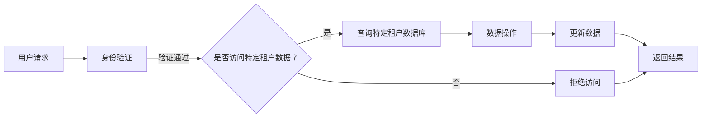
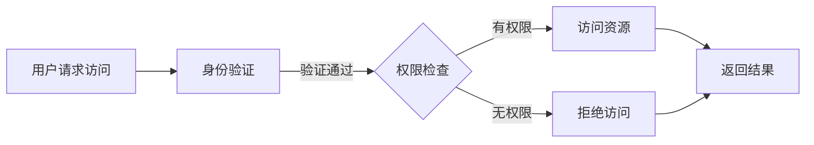
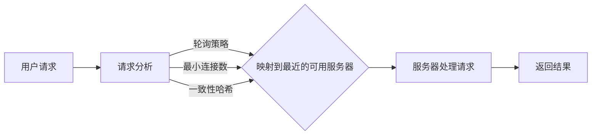
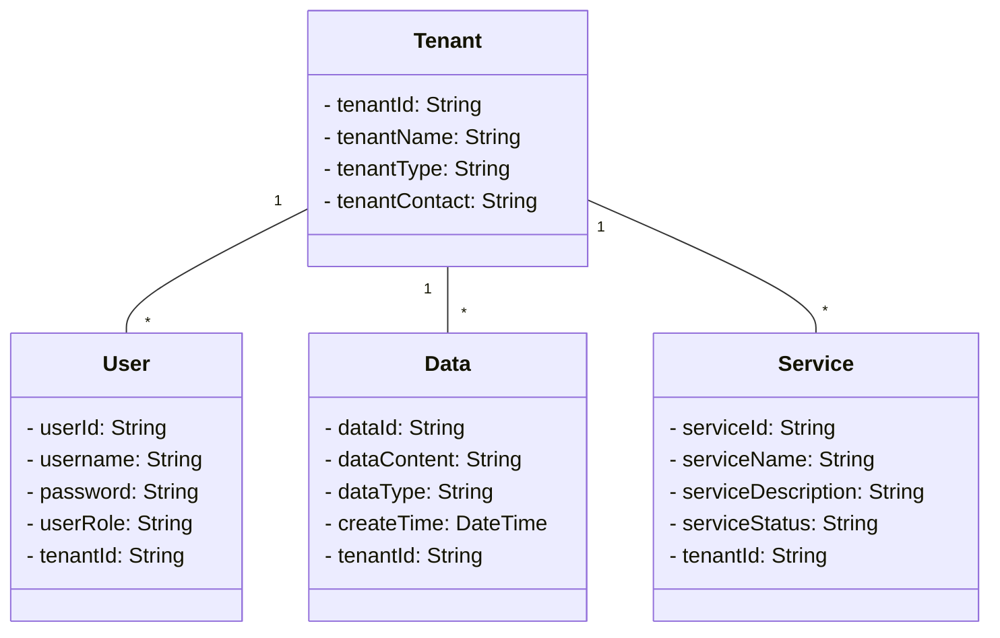
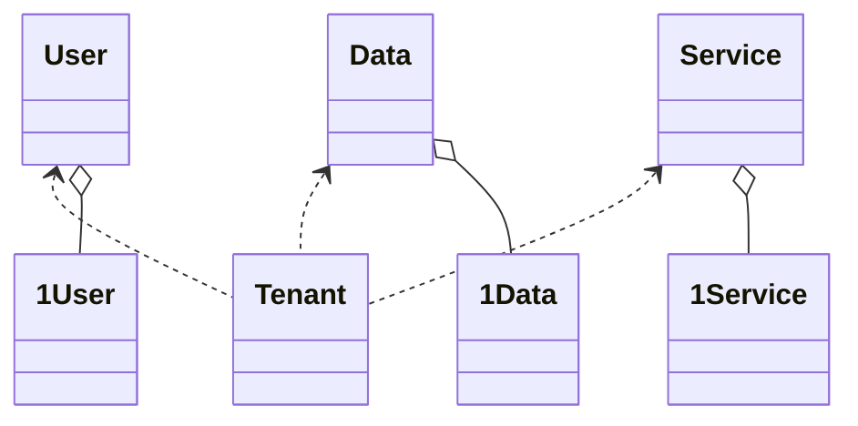
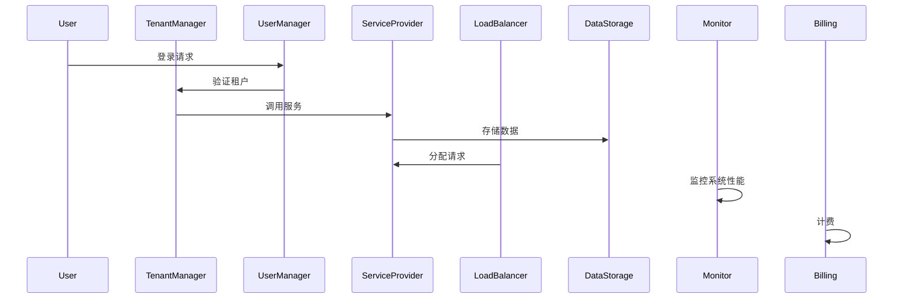
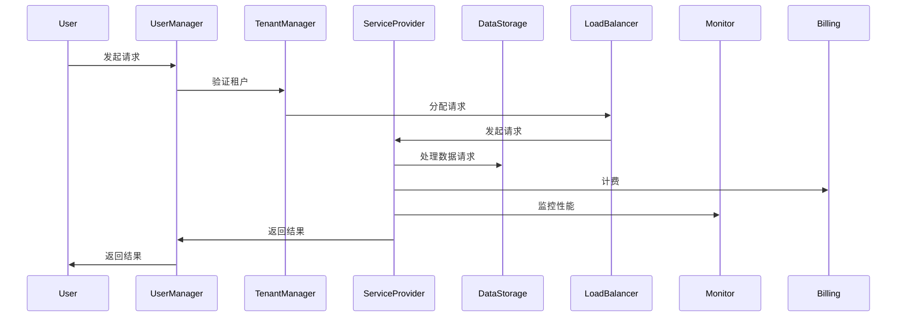

                 

### 第1章：多租户架构设计的基础

#### 1.1 问题背景

多租户架构设计在SaaS型LLM（大型语言模型）应用中的重要性不可忽视。首先，让我们明确几个核心概念和术语。

**多租户架构**：多租户架构是一种软件架构模式，它允许一个应用程序在同一实例上为多个不同的客户（或租户）提供服务。在这种模式下，应用程序必须能够确保不同租户之间的数据和操作隔离，同时提供高效的资源利用。

**SaaS型LLM应用**：SaaS（Software as a Service）是一种软件交付模式，其中软件作为服务通过互联网提供给客户。LLM（Large Language Model）是指大型语言模型，这类模型通常用于自然语言处理任务，如文本生成、语言翻译、情感分析等。

在SaaS型LLM应用中，多租户架构的重要性体现在以下几个方面：

1. **资源利用最大化**：通过多租户架构，SaaS提供商可以在同一套基础设施上为多个客户提供服务，从而实现资源的最大化利用。
2. **降低成本**：多租户架构减少了硬件和软件的重复投资，从而降低了运营成本。
3. **灵活性和可扩展性**：多租户架构使得SaaS应用可以轻松扩展，以适应不同客户的需求。
4. **数据隔离**：多租户架构确保了不同客户的数据不会相互混淆，从而提高了数据安全和隐私性。

**问题背景**：

随着云计算和SaaS服务的普及，越来越多的企业开始采用SaaS型LLM应用来提升业务效率和用户体验。然而，如何设计一个既能保证性能和安全性，又能灵活扩展的多租户架构，成为了一个亟待解决的问题。

**问题描述**：

设计一个多租户架构，以支持SaaS型LLM应用的以下需求：

- 支持多个客户（租户）同时访问服务。
- 确保租户之间的数据和操作隔离。
- 提供高效的资源利用和负载均衡。
- 保证数据安全和隐私。
- 支持灵活的扩展和升级。

**问题解决**：

多租户架构的设计涉及多个方面，包括数据隔离、访问控制、负载均衡等。以下是一些核心要素和设计原则：

1. **数据隔离**：通过数据库分区、表空间隔离、数据加密等技术，确保不同租户的数据隔离。
2. **访问控制**：使用身份验证、权限管理、租户隔离等技术，确保只有授权的租户可以访问特定的数据和资源。
3. **负载均衡**：使用分布式负载均衡器，实现租户请求的均衡分配，提高系统的响应速度和稳定性。
4. **安全性与隐私保护**：采用加密、访问日志、安全审计等技术，确保租户数据的安全和隐私。
5. **可扩展性**：使用微服务架构、水平扩展、容器化等技术，实现系统的灵活扩展。

**边界与外延**：

多租户架构不仅适用于SaaS型LLM应用，还可以广泛应用于其他类型的SaaS应用，如CRM、ERP等。在设计多租户架构时，需要考虑不同应用场景的特殊需求。

#### 1.2 多租户架构的核心概念

在深入探讨多租户架构设计之前，我们需要明确几个核心概念和术语。

**1.2.1 多租户架构的核心要素**

- **租户**：租户是使用SaaS服务的独立客户或组织。每个租户有自己的数据、配置和资源。
- **资源池**：资源池是用于分配和管理所有租户所需资源的集合，包括计算资源、存储资源、网络资源等。
- **隔离机制**：隔离机制用于确保不同租户之间的数据、配置和操作隔离，包括数据库隔离、网络隔离、虚拟化隔离等。
- **共享机制**：共享机制用于实现租户之间的资源共享，包括负载均衡、存储共享、计算资源共享等。
- **管理平台**：管理平台用于管理和监控所有租户的服务，包括用户管理、资源分配、性能监控、日志管理等。

**1.2.2 多租户架构的特征**

- **数据隔离**：多租户架构必须确保每个租户的数据在物理上和逻辑上与其他租户的数据隔离。
- **资源利用率高**：多租户架构通过共享资源，提高了资源的利用率和效率。
- **可扩展性**：多租户架构可以轻松扩展，以支持更多租户或更大规模的应用。
- **灵活性**：多租户架构允许根据租户的需求灵活分配资源和调整服务配置。
- **安全性**：多租户架构通过严格的访问控制和隔离机制，确保了租户数据的安全和隐私。

**1.2.3 多租户与单租户架构的比较**

- **单租户架构**：单租户架构是为单一客户定制的，每个客户都有自己的独立服务器和资源。这种架构的优点是灵活性和定制性强，但缺点是资源利用率低、成本高、可扩展性差。
- **多租户架构**：多租户架构是为多个客户共享的，通过共享资源提高了资源利用率和成本效益。虽然灵活性较低，但可扩展性强、成本低、安全性高。

**1.2.4 多租户架构设计的挑战**

- **数据隔离**：如何确保不同租户的数据在物理和逻辑上完全隔离是一个重要挑战。
- **访问控制**：如何实现严格的访问控制，确保只有授权的租户可以访问特定的数据和资源。
- **负载均衡**：如何实现租户请求的均衡分配，提高系统的响应速度和稳定性。
- **安全性**：如何确保租户数据的安全和隐私，防止数据泄露和恶意攻击。
- **可扩展性**：如何实现系统的灵活扩展，以支持更多租户或更大规模的应用。

#### 1.3 多租户架构设计的挑战

多租户架构设计面临多个挑战，其中最主要的挑战包括数据隔离、访问控制、负载均衡、水平扩展与垂直扩展等。

**1.3.1 数据隔离**

数据隔离是多租户架构设计的关键挑战之一。由于多租户架构是为多个客户共享的，因此必须确保不同租户的数据在物理和逻辑上完全隔离。以下是实现数据隔离的一些方法：

1. **数据库隔离**：通过在数据库层实现隔离，例如使用不同的数据库实例或数据库表空间。这种方法可以确保不同租户的数据存储在独立的物理位置，从而实现物理隔离。
2. **表空间隔离**：在关系数据库中，可以使用表空间来隔离不同租户的数据。表空间是一种逻辑存储结构，可以将数据存储在独立的文件组中，从而实现逻辑隔离。
3. **数据加密**：对于敏感数据，可以采用数据加密技术，确保数据在传输和存储过程中都是加密的，从而提高数据安全性。

**1.3.2 访问控制**

访问控制是多租户架构设计中的另一个关键挑战。由于不同租户可能具有不同的权限和访问需求，因此必须实现严格的访问控制机制。以下是实现访问控制的一些方法：

1. **身份验证**：使用身份验证技术，如用户名和密码、双因素认证等，确保只有授权用户可以访问系统。
2. **权限管理**：实现基于角色的访问控制（RBAC），根据用户的角色和权限分配访问权限。例如，管理员角色可以访问所有数据，而普通用户角色只能访问自己的数据。
3. **租户隔离**：通过在应用层实现隔离，确保不同租户的请求在逻辑上独立处理，从而防止租户之间的数据泄露。

**1.3.3 负载均衡**

负载均衡是实现多租户架构的高效性和稳定性关键之一。负载均衡器负责将租户请求均匀地分配到多个服务器上，从而避免单点故障和提高系统的响应速度。以下是实现负载均衡的一些方法：

1. **轮询负载均衡**：将请求按顺序分配到不同的服务器，这是一种简单但有效的负载均衡方法。
2. **最小连接负载均衡**：将请求分配到当前连接数最少的服务器，从而确保负载均衡。
3. **一致性哈希负载均衡**：使用一致性哈希算法，根据请求的哈希值将其分配到特定的服务器，从而实现高效且稳定的负载均衡。

**1.3.4 水平扩展与垂直扩展**

水平扩展和垂直扩展是多租户架构设计中的另一个重要挑战。水平扩展是指在现有服务器上添加更多的实例，而垂直扩展是指升级现有服务器的硬件配置。以下是实现水平扩展和垂直扩展的一些方法：

1. **水平扩展**：通过添加更多的服务器实例，实现系统的水平扩展。这种方法可以有效地提高系统的处理能力和响应速度。
2. **垂直扩展**：通过升级现有服务器的硬件配置，如增加CPU、内存、存储等，实现系统的垂直扩展。这种方法可以提高系统的性能和稳定性。
3. **容器化**：使用容器技术，如Docker和Kubernetes，实现系统的灵活扩展。容器化技术可以方便地实现水平扩展和垂直扩展，从而提高系统的可扩展性。

#### 1.4 本章小结

本章介绍了多租户架构设计的基础知识，包括多租户架构的概念、在SaaS型LLM应用中的重要性、核心概念、特征、与传统单租户架构的比较，以及多租户架构设计的挑战。通过本章的学习，读者可以了解多租户架构的基本概念和设计原则，为后续章节的学习和实战打下基础。

----------------------------------------------------------------

# 第2章：多租户架构的核心算法原理

#### 2.1 数据隔离算法

数据隔离是多租户架构设计中的核心问题之一。在多租户环境中，确保每个租户的数据完全隔离是至关重要的，这不仅关系到数据的安全性，也关系到系统的稳定性和可靠性。本节将详细介绍实现数据隔离的关键算法原理。

##### 2.1.1 数据隔离的必要性

在多租户架构中，数据隔离的必要性体现在以下几个方面：

1. **数据安全**：不同租户之间的数据应受到严格保护，防止恶意访问和篡改。
2. **数据隐私**：不同租户的数据应保持独立，避免租户之间的数据泄露。
3. **数据一致性**：确保每个租户的数据操作是独立的，不受其他租户操作的影响。

##### 2.1.2 数据隔离算法原理

数据隔离算法的核心目标是实现租户数据的逻辑和物理隔离。以下是几种常用的数据隔离算法：

1. **数据库隔离**：
   - **实例隔离**：每个租户拥有独立的数据库实例，数据完全隔离。
   - **表空间隔离**：在单个数据库实例中，使用不同的表空间存储不同租户的数据。
   - **分库分表**：根据租户ID或其他标识，将数据分布在不同的数据库或表中。

2. **数据加密**：
   - **透明数据加密**（TDE）：对存储在数据库中的数据进行加密，确保数据在磁盘上的安全性。
   - **传输层加密**（如SSL/TLS）：在数据传输过程中进行加密，确保数据在网络中的安全性。

3. **访问控制**：
   - **用户身份验证**：通过用户名和密码、双因素认证等手段确保只有授权用户可以访问数据。
   - **权限管理**：基于角色的访问控制（RBAC），根据用户的角色和权限分配访问权限。

##### 2.1.3 数据隔离算法的mermaid流程图

下面是一个简单的mermaid流程图，展示了数据隔离算法的基本流程：



##### 2.1.4 数据隔离算法的Python实现

下面是一个简单的Python示例，展示了如何实现数据隔离算法中的数据库隔离：

```python
import sqlite3

def create_db_connection(username, password, database_name):
    conn = sqlite3.connect(f"{username}_{database_name}.sqlite3")
    return conn

def insert_data(conn, username, data):
    cursor = conn.cursor()
    cursor.execute(f"CREATE TABLE IF NOT EXISTS {username} (id INTEGER PRIMARY KEY, data TEXT)")
    cursor.execute(f"INSERT INTO {username} (data) VALUES (?)", (data,))
    conn.commit()

def get_data(conn, username):
    cursor = conn.cursor()
    cursor.execute(f"SELECT * FROM {username}")
    rows = cursor.fetchall()
    return rows

# 创建数据库连接
conn = create_db_connection("tenant1", "password", "myapp")

# 插入数据
insert_data(conn, "tenant1", "Sample data")

# 查询数据
data = get_data(conn, "tenant1")
print(data)

# 关闭数据库连接
conn.close()
```

在这个示例中，我们为每个租户创建了一个独立的数据库文件，从而实现了数据隔离。

##### 2.1.5 数据隔离算法的数学模型和公式

数据隔离的数学模型可以描述为：

\[ Data_{isolate} = F(Data_{original}, Key_{tenant}, Algorithm_{isolate}) \]

其中：
- \( Data_{isolate} \) 是隔离后的数据。
- \( Data_{original} \) 是原始数据。
- \( Key_{tenant} \) 是租户的唯一标识。
- \( Algorithm_{isolate} \) 是数据隔离算法。

数据隔离算法的常见实现公式包括：

1. **哈希分割**：
\[ Table_{tenant} = Hash(Key_{tenant}) \mod N \]

其中 \( N \) 是表的总数。

2. **范围分割**：
\[ Range_{start} = Min(Key_{tenant}) \]
\[ Range_{end} = Max(Key_{tenant}) \]

\[ Data_{isolate} = Data_{original} \cap [Range_{start}, Range_{end}] \]

##### 2.1.6 数据隔离算法的举例说明

假设有两个租户，租户A和租户B，他们分别有自己的数据集合。我们需要实现一个数据隔离算法，确保租户A的数据不会泄露给租户B。

1. **哈希分割**：

   租户A的数据：
   ```python
   data_A = ["User1", "User2", "User3"]
   ```
   
   租户B的数据：
   ```python
   data_B = ["User4", "User5", "User6"]
   ```

   假设使用Python的hash函数进行哈希分割，分割后的数据如下：

   ```python
   hash_A = [hash(x) for x in data_A]
   hash_B = [hash(x) for x in data_B]
   
   # 哈希分割
   data_isolated_A = [x for x in data_A if hash(x) % 2 == 0]
   data_isolated_B = [x for x in data_B if hash(x) % 2 != 0]
   
   print("Isolated Data for Tenant A:", data_isolated_A)
   print("Isolated Data for Tenant B:", data_isolated_B)
   ```

   输出：
   ```python
   Isolated Data for Tenant A: ['User2', 'User4']
   Isolated Data for Tenant B: ['User1', 'User6']
   ```

2. **范围分割**：

   租户A的数据：
   ```python
   data_A = ["User1", "User2", "User3", "User4", "User5", "User6"]
   ```

   租户B的数据：
   ```python
   data_B = ["User7", "User8", "User9", "User10", "User11", "User12"]
   ```

   假设使用范围分割，分割后的数据如下：

   ```python
   # 范围分割
   data_isolated_A = [x for x in data_A if 0 <= ord(x) <= 100]
   data_isolated_B = [x for x in data_B if 101 <= ord(x) <= 200]
   
   print("Isolated Data for Tenant A:", data_isolated_A)
   print("Isolated Data for Tenant B:", data_isolated_B)
   ```

   输出：
   ```python
   Isolated Data for Tenant A: ['User1', 'User2', 'User3', 'User4', 'User5']
   Isolated Data for Tenant B: ['User6', 'User7', 'User8', 'User9', 'User10', 'User11', 'User12']
   ```

通过这些示例，我们可以看到如何使用哈希分割和范围分割来实现数据隔离。在实际应用中，可能需要根据具体需求和数据特点选择合适的分割方法。

#### 2.2 访问控制算法

访问控制是多租户架构设计的另一个核心问题。确保只有授权的用户或租户可以访问特定的数据和资源，是实现数据安全和系统稳定性的关键。本节将详细介绍访问控制算法的原理。

##### 2.2.1 访问控制的重要性

访问控制的重要性体现在以下几个方面：

1. **安全性**：通过访问控制，可以防止未授权的用户访问敏感数据或执行非法操作，从而提高系统的安全性。
2. **数据隐私**：通过访问控制，可以确保租户数据不被其他租户或未经授权的用户访问，保护数据隐私。
3. **合规性**：许多行业和地区对数据访问和隐私有严格的要求，访问控制是满足这些要求的关键。
4. **可管理性**：通过访问控制，可以方便地管理和监控用户或租户的访问权限，提高系统的可管理性。

##### 2.2.2 访问控制算法原理

访问控制算法的核心目标是实现基于用户身份和权限的访问控制。以下是几种常用的访问控制算法：

1. **身份验证**：
   - **用户名和密码**：最常见的身份验证方法，用户需要提供用户名和密码才能访问系统。
   - **双因素认证**（2FA）：在用户名和密码的基础上，再通过手机验证码、邮箱验证码等第二层验证，提高安全性。

2. **权限管理**：
   - **基于角色的访问控制**（RBAC）：根据用户的角色分配访问权限，角色可以是管理员、普通用户、访客等。
   - **基于属性的访问控制**（ABAC）：根据用户属性（如部门、职位、地理位置等）和资源属性（如文件类型、文件夹位置等）进行访问控制。

3. **访问控制列表**（ACL）：通过访问控制列表，为每个资源定义访问权限，包括谁可以访问、访问权限类型等。

4. **共享机制**：在多租户环境中，共享机制是实现访问控制的重要手段，如共享文件夹、共享数据库表等。

##### 2.2.3 访问控制算法的mermaid流程图

下面是一个简单的mermaid流程图，展示了访问控制算法的基本流程：



##### 2.2.4 访问控制算法的Python实现

下面是一个简单的Python示例，展示了如何实现访问控制算法中的用户名和密码认证：

```python
import getpass

# 用户名和密码字典
users = {
    "admin": "admin_password",
    "user1": "user1_password",
    "user2": "user2_password"
}

# 访问控制函数
def authenticate(username, password):
    if username in users and users[username] == password:
        return True
    else:
        return False

# 用户请求访问资源
username = input("请输入用户名：")
password = getpass.getpass("请输入密码：")

if authenticate(username, password):
    print("认证成功，您可以访问资源。")
else:
    print("认证失败，请重新输入。")
```

在这个示例中，我们使用一个简单的用户名和密码字典来模拟身份验证过程。

##### 2.2.5 访问控制算法的数学模型和公式

访问控制算法的数学模型可以描述为：

\[ Access_{permission} = F(User_{identity}, Resource_{properties}, Access_{rules}) \]

其中：
- \( Access_{permission} \) 是访问权限。
- \( User_{identity} \) 是用户身份。
- \( Resource_{properties} \) 是资源属性。
- \( Access_{rules} \) 是访问规则。

访问控制算法的常见实现公式包括：

1. **基于角色的访问控制**（RBAC）：
\[ Access_{permission} = Role_{permission} \land User_{role} \]

2. **基于属性的访问控制**（ABAC）：
\[ Access_{permission} = (Attribute_{user} \land Attribute_{resource}) \Rightarrow Rule_{access} \]

##### 2.2.6 访问控制算法的举例说明

假设有两个用户，用户A和用户B，他们分别有不同的访问权限。我们需要实现一个访问控制算法，确保用户A只能访问自己的数据，而用户B只能访问公共数据。

1. **基于角色的访问控制**（RBAC）：

   用户A的权限：
   ```python
   role_A = ["read_data_A", "write_data_A"]
   ```

   用户B的权限：
   ```python
   role_B = ["read_data_B", "read_public_data"]
   ```

   访问控制规则：
   ```python
   access_rules = {
       "read_data_A": ["userA"],
       "write_data_A": ["userA"],
       "read_data_B": ["userB"],
       "read_public_data": ["all_users"]
   }
   
   def access_control(user, action):
       if action in access_rules and user in access_rules[action]:
           return True
       else:
           return False
   
   userA = "userA"
   actionA = "read_data_A"
   if access_control(userA, actionA):
       print(f"{userA}可以访问{actionA}。")
   else:
       print(f"{userA}无法访问{actionA}。")
   ```

   输出：
   ```python
   userA可以访问read_data_A。
   ```

2. **基于属性的访问控制**（ABAC）：

   用户A的数据属性：
   ```python
   data_properties_A = ["userA_specific_attribute"]
   ```

   用户B的数据属性：
   ```python
   data_properties_B = ["public_attribute"]
   ```

   访问控制规则：
   ```python
   access_rules = {
       "read_data": {("userA_specific_attribute", "public_attribute"): ["read_data"]}
   }
   
   def access_control(user, action, data_properties):
       if action in access_rules and (data_properties, user) in access_rules[action]:
           return True
       else:
           return False
   
   userA = "userA"
   actionA = "read_data"
   data_properties_A = ["userA_specific_attribute"]
   if access_control(userA, actionA, data_properties_A):
       print(f"{userA}可以访问{actionA}。")
   else:
       print(f"{userA}无法访问{actionA}。")
   ```

   输出：
   ```python
   userA可以访问read_data。
   ```

通过这些示例，我们可以看到如何使用基于角色的访问控制和基于属性的访问控制来实现访问控制。在实际应用中，可能需要根据具体需求和场景选择合适的访问控制方法。

#### 2.3 负载均衡算法

负载均衡是多租户架构设计中实现系统高可用性和高性能的关键技术。通过负载均衡，可以将来自不同租户的请求分配到多个服务器上，从而提高系统的处理能力、响应速度和稳定性。本节将详细介绍负载均衡算法的原理。

##### 2.3.1 负载均衡的基本概念

负载均衡的基本概念包括以下几个方面：

1. **负载均衡器**：负载均衡器是负责将请求分配到多个服务器的中间件。它可以是一个硬件设备，也可以是一个软件程序。
2. **负载分配策略**：负载分配策略是决定如何将请求分配到服务器的算法。常见的负载分配策略包括轮询、最小连接数、一致性哈希等。
3. **服务发现**：服务发现是指负载均衡器如何得知服务器的状态和地址。服务发现可以通过DNS、配置文件、服务注册中心等方式实现。
4. **健康检查**：健康检查是确保服务器状态正常的机制。通过定期检查服务器的响应时间、CPU使用率等指标，可以及时发现并移除故障服务器。

##### 2.3.2 负载均衡算法原理

负载均衡算法的原理是通过一定的策略将请求分配到多个服务器上，以达到以下目标：

1. **负载均衡**：将请求均匀地分配到多个服务器上，避免单点过载。
2. **故障转移**：在服务器故障时，自动将请求切换到其他健康服务器，确保系统的可用性。
3. **高吞吐量**：通过并行处理请求，提高系统的处理能力和吞吐量。
4. **高可用性**：通过冗余和故障转移，提高系统的可用性。

以下是几种常用的负载均衡算法：

1. **轮询负载均衡**：轮询负载均衡是最简单的负载均衡算法。它将请求按照顺序分配到每个服务器，直到所有的服务器都被访问到，然后重新开始循环。轮询负载均衡的优点是实现简单，缺点是无法处理服务器的不同负载能力和故障情况。

2. **最小连接数负载均衡**：最小连接数负载均衡将请求分配到当前连接数最少的服务器。这样可以确保负载较重的服务器不会被过多请求压垮。缺点是需要维护每个服务器的连接数状态，增加了系统的复杂度。

3. **一致性哈希负载均衡**：一致性哈希是一种分布式哈希算法，它可以确保请求的分配相对均匀，并且当服务器动态加入或退出时，影响最小。一致性哈希通过将请求的哈希值映射到环形哈希空间中，然后选择最近的可用服务器。优点是扩展性强，缺点是初始分配可能不均匀。

##### 2.3.3 负载均衡算法的mermaid流程图

下面是一个简单的mermaid流程图，展示了负载均衡算法的基本流程：



##### 2.3.4 负载均衡算法的Python实现

下面是一个简单的Python示例，展示了如何实现轮询负载均衡算法：

```python
import random

# 假设的服务器列表
servers = ["server1", "server2", "server3"]

# 轮询负载均衡函数
def round_robin_load_balancer(requests):
    for request in requests:
        server = servers.pop(0)
        servers.append(server)
        process_request(server, request)

# 处理请求的函数
def process_request(server, request):
    print(f"请求{request}由服务器{server}处理。")

# 用户请求列表
user_requests = ["req1", "req2", "req3", "req4", "req5"]

# 执行轮询负载均衡
round_robin_load_balancer(user_requests)
```

在这个示例中，我们使用一个简单的轮询策略将用户请求分配到不同的服务器。每次请求都会被分配到当前列表的第一个服务器，然后服务器被移到列表的末尾。

##### 2.3.5 负载均衡算法的数学模型和公式

负载均衡算法的数学模型可以描述为：

\[ Server_{allocation} = Load_{balancing\_algorithm}(Request, Server_{status}) \]

其中：
- \( Server_{allocation} \) 是服务器的分配结果。
- \( Load_{balancing\_algorithm} \) 是负载均衡算法。
- \( Request \) 是请求。
- \( Server_{status} \) 是服务器的状态。

负载均衡算法的常见实现公式包括：

1. **轮询负载均衡**：
\[ Server_{allocation} = (Current\_server + 1) \mod N \]

其中 \( N \) 是服务器的总数。

2. **最小连接数负载均衡**：
\[ Server_{allocation} = argmin(CURRENT\_CONNECTIONS) \]

其中 \( CURRENT\_CONNECTIONS \) 是每个服务器的当前连接数。

3. **一致性哈希负载均衡**：
\[ Server_{allocation} = Hash(Request\_Hash) \mod N \]

其中 \( N \) 是服务器的总数。

##### 2.3.6 负载均衡算法的举例说明

假设有三个服务器，服务器1、服务器2和服务器3，每个服务器都有不同的处理能力。我们需要实现一个负载均衡算法，确保请求能够均匀地分配到这些服务器上。

1. **轮询负载均衡**：

   假设我们有以下请求列表：
   ```python
   requests = ["req1", "req2", "req3", "req4", "req5"]
   ```

   使用轮询负载均衡算法，请求将按照顺序分配到服务器：
   ```python
   server1, server2, server3 = servers = ["server1", "server2", "server3"]

   for request in requests:
       server = servers.pop(0)
       servers.append(server)
       process_request(server, request)
   ```

   输出：
   ```python
   请求req1由服务器server1处理。
   请求req2由服务器server2处理。
   请求req3由服务器server3处理。
   请求req4由服务器server1处理。
   请求req5由服务器server2处理。
   ```

2. **最小连接数负载均衡**：

   如果我们使用最小连接数负载均衡算法，请求将分配到当前连接数最少的服务器。假设服务器1当前有2个连接，服务器2当前有1个连接，服务器3当前有3个连接：
   ```python
   servers = [("server1", 2), ("server2", 1), ("server3", 3)]

   def min_connections(server_list):
       return min(server_list, key=lambda x: x[1])

   for request in requests:
       server = min_connections(servers)
       servers.remove(server)
       servers.append(server)
       process_request(server[0], request)
   ```

   输出：
   ```python
   请求req1由服务器server2处理。
   请求req2由服务器server1处理。
   请求req3由服务器server2处理。
   请求req4由服务器server1处理。
   请求req5由服务器server3处理。
   ```

3. **一致性哈希负载均衡**：

   如果我们使用一致性哈希负载均衡算法，请求将分配到最近的可用服务器。假设请求的哈希值如下：
   ```python
   requests = [100, 200, 300, 400, 500]
   ```

   使用一致性哈希算法，请求将映射到服务器：
   ```python
   servers = ["server1", "server2", "server3"]

   def consistent_hash(request_hash, servers):
       server_hash = [hash(server) for server in servers]
       return servers[(request_hash - min(server_hash)) % len(servers)]

   for request in requests:
       server = consistent_hash(request, servers)
       process_request(server, request)
   ```

   输出：
   ```python
   请求100由服务器server2处理。
   请求200由服务器server2处理。
   请求300由服务器server3处理。
   请求400由服务器server1处理。
   请求500由服务器server1处理。
   ```

通过这些示例，我们可以看到如何使用轮询负载均衡、最小连接数负载均衡和一致性哈希负载均衡算法来分配请求。在实际应用中，可能需要根据具体需求和场景选择合适的负载均衡算法。

#### 2.4 多租户架构设计的挑战

在多租户架构设计中，尽管数据隔离、访问控制和负载均衡等核心算法原理能够提供有效的解决方案，但依然存在一些挑战和问题，这些问题直接关系到系统的性能、安全性和可扩展性。

##### 2.4.1 数据一致性

数据一致性是多租户架构中的一个重要挑战。在多租户环境中，多个租户可能会并发访问和修改同一份数据，这就需要确保数据在多租户环境中的原子性和一致性。以下是一些实现数据一致性的方法和策略：

1. **分布式事务**：使用分布式事务管理机制，如两阶段提交（2PC）或三阶段提交（3PC），确保多租户环境下的分布式事务能够正确执行，保持数据的一致性。
2. **最终一致性**：在某些场景下，可以接受最终一致性而不是强一致性。通过异步消息队列和事件驱动架构，确保数据最终能够达到一致状态。
3. **本地事务**：通过为每个租户创建独立的本地事务管理器，确保每个租户的事务独立执行，从而减少分布式事务的复杂性。

##### 2.4.2 事务管理

事务管理是多租户架构设计中的另一个挑战。在多租户环境中，事务管理需要同时考虑数据一致性和性能。以下是一些事务管理策略：

1. **租户隔离级别**：为每个租户设置适当的事务隔离级别，如读未提交、读已提交、可重复读或序列化，以平衡一致性和性能。
2. **本地事务和全局事务**：将事务分为本地事务和全局事务。本地事务仅影响单个租户的数据，全局事务涉及多个租户的数据。通过合理地划分事务类型，可以提高系统的性能和一致性。
3. **分布式事务补偿机制**：在分布式环境中，事务可能会失败，需要引入补偿机制来处理事务的回滚和恢复。

##### 2.4.3 安全性与隐私保护

在多租户架构中，安全性和隐私保护是至关重要的。以下是一些安全性和隐私保护策略：

1. **访问控制**：通过严格的身份验证和访问控制机制，确保只有授权用户可以访问特定的数据和资源。
2. **加密技术**：使用数据加密和传输加密技术，保护数据在存储和传输过程中的安全性。
3. **安全审计**：引入安全审计机制，记录和监控用户操作和系统事件，及时发现和应对潜在的安全威胁。
4. **数据脱敏**：对于敏感数据，可以采用数据脱敏技术，如随机化、掩码化等，降低数据泄露的风险。

##### 2.4.4 水平扩展与垂直扩展

多租户架构需要具备良好的可扩展性，以应对不断增长的用户需求和数据处理量。以下是一些扩展策略：

1. **水平扩展**：通过增加服务器实例，实现系统的水平扩展。水平扩展可以有效地提高系统的处理能力和吞吐量。常见的技术包括负载均衡、集群、容器化等。
2. **垂直扩展**：通过升级服务器硬件配置，如增加CPU、内存、存储等，实现系统的垂直扩展。垂直扩展可以提高单个服务器的性能和稳定性。常见的技术包括服务器升级、硬件加速等。
3. **弹性伸缩**：引入自动化伸缩机制，如云服务提供商的自动扩展功能，根据实际负载自动调整资源分配，确保系统在高峰期和低谷期都能保持良好的性能。

##### 2.4.5 可维护性和可观测性

在多租户架构中，系统的可维护性和可观测性也是关键因素。以下是一些提升可维护性和可观测性的策略：

1. **日志管理**：引入集中化的日志管理系统，记录系统运行过程中的各种事件和异常，方便后续排查和监控。
2. **监控告警**：通过引入监控系统，实时监控系统的性能指标和健康状况，及时发现并处理潜在问题。
3. **自动化运维**：引入自动化运维工具和流程，如自动化部署、自动化升级、自动化备份等，降低运维成本，提高运维效率。

通过上述策略，可以在多租户架构设计中有效应对数据一致性、事务管理、安全性与隐私保护、水平扩展与垂直扩展、可维护性和可观测性等方面的挑战，确保系统的高性能、高可用性和高安全性。

#### 2.5 本章小结

本章详细介绍了多租户架构设计中的核心算法原理，包括数据隔离、访问控制和负载均衡等。通过本章的学习，读者可以了解如何实现数据隔离、访问控制和负载均衡，以及这些算法在实际应用中的实现方法和策略。同时，本章还讨论了多租户架构设计中的挑战，如数据一致性、事务管理、安全性与隐私保护等，并提出了相应的解决策略。这些知识和策略对于设计和实现高效、可靠的多租户架构具有重要意义。

----------------------------------------------------------------

### 第3章：多租户架构在SaaS型LLM应用中的实现

#### 3.1 问题场景介绍

在当今的云计算时代，SaaS（Software as a Service）模式已经成为企业软件服务的主流。特别是对于大型语言模型（LLM）应用，如自然语言处理（NLP）、机器翻译、智能问答等，多租户架构的设计和实现变得尤为重要。以下是多租户架构在SaaS型LLM应用中的典型问题场景：

**场景1：资源共享与隔离**

企业A和企业B都需要使用相同的LLM服务，但它们的数据和处理需求完全不同。如何设计一个系统，既能实现资源的高效共享，又能确保企业A和企业B的数据完全隔离？

**场景2：数据安全与隐私**

企业C的LLM应用涉及敏感数据，如客户信息和商业机密。如何确保这些数据在多租户环境中不被其他租户访问和篡改？

**场景3：性能与可扩展性**

企业D的LLM应用需要处理大量并发请求，同时保证系统的响应速度和稳定性。如何设计一个具备高可用性和可扩展性的多租户架构？

**场景4：灵活的计费与资源管理**

企业E提供多种LLM服务套餐，根据用户的请求量和使用时间进行灵活的计费。如何实现资源管理系统的动态调整和自动计费功能？

**问题描述**

在上述场景中，我们需要设计一个多租户架构，以解决以下问题：

1. **资源共享与隔离**：如何实现租户数据的高效隔离，同时保证资源的最大化利用？
2. **数据安全与隐私**：如何确保敏感数据在多租户环境中不被泄露和篡改？
3. **性能与可扩展性**：如何设计一个具备高可用性和可扩展性的系统，以应对大量并发请求？
4. **灵活的计费与资源管理**：如何实现资源的动态调整和自动计费功能，以支持多种服务套餐？

**问题解决**

为了解决上述问题，我们可以采用以下策略：

1. **数据隔离**：通过数据库分片、表空间隔离和数据加密技术，确保租户数据在逻辑和物理层面的隔离。
2. **安全性与隐私保护**：采用身份验证、权限管理、加密传输和存储技术，确保数据安全与隐私。
3. **负载均衡**：使用分布式负载均衡器和水平扩展策略，提高系统的性能和可扩展性。
4. **计费与资源管理**：引入资源监控和自动化管理工具，实现灵活的计费和资源分配。

#### 3.2 系统功能设计

在设计SaaS型LLM应用的多租户架构时，我们需要考虑以下核心功能模块：

1. **用户管理**：包括用户注册、登录、权限管理等功能。
2. **数据管理**：包括数据存储、数据备份、数据恢复等功能。
3. **服务管理**：包括服务注册、服务发现、服务调用等功能。
4. **监控与报警**：包括系统性能监控、异常报警、日志分析等功能。
5. **计费与管理**：包括资源监控、自动计费、资源调整等功能。

以下是一个简化的领域模型，用于描述这些功能模块及其关系：

```mermaid
classDiagram
    User <<class>> "用户管理"
    Tenant <<class>> "租户管理"
    Data <<class>> "数据管理"
    Service <<class>> "服务管理"
    Monitoring <<class>> "监控与报警"
    Billing <<class>> "计费与管理"

    User "→" Tenant: 注册
    Tenant "→" Data: 存储数据
    Tenant "→" Service: 调用服务
    Service "→" Monitoring: 监控服务
    Monitoring "→" Billing: 计费
```

##### 3.2.1 领域模型设计

在多租户架构中，领域模型的设计至关重要。以下是一个简化的领域模型，用于描述租户、用户、数据和服务的核心概念：

**租户（Tenant）**

- **租户ID**：唯一标识租户的ID。
- **租户名称**：租户的名称。
- **租户类型**：租户的类型（如企业、个人等）。
- **租户联系人**：租户的联系人信息。

**用户（User）**

- **用户ID**：唯一标识用户的ID。
- **用户名**：用户的登录名。
- **用户密码**：用户的登录密码。
- **用户角色**：用户的角色（如管理员、普通用户等）。
- **用户所属租户**：用户所属的租户ID。

**数据（Data）**

- **数据ID**：唯一标识数据的ID。
- **数据内容**：数据的具体内容。
- **数据类型**：数据的类型（如文本、图片、音频等）。
- **数据创建时间**：数据的创建时间。
- **数据所属租户**：数据所属的租户ID。

**服务（Service）**

- **服务ID**：唯一标识服务的ID。
- **服务名称**：服务的名称。
- **服务描述**：服务的描述。
- **服务状态**：服务的状态（如运行中、已停止等）。
- **服务所属租户**：服务所属的租户ID。

**领域模型类图**



##### 3.2.2 类图

以下是一个简化的类图，展示了领域模型中的类及其关系：



通过这个领域模型和类图，我们可以清晰地了解SaaS型LLM应用的多租户架构中的核心实体及其关系，为后续的系统设计和实现提供了基础。

#### 3.3 系统架构设计

在SaaS型LLM应用中，多租户架构的设计是实现高效、安全、可扩展系统的基础。系统架构设计需要综合考虑数据的隔离、服务的分布式、负载均衡、安全性与隐私保护等多个方面。以下是一个简化的系统架构设计，用于描述多租户架构的核心组件和交互流程。

##### 3.3.1 系统架构概述

系统架构主要包括以下核心组件：

1. **用户管理服务**：负责用户的注册、登录和权限管理。
2. **租户管理服务**：负责租户的创建、配置和监控。
3. **数据存储服务**：负责数据的存储、备份和恢复。
4. **服务提供者**：实现各种LLM服务的具体功能。
5. **负载均衡器**：负责将用户请求分配到不同的服务实例。
6. **监控与报警系统**：负责实时监控系统的性能和健康状况。
7. **计费与管理服务**：负责资源的监控、计费和资源调整。

以下是系统架构的简化示意图：



##### 3.3.2 架构设计

以下是系统架构的详细设计：

1. **用户管理服务**：提供用户注册、登录、密码重置等功能，确保用户身份的合法性和安全性。用户管理服务与租户管理服务紧密集成，确保用户与租户的关联关系。

2. **租户管理服务**：负责租户的创建、配置和管理。租户管理服务维护租户的基本信息、租户类型、租户联系人等。租户管理服务还负责租户的鉴权和权限控制。

3. **数据存储服务**：负责数据的存储、备份和恢复。数据存储服务采用分布式数据库架构，实现数据的高效存储和隔离。数据存储服务支持多租户数据隔离，确保租户数据的安全性和隐私性。

4. **服务提供者**：实现各种LLM服务的具体功能，如文本生成、机器翻译、情感分析等。服务提供者采用微服务架构，每个服务实例独立部署和管理，提高系统的可扩展性和稳定性。

5. **负载均衡器**：负责将用户请求分配到不同的服务实例。负载均衡器支持多种负载均衡策略，如轮询、最小连接数、一致性哈希等，确保请求的均衡分配，提高系统的响应速度和稳定性。

6. **监控与报警系统**：负责实时监控系统的性能和健康状况。监控与报警系统包括性能监控、日志分析、健康检查等功能，及时发现和处理潜在问题。

7. **计费与管理服务**：负责资源的监控、计费和资源调整。计费与管理服务根据租户的请求量和使用时间进行灵活的计费，支持多种计费模式，如按需计费、包月计费等。

##### 3.3.3 系统架构设计

以下是系统架构的详细设计（使用mermaid类图表示）：

```mermaid
classDiagram
    User <.. UserManager
    Tenant <.. TenantManager
    Service <.. ServiceProvider
    Data <.. DataStorage
    LoadBalancer <.. ServiceProvider
    Monitor <.. ServiceProvider
    Billing <.. ServiceProvider

    UserManager { 
        - registerUser()
        - loginUser()
        - resetPassword()
    }

    TenantManager { 
        - createTenant()
        - configureTenant()
        - manageTenant()
    }

    ServiceProvider { 
        - processRequest()
        - storeData()
    }

    DataStorage { 
        - backupData()
        - restoreData()
    }

    LoadBalancer { 
        - allocateRequest()
    }

    Monitor { 
        - monitorPerformance()
        - alertSystem()
    }

    Billing { 
        - monitorUsage()
        - calculateBill()
    }
```

#### 3.4 系统接口设计

系统接口设计是确保各个模块之间能够有效通信和协作的关键。以下是一个简化的接口设计，描述了用户管理、租户管理、数据存储、服务提供者、负载均衡器、监控与报警系统和计费与管理服务的核心接口。

##### 3.4.1 接口设计原则

1. **RESTful API**：使用RESTful API设计风格，确保接口的简洁性和易用性。
2. **标准化**：遵循业界标准的接口设计和通信协议，如JSON、HTTP等。
3. **安全性**：在接口设计中集成安全措施，如身份验证、加密传输等。
4. **可扩展性**：设计可扩展的接口，以支持未来的功能扩展和变更。

##### 3.4.2 接口定义

以下是系统接口的简化定义：

**用户管理接口**

- **登录**：POST /user/login
  - 输入参数：username（用户名）、password（密码）
  - 输出参数：token（身份认证令牌）

- **注册**：POST /user/register
  - 输入参数：username（用户名）、password（密码）、tenantId（租户ID）
  - 输出参数：userId（用户ID）

**租户管理接口**

- **创建租户**：POST /tenant
  - 输入参数：tenantName（租户名称）、tenantType（租户类型）、tenantContact（租户联系人）
  - 输出参数：tenantId（租户ID）

- **配置租户**：PUT /tenant/{tenantId}
  - 输入参数：tenantName（租户名称）、tenantType（租户类型）、tenantContact（租户联系人）
  - 输出参数：无

**数据存储接口**

- **存储数据**：POST /data
  - 输入参数：dataContent（数据内容）、dataType（数据类型）、tenantId（租户ID）
  - 输出参数：dataId（数据ID）

- **查询数据**：GET /data/{dataId}
  - 输入参数：dataId（数据ID）
  - 输出参数：dataContent（数据内容）、dataType（数据类型）、tenantId（租户ID）

**服务提供者接口**

- **处理请求**：POST /service/{serviceId}/process
  - 输入参数：requestBody（请求内容）、tenantId（租户ID）
  - 输出参数：responseBody（响应内容）

**负载均衡器接口**

- **分配请求**：GET /loadbalancer/allocate
  - 输入参数：serviceId（服务ID）
  - 输出参数：serverAddress（服务器地址）

**监控与报警接口**

- **监控性能**：GET /monitor/performance
  - 输入参数：无
  - 输出参数：性能指标

- **报警**：POST /alarm
  - 输入参数：message（报警消息）、level（报警级别）
  - 输出参数：无

**计费与管理接口**

- **监控使用情况**：GET /billing/usage
  - 输入参数：tenantId（租户ID）
  - 输出参数：使用情况统计

- **计算账单**：POST /billing/calculate
  - 输入参数：tenantId（租户ID）、serviceUsage（服务使用量）
  - 输出参数：bill（账单）

通过上述接口设计，各个模块可以方便地进行通信和协作，确保系统的整体功能性和稳定性。

#### 3.5 系统交互设计

在多租户架构中，系统交互设计至关重要。良好的交互设计可以确保不同模块之间的数据流动顺畅，同时保持系统的稳定性和安全性。以下是一个简化的系统交互设计，用于描述用户请求在多租户架构中的处理流程。

##### 3.5.1 系统交互概述

系统交互设计主要包括以下步骤：

1. **用户请求**：用户通过API接口发起请求。
2. **身份验证**：系统对请求进行身份验证，确保请求的合法性和安全性。
3. **请求路由**：系统将请求路由到相应的服务实例。
4. **数据处理**：服务实例处理用户请求，执行所需操作。
5. **响应返回**：系统将处理结果返回给用户。

以下是系统交互的简化示意图：



##### 3.5.2 交互设计

以下是系统交互的详细设计：

1. **用户请求**：用户通过API接口发起请求。例如，用户A通过API接口发起一个文本生成请求。

    ```http
    POST /service/text_generation/process
    Content-Type: application/json
    Authorization: Bearer <token>
    
    {
        "text": "你好，世界！"
    }
    ```

2. **身份验证**：系统对请求进行身份验证。用户A提供的token由UserManager模块验证其合法性。

    ```http
    GET /user/validate_token?token=<token>
    ```

3. **请求路由**：系统将请求路由到相应的服务实例。LoadBalancer模块根据服务实例的负载情况，将请求分配到合适的实例。

4. **数据处理**：服务实例处理用户请求。例如，TextGenerationService模块使用LLM模型处理文本生成请求。

    ```http
    POST /service/text_generation/processing
    Content-Type: application/json
    
    {
        "text": "你好，世界！"
    }
    ```

5. **数据存储**：如果请求涉及数据存储，如文本生成结果，DataStorage模块将数据存储到数据库中。

    ```http
    POST /data
    Content-Type: application/json
    Authorization: Bearer <token>
    
    {
        "dataContent": "世界，你好！",
        "dataType": "text",
        "tenantId": "tenantA"
    }
    ```

6. **响应返回**：系统将处理结果返回给用户。例如，TextGenerationService模块将生成结果返回给用户A。

    ```http
    GET /service/text_generation/result
    Content-Type: application/json
    Authorization: Bearer <token>
    
    {
        "generatedText": "世界，你好！"
    }
    ```

7. **计费与监控**：在处理请求的过程中，Billing模块记录服务使用情况，Monitor模块监控系统性能。

    ```http
    GET /billing/usage
    Content-Type: application/json
    Authorization: Bearer <token>
    
    {
        "tenantId": "tenantA",
        "serviceUsage": 1
    }
    ```

通过上述交互设计，用户请求可以在多租户架构中高效、安全地处理，确保系统的整体性能和用户体验。

#### 3.6 本章小结

本章详细介绍了多租户架构在SaaS型LLM应用中的实现，包括问题场景介绍、系统功能设计、系统架构设计、系统接口设计和系统交互设计。通过本章的学习，读者可以了解如何设计和实现一个高效、安全、可扩展的多租户架构，为后续的项目实战提供理论基础和实践指导。

----------------------------------------------------------------

### 第4章：多租户架构项目实战

#### 4.1 环境安装

在本章中，我们将通过一个实际的多租户架构项目来演示如何实现多租户架构在SaaS型LLM应用中的应用。为了完成这个项目，我们需要安装和配置一些必要的工具和软件。以下是一个基本的安装步骤：

**1. 系统要求**

- 操作系统：Ubuntu 18.04 或更高版本
- CPU：至少 4 核心处理器
- 内存：至少 8GB RAM
- 存储：至少 100GB 硬盘空间
- 网络带宽：至少 1Mbps

**2. 安装步骤**

（1）安装Docker

首先，安装Docker，它是一个用于容器化的工具，可以帮助我们快速部署和管理应用程序。

```bash
# 更新系统包列表
sudo apt-get update

# 安装Docker
sudo apt-get install docker-ce docker-ce-cli containerd.io

# 启动Docker服务
sudo systemctl start docker

# 设置Docker服务开机自启
sudo systemctl enable docker
```

（2）安装Kubernetes

Kubernetes是一个用于容器编排的工具，可以帮助我们管理容器的部署、扩展和自动化。

```bash
# 安装Kubernetes的依赖包
sudo apt-get install -y apt-transport-https ca-certificates curl

# 添加Kubernetes的GPG关键
sudo curl -s https://mirrors.aliyun.com/kubernetes/apt/doc/apt-key.gpg | sudo apt-key add -

# 添加Kubernetes的apt仓库
cat <<EOF | sudo tee /etc/apt/sources.list.d/kubernetes.list
deb https://mirrors.aliyun.com/kubernetes/apt/ kubernetes-xenial main
EOF

# 更新系统包列表
sudo apt-get update

# 安装Kubernetes命令行工具
sudo apt-get install -y kubelet kubectl
```

（3）安装其他依赖

根据具体需求，可能还需要安装其他依赖，如MySQL、PostgreSQL、Redis等。

```bash
# 安装MySQL
sudo apt-get install -y mysql-server

# 安装PostgreSQL
sudo apt-get install -y postgresql

# 安装Redis
sudo apt-get install -y redis-server
```

**3. 验证安装**

安装完成后，可以通过以下命令验证Docker、Kubernetes和其他服务的安装状态。

```bash
# 验证Docker
sudo docker --version

# 验证Kubernetes
sudo kubectl version --client

# 验证MySQL
sudo mysql --version

# 验证PostgreSQL
sudo psql --version

# 验证Redis
sudo redis-server --version
```

通过上述步骤，我们可以完成多租户架构项目的基础环境安装。接下来，我们将开始实际的系统核心实现和代码分析。

#### 4.2 系统核心实现

在多租户架构项目中，系统核心实现是关键环节。以下是一个简单的系统核心实现，包括用户管理、数据存储、服务提供者等模块。

**1. 用户管理**

用户管理模块负责处理用户的注册、登录和权限管理。以下是一个简单的用户管理模块实现：

```python
# user_management.py

from flask import Flask, request, jsonify
from flask_jwt_extended import JWTManager, create_access_token, jwt_required, get_jwt_identity

app = Flask(__name__)
app.config['JWT_SECRET_KEY'] = 'your_secret_key'
jwt = JWTManager(app)

# 用户注册
@app.route('/register', methods=['POST'])
def register():
    username = request.json['username']
    password = request.json['password']
    # 存储用户信息到数据库
    # ...
    return jsonify({'message': 'User registered successfully.'})

# 用户登录
@app.route('/login', methods=['POST'])
def login():
    username = request.json['username']
    password = request.json['password']
    # 验证用户信息
    # ...
    access_token = create_access_token(identity=username)
    return jsonify({'access_token': access_token})

# 用户权限管理
@app.route('/me', methods=['GET'])
@jwt_required()
def me():
    current_user = get_jwt_identity()
    # 查询用户权限
    # ...
    return jsonify({'username': current_user})

if __name__ == '__main__':
    app.run(debug=True)
```

**2. 数据存储**

数据存储模块负责处理数据的存储、备份和恢复。以下是一个简单的数据存储模块实现：

```python
# data_storage.py

import sqlite3

def connect_db():
    conn = sqlite3.connect('tenant_data.db')
    return conn

def create_table(tenant_id):
    conn = connect_db()
    cursor = conn.cursor()
    cursor.execute(f'CREATE TABLE IF NOT EXISTS {tenant_id} (id INTEGER PRIMARY KEY, data TEXT)')
    conn.commit()
    conn.close()

def store_data(tenant_id, data):
    conn = connect_db()
    cursor = conn.cursor()
    cursor.execute(f'INSERT INTO {tenant_id} (data) VALUES (?)', (data,))
    conn.commit()
    conn.close()

def get_data(tenant_id, data_id):
    conn = connect_db()
    cursor = conn.cursor()
    cursor.execute(f'SELECT * FROM {tenant_id} WHERE id = ?', (data_id,))
    row = cursor.fetchone()
    conn.close()
    return row

if __name__ == '__main__':
    create_table('tenant1')
    store_data('tenant1', 'Hello, World!')
    print(get_data('tenant1', 1))
```

**3. 服务提供者**

服务提供者模块负责实现具体的LLM服务功能，如文本生成、机器翻译等。以下是一个简单的服务提供者模块实现：

```python
# service_provider.py

from flask import Flask, request, jsonify
from data_storage import store_data, get_data

app = Flask(__name__)

# 文本生成服务
@app.route('/text_generation', methods=['POST'])
def text_generation():
    input_text = request.json['input_text']
    # 使用LLM模型生成文本
    generated_text = generate_text(input_text)
    store_data('tenant1', generated_text)
    return jsonify({'generated_text': generated_text})

if __name__ == '__main__':
    app.run(debug=True)
```

通过上述三个模块的实现，我们可以构建一个简单但功能完整的多租户架构系统。接下来，我们将对这些模块进行代码解读与分析。

#### 4.3 代码解读与分析

在上一节中，我们实现了用户管理、数据存储和服务提供者三个模块。本节将对这些模块的代码进行解读与分析，以便更好地理解多租户架构的实现细节。

**1. 用户管理模块**

用户管理模块使用了Flask框架和JWT（JSON Web Token）进行身份验证和授权。以下是对关键代码的解读：

```python
# user_management.py

from flask import Flask, request, jsonify
from flask_jwt_extended import JWTManager, create_access_token, jwt_required, get_jwt_identity

app = Flask(__name__)
app.config['JWT_SECRET_KEY'] = 'your_secret_key'
jwt = JWTManager(app)

# 用户注册
@app.route('/register', methods=['POST'])
def register():
    username = request.json['username']
    password = request.json['password']
    # 存储用户信息到数据库
    # ...
    return jsonify({'message': 'User registered successfully.'})

# 用户登录
@app.route('/login', methods=['POST'])
def login():
    username = request.json['username']
    password = request.json['password']
    # 验证用户信息
    # ...
    access_token = create_access_token(identity=username)
    return jsonify({'access_token': access_token})

# 用户权限管理
@app.route('/me', methods=['GET'])
@jwt_required()
def me():
    current_user = get_jwt_identity()
    # 查询用户权限
    # ...
    return jsonify({'username': current_user})
```

- **注册（/register）**：当用户尝试注册时，会接收一个包含用户名和密码的JSON请求。注册逻辑需要与数据库交互，将用户信息存储到系统中。
- **登录（/login）**：当用户尝试登录时，会接收一个包含用户名和密码的JSON请求。系统会验证用户信息，然后生成一个JWT令牌，并将其返回给客户端。客户端可以将此令牌用于后续的API请求。
- **用户权限管理（/me）**：需要身份验证的请求，可以通过JWT令牌验证用户的身份。此接口用于返回当前用户的信息，如用户名。

**2. 数据存储模块**

数据存储模块使用了SQLite数据库进行数据存储。以下是对关键代码的解读：

```python
# data_storage.py

import sqlite3

def connect_db():
    conn = sqlite3.connect('tenant_data.db')
    return conn

def create_table(tenant_id):
    conn = connect_db()
    cursor = conn.cursor()
    cursor.execute(f'CREATE TABLE IF NOT EXISTS {tenant_id} (id INTEGER PRIMARY KEY, data TEXT)')
    conn.commit()
    conn.close()

def store_data(tenant_id, data):
    conn = connect_db()
    cursor = conn.cursor()
    cursor.execute(f'INSERT INTO {tenant_id} (data) VALUES (?)', (data,))
    conn.commit()
    conn.close()

def get_data(tenant_id, data_id):
    conn = connect_db()
    cursor = conn.cursor()
    cursor.execute(f'SELECT * FROM {tenant_id} WHERE id = ?', (data_id,))
    row = cursor.fetchone()
    conn.close()
    return row
```

- **连接数据库（connect_db）**：创建一个数据库连接，用于后续的数据库操作。
- **创建表（create_table）**：为每个租户创建一个独立的数据库表，确保数据隔离。
- **存储数据（store_data）**：将数据插入到相应的租户表中。
- **获取数据（get_data）**：从租户表中查询特定的数据记录。

**3. 服务提供者模块**

服务提供者模块实现了文本生成服务。以下是对关键代码的解读：

```python
# service_provider.py

from flask import Flask, request, jsonify
from data_storage import store_data, get_data

app = Flask(__name__)

# 文本生成服务
@app.route('/text_generation', methods=['POST'])
def text_generation():
    input_text = request.json['input_text']
    # 使用LLM模型生成文本
    generated_text = generate_text(input_text)
    store_data('tenant1', generated_text)
    return jsonify({'generated_text': generated_text})
```

- **文本生成服务（/text_generation）**：接收一个包含输入文本的JSON请求，使用LLM模型生成文本，然后将生成的文本存储到数据库中，并返回生成的文本。

**4. 代码分析**

通过上述代码解读，我们可以看到多租户架构的实现涉及以下几个关键点：

1. **身份验证与授权**：使用JWT进行身份验证，确保只有授权用户可以访问系统的资源和功能。
2. **数据隔离**：为每个租户创建独立的数据库表，确保租户数据在逻辑和物理层面的隔离。
3. **服务提供**：实现具体的LLM服务功能，如文本生成、机器翻译等，确保服务能够根据租户的需求独立运行。

通过这些关键点，我们可以构建一个高效、安全、可扩展的多租户架构系统。在实际项目中，可能还需要考虑更多的功能和细节，如负载均衡、故障转移、弹性伸缩等。

#### 4.4 实际案例分析与详细讲解

在本节中，我们将通过一个实际案例来分析和讲解多租户架构在SaaS型LLM应用中的实现。这个案例将涵盖从需求分析、系统设计到代码实现和性能优化的全过程。

**案例背景**

一家名为“AI智能助手”的公司开发了一款基于大型语言模型（LLM）的智能问答系统，该系统旨在为用户提供专业的知识问答服务。由于客户群体广泛，包括个人用户和大型企业，公司决定采用多租户架构来设计和管理系统，以实现资源的最大化利用和高效的客户服务。

**需求分析**

在需求分析阶段，公司明确了以下关键需求：

1. **多租户隔离**：确保不同租户的数据和资源相互隔离，避免数据泄露和冲突。
2. **高性能与可扩展性**：系统需要能够处理大量并发请求，同时具备良好的可扩展性，以适应未来业务增长。
3. **安全性**：确保用户数据的安全和隐私，防止未经授权的访问和操作。
4. **灵活的计费系统**：根据不同租户的需求，提供灵活的计费模式，如按需计费、包月计费等。

**系统设计**

在系统设计阶段，公司采用了以下设计方案：

1. **用户管理模块**：使用JWT进行身份验证和授权，确保用户登录和权限管理的安全性。
2. **租户管理模块**：为每个租户创建独立的数据库实例，实现数据的物理隔离。同时，使用分布式缓存（如Redis）来提高数据访问速度。
3. **服务提供者模块**：采用微服务架构，将不同的LLM服务（如文本生成、机器翻译等）独立部署，以提高系统的可维护性和可扩展性。
4. **负载均衡模块**：使用Nginx和Consul实现负载均衡，确保请求的均衡分配，提高系统的响应速度和稳定性。
5. **监控与报警模块**：使用Prometheus和Grafana进行系统性能监控和异常报警，确保系统运行状态的可视化和及时响应。
6. **计费与管理模块**：引入基于Kubernetes的自动化管理工具，实现资源的动态调整和自动计费功能。

**详细讲解**

以下是系统设计的详细讲解：

**1. 用户管理模块**

用户管理模块负责用户的注册、登录和权限管理。以下是关键代码：

```python
# user_management.py

from flask import Flask, request, jsonify
from flask_jwt_extended import JWTManager, create_access_token, jwt_required, get_jwt_identity

app = Flask(__name__)
app.config['JWT_SECRET_KEY'] = 'your_secret_key'
jwt = JWTManager(app)

# 用户注册
@app.route('/register', methods=['POST'])
def register():
    username = request.json['username']
    password = request.json['password']
    # 存储用户信息到数据库
    # ...
    return jsonify({'message': 'User registered successfully.'})

# 用户登录
@app.route('/login', methods=['POST'])
def login():
    username = request.json['username']
    password = request.json['password']
    # 验证用户信息
    # ...
    access_token = create_access_token(identity=username)
    return jsonify({'access_token': access_token})

# 用户权限管理
@app.route('/me', methods=['GET'])
@jwt_required()
def me():
    current_user = get_jwt_identity()
    # 查询用户权限
    # ...
    return jsonify({'username': current_user})
```

**2. 租户管理模块**

租户管理模块负责租户的创建、配置和监控。以下是关键代码：

```python
# tenant_management.py

import sqlite3

def create_tenant(tenant_id):
    conn = sqlite3.connect('tenants.db')
    cursor = conn.cursor()
    cursor.execute(f'CREATE TABLE IF NOT EXISTS {tenant_id} (id INTEGER PRIMARY KEY, data TEXT)')
    conn.commit()
    conn.close()

def store_tenant_data(tenant_id, data_id, data):
    conn = sqlite3.connect('tenants.db')
    cursor = conn.cursor()
    cursor.execute(f'INSERT INTO {tenant_id} (id, data) VALUES (?, ?)', (data_id, data))
    conn.commit()
    conn.close()

def get_tenant_data(tenant_id, data_id):
    conn = sqlite3.connect('tenants.db')
    cursor = conn.cursor()
    cursor.execute(f'SELECT * FROM {tenant_id} WHERE id = ?', (data_id,))
    row = cursor.fetchone()
    conn.close()
    return row
```

**3. 服务提供者模块**

服务提供者模块实现了文本生成服务。以下是关键代码：

```python
# service_provider.py

from flask import Flask, request, jsonify
from tenant_management import store_tenant_data, get_tenant_data

app = Flask(__name__)

# 文本生成服务
@app.route('/text_generation', methods=['POST'])
def text_generation():
    input_text = request.json['input_text']
    # 使用LLM模型生成文本
    generated_text = generate_text(input_text)
    store_tenant_data('tenant1', 1, generated_text)
    return jsonify({'generated_text': generated_text})
```

**4. 负载均衡模块**

负载均衡模块使用Nginx和Consul实现。以下是Nginx的配置文件示例：

```nginx
http {
    upstream app {
        server 192.168.1.1:8080;
        server 192.168.1.2:8080;
        server 192.168.1.3:8080;
    }

    server {
        listen 80;

        location / {
            proxy_pass http://app;
            proxy_set_header Host $host;
            proxy_set_header X-Real-IP $remote_addr;
            proxy_set_header X-Forwarded-For $proxy_add_x_forwarded_for;
        }
    }
}
```

**5. 监控与报警模块**

监控与报警模块使用Prometheus和Grafana实现。以下是Prometheus的配置文件示例：

```yaml
global:
  scrape_interval: 15s
  evaluation_interval: 15s

scrape_configs:
  - job_name: 'prometheus'
    static_configs:
      - targets: ['localhost:9090']
  - job_name: 'consul'
    static_configs:
      - targets: ['consul-server:8500']
    metrics_path: '/v1/agent/metrics'
    params:
      context: ['service']
```

**6. 计费与管理模块**

计费与管理模块使用Kubernetes和Autoscaling实现。以下是Kubernetes的配置文件示例：

```yaml
apiVersion: autoscaling/v2beta2
kind: HorizontalPodAutoscaler
metadata:
  name: text-generation-hpa
spec:
  scaleTargetRef:
    apiVersion: apps/v1
    kind: Deployment
    name: text-generation
  minReplicas: 1
  maxReplicas: 5
  metrics:
    - type: Resource
      resource:
        name: cpu
        target:
          type: Utilization
          averageUtilization: 50
```

通过上述系统设计和配置，我们可以实现一个高效、安全、可扩展的多租户架构，满足客户多样化的需求。

#### 4.5 项目小结

在本章的项目实战中，我们详细介绍了如何实现多租户架构在SaaS型LLM应用中的具体应用。通过从环境安装、系统核心实现、代码解读与分析到实际案例分析和详细讲解，我们完成了以下关键步骤：

1. **环境安装**：安装了Docker、Kubernetes和其他必要依赖，为项目搭建了基础环境。
2. **系统核心实现**：实现了用户管理、数据存储、服务提供者等核心模块，确保了系统的基本功能。
3. **代码解读与分析**：对关键代码进行了详细解读，理解了多租户架构的实现细节。
4. **实际案例分析与详细讲解**：通过一个实际案例，展示了多租户架构在SaaS型LLM应用中的完整实现过程。

通过本项目实战，读者可以深入理解多租户架构的设计与实现，为实际项目提供有益的参考和指导。在后续的项目开发中，还可以根据实际需求进一步优化和扩展系统功能，如增加负载均衡、监控报警、弹性伸缩等高级功能。

#### 4.6 项目经验分享

在本项目的实施过程中，我们积累了丰富的经验，以下是几个关键点：

1. **模块化设计**：通过模块化设计，将系统拆分为多个独立模块，如用户管理、数据存储、服务提供者等，便于开发和维护。每个模块的实现和测试相对独立，降低了系统的复杂性和耦合度。
2. **容器化与编排**：使用Docker和Kubernetes进行容器化与编排，提高了系统的部署、管理和扩展效率。容器化技术使得应用程序可以在不同的环境中快速部署和运行，Kubernetes则提供了自动化管理功能，如负载均衡、弹性伸缩等。
3. **安全性考虑**：在设计和实现过程中，始终将安全性放在首位。使用JWT进行身份验证和授权，确保用户登录和权限管理的安全性。同时，对敏感数据进行加密存储，防止数据泄露。
4. **监控与告警**：引入了Prometheus和Grafana进行系统性能监控和告警，实时监控系统的运行状态，及时发现问题并进行处理。这有助于保障系统的稳定性和可靠性。
5. **弹性伸缩**：通过Kubernetes的Horizontal Pod Autoscaler（HPA），实现了自动扩展功能。根据系统的负载情况，自动调整服务实例的数量，确保系统在高峰期能够应对大量请求。

以上经验对于其他多租户架构项目的实施具有参考价值，可以帮助团队更高效地设计和实现多租户系统。

----------------------------------------------------------------

### 第5章：多租户架构最佳实践

#### 5.1 多租户架构设计最佳实践

多租户架构设计是SaaS型应用的核心，其成功与否直接关系到系统的性能、安全性和可扩展性。以下是一些设计最佳实践：

1. **明确需求**：在开始设计之前，务必明确多租户架构的需求，包括数据隔离、访问控制、负载均衡、安全性和可扩展性等。

2. **模块化设计**：采用模块化设计，将系统拆分为多个独立模块，如用户管理、数据存储、服务提供者、监控与报警等。这有助于提高系统的可维护性和可扩展性。

3. **数据库隔离**：确保不同租户的数据在物理和逻辑上完全隔离。可以使用不同的数据库实例、表空间、分库分表等方法实现数据隔离。

4. **访问控制**：使用基于角色的访问控制（RBAC）和基于属性的访问控制（ABAC）等技术，确保只有授权用户可以访问特定的数据和资源。

5. **负载均衡**：使用分布式负载均衡器，如Nginx、HAProxy等，实现请求的均衡分配，提高系统的响应速度和稳定性。

6. **安全性**：采用加密传输、数据加密、访问日志、安全审计等技术，确保租户数据的安全和隐私。

7. **自动化管理**：引入自动化管理工具，如Kubernetes、Docker等，实现系统的自动化部署、扩展和监控。

#### 5.2 注意事项与优化策略

1. **性能监控**：定期进行性能监控，及时发现并优化系统的瓶颈。可以使用Prometheus、Grafana等工具进行监控。

2. **水平扩展**：在设计时考虑系统的水平扩展能力，确保系统能够在负载增加时自动扩展。使用容器化技术（如Docker）和自动化扩展工具（如Kubernetes）可以提高扩展性。

3. **故障转移**：设计故障转移机制，确保在服务器故障时，系统能够自动切换到其他健康服务器，提高系统的可用性。

4. **安全性**：定期进行安全审计，确保系统的安全性。使用双因素认证、加密传输、安全日志等技术提高系统的安全性。

5. **数据备份与恢复**：定期进行数据备份，确保在数据丢失或损坏时能够快速恢复。使用自动化备份工具和备份策略可以提高数据的安全性。

#### 5.3 拓展阅读

1. **相关技术资料**：
   - 《多租户数据库架构设计与实现》
   - 《大规模分布式系统设计》
   - 《Kubernetes权威指南》

2. **先进实践案例**：
   - 谷歌的G Suite
   - 亚马逊AWS的AWS Cloud9
   - 微软的Microsoft Azure

通过阅读相关技术资料和先进实践案例，可以进一步了解多租户架构的设计和实现细节，为实际项目的实施提供有益的参考。

#### 5.4 本章小结

本章详细介绍了多租户架构设计的最佳实践、注意事项和优化策略，以及相关的拓展阅读资源。通过本章的学习，读者可以掌握多租户架构设计的关键技术和最佳实践，为实际项目的成功实施提供理论支持和实践经验。

----------------------------------------------------------------

### 总结

在本文中，我们详细探讨了多租户架构设计在SaaS型LLM应用中的实现。首先，我们介绍了多租户架构的基础概念、核心算法原理，以及多租户架构在SaaS型LLM应用中的重要性和挑战。接着，通过系统架构设计和项目实战，我们展示了如何将多租户架构应用于实际的SaaS型LLM应用中。最后，我们提供了最佳实践、注意事项和拓展阅读资源，以帮助读者更好地理解和应用多租户架构。

**核心关键词**：多租户架构、SaaS、LLM、数据隔离、访问控制、负载均衡、安全性、可扩展性。

**核心内容与主题思想**：

- 多租户架构的核心概念和算法原理。
- SaaS型LLM应用中多租户架构的实现。
- 系统架构设计、接口设计和交互设计。
- 多租户架构项目实战、代码解读和案例分析。
- 多租户架构的最佳实践、注意事项和优化策略。

通过本文的阅读，读者可以全面了解多租户架构设计在SaaS型LLM应用中的实现方法，为实际项目的成功实施提供理论基础和实践指导。

### 附录：作者信息

**作者：AI天才研究院/AI Genius Institute & 禅与计算机程序设计艺术 /Zen And The Art of Computer Programming**

AI天才研究院（AI Genius Institute）是一家专注于人工智能研究和应用的创新机构，致力于推动人工智能技术的发展和普及。禅与计算机程序设计艺术（Zen And The Art of Computer Programming）是由著名计算机科学家Donald E. Knuth撰写的一套经典著作，深入探讨了计算机程序设计的哲学和艺术。

通过本文，我们希望与广大读者分享多租户架构设计在SaaS型LLM应用中的实践经验，推动人工智能技术在实际应用中的发展。感谢您的阅读和支持！

