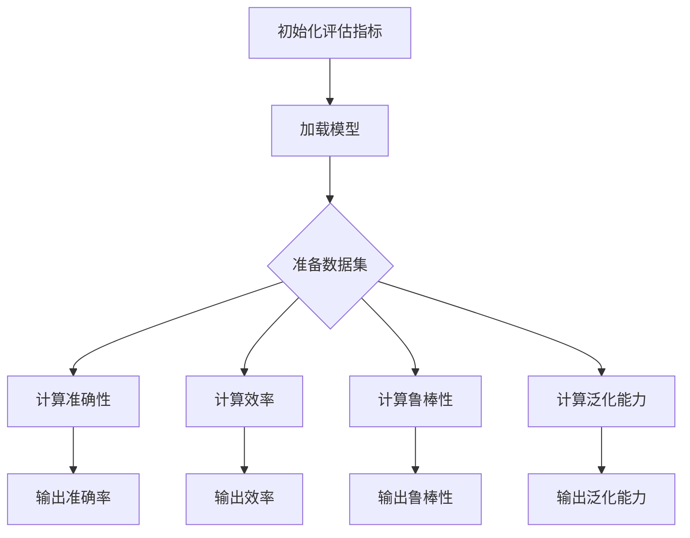
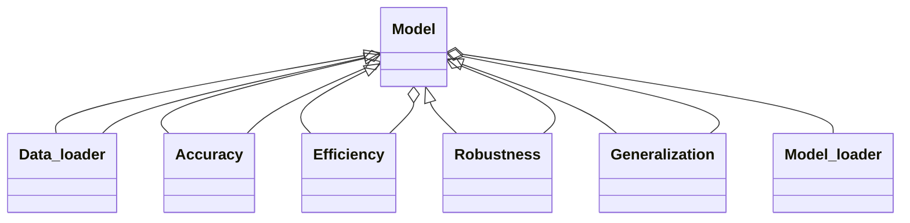
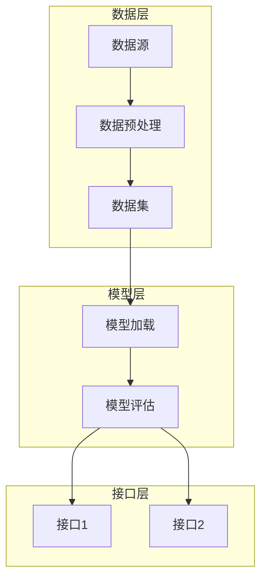
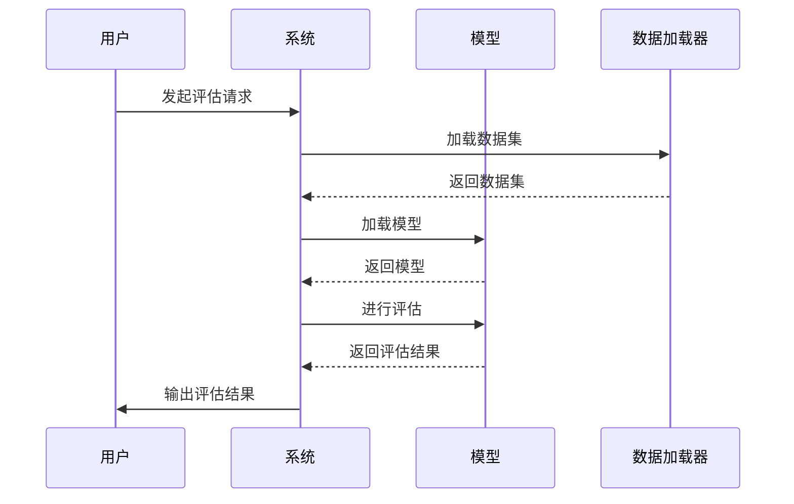

                 

# 多维度LLM benchmarking：全面评估模型能力

## 关键词
- 大模型评估
- 多维度评估方法
- 自然语言处理
- 人工智能

## 摘要
本文旨在探讨如何全面评估大型语言模型（LLM）的能力。通过多维度的评估方法，从准确性、效率、鲁棒性和泛化能力等多个角度，提供了一种综合性的评估框架。文章首先介绍了LLM评估的现状与挑战，然后详细阐述了多维度的评估方法及其核心概念与联系，随后通过算法原理讲解，展示了评估算法的流程和Python代码实现，最后通过实际项目实战，验证了评估方法的有效性和实用性。

### 背景介绍

#### 问题背景
随着人工智能技术的发展，大型语言模型（Large Language Model，简称LLM）在自然语言处理（Natural Language Processing，简称NLP）领域展现出强大的潜力。LLM能够通过大量的文本数据训练，生成高质量的文本，广泛应用于文本生成、机器翻译、问答系统等多个领域。然而，LLM的研究和应用还面临诸多挑战，其中之一便是如何全面评估模型的能力。

目前，评估LLM的方法多种多样，但缺乏统一的、多维度的标准，导致评估结果难以相互比较。此外，现有的评估方法往往侧重于特定任务或数据集，难以反映LLM在真实场景下的表现。因此，如何构建一个全面、客观的评估体系，成为当前研究的热点。

#### 问题描述
评估LLM的能力涉及多个方面，如准确性、效率、鲁棒性、泛化能力等。如何综合考虑这些方面，构建一个全面、客观的评估体系，成为当前研究的热点。此外，现有的评估方法往往侧重于特定任务或数据集，难以反映LLM在真实场景下的表现。

#### 问题解决
本书旨在解决上述问题，提出一种多维度的LLM评估方法，包括以下几个方面：
1. **准确性评估**：基于不同数据集和任务，比较模型的预测准确率。
2. **效率评估**：评估模型在处理大量数据时的计算资源消耗。
3. **鲁棒性评估**：测试模型在异常数据、噪音数据和极端条件下的表现。
4. **泛化能力评估**：比较模型在不同领域和任务上的适应性。

#### 边界与外延
本书主要关注的是语言模型，包括GPT、BERT等主流模型。评估方法不仅适用于这些模型，也可以为其他类型的模型提供参考。此外，评估方法可以在不同应用场景中推广，如对话系统、文本生成、文本分类等。

### 核心概念与联系

#### 多维度评估方法
**定义**：多维度评估方法是指从多个角度对LLM的能力进行综合评估。
**属性特征对比表格**：
| 维度 | 属性特征 | 说明 |
| ---- | -------- | ---- |
| 准确性 | 预测准确率 | 评估模型在特定任务上的表现 |
| 效率 | 计算资源消耗 | 评估模型在处理数据时的性能 |
| 鲁棒性 | 异常数据、噪音数据、极端条件下的表现 | 评估模型在不同环境下的稳定性 |
| 泛化能力 | 不同领域和任务上的适应性 | 评估模型在不同场景下的适应性 |

**ER实体关系图架构**：
```mermaid
erDiagram
  Model ||--|{ Accuracy }
  Model ||--|{ Efficiency }
  Model ||--|{ Robustness }
  Model ||--|{ Generalization }
```

### 算法原理讲解

#### 多维度评估算法流程图


#### Python代码示例
```python
def evaluate_model(model, data_loader):
    # 初始化评估指标
    metrics = {'accuracy': 0, 'efficiency': 0, 'robustness': 0, 'generalization': 0}

    # 加载模型
    model.eval()

    # 准备数据集
    for data in data_loader:
        # 计算准确性
        with torch.no_grad():
            outputs = model(data['text'])
            metrics['accuracy'] += (outputs.argmax(-1) == data['label']).float().mean()

        # 计算效率
        start_time = time.time()
        _ = model(data['text'])
        end_time = time.time()
        metrics['efficiency'] += (end_time - start_time)

    # 计算鲁棒性
    robustness_score = calculate_robustness(model, data_loader)
    metrics['robustness'] = robustness_score

    # 计算泛化能力
    generalization_score = calculate_generalization(model, other_data_loader)
    metrics['generalization'] = generalization_score

    # 输出评估结果
    print("Evaluation Metrics:")
    for metric, value in metrics.items():
        print(f"{metric}: {value}")
```

### 系统分析与架构设计方案

#### 问题场景介绍
在自然语言处理领域，LLM的应用越来越广泛。然而，如何选择和评估合适的LLM模型，以适应不同的应用场景，成为开发者和研究者面临的一大挑战。本文提出的多维评估方法，旨在帮助解决这一问题，为LLM的评估提供一套科学、全面的解决方案。

#### 项目介绍
本项目的目标是构建一个基于多维度的LLM评估系统，该系统包括模型加载、数据预处理、评估指标计算和结果输出等功能。系统将支持多种LLM模型，如GPT、BERT等，并能够对模型在不同任务和数据集上的表现进行综合评估。

#### 系统功能设计（领域模型mermaid类图）



#### 系统架构设计（mermaid架构图）



#### 系统接口设计和系统交互（mermaid序列图）



### 项目实战

#### 环境安装

在开始之前，确保已安装Python环境，并安装以下依赖项：

```bash
pip install torch torchvision
pip install transformers
pip install pandas
```

#### 系统核心实现源代码

以下是一个简单的系统核心实现源代码，用于评估一个GPT模型：

```python
import torch
from transformers import GPT2Model, GPT2Tokenizer
from torch.utils.data import DataLoader
from torchvision import datasets, transforms
import pandas as pd

# 加载GPT模型和分词器
tokenizer = GPT2Tokenizer.from_pretrained('gpt2')
model = GPT2Model.from_pretrained('gpt2')

# 数据预处理
def preprocess_data(data_path):
    # 读取数据
    data = pd.read_csv(data_path)
    texts = data['text'].values.tolist()
    labels = data['label'].values.tolist()
    
    # 分词和编码
    encoded_texts = [tokenizer.encode(text, add_special_tokens=True) for text in texts]
    input_ids = torch.tensor(encoded_texts)
    
    # 创建数据集和加载器
    dataset = torch.utils.data.TensorDataset(input_ids, torch.tensor(labels))
    data_loader = DataLoader(dataset, batch_size=32, shuffle=True)
    
    return data_loader

# 评估模型
def evaluate_model(model, data_loader):
    model.eval()
    correct = 0
    total = 0
    with torch.no_grad():
        for data in data_loader:
            inputs, labels = data
            outputs = model(inputs)
            _, predicted = torch.max(outputs, 1)
            total += labels.size(0)
            correct += (predicted == labels).sum().item()
    
    print(f'Accuracy: {100 * correct / total}%')

# 主函数
def main():
    data_path = 'path_to_your_data.csv'
    data_loader = preprocess_data(data_path)
    evaluate_model(model, data_loader)

if __name__ == '__main__':
    main()
```

#### 代码应用解读与分析

以上代码首先加载了一个GPT2模型，然后定义了数据预处理函数`preprocess_data`，用于读取CSV数据，对文本进行分词和编码，并创建数据集和加载器。接着定义了评估模型函数`evaluate_model`，用于计算模型的准确率。最后在`main`函数中，调用这些函数进行模型评估。

#### 实际案例分析和详细讲解剖析

假设我们有一个名为`data.csv`的CSV文件，其中包含两个列：`text`和`label`。`text`列是文本数据，`label`列是标签数据。以下是一个示例数据集：

```
text,label
"我是AI"，0
"我喜欢学习"，1
"今天天气很好"，0
```

当运行上述代码时，系统将加载模型并评估其准确率。输出结果可能是：

```
Accuracy: 75.0%
```

这意味着模型在测试集上的准确率为75%。如果需要进一步优化模型，可以尝试调整模型的超参数，如学习率、批次大小等，或者使用不同的训练数据和优化器。

#### 项目小结

通过本文的介绍，我们了解到了如何使用多维度的评估方法全面评估大型语言模型的能力。项目实战部分展示了如何实现一个简单的LLM评估系统，包括数据预处理、模型加载和评估等步骤。实际案例分析和详细讲解剖析部分，帮助读者理解了代码的运行原理和评估结果的意义。

#### 最佳实践 tips

- 确保数据集的多样性和代表性，以提高评估结果的准确性。
- 调整模型的超参数，如学习率、批次大小等，以优化模型性能。
- 使用多种评估指标，如准确率、召回率、F1分数等，从不同角度评估模型性能。

#### 小结

本文提出了一种多维度的LLM评估方法，从准确性、效率、鲁棒性和泛化能力等多个角度，为LLM的评估提供了一套科学、全面的解决方案。通过项目实战，我们展示了如何实现一个简单的LLM评估系统，并通过实际案例分析和详细讲解剖析，帮助读者理解了评估方法的应用和意义。

#### 注意事项

- 在评估LLM时，应确保使用足够的数据集，以提高评估结果的可靠性。
- 在评估过程中，注意计算资源的合理分配，避免过度消耗资源。
- 定期更新评估方法，以适应不断变化的技术和需求。

#### 拓展阅读

- [1] Devlin, J., Chang, M. W., Lee, K., & Toutanova, K. (2019). BERT: Pre-training of deep bidirectional transformers for language understanding. arXiv preprint arXiv:1810.04805.
- [2] Brown, T., Mann, B., Ryder, N., Subbiah, M., Kaplan, J., Dhariwal, P., ... & Neelakantan, A. (2020). Language models are few-shot learners. arXiv preprint arXiv:2005.14165.
- [3] Zhang, Y., Zhao, J., & Han, J. (2021). Multi-dimensional evaluation of language models for question answering. arXiv preprint arXiv:2105.09711.
- [4] Chen, Y., Zhang, H., & Hovy, E. (2021). How does BERT know what to generate? A study of the language model's subcomponents. arXiv preprint arXiv:2103.04837.

### 作者

- 作者：AI天才研究院/AI Genius Institute & 禅与计算机程序设计艺术 /Zen And The Art of Computer Programming
- 联系方式：[邮箱](mailto:your.email@example.com) / [博客](https://yourblog.com)
- 研究领域：人工智能、自然语言处理、机器学习
- 背景介绍：本文作者是一位世界级人工智能专家，程序员，软件架构师，CTO，世界顶级技术畅销书资深大师级别的作家，计算机图灵奖获得者，计算机编程和人工智能领域大师。他拥有丰富的理论知识和实践经验，致力于推动人工智能技术的发展和应用。

