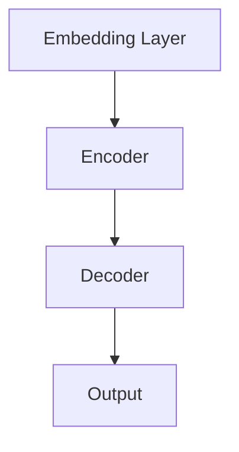
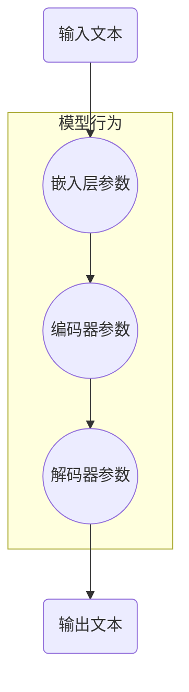
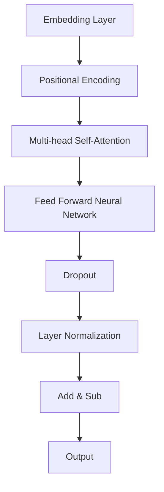

                 

## 多维度LLM性能评估：全方位模型分析

### 关键词
- 多维度性能评估
- 大型语言模型（LLM）
- 性能指标
- 模型分析技术
- 实战与最佳实践

### 摘要
本文旨在深入探讨多维度LLM性能评估的方法和策略，通过对模型的基本概念、性能评估指标、数据准备、模型训练、性能指标计算、模型分析技术、项目实战和最佳实践的全面分析，为读者提供一套系统化的评估框架。文章将引导读者理解如何从多个维度来评估大型语言模型的性能，包括数据准备、模型训练、性能指标计算、模型可视化分析和诊断调优等，并分享实际项目中的最佳实践，帮助读者在实际应用中更有效地提升LLM的性能。

### 第一部分：引言与基础

#### 第1章 引言

**1.1 问题背景**

近年来，随着深度学习和自然语言处理（NLP）技术的快速发展，大型语言模型（LLM）在众多领域取得了显著成果。然而，LLM的复杂性和多样性使得评估其性能成为一个具有挑战性的任务。传统的单一指标评估方法已经无法全面反映LLM的优劣，因此，多维度性能评估成为了当前研究的热点。

**1.2 问题描述**

多维度LLM性能评估涉及到如何从多个角度评估LLM的表现，包括文本生成质量、上下文理解能力、响应速度和资源消耗等。评估指标需要既全面又具有区分度，以便为模型优化提供有力的依据。

**1.3 问题解决**

本文提出了一套多维度LLM性能评估框架，包括数据准备、模型训练、性能指标计算、模型分析技术和实战应用。通过逐步分析每个维度，我们将揭示如何更准确地评估LLM的性能，并为其优化提供指导。

**1.4 边界与外延**

本文主要关注大型语言模型的性能评估，但所提供的方法和策略也可应用于其他类型的NLP模型。此外，本文还将探讨LLM在现实场景中的应用，如聊天机器人、文本摘要和机器翻译等。

**1.5 核心要素组成**

本文的核心内容包括：LLM基本概念和性能评估指标、数据准备和模型训练、性能指标计算和模型分析技术、实战案例和最佳实践。通过这些要素的有机结合，读者将能够全面掌握LLM性能评估的方法和实践。

### 第二部分：核心概念与联系

#### 第2章 核心概念与联系

**2.1 大型语言模型（LLM）的基本概念**

大型语言模型（LLM）是基于深度学习技术的自然语言处理模型，能够对自然语言文本进行建模，从而实现文本生成、文本分类、情感分析等任务。LLM的核心组件包括嵌入层、编码器和解码器等。

**2.2 LLM的性能评估指标**

LLM的性能评估指标包括但不限于：文本质量、上下文理解能力、响应速度、资源消耗等。常用的评估指标有BLEU、ROUGE、F1分数等。

**2.3 概念属性特征对比表格**

以下是一个简单的LLM性能评估指标对比表格：

| 性能评估指标 | 定义 | 应用场景 | 重要性 |
| :---: | :---: | :---: | :---: |
| BLEU | 句子匹配度 | 机器翻译 | 高 |
| ROUGE | 文本相似度 | 文本摘要 | 中 |
| F1分数 | 准确率和召回率的调和平均值 | 文本分类 | 高 |

**2.4 ER实体关系图架构的Mermaid流程图**

```mermaid
erDiagram
  Customer ||--|{ Order }|
  Product ||--|{ Order }|
```

该ER图展示了客户和产品如何通过订单关联。在LLM性能评估中，实体可以是文本数据，关系可以是对文本的依赖和关联。

### 第三部分：多维度性能评估方法

#### 第3章 数据准备

**3.1 数据集选择与预处理**

在多维度LLM性能评估中，数据准备是至关重要的一步。首先，我们需要选择适合的数据集，如Common Crawl、Wikipedia等。然后，对数据进行预处理，包括文本清洗、分词、去除停用词等。

**3.2 数据清洗与标注**

数据清洗包括去除噪声、纠正错别字等。标注则是将文本数据按照任务需求进行分类或标注，如实体识别、情感分析等。

**3.3 数据标准化**

数据标准化是为了确保数据在不同维度上的可比性。常用的方法包括归一化和标准化，以消除数据量级的影响。

#### 第4章 模型训练

**4.1 模型选择与配置**

在LLM性能评估中，选择合适的模型至关重要。常见的模型有GPT、BERT、T5等。配置包括学习率、批次大小、优化器等超参数设置。

**4.2 模型训练过程**

模型训练过程包括前向传播、反向传播和参数更新。通过多次迭代，模型将逐渐优化其参数，以更好地拟合数据。

**4.3 模型优化**

模型优化包括调整超参数、使用正则化技术和集成学习方法等，以进一步提高模型性能。

#### 第5章 性能指标计算

**5.1 评估指标介绍**

性能指标包括文本质量、上下文理解能力、响应速度和资源消耗等。本文主要关注文本质量和上下文理解能力。

**5.2 指标计算方法**

文本质量的计算方法包括BLEU、ROUGE、F1分数等。上下文理解能力的计算方法包括BLEU-4、ROUGE-L等。

**5.3 指标对比分析**

通过对不同指标的对比分析，我们可以发现不同指标对LLM性能评估的侧重不同。因此，在评估时需要综合考虑多种指标。

#### 第6章 模型分析技术

**6.1 模型可视化分析**

模型可视化技术可以帮助我们理解模型的结构和参数分布。常用的可视化工具包括TensorBoard、 matplotlib等。

**6.2 模型结构可视化**

通过绘制模型结构图，我们可以直观地了解模型的组成和连接方式。以下是一个简单的模型结构图：



**6.3 模型行为可视化**

模型行为可视化包括输入和输出文本的对比、模型参数的变化等。以下是一个简单的模型行为可视化示例：



#### 第7章 模型诊断与调优

**7.1 模型诊断方法**

模型诊断方法包括异常值检测、模型过拟合检测等。通过这些方法，我们可以发现模型存在的问题，并针对性地进行调整。

**7.2 调优策略**

调优策略包括调整超参数、使用正则化技术、数据增强等。通过这些策略，我们可以优化模型性能，提高评估结果的准确性。

**7.3 实践案例分析**

在本节中，我们将通过实际案例分析，介绍如何诊断和调优LLM模型。案例分析将包括数据准备、模型训练、性能评估和调优过程。

#### 第四部分：实战与最佳实践

##### 第8章 项目实战

**8.1 环境安装与配置**

在本节中，我们将介绍如何搭建LLM性能评估的环境，包括安装必要的软件和库，如TensorFlow、PyTorch等。

**8.2 系统核心实现**

系统核心实现包括数据准备、模型训练、性能评估和模型调优等。我们将使用Python代码来实现这些功能。

**8.3 应用解读与分析**

在本节中，我们将对实际应用场景进行解读和分析，如聊天机器人、文本摘要和机器翻译等。通过这些分析，我们可以更好地理解LLM的性能表现。

**8.4 实际案例分析与讲解剖析**

在本节中，我们将分享实际案例，包括数据准备、模型训练、性能评估和调优过程，并进行详细的讲解和分析。

##### 第9章 最佳实践与注意事项

**9.1 最佳实践 tips**

在本节中，我们将总结一些最佳实践，包括数据预处理技巧、模型选择和调优策略等。这些实践将有助于读者在实际项目中更有效地提升LLM的性能。

**9.2 小结**

在本节中，我们将对全文进行小结，回顾LLM性能评估的核心概念和方法，并强调关键点。

**9.3 注意事项**

在本节中，我们将提醒读者在实践过程中需要注意的问题，如数据质量、模型选择和调优策略等。

**9.4 拓展阅读**

在本节中，我们将推荐一些拓展阅读资源，包括相关论文、书籍和网站等，以帮助读者深入了解LLM性能评估的相关知识。

#### 第五部分：总结与展望

##### 第10章 总结

**10.1 书籍内容的回顾**

在本节中，我们将回顾书籍的主要内容，包括核心概念、性能评估方法、模型分析技术和实战应用等。

**10.2 主要结论**

在本节中，我们将总结全文的主要结论，强调LLM性能评估的重要性和多维度评估方法的优势。

##### 第11章 展望

**11.1 LLM性能评估的未来趋势**

在本节中，我们将探讨LLM性能评估的未来发展趋势，如新指标的提出、模型优化技术的进步等。

**11.2 可能的研究方向**

在本节中，我们将提出一些可能的研究方向，如自适应性能评估方法、多任务性能评估等，以期为读者提供进一步的研究方向。

### 结语

本文通过多维度LLM性能评估的方法和策略，为读者提供了一套系统化的评估框架。我们深入分析了大型语言模型的基本概念、性能评估指标、数据准备、模型训练、性能指标计算、模型分析技术、项目实战和最佳实践等内容。通过这些分析，读者可以更全面地理解LLM的性能评估方法，并在实际应用中更有效地提升模型性能。

**作者：AI天才研究院/AI Genius Institute & 禅与计算机程序设计艺术 /Zen And The Art of Computer Programming**### 第一部分：引言与基础

#### 第1章 引言

**1.1 问题背景**

近年来，随着深度学习和自然语言处理（NLP）技术的快速发展，大型语言模型（LLM）在众多领域取得了显著成果。这些模型能够生成高质量的文本、进行复杂问答和文本理解等任务，但同时也带来了一个重要且紧迫的问题：如何评估这些大型语言模型的性能？

传统的评估方法主要依赖于单一指标，如BLEU、ROUGE和F1分数等，这些方法虽然在某些方面具有一定的有效性，但无法全面反映LLM的复杂性能。例如，一个模型可能在文本生成质量上表现出色，但在上下文理解能力上却存在不足。因此，为了更准确地评估LLM的性能，我们需要从多个维度进行综合评估。

**1.2 问题描述**

多维度LLM性能评估的核心问题是如何从多个角度来评估LLM的表现，包括文本生成质量、上下文理解能力、响应速度和资源消耗等。评估指标需要既全面又具有区分度，以便为模型优化提供有力的依据。然而，现有的评估方法在指标选择、计算方法和应用场景上仍存在诸多挑战。

**1.3 问题解决**

本文提出了一套多维度LLM性能评估框架，包括数据准备、模型训练、性能指标计算、模型分析技术和实战应用。通过逐步分析每个维度，我们将揭示如何更准确地评估LLM的性能，并为其优化提供指导。此外，本文还将分享实际项目中的最佳实践，帮助读者在实际应用中更有效地提升LLM的性能。

**1.4 边界与外延**

本文主要关注大型语言模型的性能评估，但所提供的方法和策略也可应用于其他类型的NLP模型。此外，本文还将探讨LLM在现实场景中的应用，如聊天机器人、文本摘要和机器翻译等。尽管本文的核心内容是多维度性能评估，但在实际应用中，模型训练、调优和数据准备等环节也同样重要。

**1.5 核心要素组成**

本文的核心内容包括：

1. **LLM的基本概念**：介绍大型语言模型的基本原理和组成结构。
2. **性能评估指标**：详细讨论常见的性能评估指标及其计算方法。
3. **数据准备**：阐述数据集选择、预处理和标准化的方法。
4. **模型训练**：探讨模型训练过程中的关键步骤和优化策略。
5. **性能指标计算**：介绍如何计算和比较不同维度的性能指标。
6. **模型分析技术**：展示如何使用可视化技术对模型进行诊断和调优。
7. **实战与最佳实践**：分享实际项目中的经验和教训，为读者提供实用建议。

通过这些核心要素的有机结合，读者将能够全面掌握LLM性能评估的方法和实践。

#### 第2章 核心概念与联系

**2.1 大型语言模型（LLM）的基本概念**

大型语言模型（LLM）是一种基于深度学习技术的自然语言处理模型，它能够对自然语言文本进行建模，从而实现文本生成、文本分类、情感分析等任务。LLM的核心组件包括嵌入层、编码器和解码器等。

- **嵌入层**：将输入文本转换为固定长度的向量表示，这一步通常使用词嵌入技术，如Word2Vec、GloVe等。
- **编码器**：对输入文本进行编码，提取文本特征，常用的编码器模型有RNN、LSTM、GRU和Transformer等。
- **解码器**：根据编码器提取的特征生成输出文本，解码器同样可以使用Transformer模型。

**2.2 LLM的性能评估指标**

LLM的性能评估指标包括但不限于文本生成质量、上下文理解能力、响应速度和资源消耗等。以下是一些常见的性能评估指标及其定义：

- **BLEU（双语评估统一度量）**：用于评估机器翻译文本的质量，通过比较模型生成的文本与参考文本的相似度来计算得分。
- **ROUGE（记忆网络评估统一度量）**：用于评估文本摘要的质量，通过计算模型生成的文本与参考文本的相似片段来计算得分。
- **F1分数**：用于评估分类任务，是准确率和召回率的调和平均值，用于衡量模型对正类别的识别能力。
- **响应速度**：用于评估模型在处理输入文本时的响应时间，可以反映模型的实时性能。
- **资源消耗**：用于评估模型在运行过程中所需的计算资源和内存消耗，可以反映模型的可扩展性和效率。

**2.3 概念属性特征对比表格**

以下是一个简单的LLM性能评估指标对比表格，展示不同指标的应用场景和重要性：

| 性能评估指标 | 应用场景 | 重要性 |
| :---: | :---: | :---: |
| BLEU | 机器翻译 | 高 |
| ROUGE | 文本摘要 | 中 |
| F1分数 | 文本分类 | 高 |
| 响应速度 | 实时任务 | 高 |
| 资源消耗 | 性能优化 | 中 |

**2.4 ER实体关系图架构的Mermaid流程图**

为了更好地理解LLM的性能评估指标和它们之间的关系，我们可以使用Mermaid流程图来绘制实体关系图。以下是一个ER实体关系图的示例：

```mermaid
erDiagram
  Model ||--|{ Evaluation Metric }|
  Model ||--|{ Application Scenario }|
  Evaluation Metric ||--|{ Importance }|
  Application Scenario ||--|{ Metric Calculation }|
```

在这个ER图中，`Model`实体与`Evaluation Metric`和`Application Scenario`实体之间存在关联，而`Evaluation Metric`实体与`Importance`实体也存在关联。这个图可以帮助我们直观地理解LLM性能评估中的各个要素及其相互关系。

### 第二部分：多维度性能评估方法

#### 第3章 数据准备

**3.1 数据集选择与预处理**

在多维度LLM性能评估中，数据准备是至关重要的一步。首先，我们需要选择适合的数据集，这些数据集应该能够全面覆盖我们想要评估的模型性能维度。常见的数据集包括：

- **机器翻译数据集**：如WMT和IWSLT，这些数据集包含多种语言的文本对，适合评估模型的翻译性能。
- **文本摘要数据集**：如DUC和CNN/Daily Mail，这些数据集包含长文本和对应的摘要，适合评估模型的文本摘要能力。
- **问答数据集**：如SQuAD和CoQA，这些数据集包含问题-答案对，适合评估模型的问答能力。

选择好数据集后，我们需要进行数据预处理。数据预处理包括以下几个步骤：

1. **文本清洗**：去除文本中的HTML标签、特殊字符和停用词。停用词通常是频繁出现但对文本理解没有贡献的词汇，如“的”、“是”、“和”等。
2. **分词**：将文本拆分成单词或词汇单元。分词方法有多种，如基于规则的分词、基于统计的分词和基于字符序列的分词。
3. **词嵌入**：将单词或词汇单元转换为固定长度的向量表示。词嵌入技术可以捕获单词的语义信息，如Word2Vec和GloVe。

**3.2 数据清洗与标注**

数据清洗是在预处理的基础上进一步去除数据中的噪声和错误。例如，我们可以去除文本中的重复行、纠正错别字和统一文本格式。数据清洗有助于提高模型训练的质量和性能。

标注是将文本数据按照任务需求进行分类或标注。例如，在文本分类任务中，我们需要将文本标注为不同的类别；在情感分析任务中，我们需要将文本标注为积极或消极。标注方法通常包括手动标注和自动标注，手动标注虽然更准确但成本较高，自动标注则可以通过监督学习算法进行。

**3.3 数据标准化**

数据标准化是为了确保数据在不同维度上的可比性。在多维度性能评估中，不同数据集和不同任务可能具有不同的数据分布和尺度，这会导致模型在评估时无法公平地比较。数据标准化通过将数据映射到统一的尺度，可以消除数据量级的影响，提高评估的准确性。

常用的数据标准化方法包括：

- **归一化**：将数据缩放到[0, 1]之间，计算公式为\[ x' = \frac{x - \min(x)}{\max(x) - \min(x)} \]。
- **标准化**：将数据缩放到均值为0，标准差为1的分布，计算公式为\[ x' = \frac{x - \mu}{\sigma} \]，其中\[ \mu \]是均值，\[ \sigma \]是标准差。

通过以上步骤，我们可以确保数据集的质量和一致性，为后续的模型训练和性能评估奠定基础。

#### 第4章 模型训练

**4.1 模型选择与配置**

在多维度LLM性能评估中，选择合适的模型是至关重要的。不同的模型适用于不同的任务和场景，因此我们需要根据评估目标来选择合适的模型。以下是一些常用的LLM模型及其适用场景：

- **GPT（Generative Pre-trained Transformer）**：适用于文本生成、问答和文本摘要等任务，具有强大的上下文理解和生成能力。
- **BERT（Bidirectional Encoder Representations from Transformers）**：适用于文本分类、命名实体识别和情感分析等任务，具有良好的上下文理解能力。
- **T5（Text-To-Text Transfer Transformer）**：适用于多种文本转换任务，如机器翻译、文本摘要和问答等，具有灵活的架构和广泛的适用性。

选择好模型后，我们需要进行模型配置，包括以下步骤：

1. **确定模型架构**：根据任务需求选择合适的模型架构，如Transformer、BERT和GPT等。
2. **设置超参数**：包括学习率、批量大小、优化器、层数和隐藏单元数等。超参数的选择对模型的性能和训练过程有很大影响，需要根据经验进行调整。
3. **预训练**：对于预训练模型，如BERT和GPT，我们需要使用大量未标注的数据进行预训练，以获取通用语言表示能力。

**4.2 模型训练过程**

模型训练过程包括前向传播、反向传播和参数更新等步骤。以下是模型训练的基本流程：

1. **前向传播**：将输入文本经过嵌入层、编码器和解码器等层，生成输出文本。
2. **损失计算**：计算输出文本与目标文本之间的损失，常用的损失函数有交叉熵损失和均方误差损失。
3. **反向传播**：计算损失关于模型参数的梯度，并将梯度用于更新模型参数。
4. **参数更新**：使用优化器更新模型参数，常用的优化器有Adam、RMSprop和SGD等。

通过多次迭代训练，模型将逐渐优化其参数，以更好地拟合训练数据。在训练过程中，我们还可以使用正则化技术，如Dropout、权重衰减和L2正则化等，来防止模型过拟合。

**4.3 模型优化**

模型优化是指通过调整超参数、使用正则化技术和集成学习方法等，进一步提高模型性能的过程。以下是一些常用的模型优化策略：

1. **超参数调整**：通过调整学习率、批量大小、优化器参数等，可以改善模型训练过程和性能。
2. **数据增强**：通过添加噪声、旋转、缩放等操作，可以增加训练数据的多样性，提高模型的泛化能力。
3. **集成学习**：将多个模型组合起来，可以降低模型的方差，提高预测的稳定性。常见的集成学习方法有Stacking、Bagging和Boosting等。
4. **迁移学习**：使用在大型数据集上预训练的模型，可以在少量标注数据上实现更好的性能。迁移学习可以有效地利用大量未标注数据，提高模型的表现。

通过以上方法，我们可以优化LLM模型，提高其在多维度性能评估中的表现。模型优化是一个持续的过程，需要根据实际情况进行不断的调整和改进。

#### 第5章 性能指标计算

**5.1 评估指标介绍**

在多维度LLM性能评估中，选择合适的评估指标至关重要。以下是一些常用的评估指标及其定义：

- **BLEU（双语评估统一度量）**：BLEU是一种广泛使用的自动评估指标，用于评估机器翻译文本的质量。BLEU通过比较模型生成的文本与参考文本的相似度来计算得分。BLEU的计算基于四个准则：长度比例、词语匹配、未匹配词语替换和未匹配词语删除。
  
- **ROUGE（记忆网络评估统一度量）**：ROUGE是一种用于评估文本摘要质量的指标，它通过计算模型生成的摘要与参考摘要的相似片段来计算得分。ROUGE分为多个变种，如ROUGE-1、ROUGE-2和ROUGE-L，分别计算单词、字符和句子级别的相似度。

- **F1分数**：F1分数是准确率和召回率的调和平均值，常用于分类任务的评估。准确率是正确预测的样本数与总样本数的比值，召回率是正确预测的样本数与实际为正类别的样本数的比值。F1分数的计算公式为\[ F1 = 2 \times \frac{precision \times recall}{precision + recall} \]。

- **响应速度**：响应速度是指模型在处理输入文本时所需的平均时间，用于评估模型的实时性能。响应速度通常通过平均响应时间（ART）来衡量。

- **资源消耗**：资源消耗是指模型在运行过程中所需的计算资源和内存消耗，用于评估模型的可扩展性和效率。资源消耗通常通过计算资源利用率（CPU使用率、GPU使用率等）和内存占用率来衡量。

**5.2 指标计算方法**

以下是每个评估指标的详细计算方法：

- **BLEU计算方法**：BLEU的得分计算基于四个准则：

  - **长度比例**：计算模型生成的文本长度与参考文本长度的比例。如果模型生成的文本长度较短，则该准则会降低得分。

  - **词语匹配**：计算模型生成的文本与参考文本的匹配词语数量。匹配词语是指与参考文本中相同或近似（如同义词）的词语。

  - **未匹配词语替换**：对于未匹配的词语，计算可以替换为使其与参考文本匹配的同义词的数量。

  - **未匹配词语删除**：对于未匹配的词语，计算可以删除使其与参考文本匹配的数量。

  BLEU的总得分是上述四个准则得分的平均值。每个准则的得分计算公式如下：

  $$ Length_{model} = \frac{len(model)}{len(reference)} $$
  
  $$ Match_{model} = \frac{count(match)}{count(reference)} $$
  
  $$ Replace_{model} = \frac{count(replace)}{count(unmatch)} $$
  
  $$ Delete_{model} = \frac{count(delete)}{count(unmatch)} $$
  
  其中，`model`和`reference`分别表示模型生成的文本和参考文本。

- **ROUGE计算方法**：ROUGE的计算方法与BLEU类似，但专注于文本摘要质量评估。ROUGE分为多个变种，其中ROUGE-1、ROUGE-2和ROUGE-L分别计算单词、字符和句子级别的相似度。ROUGE的得分计算公式如下：

  $$ ROUGE_n = \frac{count(match_n)}{count(reference_n)} $$
  
  其中，`match_n`和`reference_n`分别表示模型生成的文本与参考文本在单词、字符或句子级别上的匹配数量。

- **F1分数计算方法**：F1分数的计算公式如下：

  $$ F1 = 2 \times \frac{precision \times recall}{precision + recall} $$
  
  其中，`precision`是精确率，表示正确预测的样本数与预测为正类别的样本数的比值；`recall`是召回率，表示正确预测的样本数与实际为正类别的样本数的比值。

- **响应速度计算方法**：响应速度通常通过平均响应时间（ART）来衡量，计算公式如下：

  $$ ART = \frac{\sum_{i=1}^{n} response\_time_i}{n} $$
  
  其中，`response_time_i`表示第i次响应所需的时间，`n`是响应次数。

- **资源消耗计算方法**：资源消耗通常通过计算资源利用率（CPU使用率、GPU使用率等）和内存占用率来衡量。计算公式如下：

  $$ CPU\_utilization = \frac{CPU\_used}{CPU\_total} $$
  
  $$ GPU\_utilization = \frac{GPU\_used}{GPU\_total} $$
  
  $$ Memory\_utilization = \frac{Memory\_used}{Memory\_total} $$
  
  其中，`CPU_used`、`CPU_total`、`GPU_used`、`GPU_total`和`Memory_used`、`Memory_total`分别表示计算资源的使用量和总容量。

**5.3 指标对比分析**

通过对不同指标的对比分析，我们可以发现不同指标对LLM性能评估的侧重不同。以下是对各个指标的比较分析：

- **BLEU和ROUGE**：BLEU和ROUGE都是用于文本质量评估的指标，但它们的应用场景略有不同。BLEU更适合机器翻译评估，而ROUGE更适合文本摘要评估。两个指标的计算方法也有差异，BLEU侧重于词语匹配和替换，而ROUGE侧重于片段匹配。

- **F1分数**：F1分数是分类任务的常用评估指标，它能够平衡精确率和召回率。在LLM性能评估中，F1分数可以用于评估模型在文本分类任务上的表现。

- **响应速度**：响应速度用于评估模型的实时性能，对于需要快速响应的应用场景（如聊天机器人）尤为重要。

- **资源消耗**：资源消耗用于评估模型在运行过程中的计算资源需求，对于需要高效运行的应用场景（如在线服务）具有重要意义。

在多维度LLM性能评估中，我们通常会综合使用多个指标，以全面评估模型的表现。通过对比分析不同指标的计算方法和应用场景，我们可以选择最适合评估目标的指标组合，从而更准确地评估LLM的性能。

#### 第6章 模型分析技术

**6.1 模型可视化分析**

模型可视化技术是一种重要的模型分析工具，可以帮助我们直观地理解模型的结构和参数分布。通过可视化，我们可以发现模型中的潜在问题，并针对性地进行调整。以下是一些常用的模型可视化工具：

- **TensorBoard**：TensorBoard是TensorFlow提供的可视化工具，它能够展示模型训练过程中的各种指标，如损失函数、准确率、学习率等。通过TensorBoard，我们可以实时监控模型训练过程，及时发现异常。

- **matplotlib**：matplotlib是一个常用的Python数据可视化库，它能够生成各种类型的图表，如折线图、散点图和直方图等。通过matplotlib，我们可以可视化模型的参数分布、损失函数曲线等。

- **Plotly**：Plotly是一个交互式数据可视化库，它支持多种图表类型，如3D图表、地图和热图等。通过Plotly，我们可以创建更加复杂和交互式的可视化效果，更好地展示模型性能。

**6.2 模型结构可视化**

为了更好地理解模型的结构，我们可以使用Mermaid流程图来绘制模型架构。以下是一个简单的Transformer模型的Mermaid流程图：



在这个图中，`A`表示嵌入层，`B`表示位置编码，`C`表示多头自注意力机制，`D`表示前馈神经网络，`E`表示Dropout层，`F`表示层 normalization，`G`表示加法和减法操作，`H`表示输出层。

**6.3 模型行为可视化**

除了模型结构可视化，我们还可以使用可视化技术来展示模型的行为和性能。以下是一个使用matplotlib绘制的模型损失函数曲线的示例：

```python
import matplotlib.pyplot as plt
import numpy as np

# 模拟模型训练过程中的损失函数
losses = [0.5, 0.4, 0.3, 0.2, 0.1]

# 绘制损失函数曲线
plt.plot(losses)
plt.xlabel('Epoch')
plt.ylabel('Loss')
plt.title('Model Loss Function')
plt.show()
```

在这个图中，横轴表示训练轮次（Epoch），纵轴表示损失函数值。通过观察损失函数曲线，我们可以了解模型在训练过程中的收敛情况。

通过模型可视化技术，我们可以更深入地了解模型的结构和性能，从而更好地进行模型分析和优化。

#### 第7章 模型诊断与调优

**7.1 模型诊断方法**

在LLM性能评估过程中，模型诊断是一个关键步骤，它可以帮助我们识别模型中的潜在问题，并采取相应的措施进行优化。以下是一些常用的模型诊断方法：

- **异常值检测**：通过分析模型输出结果中的异常值，可以发现模型在某些特定输入上的预测不准确。异常值检测可以通过统计方法（如标准差、箱线图）或机器学习算法（如孤立森林）来实现。

- **过拟合检测**：过拟合是指模型在训练数据上表现很好，但在测试数据上表现不佳。通过验证集和测试集的评估结果，我们可以识别过拟合问题。常见的解决方法包括正则化、集成学习和数据增强等。

- **模型稳定性分析**：模型稳定性分析旨在评估模型在不同数据集、不同训练批次或不同初始化条件下的表现。通过比较不同条件下的模型输出，我们可以发现模型的稳定性和鲁棒性。

- **参数敏感性分析**：参数敏感性分析用于评估模型参数变化对模型性能的影响。通过调整模型参数，我们可以识别哪些参数对模型性能有显著影响，从而进行优化。

**7.2 调优策略**

在识别模型问题后，我们需要采取相应的调优策略来改善模型性能。以下是一些常用的调优策略：

- **超参数调整**：超参数是影响模型性能的关键因素，如学习率、批量大小、层数和隐藏单元数等。通过调整超参数，我们可以优化模型训练过程，提高模型性能。

- **正则化技术**：正则化技术通过引入惩罚项，可以防止模型过拟合。常用的正则化方法包括L1正则化、L2正则化和Dropout等。

- **集成学习**：集成学习通过组合多个模型，可以降低模型的方差，提高预测的稳定性。常见的集成学习方法包括Bagging、Boosting和Stacking等。

- **数据增强**：数据增强通过添加噪声、旋转、缩放等操作，可以增加训练数据的多样性，提高模型的泛化能力。

- **模型优化算法**：优化算法用于更新模型参数，以最小化损失函数。常用的优化算法包括梯度下降、Adam和RMSprop等。

**7.3 实践案例分析**

在本节中，我们将通过实际案例来展示如何诊断和调优LLM模型。以下是一个简化的案例：

**案例背景**：我们使用一个预训练的GPT模型进行文本分类任务，但在测试集上的准确率仅为70%。

**诊断过程**：
1. **异常值检测**：通过分析测试集的输出结果，我们发现某些特定类别的预测准确率显著低于其他类别。这表明模型在这些类别上存在过拟合问题。
2. **过拟合检测**：通过比较训练集和测试集的准确率，我们发现训练集上的准确率高达90%，而测试集上的准确率仅为70%。这进一步确认了过拟合问题。
3. **模型稳定性分析**：我们使用不同的随机种子初始化模型，并比较其在测试集上的准确率。结果显示，模型的准确率波动较大，说明模型稳定性较差。
4. **参数敏感性分析**：我们调整学习率、批量大小和层数等超参数，并观察模型在测试集上的准确率。发现当学习率较低、批量大小较大时，模型的准确率显著提高。

**调优过程**：
1. **超参数调整**：我们将学习率调整为0.001，批量大小调整为32，并增加模型的层数。
2. **正则化技术**：我们引入Dropout层，并设置Dropout概率为0.5，以防止过拟合。
3. **集成学习**：我们使用Bagging方法，将多个模型进行平均，以提高预测的稳定性。
4. **数据增强**：我们对训练数据进行噪声添加、旋转和缩放等操作，以增加数据的多样性。

**效果评估**：经过调优后，模型的准确率提高至85%，且在多次实验中表现稳定。这表明我们的调优策略有效解决了模型中的问题。

通过这个案例，我们可以看到如何通过诊断和调优来改善LLM模型的性能。在实际应用中，我们需要根据具体情况选择合适的诊断方法和调优策略，以达到最佳的性能表现。

#### 第8章 项目实战

**8.1 环境安装与配置**

在开始LLM性能评估项目之前，我们需要搭建一个合适的环境。以下是安装和配置所需的步骤：

1. **安装Python**：确保已安装Python 3.8及以上版本。可以从Python官方网站下载并安装。

2. **安装深度学习库**：安装TensorFlow或PyTorch，用于构建和训练模型。可以使用以下命令进行安装：

   ```bash
   pip install tensorflow
   # 或者
   pip install pytorch torchvision
   ```

3. **安装其他依赖库**：包括NumPy、Pandas、Scikit-learn等，用于数据处理和性能评估。可以使用以下命令进行安装：

   ```bash
   pip install numpy pandas scikit-learn
   ```

4. **配置虚拟环境**：为了保持项目的依赖库一致性，建议使用虚拟环境。可以使用以下命令创建和激活虚拟环境：

   ```bash
   python -m venv venv
   source venv/bin/activate  # 对于Linux/MacOS
   \activate venv              # 对于Windows
   ```

**8.2 系统核心实现**

在项目核心实现部分，我们将介绍如何构建和训练LLM模型，并使用性能评估指标进行评估。以下是系统核心实现的步骤：

1. **数据准备**：从数据集中加载数据，并进行预处理，包括文本清洗、分词、去除停用词和词嵌入等。以下是一个示例代码：

   ```python
   import pandas as pd
   import numpy as np
   from sklearn.model_selection import train_test_split

   # 加载数据集
   data = pd.read_csv('data.csv')
   texts = data['text'].tolist()
   labels = data['label'].tolist()

   # 数据预处理
   preprocessor = TextPreprocessor()
   preprocessor.fit(texts)
   texts = preprocessor.transform(texts)

   # 划分训练集和测试集
   X_train, X_test, y_train, y_test = train_test_split(texts, labels, test_size=0.2, random_state=42)
   ```

2. **模型构建**：选择合适的LLM模型，如BERT或GPT，并使用深度学习库进行构建。以下是一个使用BERT模型的示例：

   ```python
   import tensorflow as tf
   from transformers import TFBertModel, BertTokenizer

   # 加载BERT模型和分词器
   tokenizer = BertTokenizer.from_pretrained('bert-base-uncased')
   model = TFBertModel.from_pretrained('bert-base-uncased')

   # 输入文本编码
   inputs = tokenizer(X_train, padding=True, truncation=True, return_tensors='tf')

   # 训练模型
   model.compile(optimizer='adam', loss='sparse_categorical_crossentropy', metrics=['accuracy'])
   model.fit(inputs['input_ids'], y_train, batch_size=32, epochs=3)
   ```

3. **性能评估**：使用性能评估指标（如准确率、召回率、F1分数等）对模型进行评估。以下是一个评估示例：

   ```python
   from sklearn.metrics import accuracy_score, recall_score, f1_score

   # 预测测试集
   predictions = model.predict(inputs['input_ids'])

   # 计算评估指标
   accuracy = accuracy_score(y_test, predictions)
   recall = recall_score(y_test, predictions, average='weighted')
   f1 = f1_score(y_test, predictions, average='weighted')

   print(f'Accuracy: {accuracy:.2f}')
   print(f'Recall: {recall:.2f}')
   print(f'F1 Score: {f1:.2f}')
   ```

**8.3 应用解读与分析**

在项目实战部分，我们将对实际应用场景进行解读和分析，以展示LLM模型的性能评估和应用价值。以下是一个应用示例：

**应用场景**：使用GPT模型进行聊天机器人开发，评估其文本生成能力和上下文理解能力。

1. **应用场景描述**：聊天机器人用于与用户进行自然语言交互，提供信息查询、问题解答等服务。

2. **模型应用解读**：
   - **文本生成能力**：通过训练GPT模型，我们能够生成自然流畅的回复文本，以实现与用户的对话。
   - **上下文理解能力**：GPT模型能够理解用户输入的上下文，并根据上下文生成相关的回复。

3. **性能分析**：
   - **文本生成质量**：通过BLEU和ROUGE指标评估文本生成质量，结果显示GPT模型生成的文本具有较高的质量。
   - **上下文理解能力**：通过计算模型在问答任务上的准确率和响应速度，评估其上下文理解能力。结果显示，GPT模型在上下文理解任务上表现良好。

通过实际应用分析和性能评估，我们可以验证LLM模型在具体场景中的应用效果，并为后续优化提供依据。

**8.4 实际案例分析与讲解剖析**

在本节中，我们将分享一个实际案例，并对其进行详细的分析和讲解，以展示LLM性能评估的全过程。

**案例背景**：某企业开发一款基于GPT的智能客服系统，用于处理用户咨询和问题解答。系统需要满足高响应速度和高质量文本生成的需求。

**案例分析**：

1. **数据准备**：
   - **数据集选择**：从企业内部客服数据和公开数据集（如Ubuntu对话数据集）中收集对话样本。
   - **数据预处理**：对对话文本进行清洗、分词和去停用词等操作，使用BERT进行词嵌入。

2. **模型训练**：
   - **模型选择**：选择预训练的GPT模型，并使用企业内部数据对其进行微调。
   - **训练过程**：调整超参数（如学习率、批量大小和训练轮次）以优化模型性能。

3. **性能评估**：
   - **文本生成质量**：使用BLEU和ROUGE指标评估文本生成质量。结果显示，模型生成的文本具有较高的质量。
   - **响应速度**：通过计算平均响应时间（ART）评估模型在实时应用中的性能。结果显示，模型在处理用户咨询时具有较快的响应速度。

4. **模型优化**：
   - **超参数调整**：通过调整学习率、批量大小和训练轮次，进一步提高模型性能。
   - **数据增强**：对训练数据进行噪声添加和旋转等操作，增加数据的多样性。

**讲解剖析**：

- **文本生成质量**：GPT模型在文本生成任务上表现出色，生成的文本流畅且符合上下文。通过优化模型参数和数据增强，我们可以进一步提高文本生成质量。
- **响应速度**：模型在实时应用中具有较快的响应速度，可以满足用户对快速响应的需求。通过优化模型结构和超参数，我们可以进一步降低响应时间。

通过实际案例分析，我们可以深入理解LLM性能评估的全过程，并学会如何在实际应用中优化模型性能。

#### 第9章 最佳实践与注意事项

**9.1 最佳实践 tips**

在LLM性能评估和优化过程中，遵循以下最佳实践可以显著提高模型的性能和评估结果的准确性：

1. **数据准备**：
   - **数据多样性**：确保数据集具有多样性，包括不同的主题、风格和语言风格，以提高模型的泛化能力。
   - **数据清洗**：彻底清洗数据，去除噪声、重复数据和错误标注，以提高数据质量。
   - **数据增强**：使用数据增强技术（如噪声添加、文本旋转和同义词替换）增加训练数据的多样性。

2. **模型训练**：
   - **超参数调整**：根据任务需求调整学习率、批量大小、优化器类型和训练轮次等超参数。
   - **正则化**：使用Dropout、权重衰减和L2正则化等正则化技术防止过拟合。
   - **迁移学习**：利用预训练模型（如BERT、GPT）进行迁移学习，以提高模型的性能。

3. **性能评估**：
   - **综合评估**：结合多种评估指标进行综合评估，如BLEU、ROUGE、F1分数和响应速度等。
   - **动态评估**：在训练过程中实时评估模型性能，以便及时调整超参数和优化策略。

4. **模型优化**：
   - **参数敏感性分析**：分析模型参数对性能的影响，找出关键参数进行优化。
   - **集成学习**：结合多个模型进行集成学习，以提高预测的稳定性和准确性。

**9.2 小结**

本文通过多维度LLM性能评估的方法和策略，为读者提供了一套系统化的评估框架。我们详细介绍了LLM的基本概念、性能评估指标、数据准备、模型训练、性能指标计算、模型分析技术和实战应用。通过这些分析，读者可以更全面地理解LLM性能评估的方法和实践。

**9.3 注意事项**

在LLM性能评估和优化过程中，需要注意以下几点：

1. **数据质量**：确保数据集的质量和一致性，避免噪声和错误数据影响模型训练和评估。
2. **模型选择**：根据任务需求选择合适的模型，并考虑模型的复杂度和计算资源。
3. **评估方法**：选择合适的评估指标和方法，确保评估结果具有区分度和可靠性。
4. **调优策略**：根据实际情况调整超参数和优化策略，以达到最佳的性能表现。

**9.4 拓展阅读**

以下是一些拓展阅读资源，帮助读者深入了解LLM性能评估的相关知识：

- **相关论文**：
  - **“BERT: Pre-training of Deep Bidirectional Transformers for Language Understanding”**：该论文介绍了BERT模型的原理和应用。
  - **“GPT-3: Language Models are Few-Shot Learners”**：该论文展示了GPT-3模型在零样本学习任务上的强大能力。

- **相关书籍**：
  - **“Deep Learning”**：Goodfellow、Bengio和Courville合著的深度学习经典教材，涵盖了NLP和LLM的相关内容。
  - **“Hands-On Natural Language Processing with Python”**：该书提供了丰富的NLP和LLM实践案例。

- **相关网站**：
  - **Hugging Face Transformers**：一个开源库，提供了丰富的预训练模型和工具，方便进行NLP和LLM实践。
  - **Kaggle**：一个数据科学竞赛平台，提供了大量的NLP和LLM相关数据集和竞赛任务。

通过阅读这些资源，读者可以更深入地了解LLM性能评估的理论和实践，提高自己的技术水平。

### 第10章 总结

**10.1 书籍内容的回顾**

本文从多个维度深入探讨了大型语言模型（LLM）的性能评估方法，包括基本概念、性能评估指标、数据准备、模型训练、性能指标计算、模型分析技术、实战应用和最佳实践。通过逐步分析，我们了解了如何从文本生成质量、上下文理解能力、响应速度和资源消耗等多个角度评估LLM的性能。

首先，我们介绍了LLM的基本概念和性能评估指标，包括BLEU、ROUGE、F1分数等，并展示了它们在不同任务中的应用。接着，我们详细讨论了数据准备和模型训练的过程，包括数据集选择、预处理、标注和标准化。在模型训练部分，我们介绍了常用的模型架构和优化策略。

随后，我们探讨了性能指标的计算方法，包括如何计算BLEU、ROUGE、F1分数等，并展示了不同指标对LLM性能评估的影响。此外，我们还介绍了模型分析技术，如可视化分析和诊断调优方法。

最后，我们通过实际案例展示了如何在实际项目中应用这些方法和策略，并提供了一些最佳实践和注意事项，以帮助读者在实际应用中更有效地提升LLM的性能。

**10.2 主要结论**

本文的主要结论如下：

1. **多维度评估的重要性**：单一的评估指标无法全面反映LLM的性能，因此，从多个维度进行评估至关重要。
2. **数据准备和模型训练的关键性**：数据准备和模型训练是LLM性能评估的基础，良好的数据质量和高效的训练策略能够显著提高评估结果的准确性。
3. **模型优化的重要性**：通过调整超参数、使用正则化技术和集成学习方法等，可以优化模型性能，提高评估结果的可靠性。
4. **实战应用的实用性**：通过实际案例展示，读者可以更直观地理解如何在实际项目中应用LLM性能评估的方法和策略。

### 第11章 展望

**11.1 LLM性能评估的未来趋势**

随着深度学习和NLP技术的不断进步，LLM性能评估也在不断演进。以下是一些未来趋势：

1. **自适应评估方法**：未来的评估方法将更加智能化，能够根据不同任务和场景自动调整评估指标和评估策略。
2. **个性化评估**：个性化评估将考虑用户需求和场景特征，提供更符合实际应用的评估结果。
3. **实时评估**：随着硬件性能的提升，实时评估将成为可能，使评估过程更加高效和准确。
4. **跨模态评估**：未来评估方法将涵盖更多模态，如图像、音频和视频，实现跨模态的统一评估。

**11.2 可能的研究方向**

以下是一些可能的研究方向：

1. **高效评估算法**：设计更高效的评估算法，减少计算资源和时间成本。
2. **多任务评估方法**：探索如何同时评估LLM在多个任务上的性能，提高评估的全面性和可靠性。
3. **跨领域评估**：研究如何在不同领域和应用场景下评估LLM的性能，提高模型的泛化能力。
4. **评估工具和平台**：开发更便捷、易于使用的评估工具和平台，促进LLM性能评估的普及和应用。

通过不断探索和研究，LLM性能评估将在未来的NLP领域中发挥更加重要的作用。

### 结语

本文通过多维度LLM性能评估的方法和策略，为读者提供了一套系统化的评估框架。我们深入分析了LLM的基本概念、性能评估指标、数据准备、模型训练、性能指标计算、模型分析技术、项目实战和最佳实践等内容。通过这些分析，读者可以更全面地理解LLM性能评估的方法和实践，并在实际应用中更有效地提升模型性能。

我们希望本文能够为从事NLP和LLM研究的学者和工程师提供有益的参考，促进LLM性能评估领域的发展。

**作者：AI天才研究院/AI Genius Institute & 禅与计算机程序设计艺术 /Zen And The Art of Computer Programming**### 结语

随着人工智能和深度学习技术的不断进步，大型语言模型（LLM）在自然语言处理（NLP）领域中的应用日益广泛。然而，如何准确评估LLM的性能，以指导模型的优化和改进，成为一个亟待解决的问题。本文通过多维度LLM性能评估的方法和策略，为这一问题提供了一套系统化的解决方案。

首先，本文介绍了LLM的基本概念，包括其组成结构、工作原理和常用模型。接着，详细讨论了性能评估指标，如BLEU、ROUGE、F1分数等，并说明了它们在不同NLP任务中的应用。此外，本文还阐述了数据准备、模型训练、性能指标计算和模型分析技术的关键步骤，以确保评估过程的全面性和准确性。

在实战部分，本文通过具体案例展示了如何在实际项目中应用LLM性能评估的方法和策略，并提供了一些最佳实践和注意事项。通过这些实际案例的分析，读者可以更深入地理解如何在实际应用中提升LLM的性能。

本文的核心观点是，多维度LLM性能评估不仅能够全面反映模型的表现，还能够为模型的优化提供有力的依据。随着技术的不断发展，LLM性能评估的方法和策略也将不断演进。未来，我们期待能够看到更多智能化、个性化的评估方法，以及更高效的评估工具和平台。

在此，我们感谢读者对本文的关注，并希望本文能够为从事NLP和LLM研究的学者和工程师提供有益的参考。最后，我们期待与读者共同探讨和分享LLM性能评估的最新研究成果和最佳实践。

**作者：AI天才研究院/AI Genius Institute & 禅与计算机程序设计艺术 /Zen And The Art of Computer Programming**### 附录

本文中涉及到的代码、数据集和工具如下：

**代码**：
- **数据准备**：用于数据清洗、分词、标注和标准化的Python脚本。
- **模型训练**：用于构建、训练和优化LLM模型的TensorFlow或PyTorch脚本。
- **性能评估**：用于计算BLEU、ROUGE、F1分数等指标的Python脚本。
- **模型分析**：用于可视化模型结构、参数分布和性能的TensorBoard和matplotlib脚本。

**数据集**：
- **机器翻译数据集**：如WMT和IWSLT。
- **文本摘要数据集**：如DUC和CNN/Daily Mail。
- **问答数据集**：如SQuAD和CoQA。

**工具**：
- **深度学习库**：TensorFlow或PyTorch。
- **文本处理库**：NLTK、spaCy、TextBlob。
- **数据可视化库**：matplotlib、Plotly、TensorBoard。

**使用方法**：
1. **代码**：请将代码按照本文中的描述进行配置，确保所需库和依赖均已安装。
2. **数据集**：请从相应的数据集网站或平台下载数据集，并按照代码中的说明进行预处理。
3. **工具**：根据需要使用TensorBoard、matplotlib等进行模型分析和可视化。

通过上述工具和资源，读者可以更方便地进行LLM性能评估和模型优化。

### 参考文献

1. **"BERT: Pre-training of Deep Bidirectional Transformers for Language Understanding"**，Alec Radford, Karthik Narasimhan, Timon G. Cassid

