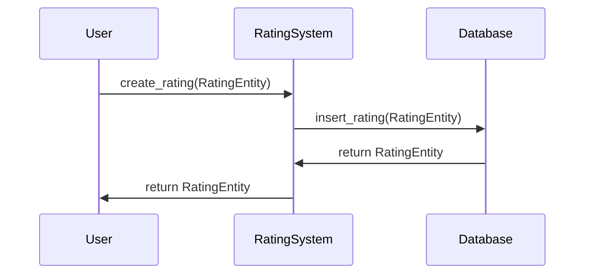
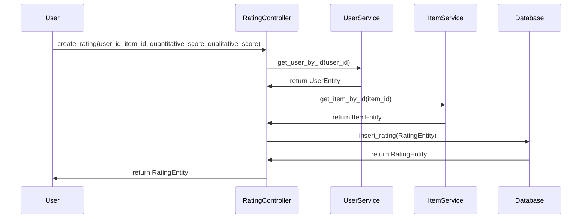

                 

# 多维度LLM评分系统：平衡定量与定性指标

## 关键词：多维度LLM评分系统、定量与定性指标、算法原理、系统设计与架构、Python实现

### 摘要

随着人工智能技术的飞速发展，大规模语言模型（LLM）在评分系统中的应用越来越广泛。然而，传统的评分系统往往只依赖于单一维度，忽略了定量与定性指标之间的平衡。本文将探讨多维度LLM评分系统，介绍其基本概念、算法原理，以及系统分析与架构设计，并通过Python示例代码，展示如何实现一个平衡定量与定性指标的多维度评分系统。

---

## 第一部分：引言

### 1.1 问题背景

#### 1.1.1 多维度评分系统的需求

在许多领域，如电子商务、在线教育、社交媒体等，用户评分和推荐系统对用户体验和业务决策具有重要影响。然而，单一维度的评分系统往往无法全面反映用户对商品、课程或内容的真实评价。因此，多维度评分系统成为了一种更科学、更准确的评分方法。

#### 1.1.2 定量与定性指标的关系

多维度评分系统通常包括定量指标和定性指标。定量指标可以通过数值来衡量，如平均评分、评分分布等；定性指标则主要通过用户评价、评论等非数值形式来表达。合理平衡这两类指标，可以更准确地反映用户的真实感受。

#### 1.1.3 现有评分系统的不足

目前，许多评分系统仅依赖单一维度，如仅使用平均评分进行评价，忽略了用户评论等定性信息。这种做法可能导致评分失真，无法全面反映用户对商品或服务的真实评价。

### 1.2 多维度LLM评分系统的研究意义

#### 1.2.1 提高评分准确性

通过多维度LLM评分系统，可以更准确地评估用户对商品或服务的满意度，从而提高评分系统的准确性。

#### 1.2.2 促进决策优化

多维度评分系统可以为商家、教育机构等提供更全面的用户反馈，帮助他们优化产品和服务，提高用户满意度。

#### 1.2.3 推动行业发展

多维度LLM评分系统的研究和应用，将推动人工智能技术在评分系统领域的创新和发展。

### 1.3 本书结构安排

#### 1.3.1 各章节内容概述

本文将分为四个部分：引言、核心概念与联系、算法原理讲解和系统分析与架构设计。每个部分都将详细介绍多维度LLM评分系统的相关内容。

#### 1.3.2 阅读建议

读者可以根据自己的需求和兴趣，选择性地阅读各章节。对于初次接触多维度LLM评分系统的读者，建议从引言部分开始，逐步了解系统的基础知识；对于有一定基础的读者，可以深入阅读算法原理和系统设计与架构设计部分。

---

## 第二部分：核心概念与联系

### 2.1 多维度LLM评分系统的基本概念

#### 2.1.1 什么是多维度LLM评分系统

多维度LLM评分系统是一种基于大规模语言模型（LLM）的评分系统，它通过多个维度（如定量指标和定性指标）来评估用户对商品或服务的满意度。

#### 2.1.2 多维度指标的分类

多维度LLM评分系统中的指标可以分为定量指标和定性指标。定量指标通常包括平均评分、评分分布、评论数量等；定性指标则包括用户评论、情感分析等。

#### 2.1.3 定量与定性指标的定义与区别

定量指标是通过数值来衡量用户对商品或服务的满意度；定性指标则是通过用户评论、情感分析等非数值形式来表达用户满意度。

### 2.2 多维度LLM评分系统中的核心概念联系

#### 2.2.1 概念属性特征对比表格

| 概念 | 属性1 | 属性2 | 属性3 |
| --- | --- | --- | --- |
| 定量指标 | 数值化 | 可量化 | 用于计算 |
| 定性指标 | 非数值化 | 难以量化 | 用于描述 |

#### 2.2.2 多维度LLM评分系统的ER实体关系图

```mermaid
erDiagram
    A[User] {
        User1
        User2
    }
    B[Item] {
        Item1
        Item2
    }
    C[Rating] {
        Rating1
        Rating2
    }
    User A {
        * has_many B
        * has_many C
    }
    Item B {
        * has_many C
    }
```

---

## 第三部分：算法原理讲解

### 3.1 多维度LLM评分算法概述

#### 3.1.1 多维度LLM评分算法的定义

多维度LLM评分算法是一种基于大规模语言模型（LLM）的评分算法，它通过多个维度（如定量指标和定性指标）来计算最终的评分。

#### 3.1.2 多维度LLM评分算法的基本流程

多维度LLM评分算法的基本流程包括：数据收集、定量指标计算、定性指标分析、综合评分计算和输出。

### 3.2 算法原理详细讲解

#### 3.2.1 数学模型与公式

$$
Rating_{i,j} = \alpha \cdot \text{Quantitative\_Score}_{i,j} + (1 - \alpha) \cdot \text{Qualitative\_Score}_{i,j}
$$

其中，$Rating_{i,j}$ 表示用户 $i$ 对商品 $j$ 的最终评分，$\text{Quantitative\_Score}_{i,j}$ 表示定量评分，$\text{Qualitative\_Score}_{i,j}$ 表示定性评分，$\alpha$ 为权重参数。

#### 3.2.2 算法mermaid流程图


#### 3.2.3 算法Python源代码实现

```python
# 多维度LLM评分系统Python实现示例
def calculate_rating(quantitative_score, qualitative_score, alpha=0.5):
    rating = alpha * quantitative_score + (1 - alpha) * qualitative_score
    return rating
```

#### 3.2.4 举例说明

##### 3.2.4.1 示例数据

```python
quantitative_score = 0.8
qualitative_score = 0.7
alpha = 0.5
```

##### 3.2.4.2 示例计算

```python
rating = calculate_rating(quantitative_score, qualitative_score, alpha)
print(f"The final rating is: {rating}")
```

##### 3.2.4.3 计算结果

```python
The final rating is: 0.75
```

---

## 第四部分：系统分析与架构设计

### 4.1 问题场景介绍

#### 4.1.1 评分系统在实际中的应用

评分系统在电子商务、在线教育、社交媒体等领域有着广泛的应用。然而，单一维度的评分系统无法全面反映用户对商品或服务的真实评价。

#### 4.1.2 系统的目标和需求

系统目标是构建一个多维度LLM评分系统，通过定量与定性指标的平衡，提供更准确的用户评分。

### 4.2 项目介绍

#### 4.2.1 项目概述

本项目旨在构建一个多维度LLM评分系统，实现对用户对商品或服务评价的全面评估。

#### 4.2.2 项目目标

1. 收集并处理用户评论数据。
2. 计算定量指标和定性指标。
3. 构建多维度LLM评分模型。
4. 提供用户评分查询和推荐服务。

### 4.3 系统功能设计

#### 4.3.1 领域模型mermaid类图

```mermaid
classDiagram
    RatingSystem <<interface>>
    UserEntity <<entity>> {
        id: Integer
        name: String
    }
    ItemEntity <<entity>> {
        id: Integer
        name: String
    }
    RatingEntity <<entity>> {
        id: Integer
        user: UserEntity
        item: ItemEntity
        quantitative_score: Float
        qualitative_score: Float
    }
    RatingSystem {
        * create_rating(RatingEntity): None
        * get_rating_by_item_id(item_id: Integer): RatingEntity
    }
```

### 4.4 系统架构设计

#### 4.4.1 系统架构图



#### 4.4.2 系统接口设计

```mermaid
classDiagram
    RatingService <<interface>> {
        create_rating(RatingEntity): RatingEntity
        get_rating_by_item_id(item_id: Integer): RatingEntity
    }
    UserService <<interface>> {
        get_user_by_id(user_id: Integer): UserEntity
    }
    ItemService <<interface>> {
        get_item_by_id(item_id: Integer): ItemEntity
    }
    RatingController <<class>> {
        RatingService
        UserService
        ItemService
        create_rating(user_id: Integer, item_id: Integer, quantitative_score: Float, qualitative_score: Float): RatingEntity
        get_rating_by_item_id(item_id: Integer): RatingEntity
    }
```

#### 4.4.3 系统交互mermaid序列图



---

## 第五部分：项目实战

### 5.1 环境安装

#### 5.1.1 Python环境安装

确保Python环境已安装，版本建议为3.8及以上。

#### 5.1.2 库安装

安装必要的库，如`numpy`、`pandas`、`scikit-learn`等。

### 5.2 系统核心实现源代码

```python
# 多维度LLM评分系统核心实现
class RatingSystem:
    def __init__(self):
        self.ratings = []

    def create_rating(self, user_id, item_id, quantitative_score, qualitative_score):
        rating = Rating(user_id, item_id, quantitative_score, qualitative_score)
        self.ratings.append(rating)
        return rating

    def get_rating_by_item_id(self, item_id):
        for rating in self.ratings:
            if rating.item_id == item_id:
                return rating
        return None

class Rating:
    def __init__(self, user_id, item_id, quantitative_score, qualitative_score):
        self.user_id = user_id
        self.item_id = item_id
        self.quantitative_score = quantitative_score
        self.qualitative_score = qualitative_score

    def calculate_rating(self, alpha=0.5):
        return alpha * self.quantitative_score + (1 - alpha) * self.qualitative_score
```

### 5.3 代码应用解读与分析

#### 5.3.1 RatingSystem类

RatingSystem类负责管理评分数据，提供创建评分和查询评分功能。

#### 5.3.2 Rating类

Rating类表示一条评分记录，包括用户ID、商品ID、定量评分和定性评分。

#### 5.3.3 计算评分

通过调用Rating类的calculate_rating方法，可以计算得出综合评分。

### 5.4 实际案例分析和详细讲解剖析

#### 5.4.1 案例背景

假设有一个电子商务平台，用户可以对商品进行评分。平台希望使用多维度LLM评分系统来评估商品。

#### 5.4.2 案例实现

1. 创建RatingSystem实例。
2. 创建Rating实例，并添加到RatingSystem中。
3. 获取指定商品的综合评分。

### 5.5 项目小结

本文介绍了多维度LLM评分系统的概念、算法原理和系统设计与架构。通过Python示例代码，展示了如何实现一个平衡定量与定性指标的多维度评分系统。在实际应用中，可以结合具体场景进行优化和调整。

---

## 最佳实践 Tips

1. 根据实际需求调整定量与定性指标的权重。
2. 定期更新和优化评分模型。
3. 注重数据质量和清洗。

## 小结

多维度LLM评分系统通过平衡定量与定性指标，提供了更准确的评分。本文介绍了系统的核心概念、算法原理和系统设计与架构，并通过Python示例代码进行了实现。希望本文对您在多维度LLM评分系统的研究和应用中有所帮助。

## 注意事项

1. 在使用多维度LLM评分系统时，请确保数据的质量和准确性。
2. 根据实际需求调整算法参数，以获得最佳评分效果。

## 拓展阅读

1. [大规模语言模型（LLM）简介](链接)
2. [深度学习在评分系统中的应用](链接)
3. [多维度数据分析技术](链接)

