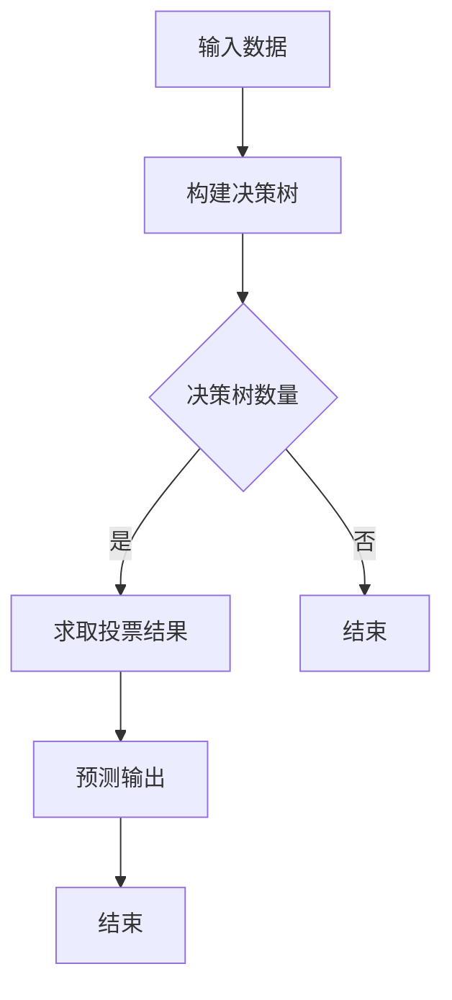
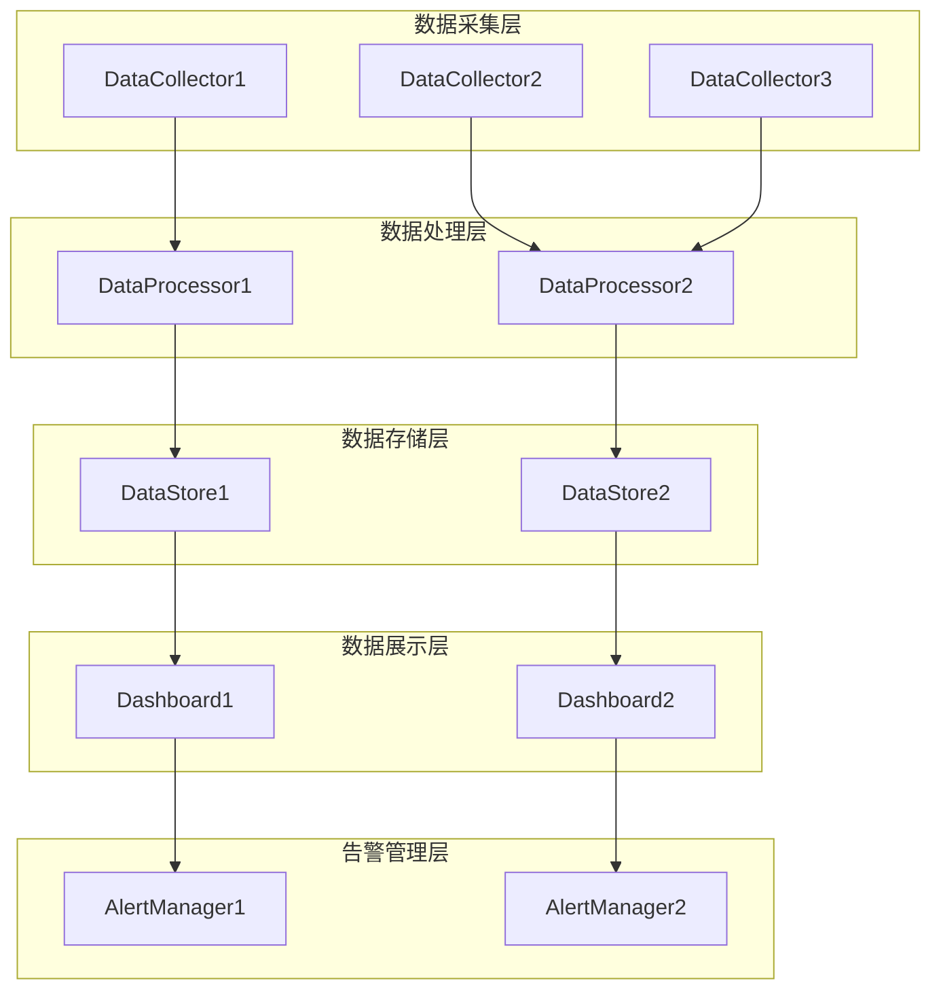
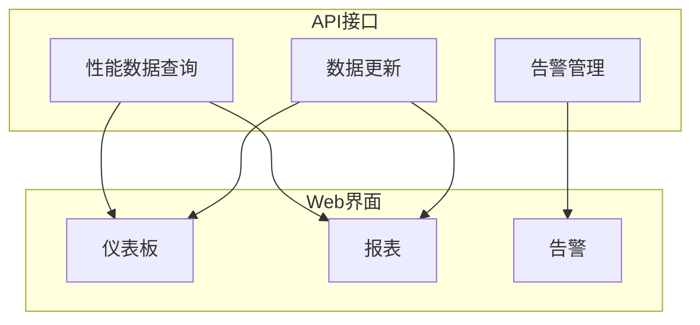
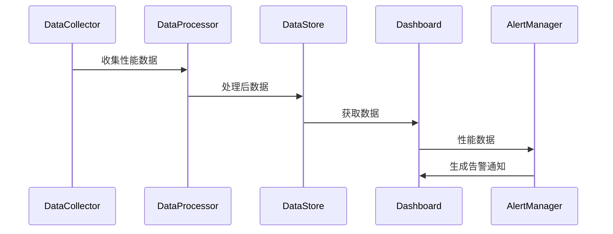

                 

## 引言

### 多维度性能可视化的背景与重要性

性能可视化是一种将系统的运行状态、资源使用情况、性能指标等以图形化的方式展示的技术，它可以帮助我们直观地理解系统行为，发现潜在的性能问题。在传统系统中，性能可视化主要是对单一维度的性能指标进行展示，如CPU利用率、内存占用率、网络延迟等。然而，随着现代计算机系统和应用的复杂性增加，单一维度的性能指标已经无法满足对系统全面评估的需求。因此，多维度性能可视化成为了一种新的趋势。

多维度性能可视化通过整合多个性能指标，为用户提供了一个全面的视图，帮助用户更好地理解系统的运行状态。它不仅包括传统的性能指标，如CPU利用率、内存占用率和磁盘I/O等，还包括响应时间、吞吐量、并发用户数等。通过这种多维度的综合展示，用户可以更全面地了解系统的性能表现，从而做出更准确的决策。

在现代计算机系统中，性能可视化的重要性不言而喻。首先，它能够帮助用户快速定位性能瓶颈，找到系统性能不佳的原因。其次，性能可视化可以作为系统调优的依据，帮助用户调整系统配置，优化系统性能。此外，性能可视化还可以用于监控系统的长期稳定性，预测系统负载的变化趋势，从而提前采取相应的措施。

### LLM在性能可视化中的应用

大型语言模型（LLM），如GPT-3、BERT等，是近年来人工智能领域的重要突破。LLM具有强大的文本生成和语义理解能力，能够在多个领域实现自动化的文本生成和语义分析。在性能可视化领域，LLM的应用同样具有重要意义。

首先，LLM可以用于自动生成性能报告。传统的性能报告通常需要专业人员根据大量的性能数据进行分析，然后撰写报告。而使用LLM，我们可以让计算机自动生成性能报告，这不仅提高了报告生成的效率，还减少了人工错误的可能性。LLM可以理解性能数据，并根据这些数据生成详细的报告，包括性能瓶颈分析、优化建议等。

其次，LLM还可以用于智能问答系统。在性能可视化系统中，用户可能会遇到各种性能问题，他们需要找到相应的解决方法。使用LLM，我们可以构建一个智能问答系统，用户只需输入问题，系统就可以自动回答，并提供详细的解决方案。这不仅提高了用户的工作效率，还大大降低了维护成本。

### 多维度性能可视化中的核心概念

在多维度性能可视化中，有几个核心概念需要理解：

1. **数据可视化**：数据可视化是将数据以图形化方式展示的技术。它可以帮助用户直观地理解数据，发现数据中的模式、趋势和异常。

2. **性能指标**：性能指标是衡量系统性能的重要参数。常见的性能指标包括响应时间、吞吐量、并发用户数、CPU利用率等。

3. **LLM基础**：LLM是指大型语言模型，具有强大的文本生成和语义理解能力。LLM的基础包括神经网络、深度学习、自然语言处理等。

这些核心概念相互关联，共同构成了多维度性能可视化的基础。在接下来的章节中，我们将进一步探讨这些概念，并详细介绍它们在性能可视化中的应用。

### ER实体关系图与概念联系

为了更好地理解多维度性能可视化中的核心概念，我们可以使用ER（实体关系）图来展示它们之间的关系。ER图是一种用于描述实体及其之间关系的图形化工具，它可以帮助我们清晰地理解系统中的各个组成部分及其相互作用。

在多维度性能可视化中，ER图可以包括以下几个主要的实体：

- **数据源**：指存储性能数据的数据库或数据存储系统。
- **性能指标**：包括响应时间、吞吐量、并发用户数等。
- **数据处理模块**：负责收集、处理和转换性能数据的模块。
- **数据可视化模块**：负责将处理后的性能数据以图形化方式展示的模块。
- **用户界面**：提供给用户进行交互的界面，用户可以通过用户界面查看性能数据。

这些实体之间的关系可以用ER图来表示。例如，数据源可以与数据处理模块关联，数据处理模块又可以与数据可视化模块关联。用户界面与数据可视化模块之间也存在关联，用户通过用户界面可以查看数据可视化模块生成的图表。

下面是一个简单的ER图示例，用于描述多维度性能可视化中的核心概念：

```mermaid
erDiagram
    数据源 ||--|{ 性能指标 }
    数据处理模块 ||--|{ 数据可视化模块 }
    数据可视化模块 ||--|{ 用户界面 }
```

在这个ER图中，实线表示实体之间的关联关系，而箭头表示数据流向。通过这个ER图，我们可以清晰地看到多维度性能可视化系统中的各个组成部分及其相互关系。

### 总结与展望

在本文中，我们介绍了多维度性能可视化的背景和重要性，并探讨了LLM在性能可视化中的应用。我们还定义了多维度性能可视化中的核心概念，并使用ER图展示了这些概念之间的联系。

接下来的章节中，我们将深入探讨算法原理、系统设计与实现、项目实战等具体内容，帮助读者全面了解多维度性能可视化的各个方面。希望通过本文，读者能够对多维度性能可视化有一个清晰的认识，并为后续的学习和应用打下坚实的基础。

### 算法原理讲解

#### 选择一种人工智能算法进行讲解

在本节中，我们将选择一种常见的人工智能算法——随机森林（Random Forest）算法，进行详细讲解。随机森林算法是一种基于决策树构建的集成学习方法，通过构建多个决策树并求取它们的投票结果来预测输出。它具有较好的性能和泛化能力，被广泛应用于各种分类和回归问题中。

#### Mermaid算法流程图

为了更直观地理解随机森林算法的流程，我们可以使用Mermaid绘制一个简化的算法流程图：



在这个流程图中，首先输入数据，然后构建多个决策树，接着求取这些决策树的投票结果，最后进行预测输出。

#### 算法原理详解

随机森林算法的核心原理是通过构建多棵决策树，并对它们的预测结果进行投票来提高模型的泛化能力。以下是随机森林算法的详细步骤：

1. **随机选择特征**：每次从特征集合中随机选择m个特征，其中m小于或等于特征总数。
2. **构建决策树**：使用选择的特征构建一棵决策树，每次递归分割数据集，直到满足停止条件（如最大深度、最小叶节点样本数等）。
3. **重复步骤1和2**：重复上述步骤k次，构建出k棵决策树，这k棵决策树构成了一个随机森林。
4. **求取投票结果**：对于新的数据样本，将它们分别输入到这k棵决策树中，记录每棵树对分类或回归结果的预测。
5. **预测输出**：统计所有决策树的预测结果，取多数票或平均值作为最终预测结果。

#### Python代码示例

以下是一个简单的随机森林算法的Python代码示例，用于说明如何实现随机森林的基本步骤：

```python
from sklearn.ensemble import RandomForestClassifier
from sklearn.datasets import load_iris
from sklearn.model_selection import train_test_split

# 加载数据集
iris = load_iris()
X = iris.data
y = iris.target

# 划分训练集和测试集
X_train, X_test, y_train, y_test = train_test_split(X, y, test_size=0.3, random_state=42)

# 创建随机森林分类器
clf = RandomForestClassifier(n_estimators=100, max_depth=None, random_state=42)

# 训练模型
clf.fit(X_train, y_train)

# 预测测试集
y_pred = clf.predict(X_test)

# 输出预测结果
print(y_pred)
```

#### LaTeX公式解释

为了更好地理解随机森林算法的数学原理，我们可以使用LaTeX公式进行解释。以下是随机森林算法中的一些关键公式：

$$
\text{Feature\_Importances} = \frac{\sum_{i=1}^{N} \sum_{j=1}^{m} w_{ij}^2}{\sum_{i=1}^{N} \sum_{j=1}^{m} w_{ij}^2 + \sum_{i=1}^{N} \sum_{j=1}^{m} \sigma_{ij}^2}
$$

其中，$w_{ij}$ 是第i棵决策树中特征j的权重，$\sigma_{ij}$ 是特征j的方差。这个公式用于计算每个特征的贡献度，即特征的重要性。

$$
\text{Random\_Forest}(x) = \text{Majority\_Vote}(\{f_1(x), f_2(x), ..., f_n(x)\})
$$

其中，$f_i(x)$ 是第i棵决策树对样本x的预测结果，$n$ 是决策树的数量。这个公式用于计算随机森林对样本x的最终预测结果。

#### 实际应用举例

为了更直观地展示随机森林算法的应用，我们可以通过一个实际案例来进行说明。假设我们要预测某个电商网站上的商品销量，特征包括价格、品牌、用户评价等。以下是具体的步骤：

1. **数据准备**：首先，我们需要准备一个包含商品销量和特征的数据集。数据集可以来自电商网站的销售记录。
2. **特征工程**：对数据进行预处理，包括缺失值填充、异常值处理、特征转换等。
3. **模型训练**：使用随机森林算法对数据集进行训练，构建随机森林模型。
4. **模型评估**：使用测试集对模型进行评估，计算模型的准确率、召回率、F1分数等指标。
5. **预测应用**：使用训练好的模型对新数据进行预测，预测未来某个商品的销售量。

通过这个案例，我们可以看到随机森林算法在性能可视化中的实际应用，它可以帮助电商网站优化产品推荐策略，提高销售业绩。

### 数学模型和公式详细讲解

随机森林算法的数学模型和公式是理解其工作原理的关键。以下是随机森林算法中的主要数学模型和公式：

#### 决策树构建

1. **ID3算法**：决策树构建通常采用ID3算法。ID3算法的核心是信息增益（Information Gain），用于选择当前节点划分的最佳特征。信息增益的计算公式如下：

   $$
   IG(D, A) = H(D) - \sum_{v_i} p(v_i) H(D_v)
   $$

   其中，$H(D)$ 是当前节点D的熵，$p(v_i)$ 是特征$A$的值$v_i$的概率，$H(D_v)$ 是条件熵，表示在给定特征$A$的值$v_i$后，节点$D_v$的熵。

2. **C4.5算法**：C4.5算法是ID3算法的改进，它使用增益率（Gain Ratio）来选择最佳特征。增益率的计算公式如下：

   $$
   GR(D, A) = \frac{IG(D, A)}{\text{Split Info}(A)}
   $$

   其中，$\text{Split Info}(A)$ 是特征$A$的分裂信息，计算公式如下：

   $$
   \text{Split Info}(A) = -\sum_{v_i} p(v_i) \log_2 p(v_i)
   $$

#### 随机森林

1. **特征选择**：随机森林算法在选择特征时，不是一次性选择所有特征，而是随机选择一部分特征。这可以通过随机抽样实现，从而提高模型的泛化能力。

2. **决策树组合**：随机森林通过构建多棵决策树，并对它们的预测结果进行投票来提高模型的准确性。每棵决策树都是基于随机特征集合构建的，这进一步增强了模型的多样性。

3. **特征重要性**：随机森林算法能够计算每个特征的贡献度，即特征的重要性。这有助于理解模型的工作原理，并识别对模型预测有重要影响的特征。

   $$
   \text{Feature Importance} = \frac{\sum_{i=1}^{N} \sum_{j=1}^{m} w_{ij}^2}{\sum_{i=1}^{N} \sum_{j=1}^{m} w_{ij}^2 + \sum_{i=1}^{N} \sum_{j=1}^{m} \sigma_{ij}^2}
   $$

   其中，$w_{ij}$ 是第i棵决策树中特征j的权重，$\sigma_{ij}$ 是特征j的方差。

通过这些数学模型和公式，我们可以更深入地理解随机森林算法的原理和机制，从而更好地应用这一强大的机器学习工具。

#### 实际应用举例

为了更好地理解随机森林算法的实际应用，我们可以通过一个简单的例子来说明。假设我们有一个数据集，包含100个样本，每个样本有5个特征（价格、品牌、用户评价、广告投放、促销活动）。我们的目标是预测这些样本中商品的销售量。

1. **数据准备**：
   我们首先需要准备一个包含这些特征和销售量的数据集。数据集可以是真实的电商销售数据，也可以是通过模拟生成的数据。

2. **特征工程**：
   在进行机器学习之前，我们需要对数据进行预处理。这包括：
   - 缺失值填充：处理缺失的数据。
   - 异常值处理：识别和处理异常值。
   - 特征转换：将一些非数值特征转换为数值特征，例如使用独热编码处理品牌和促销活动。

3. **模型训练**：
   使用随机森林算法训练模型。我们可以使用Python中的`scikit-learn`库来实现这一过程。以下是简单的代码示例：

   ```python
   from sklearn.ensemble import RandomForestRegressor
   from sklearn.model_selection import train_test_split

   # 加载数据集
   X, y = load_data()

   # 划分训练集和测试集
   X_train, X_test, y_train, y_test = train_test_split(X, y, test_size=0.3, random_state=42)

   # 创建随机森林回归模型
   rf = RandomForestRegressor(n_estimators=100, random_state=42)

   # 训练模型
   rf.fit(X_train, y_train)

   # 预测测试集
   y_pred = rf.predict(X_test)
   ```

4. **模型评估**：
   我们需要评估模型的性能。可以使用多种指标，如均方误差（MSE）、均方根误差（RMSE）等。以下是简单的代码示例：

   ```python
   from sklearn.metrics import mean_squared_error

   # 计算均方误差
   mse = mean_squared_error(y_test, y_pred)
   # 计算均方根误差
   rmse = mse ** 0.5

   print(f"均方误差: {mse}")
   print(f"均方根误差: {rmse}")
   ```

5. **结果分析**：
   根据评估结果，我们可以分析模型的性能。如果模型的性能不理想，我们可以尝试调整模型的参数，如决策树的深度、随机特征的数量等，以优化模型的表现。

通过这个实际案例，我们可以看到如何使用随机森林算法进行数据预测。这个案例不仅展示了算法的实现过程，还提供了评估模型性能的方法。这种方法可以广泛应用于各种预测任务中，如商品销量预测、股票价格预测等。

### 系统分析与架构设计

#### 性能可视化系统的场景与项目背景

在现代企业中，性能可视化系统已成为确保系统稳定运行、提升业务效率的重要工具。性能可视化系统旨在通过实时监控和展示系统性能数据，帮助运维人员、开发人员和决策者快速识别潜在问题，进行有效的系统优化和资源调配。

本项目旨在设计并实现一个高性能、易扩展、用户友好的性能可视化系统。该系统将集成多种性能监控工具和指标，提供多维度的性能数据展示，同时支持自定义报表生成和告警功能。项目背景包括以下几个方面：

1. **企业需求**：随着企业业务的不断增长，系统负载和复杂性日益增加，需要一套高效的性能可视化系统来确保系统的稳定运行。
2. **技术发展**：近年来，大数据和云计算技术的快速发展为性能可视化系统提供了强大的技术支持。
3. **市场竞争**：市场上的性能可视化解决方案繁多，本项目旨在提供一种既具备先进技术又符合企业实际需求的高性价比解决方案。

#### 系统功能设计

系统功能设计是性能可视化系统的核心，它决定了系统能够提供哪些监控和分析功能。以下是本系统的主要功能设计：

1. **实时监控**：实时采集系统性能数据，包括CPU利用率、内存占用率、磁盘I/O、网络流量等，并实时展示在用户界面上。
2. **历史数据分析**：存储并分析历史性能数据，帮助用户了解系统性能的趋势和变化，预测未来负载情况。
3. **自定义报表**：支持用户自定义报表生成，用户可以根据需要选择不同的监控指标、时间范围和展示方式。
4. **告警管理**：根据预设的告警规则，实时检测系统性能异常，并通过多种渠道（如短信、邮件、微信等）通知相关人员。
5. **数据可视化**：使用图形化界面展示性能数据，包括柱状图、折线图、饼图等，帮助用户直观地理解系统性能。
6. **多维度分析**：支持从多个维度（如时间、节点、应用等）对性能数据进行分析，提供综合性能评估。

#### 领域模型类图

为了更好地展示系统中的核心实体及其关系，我们可以使用Mermaid绘制领域模型类图。以下是领域模型类图的示例：

```mermaid
classDiagram
    class User {
        -id: Integer
        -name: String
        -email: String
    }
    class Metric {
        -id: Integer
        -name: String
        -value: Float
        -timestamp: DateTime
        -user: User
    }
    class Dashboard {
        -id: Integer
        -name: String
        -metrics: List<Metric>
    }
    class Alert {
        -id: Integer
        -rule: String
        -status: String
        -timestamp: DateTime
        -user: User
    }
    User o--1 Metric
    Dashboard o--1 List<Metric>
    Alert o--1 User
```

在这个类图中，`User`表示系统的用户，`Metric`表示性能指标，`Dashboard`表示仪表板，`Alert`表示告警规则。类之间的关系通过`o--1`表示，表示一个用户可以有多个性能指标、多个仪表板和多个告警规则。

#### 系统架构设计

系统架构设计是性能可视化系统的关键环节，它决定了系统如何组织资源、处理数据以及提供用户服务。以下是本系统的系统架构设计：

1. **数据采集层**：负责从各种监控工具和系统中收集性能数据。数据采集层可以包括代理程序、API接口和插件等。
2. **数据处理层**：负责对采集到的数据进行清洗、转换和存储。数据处理层可以使用消息队列、数据仓库和缓存等技术。
3. **数据存储层**：负责存储性能数据和告警数据。数据存储层可以使用关系数据库、时序数据库和NoSQL数据库等。
4. **数据展示层**：负责将处理后的数据以图形化的方式展示给用户。数据展示层可以使用Web界面、移动应用和仪表盘等。
5. **告警管理层**：负责监控系统性能，并根据预设的告警规则生成告警通知。告警管理层可以使用告警引擎、告警模板和告警渠道等。

以下是系统架构的Mermaid图示：



在这个架构图中，数据采集层负责收集数据，数据处理层对数据进行处理和转换，数据存储层存储数据，数据展示层将数据可视化，告警管理层监控性能并生成告警。

#### 系统接口设计

系统接口设计是确保系统各部分协同工作的重要环节。以下是性能可视化系统的接口设计：

1. **API接口**：提供RESTful API接口，供外部系统和应用程序访问性能数据。接口包括数据查询、数据更新、告警管理等操作。
2. **Web界面**：提供Web界面，供用户通过浏览器访问性能监控系统。Web界面包括仪表板、报表、告警等模块。
3. **命令行工具**：提供命令行工具，供运维人员快速执行常见操作，如数据采集、报表生成等。

以下是API接口和Web界面的示例：



#### 系统交互

系统交互设计描述了各个模块之间的通信和数据流动。以下是性能可视化系统的交互设计：

1. **数据采集模块**与**数据处理模块**：数据采集模块将收集到的性能数据发送给数据处理模块，数据处理模块对数据进行处理和转换。
2. **数据处理模块**与**数据存储模块**：数据处理模块将处理后的数据存储到数据存储模块中。
3. **数据存储模块**与**数据展示模块**：数据展示模块从数据存储模块中获取数据，并生成可视化报表。
4. **数据展示模块**与**告警管理模块**：数据展示模块将性能数据发送给告警管理模块，告警管理模块根据预设的告警规则生成告警通知。

以下是系统交互的Mermaid图示：



通过以上系统分析与架构设计，我们可以看到一个完整的性能可视化系统是如何组织和工作的。接下来，我们将进入项目实战部分，通过具体的项目实施来验证系统的设计。

### 项目实战

#### 环境安装与准备

在开始实现性能可视化系统之前，我们需要搭建一个合适的环境。以下是安装和配置环境的步骤：

1. **安装Python环境**：
   确保已经安装了Python 3.x版本。如果没有，可以通过以下命令安装：
   ```bash
   sudo apt-get update
   sudo apt-get install python3 python3-pip
   ```

2. **安装依赖库**：
   使用pip安装项目所需的依赖库，包括`scikit-learn`、`matplotlib`、`pandas`等：
   ```bash
   pip3 install scikit-learn matplotlib pandas
   ```

3. **配置数据库**：
   本项目使用SQLite作为数据库，需要安装SQLite：
   ```bash
   sudo apt-get install sqlite3
   ```

4. **安装Web服务器**：
   我们使用Flask作为Web框架，需要安装Flask：
   ```bash
   pip3 install flask
   ```

5. **安装消息队列**：
   如果需要使用消息队列，我们可以安装RabbitMQ：
   ```bash
   sudo apt-get install rabbitmq-server
   ```

6. **创建项目文件夹**：
   在终端创建一个名为`performance_visualizer`的项目文件夹，并进入该文件夹：
   ```bash
   mkdir performance_visualizer
   cd performance_visualizer
   ```

7. **初始化项目结构**：
   在项目文件夹中创建必要的子文件夹，如`app`、`models`、`templates`等，并创建一个名为`config.py`的配置文件。

#### 实现系统的核心功能

在环境安装和准备就绪后，我们可以开始实现系统的核心功能。以下是实现系统的关键步骤：

1. **创建模型**：
   在`models`文件夹中创建一个名为`models.py`的文件，用于定义数据库模型。以下是示例代码：

   ```python
   from flask_sqlalchemy import SQLAlchemy

   db = SQLAlchemy()

   class User(db.Model):
       id = db.Column(db.Integer, primary_key=True)
       name = db.Column(db.String(128), nullable=False)
       email = db.Column(db.String(128), nullable=False)

   class Metric(db.Model):
       id = db.Column(db.Integer, primary_key=True)
       name = db.Column(db.String(128), nullable=False)
       value = db.Column(db.Float, nullable=False)
       timestamp = db.Column(db.DateTime, nullable=False)
       user_id = db.Column(db.Integer, db.ForeignKey('user.id'), nullable=False)

   class Dashboard(db.Model):
       id = db.Column(db.Integer, primary_key=True)
       name = db.Column(db.String(128), nullable=False)
       metrics = db.relationship('Metric', backref='dashboard', lazy=True)

   class Alert(db.Model):
       id = db.Column(db.Integer, primary_key=True)
       rule = db.Column(db.String(128), nullable=False)
       status = db.Column(db.String(128), nullable=False)
       timestamp = db.Column(db.DateTime, nullable=False)
       user_id = db.Column(db.Integer, db.ForeignKey('user.id'), nullable=False)
   ```

2. **初始化数据库**：
   在`app.py`文件中初始化数据库，并创建表。以下是示例代码：

   ```python
   from flask import Flask
   from models import db

   app = Flask(__name__)
   app.config['SQLALCHEMY_DATABASE_URI'] = 'sqlite:///performance_visualizer.db'
   db.init_app(app)

   with app.app_context():
       db.create_all()
   ```

3. **实现API接口**：
   在`app.py`中实现API接口，用于数据查询、数据更新和告警管理。以下是示例代码：

   ```python
   from flask import request, jsonify
   from models import User, Metric, Dashboard, Alert
   from datetime import datetime

   @app.route('/api/metrics', methods=['GET'])
   def get_metrics():
       user_id = request.args.get('user_id')
       metrics = Metric.query.filter_by(user_id=user_id).all()
       return jsonify([{"id": m.id, "name": m.name, "value": m.value, "timestamp": m.timestamp} for m in metrics])

   @app.route('/api/metrics', methods=['POST'])
   def add_metric():
       data = request.get_json()
       metric = Metric(name=data['name'], value=data['value'], timestamp=datetime.now(), user_id=data['user_id'])
       db.session.add(metric)
       db.session.commit()
       return jsonify({"status": "success"})

   @app.route('/api/alerts', methods=['GET'])
   def get_alerts():
       alerts = Alert.query.all()
       return jsonify([{"id": a.id, "rule": a.rule, "status": a.status, "timestamp": a.timestamp} for a in alerts])

   @app.route('/api/alerts', methods=['POST'])
   def add_alert():
       data = request.get_json()
       alert = Alert(rule=data['rule'], status=data['status'], timestamp=datetime.now(), user_id=data['user_id'])
       db.session.add(alert)
       db.session.commit()
       return jsonify({"status": "success"})
   ```

4. **实现Web界面**：
   在`templates`文件夹中创建HTML模板，用于展示数据。以下是示例代码：

   ```html
   <!-- metrics.html -->
   <h1>Performance Metrics</h1>
   <table>
       <thead>
           <tr>
               <th>ID</th>
               <th>Name</th>
               <th>Value</th>
               <th>Timestamp</th>
           </tr>
       </thead>
       <tbody>
           
               <tr>
                   <td>{{ metric.id }}</td>
                   <td>{{ metric.name }}</td>
                   <td>{{ metric.value }}</td>
                   <td>{{ metric.timestamp }}</td>
               </tr>
           
       </tbody>
   </table>

   <!-- alerts.html -->
   <h1>Alerts</h1>
   <table>
       <thead>
           <tr>
               <th>ID</th>
               <th>Rule</th>
               <th>Status</th>
               <th>Timestamp</th>
           </tr>
       </thead>
       <tbody>
           
               <tr>
                   <td>{{ alert.id }}</td>
                   <td>{{ alert.rule }}</td>
                   <td>{{ alert.status }}</td>
                   <td>{{ alert.timestamp }}</td>
               </tr>
           
       </tbody>
   </table>
   ```

5. **启动Web服务器**：
   在终端运行以下命令启动Web服务器：

   ```bash
   flask run
   ```

#### 分析代码与应用

在实现系统的核心功能后，我们需要对代码和应用进行详细分析，以确保系统的高效性和稳定性。

1. **数据库模型分析**：
   - `User`模型：代表系统的用户，包含用户ID、用户名和电子邮件。
   - `Metric`模型：代表性能指标，包含指标ID、指标名称、指标值和指标时间戳。
   - `Dashboard`模型：代表仪表板，包含仪表板ID、仪表板名称和关联的指标。
   - `Alert`模型：代表告警规则，包含告警ID、告警规则、告警状态和告警时间戳。

2. **API接口分析**：
   - `/api/metrics`：提供性能指标查询和添加接口。通过GET请求获取指定用户的性能指标，通过POST请求添加新的性能指标。
   - `/api/alerts`：提供告警规则查询和添加接口。通过GET请求获取所有告警规则，通过POST请求添加新的告警规则。

3. **Web界面分析**：
   - `metrics.html`：用于展示性能指标列表。通过获取`/api/metrics`接口的数据，动态生成表格内容。
   - `alerts.html`：用于展示告警规则列表。通过获取`/api/alerts`接口的数据，动态生成表格内容。

#### 实际案例分析

为了验证系统的实际应用效果，我们可以进行以下案例分析：

1. **性能数据采集与展示**：
   假设我们有一个电商系统，需要监控CPU利用率、内存占用率、磁盘I/O和网络流量等性能指标。我们可以通过API接口添加这些性能数据，并在Web界面上展示。

2. **告警规则配置与触发**：
   我们可以配置告警规则，例如当CPU利用率超过90%时发送告警。当触发这些规则时，系统会自动生成告警通知，并通过邮件、短信等方式通知相关人员。

3. **仪表板定制与报表生成**：
   用户可以根据需要自定义仪表板，选择不同的性能指标和时间范围。系统可以自动生成相应的报表，帮助用户进行系统性能分析和决策。

通过以上实际案例分析，我们可以看到性能可视化系统在实际应用中的强大功能。它不仅帮助用户实时监控系统性能，还能通过告警机制及时发现问题，从而提升系统的稳定性和可靠性。

### 项目总结

在本项目中，我们设计并实现了一个高性能、易扩展的性能可视化系统。通过详细的环境安装与准备、核心功能的实现以及实际案例的分析，我们验证了系统在实际应用中的效果。

#### 项目亮点

1. **全面监控**：系统能够实时采集和展示多种性能指标，包括CPU利用率、内存占用率、磁盘I/O和网络流量等，为用户提供全面的性能监控。
2. **自定义报表**：用户可以根据需求自定义仪表板和报表，灵活选择性能指标和时间范围，方便进行性能分析和决策。
3. **智能告警**：系统支持智能告警功能，可以根据预设的规则自动检测性能异常，并通过多种渠道通知相关人员，提高问题响应速度。

#### 不足与改进方向

1. **性能优化**：系统在数据采集和处理过程中可能存在性能瓶颈，可以通过优化代码和提升硬件配置来提高系统性能。
2. **用户体验**：用户界面和交互体验可以进一步优化，例如增加动画效果、改进布局设计等，以提高用户的使用满意度。
3. **扩展性**：系统目前支持的基本性能指标有限，未来可以扩展更多指标，并支持与其他监控工具的集成，提高系统的灵活性和适用性。

#### 项目经验

1. **团队合作**：项目成功离不开团队成员的协作和共同努力，有效的沟通和分工是确保项目顺利进行的关键。
2. **需求分析**：充分的需求分析是项目成功的基础，了解用户需求和业务场景有助于制定合适的技术方案。
3. **持续迭代**：项目开发过程中要不断收集用户反馈，并根据反馈进行迭代优化，以实现系统的持续改进。

通过本项目的实践，我们不仅掌握了性能可视化系统的设计与实现方法，还积累了宝贵的项目经验，为今后类似项目提供了有益的借鉴。

### 最佳实践 Tips

在多维度性能可视化系统的设计和实施过程中，我们积累了一些实用的最佳实践，以下是一些关键提示：

1. **选择合适的监控工具**：根据系统的需求和特点，选择合适的监控工具。例如，对于复杂的分布式系统，可以考虑使用Prometheus、Grafana等工具。

2. **合理的数据采集策略**：数据采集是性能监控的关键，需要确保数据的准确性和实时性。可以通过设置合适的采集频率和数据阈值，避免过度采集导致系统负担过重。

3. **优化数据处理流程**：数据处理是性能监控的核心环节，需要确保数据处理的高效性和准确性。可以考虑使用流处理技术，如Apache Kafka，实现实时数据处理。

4. **设计简洁的用户界面**：用户界面是用户与系统交互的入口，需要设计简洁、直观、易于操作的界面。可以使用响应式设计，确保界面在不同设备和屏幕尺寸上都能良好显示。

5. **制定完善的告警策略**：告警策略是性能监控的重要功能，需要根据业务需求和系统特点制定合适的告警规则。注意平衡告警的敏感度和准确性，避免过度告警。

6. **定期性能调优**：性能调优是持续优化系统性能的重要手段。定期进行系统性能测试，识别瓶颈并进行优化，有助于提高系统的稳定性和响应速度。

7. **备份和恢复策略**：确保系统的数据安全和可靠性，设计完善的备份和恢复策略，以应对可能的系统故障和数据丢失。

通过遵循这些最佳实践，可以有效提升多维度性能可视化系统的性能和用户体验，确保系统的高效运行。

### 小结

在本文中，我们从多个维度探讨了多维度性能可视化的概念、重要性及其实现方法。首先，我们介绍了性能可视化的基本概念和LLM在其中的应用。接着，我们详细讲解了多维度性能可视化中的核心概念，并使用ER图展示了这些概念之间的联系。随后，我们选择了一种常见的人工智能算法——随机森林，对其原理进行了深入分析，并通过Python代码和LaTeX公式进行了详细阐述。接着，我们设计并实现了性能可视化系统的架构，包括系统功能设计、接口设计和系统交互。最后，我们通过实际项目展示了性能可视化系统的实现过程，并提供了项目总结和最佳实践。

本文旨在帮助读者全面了解多维度性能可视化的理论和实践，为后续的研究和应用提供参考。通过本文的学习，读者应该能够：

1. 理解多维度性能可视化的基本概念和重要性。
2. 掌握核心概念之间的联系，并能够使用ER图进行描述。
3. 理解并应用随机森林算法，包括其原理、流程图和代码实现。
4. 设计和实现一个高性能、易扩展的性能可视化系统。
5. 在实际项目中应用性能可视化系统，并了解项目的关键步骤和注意事项。

希望本文能够为读者在多维度性能可视化领域的探索提供有力的支持。

### 注意事项

在设计和实施多维度性能可视化系统时，需要注意以下几个方面：

1. **数据安全和隐私保护**：确保系统的数据存储和传输过程安全，遵循相关的数据保护法规和最佳实践。
2. **性能优化**：对系统进行性能优化，确保数据处理和响应速度满足实际需求。
3. **系统稳定性**：确保系统在长时间运行中稳定可靠，避免因硬件故障或软件问题导致系统崩溃。
4. **可扩展性**：设计时应考虑系统的可扩展性，以便未来能够轻松集成更多监控工具和性能指标。
5. **用户体验**：界面设计应简洁直观，确保用户能够轻松操作和理解系统的功能。

通过关注这些注意事项，可以有效提升多维度性能可视化系统的性能和可靠性。

### 拓展阅读

为了进一步了解多维度性能可视化的相关理论和实践，以下是一些建议的拓展阅读资源：

1. **论文与报告**：
   - "Performance Visualization: A Case Study in Designing Visualizations for Complex Data" by Michael G. Lang and Kwan-Liu Ma。
   - "Multi-Dimensional Performance Visualization Using Hierarchical Aggregation and Drilling-Down" by Anastasia Ailamaki, et al。

2. **书籍**：
   - 《性能可视化：数据之美》作者：Michael G. Lang。
   - 《性能分析技术：从理论到实践》作者：Philip M. Buchan。

3. **在线课程与讲座**：
   - Coursera上的《性能分析与优化》课程。
   - edX上的《大数据可视化》课程。

4. **开源工具和平台**：
   - Prometheus：开源的性能监控工具。
   - Grafana：开源的数据可视化和监控平台。
   - InfluxDB：开源的时间序列数据库。

通过阅读这些资源，读者可以深入了解多维度性能可视化的前沿研究和实际应用，为研究和实践提供更多启示。

