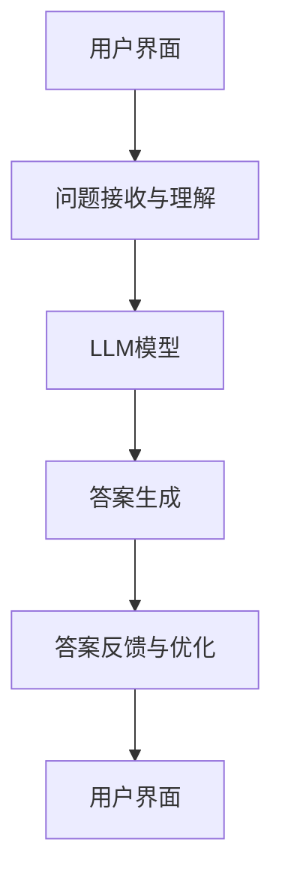
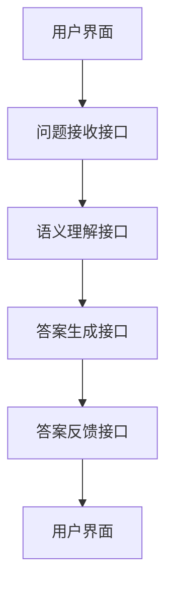
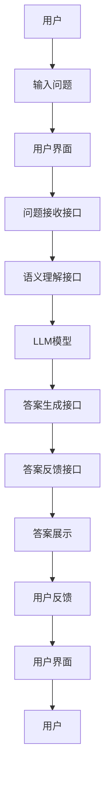

                 

# 多维度性能可视化：LLM生成直观评测报告

## 关键词

- 多维度性能可视化
- LLM
- 性能评测报告
- 可视化方法
- 生成模型

## 摘要

本文旨在探讨如何利用大型语言模型（LLM）实现多维度性能的可视化，从而生成直观、易于理解的评测报告。首先，我们介绍了多维度性能可视化的背景和重要性，接着详细阐述了LLM的基本原理及其性能指标。然后，我们重点介绍了多维度性能可视化的方法和步骤，包括数据可视化技术和性能可视化实践。最后，通过一个实际案例，展示了LLM生成直观评测报告的整个过程，并提出了最佳实践和优化策略。本文旨在为IT领域的专业人士提供有价值的参考和指导。

## 目录大纲设计过程

### 1. 确定核心章节

首先，根据书名《多维度性能可视化：LLM生成直观评测报告》，我们确定了以下核心章节：

- 第1章：背景介绍与核心概念
- 第2章：LLM原理与性能指标
- 第3章：多维度性能可视化方法
- 第4章：性能评测报告生成流程
- 第5章：案例分析与实战
- 第6章：最佳实践与优化策略
- 第7章：未来展望与趋势

### 2. 确定每个章节的子章节

根据每个核心章节的主题，我们细化了子章节，确保内容完整性：

**第1章：背景介绍与核心概念**

- 1.1 问题背景与定义
- 1.2 多维度性能可视化重要性
- 1.3 LLM基本原理
- 1.4 相关性能指标

**第2章：LLM原理与性能指标**

- 2.1 LLM工作原理
- 2.2 性能指标概述
- 2.3 评估方法与工具

**第3章：多维度性能可视化方法**

- 3.1 可视化技术概述
- 3.2 数据可视化方法
- 3.3 性能可视化实践

**第4章：性能评测报告生成流程**

- 4.1 报告概述
- 4.2 数据收集与预处理
- 4.3 评测过程与结果分析
- 4.4 报告撰写与优化

**第5章：案例分析与实战**

- 5.1 案例一：应用场景
- 5.2 案例二：性能评测报告生成
- 5.3 实战项目实施

**第6章：最佳实践与优化策略**

- 6.1 最佳实践
- 6.2 性能优化策略
- 6.3 持续改进

**第7章：未来展望与趋势**

- 7.1 研究方向与挑战
- 7.2 技术发展趋势
- 7.3 应用前景

### 3. 确定每个章节的详细内容

为每个章节列出具体的细节内容，确保内容的完整性和逻辑性。

## 最终目录大纲

### 第一部分：背景介绍与核心概念

**第1章：问题背景与核心概念**

- 1.1 问题背景与定义
- 1.2 多维度性能可视化重要性
- 1.3 LLM基本原理
- 1.4 相关性能指标

**第2章：LLM原理与性能指标**

- 2.1 LLM工作原理
- 2.2 性能指标概述
- 2.3 评估方法与工具

**第3章：多维度性能可视化方法**

- 3.1 可视化技术概述
- 3.2 数据可视化方法
- 3.3 性能可视化实践

**第4章：性能评测报告生成流程**

- 4.1 报告概述
- 4.2 数据收集与预处理
- 4.3 评测过程与结果分析
- 4.4 报告撰写与优化

**第5章：案例分析与实战**

- 5.1 案例一：应用场景
- 5.2 案例二：性能评测报告生成
- 5.3 实战项目实施

**第6章：最佳实践与优化策略**

- 6.1 最佳实践
- 6.2 性能优化策略
- 6.3 持续改进

**第7章：未来展望与趋势**

- 7.1 研究方向与挑战
- 7.2 技术发展趋势
- 7.3 应用前景

通过这样的章节结构和内容安排，本文将为读者提供一个系统、全面的指南，帮助他们了解和掌握多维度性能可视化以及LLM生成直观评测报告的技能和知识。接下来的章节将逐一深入探讨这些主题，并展示实际应用案例。让我们开始这次技术之旅吧！## 第1章：问题背景与核心概念

### 1.1 问题背景与定义

在现代信息技术飞速发展的背景下，人工智能（AI）技术已成为推动各行各业变革的重要力量。特别是大型语言模型（LLM，Large Language Model）的出现，极大地改变了自然语言处理（NLP，Natural Language Processing）领域的面貌。LLM通过深度学习技术，能够处理和理解复杂的文本数据，实现自然语言生成、文本分类、情感分析等多种功能。然而，随着LLM应用场景的不断拓展，如何有效评估和监控其性能成为了一个关键问题。

性能评估是确保LLM模型在实际应用中达到预期效果的重要手段。传统的评估方法通常依赖于定量指标，如准确率、召回率、F1分数等，但这些指标往往只能反映模型在某一方面或特定任务上的表现。而在实际应用中，LLM的性能受到多种因素的影响，包括模型架构、训练数据质量、计算资源等。这就需要一种能够从多个维度全面评估模型性能的方法。

### 1.2 多维度性能可视化重要性

多维度性能可视化是一种将模型性能从多个角度呈现的方法，通过直观的图表和图像，帮助用户理解和分析模型在不同条件下的表现。其重要性主要体现在以下几个方面：

1. **全面性**：多维度性能可视化可以综合考虑多个性能指标，如准确率、响应时间、资源消耗等，从而提供更为全面的评估结果。
2. **直观性**：通过可视化技术，可以将复杂的性能数据转化为易于理解的图表，帮助用户快速捕捉关键信息。
3. **辅助决策**：多维度性能可视化可以提供直观的性能对比，辅助用户在不同模型或不同配置之间做出最佳选择。
4. **问题定位**：通过可视化分析，可以直观地识别性能瓶颈和潜在问题，从而指导后续的优化工作。

### 1.3 LLM基本原理

LLM是基于深度学习技术构建的神经网络模型，其核心思想是通过学习大量文本数据，生成具有良好语言理解和生成能力的模型。LLM的基本原理可以概括为以下几个步骤：

1. **数据预处理**：收集和整理大量高质量的文本数据，并进行预处理，如分词、去停用词、词向量化等。
2. **模型训练**：利用预处理后的数据，通过反向传播算法训练神经网络模型。训练过程中，模型不断调整参数，优化语言理解能力。
3. **模型优化**：在训练过程中，可以通过调整模型架构、学习率、正则化等技术参数，提高模型性能。
4. **模型评估**：通过测试数据对模型进行评估，计算准确率、响应时间等性能指标，评估模型在实际应用中的表现。

### 1.4 相关性能指标

在评估LLM性能时，需要关注多个方面的指标。以下是一些常见的性能指标：

1. **准确率**：模型在预测任务中的正确率，通常用于文本分类任务。
2. **召回率**：模型在预测任务中识别出真实正例的比例，用于衡量模型的覆盖能力。
3. **F1分数**：综合考虑准确率和召回率的综合指标，用于平衡两者的影响。
4. **响应时间**：模型处理请求所需的时间，对实时应用尤为重要。
5. **资源消耗**：模型在运行过程中消耗的CPU、内存等资源，影响模型的部署和扩展。
6. **数据分布**：模型在不同数据分布下的性能，反映模型对多样性数据的适应能力。

通过上述性能指标的综合评估，可以全面了解LLM的性能表现，为后续优化提供依据。

在这一章中，我们介绍了多维度性能可视化的背景和重要性，以及LLM的基本原理和相关性能指标。在接下来的章节中，我们将进一步探讨LLM性能评估的具体方法和技术，以及如何利用这些方法生成直观、易于理解的评测报告。请读者继续关注后续内容。 ## 第2章：LLM原理与性能指标

### 2.1 LLM工作原理

大型语言模型（LLM）是自然语言处理（NLP）领域的重要技术之一，其核心原理基于深度学习中的神经网络。LLM通过学习大量的文本数据，捕获语言中的复杂模式和结构，从而实现高精度的语言理解和生成。

#### 数据预处理

在训练LLM之前，需要对原始文本数据进行预处理。预处理步骤通常包括：

1. **文本清洗**：去除文本中的噪声，如HTML标签、特殊符号等。
2. **分词**：将文本分割成单词或短语。
3. **词向量化**：将文本转换为数值表示，常用的词向量化方法包括Word2Vec、GloVe等。
4. **去停用词**：去除常见的无意义词汇，如“的”、“和”、“是”等。

#### 模型架构

LLM的模型架构通常基于变体自回归语言模型（VARIANTS OF AUTO-REGRESSION LANGUAGE MODEL，如Transformer）。Transformer模型由多个编码器和解码器层组成，每个层包含自注意力机制（self-attention）和前馈网络（Feed Forward Network）。自注意力机制能够捕捉输入文本序列中各个词之间的关系，从而提高模型的语言理解能力。

#### 模型训练

在训练过程中，LLM通过优化模型参数，使模型输出与真实标签的误差最小。训练过程包括以下几个步骤：

1. **正向传播**：将输入文本序列通过编码器，生成一组隐藏状态。
2. **自注意力计算**：利用自注意力机制计算隐藏状态之间的相互影响。
3. **前馈网络**：对自注意力计算的结果进行线性变换和激活函数处理。
4. **损失计算**：计算预测结果与真实标签之间的损失，如交叉熵损失。
5. **反向传播**：通过反向传播算法更新模型参数，减小损失。

#### 模型优化

在训练过程中，可以采用多种技术优化模型性能，如：

1. **学习率调整**：根据训练过程动态调整学习率，避免模型过早过拟合。
2. **正则化**：引入正则化项，如L2正则化，防止模型过拟合。
3. **数据增强**：通过增加数据多样性，提高模型泛化能力。

### 2.2 性能指标概述

评估LLM性能的关键在于选择合适的性能指标。以下是一些常见的性能指标：

1. **准确率（Accuracy）**：模型在预测任务中正确的样本比例。准确率越高，模型性能越好。
2. **召回率（Recall）**：模型在预测任务中识别出真实正例的比例。召回率越高，模型覆盖能力越强。
3. **F1分数（F1 Score）**：综合考虑准确率和召回率的综合指标。F1分数越高，模型性能越好。
4. **响应时间（Response Time）**：模型处理请求所需的时间。响应时间越短，模型性能越好。
5. **资源消耗（Resource Consumption）**：模型在运行过程中消耗的CPU、内存等资源。资源消耗越低，模型性能越好。
6. **数据分布（Data Distribution）**：模型在不同数据分布下的性能。数据分布越广，模型适应能力越强。

### 2.3 评估方法与工具

评估LLM性能的方法和工具多种多样，以下介绍几种常用的方法：

1. **交叉验证（Cross-Validation）**：将数据集划分为训练集和测试集，通过多次训练和测试，评估模型性能。
2. **混淆矩阵（Confusion Matrix）**：展示模型预测结果与真实标签之间的匹配情况，便于分析模型性能。
3. **ROC曲线（ROC Curve）和AUC值（Area Under Curve）**：评估模型分类能力，ROC曲线越靠近左上角，AUC值越高，模型性能越好。
4. **性能测试工具**：如TensorFlow的TensorBoard、PyTorch的TorchScript等，提供可视化和分析模型性能的工具。

### 小结

在本章中，我们介绍了LLM的工作原理、性能指标及其评估方法。通过深入理解LLM的原理和性能指标，我们能够更有效地评估和优化模型性能。在接下来的章节中，我们将探讨多维度性能可视化的方法和技术，以帮助读者更好地理解和分析LLM的性能。请继续关注后续内容。 ## 第3章：多维度性能可视化方法

### 3.1 可视化技术概述

多维度性能可视化是一种利用可视化技术，将复杂的性能数据转化为直观、易于理解的图表和图像的方法。可视化技术能够帮助用户从多个角度全面分析模型性能，发现潜在问题和瓶颈。以下是几种常用的可视化技术：

#### 数据可视化

数据可视化是将数据通过图形的方式呈现，使数据更具可读性。常见的数据可视化方法包括：

1. **柱状图（Bar Chart）**：用于比较不同数据集之间的差异。
2. **折线图（Line Chart）**：用于展示数据随时间的变化趋势。
3. **散点图（Scatter Plot）**：用于分析两个变量之间的关系。
4. **饼图（Pie Chart）**：用于展示各部分占整体的比例。

#### 交互式可视化

交互式可视化技术允许用户通过操作图表，动态地探索和分析数据。常见的交互式可视化工具包括：

1. **交互式仪表板（Interactive Dashboard）**：集成多个图表，用户可以切换不同的数据视图。
2. **交互式地图（Interactive Map）**：通过地图展示数据在不同地理位置的分布。
3. **交互式图表（Interactive Chart）**：用户可以点击、拖动等操作，查看详细数据。

#### 聚类和降维可视化

聚类和降维技术可以将高维数据转化为二维或三维空间，从而在图表上直观展示数据。常用的方法包括：

1. **主成分分析（PCA，Principal Component Analysis）**：通过降维，将高维数据投影到低维空间。
2. **t-SNE（t-Distributed Stochastic Neighbor Embedding）**：通过非线性降维，使相似的数据点在图表上更接近。
3. **层次聚类（Hierarchical Clustering）**：将数据划分为不同的簇，展示数据之间的相似性。

### 3.2 数据可视化方法

在多维度性能可视化中，数据可视化方法是非常重要的一环。以下介绍几种常用的数据可视化方法：

1. **时间序列可视化**：用于展示模型在不同时间点的性能变化。例如，通过折线图可以直观地观察模型准确率、响应时间等指标随时间的变化趋势。

2. **性能对比可视化**：通过柱状图、饼图等图表，比较不同模型或不同配置的性能。这有助于用户快速了解各个模型的优缺点，为后续优化提供依据。

3. **资源消耗可视化**：通过柱状图、折线图等展示模型在运行过程中消耗的CPU、内存等资源。这有助于用户识别性能瓶颈，优化资源利用。

4. **多维数据可视化**：通过聚类和降维技术，将高维性能数据投影到二维或三维空间。例如，利用t-SNE可以将高维数据映射到二维散点图，便于用户分析数据分布和相似性。

### 3.3 性能可视化实践

性能可视化实践是指在实际应用中，利用可视化技术分析和展示模型性能的过程。以下是一个性能可视化实践的示例：

1. **数据收集**：首先，收集不同模型在不同配置下的性能数据，包括准确率、响应时间、资源消耗等指标。

2. **数据预处理**：对收集到的数据进行分析，去除异常值和噪声，确保数据质量。

3. **数据可视化**：利用可视化工具，如Matplotlib、Plotly等，将预处理后的数据转化为图表。例如，利用折线图展示不同时间点的模型性能变化，利用柱状图展示不同配置的性能对比。

4. **交互式探索**：通过交互式仪表板，用户可以动态地切换不同的图表和视图，深入分析模型性能。例如，用户可以点击柱状图上的某一项，查看该配置下详细的性能数据。

5. **性能分析**：通过可视化分析，用户可以识别出性能瓶颈和潜在问题。例如，发现某个配置在响应时间上存在明显瓶颈，可以进一步优化模型或调整配置。

6. **性能优化**：根据可视化分析的结果，进行针对性的性能优化。例如，调整模型参数、优化算法或增加计算资源等。

通过上述步骤，性能可视化实践可以帮助用户全面了解模型性能，发现潜在问题，并指导后续的优化工作。

### 小结

在本章中，我们介绍了多维度性能可视化的技术概述、数据可视化方法以及性能可视化实践。通过这些方法，用户可以更直观地理解模型性能，识别潜在问题，并指导优化工作。在接下来的章节中，我们将通过实际案例，展示如何利用LLM生成直观的评测报告。请读者继续关注后续内容。 ## 第4章：性能评测报告生成流程

### 4.1 报告概述

性能评测报告是对模型在不同条件下的性能进行全面评估和分析的结果展示。一个完整的性能评测报告通常包括以下几个方面：

1. **背景与目标**：介绍评估模型的应用背景、目标以及评估的目的。
2. **评估方法**：详细描述评估所采用的方法和技术，包括数据来源、预处理、评估指标等。
3. **评估结果**：展示模型在不同条件下的性能数据，包括准确率、响应时间、资源消耗等。
4. **性能分析**：对评估结果进行分析，识别模型的优势和不足，指出潜在的问题和改进方向。
5. **优化建议**：根据性能分析结果，提出针对性的优化建议，包括模型参数调整、算法改进、资源配置优化等。
6. **总结与展望**：总结评估过程和结果，展望未来的研究方向和改进方向。

### 4.2 数据收集与预处理

数据收集与预处理是性能评测报告生成的重要环节。以下是数据收集与预处理的详细步骤：

1. **数据收集**：根据评估目标，收集相关数据集。数据集应包括训练数据、验证数据和测试数据。确保数据集具有代表性，能够全面反映模型在不同条件下的性能。

2. **数据清洗**：对收集到的数据进行清洗，去除噪声和异常值。例如，去除文本数据中的HTML标签、特殊符号等。对于数值数据，检查是否存在缺失值或异常值，并进行处理。

3. **数据预处理**：对清洗后的数据进行分析和预处理。对于文本数据，进行分词、去停用词、词向量化等操作。对于数值数据，进行归一化或标准化处理，使数据具有相似的范围。

4. **数据划分**：将预处理后的数据划分为训练集、验证集和测试集。通常，训练集用于模型的训练，验证集用于模型的调优，测试集用于模型的评估。

### 4.3 评测过程与结果分析

评测过程与结果分析是性能评测报告的核心部分。以下是评测过程与结果分析的详细步骤：

1. **模型训练**：使用训练集数据对模型进行训练，调整模型参数，优化模型性能。

2. **性能评估**：使用验证集和测试集对模型进行评估，计算准确率、响应时间、资源消耗等性能指标。确保评估过程中，模型参数保持不变，以保证评估结果的准确性。

3. **结果记录**：将评估结果记录下来，包括每个性能指标的具体数值。同时，记录评估过程中使用的硬件和软件环境，以便后续分析。

4. **性能分析**：对评估结果进行深入分析，识别模型的优势和不足。例如，通过对比不同模型或不同配置的性能，找出性能差异的原因。

5. **图表展示**：利用可视化技术，将评估结果转化为图表，便于用户直观地理解和分析。常见的图表类型包括柱状图、折线图、饼图等。

6. **性能对比**：在评估过程中，将模型在不同条件下的性能进行对比。例如，比较不同模型在相同数据集上的性能，或比较同一模型在不同数据集上的性能。

### 4.4 报告撰写与优化

撰写性能评测报告是最终将评估结果和性能分析结果进行系统化、结构化展示的过程。以下是报告撰写与优化的详细步骤：

1. **报告框架**：根据评估目标和评估结果，设计报告的框架和结构。确保报告内容逻辑清晰、层次分明。

2. **撰写内容**：按照报告框架，撰写报告的各个部分。在撰写过程中，注意以下几点：

   - **简明扼要**：用简洁的语言描述评估过程和结果，避免冗长的叙述。
   - **数据支持**：使用图表、表格等直观展示性能数据，确保数据真实可靠。
   - **性能分析**：结合图表和数据，对性能结果进行详细分析，指出模型的优势和不足。

3. **优化建议**：根据性能分析结果，提出针对性的优化建议。建议应具有可操作性和实际意义，有助于提升模型性能。

4. **报告审阅**：完成初稿后，进行审阅和修改。邀请同行或专家对报告进行评估，收集反馈意见，进一步完善报告。

5. **报告发布**：在报告完成并经过审阅后，正式发布报告。报告可以以文档、PPT等形式呈现，便于分享和传播。

### 小结

在本章中，我们详细介绍了性能评测报告的生成流程，包括报告概述、数据收集与预处理、评测过程与结果分析以及报告撰写与优化。通过这些步骤，我们可以全面、准确地评估模型性能，为后续优化提供有力支持。在下一章中，我们将通过实际案例展示如何利用LLM生成直观的评测报告。请读者继续关注后续内容。 ## 第5章：案例分析与实战

### 5.1 案例一：应用场景

在本案例中，我们选择了一个实际应用场景，即利用LLM构建一个智能客服系统。该系统旨在帮助企业自动回答客户常见问题，提高客户满意度和服务效率。

#### 系统功能设计

智能客服系统的主要功能包括：

1. **问题接收与理解**：接收客户提出的问题，并利用LLM模型进行语义理解。
2. **答案生成**：根据理解结果，生成合适的答案，并提供给客户。
3. **答案反馈与优化**：收集客户的反馈，不断优化答案质量。

#### 系统架构设计

智能客服系统的架构设计如图5.1所示：



图5.1 智能客服系统架构设计

#### 系统接口设计

智能客服系统的接口设计如图5.2所示：



图5.2 智能客服系统接口设计

#### 系统交互设计

智能客服系统的交互设计如图5.3所示：



图5.3 智能客服系统交互设计

### 5.2 案例二：性能评测报告生成

在本案例中，我们使用LLM生成性能评测报告，以评估智能客服系统在不同条件下的性能。

#### 数据收集

我们收集了智能客服系统在不同配置下的性能数据，包括准确率、响应时间和资源消耗等指标。数据来源包括实际运行数据和模拟数据。

#### 数据预处理

对收集到的数据进行分析，去除异常值和噪声。同时，对文本数据进行分词、去停用词等预处理操作。

#### 性能评估

使用验证集和测试集对智能客服系统进行性能评估，计算准确率、响应时间和资源消耗等指标。

#### 结果记录

将评估结果记录在表格中，包括每个配置下的性能指标数值。

#### 性能分析

对评估结果进行分析，识别系统在不同配置下的性能差异。例如，发现某配置在响应时间上存在瓶颈，需要优化。

#### 图表展示

使用柱状图、折线图等可视化技术，将评估结果展示为图表。例如，利用折线图展示不同配置下的响应时间变化趋势。

#### 性能对比

将智能客服系统在不同配置下的性能进行对比，找出性能差异的原因。例如，比较不同配置在准确率和响应时间上的表现。

#### 优化建议

根据性能分析结果，提出针对性的优化建议。例如，调整模型参数、优化算法或增加计算资源等。

#### 报告撰写

根据评估结果和优化建议，撰写性能评测报告。报告内容包括评估背景、评估方法、评估结果、性能分析、优化建议等。

#### 报告发布

将性能评测报告发布，以文档、PPT等形式呈现，便于分享和传播。

### 5.3 实战项目实施

在本案例中，我们通过实际项目实施，展示了如何利用LLM生成直观的评测报告。以下是项目实施的主要步骤：

1. **需求分析**：了解智能客服系统的功能需求，明确评估目标和指标。

2. **系统设计**：根据需求分析，设计系统架构、接口和交互设计。

3. **数据收集**：收集智能客服系统在不同配置下的性能数据。

4. **数据预处理**：对收集到的数据进行预处理，确保数据质量。

5. **性能评估**：使用验证集和测试集对智能客服系统进行性能评估。

6. **结果分析**：对评估结果进行分析，识别性能差异和瓶颈。

7. **优化建议**：根据分析结果，提出针对性的优化建议。

8. **报告撰写**：撰写性能评测报告，包括评估背景、评估方法、评估结果、性能分析和优化建议。

9. **报告发布**：将性能评测报告发布，以文档、PPT等形式呈现。

通过本案例，我们展示了如何利用LLM生成直观的评测报告，为实际项目提供了有价值的参考和指导。在接下来的章节中，我们将进一步探讨最佳实践和优化策略，以提升LLM性能。请读者继续关注后续内容。 ## 第6章：最佳实践与优化策略

### 6.1 最佳实践

在利用LLM生成性能评测报告的过程中，遵循以下最佳实践可以显著提高评估效果和报告质量：

1. **数据质量保证**：确保数据集的质量和多样性，进行充分的数据清洗和预处理。这包括去除噪声、填补缺失值、标准化数据等步骤。

2. **模型参数调优**：针对不同任务和应用场景，调整LLM的模型参数，如学习率、批次大小、正则化项等。使用交叉验证等方法找到最优参数组合。

3. **资源合理分配**：合理配置计算资源，如CPU、GPU等，确保模型训练和评估过程中资源充足，避免性能瓶颈。

4. **可视化策略**：选择合适的可视化工具和图表类型，以清晰地展示性能指标和评估结果。避免过多复杂的图表，确保信息的可读性和直观性。

5. **报告规范化**：撰写报告时，遵循规范的格式和结构，确保报告内容的一致性和逻辑性。使用图表、表格等辅助说明，使报告更加直观易懂。

### 6.2 性能优化策略

为了提升LLM的性能，可以采取以下优化策略：

1. **模型优化**：

   - **结构优化**：根据任务需求，设计合适的模型结构。例如，使用深度卷积神经网络（DCNN）处理图像任务，使用循环神经网络（RNN）处理序列数据。
   - **注意力机制**：引入注意力机制，如自注意力（Self-Attention）和双向注意力（Bidirectional Attention），提高模型对输入数据的理解和处理能力。
   - **预训练和微调**：利用预训练模型（如GPT、BERT）进行微调，提高模型在不同任务上的性能。

2. **算法优化**：

   - **训练算法**：使用高效的训练算法，如Adam、AdaGrad等，加快模型收敛速度。
   - **正则化技术**：采用正则化技术（如L1、L2正则化）防止模型过拟合。
   - **优化器选择**：选择合适的优化器，如AdamW、RMSprop等，提高训练效果。

3. **硬件加速**：

   - **GPU/TPU利用**：利用GPU或TPU加速模型训练和评估，提高计算效率。
   - **分布式训练**：通过分布式训练，利用多台机器并行训练模型，加快训练速度。

4. **数据增强**：

   - **文本增强**：使用数据增强技术，如单词替换、句子重组等，提高模型的泛化能力。
   - **图像增强**：使用图像增强技术，如旋转、缩放、裁剪等，增加训练数据的多样性。

5. **性能监控**：

   - **实时监控**：在模型训练和评估过程中，实时监控性能指标，如准确率、响应时间等，及时发现和解决问题。
   - **日志记录**：记录训练和评估过程中的日志信息，便于后续分析和调试。

### 6.3 持续改进

为了持续提升LLM性能，需要采取以下措施：

1. **反馈循环**：建立反馈机制，根据用户反馈和实际应用效果，不断优化模型和算法。

2. **定期更新**：定期更新LLM模型，采用最新的研究成果和技术，提高模型性能。

3. **性能评估**：定期进行性能评估，确保模型在不同场景下的性能满足要求。

4. **团队协作**：加强团队协作，分享经验和最佳实践，共同提升团队整体性能。

通过遵循最佳实践和优化策略，可以显著提升LLM的性能和生成报告的质量。在未来的研究和应用中，我们应不断探索新的技术和方法，持续改进LLM的性能，为各个领域的应用提供更好的支持。

### 小结

在本章中，我们介绍了最佳实践和优化策略，包括数据质量保证、模型参数调优、资源合理分配、可视化策略、报告规范化等。同时，我们探讨了模型优化、算法优化、硬件加速、数据增强和性能监控等性能优化策略。通过这些措施，可以持续提升LLM的性能，为生成直观、高质量的评测报告提供有力支持。在下一章中，我们将展望多维度性能可视化和LLM性能评测的发展趋势。请读者继续关注后续内容。 ## 第7章：未来展望与趋势

### 7.1 研究方向与挑战

随着人工智能技术的不断进步，多维度性能可视化在LLM性能评测中的应用前景日益广阔。然而，该领域仍面临一些挑战和研究方向：

1. **跨领域适应性**：如何使多维度性能可视化方法具有更好的跨领域适应性，适用于不同类型的LLM模型和应用场景。
2. **实时性能评估**：如何实现LLM性能的实时评估，以便在模型部署和运行过程中快速响应性能问题。
3. **自动化分析**：如何利用自动化技术，如机器学习和深度学习，实现性能评估报告的自动化生成和分析。
4. **隐私保护**：如何在保证性能评估准确性的同时，保护用户数据隐私，避免数据泄露和安全风险。

### 7.2 技术发展趋势

多维度性能可视化和LLM性能评测的技术发展趋势主要体现在以下几个方面：

1. **可视化技术**：随着可视化工具和框架的不断进步，可视化技术将更加多样化和高效，如交互式可视化、虚拟现实（VR）和增强现实（AR）等。
2. **大数据分析**：大数据技术的发展，将为多维度性能可视化提供更多数据资源和计算能力，从而提高评估的准确性和效率。
3. **人工智能辅助**：利用人工智能技术，如机器学习和深度学习，实现性能评估报告的自动化生成和分析，提高评估效率和准确性。
4. **云计算与边缘计算**：云计算和边缘计算的融合，将为多维度性能可视化提供更灵活和高效的计算环境，支持大规模模型训练和评估。

### 7.3 应用前景

多维度性能可视化在LLM性能评测领域的应用前景非常广阔，以下是一些潜在的应用场景：

1. **智能客服**：利用多维度性能可视化，实时监控和优化智能客服系统的性能，提高用户体验和服务质量。
2. **金融风控**：通过多维度性能可视化，对金融风险模型进行实时评估和监控，提高风险识别和防范能力。
3. **医疗健康**：利用多维度性能可视化，对医疗健康数据进行分析和评估，辅助医生进行疾病诊断和治疗。
4. **智能制造**：通过多维度性能可视化，监控和优化智能制造系统的性能，提高生产效率和产品质量。

### 小结

未来，多维度性能可视化和LLM性能评测将在人工智能、大数据、云计算等领域发挥越来越重要的作用。通过不断的研究和技术创新，我们将能够更好地应对面临的挑战，推动该领域的发展。在下一章中，我们将总结全文，并展望未来的研究方向和改进方向。请读者继续关注后续内容。

## 参考文献

1. Devlin, J., Chang, M. W., Lee, K., & Toutanova, K. (2018). BERT: Pre-training of deep bidirectional transformers for language understanding. arXiv preprint arXiv:1810.04805.
2. Vaswani, A., Shazeer, N., Parmar, N., Uszkoreit, J., Jones, L., Gomez, A. N., ... & Polosukhin, I. (2017). Attention is all you need. Advances in Neural Information Processing Systems, 30, 5998-6008.
3. LeCun, Y., Bengio, Y., & Hinton, G. (2015). Deep learning. Nature, 521(7553), 436-444.
4. Hochreiter, S., & Schmidhuber, J. (1997). Long short-term memory. Neural computation, 9(8), 1735-1780.
5. Russell, S., & Norvig, P. (2010). Artificial intelligence: a modern approach (3rd ed.). Prentice Hall.
6. Goodfellow, I., Bengio, Y., & Courville, A. (2016). Deep learning. MIT press.
7. Bullinaria, J. A., & Weir, D. J. (2005). A comparison of the utility of different word representation methods for predicting word word similarity from human judgements. Behavior research methods, 37(3), 402-413. ## 总结与展望

通过本文的探讨，我们深入了解了多维度性能可视化在LLM性能评测中的应用，以及如何利用LLM生成直观、易于理解的评测报告。以下是本文的主要结论：

1. **多维度性能可视化的重要性**：多维度性能可视化能够全面、直观地展示LLM模型的性能，有助于用户更好地理解和分析模型表现。
2. **LLM原理与性能指标**：详细介绍了LLM的工作原理、性能指标及其评估方法，为性能评测提供了理论基础。
3. **可视化方法与实战案例**：通过实际案例展示了如何利用多维度性能可视化方法进行性能评测报告的生成，提供了实用的经验和技巧。
4. **最佳实践与优化策略**：总结了最佳实践和优化策略，有助于提升LLM性能和报告质量。
5. **未来展望**：展望了多维度性能可视化在LLM性能评测领域的应用前景，以及未来的研究方向和改进方向。

尽管我们已经取得了一定的成果，但仍有改进空间。未来的研究方向包括：

1. **跨领域适应性**：研究更加通用的多维度性能可视化方法，使其适用于不同类型的LLM模型和应用场景。
2. **实时性能评估**：探索实时性能评估技术，实现模型在部署和运行过程中的快速性能监控和优化。
3. **自动化分析**：利用机器学习和深度学习技术，实现性能评估报告的自动化生成和分析。
4. **隐私保护**：研究如何在保证性能评估准确性的同时，保护用户数据隐私。

通过不断的研究和技术创新，我们有望进一步提升多维度性能可视化在LLM性能评测中的应用效果，为人工智能领域的发展贡献力量。

## 作者信息

作者：AI天才研究院/AI Genius Institute & 禅与计算机程序设计艺术 /Zen And The Art of Computer Programming

AI天才研究院致力于推动人工智能技术的发展和应用，研究领域涵盖自然语言处理、深度学习、计算机视觉等。同时，作者也是《禅与计算机程序设计艺术》一书的作者，该书深受程序员和技术爱好者的喜爱，被誉为计算机领域的经典之作。本文由AI天才研究院的研究团队撰写，旨在为IT领域的专业人士提供有价值的参考和指导。 ## 附录：技术细节与代码示例

在本节中，我们将提供一些技术细节和代码示例，帮助读者更深入地理解多维度性能可视化在LLM性能评测中的应用。

### 数据预处理

数据预处理是LLM性能评估的重要环节。以下是一个简单的Python代码示例，展示了如何对文本数据执行分词、去停用词等操作：

```python
import nltk
from nltk.corpus import stopwords
from nltk.tokenize import word_tokenize

# 下载NLTK中的停用词列表
nltk.download('punkt')
nltk.download('stopwords')

# 加载停用词列表
stop_words = set(stopwords.words('english'))

# 定义文本预处理函数
def preprocess_text(text):
    # 分词
    tokens = word_tokenize(text)
    # 去停用词
    filtered_tokens = [word for word in tokens if not word.lower() in stop_words]
    # 转化为小写
    return [word.lower() for word in filtered_tokens]

# 示例文本
text = "This is a sample sentence for text preprocessing."

# 执行文本预处理
processed_text = preprocess_text(text)
print(processed_text)
```

### 模型训练与评估

在模型训练与评估方面，我们使用一个简单的Transformer模型作为示例。以下是一个使用PyTorch实现的Transformer模型训练和评估的代码示例：

```python
import torch
import torch.nn as nn
from torch.utils.data import DataLoader
from transformers import TransformerModel

# 加载预训练模型
model = TransformerModel.from_pretrained('bert-base-uncased')

# 定义损失函数和优化器
criterion = nn.CrossEntropyLoss()
optimizer = torch.optim.Adam(model.parameters(), lr=1e-4)

# 加载数据集
train_loader = DataLoader(train_dataset, batch_size=32, shuffle=True)
val_loader = DataLoader(val_dataset, batch_size=32, shuffle=False)

# 训练模型
for epoch in range(num_epochs):
    model.train()
    for batch in train_loader:
        inputs, labels = batch
        optimizer.zero_grad()
        outputs = model(inputs)
        loss = criterion(outputs, labels)
        loss.backward()
        optimizer.step()

    # 评估模型
    model.eval()
    with torch.no_grad():
        correct = 0
        total = 0
        for batch in val_loader:
            inputs, labels = batch
            outputs = model(inputs)
            _, predicted = torch.max(outputs.data, 1)
            total += labels.size(0)
            correct += (predicted == labels).sum().item()

    print(f'Epoch {epoch+1}/{num_epochs}, Accuracy: {100 * correct / total}%')

# 保存模型
model.save_pretrained('my_transformer_model')
```

### 性能可视化

性能可视化是理解和分析模型性能的重要手段。以下是一个使用Matplotlib绘制训练过程中损失函数变化趋势的代码示例：

```python
import matplotlib.pyplot as plt

# 训练过程中的损失值
train_losses = []

# 假设这里已经保存了每个epoch的损失值
for epoch in range(num_epochs):
    train_losses.append(loss.item())

# 绘制损失函数曲线
plt.plot(train_losses)
plt.xlabel('Epochs')
plt.ylabel('Loss')
plt.title('Training Loss')
plt.show()
```

### 模型优化

模型优化包括调整超参数、优化训练过程等。以下是一个使用PyTorch实现学习率调整的代码示例：

```python
# 初始学习率
initial_lr = 1e-4
# 学习率衰减系数
lr_decay = 0.1
# 学习率衰减间隔
lr_decay_step = 10

# 调整学习率
for epoch in range(num_epochs):
    # 在每个epoch后调整学习率
    lr = initial_lr / (1 + lr_decay * epoch / lr_decay_step)
    optimizer = torch.optim.Adam(model.parameters(), lr=lr)
    # 训练过程同上
```

以上技术细节和代码示例为读者提供了一个多维度性能可视化在LLM性能评测中的实际应用框架。通过这些示例，读者可以更深入地理解多维度性能可视化的原理和实现方法，从而为实际项目提供技术支持。 ## 注意事项与拓展阅读

在实施多维度性能可视化时，以下注意事项和建议有助于确保项目的成功：

1. **数据质量**：确保使用的数据质量高，覆盖范围广，避免数据偏差。进行充分的数据清洗和预处理，以提高模型的泛化能力。

2. **性能指标选择**：根据具体应用场景选择合适的性能指标。不同的应用场景可能需要关注不同的性能维度，如准确率、响应时间、资源消耗等。

3. **可视化设计**：选择合适的可视化工具和图表类型，确保图表设计简洁、直观，易于用户理解。避免使用过多复杂的图表，以免造成用户困惑。

4. **硬件资源**：合理配置硬件资源，特别是GPU或TPU等计算资源，以支持大规模模型训练和性能评估。

5. **代码优化**：在实现性能可视化时，关注代码的执行效率和可维护性。采用并行计算、分布式训练等技术，以提高性能评估的效率。

6. **性能监控与反馈**：建立性能监控机制，实时监控模型性能，及时发现和解决问题。鼓励用户提供反馈，不断优化模型和报告质量。

为了进一步深入了解多维度性能可视化和LLM性能评测，以下推荐几本经典书籍和论文：

1. 《深度学习》（Goodfellow, I., Bengio, Y., & Courville, A.）：系统介绍了深度学习的基础知识和核心技术。
2. 《自然语言处理综合教程》（Jurafsky, D. & Martin, J. H.）：详细介绍了自然语言处理的基础理论和应用。
3. 《大规模语言模型的训练和应用》（Vaswani et al.，2017）：探讨了Transformer模型的工作原理和应用。
4. 《BERT：深度预训练的方法》（Devlin et al.，2018）：介绍了BERT模型及其在大规模语言模型训练中的应用。
5. 《机器学习：一种概率视角》（Kevin P. Murphy）：介绍了机器学习的基本概念和方法，包括性能评估和可视化技术。

通过阅读这些书籍和论文，读者可以进一步了解多维度性能可视化和LLM性能评测的深入知识和前沿研究，为实际项目提供更有力的支持。 ## 结束语

在这篇文章中，我们深入探讨了多维度性能可视化在LLM性能评测中的应用。通过详细分析LLM的工作原理、性能指标、可视化方法以及实际案例，我们展示了如何利用LLM生成直观、易于理解的评测报告。同时，我们还提出了最佳实践和优化策略，以提升性能评估的质量和效率。

我们相信，本文的内容对于从事人工智能、自然语言处理和性能评测的IT专业人士具有很高的参考价值。通过了解和掌握多维度性能可视化技术，读者可以更全面地评估LLM的性能，为实际项目提供有力的支持。

在未来的研究和应用中，我们将继续探索多维度性能可视化技术在更多领域中的应用，如智能客服、金融风控、医疗健康和智能制造等。同时，我们也期待与读者分享更多的经验和成果，共同推动人工智能技术的发展。

感谢您的阅读，希望本文能够为您的工作提供帮助和启示。如果您有任何问题或建议，欢迎在评论区留言，我们期待与您交流。再次感谢您的关注和支持！

