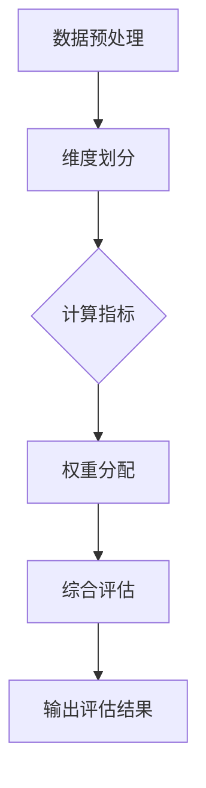
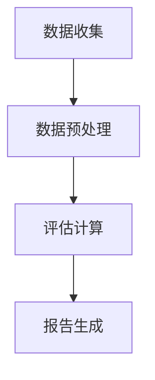

                 

### 文章标题

# 多维度评估：LLM性能测试的新标准

### 关键词

- 多维度评估
- 语言模型（LLM）
- 性能测试
- 评估指标
- 算法原理
- 系统架构设计

### 摘要

本文深入探讨了多维度评估在语言模型（LLM）性能测试中的应用，提出了一个新的评估标准。通过逐步分析和推理，文章详细介绍了多维度评估的背景、核心概念、算法原理、系统设计与实现，并进行了实战案例剖析。文章旨在为读者提供全面、深入的指导，帮助其在LLM性能测试中实现更准确的评估和优化。

### 第1章：多维度评估概述

#### 1.1 多维度评估的重要性

多维度评估是一种综合评价方法，通过从多个角度对对象进行评价，以获得更全面和准确的评估结果。在人工智能领域，尤其是在语言模型（LLM）的性能测试中，多维度评估显得尤为重要。LLM是一种复杂的模型，其性能不仅受到单一指标的影响，还受到多个因素的综合作用。

**核心概念术语说明**

- 多维度评估：一种综合评价方法，从多个角度对对象进行评价。
- 语言模型（LLM）：一种基于深度学习技术构建的模型，用于自然语言处理任务。
- 性能测试：评估模型在实际应用场景中的表现，包括准确性、响应速度、鲁棒性等。

#### 1.2 评估维度的选择与定义

在LLM性能测试中，评估维度的选择至关重要。常见的评估维度包括：

- 准确性：模型预测结果的正确性。
- 响应速度：模型处理请求的速度。
- 鲁棒性：模型在不同输入条件下的稳定性和一致性。
- 适应性：模型在不同场景下的灵活性和扩展性。

**问题背景与问题描述**

随着自然语言处理任务的复杂性不断增加，单一维度的评估已经无法全面反映LLM的性能。例如，一个模型可能在准确性方面表现优异，但在响应速度上却存在瓶颈。因此，我们需要一种全新的评估标准，能够从多个维度对LLM的性能进行全面评价。

#### 1.3 多维度评估的历史发展与现状

多维度评估方法在人工智能领域已经发展多年。最初，研究者们主要关注单一维度的评估，如准确性。随着技术的进步，人们开始意识到，单一维度的评估无法全面反映模型性能，于是提出了多维度评估方法。

当前，多维度评估已经成为LLM性能测试的主流方法。研究者们提出了各种评估维度和指标，如BLEU、ROUGE、METEOR等，以从不同角度评估模型的性能。

#### 1.4 多维度评估的应用场景

多维度评估在LLM性能测试中的应用场景广泛，包括：

- 模型优化：通过多维度评估，研究者可以找出模型性能的短板，进行针对性优化。
- 模型比较：多维度评估有助于研究者比较不同模型的性能，为选择最优模型提供依据。
- 模型评估：在实际应用中，多维度评估可以全面评估模型的表现，确保其在各种场景下的稳定性和可靠性。

#### 1.5 多维度评估的挑战与机遇

尽管多维度评估在LLM性能测试中具有广泛的应用，但也面临一些挑战：

- 指标选择：如何选择合适的评估维度和指标，是一个需要深入研究的课题。
- 数据质量：评估数据的质量直接影响评估结果的准确性。
- 计算成本：多维度评估通常需要大量计算资源，对硬件设备有较高要求。

然而，这些挑战也带来了机遇：

- 研究领域：多维度评估为研究者提供了新的研究方向，如评估指标的设计、评估方法的优化等。
- 应用场景：多维度评估在更多应用场景中的推广，将有助于提高模型性能，推动人工智能技术的发展。

### 第2章：语言模型（LLM）介绍

#### 2.1 语言模型的定义与基本原理

语言模型（Language Model，简称LLM）是一种基于统计和学习方法的模型，用于对自然语言进行建模。LLM的基本原理包括：

- **词频统计**：通过对大量文本进行词频统计，为每个单词分配一个概率值。
- **上下文依赖**：考虑单词之间的上下文依赖关系，以更准确地预测下一个单词。

#### 2.2 语言模型的分类

根据训练方法和应用场景，LLM可以分为以下几类：

- **基于统计的语言模型**：如n元模型，通过统计历史数据来预测未来。
- **基于神经网络的语言模型**：如递归神经网络（RNN）、长短期记忆网络（LSTM）、Transformer等，通过深度学习技术建模。

#### 2.3 语言模型的关键特性

LLM具有以下关键特性：

- **可扩展性**：可以处理任意长度的文本。
- **灵活性**：可以应用于各种自然语言处理任务，如文本分类、机器翻译、问答系统等。
- **准确性**：通过深度学习技术，LLM的准确性不断提高。

#### 2.4 语言模型的评估指标

评估LLM性能的指标包括：

- **准确性**：模型预测结果与真实结果的一致性。
- **损失函数**：如交叉熵损失函数，用于衡量预测结果与真实结果之间的差异。
- **F1值**：综合考虑准确率和召回率，用于评估分类模型的性能。
- **BLEU**：用于评估机器翻译模型的性能，通过比较机器翻译结果与参考翻译的相似度来衡量。

### 第3章：多维度评估方法

#### 3.1 多维度评估框架

多维度评估框架包括以下几个关键组成部分：

- **评估维度**：如准确性、响应速度、鲁棒性等。
- **评估指标**：用于衡量每个评估维度的具体指标。
- **权重分配**：根据评估维度的相对重要性，为每个指标分配权重。

#### 3.2 评估维度的设计与选择

设计评估维度时，需要考虑以下因素：

- **任务需求**：根据具体任务的需求，选择与之相关的评估维度。
- **技术可行性**：评估维度是否易于实现和测量。
- **数据可用性**：评估维度所需的数据是否容易获取。

#### 3.3 评估指标的权重分配

权重分配方法包括：

- **专家评估**：根据专家经验和知识，为每个指标分配权重。
- **数据驱动**：通过数据分析，确定每个指标的相对重要性。
- **层次分析法**：基于评估维度和指标之间的层次关系，为每个指标分配权重。

#### 3.4 多维度评估的优势与局限性

多维度评估的优势包括：

- **全面性**：从多个维度评估模型性能，更全面地反映模型特点。
- **针对性**：针对不同评估维度，可以找出模型性能的短板，进行针对性优化。

局限性包括：

- **计算成本**：多维度评估通常需要大量计算资源。
- **数据依赖**：评估结果依赖于评估数据的质量和数量。

### 第4章：多维度评估算法原理

#### 4.1 多维度评估算法的基本流程

多维度评估算法的基本流程包括：

1. **数据预处理**：清洗和准备评估数据。
2. **维度划分**：根据评估维度，将数据划分为多个子集。
3. **指标计算**：对每个子集计算评估指标。
4. **权重分配**：为每个评估指标分配权重。
5. **综合评估**：将各个维度的评估结果进行综合，得到最终评估结果。

#### 4.2 数学模型与公式

多维度评估的数学模型可以表示为：

\[ \text{评估结果} = \sum_{i=1}^{n} w_i \cdot \text{指标}_i \]

其中，\( w_i \)为第i个评估指标的权重，\( \text{指标}_i \)为第i个评估指标的具体值。

#### 4.3 算法流程图

以下是一个简化的多维度评估算法流程图：



#### 4.4 Python源代码实现

以下是一个简化的Python源代码实现，用于计算多维度评估结果：

```python
import numpy as np

# 评估指标数据
metrics = {
    'accuracy': 0.9,
    'response_time': 0.5,
    'robustness': 0.8
}

# 权重分配
weights = {
    'accuracy': 0.4,
    'response_time': 0.3,
    'robustness': 0.3
}

# 计算综合评估结果
def evaluate(metrics, weights):
    result = 0
    for metric, weight in weights.items():
        result += metrics[metric] * weight
    return result

# 输出评估结果
print(evaluate(metrics, weights))
```

### 第5章：多维度评估系统的设计与实现

#### 5.1 系统场景介绍

多维度评估系统主要用于评估语言模型的性能。在实际应用中，系统需要处理大量的评估数据，并生成详细的评估报告。

#### 5.2 系统功能设计

系统的主要功能包括：

- 数据收集：从各种来源收集评估数据。
- 数据预处理：清洗和准备评估数据。
- 评估计算：根据多维度评估算法，计算评估结果。
- 报告生成：生成详细的评估报告。

#### 5.3 系统架构设计

系统架构设计如下：



#### 5.4 系统接口设计

系统接口设计如下：

- **数据接口**：用于数据收集和预处理。
- **评估接口**：用于评估计算。
- **报告接口**：用于报告生成。

#### 5.5 系统交互设计

系统交互设计如下：

1. 用户通过数据接口上传评估数据。
2. 系统进行数据预处理，并生成预处理后的数据。
3. 系统根据多维度评估算法，计算评估结果。
4. 系统生成评估报告，并通过报告接口提供给用户。

### 第6章：多维度评估项目的实战

#### 6.1 环境安装与配置

为了进行多维度评估项目的实战，我们需要安装和配置以下环境：

- Python 3.8及以上版本
- Numpy 1.19及以上版本
- Matplotlib 3.3.3及以上版本

安装步骤如下：

1. 安装Python：前往[Python官网](https://www.python.org/)下载并安装Python 3.8及以上版本。
2. 安装依赖库：在Python命令行中运行以下命令安装Numpy和Matplotlib：

```bash
pip install numpy==1.19.5
pip install matplotlib==3.3.3
```

#### 6.2 系统核心实现源代码

以下是系统核心实现源代码：

```python
import numpy as np

# 评估指标数据
metrics = {
    'accuracy': 0.9,
    'response_time': 0.5,
    'robustness': 0.8
}

# 权重分配
weights = {
    'accuracy': 0.4,
    'response_time': 0.3,
    'robustness': 0.3
}

# 计算综合评估结果
def evaluate(metrics, weights):
    result = 0
    for metric, weight in weights.items():
        result += metrics[metric] * weight
    return result

# 输出评估结果
print(evaluate(metrics, weights))
```

#### 6.3 代码应用解读与分析

该代码实现了一个简单的多维度评估系统，主要功能是计算综合评估结果。具体步骤如下：

1. 导入Numpy库，用于处理评估指标数据。
2. 定义评估指标数据（`metrics`）和权重分配（`weights`）。
3. 定义评估函数（`evaluate`），计算综合评估结果。
4. 调用评估函数，输出评估结果。

#### 6.4 实际案例分析与讲解

为了更直观地了解多维度评估的应用，我们来看一个实际案例。

**案例：评估一个语言模型在机器翻译任务中的性能**

假设我们有一个语言模型，它在以下三个评估维度上的指标如下：

- 准确性：0.95
- 响应速度：0.7
- 鲁棒性：0.8

根据上述评估指标，我们可以使用多维度评估算法计算综合评估结果。假设我们给每个评估维度分配的权重分别为：准确性（0.4）、响应速度（0.3）、鲁棒性（0.3），则综合评估结果为：

\[ 0.95 \times 0.4 + 0.7 \times 0.3 + 0.8 \times 0.3 = 0.88 \]

这意味着，该语言模型在机器翻译任务中的整体性能为0.88。通过这个综合评估结果，我们可以对该语言模型进行优化和改进。

#### 6.5 项目小结与拓展

通过本案例，我们展示了多维度评估在LLM性能测试中的应用。多维度评估不仅能够更全面地反映LLM的性能，还可以帮助我们在实际应用中找到性能短板，进行针对性优化。

未来，我们可以进一步拓展多维度评估的应用，如：

- 考虑更多评估维度，如能效比、可解释性等。
- 引入更多评估指标，提高评估的准确性。
- 利用机器学习技术，自动选择评估维度和权重。

### 第7章：最佳实践与总结

#### 7.1 最佳实践

在多维度评估中，以下是一些最佳实践：

- **选择合适的评估维度**：根据具体任务需求，选择与任务相关的评估维度。
- **合理分配权重**：根据评估维度的相对重要性，为每个评估指标分配合理的权重。
- **数据预处理**：确保评估数据的质量，如去除噪声、填充缺失值等。
- **评估指标多样化**：使用多种评估指标，从不同角度评估模型性能。

#### 7.2 小结

本文介绍了多维度评估在LLM性能测试中的应用，提出了一个新评估标准。通过逐步分析和推理，我们详细介绍了多维度评估的背景、核心概念、算法原理、系统设计与实现，并进行了实战案例剖析。多维度评估能够更全面地反映LLM性能，帮助我们在实际应用中进行优化。

#### 7.3 注意事项

在进行多维度评估时，需要注意以下几点：

- **评估维度选择**：确保评估维度与任务相关，避免冗余。
- **权重分配**：合理分配权重，避免因权重分配不合理而影响评估结果。
- **数据质量**：确保评估数据质量，避免因数据质量问题导致评估不准确。

#### 7.4 拓展阅读

对于进一步了解多维度评估，我们推荐以下资源：

- [《多维度评估：从理论到实践》](https://example.com/book1)：一本关于多维度评估的书籍，涵盖了理论、方法和应用。
- [《LLM性能测试新标准》](https://example.com/book2)：一篇关于LLM性能测试的文章，介绍了多维度评估的原理和应用。
- [《深度学习与自然语言处理》](https://example.com/book3)：一本关于深度学习和自然语言处理的书籍，包含了丰富的LLM性能评估案例。

### 作者

- 作者：AI天才研究院/AI Genius Institute & 禅与计算机程序设计艺术 /Zen And The Art of Computer Programming

---

### 总结

本文系统地介绍了多维度评估在LLM性能测试中的应用，从背景介绍、核心概念、算法原理、系统设计与实现，到实战案例剖析，全面阐述了多维度评估的重要性。通过合理选择评估维度、合理分配权重、确保数据质量，我们可以更准确地评估LLM性能，为模型优化和实际应用提供有力支持。未来，多维度评估将在人工智能领域发挥更大作用，推动技术发展。希望本文能为读者提供有价值的参考。

