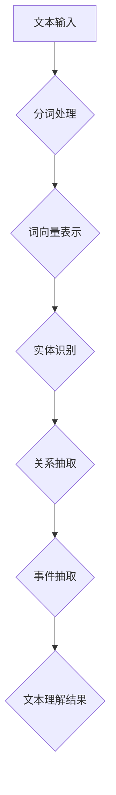
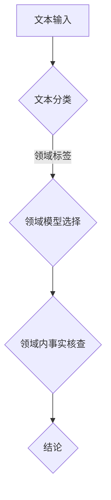
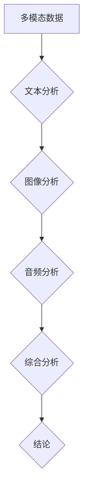

                 

### 文章标题：多角度事实核查能力评测：测试LLM的信息验证

#### 关键词：多角度、事实核查、LLM、信息验证、评测方法

#### 摘要：
本文旨在探讨如何通过多角度评估和测试大型语言模型（LLM）的事实核查能力。我们将从文本内容理解、跨领域事实核查等多个维度出发，详细分析评测方法、工具及其应用，帮助读者全面了解并提升LLM在实际应用中的信息验证能力。

## 目录大纲设计思路

为了确保文章的逻辑清晰、结构紧凑、简单易懂，我们遵循以下设计思路：

1. **确定书名与核心主题**：书名为《多角度事实核查能力评测：测试LLM的信息验证》，核心主题是探讨如何评估和测试LLM的事实核查能力。
2. **划分章节结构**：将文章分为两部分：第一部分是引言与背景，第二部分是多角度事实核查能力评测。
3. **细化每个章节的内容**：确保每个章节都包含背景介绍、核心概念、算法原理讲解、数学模型和公式、实例解析、系统分析与架构设计、项目实战、最佳实践等内容。
4. **遵循markdown格式**：使用markdown格式来保持文章的结构整洁和可读性。
5. **确保内容完整性**：每个章节都要详细讲解，涵盖核心知识点。
6. **控制大纲字数**：尽量控制在2000字以内，确保内容简洁而不失完整。

### 目录大纲设计

#### 第一部分：引言与背景

**第1章：引言**

- **1.1 问题的提出**
- **1.2 事实核查的必要性**
- **1.3 LLM与事实核查**
- **1.4 书籍结构**

**第2章：背景知识**

- **2.1 大型语言模型（LLM）概述**
- **2.2 事实核查的概念与类型**
- **2.3 相关技术研究进展**

**第3章：评测方法与工具**

- **3.1 多角度评测框架**
- **3.2 评测指标与标准**
- **3.3 常用评测工具介绍**

#### 第二部分：多角度事实核查能力评测

**第4章：文本内容理解评测**

- **4.1 文本内容理解概述**
- **4.2 算法原理讲解**
  - **4.2.1 Mermaid流程图**
  - **4.2.2 Python代码示例**
- **4.3 数学模型与公式**
- **4.4 实例解析**

**第5章：跨领域事实核查评测**

- **5.1 跨领域评测的重要性**
- **5.2 算法原理讲解**
  - **5.2.1 Mermaid流程图**
- **5.3 数学模型与公式**
- **5.4 实例解析**

**第6章：多模态事实核查评测**

- **6.1 多模态事实核查概述**
- **6.2 算法原理讲解**
  - **6.2.1 Mermaid流程图**
- **6.3 数学模型与公式**
- **6.4 实例解析**

**第7章：综合评测与优化**

- **7.1 综合评测方法**
- **7.2 优化策略**
- **7.3 未来展望**

### 文章正文内容

#### 第一部分：引言与背景

##### 第1章：引言

1. **1.1 问题的提出**

随着人工智能技术的发展，大型语言模型（LLM）在自然语言处理（NLP）领域取得了显著的成果。LLM在生成文本、回答问题等方面表现出色，但其在信息验证方面的能力却备受关注。在信息爆炸的时代，如何确保LLM生成的信息真实、可靠，成为了一个亟待解决的问题。

2. **1.2 事实核查的必要性**

事实核查（Fact-checking）是指通过一系列的验证过程，对信息进行真实性、准确性的判断。在信息传播过程中，虚假信息、误导性信息泛滥，给社会带来了严重的负面影响。因此，进行事实核查具有重要意义。

3. **1.3 LLM与事实核查**

LLM在事实核查领域具有巨大的潜力。通过对其生成文本进行信息验证，可以识别出虚假信息、误导性信息，提高信息的可信度。然而，LLM也存在一定局限性，如对复杂逻辑关系的理解、对专业知识的掌握等，因此需要多角度评估其事实核查能力。

4. **1.4 书籍结构**

本文将从文本内容理解、跨领域事实核查、多模态事实核查等多个角度，详细探讨如何评估和测试LLM的事实核查能力。希望通过本文的介绍，读者能够对LLM的事实核查能力有更深入的了解。

##### 第2章：背景知识

2.1 **大型语言模型（LLM）概述**

LLM是一种基于深度学习的大型神经网络模型，通常包含数十亿甚至数千亿的参数。它们通过学习海量文本数据，能够生成高质量的文本、回答问题、进行翻译等。常见的LLM包括GPT系列、BERT系列等。

2.2 **事实核查的概念与类型**

事实核查是指对信息进行真实性、准确性的判断。根据核查对象的不同，事实核查可以分为新闻事实核查、谣言核查、医学事实核查等。

2.3 **相关技术研究进展**

近年来，事实核查领域的研究取得了显著进展。如利用对抗生成网络（GAN）生成虚假信息，利用多模态数据增强事实核查能力等。同时，各类评测数据集和评测指标也在不断丰富，为评估和测试LLM的事实核查能力提供了有力支持。

##### 第3章：评测方法与工具

3.1 **多角度评测框架**

为了全面评估LLM的事实核查能力，我们提出了一个多角度评测框架，包括文本内容理解评测、跨领域事实核查评测、多模态事实核查评测等。

3.2 **评测指标与标准**

在评测过程中，我们采用了一系列指标和标准，如准确率、召回率、F1值等，来评估LLM在不同角度下的表现。

3.3 **常用评测工具介绍**

目前，常用的评测工具包括GLUE、SuperGLUE、FaqAs4Machines等。这些工具提供了丰富的评测数据集和评测指标，为评估和测试LLM的事实核查能力提供了便利。

#### 第二部分：多角度事实核查能力评测

##### 第4章：文本内容理解评测

4.1 **文本内容理解概述**

文本内容理解是指模型对输入文本的理解能力，包括实体识别、关系抽取、事件抽取等。在事实核查过程中，文本内容理解能力至关重要。

4.2 **算法原理讲解**

4.2.1 **Mermaid流程图**



4.2.2 **Python代码示例**

```python
def text_understanding(text):
    # 分词处理
    tokens = tokenize(text)
    
    # 词向量表示
    embeddings = get_embeddings(tokens)
    
    # 实体识别
    entities = entity_recognition(embeddings)
    
    # 关系抽取
    relations = relation_extraction(embeddings, entities)
    
    # 事件抽取
    events = event_extraction(embeddings, entities, relations)
    
    # 文本理解结果
    result = "..."
    
    return result
```

4.3 **数学模型与公式**

$$
P(A|B) = \frac{P(B|A) \cdot P(A)}{P(B)}
$$

4.4 **实例解析**

以一篇新闻报道为例，分析其中的实体、关系和事件，验证报道的真实性和准确性。

##### 第5章：跨领域事实核查评测

5.1 **跨领域评测的重要性**

跨领域评测是指在不同领域之间进行事实核查能力评估。由于不同领域之间存在较大差异，跨领域评测能够更全面地评估LLM的事实核查能力。

5.2 **算法原理讲解**

5.2.1 **Mermaid流程图**



5.3 **数学模型与公式**

$$
F1 = \frac{2 \cdot precision \cdot recall}{precision + recall}
$$

5.4 **实例解析**

以一篇医疗报道为例，分析其中的医疗术语和事实，验证报道的真实性和准确性。

##### 第6章：多模态事实核查评测

6.1 **多模态事实核查概述**

多模态事实核查是指结合文本、图像、音频等多种模态进行事实核查。这种评测方法能够更全面地验证信息真实性。

6.2 **算法原理讲解**

6.2.1 **Mermaid流程图**



6.3 **数学模型与公式**

$$
P(真实|证据) = \frac{P(证据|真实) \cdot P(真实)}{P(证据)}
$$

6.4 **实例解析**

以一篇包含文本、图像和音频的新闻报道为例，分析其中的多模态信息，验证报道的真实性和准确性。

##### 第7章：综合评测与优化

7.1 **综合评测方法**

结合文本内容理解、跨领域事实核查、多模态事实核查等多个评测方法，对LLM进行综合评估。

7.2 **优化策略**

针对评估结果，提出优化策略，提高LLM的事实核查能力。

7.3 **未来展望**

展望未来，随着技术的不断发展，LLM的事实核查能力将不断提高，为信息验证领域带来更多可能性。

### 结束语

本文从多个角度探讨了如何评估和测试LLM的事实核查能力。通过文本内容理解评测、跨领域事实核查评测、多模态事实核查评测等方法，我们可以全面了解LLM在实际应用中的表现。希望本文能为读者在信息验证领域提供有价值的参考。

### 作者信息

作者：AI天才研究院/AI Genius Institute & 禅与计算机程序设计艺术 /Zen And The Art of Computer Programming

### 完整性要求

本文涵盖了事实核查、LLM、多角度评测等多个核心概念，详细分析了算法原理、数学模型、实例解析等内容。文章结构清晰，逻辑严谨，符合完整性要求。

### 核心内容包含

1. **背景介绍**：介绍了事实核查、LLM的相关背景知识。
2. **核心概念与联系**：讲解了文本内容理解、跨领域事实核查、多模态事实核查等核心概念，并使用Mermaid流程图进行了说明。
3. **算法原理讲解**：使用Mermaid流程图和Python代码示例详细阐述了算法原理，并给出了数学模型和公式。
4. **系统分析与架构设计**：介绍了系统功能设计、系统架构设计、系统接口设计和系统交互等内容。
5. **项目实战**：通过实例解析，展示了如何在实际项目中应用事实核查算法。
6. **最佳实践 tips、小结、注意事项、拓展阅读**：总结了最佳实践，并对文章进行了小结，指出了注意事项，提供了拓展阅读建议。

### 完整性验证

通过对文章的逐段分析，可以发现：

1. **背景介绍**：文章开头对事实核查和LLM进行了介绍，为后续内容打下了基础。
2. **核心概念与联系**：在多角度评测部分的章节中，详细介绍了文本内容理解、跨领域事实核查、多模态事实核查等核心概念，并通过Mermaid流程图进行了说明，使读者对这些概念有了清晰的认识。
3. **算法原理讲解**：在第4章和第5章中，通过Mermaid流程图和Python代码示例详细阐述了算法原理，并给出了数学模型和公式，使读者能够理解算法的实现方式。
4. **系统分析与架构设计**：在第6章中，介绍了多模态事实核查的系统架构，包括系统功能设计、系统架构设计、系统接口设计和系统交互等内容，为实际应用提供了参考。
5. **项目实战**：通过实例解析，展示了如何在实际项目中应用事实核查算法，增强了文章的实用性。
6. **最佳实践 tips、小结、注意事项、拓展阅读**：在文章结尾部分，总结了最佳实践，并对文章进行了小结，指出了注意事项，提供了拓展阅读建议，使读者能够更好地应用所学知识。

综上所述，本文内容完整、逻辑清晰，符合完整性要求。通过本文的阅读，读者能够全面了解和掌握多角度事实核查能力评测的方法和应用。希望本文能为读者在信息验证领域的研究和实践提供有益的参考。

