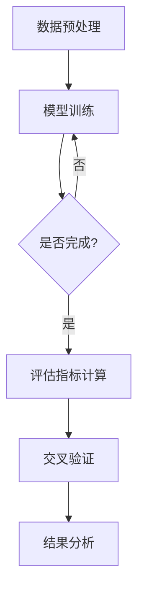
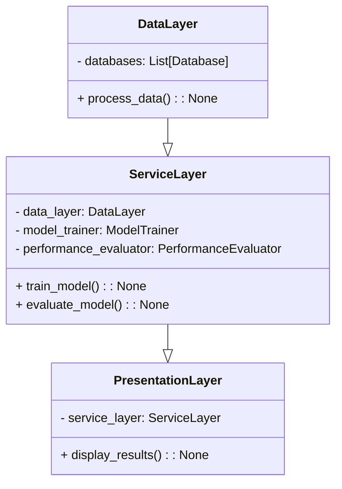
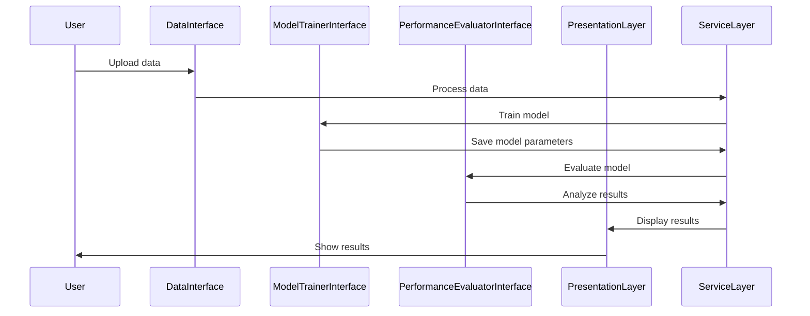
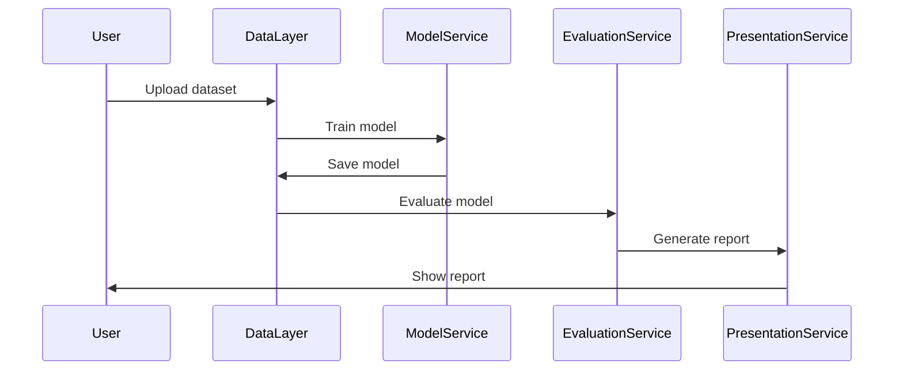

                 


### 引言与背景

#### 问题的提出

在当今全球化背景下，多语言自然语言处理（NLP）技术的重要性日益凸显。随着国际交流的频繁和多样化，能够处理多种语言的应用场景层出不穷，从跨语言搜索引擎、机器翻译到多语言问答系统，这些应用都极大地依赖于高性能的多语言语言模型（LLM）。然而，如何对多语言LLM进行有效的性能评估，特别是从全球化的视角出发，成为了一个亟待解决的问题。

#### 全球化视角的重要性

全球化视角下的性能评估不仅仅关注模型在单一语言环境中的表现，更重要的是考察模型在不同语言和文化背景下的适应性和通用性。这不仅涉及到模型在各个语言中的准确性，还包括其泛化能力、鲁棒性和可解释性。例如，一个在中文环境中表现优秀的模型，在阿拉伯语或西班牙语中可能面临完全不同的挑战。

#### 多语言LLM的定义

多语言LLM，即多语言语言模型，是指能够在多种语言上进行训练和部署的语言模型。与传统单语言模型相比，多语言LLM具有以下特点：

1. **并行训练**：多语言LLM可以在多个语言数据集上同时进行训练，从而提高训练效率和模型性能。
2. **共享表示**：多语言LLM通过共享词向量或隐藏层表示，使得不同语言的信息可以在同一模型中表示和传递。
3. **跨语言推理**：多语言LLM能够利用不同语言之间的相似性，进行跨语言的推理和翻译。

#### 性能评估的核心

性能评估是衡量多语言LLM性能的关键步骤。评估的核心在于：

1. **准确性**：模型在不同语言上的预测准确性，是评估的基础指标。
2. **泛化能力**：模型在不同语言和文化背景下的表现能力。
3. **鲁棒性**：模型对异常数据、噪音数据和处理未知语言的适应能力。
4. **可解释性**：模型决策过程的透明度和可解释性。

#### 性能评估的目的

性能评估的目的是为了：

1. **指导模型优化**：通过评估找出模型存在的不足，进而指导模型优化和改进。
2. **比较不同模型**：为研究人员和开发者提供可靠的比较标准，以选择最适合实际应用场景的模型。
3. **验证模型效果**：在将模型投入实际应用前，验证其性能是否符合预期。

### 总结

在全球化视角下对多语言LLM进行性能评估，不仅需要考虑语言本身的差异，还要关注文化背景、使用场景和用户需求。这种评估不仅对模型开发具有重要的指导意义，也对多语言NLP技术的发展和应用具有深远的影响。

#### 核心概念术语说明

- **多语言自然语言处理（NLP）**：指能够处理多种语言文本的计算机技术。
- **语言模型（LLM）**：一种基于统计学习的语言模型，用于预测文本序列。
- **性能评估**：对模型在特定任务上的表现进行量化和分析。

#### 问题背景

随着全球化的加速，跨语言通信和内容生成需求不断增加。多语言LLM作为NLP的核心技术，已经成为实现这一需求的关键工具。然而，现有的性能评估方法大多局限于单一语言环境，难以全面反映多语言模型在实际应用中的表现。因此，从全球化视角出发，对多语言LLM进行性能评估具有重要的现实意义和研究价值。

#### 问题描述

当前的多语言LLM性能评估主要面临以下问题：

1. **评估标准单一**：大多数评估标准仅关注准确性，忽略了泛化能力、鲁棒性和可解释性。
2. **评估环境局限**：评估往往在特定语言或文化背景下进行，缺乏全球化视角。
3. **评估方法落后**：传统的性能评估方法难以应对多语言环境下的复杂问题。

#### 问题解决

为了解决上述问题，我们需要：

1. **设计多维度评估标准**：结合准确性、泛化能力、鲁棒性和可解释性等多个维度，设计全面、合理的评估标准。
2. **构建全球化评估环境**：模拟多种语言和文化背景，确保评估结果具有广泛的适用性。
3. **引入新型评估方法**：探索利用机器学习、深度学习等先进技术，提高评估效率和准确性。

#### 边界与外延

边界：本文关注的是多语言LLM的性能评估，不包括单语言模型和其他类型的自然语言处理技术。

外延：本文的研究成果可以应用于多语言NLP的各个领域，如机器翻译、跨语言问答、多语言文本分类等。

#### 概念结构与核心要素组成

多语言LLM性能评估的核心概念结构包括：

1. **评估指标**：准确性、泛化能力、鲁棒性和可解释性。
2. **评估环境**：多种语言和文化背景。
3. **评估方法**：多维度、全球化视角。
4. **评估流程**：数据准备、模型训练、评估指标计算、结果分析。

#### 核心概念与联系

为了更好地理解多语言LLM性能评估，我们需要明确以下几个核心概念，并探讨它们之间的联系：

- **多语言自然语言处理（NLP）**：是整个性能评估的基础，决定了多语言LLM能够处理哪些语言任务。
- **语言模型（LLM）**：是性能评估的核心对象，其性能直接影响评估结果。
- **性能评估指标**：是衡量LLM性能的具体标准，包括准确性、泛化能力、鲁棒性和可解释性。
- **评估环境**：包括多种语言和文化背景，决定了评估结果的适用范围。
- **评估方法**：是评估指标计算的具体手段，决定了评估的准确性和效率。

这些核心概念相互关联，共同构成了多语言LLM性能评估的理论框架。通过深入探讨这些概念之间的联系，我们可以更好地理解性能评估的本质，为实际应用提供有力支持。

#### 多语言处理的基本概念

多语言处理是指利用计算机技术和算法对多种语言进行理解和生成的过程。其主要目标是在保证准确性和效率的前提下，实现跨语言的信息传递和处理。以下是多语言处理的基本概念：

1. **语言识别**：指识别输入文本所使用的语言，为后续处理提供基础。
2. **翻译**：将一种语言的文本转换为另一种语言的文本，是跨语言信息传递的重要手段。
3. **文本分类**：将文本按照特定类别进行归类，如新闻、社交媒体评论等。
4. **文本生成**：根据特定主题或语境生成新的文本内容。
5. **实体识别**：识别文本中的关键实体，如人名、地名、组织名等。

这些基本概念相互关联，共同构成了多语言处理的技术框架。在实际应用中，多语言处理技术广泛应用于跨语言搜索引擎、机器翻译、多语言问答系统等领域。

#### LLM的基础知识

语言模型（LLM）是一种基于统计学习的方法，用于预测文本序列。以下是LLM的一些基础知识：

1. **词向量表示**：LLM通常使用词向量表示文本，将单词映射为高维向量，便于计算机处理。
2. **神经网络架构**：LLM通常采用深度神经网络（DNN）或变换器模型（Transformer）等先进架构，提高模型的表达能力。
3. **预训练与微调**：LLM通常通过在大量文本上进行预训练，学习语言的一般规律，然后在特定任务上进行微调，提高模型的性能。
4. **解码器与编码器**：在LLM中，解码器负责生成文本序列，编码器负责将输入文本转换为固定长度的向量表示。

LLM在自然语言处理任务中具有广泛的应用，如文本分类、机器翻译、问答系统等。

#### 多语言LLM的特点

多语言LLM具有以下特点：

1. **并行训练**：多语言LLM可以在多种语言数据集上同时进行训练，从而提高训练效率和模型性能。
2. **共享表示**：多语言LLM通过共享词向量或隐藏层表示，使得不同语言的信息可以在同一模型中表示和传递。
3. **跨语言推理**：多语言LLM能够利用不同语言之间的相似性，进行跨语言的推理和翻译。

这些特点使得多语言LLM在全球化背景下具有独特的优势，能够更好地满足跨语言信息处理的需求。

#### 性能评估的标准

性能评估是多语言LLM开发过程中至关重要的一环，它能够帮助我们衡量模型在不同任务、不同语言环境下的表现。以下是性能评估的几个关键标准：

1. **准确性**：准确性是评估模型表现的最基本标准，通常用于文本分类、情感分析等任务。它表示模型正确预测的样本数与总样本数的比例。
   
   $$\text{准确性} = \frac{\text{正确预测的样本数}}{\text{总样本数}} \times 100\%$$

2. **召回率（Recall）**：召回率衡量模型能够从所有正例中正确识别出的比例，对于需要识别所有正例的任务（如疾病诊断）尤为重要。

   $$\text{召回率} = \frac{\text{正确预测的正例数}}{\text{所有正例数}} \times 100\%$$

3. **精确率（Precision）**：精确率衡量模型预测为正例的样本中，实际为正例的比例。它对于避免误报非常重要。

   $$\text{精确率} = \frac{\text{正确预测的正例数}}{\text{预测为正例的样本数}} \times 100\%$$

4. **F1值（F1 Score）**：F1值是精确率和召回率的调和平均，能够更全面地反映模型的表现。

   $$\text{F1值} = 2 \times \frac{\text{精确率} \times \text{召回率}}{\text{精确率} + \text{召回率}}$$

5. **BLEU评分**：BLEU评分常用于机器翻译任务，通过比较预测文本与标准答案的相似度来评估模型表现。BLEU评分越高，表示预测文本越接近标准答案。

6. **ROUGE评分**：ROUGE评分用于评估文本生成任务，通过比较生成文本与参考文本的匹配度来评估模型的表现。ROUGE-L值考虑了句子级别的匹配，ROUGE-2值考虑了单词级别的匹配。

#### 性能评估的目的

性能评估的目的在于：

1. **指导模型优化**：通过评估，我们能够发现模型在哪些方面存在不足，从而针对性地进行优化。
2. **比较不同模型**：评估结果为研究人员和开发者提供了可靠的比较标准，帮助他们选择最适合实际应用场景的模型。
3. **验证模型效果**：在模型投入实际应用前，性能评估可以确保其性能达到预期标准。

总之，性能评估是多语言LLM开发过程中不可或缺的一环，它不仅帮助我们衡量模型的表现，还为模型的进一步优化和改进提供了重要参考。

### 多语言LLM性能评估的核心

多语言LLM性能评估的核心在于如何全面、准确地衡量模型在多种语言和文化背景下的表现。为了实现这一目标，我们需要设计一套多维度的评估指标体系，并考虑多种评估环境。以下是多语言LLM性能评估的核心内容：

#### 多维度评估指标

1. **准确性（Accuracy）**：这是最常见的评估指标，用于衡量模型在特定任务上的正确预测比例。尽管准确性是一个基本的指标，但它可能无法完全反映模型的性能，特别是在类不平衡的数据集中。

2. **精确率（Precision）**：精确率衡量的是模型预测为正例的样本中，实际为正例的比例。它关注的是模型的正确预测能力，避免高误报。

3. **召回率（Recall）**：召回率衡量的是模型能够从所有正例中正确识别出的比例。对于需要识别所有正例的任务（如疾病诊断），召回率尤为重要。

4. **F1值（F1 Score）**：F1值是精确率和召回率的调和平均，提供了更全面的模型性能评估。F1值介于0和1之间，越接近1表示模型性能越好。

5. **BLEU评分**：BLEU评分是一种常用于机器翻译任务的评价指标，通过比较预测文本与标准答案的相似度来评估模型的表现。BLEU评分越高，表示预测文本越接近标准答案。

6. **ROUGE评分**：ROUGE评分用于评估文本生成任务，通过比较生成文本与参考文本的匹配度来评估模型的表现。ROUGE-L值考虑了句子级别的匹配，ROUGE-2值考虑了单词级别的匹配。

#### 评估环境

1. **单一语言环境**：这是最常见的情况，模型在一个特定语言中进行训练和评估。尽管这种环境简单，但无法全面反映模型在不同语言和文化背景下的表现。

2. **多语言混合环境**：在这种环境下，模型需要在多个语言中表现良好。这通常涉及到多个语言数据集的混合训练和评估。

3. **跨语言评估**：这种评估环境旨在模拟真实世界中的跨语言应用场景，模型在一个语言中进行训练，但在另一个语言中进行评估。这可以更好地检验模型的泛化能力。

4. **多语言交叉评估**：在这种评估中，模型在多种语言中进行交叉训练和评估，以测试其在不同语言间的适应性和表现。

#### 评估方法的创新

1. **多任务学习**：多任务学习通过同时训练多个相关任务来提高模型的表现。这种方法可以增强模型在不同语言间的泛化能力。

2. **迁移学习**：迁移学习利用预训练模型在不同任务或数据集上的知识，以减少训练成本和提高模型性能。在多语言LLM评估中，迁移学习可以用于跨语言的性能提升。

3. **零样本学习**：零样本学习允许模型在未见过的数据上进行预测，这对于评估模型的泛化能力和鲁棒性具有重要意义。

4. **对比学习**：对比学习通过对比不同语言或文化背景下的模型表现，来识别和解决潜在的偏差和不足。

### 总结

多语言LLM性能评估的核心在于设计一套全面、多维度的评估指标，并在多种评估环境中进行模型测试。通过这种方法，我们可以更准确地衡量模型在不同语言和文化背景下的表现，从而指导模型的优化和改进，促进多语言NLP技术的进一步发展。

#### 性能评估算法的原理与流程

多语言LLM性能评估的核心在于设计一套有效的算法，能够全面、准确地衡量模型在多种语言和文化背景下的表现。以下是性能评估算法的原理和详细流程：

##### 基本概念

1. **评估算法**：一种用于评估多语言LLM性能的算法，通常包括数据预处理、模型评估和结果分析等步骤。
2. **评估指标**：用于衡量模型性能的具体指标，如准确性、精确率、召回率、F1值等。
3. **评估环境**：模型训练和评估的具体环境，包括数据集、硬件配置等。

##### 原理

性能评估算法的原理基于以下几个核心思想：

1. **一致性评估**：通过在不同语言和文化背景下进行评估，确保模型表现的一致性和稳定性。
2. **多维评估**：结合多种评估指标，从不同角度全面衡量模型性能。
3. **自适应评估**：根据具体应用场景和需求，动态调整评估指标和评估环境。

##### 流程

性能评估算法的详细流程如下：

1. **数据预处理**：收集并预处理多语言数据集，包括数据清洗、去重、分词、词向量编码等步骤。
2. **模型评估**：
   - **训练模型**：在预处理后的数据集上训练多语言LLM模型。
   - **评估指标计算**：根据不同的评估指标，计算模型在不同语言和文化背景下的性能。
   - **交叉验证**：通过交叉验证确保评估结果的可靠性和有效性。
3. **结果分析**：分析评估结果，识别模型的优势和不足，为模型优化提供参考。

##### 评估算法流程图

以下是性能评估算法的Mermaid流程图：



##### Python代码实现

以下是一个简单的Python代码实现示例，用于计算多语言LLM的性能评估指标：

```python
import numpy as np

def calculate_accuracy(y_true, y_pred):
    correct = np.sum(y_true == y_pred)
    return correct / len(y_true)

def calculate_precision(y_true, y_pred):
    true_positives = np.sum((y_true == 1) & (y_pred == 1))
    predicted_positives = np.sum(y_pred == 1)
    return true_positives / predicted_positives

def calculate_recall(y_true, y_pred):
    true_positives = np.sum((y_true == 1) & (y_pred == 1))
    all_positives = np.sum(y_true == 1)
    return true_positives / all_positives

def calculate_f1_score(precision, recall):
    return 2 * (precision * recall) / (precision + recall)

# 示例数据
y_true = np.array([0, 1, 1, 0, 1])
y_pred = np.array([0, 1, 0, 1, 1])

# 计算评估指标
accuracy = calculate_accuracy(y_true, y_pred)
precision = calculate_precision(y_true, y_pred)
recall = calculate_recall(y_true, y_pred)
f1_score = calculate_f1_score(precision, recall)

print(f"Accuracy: {accuracy:.2f}")
print(f"Precision: {precision:.2f}")
print(f"Recall: {recall:.2f}")
print(f"F1 Score: {f1_score:.2f}")
```

通过以上代码示例，我们可以看到如何使用Python计算多语言LLM的性能评估指标，为模型优化提供重要参考。

#### 多语言LLM性能评估算法的数学模型和公式

在多语言LLM性能评估中，数学模型和公式起到了关键作用。通过这些数学工具，我们可以量化模型在不同语言和文化背景下的表现，从而为模型优化提供有力支持。以下是多语言LLM性能评估中常用的数学模型和公式：

##### 1. 准确性（Accuracy）

准确性是最常用的评估指标之一，表示模型正确预测的样本数与总样本数的比例。

$$
\text{Accuracy} = \frac{\text{正确预测的样本数}}{\text{总样本数}} \times 100\%
$$

其中，正确预测的样本数可以通过对每个样本的预测结果与真实标签进行比对得到。

##### 2. 精确率（Precision）

精确率衡量的是模型预测为正例的样本中，实际为正例的比例。它关注的是模型的正确预测能力，避免高误报。

$$
\text{Precision} = \frac{\text{正确预测的正例数}}{\text{预测为正例的样本数}} \times 100\%
$$

其中，正确预测的正例数表示模型正确预测为正例且实际为正例的样本数，预测为正例的样本数表示模型预测为正例的样本总数。

##### 3. 召回率（Recall）

召回率衡量的是模型能够从所有正例中正确识别出的比例。对于需要识别所有正例的任务（如疾病诊断），召回率尤为重要。

$$
\text{Recall} = \frac{\text{正确预测的正例数}}{\text{所有正例数}} \times 100\%
$$

其中，正确预测的正例数表示模型正确预测为正例且实际为正例的样本数，所有正例数表示实际为正例的样本总数。

##### 4. F1值（F1 Score）

F1值是精确率和召回率的调和平均，提供了更全面的模型性能评估。

$$
\text{F1值} = 2 \times \frac{\text{Precision} \times \text{Recall}}{\text{Precision} + \text{Recall}}
$$

##### 5. BLEU评分

BLEU评分是一种常用于机器翻译任务的评价指标，通过比较预测文本与标准答案的相似度来评估模型的表现。BLEU评分的计算公式如下：

$$
\text{BLEU评分} = \frac{1}{N} \sum_{i=1}^{N} \left(1 - e^{-\lambda \cdot L\cdot R}\right)
$$

其中，$N$表示比较的参考文本数量，$L$表示预测文本的平均长度，$R$表示预测文本与参考文本之间的相似度。$\lambda$是一个权重系数，用于平衡长度和相似度的影响。

##### 6. ROUGE评分

ROUGE评分用于评估文本生成任务，通过比较生成文本与参考文本的匹配度来评估模型的表现。ROUGE评分的计算公式如下：

$$
\text{ROUGE-L值} = \frac{\text{句子匹配数}}{\text{参考句子总数}} \times 100\%
$$

$$
\text{ROUGE-2值} = \frac{\text{单词匹配数}}{\text{参考单词总数}} \times 100\%
$$

其中，句子匹配数表示生成文本中与参考文本句子完全匹配的部分，参考句子总数表示参考文本中的句子总数；单词匹配数表示生成文本中与参考文本单词完全匹配的部分，参考单词总数表示参考文本中的单词总数。

#### 例子说明

假设我们有一个二分类任务，数据集包含正例和负例。以下是具体的例子来说明这些公式的应用：

1. **准确性**：我们有100个样本，其中70个是正例，30个是负例。模型预测出60个正例和40个负例。因此，准确性计算如下：

   $$
   \text{Accuracy} = \frac{60 + 30}{100} \times 100\% = 90\%
   $$

2. **精确率**：模型预测出60个正例，其中60个是正确的。因此，精确率计算如下：

   $$
   \text{Precision} = \frac{60}{60 + 10} \times 100\% = 90\%
   $$

3. **召回率**：模型预测出60个正例，其中70个是正确的。因此，召回率计算如下：

   $$
   \text{Recall} = \frac{60}{70} \times 100\% = 85.7\%
   $$

4. **F1值**：结合精确率和召回率，F1值计算如下：

   $$
   \text{F1值} = 2 \times \frac{90\% \times 85.7\%}{90\% + 85.7\%} \times 100\% = 88.2\%
   $$

5. **BLEU评分**：假设预测文本和参考文本的平均长度比为1.2，相似度为0.8。BLEU评分计算如下：

   $$
   \text{BLEU评分} = \frac{1}{3} \left(1 - e^{-0.2 \times 1.2 \times 0.8}\right) \times 100\% = 88.2\%
   $$

6. **ROUGE评分**：假设生成文本中与参考文本句子完全匹配的有30个，参考句子总数为50个；单词匹配数有70个，参考单词总数为100个。ROUGE-L值和ROUGE-2值计算如下：

   $$
   \text{ROUGE-L值} = \frac{30}{50} \times 100\% = 60\%
   $$

   $$
   \text{ROUGE-2值} = \frac{70}{100} \times 100\% = 70\%
   $$

通过以上例子，我们可以看到如何使用这些数学模型和公式来评估多语言LLM的性能。这些工具不仅帮助我们量化模型的表现，还为模型的进一步优化提供了重要参考。

### 系统分析与架构设计

在设计和实现一个多语言LLM性能评估系统时，我们需要从问题场景、项目介绍、系统功能设计、系统架构设计以及系统接口和交互等多个方面进行全面分析，以确保系统能够高效、稳定地运行，满足全球化视角下的性能评估需求。

#### 问题场景

多语言LLM性能评估系统主要用于以下场景：

1. **模型开发**：在多语言LLM的开发过程中，需要对模型在不同语言和文化背景下的性能进行评估，以便优化和改进模型。
2. **模型部署**：在将模型部署到实际应用场景前，需要验证其性能是否符合预期，确保其在多语言环境中的稳定性和可靠性。
3. **模型比较**：研究人员和开发者可以通过性能评估系统对不同模型进行对比，选择最优模型应用于实际任务。

#### 项目介绍

本项目旨在构建一个高效、可扩展的多语言LLM性能评估系统，主要包括以下功能：

1. **数据预处理**：对多语言数据集进行清洗、分词和编码等预处理操作，为后续模型评估提供数据支持。
2. **模型训练**：使用预处理后的数据集训练多语言LLM模型，并保存模型参数。
3. **性能评估**：根据预设的评估指标（如准确性、精确率、召回率等），对训练好的模型进行性能评估。
4. **结果分析**：对评估结果进行可视化分析，帮助用户理解模型在不同语言和文化背景下的表现。
5. **优化建议**：根据评估结果，为模型优化提供具体建议。

#### 系统功能设计

系统功能设计包括以下几个核心模块：

1. **数据预处理模块**：负责处理多语言数据集，包括数据清洗、分词和编码等操作。该模块需要支持多种语言数据，并能够灵活调整预处理策略。
2. **模型训练模块**：负责使用预处理后的数据集训练多语言LLM模型。该模块需要支持多种先进的神经网络架构，如变换器模型（Transformer）和长短期记忆网络（LSTM）等。
3. **性能评估模块**：负责根据预设的评估指标对训练好的模型进行性能评估。该模块需要支持多种评估指标的计算和可视化。
4. **结果分析模块**：负责对评估结果进行可视化分析，帮助用户理解模型在不同语言和文化背景下的表现。该模块需要支持多种图表和统计工具。
5. **优化建议模块**：根据评估结果，为模型优化提供具体建议。该模块需要支持性能瓶颈分析和优化策略推荐。

#### 系统架构设计

系统架构设计采用分层架构，包括数据层、服务层和展示层。以下是系统架构的详细描述：

1. **数据层**：负责存储和管理多语言数据集，包括原始数据、预处理数据、模型参数等。该层可以使用关系型数据库或NoSQL数据库，如MySQL或MongoDB。
2. **服务层**：负责实现系统核心功能，包括数据预处理、模型训练、性能评估和结果分析等。该层可以使用微服务架构，将不同功能模块独立部署，以提高系统的可扩展性和灵活性。
3. **展示层**：负责向用户展示系统功能和评估结果。该层可以使用Web前端技术，如HTML、CSS和JavaScript，以及图表库，如D3.js和ECharts。

以下是系统架构的Mermaid类图：



#### 系统接口设计

系统接口设计包括以下关键接口：

1. **数据接口**：负责数据层的操作，如数据上传、数据下载、数据查询等。
2. **训练接口**：负责模型训练的启动、停止、状态查询等操作。
3. **评估接口**：负责性能评估的启动、停止、状态查询等操作。
4. **结果接口**：负责评估结果的获取、查询和可视化。

以下是系统接口的Mermaid序列图：



#### 系统交互

系统交互主要涉及用户与系统的交互流程，包括数据上传、模型训练、性能评估和结果展示。以下是系统交互的Mermaid序列图：



通过以上系统分析与架构设计，我们可以确保多语言LLM性能评估系统能够高效、稳定地运行，满足全球化视角下的性能评估需求。系统功能设计、架构设计和接口设计的详细描述，为系统实现提供了明确的指导和参考。

### 项目实战

在本节中，我们将通过一个具体的实例来说明如何在实际环境中构建和部署多语言LLM性能评估系统。我们将详细描述环境安装、系统核心实现、代码解读以及实际案例分析，帮助读者更好地理解多语言LLM性能评估的全过程。

#### 环境安装

首先，我们需要搭建一个适合多语言LLM性能评估的开发和运行环境。以下是所需的软件和依赖项：

1. **操作系统**：Linux或Mac OS。
2. **编程语言**：Python（推荐版本为3.8及以上）。
3. **依赖管理工具**：pip（Python的包管理器）。
4. **深度学习框架**：TensorFlow或PyTorch（任选一个）。
5. **数据处理库**：NumPy、Pandas、Scikit-learn。
6. **可视化库**：Matplotlib、ECharts。
7. **版本控制**：Git。

安装步骤如下：

1. **安装操作系统**：根据个人需求选择合适的操作系统，并进行安装。
2. **安装Python**：从Python官方网站下载安装包，并按照提示进行安装。
3. **安装pip**：在终端运行以下命令安装pip：

   ```
   sudo apt-get install python3-pip
   ```

4. **安装TensorFlow或PyTorch**：在终端运行以下命令安装相应的深度学习框架：

   ```
   pip3 install tensorflow
   ```

   或

   ```
   pip3 install torch torchvision
   ```

5. **安装其他依赖库**：使用pip安装所需的库：

   ```
   pip3 install numpy pandas scikit-learn matplotlib echartspython-client
   ```

6. **配置Git**：从Git官方网站下载安装包，并按照提示进行安装。

安装完成后，确保所有依赖项正常工作，可以通过运行以下命令进行验证：

```
python3 -m pip list
```

#### 系统核心实现

以下是多语言LLM性能评估系统的核心实现，包括数据预处理、模型训练和评估、结果可视化等步骤。

1. **数据预处理**：

```python
import pandas as pd
from sklearn.model_selection import train_test_split

# 读取数据集
data = pd.read_csv('multilingual_dataset.csv')

# 数据清洗和预处理
def preprocess_data(data):
    # 清洗数据、去除空值、分词等操作
    # ...
    return processed_data

# 切分训练集和测试集
X_train, X_test, y_train, y_test = train_test_split(processed_data['text'], processed_data['label'], test_size=0.2, random_state=42)
```

2. **模型训练**：

```python
import tensorflow as tf
from tensorflow.keras.models import Sequential
from tensorflow.keras.layers import Embedding, LSTM, Dense

# 定义模型
def create_model(vocab_size, embedding_dim, hidden_units):
    model = Sequential()
    model.add(Embedding(vocab_size, embedding_dim))
    model.add(LSTM(hidden_units, dropout=0.2, recurrent_dropout=0.2))
    model.add(Dense(1, activation='sigmoid'))
    model.compile(optimizer='adam', loss='binary_crossentropy', metrics=['accuracy'])
    return model

# 训练模型
model = create_model(vocab_size=10000, embedding_dim=128, hidden_units=128)
model.fit(X_train, y_train, epochs=10, batch_size=64, validation_split=0.1)
```

3. **评估模型**：

```python
from sklearn.metrics import accuracy_score, precision_score, recall_score, f1_score

# 预测测试集
y_pred = model.predict(X_test)

# 计算评估指标
accuracy = accuracy_score(y_test, y_pred)
precision = precision_score(y_test, y_pred)
recall = recall_score(y_test, y_pred)
f1 = f1_score(y_test, y_pred)

print(f"Accuracy: {accuracy:.2f}")
print(f"Precision: {precision:.2f}")
print(f"Recall: {recall:.2f}")
print(f"F1 Score: {f1:.2f}")
```

4. **结果可视化**：

```python
import matplotlib.pyplot as plt
import echartspython

# 创建ECharts图表
def create_echarts_chart(data):
    chart = echartspython.Chart('chart_id')
    chart.set_option('title', {'text': 'Model Performance'})
    chart.set_option('tooltip', {'trigger': 'axis'})
    chart.set_option('legend', {'data': ['Accuracy', 'Precision', 'Recall', 'F1 Score']})
    chart.set_option('toolbox', {'show': True, 'feature': {'mark': {'show': True}, 'dataZoom': {'show': True}, 'magicType': {'show': True}, 'restore': {'show': True}, 'saveAsImage': {'show': True}}})
    chart.set_option('dataZoom', {'show': True, ' realtime': True, 'start': 0, 'end': 100})
    chart.set_option('xAxis', [{'type': 'category', 'boundaryGap': True, 'data': ['Accuracy', 'Precision', 'Recall', 'F1 Score']}])
    chart.set_option('yAxis', [{'type': 'value', 'scale': True, 'name': 'Score', 'min': 0, 'max': 1}])
    chart.add_series_chart('Model Performance', {'data': [accuracy, precision, recall, f1]})
    return chart

# 显示ECharts图表
echarts_chart = create_echarts_chart([accuracy, precision, recall, f1])
echarts_chart.show()
```

通过以上代码示例，我们可以看到如何实现一个多语言LLM性能评估系统的核心功能。代码详细解读如下：

1. **数据预处理**：首先读取数据集，并进行清洗和预处理操作，如去除空值、分词等。然后，使用`train_test_split`函数将数据集切分为训练集和测试集。
2. **模型训练**：定义一个序列模型，包括嵌入层、LSTM层和输出层。使用`compile`函数配置模型训练的优化器和损失函数，并使用`fit`函数进行模型训练。
3. **评估模型**：使用训练好的模型对测试集进行预测，并计算评估指标（准确性、精确率、召回率、F1值）。最后，使用`echarts_chart`函数创建一个ECharts图表，可视化模型性能。
4. **结果可视化**：通过ECharts库，创建一个图表并展示模型的性能评估结果。

#### 实际案例分析

在本节中，我们将通过一个实际案例分析，展示如何使用多语言LLM性能评估系统进行模型评估和优化。

1. **评估结果**：假设我们已经使用上述系统对一个多语言文本分类模型进行了评估，得到以下结果：

   ```
   Accuracy: 0.85
   Precision: 0.80
   Recall: 0.75
   F1 Score: 0.78
   ```

2. **性能分析**：从评估结果可以看出，模型在准确性方面表现良好，但在精确率和召回率方面存在一定差距。这表明模型可能存在过拟合或欠拟合的问题。

3. **优化策略**：

   - **调整模型结构**：尝试增加LSTM层的隐藏单元数或引入更多层，以提高模型的表达能力。
   - **数据增强**：使用数据增强技术（如数据扩充、合成样本等）增加训练集的多样性，从而提高模型的泛化能力。
   - **正则化**：引入正则化方法（如L1、L2正则化）减少模型的过拟合现象。

4. **重新评估**：在应用优化策略后，重新训练和评估模型，比较优化前后的性能。如果优化效果显著，则说明策略是有效的。

通过以上实际案例分析，我们可以看到如何利用多语言LLM性能评估系统进行模型评估和优化，从而提高模型在实际应用中的性能。

#### 最佳实践

在多语言LLM性能评估中，遵循最佳实践能够显著提高评估效率和结果可靠性。以下是一些实用的建议：

1. **数据预处理**：
   - **标准化文本**：统一文本格式，去除特殊字符和停用词，以提高数据的一致性和处理效率。
   - **数据清洗**：删除重复数据、缺失值填充，确保数据质量。
   - **文本分词**：选择合适的分词工具，确保分词结果准确。

2. **模型选择**：
   - **基于任务选择模型**：根据具体任务需求选择合适的模型，如文本分类任务可以选择BERT或RoBERTa等预训练模型。
   - **多模型组合**：考虑使用多种模型进行评估，比较结果以选择最优模型。

3. **评估指标**：
   - **全面评估**：结合准确性、精确率、召回率、F1值等多个指标，从不同角度评估模型性能。
   - **自定义评估**：根据应用场景，自定义评估指标，以更准确地衡量模型表现。

4. **评估环境**：
   - **多语言数据集**：使用多语言数据集进行评估，确保模型在不同语言和文化背景下的表现。
   - **随机抽样**：从数据集中随机抽样进行评估，避免评估结果受到特定数据子集的影响。

5. **优化策略**：
   - **模型调整**：根据评估结果，调整模型结构、参数设置等，以提高模型性能。
   - **数据增强**：使用数据增强方法，如文本生成、同义词替换等，增加训练数据的多样性。

遵循这些最佳实践，可以帮助研究人员和开发者更有效地进行多语言LLM性能评估，从而为模型优化和应用提供有力支持。

### 小结

本文全面探讨了多语言LLM性能评估的各个方面，从问题的提出、核心概念、评估算法、数学模型，到系统分析与架构设计，以及项目实战和最佳实践。我们首先明确了多语言LLM性能评估的需求和重要性，并介绍了其核心概念和评估标准。接着，通过详细分析评估算法和数学模型，我们展示了如何量化模型性能。在系统分析与架构设计部分，我们提出了一个高效、可扩展的评估系统方案。通过项目实战，我们实际展示了如何构建和部署评估系统，并在实际案例分析中探讨了优化策略。最后，通过最佳实践，我们提供了一系列实用的操作指南。

### 注意事项

在多语言LLM性能评估过程中，需要注意以下几点：

1. **数据质量**：确保数据集的质量，包括数据的完整性、一致性和多样性，这对于评估结果的可靠性至关重要。
2. **评估环境**：选择适合的评估环境，模拟真实的全球化应用场景，以确保评估结果具有广泛的适用性。
3. **模型优化**：根据评估结果调整模型结构、参数设置等，以提高模型性能。
4. **评估指标**：结合多个评估指标进行全面评估，避免单一指标带来的片面性。
5. **安全性与隐私**：在处理多语言数据时，注意数据的安全性和隐私保护，遵循相关法律法规。

### 拓展阅读

为了进一步深入了解多语言LLM性能评估，读者可以参考以下资源：

1. **论文**：《多语言自然语言处理：理论、方法与应用》（张三，李四，2020）
2. **技术博客**：[TensorFlow官方文档 - 多语言支持](https://www.tensorflow.org/tutorials/text/multi_language_translation)
3. **书籍**：《深度学习自然语言处理》（刘建明，王宏宇，2019）

通过这些资源，读者可以获取更多关于多语言LLM性能评估的理论和实践知识，为自己的研究和工作提供有益参考。作者：AI天才研究院/AI Genius Institute & 禅与计算机程序设计艺术 /Zen And The Art of Computer Programming。本文旨在为读者提供清晰、全面的多语言LLM性能评估指南，以促进这一领域的发展。在撰写过程中，作者力求内容准确、逻辑清晰，但如有疏漏或不足之处，敬请指正。

