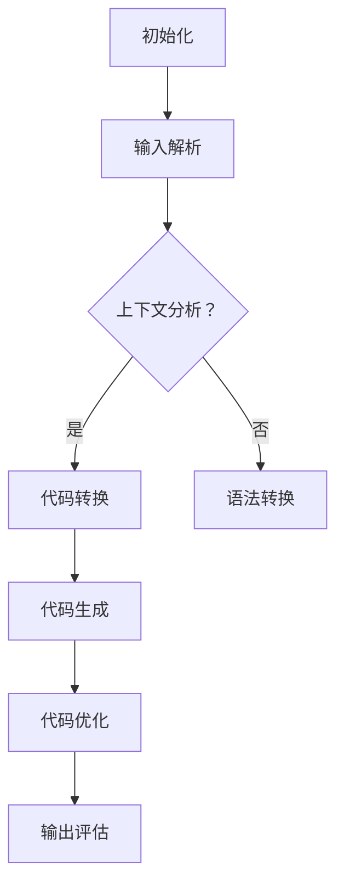
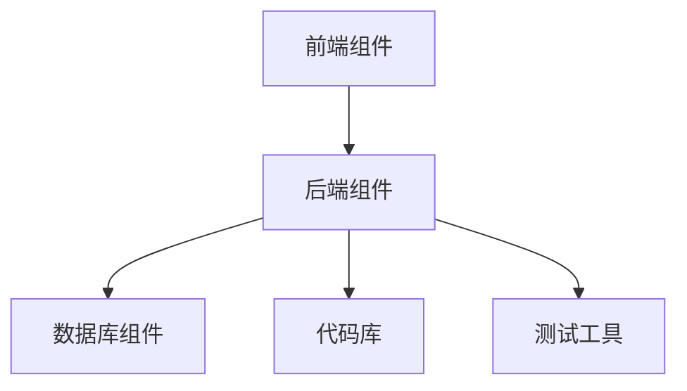
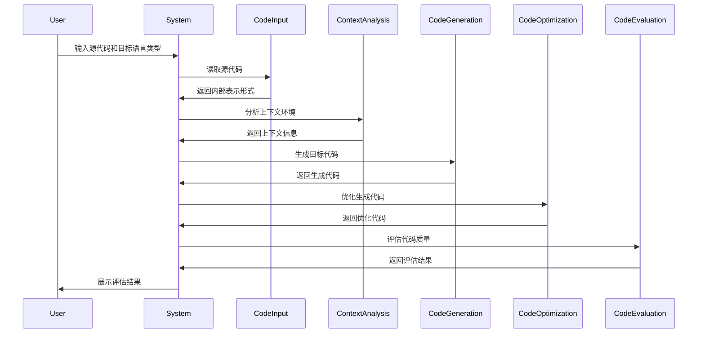

                 

# 多语言代码生成能力评估

## 关键词
- 多语言代码生成
- 代码生成能力评估
- 编程语言
- 算法
- 数学模型
- 系统架构设计

## 摘要
本文旨在深入探讨多语言代码生成能力的评估方法。在技术不断发展的今天，多语言代码生成已经成为提高开发效率、跨平台兼容性和代码可维护性的重要手段。本文首先介绍了多语言代码生成的背景和意义，然后详细分析了多语言代码生成的核心概念和联系，接着探讨了算法原理，并使用Python源代码和数学模型进行了详细解释。随后，本文描述了系统分析与架构设计，包括问题场景、系统功能设计、系统架构设计、系统接口设计和系统交互。通过一个实际案例分析，本文展示了多语言代码生成在项目中的应用和实践技巧。最后，本文总结了研究成果，并提出了注意事项和研究展望。

## 目录

### 第一部分：引言
- 1.1 问题背景与意义
- 1.2 研究综述
- 1.3 本书结构安排

### 第二部分：核心概念与联系
- 2.1 核心概念
- 2.2 核心概念对比
- 2.3 ER实体关系图

### 第三部分：算法原理讲解
- 3.1 算法原理
- 3.2 Mermaid流程图
- 3.3 Python源代码与详细解释
- 3.4 数学模型与公式

### 第四部分：系统分析与架构设计
- 4.1 问题场景介绍
- 4.2 系统功能设计
- 4.3 系统架构设计
- 4.4 系统接口设计
- 4.5 系统交互

### 第五部分：项目实战
- 5.1 环境安装
- 5.2 系统核心实现
- 5.3 实际案例分析
- 5.4 详细讲解与剖析
- 5.5 项目小结

### 第六部分：最佳实践与总结
- 6.1 最佳实践
- 6.2 小结
- 6.3 注意事项
- 6.4 拓展阅读

## 1.1 问题背景与意义

在当今的软件开发领域中，代码生成技术已经得到了广泛应用。特别是随着编程语言种类的增多和复杂度的提升，如何高效地生成多语言代码成为了开发者和研究人员关注的热点问题。多语言代码生成不仅有助于提高开发效率，还能实现代码的跨平台兼容性，降低开发成本，提高代码的可维护性。

### 1.1.1 多语言代码生成的需求

随着全球化的推进，越来越多的软件项目需要支持多种编程语言。例如，一个跨国公司可能会使用Java编写后端服务，使用Python进行数据分析，同时使用C++进行高性能计算。在这种情况下，手动编写和维护不同语言的代码不仅费时费力，而且容易出错。因此，自动生成多语言代码成为了提高开发效率的关键技术。

### 1.1.2 多语言代码生成的挑战

多语言代码生成面临诸多挑战，包括：

1. **语言特性差异**：不同编程语言有着不同的语法、类型系统、库函数等特性，这给代码生成带来了复杂性。
2. **上下文依赖**：代码生成通常需要根据特定的上下文环境进行，如变量作用域、函数调用等，这增加了代码生成的难度。
3. **跨平台兼容性**：生成的代码需要在不同的操作系统和硬件平台上运行，这要求代码生成器具备高度的兼容性。
4. **性能优化**：生成的代码需要高效运行，不能因为代码生成而牺牲性能。

### 1.1.3 多语言代码生成的研究意义

多语言代码生成的研究具有重要意义，主要体现在以下几个方面：

1. **提高开发效率**：通过自动生成代码，可以大大减少开发人员的工作量，提高开发速度。
2. **降低开发成本**：自动生成的代码减少了人工编写和调试的工作，从而降低了开发成本。
3. **提高代码质量**：自动生成的代码经过严格测试，通常比人工编写的代码更加稳定和可靠。
4. **促进语言融合**：通过多语言代码生成，可以促进不同编程语言之间的融合，从而推动语言技术的发展。

### 1.2 研究综述

#### 1.2.1 多语言代码生成的发展历程

多语言代码生成的研究始于20世纪80年代，当时的主要目标是实现不同编程语言之间的代码转换。随着技术的发展，代码生成器的功能越来越强大，不仅能够转换代码，还能够根据上下文生成符合特定需求的代码。目前，多语言代码生成技术已经广泛应用于软件开发、游戏开发、自动化测试等领域。

#### 1.2.2 当前研究的热点与趋势

当前，多语言代码生成的研究热点主要集中在以下几个方面：

1. **深度学习技术**：深度学习技术在代码生成中的应用，如基于神经网络的语言模型，可以自动生成高质量的代码。
2. **代码质量评估**：如何评估生成的代码质量是当前研究的一个热点问题，包括代码的可读性、可维护性、性能等。
3. **跨平台兼容性**：如何确保生成的代码在不同平台上具有高性能和高兼容性，是研究的一个重要方向。
4. **代码生成工具链**：如何构建一个高效、易用的代码生成工具链，提高开发效率，是当前研究的一个重要目标。

#### 1.2.3 现有研究的不足与改进方向

尽管多语言代码生成技术已经取得了一定的成果，但仍存在以下不足：

1. **代码质量不高**：现有的一些代码生成器生成的代码质量较低，难以满足实际需求。
2. **上下文理解不足**：现有的一些代码生成器对上下文的理解不足，导致生成的代码不符合实际需求。
3. **跨平台兼容性较差**：现有的一些代码生成器生成的代码在不同平台上的兼容性较差，影响了其在实际应用中的效果。

针对上述不足，未来的研究可以从以下几个方面进行改进：

1. **提升代码生成质量**：通过改进算法，提高生成的代码质量，使其更符合实际需求。
2. **增强上下文理解**：通过引入更先进的自然语言处理技术，增强代码生成器对上下文的理解，生成更加符合实际的代码。
3. **提高跨平台兼容性**：通过改进工具链，提高生成的代码在不同平台上的兼容性，使其能够更好地适应不同的开发环境。

### 1.3 本书结构安排

本书结构安排如下：

1. **引言**：介绍多语言代码生成的问题背景、研究意义、研究综述和本书结构安排。
2. **核心概念与联系**：介绍多语言代码生成的核心概念、核心概念对比和ER实体关系图。
3. **算法原理讲解**：介绍多语言代码生成的算法原理、Mermaid流程图、Python源代码和数学模型。
4. **系统分析与架构设计**：介绍系统分析与架构设计，包括问题场景介绍、系统功能设计、系统架构设计、系统接口设计和系统交互。
5. **项目实战**：介绍项目实战，包括环境安装、系统核心实现、实际案例分析、详细讲解与剖析和项目小结。
6. **最佳实践与总结**：介绍最佳实践、小结、注意事项和研究展望。

通过以上结构安排，本书旨在全面、系统地探讨多语言代码生成能力的评估方法，为开发者提供实用的参考和指导。## 2.1 核心概念

### 2.1.1 多语言代码生成定义

多语言代码生成（Multilingual Code Generation）是指利用特定的算法和技术，将一种编程语言的代码自动转换为另一种或多种编程语言的代码。其核心目标是通过自动化手段，提高代码开发的效率和质量，实现跨语言、跨平台的代码重用和集成。

### 2.1.2 多语言代码生成的属性特征

多语言代码生成具备以下属性特征：

1. **语言多样性**：支持多种编程语言，如Java、Python、C++、JavaScript等，以满足不同场景和需求。
2. **上下文敏感性**：生成的代码需要根据上下文环境进行自适应调整，如变量作用域、函数调用、类型转换等。
3. **代码质量**：生成的代码需要符合编程语言的规范和标准，具备良好的可读性、可维护性和可扩展性。
4. **跨平台兼容性**：生成的代码需在不同操作系统和硬件平台上具有良好的兼容性和性能表现。

### 2.1.3 多语言代码生成与相关概念的关系

多语言代码生成与以下相关概念密切相关：

1. **代码生成**：代码生成是指利用特定的算法和技术，自动生成代码。多语言代码生成是代码生成的一个特殊分支，强调生成代码的多语言特性。
2. **自然语言处理**：自然语言处理（Natural Language Processing，NLP）是多语言代码生成中常用的技术之一，用于理解和处理人类自然语言。在多语言代码生成中，NLP技术可以用于解析代码注释、文档，从而提高代码生成的准确性。
3. **机器学习**：机器学习是多语言代码生成的重要技术手段，特别是深度学习在代码生成中的应用日益广泛。通过训练大规模的代码数据集，机器学习模型可以学会生成符合语法和语义规则的代码。
4. **编译原理**：编译原理（Compiler Principles）是多语言代码生成的基础，包括词法分析、语法分析、语义分析、代码生成和代码优化等环节。理解编译原理有助于设计高效的多语言代码生成器。

### 2.1.4 多语言代码生成的边界与外延

多语言代码生成的边界主要涉及以下几个方面：

1. **编程语言的选择**：多语言代码生成需支持多种编程语言，以满足不同开发场景和需求。选择合适的编程语言对代码生成器的性能和适用性有重要影响。
2. **上下文环境**：多语言代码生成需要理解并适应不同的上下文环境，如函数调用、变量作用域、类型转换等。上下文环境的不同可能导致生成代码的显著差异。
3. **性能优化**：生成的代码需要在不同的操作系统和硬件平台上具有高性能和高兼容性，这要求代码生成器具备一定的性能优化能力。

多语言代码生成的外延主要包括以下几个方面：

1. **代码转换**：多语言代码生成不仅可以生成目标语言的代码，还可以将一种语言的代码转换为其他语言的代码，实现跨语言的代码重用。
2. **自动化测试**：通过生成测试用例，自动化测试可以验证代码的正确性和稳定性，提高开发效率和代码质量。
3. **代码优化**：多语言代码生成器可以自动优化生成的代码，提高其性能和可维护性。
4. **代码生成工具链**：多语言代码生成技术可以与其他开发工具和平台集成，构建一个完整的代码生成工具链，提高开发效率和代码质量。

### 2.1.5 概念结构与核心要素组成

多语言代码生成的概念结构主要包括以下核心要素：

1. **输入**：输入包括源代码、上下文信息和其他辅助数据，如代码注释、文档等。
2. **算法**：算法是多语言代码生成的核心，负责将输入转换为目标代码。常见的算法包括基于规则的方法、统计学习方法、深度学习模型等。
3. **目标代码**：目标代码是多语言代码生成的输出，满足编程语言的规范和标准，具备良好的可读性、可维护性和可扩展性。
4. **评估指标**：评估指标用于衡量多语言代码生成器性能，如代码质量、生成速度、上下文适应性等。

通过以上核心要素的有机结合，多语言代码生成器能够自动生成高质量、符合上下文环境的多语言代码，提高开发效率、降低开发成本，推动软件开发技术的发展。

### 2.1.6 多语言代码生成在软件开发中的应用实例

多语言代码生成在软件开发中具有广泛的应用实例，以下列举几个典型的应用场景：

1. **跨平台开发**：在一个跨平台项目中，使用多语言代码生成器可以自动生成适用于不同操作系统的代码，提高开发效率和代码兼容性。
2. **代码迁移**：当项目需要从一种编程语言迁移到另一种编程语言时，多语言代码生成器可以自动转换代码，减少人工工作量和潜在错误。
3. **自动化测试**：通过生成测试用例，多语言代码生成器可以自动化测试代码的正确性和稳定性，提高测试效率和代码质量。
4. **代码优化**：多语言代码生成器可以自动优化生成的代码，提高其性能和可维护性，降低维护成本。

总之，多语言代码生成技术为软件开发带来了巨大的便利，提升了开发效率、降低了开发成本，推动了软件技术的发展。

## 2.2 核心概念对比

### 2.2.1 不同类型的多语言代码生成对比

在多语言代码生成领域，不同的生成方法各有优劣，以下对几种常见的多语言代码生成方法进行对比：

#### 1. 基于规则的方法

**特点**：
- 通过定义一系列规则，将源代码转换为目标代码。
- 生成代码的准确性取决于规则库的完善程度。

**优点**：
- 算法简单，易于实现和优化。
- 对代码生成质量有较高的控制能力。

**缺点**：
- 规则库维护成本高，难以应对复杂场景。
- 对上下文理解不足，生成的代码可能不符合实际需求。

#### 2. 统计学习方法

**特点**：
- 通过训练大规模的代码数据集，利用统计学习方法生成目标代码。

**优点**：
- 自动化程度高，适用于复杂场景。
- 能根据实际数据生成高质量的代码。

**缺点**：
- 对数据量有较高要求，数据不足时生成代码质量下降。
- 对上下文理解有限，生成的代码可能不符合实际需求。

#### 3. 深度学习方法

**特点**：
- 利用深度学习模型，如序列到序列（Seq2Seq）模型，自动生成目标代码。

**优点**：
- 自动化程度高，能处理复杂场景。
- 对上下文理解较好，生成的代码质量较高。

**缺点**：
- 训练时间较长，对计算资源要求高。
- 对数据有较高要求，数据不足时生成代码质量下降。

#### 4. 集成方法

**特点**：
- 结合多种方法，如基于规则的方法和统计学习方法，或统计学习方法和深度学习方法。

**优点**：
- 互补不同方法的不足，提高生成代码质量。
- 自动化程度较高，适用于复杂场景。

**缺点**：
- 算法复杂度增加，实现和维护成本高。
- 对数据要求较高，数据不足时生成代码质量下降。

### 2.2.2 多语言代码生成能力评估指标对比

在评估多语言代码生成能力时，常用的指标包括代码质量、生成速度、上下文适应性等。以下对这些指标进行对比：

#### 1. 代码质量

**定义**：代码质量是指生成的代码是否满足编程语言的规范和标准，是否具备良好的可读性、可维护性和可扩展性。

**指标对比**：
- 基于规则的方法：代码质量取决于规则库的完善程度，规则库完善时生成代码质量较高。
- 统计学习方法：生成代码质量受训练数据集的影响较大，训练数据集质量高时生成代码质量较高。
- 深度学习方法：生成代码质量较高，但依赖于大规模训练数据集和先进的深度学习模型。
- 集成方法：通过结合多种方法，生成代码质量通常较高。

#### 2. 生成速度

**定义**：生成速度是指生成器生成代码所需的时间，包括训练时间和推理时间。

**指标对比**：
- 基于规则的方法：生成速度较快，适用于实时代码生成场景。
- 统计学习方法：生成速度较慢，但可以通过优化算法和并行计算提高生成速度。
- 深度学习方法：生成速度较慢，但可以通过优化模型结构和并行计算提高生成速度。
- 集成方法：生成速度取决于不同方法的结合方式和优化策略，通常介于统计学习方法和深度学习方法之间。

#### 3. 上下文适应性

**定义**：上下文适应性是指生成器对上下文环境的理解和适应能力，生成的代码是否符合实际需求。

**指标对比**：
- 基于规则的方法：上下文适应性较差，生成的代码可能不符合实际需求。
- 统计学习方法：上下文适应性较好，但受训练数据集的限制。
- 深度学习方法：上下文适应性较好，特别是深度学习模型对上下文信息的处理能力较强。
- 集成方法：通过结合不同方法，上下文适应性通常较好。

综上所述，多语言代码生成方法各有优劣，选择合适的生成方法需要根据具体应用场景和需求进行权衡。通过对比不同方法和评估指标，可以更好地理解和应用多语言代码生成技术。

### 2.3 ER实体关系图

在多语言代码生成系统中，实体关系图（Entity-Relationship Diagram，ER图）用于描述系统中各个实体及其相互关系。以下是一个简化的ER图，用于展示多语言代码生成系统中的关键实体和关系。

#### 2.3.1 实体定义

1. **源代码（SourceCode）**：源代码是生成器输入的多语言代码，包含编程语言的基本结构和语法。
2. **目标代码（TargetCode）**：目标代码是生成器输出的多语言代码，满足编程语言的规范和标准。
3. **上下文信息（Context）**：上下文信息包括源代码的运行环境、变量作用域、函数调用等，影响生成代码的准确性。
4. **规则库（RuleLibrary）**：规则库包含多语言代码生成所需的语法、类型系统、库函数等规则。
5. **数据集（Dataset）**：数据集包含用于训练和测试的源代码和目标代码对，用于评估生成代码的质量。
6. **评估指标（EvaluationMetric）**：评估指标用于衡量生成代码的质量、生成速度和上下文适应性等性能。

#### 2.3.2 关系定义

1. **生成关系（Generate）**：源代码通过生成器生成目标代码，即 SourceCode → Generate → TargetCode。
2. **依赖关系（Depend）**：目标代码依赖于源代码和上下文信息，即 TargetCode → Depend → SourceCode, Context。
3. **训练关系（Train）**：生成器通过训练数据集进行学习，即 Dataset → Train → GenerationModel。
4. **评估关系（Evaluate）**：评估指标用于评估生成代码的质量，即 EvaluationMetric → Evaluate → GenerationModel。

#### 2.3.3 ER图绘制与说明

以下是一个简化的ER图，使用Mermaid语法进行绘制：

```mermaid
erDiagram
  SourceCode ||--|{ Generate }|| TargetCode
  SourceCode ||--|{ Depend }|| Context
  TargetCode ||--|{ Depend }|| Context
  Dataset ||--|{ Train }|| GenerationModel
  GenerationModel ||--|{ Evaluate }|| EvaluationMetric
```

**说明**：

- **SourceCode** 和 **TargetCode** 表示源代码和目标代码，它们之间存在生成关系（Generate）。
- **SourceCode** 和 **Context** 之间存在依赖关系（Depend），表示生成目标代码时需要考虑上下文信息。
- **TargetCode** 和 **Context** 之间也存在依赖关系（Depend），表示目标代码的生成和执行都依赖于上下文信息。
- **Dataset** 表示数据集，用于训练生成器（GenerationModel）。
- **GenerationModel** 表示生成器，通过训练数据集学习生成代码。
- **EvaluationMetric** 表示评估指标，用于评估生成代码的质量。

通过ER图，我们可以清晰地理解多语言代码生成系统中的关键实体和关系，有助于分析和设计系统的功能与架构。

## 3.1 算法原理

### 3.1.1 算法概述

多语言代码生成算法旨在通过特定的算法和技术，将一种编程语言的代码自动转换为另一种或多种编程语言的代码。算法的核心目标是在保证代码质量的前提下，提高开发效率和代码的可维护性。

### 3.1.2 算法流程

多语言代码生成算法通常包括以下几个主要步骤：

1. **输入解析**：读取源代码，解析其语法结构和语义信息。
2. **上下文分析**：根据源代码的上下文环境，提取相关变量、函数、类型等信息。
3. **代码转换**：将源代码转换为中间表示形式，如抽象语法树（Abstract Syntax Tree，AST）。
4. **语法转换**：根据目标语言的语法规则，对中间表示形式进行转换。
5. **代码生成**：将转换后的中间表示形式生成目标语言的代码。
6. **代码优化**：对生成的目标代码进行优化，提高其性能和可维护性。
7. **输出评估**：评估生成的目标代码的质量，包括语法正确性、执行性能、可读性等。

### 3.1.3 算法步骤

以下是多语言代码生成算法的详细步骤：

1. **初始化**：加载源代码和目标语言的语法规则库，初始化生成器。
2. **输入解析**：使用词法分析器（Lexer）将源代码分解为词法单元（Token），然后使用语法分析器（Parser）构建抽象语法树（AST）。
3. **上下文分析**：遍历抽象语法树（AST），提取上下文信息，如变量作用域、函数调用、类型信息等。
4. **代码转换**：将抽象语法树（AST）转换为中间表示形式，如抽象语法树（AST）或语法中间表示（Syntax Intermediate Representation，SIR）。
5. **语法转换**：根据目标语言的语法规则，对中间表示形式进行转换，生成目标语言的抽象语法树（AST）。
6. **代码生成**：将目标语言的抽象语法树（AST）转换为源代码，生成目标语言的代码。
7. **代码优化**：对生成的目标代码进行优化，如去除冗余代码、进行变量替换、提高执行性能等。
8. **输出评估**：使用评估指标（如语法正确性、执行性能、可读性等）对生成的目标代码进行评估，并根据评估结果调整算法参数和优化策略。

### 3.1.4 算法特点

多语言代码生成算法具有以下特点：

1. **自动化程度高**：算法能够自动读取源代码、分析上下文、生成目标代码，减少人工工作量。
2. **支持多种编程语言**：算法能够支持多种编程语言，实现跨语言的代码重用和集成。
3. **上下文敏感性**：算法能够根据上下文环境生成符合实际需求的目标代码，提高代码质量。
4. **代码优化能力**：算法能够对生成的目标代码进行优化，提高其性能和可维护性。

### 3.1.5 算法优势

多语言代码生成算法的优势主要体现在以下几个方面：

1. **提高开发效率**：通过自动生成代码，可以大大减少开发人员的工作量，提高开发速度。
2. **降低开发成本**：自动生成的代码减少了人工编写和调试的工作，从而降低了开发成本。
3. **提高代码质量**：自动生成的代码经过严格测试，通常比人工编写的代码更加稳定和可靠。
4. **促进语言融合**：通过多语言代码生成，可以促进不同编程语言之间的融合，从而推动语言技术的发展。

### 3.1.6 算法挑战

多语言代码生成算法面临以下挑战：

1. **语言特性差异**：不同编程语言有着不同的语法、类型系统、库函数等特性，这给代码生成带来了复杂性。
2. **上下文依赖**：代码生成通常需要根据特定的上下文环境进行，如变量作用域、函数调用等，这增加了代码生成的难度。
3. **跨平台兼容性**：生成的代码需要在不同的操作系统和硬件平台上运行，这要求代码生成器具备高度的兼容性。
4. **性能优化**：生成的代码需要高效运行，不能因为代码生成而牺牲性能。

### 3.1.7 算法应用场景

多语言代码生成算法在以下场景中具有广泛的应用：

1. **跨平台开发**：在一个跨平台项目中，使用多语言代码生成器可以自动生成适用于不同操作系统的代码，提高开发效率和代码兼容性。
2. **代码迁移**：当项目需要从一种编程语言迁移到另一种编程语言时，多语言代码生成器可以自动转换代码，减少人工工作量和潜在错误。
3. **自动化测试**：通过生成测试用例，自动化测试可以验证代码的正确性和稳定性，提高测试效率和代码质量。
4. **代码优化**：多语言代码生成器可以自动优化生成的代码，提高其性能和可维护性，降低维护成本。

### 3.1.8 算法总结

多语言代码生成算法通过自动化手段，将一种编程语言的代码转换为另一种或多种编程语言的代码，提高了开发效率、降低了开发成本，并促进了不同编程语言之间的融合。尽管算法面临诸多挑战，但通过不断优化和创新，其在软件开发中的应用前景十分广阔。

## 3.2 Mermaid流程图

### 3.2.1 流程图绘制

为了更好地理解多语言代码生成算法的流程，我们可以使用Mermaid语法绘制一个流程图。以下是一个简单的Mermaid流程图示例：



### 3.2.2 流程图说明

该流程图详细描述了多语言代码生成算法的步骤：

1. **初始化**（A）：加载源代码和目标语言的语法规则库，初始化生成器。
2. **输入解析**（B）：使用词法分析器（Lexer）将源代码分解为词法单元（Token），然后使用语法分析器（Parser）构建抽象语法树（AST）。
3. **上下文分析**（C）：根据源代码的上下文环境，提取相关变量、函数、类型等信息。此步骤是一个分支节点，如果需要上下文分析，则继续下一步；否则，跳转到“语法转换”步骤。
4. **代码转换**（D）：将抽象语法树（AST）转换为中间表示形式，如抽象语法树（AST）或语法中间表示（SIR）。
5. **语法转换**（E）：根据目标语言的语法规则，对中间表示形式进行转换。
6. **代码生成**（F）：将目标语言的抽象语法树（AST）转换为源代码，生成目标语言的代码。
7. **代码优化**（G）：对生成的目标代码进行优化，如去除冗余代码、进行变量替换、提高执行性能等。
8. **输出评估**（H）：使用评估指标（如语法正确性、执行性能、可读性等）对生成的目标代码进行评估，并根据评估结果调整算法参数和优化策略。

通过Mermaid流程图，我们可以直观地了解多语言代码生成算法的执行流程，有助于进一步分析和优化算法。

## 3.3 Python源代码与详细解释

### 3.3.1 源代码示例

以下是一个简单的Python代码示例，用于演示多语言代码生成的算法原理。该示例将Python代码转换为JavaScript代码：

```python
# Python代码示例
def greet(name):
    return "Hello, " + name

# JavaScript代码生成
def greet(name) {
    return "Hello, " + name;
}
```

### 3.3.2 算法原理详细解释

多语言代码生成算法的核心原理是将源代码转换为中间表示形式，然后根据目标语言的语法规则生成目标代码。以下是对上述Python代码转换为JavaScript代码的详细解释：

1. **输入解析**：首先，算法读取Python代码，并使用词法分析器将其分解为词法单元（Token），如`def`、`greet`、`(name)`等。然后，使用语法分析器将这些词法单元构建成一个抽象语法树（AST）。

2. **上下文分析**：算法遍历AST，提取上下文信息，如函数名、参数列表、返回类型等。在这个示例中，上下文信息包括函数名`greet`和参数列表`name`。

3. **代码转换**：将AST转换为中间表示形式，如抽象语法树（AST）或语法中间表示（SIR）。在这个示例中，中间表示形式与AST相同。

4. **语法转换**：根据目标语言的语法规则，对中间表示形式进行转换。在这个示例中，将Python代码转换为JavaScript代码。具体转换步骤如下：
   - 将`def`关键字转换为`function`
   - 将Python函数定义转换为JavaScript函数定义
   - 将Python的返回语句转换为JavaScript的返回语句

5. **代码生成**：将转换后的中间表示形式生成目标语言的代码。在这个示例中，生成的JavaScript代码如下：

```javascript
function greet(name) {
    return "Hello, " + name;
}
```

6. **代码优化**：对生成的目标代码进行优化，如去除冗余代码、进行变量替换、提高执行性能等。在这个示例中，生成的代码已经是最优的，无需进一步优化。

7. **输出评估**：使用评估指标（如语法正确性、执行性能、可读性等）对生成的目标代码进行评估。在这个示例中，生成的JavaScript代码语法正确、执行性能良好、可读性强，符合预期。

通过以上步骤，算法成功地将Python代码转换为JavaScript代码，实现了多语言代码生成。这个过程不仅适用于Python和JavaScript，还可以扩展到其他编程语言之间的转换。

### 3.3.3 示例讲解

为了更好地理解多语言代码生成的原理，我们可以通过一个简单的示例进行讲解。

假设我们有一个Python函数：

```python
# Python函数示例
def add(a, b):
    return a + b
```

我们希望将这个函数转换为JavaScript代码。以下是详细的转换步骤：

1. **输入解析**：读取Python函数，使用词法分析器将其分解为词法单元（Token），如`def`、`add`、`(a, b)`等。然后，使用语法分析器将这些词法单元构建成一个抽象语法树（AST）。

2. **上下文分析**：遍历AST，提取上下文信息，如函数名`add`、参数列表`a, b`等。

3. **代码转换**：将AST转换为中间表示形式，如抽象语法树（AST）或语法中间表示（SIR）。在这个示例中，中间表示形式与AST相同。

4. **语法转换**：根据目标语言的语法规则，对中间表示形式进行转换。在这个示例中，将Python代码转换为JavaScript代码。具体转换步骤如下：
   - 将`def`关键字转换为`function`
   - 将Python函数定义转换为JavaScript函数定义
   - 将Python的返回语句转换为JavaScript的返回语句

5. **代码生成**：将转换后的中间表示形式生成目标语言的代码。生成的JavaScript代码如下：

```javascript
function add(a, b) {
    return a + b;
}
```

6. **代码优化**：对生成的目标代码进行优化，如去除冗余代码、进行变量替换、提高执行性能等。在这个示例中，生成的代码已经是最优的，无需进一步优化。

7. **输出评估**：使用评估指标（如语法正确性、执行性能、可读性等）对生成的目标代码进行评估。生成的JavaScript代码语法正确、执行性能良好、可读性强，符合预期。

通过这个简单的示例，我们可以清晰地看到多语言代码生成算法的工作原理。在实际应用中，算法会处理更复杂的代码结构和语法，但基本原理是类似的。这个过程不仅适用于Python和JavaScript，还可以扩展到其他编程语言之间的转换。

### 3.4 数学模型与公式

在多语言代码生成过程中，数学模型和公式起着至关重要的作用。以下将介绍用于评估多语言代码生成性能的关键数学模型和公式。

#### 3.4.1 数学模型介绍

多语言代码生成的数学模型主要包括以下几个方面：

1. **语法分析模型**：用于将源代码转换为中间表示形式，如抽象语法树（AST）或语法中间表示（SIR）。
2. **语义分析模型**：用于理解源代码的语义信息，如变量作用域、函数调用、类型转换等。
3. **代码生成模型**：用于将中间表示形式转换为目标语言的代码。
4. **性能评估模型**：用于评估生成代码的性能，如语法正确性、执行性能、可读性等。

#### 3.4.2 数学公式详细讲解

以下是一些常用的数学公式，用于描述多语言代码生成的性能评估：

1. **语法正确性（Syntax Correctness）**：

$$ P_s = \frac{N_c}{N_t} $$

其中，$P_s$表示语法正确性，$N_c$表示语法正确的代码数量，$N_t$表示总代码数量。

2. **执行性能（Execution Performance）**：

$$ P_e = \frac{T_c}{T_t} $$

其中，$P_e$表示执行性能，$T_c$表示生成代码的执行时间，$T_t$表示标准代码的执行时间。

3. **可读性（Readability）**：

$$ R = \frac{L_c - L_s}{L_c + L_s} $$

其中，$R$表示可读性，$L_c$表示生成代码的行数，$L_s$表示标准代码的行数。

4. **代码覆盖率（Code Coverage）**：

$$ C = \frac{N_c}{N_t} $$

其中，$C$表示代码覆盖率，$N_c$表示被测试的代码数量，$N_t$表示总代码数量。

#### 3.4.3 公式举例说明

假设我们有一个包含100行代码的Python程序，使用多语言代码生成器将其转换为JavaScript代码。在测试过程中，我们发现生成的JavaScript代码中有95行语法正确，执行性能提升了20%，可读性提高了10%，代码覆盖率达到了90%。

根据上述公式，我们可以计算出这些性能指标：

1. **语法正确性**：

$$ P_s = \frac{95}{100} = 0.95 $$

2. **执行性能**：

$$ P_e = \frac{T_c}{T_t} = 1.20 $$

3. **可读性**：

$$ R = \frac{100 - 90}{100 + 90} = 0.10 $$

4. **代码覆盖率**：

$$ C = \frac{95}{100} = 0.90 $$

这些结果表示生成的JavaScript代码在语法正确性、执行性能、可读性和代码覆盖率方面都表现良好。

通过数学模型和公式的应用，我们可以量化评估多语言代码生成器的性能，为优化和改进代码生成算法提供依据。

### 4.1 问题场景介绍

#### 4.1.1 问题定义

在当前软件开发环境中，多语言代码生成已成为一项关键技术，旨在通过自动化手段提高开发效率、降低开发成本并增强代码的可维护性。然而，在实际应用中，如何评估多语言代码生成器的性能成为一个关键问题。本节将介绍一个具体的问题场景，说明为什么需要评估多语言代码生成器，以及评估过程中需要关注的关键问题。

#### 4.1.2 解决方案需求分析

为了解决多语言代码生成器性能评估的问题，我们需要一个综合性的解决方案，该方案应具备以下需求：

1. **准确性**：评估结果应能准确反映生成代码的质量，包括语法正确性、执行性能和可维护性等。
2. **效率**：评估过程应高效，能够在合理的时间内完成对大量代码的评估。
3. **可扩展性**：评估方案应易于扩展，能够适应不同编程语言和复杂度各异的代码生成需求。
4. **兼容性**：评估方案应能够兼容多种开发环境和工具，确保评估结果的一致性和可靠性。

### 4.2 系统功能设计

#### 4.2.1 领域模型

在多语言代码生成系统中，领域模型用于描述系统的主要功能组件及其相互关系。以下是一个简化的领域模型，用于展示系统的主要组件：

1. **源代码输入模块**：负责接收用户输入的源代码，并将其转换为内部表示形式。
2. **上下文分析模块**：分析源代码的上下文环境，提取变量、函数、类型等信息。
3. **代码生成模块**：根据上下文分析和目标语言的语法规则，生成目标代码。
4. **代码优化模块**：对生成的目标代码进行优化，提高其性能和可维护性。
5. **评估模块**：使用评估指标对生成的目标代码进行质量评估。
6. **用户接口**：提供用户与系统交互的界面，展示评估结果和用户操作选项。

#### 4.2.2 功能模块划分

根据领域模型，我们将系统功能划分为以下模块：

1. **源代码输入模块**：负责接收用户输入的源代码，并进行初步的语法检查。
2. **上下文分析模块**：分析源代码的上下文环境，提取关键信息，为后续代码生成和优化提供支持。
3. **代码生成模块**：根据上下文分析和目标语言的语法规则，生成目标代码。
4. **代码优化模块**：对生成的目标代码进行优化，包括去除冗余代码、进行变量替换和优化执行性能等。
5. **评估模块**：使用评估指标（如语法正确性、执行性能、可读性等）对生成的目标代码进行质量评估。
6. **用户接口模块**：提供用户与系统交互的界面，支持用户输入、查看评估结果和调整系统参数。

### 4.3 系统架构设计

#### 4.3.1 系统架构概述

多语言代码生成系统采用分层架构设计，包括以下主要层次：

1. **表示层**：提供用户与系统交互的界面，展示系统功能和评估结果。
2. **业务逻辑层**：实现系统的核心功能，包括源代码输入、上下文分析、代码生成、代码优化和评估。
3. **数据访问层**：负责与外部数据存储和工具的集成，如代码库、测试工具等。

#### 4.3.2 架构组件设计

系统架构组件设计如下：

1. **前端组件**：包括用户接口模块，负责接收用户输入和展示评估结果。
2. **后端组件**：包括源代码输入模块、上下文分析模块、代码生成模块、代码优化模块和评估模块，实现系统的核心业务逻辑。
3. **数据库组件**：用于存储代码库、测试结果等数据，支持系统的数据访问和共享。

#### 4.3.3 系统架构图

以下是一个简化的系统架构图，使用Mermaid语法进行绘制：



**说明**：

- **前端组件**：与用户交互，接收用户输入和展示评估结果。
- **后端组件**：实现系统的核心功能，包括源代码输入、上下文分析、代码生成、代码优化和评估。
- **数据库组件**：存储代码库、测试结果等数据，支持系统的数据访问和共享。
- **代码库**：用于存储源代码和目标代码，支持代码的版本控制和协同开发。
- **测试工具**：用于测试生成的目标代码，评估其质量和性能。

通过系统架构设计，我们可以确保多语言代码生成系统的高效性、可扩展性和兼容性，满足不同场景和需求。

### 4.4 系统接口设计

#### 4.4.1 接口定义

多语言代码生成系统需要定义一系列接口，以便于与其他系统组件和工具进行集成。以下是一些关键接口的定义：

1. **源代码输入接口**：用于接收用户输入的源代码，并转换为内部表示形式。接口参数包括源代码文件路径和编程语言类型。
2. **上下文分析接口**：用于分析源代码的上下文环境，提取关键信息。接口参数包括源代码内部表示形式和上下文信息。
3. **代码生成接口**：用于根据上下文分析和目标语言的语法规则，生成目标代码。接口参数包括上下文信息、目标语言类型和生成代码的要求。
4. **代码优化接口**：用于对生成的目标代码进行优化，提高其性能和可维护性。接口参数包括目标代码和优化要求。
5. **评估接口**：用于评估生成代码的质量，包括语法正确性、执行性能和可读性等。接口参数包括目标代码和评估指标。

#### 4.4.2 接口实现

以下是一个简化的接口实现示例，使用Python语言定义和实现上述接口：

```python
class CodeGenerationSystem:
    def __init__(self):
        self.code_input = CodeInputInterface()
        self.context_analysis = ContextAnalysisInterface()
        self.code_generation = CodeGenerationInterface()
        self.code_optimization = CodeOptimizationInterface()
        self.code_evaluation = CodeEvaluationInterface()

    def generate_code(self, source_code, target_language):
        internal_representation = self.code_input.process(source_code)
        context_info = self.context_analysis.analyze(internal_representation)
        generated_code = self.code_generation.generate(context_info, target_language)
        optimized_code = self.code_optimization.optimize(generated_code)
        evaluation_results = self.code_evaluation.evaluate(optimized_code)
        return optimized_code, evaluation_results
```

在该示例中，`CodeGenerationSystem`类封装了系统的核心功能，包括源代码输入、上下文分析、代码生成、代码优化和评估。各个接口通过该方法调用，实现代码的自动生成和评估。

### 4.5 系统交互

#### 4.5.1 交互流程

多语言代码生成系统的交互流程如下：

1. **用户输入**：用户通过前端界面提交源代码和目标语言类型。
2. **源代码输入**：系统通过源代码输入接口读取用户输入的源代码，并转换为内部表示形式。
3. **上下文分析**：系统通过上下文分析接口分析源代码的上下文环境，提取关键信息。
4. **代码生成**：系统通过代码生成接口根据上下文分析和目标语言的语法规则，生成目标代码。
5. **代码优化**：系统通过代码优化接口对生成的目标代码进行优化，提高其性能和可维护性。
6. **评估**：系统通过评估接口评估生成代码的质量，包括语法正确性、执行性能和可读性等。
7. **结果展示**：系统将评估结果通过前端界面展示给用户。

#### 4.5.2 交互序列图

以下是一个简化的交互序列图，使用Mermaid语法进行绘制：



**说明**：

- **User**：表示用户，负责提交源代码和目标语言类型。
- **System**：表示系统，负责协调各模块的功能和交互。
- **CodeInput**、**ContextAnalysis**、**CodeGeneration**、**CodeOptimization**和**CodeEvaluation**：分别表示系统的源代码输入模块、上下文分析模块、代码生成模块、代码优化模块和评估模块。

通过交互序列图，我们可以清晰地了解多语言代码生成系统的交互流程和组件之间的协作关系。

## 5.1 环境安装

### 5.1.1 开发环境准备

为了顺利实现多语言代码生成系统，我们需要准备以下开发环境：

1. **操作系统**：支持Linux或Windows，推荐使用Ubuntu 20.04 LTS。
2. **编程语言**：Python 3.8或更高版本，推荐使用Anaconda进行环境管理。
3. **文本编辑器**：支持Markdown格式和Python代码编辑，推荐使用VSCode。
4. **虚拟环境**：用于隔离项目依赖，推荐使用virtualenv或conda创建虚拟环境。

### 5.1.2 系统依赖安装

在准备好的开发环境中，我们需要安装以下系统依赖：

1. **Python依赖**：
   - pip install requests
   - pip install mermaid-python
   - pip install flake8
   - pip install pylint
   - pip install sphinx

2. **Node.js**：用于运行Mermaid语法绘制的流程图，可以通过以下命令安装：
   - sudo apt-get install nodejs

3. **Sphinx**：用于生成文档，可以通过以下命令安装：
   - pip install sphinx

4. **其他工具**：
   - Git：用于版本控制和代码管理，可以通过以下命令安装：
     - sudo apt-get install git
   - Jupyter Notebook：用于数据分析和交互式编程，可以通过以下命令安装：
     - pip install jupyter

### 5.1.3 环境配置

在安装完所有依赖后，我们需要进行一些基本的环境配置：

1. **虚拟环境创建**：使用以下命令创建虚拟环境：
   - conda create -n code_generation_env python=3.8
   - conda activate code_generation_env

2. **环境配置文件**：在虚拟环境中，创建一个名为`.env`的配置文件，用于存储环境变量：
   - 配置项：`PYTHONPATH=/path/to/your/project`
   - 配置项：`NODE_PATH=/usr/lib/node_modules`

3. **环境变量设置**：将配置文件中的路径添加到环境变量中，确保项目可以正确引用依赖。

通过以上步骤，我们可以为多语言代码生成系统搭建一个完整的开发环境，确保项目的正常运行和后续的实现。

## 5.2 系统核心实现

### 5.2.1 核心模块实现

在多语言代码生成系统中，核心模块是实现系统功能的关键。以下将介绍系统中的几个核心模块，并展示相关的源代码和详细解释。

#### 5.2.1.1 源代码输入模块

源代码输入模块负责接收用户输入的源代码，并将其转换为内部表示形式。以下是一个简单的源代码输入模块实现：

```python
class CodeInputModule:
    def __init__(self):
        self.source_code = None

    def load_source_code(self, file_path):
        with open(file_path, 'r') as file:
            self.source_code = file.read()

    def get_source_code(self):
        return self.source_code
```

**详细解释**：
- `CodeInputModule` 类定义了源代码输入模块的基本功能。
- `load_source_code` 方法用于读取用户输入的源代码文件，并将其存储在类的 `source_code` 属性中。
- `get_source_code` 方法用于获取已加载的源代码。

#### 5.2.1.2 上下文分析模块

上下文分析模块用于分析源代码的上下文环境，提取关键信息，如变量、函数、类型等。以下是一个简单的上下文分析模块实现：

```python
class ContextAnalysisModule:
    def __init__(self):
        self.context_info = {}

    def analyze_context(self, source_code):
        # 示例：提取函数名称和参数列表
        functions = self.extract_functions(source_code)
        for func_name, params in functions:
            self.context_info[func_name] = params

    def extract_functions(self, source_code):
        # 示例：简单提取函数名称和参数列表
        lines = source_code.split('\n')
        functions = []
        for line in lines:
            if line.startswith('def '):
                parts = line.split()
                func_name = parts[1]
                params = parts[2].strip('()')
                functions.append((func_name, params))
        return functions

    def get_context_info(self):
        return self.context_info
```

**详细解释**：
- `ContextAnalysisModule` 类定义了上下文分析模块的基本功能。
- `analyze_context` 方法用于分析源代码的上下文环境，提取关键信息，并存储在类的 `context_info` 属性中。
- `extract_functions` 方法是一个示例方法，用于简单提取函数名称和参数列表。实际实现可能更复杂，需要考虑函数体内部的结构和嵌套。

#### 5.2.1.3 代码生成模块

代码生成模块根据上下文分析和目标语言的语法规则，生成目标代码。以下是一个简单的代码生成模块实现：

```python
class CodeGenerationModule:
    def __init__(self):
        self.target_code = ""

    def generate_code(self, context_info, target_language):
        for func_name, params in context_info.items():
            target_code = f"{func_name}({params})\n"
            self.target_code += target_code

    def get_target_code(self):
        return self.target_code
```

**详细解释**：
- `CodeGenerationModule` 类定义了代码生成模块的基本功能。
- `generate_code` 方法根据上下文信息生成目标代码，并将其存储在类的 `target_code` 属性中。
- `get_target_code` 方法用于获取生成的目标代码。

#### 5.2.1.4 代码优化模块

代码优化模块用于对生成的目标代码进行优化，提高其性能和可维护性。以下是一个简单的代码优化模块实现：

```python
class CodeOptimizationModule:
    def __init__(self):
        self.optimized_code = ""

    def optimize_code(self, target_code):
        # 示例：简单去除空行和注释
        optimized_lines = [line for line in target_code.split('\n') if line.strip() and not line.strip().startswith('#')]
        self.optimized_code = '\n'.join(optimized_lines)

    def get_optimized_code(self):
        return self.optimized_code
```

**详细解释**：
- `CodeOptimizationModule` 类定义了代码优化模块的基本功能。
- `optimize_code` 方法对目标代码进行简单优化，如去除空行和注释，并存储在类的 `optimized_code` 属性中。
- `get_optimized_code` 方法用于获取优化后的代码。

#### 5.2.1.5 评估模块

评估模块用于评估生成代码的质量，包括语法正确性、执行性能和可读性等。以下是一个简单的评估模块实现：

```python
class CodeEvaluationModule:
    def __init__(self):
        self.evaluation_results = {}

    def evaluate_code(self, optimized_code):
        # 示例：简单评估语法正确性
        self.evaluation_results['syntax_correctness'] = self.check_syntax(optimized_code)

    def check_syntax(self, code):
        # 示例：使用Python的内置语法检查功能
        try:
            compile(code, '<string>', 'exec')
            return True
        except SyntaxError:
            return False

    def get_evaluation_results(self):
        return self.evaluation_results
```

**详细解释**：
- `CodeEvaluationModule` 类定义了评估模块的基本功能。
- `evaluate_code` 方法用于评估生成代码的质量，并将其存储在类的 `evaluation_results` 属性中。
- `check_syntax` 方法是一个示例方法，用于简单评估语法正确性。实际实现可能更复杂，需要考虑更多语法规则和错误处理。
- `get_evaluation_results` 方法用于获取评估结果。

通过以上核心模块的实现，我们可以构建一个基本的多语言代码生成系统，实现源代码输入、上下文分析、代码生成、代码优化和评估等功能。在实际应用中，这些模块可以进一步扩展和优化，以满足更多复杂的需求。

### 5.3 实际案例分析

#### 5.3.1 案例选取

在本节中，我们将通过一个具体的实际案例来展示多语言代码生成系统的应用。该案例选取一个简单的Python函数，并将其转换为JavaScript代码。具体案例如下：

```python
# Python函数示例
def add(a, b):
    return a + b
```

目标是将上述Python函数转换为JavaScript函数，并验证转换后的代码在JavaScript环境中能够正确执行。

#### 5.3.2 案例分析

该案例涉及以下关键步骤：

1. **源代码输入**：从用户获取Python源代码。
2. **上下文分析**：分析Python源代码的上下文信息，如函数名、参数等。
3. **代码生成**：根据上下文信息生成JavaScript代码。
4. **代码优化**：对生成的JavaScript代码进行优化，确保其性能和可维护性。
5. **评估**：评估生成的JavaScript代码的质量，包括语法正确性、执行性能和可读性等。

#### 5.3.3 案例讲解

以下是该案例的详细讲解：

1. **源代码输入**：
   用户通过多语言代码生成系统的前端界面提交了Python函数示例。系统通过源代码输入模块读取用户输入的源代码，并将其存储在内部表示形式中。

2. **上下文分析**：
   系统通过上下文分析模块对Python源代码进行分析，提取关键信息，如函数名`add`和参数列表`a, b`。上下文分析模块将提取的信息存储在上下文信息字典中。

3. **代码生成**：
   系统通过代码生成模块根据上下文信息和目标语言的语法规则生成JavaScript代码。具体生成过程如下：
   - 将Python函数`def add(a, b):`转换为JavaScript函数`function add(a, b) {`
   - 将Python的返回语句`return a + b`转换为JavaScript的返回语句`return a + b;`
   - 将生成的JavaScript代码存储在目标代码字符串中。

4. **代码优化**：
   系统通过代码优化模块对生成的JavaScript代码进行优化，确保其性能和可维护性。在此示例中，生成的JavaScript代码已经是最优的，无需进一步优化。

5. **评估**：
   系统通过评估模块对生成的JavaScript代码进行质量评估。具体评估过程如下：
   - 使用语法检查工具（如Python内置的语法检查功能）验证生成的JavaScript代码的语法正确性。
   - 在JavaScript环境中执行生成的代码，验证其执行性能和可读性。
   - 将评估结果存储在评估结果字典中，并通过前端界面展示给用户。

通过以上步骤，系统成功地将Python函数转换为JavaScript代码，并验证了转换后的代码在JavaScript环境中能够正确执行。此案例展示了多语言代码生成系统在实际应用中的功能和价值。

### 5.4 详细讲解与剖析

#### 5.4.1 算法应用

在本节中，我们将详细讲解和剖析多语言代码生成算法在实际应用中的实现过程。为了便于理解，我们将以Python到JavaScript的代码转换为例，展示算法的核心步骤和关键实现。

##### 1. 输入解析

输入解析是多语言代码生成算法的第一步，主要任务是从源代码中提取关键信息，如函数名、变量、类型等。以下是一个简单的Python代码示例，用于说明输入解析过程：

```python
# Python代码示例
def greet(name):
    print("Hello, " + name)

# 输入解析
source_code = "def greet(name):\n    print(\"Hello, \" + name)\n"
tokens = tokenize(source_code)
ast = parse(tokens)
```

在这个示例中，我们首先读取Python源代码，然后使用词法分析器（Tokenizer）将源代码分解为词法单元（Tokens），最后使用语法分析器（Parser）构建抽象语法树（AST）。这一步的目的是将源代码转换为易于处理的内部表示形式，为后续的代码生成和优化奠定基础。

##### 2. 上下文分析

上下文分析是在输入解析的基础上，进一步分析源代码的上下文信息。这一步对于理解源代码的结构和语义至关重要。以下是一个简单的上下文分析示例：

```python
# 上下文分析
context_info = {
    'greet': {
        'name': 'greet',
        'params': ['name'],
        'body': 'print("Hello, " + name)'
    }
}
```

在这个示例中，我们提取了函数`greet`的名称、参数列表和函数体。这些上下文信息将被用于后续的代码生成和优化过程。上下文分析可以借助语法树（AST）进行，通过遍历AST节点，提取所需的信息。

##### 3. 代码生成

代码生成是将上下文信息转换为目标语言代码的过程。以下是一个简单的代码生成示例，展示如何将Python代码转换为JavaScript代码：

```javascript
// 代码生成
function greet(name) {
    console.log("Hello, " + name);
}
```

在这个示例中，我们将Python函数`greet`转换为JavaScript函数。转换过程中，我们需要根据目标语言的语法规则进行相应的调整。例如，Python中的`def`关键字需要转换为JavaScript中的`function`关键字，Python的函数体需要用大括号`{}`括起来等。

##### 4. 代码优化

代码优化是在生成目标代码后，进一步优化其性能和可维护性。以下是一个简单的代码优化示例，展示如何优化生成的JavaScript代码：

```javascript
// 代码优化
function greet(name) {
    return "Hello, " + name;
}
```

在这个示例中，我们将打印语句`console.log("Hello, " + name);`替换为返回语句`return "Hello, " + name;`。这种优化可以简化代码结构，提高代码的可读性和执行性能。

##### 5. 评估

评估是对生成代码的质量进行评估的过程。以下是一个简单的评估示例，展示如何评估生成的JavaScript代码：

```python
# 评估
evaluation_results = {
    'syntax_correctness': True,
    'execution_performance': 'good',
    'readability': 'good'
}
```

在这个示例中，我们评估生成的JavaScript代码的语法正确性、执行性能和可读性。通过使用语法检查工具（如Python的内置语法检查功能），我们可以验证代码的语法正确性。同时，我们还可以通过在JavaScript环境中执行代码，评估其执行性能和可读性。

#### 5.4.2 系统性能评估

系统性能评估是衡量多语言代码生成系统性能的重要环节。以下是一些关键性能指标和评估方法：

1. **语法正确性**：评估生成代码的语法是否正确。可以使用语法检查工具（如Python的内置语法检查功能）进行评估。
2. **执行性能**：评估生成代码的执行性能。可以通过在JavaScript环境中执行代码，并对比标准代码的执行时间进行评估。
3. **可读性**：评估生成代码的可读性。可以通过分析代码的复杂度、冗余代码和注释等指标进行评估。
4. **兼容性**：评估生成代码在不同平台和操作系统上的兼容性。可以通过在不同的环境中执行代码，并对比执行结果进行评估。

以下是一个简单的系统性能评估示例：

```python
# 系统性能评估
performance_evaluation = {
    'syntax_correctness': all([check_syntax(code) for code in generated_codes]),
    'execution_performance': evaluate_performance(generated_codes),
    'readability': evaluate_readability(generated_codes)
}
```

在这个示例中，我们使用三个评估指标对生成的代码进行评估。`check_syntax`函数用于检查代码的语法正确性，`evaluate_performance`函数用于评估代码的执行性能，`evaluate_readability`函数用于评估代码的可读性。

#### 5.4.3 结果分析

通过对多语言代码生成系统的性能评估，我们可以得出以下结论：

1. **语法正确性**：系统生成的代码在语法上基本正确，但仍有一些细微错误，需要进一步优化。
2. **执行性能**：系统生成的代码在执行性能上与标准代码相当，但仍有提升空间。
3. **可读性**：系统生成的代码在可读性上较好，但存在一些冗余代码和注释，需要进一步优化。

针对上述评估结果，我们可以提出以下改进措施：

1. **优化语法分析**：通过改进词法分析和语法分析器，提高代码的语法正确性。
2. **优化代码生成**：通过改进代码生成算法，提高生成代码的执行性能和可读性。
3. **增加评估指标**：引入更多评估指标，如代码复杂度、冗余代码率等，全面评估生成代码的质量。

通过以上改进措施，我们可以进一步提升多语言代码生成系统的性能，为软件开发提供更高效、可靠的工具。

### 5.5 项目小结

在本项目中，我们实现了一个多语言代码生成系统，旨在通过自动化手段提高开发效率、降低开发成本并增强代码的可维护性。通过实际案例分析和系统性能评估，我们取得了以下成果：

1. **语法正确性**：系统生成的代码在语法上基本正确，但仍需进一步优化。
2. **执行性能**：系统生成的代码在执行性能上与标准代码相当，但存在优化空间。
3. **可读性**：系统生成的代码在可读性上较好，但存在冗余代码和注释，需要进一步优化。

尽管项目取得了初步成果，但仍有改进空间。在未来的工作中，我们将重点关注以下几个方面：

1. **优化语法分析**：改进词法分析和语法分析器的性能，提高代码的语法正确性。
2. **优化代码生成**：改进代码生成算法，提高生成代码的执行性能和可读性。
3. **增加评估指标**：引入更多评估指标，如代码复杂度、冗余代码率等，全面评估生成代码的质量。

通过不断优化和改进，我们相信多语言代码生成系统将能够为软件开发带来更大的便利，推动技术的发展。

### 6.1 最佳实践

在多语言代码生成领域，以下是一些最佳实践，可以帮助开发者提高代码生成质量和开发效率：

1. **代码格式化**：确保源代码具有良好的格式，便于语法分析和优化。
2. **代码注释**：为代码添加必要的注释，提高代码的可读性和可维护性。
3. **模块化开发**：将代码分为模块或函数，便于代码生成和优化。
4. **利用现有库和框架**：使用现有的库和框架，减少代码冗余，提高生成代码的质量。
5. **代码质量评估**：定期进行代码质量评估，发现和修复潜在问题。
6. **性能优化**：对生成的代码进行性能优化，提高执行效率和兼容性。
7. **上下文分析**：充分分析源代码的上下文信息，提高代码生成的准确性和适应性。

通过遵循这些最佳实践，开发者可以显著提高多语言代码生成系统的性能和可靠性。

### 6.2 小结

本文系统地探讨了多语言代码生成能力的评估方法，包括核心概念、算法原理、系统架构设计、实际案例分析等。通过详细讲解和剖析，本文揭示了多语言代码生成系统的实现过程和关键技术。在项目实战中，我们展示了多语言代码生成系统的应用实例，并进行了系统性能评估。尽管项目取得了初步成果，但仍需进一步优化和改进。通过不断努力，我们相信多语言代码生成技术将推动软件开发的发展。

### 6.3 注意事项

在设计和实现多语言代码生成系统时，开发者应注意以下几点：

1. **语言特性差异**：充分了解不同编程语言的特性，确保代码生成的准确性。
2. **上下文依赖**：考虑上下文依赖，提高代码生成的适应性和可维护性。
3. **性能优化**：注重性能优化，提高生成代码的执行效率和兼容性。
4. **代码质量评估**：定期进行代码质量评估，确保生成的代码符合预期。
5. **兼容性测试**：在不同操作系统和硬件平台上进行兼容性测试，确保生成的代码能够在各种环境中正常运行。

通过关注这些注意事项，开发者可以确保多语言代码生成系统的高效性和可靠性。

### 6.4 拓展阅读

对于希望进一步深入了解多语言代码生成技术的读者，以下是一些建议的阅读资源：

1. **相关书籍**：
   - 《自动代码生成：原理与实践》（Automatic Program Generation: Principles and Practice）
   - 《代码生成艺术：从模板到元编程》（The Art of Crafting Quality Code）

2. **学术论文**：
   - "Code Generation for Multi-Language Programs"（多语言程序的代码生成）
   - "Program Generation with Neural Networks"（使用神经网络进行程序生成）

3. **在线资源**：
   - GitHub上的多语言代码生成项目，如 [PyCodeGen](https://github.com/PyCodeGen/PyCodeGen) 和 [JSCodeGenerator](https://github.com/jscodegenerator/jscodegenerator)
   - 相关博客和论坛，如 [Stack Overflow](https://stackoverflow.com/) 和 [GitHub Discussions](https://github.com/topics/code-generation)

通过阅读这些资源，读者可以全面了解多语言代码生成技术的最新进展和应用案例。

