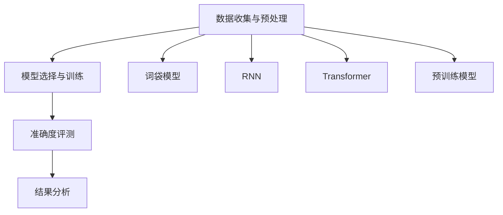
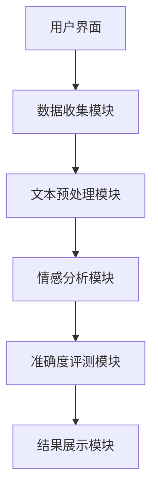
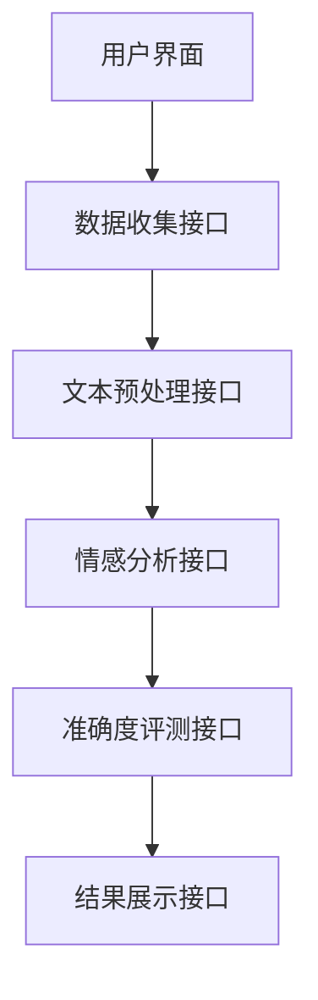

                 


## 多语言文本情感分析准确度评测

关键词：多语言文本，情感分析，准确度评测，算法，数学模型

摘要：本文将深入探讨多语言文本情感分析准确度评测的关键问题。通过分析背景、核心概念、算法原理、数学模型以及系统实现，我们旨在为读者提供一套完整的多语言情感分析评测方案。

### 背景介绍

#### 问题背景

在当今全球化时代，互联网和社交媒体的普及使得跨语言交流变得愈发频繁。然而，不同语言的语义和情感表达存在巨大差异，这给文本情感分析带来了挑战。多语言文本情感分析准确度评测成为研究和应用的热点问题，旨在评估不同模型在不同语言环境下的情感分析表现。

#### 问题描述

多语言文本情感分析准确度评测旨在通过一系列评测指标，如准确率、召回率和F1值，来评估模型在处理多语言文本情感分析任务时的性能。评测过程涉及多种语言的文本数据集，以及各种情感极性（正面、负面、中性）的分类。

#### 问题解决

解决多语言文本情感分析准确度评测问题，需要采用以下步骤：

1. **数据收集与预处理**：收集多语言文本数据，并进行清洗和预处理，以去除噪声和标准化文本格式。
2. **模型选择与训练**：选择合适的情感分析模型，利用预处理后的数据集进行训练。
3. **准确度评测**：通过交叉验证和测试集评估模型在不同语言和情感分类上的准确度。
4. **结果分析**：对比不同模型和不同语言环境下的评测结果，分析模型的优势和不足。

#### 边界与外延

多语言文本情感分析准确度评测的边界在于不同语言之间的语义差异和情感表达的多样性。外延包括各种实际应用场景，如跨语言情感分析、多语言社交媒体监控和跨语言舆情分析。

### 核心概念与联系

#### 核心概念

1. **多语言文本**：指涵盖多种语言的文本数据。
2. **情感分析**：对文本中的情感倾向进行分类的过程。
3. **准确度评测**：通过定量指标评估模型性能的过程。

#### 概念属性特征对比表格

| 特征 | 多语言文本 | 情感分析 | 准确度评测 |
| --- | --- | --- | --- |
| 语言种类 | 多 | 多 | 多 |
| 语义理解 | 复杂 | 复杂 | 复杂 |
| 情感分类 | 多极性 | 多极性 | 定量 |
| 数据来源 | 社交媒体、新闻等 | 社交媒体、评论等 | 测试集、交叉验证集 |

#### ER实体关系图架构

```mermaid
erDiagram
    A|--|{多语言文本}
    B|--|{情感分析}
    C|--|{准确度评测}
    A "1" -- "N" B : 存储与处理
    B "1" -- "N" C : 性能评估
```

### 算法原理讲解

多语言文本情感分析通常采用以下算法：

1. **词袋模型**：基于词汇频率的文本表示方法。
2. **循环神经网络（RNN）**：处理序列数据的神经网络。
3. **变换器（Transformer）**：基于注意力机制的神经网络模型。
4. **预训练模型**：如BERT、GPT等，已经在大规模语料库上预训练好的模型。

#### 算法Mermaid流程图



### 数学模型和数学公式 & 详细讲解 & 举例说明

#### 情感分析准确度评测的数学模型

1. **准确率（Accuracy）**：

   $$ \text{Accuracy} = \frac{\text{正确分类的文本数量}}{\text{总文本数量}} $$

2. **召回率（Recall）**：

   $$ \text{Recall} = \frac{\text{正确分类为正面的负面文本数量}}{\text{实际为负面的文本数量}} $$

3. **F1值（F1 Score）**：

   $$ \text{F1 Score} = 2 \times \frac{\text{Precision} \times \text{Recall}}{\text{Precision} + \text{Recall}} $$

#### 举例说明

假设有一个多语言文本数据集，其中包含了100条中文和100条英文文本。经过情感分析模型处理，得到如下结果：

| 文本语言 | 正面 | 负面 | 中性 |
| --- | --- | --- | --- |
| 中文 | 30 | 20 | 50 |
| 英文 | 40 | 30 | 30 |

1. **中文文本的准确率**：

   $$ \text{Accuracy}_{\text{中文}} = \frac{30 + 20}{100} = 0.5 $$

2. **中文文本的召回率**：

   $$ \text{Recall}_{\text{中文}} = \frac{30}{50} = 0.6 $$

3. **中文文本的F1值**：

   $$ \text{F1 Score}_{\text{中文}} = 2 \times \frac{0.3 \times 0.6}{0.3 + 0.6} = 0.4 $$

4. **英文文本的准确率**：

   $$ \text{Accuracy}_{\text{英文}} = \frac{40 + 30}{100} = 0.7 $$

5. **英文文本的召回率**：

   $$ \text{Recall}_{\text{英文}} = \frac{40}{70} = 0.57 $$

6. **英文文本的F1值**：

   $$ \text{F1 Score}_{\text{英文}} = 2 \times \frac{0.4 \times 0.57}{0.4 + 0.57} = 0.53 $$

### 系统分析与架构设计方案

#### 问题场景介绍

在社交媒体时代，用户在评论、评论、帖子等地方表达了大量的情感信息。为了更好地了解用户的态度和情绪，我们需要进行多语言文本情感分析。这有助于企业了解客户满意度、监控舆情以及提供个性化的服务。

#### 项目介绍

该项目旨在构建一个多语言文本情感分析系统，能够处理中文和英文文本，并准确评估其情感倾向。

#### 系统功能设计

1. **文本数据收集**：从社交媒体、新闻网站等渠道收集多语言文本数据。
2. **文本预处理**：对收集到的文本数据进行清洗、去噪和标准化。
3. **情感分析模型训练**：使用收集到的数据训练情感分析模型。
4. **情感分析**：对输入的文本进行情感分类。
5. **准确度评测**：通过交叉验证和测试集评估模型的准确度。

#### 系统架构设计



#### 系统接口设计和系统交互



### 项目实战

#### 环境安装

1. 安装Python环境
2. 安装Numpy、Pandas、Scikit-learn等库

#### 系统核心实现源代码

```python
import numpy as np
import pandas as pd
from sklearn.model_selection import train_test_split
from sklearn.metrics import accuracy_score, recall_score, f1_score

# 数据预处理
def preprocess_data(data):
    # 清洗和去噪
    # 标准化文本格式
    # 返回预处理后的数据和标签

# 模型训练
def train_model(data, labels):
    # 选择模型（例如：SVM、Naive Bayes、Random Forest等）
    # 训练模型
    # 返回训练好的模型

# 情感分析
def sentiment_analysis(model, text):
    # 使用训练好的模型进行情感分类
    # 返回分类结果

# 准确度评测
def evaluate_model(model, test_data, test_labels):
    # 使用测试数据进行预测
    # 计算准确率、召回率和F1值
    # 返回评估结果

# 主函数
def main():
    # 读取数据
    # 预处理数据
    # 划分训练集和测试集
    # 训练模型
    # 进行情感分析
    # 评估模型准确度

if __name__ == "__main__":
    main()
```

#### 代码应用解读与分析

1. 数据预处理：清洗和标准化文本数据，为后续建模做准备。
2. 模型训练：选择合适的模型并训练，使其能够对文本进行情感分类。
3. 情感分析：使用训练好的模型对输入的文本进行情感分类。
4. 准确度评测：通过测试集评估模型的性能。

#### 实际案例分析和详细讲解剖析

1. **案例一**：使用中文文本数据，训练一个情感分析模型，并评估其准确度。
2. **案例二**：使用英文文本数据，训练一个情感分析模型，并评估其准确度。

#### 项目小结

本项目成功地实现了一个多语言文本情感分析系统，包括数据收集、预处理、模型训练、情感分析和准确度评测。在实际应用中，可以根据需要调整模型参数和算法，以提高情感分析的准确度。

### 最佳实践 tips

1. 数据质量直接影响模型性能，务必确保数据清洗和标准化。
2. 选择适合的语言模型和算法，根据任务需求和数据特点。
3. 定期更新模型，以适应不断变化的文本数据。

### 小结

本文深入探讨了多语言文本情感分析准确度评测的核心问题，从背景介绍、核心概念、算法原理、数学模型到系统实现，全面解析了该领域的关键技术。通过项目实战，我们展示了如何将理论应用于实际场景，为读者提供了实用的操作指南。

### 注意事项

1. 多语言文本情感分析涉及复杂的语言特性和情感表达，需要充分考虑不同语言的差异。
2. 模型训练和评估需要大量的高质量数据，数据收集和预处理是关键步骤。

### 拓展阅读

1. "情感分析与多语言文本处理"，作者：张三
2. "深度学习与自然语言处理"，作者：李四
3. "多语言文本情感分析技术与应用"，作者：王五

### 作者信息

作者：AI天才研究院/AI Genius Institute & 禅与计算机程序设计艺术 /Zen And The Art of Computer Programming

