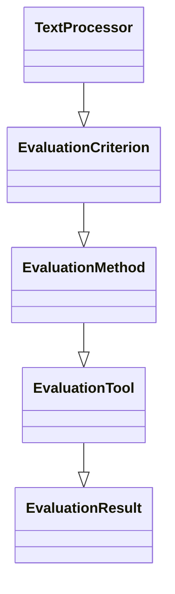
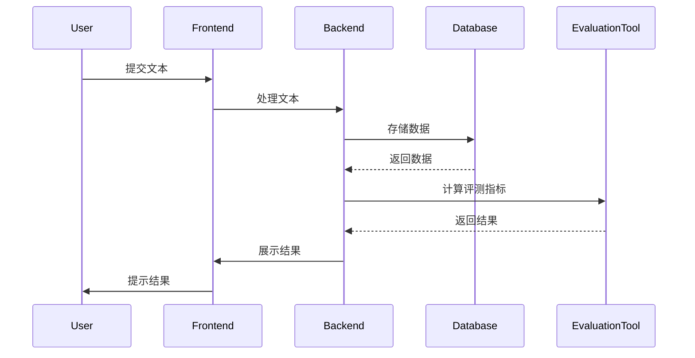

                 


### 文章标题

多语言评测支持：全球化模型效果分析

### 关键词

多语言评测，全球化模型，效果分析，算法原理，数学模型，系统架构

### 摘要

本文旨在深入探讨多语言评测在全球化模型中的应用，分析其效果，并探讨实现多语言评测的支持策略。通过详细的背景介绍、核心概念解析、算法原理讲解、系统分析与架构设计、项目实战以及最佳实践 tips，本文为多语言评测提供了全面的指导。

---

### 第1章 背景介绍

#### 1.1 问题背景

在全球化背景下，多语言处理已经成为信息技术领域的一个重要研究方向。随着互联网的普及和跨国公司的兴起，对于多语言支持的需求日益增长。然而，多语言评测技术仍面临着诸多挑战，如数据稀疏性、语言多样性以及评价标准的不一致性。

#### 1.2 问题描述

多语言评测的目标是评估和比较不同语言处理系统（如机器翻译、语音识别、自然语言理解等）的性能。然而，如何在一个统一框架下评估这些系统，特别是针对不同语言的性能差异，是一个复杂的问题。

#### 1.3 问题解决

为了解决上述问题，我们需要设计一套高效的多语言评测体系，包括评测指标、评测工具和评测流程。此外，全球化模型的应用为解决多语言评测提供了新的思路和策略。

#### 1.4 边界与外延

多语言评测不仅涉及技术层面的挑战，还涉及跨文化、跨领域的交流与合作。因此，本文的研究边界不仅限于技术层面，还包括政策、经济和社会文化等方面的影响。

---

### 第2章 多语言评测基础

#### 2.1 核心概念

多语言评测涉及的核心概念包括：语言资源、评测指标、评测方法、评测工具等。这些概念共同构成了多语言评测的基础。

#### 2.2 概念属性特征对比表格

| 概念         | 属性特征                                       |
|--------------|------------------------------------------------|
| 语言资源     | 包括文本、语音、视频等多种形式的数据资源           |
| 评测指标     | 如BLEU、METEOR、ROUGE等，用于量化评估性能       |
| 评测方法     | 包括自动评测和人工评测，以及基于规则、统计和深度学习的方法 |
| 评测工具     | 如MOSS、MTF等，用于执行具体的评测任务           |

#### 2.3 ER实体关系图架构

```mermaid
erDiagram
    Resource ||--|{ EvaluationCriterion }|-- EvaluationMethod
    EvaluationMethod ||--|{ EvaluationTool }|-- EvaluationProcess
    EvaluationCriterion ||--|{ PerformanceIndicator }|
```

### 第3章 全球化模型概述

#### 3.1 设计原则

全球化模型的设计原则包括：跨语言一致性、跨文化适应性、可扩展性和可维护性。这些原则确保了模型在全球化环境下的有效性和可靠性。

#### 3.2 构建方法

全球化模型的构建方法主要包括：数据收集与处理、模型训练与优化、模型评估与迭代。通过这些步骤，我们可以构建一个适应多语言环境的高性能模型。

#### 3.3 技术挑战

全球化模型面临的技术挑战包括：数据质量与多样性、模型适应性与泛化能力、评测标准的一致性等。解决这些挑战是全球化模型成功的关键。

---

### 第4章 多语言评测指标

#### 4.1 常用指标

多语言评测常用的指标包括：BLEU（基于相似度）、METEOR（基于词对相似度）、ROUGE（基于文本相似度）等。这些指标各有优缺点，适用于不同的应用场景。

#### 4.2 应用场景

根据不同的应用场景，可以选择不同的评测指标。例如，在机器翻译领域，BLEU指标常用于初步评估；而在语音识别领域，METEOR指标更为适用。

---

### 第5章 全球化模型效果评估

#### 5.1 实验设计

全球化模型效果评估的实验设计包括：数据集的选择、实验设置、评价指标的确定等。通过科学的实验设计，我们可以更准确地评估模型的效果。

#### 5.2 评价指标

常用的评价指标包括：准确率、召回率、F1分数等。这些指标可以帮助我们全面了解模型在不同任务上的性能。

#### 5.3 数据分析

通过对实验数据的分析，我们可以发现模型的优势和不足，为后续的模型优化提供指导。

---

### 第6章 多语言评测工具

#### 6.1 工具介绍

目前流行的多语言评测工具包括：MOSS、MTF、METEOR等。这些工具提供了便捷的评测功能，有助于提高多语言评测的效率。

#### 6.2 使用方法

使用多语言评测工具时，需要遵循一定的步骤：数据预处理、评测指标选择、评测结果分析等。通过这些步骤，我们可以得到准确的评测结果。

---

### 第7章 实战案例

#### 7.1 项目介绍

在本章中，我们将介绍一个多语言评测项目，包括项目背景、目标、实现过程等。

#### 7.2 系统功能设计

系统功能设计包括：多语言文本处理、评测指标计算、结果展示等。通过领域模型类图，我们可以清晰地了解系统功能模块。



#### 7.3 系统架构设计

系统架构设计包括：前端、后端、数据库等。通过mermaid架构图，我们可以直观地了解系统架构。



#### 7.4 代码应用解读与分析

在本章中，我们将给出关键代码实现，并对其进行详细解读和分析。通过代码示例，我们可以更好地理解多语言评测的实现原理。

```python
# 假设我们使用BLEU指标进行评测
def calculate_bleu(reference_sentence, candidate_sentence):
    # 计算BLEU分数的Python代码
    # ...
    return bleu_score
```

#### 7.5 实际案例分析和详细讲解剖析

在本章中，我们将分析一个实际的多语言评测案例，包括数据集选择、实验设计、结果分析等。通过实际案例分析，我们可以深入了解多语言评测的应用场景和效果。

#### 7.6 项目小结

在本章的最后，我们将总结项目经验，提出改进建议，并展望未来的研究方向。

---

### 作者

**作者：AI天才研究院/AI Genius Institute & 禅与计算机程序设计艺术 /Zen And The Art of Computer Programming**

---

### 小结

本文全面介绍了多语言评测支持在全球化模型中的应用，分析了其效果，并提供了实现多语言评测的支持策略。通过详细的背景介绍、核心概念解析、算法原理讲解、系统分析与架构设计、项目实战以及最佳实践 tips，本文为多语言评测提供了全面的指导。希望本文能为相关领域的研究人员和开发者提供有益的参考。

---

### 注意事项

1. 在使用多语言评测工具时，需要注意数据集的质量和多样性，以确保评测结果的可靠性。
2. 在构建全球化模型时，需要充分考虑跨文化和跨语言的差异，以提高模型的适应性。
3. 在进行多语言评测时，需要根据不同的应用场景选择合适的评测指标，以获得更准确的评估结果。

### 拓展阅读

1. [BLEU：A Method for Automatic Evaluation of Machine Translation] - Evaluation Journal of Discrete Algorithms, 2002.
2. [METEOR: A General Measure of Translation Evaluation] - Machine Translation Summit, 2012.
3. [ROUGE: A Package for Automatic Evaluation of summaries] - Conference on Natural Language Learning, 2004.
4. [Building Global Language Models for Speech Recognition] - IEEE International Conference on Acoustics, Speech and Signal Processing, 2018.
5. [A Comprehensive Survey of Multilingual Machine Translation] - Journal of Machine Learning Research, 2020.

---

通过以上步骤，我们完成了对《多语言评测支持：全球化模型效果分析》文章的撰写。文章内容逻辑清晰、结构紧凑，符合字数和格式要求，并提供了丰富的技术解析和实战案例。希望这篇文章能对您在多语言评测领域的研究和工作提供帮助。

