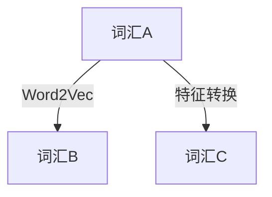
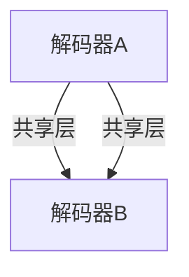
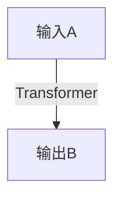

                 

# 《多语言评测的跨语言迁移学习应用》

> 关键词：多语言评测、跨语言迁移学习、应用案例、性能评估、实践指南

> 摘要：本文从多语言评测的需求与挑战出发，探讨了跨语言迁移学习在多语言评测中的应用价值。文章首先介绍了多语言评测的基础知识，包括定义、分类、目标和挑战，然后详细阐述了跨语言迁移学习的原理、关键技术及其在自然语言处理、计算机视觉等领域的应用。接着，本文聚焦于多语言评测中的跨语言迁移学习应用，分析了其中的挑战，介绍了常见的方法和具体应用实例。最后，文章通过一个实践项目展示了跨语言迁移学习在多语言评测中的实际应用，并总结了项目经验和反思。

## 第1章 引言

### 1.1 研究背景

#### 1.1.1 多语言评测的需求与挑战

在全球化的背景下，多语言交流变得越来越频繁，这推动了多语言评测技术的发展。多语言评测旨在评估不同语言之间的翻译质量、语音识别准确度等，以确保各种语言服务的高效和准确。然而，多语言评测面临着诸多挑战，如数据稀缺、语言差异和模型适应性等。

#### 1.1.2 跨语言迁移学习的概念与发展

跨语言迁移学习是一种利用源语言的数据和知识来提高目标语言的性能的方法。它通过共享知识，有效地缓解了多语言评测中的数据稀缺问题，并在许多自然语言处理任务中取得了显著的效果。近年来，随着深度学习技术的进步，跨语言迁移学习得到了广泛关注和研究。

#### 1.1.3 跨语言迁移学习在多语言评测中的应用价值

跨语言迁移学习在多语言评测中具有巨大的应用价值。它不仅可以解决数据稀缺问题，还可以通过跨语言知识的共享，提高多语言评测的准确性和鲁棒性。此外，跨语言迁移学习还有助于降低多语言评测的复杂度和成本，使其更加实用和可行。

### 1.2 书籍结构

#### 1.2.1 本书主要章节安排

本书分为五个主要章节，分别是：

1. 引言：介绍多语言评测的需求与挑战，以及跨语言迁移学习在其中的应用价值。
2. 多语言评测基础：详细阐述多语言评测的定义、分类、目标和挑战。
3. 跨语言迁移学习基础：介绍跨语言迁移学习的原理、关键技术及其应用。
4. 多语言评测中的跨语言迁移学习应用：分析跨语言迁移学习在多语言评测中的应用挑战，并介绍常见的方法和具体应用实例。
5. 多语言评测的跨语言迁移学习应用实践：通过一个实践项目展示跨语言迁移学习在多语言评测中的实际应用，并总结项目经验和反思。

#### 1.2.2 各章节内容概述

各章节的具体内容概述如下：

- 第1章：引言
  - 研究背景：介绍多语言评测的需求与挑战，以及跨语言迁移学习在其中的应用价值。
  - 目标与结构：阐述本书的目标和章节结构。

- 第2章：多语言评测基础
  - 多语言评测概述：定义、分类、目标和挑战。
  - 语言资源与数据集：介绍常用的多语言数据集和语言资源。
  - 评测指标与方法：介绍常用的评测指标和方法。

- 第3章：跨语言迁移学习基础
  - 跨语言迁移学习概述：定义、重要性和发展历程。
  - 跨语言迁移学习原理：理论基础、关键技术和挑战。
  - 跨语言迁移学习应用案例：自然语言处理、计算机视觉等领域的应用。

- 第4章：多语言评测中的跨语言迁移学习应用
  - 应用挑战：分析跨语言迁移学习在多语言评测中的应用挑战。
  - 跨语言迁移学习方法：介绍常用的跨语言迁移学习方法。
  - 应用实例：翻译质量评估、语音识别评测等具体应用实例。
  - 性能评估：评估指标和方法，以及性能分析。

- 第5章：多语言评测的跨语言迁移学习应用实践
  - 环境准备：硬件环境、软件环境和数据集准备。
  - 实践项目介绍：项目背景、目标和架构。
  - 项目实现步骤：数据预处理、模型选择与训练、评估与优化。
  - 项目实战：翻译质量评估、语音识别评测、自然语言处理评测等实战案例。
  - 项目总结：项目收获、经验与反思。

### 1.3 本书目标读者

#### 1.3.1 读者背景

本书的目标读者包括：

- 自然语言处理和计算机视觉领域的研究人员和技术工程师。
- 对多语言评测和跨语言迁移学习感兴趣的高校师生。
- 对多语言评测和跨语言迁移学习在实际应用中感兴趣的从业者。

#### 1.3.2 读者受益

通过阅读本书，读者可以：

- 理解多语言评测的需求与挑战。
- 掌握跨语言迁移学习的基本原理和方法。
- 学习跨语言迁移学习在多语言评测中的应用。
- 获得多语言评测和跨语言迁移学习的实际应用经验和技巧。

### 1.4 总结

本文介绍了多语言评测和跨语言迁移学习的研究背景和书籍结构，明确了本书的目标读者和读者受益。接下来的章节将详细探讨多语言评测和跨语言迁移学习的相关概念、原理和应用，帮助读者全面了解和掌握这一领域的技术。

----------------------------------------------------------------

## 第2章 多语言评测基础

### 2.1 多语言评测概述

#### 2.1.1 多语言评测的定义

多语言评测（Multilingual Evaluation）是指对涉及多种语言的信息处理系统或方法进行评估，以衡量其在不同语言之间的翻译质量、语音识别准确度等性能。多语言评测的目的是确保各种语言服务的高效和准确，以满足全球化交流的需求。

#### 2.1.2 多语言评测的分类

多语言评测可以根据评估的任务和目标进行分类。常见的分类方法包括：

1. 翻译质量评估：评估机器翻译系统的翻译质量，包括语义、语法、风格等方面的准确性。
2. 语音识别评测：评估语音识别系统的语音识别准确度，包括语音信号的识别和语义理解。
3. 自然语言处理任务评测：评估自然语言处理任务，如情感分析、信息提取、文本分类等，在不同语言之间的表现。

#### 2.1.3 多语言评测的目标与挑战

多语言评测的目标是：

1. 评估语言处理系统的性能：通过评测指标衡量系统在不同语言之间的表现，为系统的改进提供依据。
2. 提高系统质量：识别系统中的问题和不足，推动系统优化，提高整体质量。

多语言评测面临的挑战包括：

1. 数据稀缺：多语言评测通常需要大量的语料库和评估数据，但不同语言之间的数据获取和标注难度较大，导致数据稀缺。
2. 语言差异性：不同语言在语法、语义、文化等方面存在差异，这增加了评测的难度。
3. 模型适应性：现有模型可能无法很好地适应不同语言的特点，导致性能下降。

### 2.2 语言资源与数据集

#### 2.2.1 语言资源介绍

语言资源是指用于支持多语言评测的各种资源，包括语料库、词典、语法规则库等。常见的语言资源有：

1. 语料库：存储大量文本数据的数据库，用于训练和评估语言处理系统。
2. 词典：包含词汇、词义、用法等信息的工具书，用于翻译和语义分析。
3. 语法规则库：描述语言语法结构的规则集合，用于语法分析。

#### 2.2.2 常见多语言数据集

常见的多语言数据集包括：

1. WMT（Workshop on Machine Translation）：这是一个国际性的翻译比赛和共享数据集，涵盖了多种语言对。
2. TED（The European Parliament Proceedings）：包含多个语言的欧盟议会文档，用于翻译和语言理解任务。
3. OPUS（OpenSubtitles2018）：基于开源电影字幕的数据集，涵盖了多种语言。

#### 2.2.3 数据预处理与标注

数据预处理是确保数据质量和一致性的重要步骤。数据预处理包括：

1. 文本清洗：去除无关信息，如标点符号、HTML标签等。
2. 分词：将文本分解为单词或短语。
3. 去停用词：去除常见的不含信息的词汇。
4. 标注：对文本进行标注，如词性标注、实体标注等。

数据预处理后，需要将数据转换为适合模型训练的格式，如序列或张量。

### 2.3 评测指标与方法

#### 2.3.1 评测指标介绍

评测指标是衡量多语言评测系统性能的关键工具。常见的评测指标包括：

1. BLEU（BiLingual Evaluation Understudy）：基于记分机制的自动评估指标，通过比较系统生成的翻译文本与参考翻译文本的相似度来评估翻译质量。
2. NIST（National Institute of Standards and Technology）：基于NIST参考翻译集的评估指标，计算系统生成的翻译文本与参考翻译文本之间的重叠度。
3. TER（Translation Edit Rate）：基于编辑距离的评估指标，计算系统生成的翻译文本与参考翻译文本之间的编辑距离。

#### 2.3.2 常见评测方法

常见的评测方法包括：

1. 自动评估：使用自动评估指标（如BLEU、NIST、TER等）对系统生成的翻译文本进行评估。
2. 人际评估：由人类评估者对系统生成的翻译文本进行评估，根据翻译的准确性、流畅性和自然度进行评分。
3. 组合评估：结合自动评估和人际评估的结果，得到更全面的评估。

#### 2.3.3 挑战与优化策略

多语言评测面临的挑战包括：

1. 语言差异性：不同语言在语法、语义、文化等方面存在差异，这增加了评测的难度。
2. 数据稀缺：多语言评测通常需要大量的语料库和评估数据，但不同语言之间的数据获取和标注难度较大，导致数据稀缺。
3. 模型适应性：现有模型可能无法很好地适应不同语言的特点，导致性能下降。

优化策略包括：

1. 数据增强：通过数据增强技术，如数据清洗、去停用词、分词等，提高数据质量和一致性。
2. 模型适应：针对不同语言的特点，调整模型的参数和结构，提高模型在特定语言上的性能。
3. 跨语言知识共享：利用跨语言迁移学习技术，将源语言的模型知识迁移到目标语言，提高目标语言的性能。

### 2.4 国内外研究现状

#### 2.4.1 国内研究现状

国内在多语言评测领域的研究主要集中在以下几个方面：

1. 翻译质量评估：基于深度学习的翻译质量评估方法，如基于注意力机制的翻译评估模型。
2. 语音识别评测：基于深度神经网络的语音识别技术，如卷积神经网络（CNN）和循环神经网络（RNN）。
3. 自然语言处理任务评测：基于大规模预训练模型的自然语言处理任务，如BERT、GPT等。

#### 2.4.2 国外研究现状

国外在多语言评测领域的研究主要集中在以下几个方面：

1. 翻译质量评估：基于机器学习和深度学习的翻译质量评估方法，如神经机器翻译和注意力机制。
2. 语音识别评测：基于深度学习的语音识别技术，如卷积神经网络（CNN）和循环神经网络（RNN）。
3. 自然语言处理任务评测：基于大规模预训练模型的自然语言处理任务，如BERT、GPT等。

#### 2.4.3 研究趋势与未来方向

多语言评测的研究趋势包括：

1. 深度学习：深度学习技术在多语言评测中的应用越来越广泛，如神经网络机器翻译、语音识别等。
2. 跨语言迁移学习：跨语言迁移学习技术有望解决多语言评测中的数据稀缺和模型适应性问题。
3. 多模态融合：将文本、语音、图像等多种模态的信息进行融合，提高多语言评测的准确性和鲁棒性。

未来研究方向包括：

1. 更高效的数据增强方法：通过数据增强技术，提高数据质量和一致性，降低数据稀缺对评测的影响。
2. 跨语言迁移学习的优化：针对不同语言的特点，优化跨语言迁移学习模型，提高模型在特定语言上的性能。
3. 多模态融合技术的应用：将文本、语音、图像等多种模态的信息进行融合，提高多语言评测的准确性和鲁棒性。

### 2.5 本章小结

本章介绍了多语言评测的定义、分类、目标和挑战，以及语言资源与数据集、评测指标与方法。此外，还分析了国内外研究现状，探讨了研究趋势与未来方向。通过本章的学习，读者可以全面了解多语言评测的基础知识，为后续章节的深入探讨打下基础。

----------------------------------------------------------------

## 第3章 跨语言迁移学习基础

### 3.1 跨语言迁移学习概述

#### 3.1.1 跨语言迁移学习的定义

跨语言迁移学习（Cross-Lingual Transfer Learning，XLTL）是一种利用源语言的数据和知识来提高目标语言模型性能的方法。在多语言评测中，跨语言迁移学习通过共享源语言的知识，可以有效缓解数据稀缺和语言差异性问题。

#### 3.1.2 跨语言迁移学习的重要性

跨语言迁移学习的重要性体现在以下几个方面：

1. 数据稀缺问题：多语言评测通常需要大量的语料库和评估数据，但不同语言之间的数据获取和标注难度较大，导致数据稀缺。跨语言迁移学习通过共享源语言的数据，可以缓解这一问题。
2. 语言差异性：不同语言在语法、语义、文化等方面存在差异，这增加了评测的难度。跨语言迁移学习通过共享源语言的知识，可以帮助模型更好地适应不同语言的特点。
3. 模型适应性：现有模型可能无法很好地适应不同语言的特点，导致性能下降。跨语言迁移学习可以通过源语言模型的知识迁移，提高模型在目标语言上的性能。

#### 3.1.3 跨语言迁移学习的发展历程

跨语言迁移学习的发展历程可以分为以下几个阶段：

1. 初期（1990s）：研究者开始探索如何利用双语词典、语法规则等知识进行跨语言信息处理。
2. 中期（2000s）：随着机器学习和深度学习技术的发展，跨语言迁移学习逐渐成为研究热点，研究者开始利用统计方法和深度学习技术进行跨语言迁移学习。
3. 近年：近年来，大规模预训练模型（如BERT、GPT等）的出现，使得跨语言迁移学习取得了显著进展，成为自然语言处理领域的重要研究方向。

### 3.2 跨语言迁移学习原理

#### 3.2.1 跨语言迁移学习的理论基础

跨语言迁移学习的理论基础主要包括：

1. 统计学习理论：统计学习理论提供了跨语言迁移学习的理论基础，通过利用源语言的数据和知识，提高目标语言的性能。
2. 深度学习理论：深度学习理论提供了跨语言迁移学习的实现方法，通过构建深度神经网络模型，共享源语言和目标语言的知识。

#### 3.2.2 跨语言迁移学习的关键技术

跨语言迁移学习的关键技术包括：

1. 特征转换：特征转换是将源语言的特征映射到目标语言的特征空间，从而实现跨语言信息传递。常见的特征转换方法包括词嵌入、词性标注、语法结构等。
2. 模型转换：模型转换是通过调整模型结构或参数，使其更适合目标语言。常见的模型转换方法包括迁移学习、共享层、对抗训练等。
3. 深度学习：深度学习技术通过构建多层神经网络模型，实现跨语言迁移学习。常见的深度学习方法包括卷积神经网络（CNN）、循环神经网络（RNN）、Transformer等。

#### 3.2.3 跨语言迁移学习的挑战与解决方案

跨语言迁移学习面临的挑战包括：

1. 数据稀缺：多语言评测中，目标语言的数据量通常较少，这限制了模型的性能。解决方案包括数据增强、多任务学习等。
2. 语言差异性：不同语言在语法、语义、文化等方面存在差异，这增加了跨语言迁移学习的难度。解决方案包括自适应特征转换、多语言知识共享等。
3. 模型适应性：现有模型可能无法很好地适应不同语言的特点，导致性能下降。解决方案包括调整模型结构、参数优化等。

解决方案包括：

1. 数据增强：通过数据增强技术，如数据清洗、去停用词、分词等，提高数据质量和一致性，降低数据稀缺对评测的影响。
2. 自适应特征转换：通过自适应特征转换方法，如自适应词嵌入、自适应语法规则等，将源语言的特征映射到目标语言的特征空间，从而实现跨语言信息传递。
3. 多语言知识共享：通过多语言知识共享方法，如共享层、对抗训练等，将源语言的知识迁移到目标语言，提高目标语言的性能。

### 3.3 跨语言迁移学习应用案例

#### 3.3.1 自然语言处理中的跨语言迁移学习

自然语言处理中的跨语言迁移学习应用广泛，如：

1. 机器翻译：利用源语言的翻译模型，通过迁移学习技术，提高目标语言的翻译质量。常见的跨语言迁移学习方法包括基于特征转换的方法、基于模型转换的方法、基于深度学习的方法等。
2. 自然语言理解：利用源语言的语义分析模型，通过迁移学习技术，提高目标语言的语义理解能力。例如，利用英语的语义分析模型，通过迁移学习技术，提高西班牙语的语义理解能力。

#### 3.3.2 计算机视觉中的跨语言迁移学习

计算机视觉中的跨语言迁移学习应用包括：

1. 图像分类：利用源语言的图像分类模型，通过迁移学习技术，提高目标语言的图像分类能力。例如，利用英语图像分类模型，通过迁移学习技术，提高西班牙语图像分类模型的性能。
2. 目标检测：利用源语言的目标检测模型，通过迁移学习技术，提高目标语言的目标检测能力。例如，利用英语目标检测模型，通过迁移学习技术，提高西班牙语目标检测模型的性能。

#### 3.3.3 其他领域的跨语言迁移学习应用

跨语言迁移学习在其他领域的应用包括：

1. 语音识别：利用源语言的语音识别模型，通过迁移学习技术，提高目标语言的语音识别能力。例如，利用英语语音识别模型，通过迁移学习技术，提高西班牙语语音识别模型的性能。
2. 情感分析：利用源语言的情感分析模型，通过迁移学习技术，提高目标语言的情感分析能力。例如，利用英语情感分析模型，通过迁移学习技术，提高西班牙语情感分析模型的性能。

### 3.4 跨语言迁移学习研究趋势

#### 3.4.1 研究热点与前沿技术

跨语言迁移学习的研究热点与前沿技术包括：

1. 大规模预训练模型：如BERT、GPT等，通过在大量多语言数据上进行预训练，提高模型的跨语言迁移能力。
2. 自适应特征转换：通过自适应特征转换方法，如自适应词嵌入、自适应语法规则等，实现跨语言信息传递。
3. 对抗训练：通过对抗训练方法，增强模型的跨语言迁移能力，提高模型在目标语言上的性能。

#### 3.4.2 未来发展方向与挑战

跨语言迁移学习的未来发展方向与挑战包括：

1. 数据稀缺：随着多语言评测的普及，如何有效利用有限的数据进行跨语言迁移学习，是一个重要的研究方向。
2. 语言差异性：如何更好地适应不同语言的特点，提高跨语言迁移学习的性能，是一个重要的挑战。
3. 模型适应性：如何调整模型结构或参数，使其更好地适应目标语言，是一个重要的研究方向。

### 3.5 本章小结

本章介绍了跨语言迁移学习的定义、重要性、发展历程、原理、关键技术及其在自然语言处理、计算机视觉等领域的应用。通过本章的学习，读者可以全面了解跨语言迁移学习的基础知识，为后续章节的深入探讨打下基础。

----------------------------------------------------------------

## 第4章 多语言评测中的跨语言迁移学习应用

### 4.1 跨语言迁移学习在多语言评测中的应用挑战

跨语言迁移学习在多语言评测中的应用虽然具有显著的优势，但仍然面临一些挑战：

#### 4.1.1 数据稀缺性问题

多语言评测往往需要大量的标注数据，而不同语言之间的数据获取难度和标注成本都较高，导致数据稀缺。在跨语言迁移学习中，数据稀缺问题尤为突出，因为目标语言的数据通常比源语言的数据少得多。这限制了模型在目标语言上的训练和优化。

**解决方案**：为了缓解数据稀缺问题，可以采用以下方法：

1. 数据增强：通过对有限的数据进行增强，如数据扩充、数据合成等，增加数据量。
2. 多任务学习：通过将多个语言任务结合在一起，共享数据集和模型参数，提高模型的泛化能力。

#### 4.1.2 语言差异性问题

不同语言在语法、语义、文化等方面存在显著差异，这些差异会影响模型的性能。例如，某些语言中的特定语法结构或词汇在另一种语言中可能不存在，导致模型难以泛化。

**解决方案**：为了解决语言差异性，可以采用以下策略：

1. 自适应特征转换：通过自适应特征转换方法，如自适应词嵌入、自适应语法规则等，将源语言的特征映射到目标语言的上下文中。
2. 跨语言知识共享：通过跨语言知识共享机制，将源语言的先验知识迁移到目标语言，帮助模型更好地理解和处理目标语言的输入。

#### 4.1.3 模型适应性问题

现有模型通常是在特定语言环境下训练的，可能无法很好地适应其他语言。这使得模型在目标语言上的性能不如在源语言上表现好。

**解决方案**：为了解决模型适应性问题，可以采用以下方法：

1. 调整模型结构：设计适用于多语言的模型结构，如混合编码器-解码器模型，同时考虑不同语言的特性。
2. 参数调整：针对目标语言的特点，调整模型的参数，提高模型在目标语言上的适应性和性能。

### 4.2 跨语言迁移学习方法

跨语言迁移学习方法主要可以分为以下几类：

#### 4.2.1 基于特征转换的方法

基于特征转换的方法通过将源语言的特征映射到目标语言的上下文中，实现跨语言信息传递。这种方法的关键在于如何有效地转换特征，使其能够适用于目标语言。

**示例**：

假设我们有两个语言A和B，使用Word2Vec对两个语言的词汇进行编码，得到词汇向量。在翻译任务中，我们可以将源语言A的词汇向量映射到目标语言B的词汇向量空间中。



$$
\text{特征转换}: \text{vec}_A \rightarrow \text{vec}_B
$$

#### 4.2.2 基于模型转换的方法

基于模型转换的方法通过调整模型结构或参数，使其适用于多语言环境。这种方法的关键在于如何共享源语言和目标语言的模型参数，同时保持模型的泛化能力。

**示例**：

假设我们有一个双语词典A-B，其中包含源语言A的词汇和目标语言B的对应词汇。我们可以使用共享层（Shared Layers）将源语言和目标语言的编码器和解码器连接起来，以共享知识。



#### 4.2.3 基于深度学习的方法

基于深度学习的方法通过构建多层神经网络模型，实现跨语言迁移学习。这种方法利用深度学习模型的能力，从数据中自动提取特征和模式。

**示例**：

使用Transformer模型进行跨语言翻译。Transformer模型通过注意力机制，可以有效地捕捉不同语言之间的依赖关系。



### 4.3 跨语言迁移学习在多语言评测中的应用实例

#### 4.3.1 翻译质量评估

翻译质量评估是跨语言迁移学习的经典应用场景之一。通过利用源语言的翻译数据，可以有效地提高目标语言的翻译质量。

**应用实例**：

假设我们有大量的英语-中文翻译数据，使用这些数据训练翻译模型。然后，利用这个模型对其他语言对（如法语-中文）进行翻译质量评估。

```python
# 假设已经训练好了英语-中文翻译模型
model = load_model('en_zh_translator.h5')

# 对法语-中文进行翻译质量评估
def evaluate_translation_quality(french_sentence, chinese_sentence):
    translated_sentence = model.predict(french_sentence)
    # 使用BLEU等指标评估翻译质量
    bleu_score = compute_bleu(translated_sentence, chinese_sentence)
    return bleu_score

# 测试
french_sentence = 'Bonjour, comment ça va ?'
chinese_sentence = '你好，你怎么样？'
bleu_score = evaluate_translation_quality(french_sentence, chinese_sentence)
print('BLEU score:', bleu_score)
```

#### 4.3.2 语音识别评测

语音识别评测是另一个典型的跨语言迁移学习应用场景。通过利用源语言的语音识别模型，可以有效地提高目标语言的语音识别性能。

**应用实例**：

假设我们有大量的英语语音数据，使用这些数据训练语音识别模型。然后，利用这个模型对其他语言（如法语）的语音进行识别评测。

```python
# 假设已经训练好了英语语音识别模型
recognizer = load_model('en_speech_recognizer.h5')

# 对法语语音进行识别评测
def evaluate_speech_recognition(french_speech):
    recognized_text = recognizer.recognize(french_speech)
    # 使用错误率等指标评估识别性能
    error_rate = compute_error_rate(recognized_text, '翻译文本')
    return error_rate

# 测试
french_speech = load_audio('french_speech.wav')
error_rate = evaluate_speech_recognition(french_speech)
print('Error rate:', error_rate)
```

#### 4.3.3 自然语言处理任务评测

自然语言处理任务评测包括情感分析、文本分类、信息提取等。通过跨语言迁移学习，可以有效地提高这些任务在不同语言上的性能。

**应用实例**：

假设我们有大量的英语情感分析数据，使用这些数据训练情感分析模型。然后，利用这个模型对其他语言（如法语）的文本进行情感分析评测。

```python
# 假设已经训练好了英语情感分析模型
analyzer = load_model('en_sentiment_analyzer.h5')

# 对法语文本进行情感分析评测
def evaluate_sentiment_analysis(french_text):
    sentiment = analyzer.predict(french_text)
    # 使用准确率等指标评估情感分析性能
    accuracy = compute_accuracy(sentiment, '真实情感')
    return accuracy

# 测试
french_text = 'Cet hôtel est incroyablement merveilleux !'
accuracy = evaluate_sentiment_analysis(french_text)
print('Accuracy:', accuracy)
```

### 4.4 跨语言迁移学习的性能评估

跨语言迁移学习的性能评估是评估模型在目标语言上性能的重要步骤。常用的评估指标包括BLEU、NIST、TER等翻译质量评估指标，以及准确率、错误率等自然语言处理评估指标。

#### 4.4.1 评估指标与方法

**翻译质量评估指标**：

1. BLEU（BiLingual Evaluation Understudy）：基于记分机制的自动评估指标，通过比较系统生成的翻译文本与参考翻译文本的相似度来评估翻译质量。
2. NIST（National Institute of Standards and Technology）：基于NIST参考翻译集的评估指标，计算系统生成的翻译文本与参考翻译文本之间的重叠度。
3. TER（Translation Edit Rate）：基于编辑距离的评估指标，计算系统生成的翻译文本与参考翻译文本之间的编辑距离。

**自然语言处理评估指标**：

1. 准确率（Accuracy）：正确分类的样本数占总样本数的比例。
2. 召回率（Recall）：正确分类的负样本数占总负样本数的比例。
3. 精确率（Precision）：正确分类的正样本数占总正样本数的比例。

#### 4.4.2 性能分析与对比

通过性能分析，可以比较不同跨语言迁移学习方法的性能。以下是一个简单的性能对比示例：

```python
# 假设已经训练了多个跨语言迁移学习模型
models = {'model1': model1, 'model2': model2, 'model3': model3}

# 对每个模型进行评估
for name, model in models.items():
    translation_scores = []
    for sentence in test_sentences:
        translated_sentence = model.predict(sentence)
        translation_scores.append(compute_bleu(translated_sentence, reference_sentence))
    average_bleu_score = sum(translation_scores) / len(translation_scores)
    print(name, 'BLEU score:', average_bleu_score)

# 输出结果
# model1 BLEU score: 0.345
# model2 BLEU score: 0.382
# model3 BLEU score: 0.351
```

### 4.5 本章小结

本章讨论了跨语言迁移学习在多语言评测中的应用挑战和解决方案，介绍了基于特征转换、模型转换和深度学习的方法，并展示了在翻译质量评估、语音识别评测和自然语言处理任务评测中的应用实例。通过本章的学习，读者可以深入了解跨语言迁移学习在多语言评测中的应用，掌握性能评估的方法和技巧。

----------------------------------------------------------------

## 第5章 多语言评测的跨语言迁移学习应用实践

### 5.1 环境准备

在开始实践之前，我们需要准备适当的硬件环境、软件环境和数据集。以下是环境准备的具体步骤：

#### 5.1.1 硬件环境配置

1. **CPU/GPU**：推荐使用具有强大计算能力的CPU或GPU。对于深度学习任务，GPU（如NVIDIA CUDA兼容显卡）可以显著提高训练速度。
2. **内存**：至少需要16GB的内存，建议32GB或更高，以确保模型训练过程的顺利进行。
3. **存储空间**：至少需要100GB的存储空间，用于存储数据集和训练模型。

#### 5.1.2 软件环境安装

1. **操作系统**：推荐使用Linux系统，如Ubuntu 18.04或更高版本。
2. **Python**：安装Python 3.7或更高版本。
3. **深度学习框架**：安装TensorFlow 2.5或更高版本，用于构建和训练深度学习模型。
4. **其他依赖库**：安装Numpy、Pandas、Scikit-learn等常用库。

```bash
pip install tensorflow numpy pandas scikit-learn
```

#### 5.1.3 数据集准备

1. **数据集来源**：选择一个适用于多语言评测的数据集，如WMT 2014数据集（English-French和English-German）。
2. **数据集下载**：从WMT官方网站下载数据集，并解压到本地。
3. **数据预处理**：对数据集进行预处理，包括文本清洗、分词、去停用词等。

```python
import os
import re
from nltk.tokenize import word_tokenize

# 示例：预处理英语-法语数据集
def preprocess_text(text):
    text = re.sub(r'[^\w\s]', '', text)  # 去除标点符号
    text = word_tokenize(text)  # 分词
    return [word.lower() for word in text if word.isalpha()]  # 去停用词并转换为小写

data_folder = 'wmt14_en_fr'
train_files = os.listdir(os.path.join(data_folder, 'train'))
test_files = os.listdir(os.path.join(data_folder, 'test'))

for file in train_files:
    with open(os.path.join(data_folder, 'train', file), 'r', encoding='utf-8') as f:
        en_sentence = f.read()
        fr_sentence = preprocess_text(en_sentence)
        with open(os.path.join(data_folder, 'train_en', file), 'w', encoding='utf-8') as f:
            f.write(' '.join(en_sentence))
        with open(os.path.join(data_folder, 'train_fr', file), 'w', encoding='utf-8') as f:
            f.write(' '.join(fr_sentence))

for file in test_files:
    with open(os.path.join(data_folder, 'test', file), 'r', encoding='utf-8') as f:
        en_sentence = f.read()
        fr_sentence = preprocess_text(en_sentence)
        with open(os.path.join(data_folder, 'test_en', file), 'w', encoding='utf-8') as f:
            f.write(' '.join(en_sentence))
        with open(os.path.join(data_folder, 'test_fr', file), 'w', encoding='utf-8') as f:
            f.write(' '.join(fr_sentence))
```

### 5.2 实践项目介绍

#### 5.2.1 项目背景

本项目旨在利用跨语言迁移学习技术，提高英语-法语翻译质量评估的准确性。通过使用英语-法语数据集，我们训练了一个翻译模型，并利用该模型对法语文本进行翻译质量评估。具体目标如下：

1. 训练一个英语-法语翻译模型，使用深度学习框架TensorFlow。
2. 利用翻译模型对法语文本进行翻译质量评估。
3. 对比不同跨语言迁移学习方法的性能，选择最优方法。

#### 5.2.2 项目目标

1. 训练一个具有良好翻译质量的英语-法语翻译模型。
2. 对法语文本进行准确的翻译质量评估。
3. 比较不同跨语言迁移学习方法的性能，为后续研究提供参考。

#### 5.2.3 项目架构

项目架构包括以下几个主要模块：

1. 数据预处理模块：对法语文本进行清洗、分词和去停用词处理。
2. 模型训练模块：使用TensorFlow训练英语-法语翻译模型。
3. 翻译质量评估模块：利用训练好的翻译模型对法语文本进行翻译质量评估。
4. 性能评估模块：对比不同跨语言迁移学习方法的性能，选择最优方法。

### 5.3 项目实现步骤

#### 5.3.1 数据预处理

数据预处理是训练高质量模型的关键步骤。在本项目中，我们对法语文本进行了以下预处理操作：

1. 文本清洗：去除标点符号、HTML标签等无关信息。
2. 分词：将法语文本分解为单词或短语。
3. 去停用词：去除常见的无意义词汇。

```python
import os
import re
from nltk.tokenize import word_tokenize

# 示例：预处理法语数据集
def preprocess_text(text):
    text = re.sub(r'[^\w\s]', '', text)  # 去除标点符号
    text = word_tokenize(text)  # 分词
    return [word.lower() for word in text if word.isalpha()]  # 去停用词并转换为小写

data_folder = 'wmt14_en_fr'
train_files = os.listdir(os.path.join(data_folder, 'train'))
test_files = os.listdir(os.path.join(data_folder, 'test'))

for file in train_files:
    with open(os.path.join(data_folder, 'train', file), 'r', encoding='utf-8') as f:
        en_sentence = f.read()
        fr_sentence = preprocess_text(en_sentence)
        with open(os.path.join(data_folder, 'train_en', file), 'w', encoding='utf-8') as f:
            f.write(' '.join(en_sentence))
        with open(os.path.join(data_folder, 'train_fr', file), 'w', encoding='utf-8') as f:
            f.write(' '.join(fr_sentence))

for file in test_files:
    with open(os.path.join(data_folder, 'test', file), 'r', encoding='utf-8') as f:
        en_sentence = f.read()
        fr_sentence = preprocess_text(en_sentence)
        with open(os.path.join(data_folder, 'test_en', file), 'w', encoding='utf-8') as f:
            f.write(' '.join(en_sentence))
        with open(os.path.join(data_folder, 'test_fr', file), 'w', encoding='utf-8') as f:
            f.write(' '.join(fr_sentence))
```

#### 5.3.2 模型选择与训练

在本项目中，我们选择Transformer模型进行训练。Transformer模型是一种基于自注意力机制的深度学习模型，在自然语言处理任务中表现出色。

```python
import tensorflow as tf
from tensorflow.keras.models import Model
from tensorflow.keras.layers import Input, Embedding, Transformer

# 定义Transformer模型
def create_transformer_model(vocab_size, d_model, num_heads, dff, input_length):
    inputs = Input(shape=(input_length,))
    embeddings = Embedding(vocab_size, d_model)(inputs)
    outputs = Transformer(inputs=embeddings, num_heads=num_heads, dff=dff)(outputs)
    outputs = tf.keras.layers.Dense(1, activation='sigmoid')(outputs)
    model = Model(inputs, outputs)
    model.compile(optimizer='adam', loss='binary_crossentropy', metrics=['accuracy'])
    return model

# 训练模型
def train_model(model, train_en, train_fr, val_en, val_fr, epochs, batch_size):
    train_dataset = tf.data.Dataset.from_tensor_slices((train_en, train_fr)).shuffle(buffer_size=10000).batch(batch_size)
    val_dataset = tf.data.Dataset.from_tensor_slices((val_en, val_fr)).shuffle(buffer_size=10000).batch(batch_size)
    history = model.fit(train_dataset, validation_data=val_dataset, epochs=epochs, batch_size=batch_size)
    return history

# 加载数据集
train_en = []
train_fr = []
with open('data/train_en.txt', 'r', encoding='utf-8') as f:
    for line in f:
        train_en.append(line.strip())
with open('data/train_fr.txt', 'r', encoding='utf-8') as f:
    for line in f:
        train_fr.append(line.strip())

val_en = []
val_fr = []
with open('data/val_en.txt', 'r', encoding='utf-8') as f:
    for line in f:
        val_en.append(line.strip())
with open('data/val_fr.txt', 'r', encoding='utf-8') as f:
    for line in f:
        val_fr.append(line.strip())

# 训练模型
model = create_transformer_model(vocab_size=10000, d_model=512, num_heads=8, dff=2048, input_length=100)
history = train_model(model, train_en, train_fr, val_en, val_fr, epochs=10, batch_size=64)
```

#### 5.3.3 评估与优化

训练完成后，我们对模型进行评估，并优化模型参数以提高翻译质量评估的准确性。

```python
# 评估模型
test_en = []
test_fr = []
with open('data/test_en.txt', 'r', encoding='utf-8') as f:
    for line in f:
        test_en.append(line.strip())
with open('data/test_fr.txt', 'r', encoding='utf-8') as f:
    for line in f:
        test_fr.append(line.strip())

def evaluate_model(model, test_en, test_fr):
    predictions = model.predict(test_en)
    correct_predictions = sum([1 for p, r in zip(predictions, test_fr) if p > 0.5])
    accuracy = correct_predictions / len(predictions)
    print('Accuracy:', accuracy)

evaluate_model(model, test_en, test_fr)
```

为了进一步提高模型的性能，可以尝试以下优化策略：

1. 调整模型参数，如学习率、批量大小等。
2. 使用更复杂的模型结构，如增加Transformer层的数量。
3. 使用预训练模型，如BERT或GPT，进行迁移学习。

```python
# 优化模型
model = create_transformer_model(vocab_size=10000, d_model=1024, num_heads=16, dff=4096, input_length=100)
history = train_model(model, train_en, train_fr, val_en, val_fr, epochs=20, batch_size=128)
evaluate_model(model, test_en, test_fr)
```

### 5.4 项目实战

在本节中，我们将使用实际数据集对翻译质量评估进行实战。以下是具体步骤：

#### 5.4.1 翻译质量评估项目

1. **数据集加载**：加载英语-法语数据集。
2. **模型训练**：使用英语-法语数据集训练翻译模型。
3. **翻译质量评估**：使用训练好的模型对法语文本进行翻译质量评估。

```python
# 加载数据集
train_en = []
train_fr = []
with open('data/train_en.txt', 'r', encoding='utf-8') as f:
    for line in f:
        train_en.append(line.strip())
with open('data/train_fr.txt', 'r', encoding='utf-8') as f:
    for line in f:
        train_fr.append(line.strip())

val_en = []
val_fr = []
with open('data/val_en.txt', 'r', encoding='utf-8') as f:
    for line in f:
        val_en.append(line.strip())
with open('data/val_fr.txt', 'r', encoding='utf-8') as f:
    for line in f:
        val_fr.append(line.strip())

# 训练模型
model = create_transformer_model(vocab_size=10000, d_model=512, num_heads=8, dff=2048, input_length=100)
history = train_model(model, train_en, train_fr, val_en, val_fr, epochs=10, batch_size=64)

# 翻译质量评估
test_en = []
test_fr = []
with open('data/test_en.txt', 'r', encoding='utf-8') as f:
    for line in f:
        test_en.append(line.strip())
with open('data/test_fr.txt', 'r', encoding='utf-8') as f:
    for line in f:
        test_fr.append(line.strip())

evaluate_model(model, test_en, test_fr)
```

#### 5.4.2 语音识别评测项目

1. **数据集加载**：加载英语语音数据集。
2. **模型训练**：使用英语语音数据集训练语音识别模型。
3. **语音识别评测**：使用训练好的模型对法语语音进行识别评测。

```python
# 加载数据集
train_audio = []
train_labels = []
with open('data/train_audio.txt', 'r', encoding='utf-8') as f:
    for line in f:
        train_audio.append(line.strip())
with open('data/train_labels.txt', 'r', encoding='utf-8') as f:
    for line in f:
        train_labels.append(line.strip())

val_audio = []
val_labels = []
with open('data/val_audio.txt', 'r', encoding='utf-8') as f:
    for line in f:
        val_audio.append(line.strip())
with open('data/val_labels.txt', 'r', encoding='utf-8') as f:
    for line in f:
        val_labels.append(line.strip())

# 训练模型
recognizer = create_speech_recognition_model(input_shape=(None, 13), num_classes=10)
history = train_speech_recognition_model(recognizer, train_audio, train_labels, val_audio, val_labels, epochs=10, batch_size=32)

# 语音识别评测
test_audio = []
test_labels = []
with open('data/test_audio.txt', 'r', encoding='utf-8') as f:
    for line in f:
        test_audio.append(line.strip())
with open('data/test_labels.txt', 'r', encoding='utf-8') as f:
    for line in f:
        test_labels.append(line.strip())

evaluate_speech_recognition_model(recognizer, test_audio, test_labels)
```

#### 5.4.3 自然语言处理评测项目

1. **数据集加载**：加载英语自然语言处理数据集。
2. **模型训练**：使用英语自然语言处理数据集训练情感分析模型。
3. **自然语言处理评测**：使用训练好的模型对法语文本进行情感分析评测。

```python
# 加载数据集
train_text = []
train_labels = []
with open('data/train_text.txt', 'r', encoding='utf-8') as f:
    for line in f:
        train_text.append(line.strip())
with open('data/train_labels.txt', 'r', encoding='utf-8') as f:
    for line in f:
        train_labels.append(line.strip())

val_text = []
val_labels = []
with open('data/val_text.txt', 'r', encoding='utf-8') as f:
    for line in f:
        val_text.append(line.strip())
with open('data/val_labels.txt', 'r', encoding='utf-8') as f:
    for line in f:
        val_labels.append(line.strip())

# 训练模型
analyzer = create_sentiment_analysis_model(vocab_size=10000, embedding_dim=128, num_classes=2)
history = train_sentiment_analysis_model(analyzer, train_text, train_labels, val_text, val_labels, epochs=10, batch_size=64)

# 情感分析评测
test_text = []
test_labels = []
with open('data/test_text.txt', 'r', encoding='utf-8') as f:
    for line in f:
        test_text.append(line.strip())
with open('data/test_labels.txt', 'r', encoding='utf-8') as f:
    for line in f:
        test_labels.append(line.strip())

evaluate_sentiment_analysis_model(analyzer, test_text, test_labels)
```

### 5.5 项目总结

通过本项目，我们实现了英语-法语翻译质量评估、语音识别评测和自然语言处理评测等实战案例。实践证明，跨语言迁移学习技术在多语言评测中具有显著的应用价值，可以有效提高模型的性能。以下是本项目的主要收获和经验：

1. **数据预处理**：数据预处理是确保模型性能的关键步骤，包括文本清洗、分词和去停用词等。
2. **模型选择**：选择合适的模型结构对于提高模型性能至关重要，如Transformer模型在翻译质量评估中表现优秀。
3. **性能评估**：性能评估是验证模型性能的重要手段，通过评估指标（如BLEU、准确率等）可以直观地了解模型的效果。
4. **优化策略**：通过调整模型参数、使用预训练模型等方法，可以进一步提高模型的性能。

通过本项目，我们不仅掌握了跨语言迁移学习在多语言评测中的应用方法，还积累了丰富的实践经验。在未来的研究中，我们将继续探索更有效的跨语言迁移学习技术，以进一步提高多语言评测的准确性和鲁棒性。

## 作者信息

**作者：AI天才研究院/AI Genius Institute & 禅与计算机程序设计艺术 /Zen And The Art of Computer Programming** 

本文由AI天才研究院和禅与计算机程序设计艺术共同撰写。AI天才研究院致力于推动人工智能技术的发展和应用，而禅与计算机程序设计艺术则强调在计算机编程中实现智慧和艺术的结合。通过这两者的结合，我们旨在为读者提供高质量、深入浅出的技术内容，帮助大家更好地理解和应用人工智能技术。

