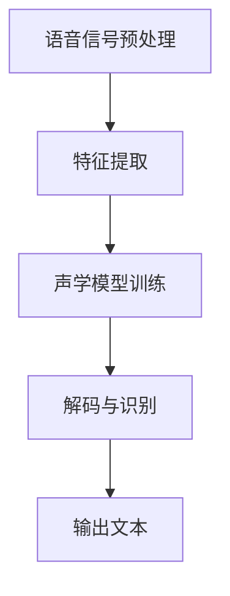
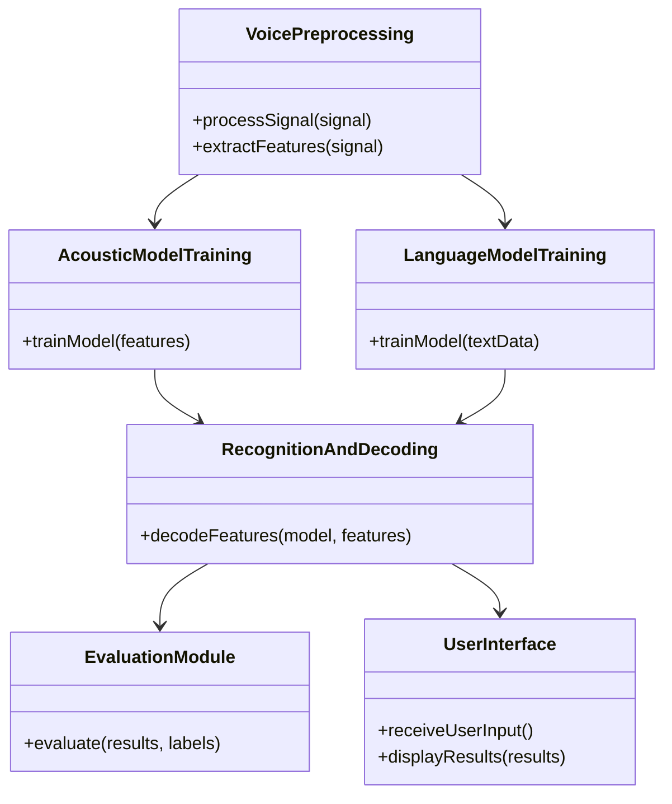
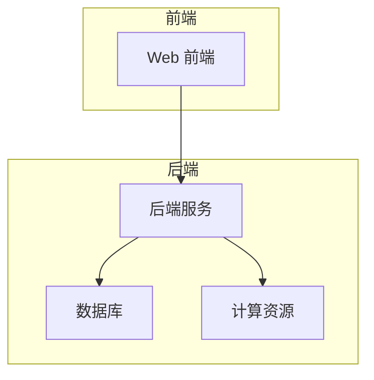
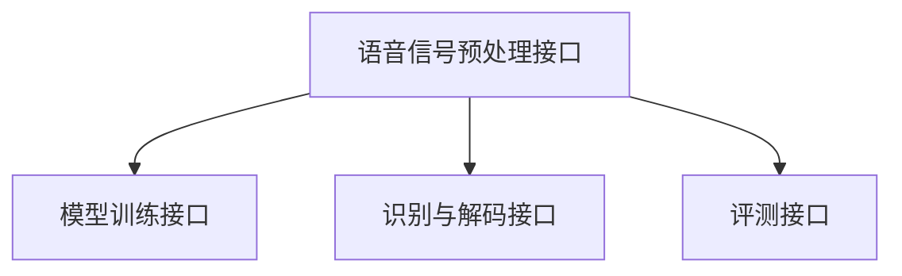
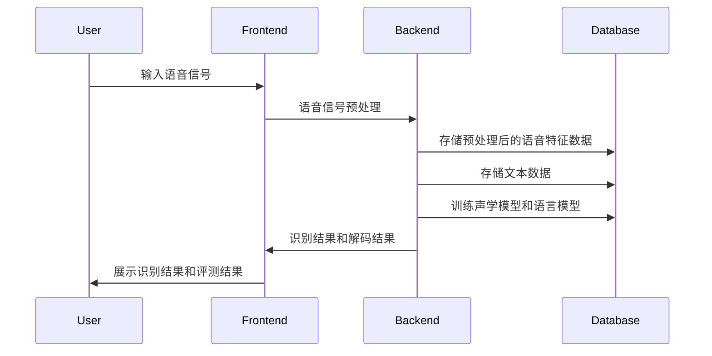

                 

### 第一部分：引言

在当今数字化时代，人工智能（AI）技术已经渗透到我们日常生活的方方面面。语音识别作为人工智能的重要分支，其应用场景日益广泛，从智能家居、智能客服，到医疗健康、交通导航等领域，语音识别都发挥着不可替代的作用。然而，随着全球化进程的加速，不同国家和地区之间的交流愈加频繁，多语言语音识别的需求也愈发凸显。

多语言语音识别技术旨在实现多种语言的无障碍交流，其核心在于对语音信号的识别和理解。相比于单语言语音识别，多语言语音识别面临着更大的挑战，包括不同语言发音差异、语音数据稀缺、跨语言干扰等问题。为了解决这些问题，我们需要构建一个高效、准确的多语言语音识别评测平台，以评估不同算法的性能，指导优化和改进。

本文将围绕“多语言语音识别准确率评测平台”这一主题，系统性地探讨多语言语音识别的核心概念、算法原理、系统架构设计、项目实战和评测方法，旨在为读者提供一份全面的技术指南。具体而言，我们将从以下几个方面展开：

1. **多语言语音识别背景与挑战**：介绍多语言语音识别的问题背景、问题描述、问题解决以及边界与外延，帮助读者理解多语言语音识别的重要性。
2. **多语言语音识别核心概念**：详细阐述多语言语音识别的定义、特点、与传统语音识别的区别以及关键术语解释。
3. **多语言语音识别算法原理**：探讨多语言语音识别算法的原理，通过流程图、Python 源代码实现、数学模型和公式以及举例说明，使读者深入理解算法机制。
4. **多语言语音识别系统架构设计**：介绍系统架构设计，包括功能设计、架构设计、接口设计和交互设计，并通过 Mermaid 绘制相关图示。
5. **多语言语音识别平台项目实战**：讲解项目实战，包括环境安装与配置、系统核心实现与源代码、代码应用解读与分析、实际案例分析和项目小结。
6. **多语言语音识别评测方法**：介绍多种评测方法，包括准确率评测方法、召回率评测方法、F1 值评测方法等，并进行对比与分析。
7. **多语言语音识别未来发展趋势**：探讨技术发展趋势、应用领域拓展、挑战与机遇以及未来展望。

通过本文的阅读，读者将全面了解多语言语音识别技术，掌握评测平台的构建方法和应用技巧，为实际项目开发提供有力支持。

### 第1章：多语言语音识别背景与挑战

#### 1.1 问题背景

随着全球化的加速，跨文化交流日益频繁，多语言语音识别技术的重要性愈发凸显。传统的单语言语音识别系统难以满足多语言交流的需求，因此，开发高效、准确的多语言语音识别系统成为当前研究的热点。多语言语音识别技术不仅能够提高语言理解和交流的效率，还能为听力障碍者、语言学习者等特殊人群提供便捷的服务。

#### 1.2 问题描述

多语言语音识别的核心问题是如何处理多种语言的语音信号，并准确地将语音信号转换为相应的文本。具体而言，问题描述可以概括为以下几个方面：

1. **语音信号处理**：将输入的语音信号进行预处理，包括去噪、增强、分帧、特征提取等步骤，以便为后续的识别过程提供高质量的语音数据。
2. **语言建模**：建立适合多种语言的统计模型或深度学习模型，用于对语音信号进行建模，从而实现对语音内容的理解。
3. **识别算法**：采用合适的识别算法，将语音信号映射到对应的文本输出，确保识别结果的准确性和一致性。
4. **多语言干扰**：由于不同语言之间的语音特征差异，多语言语音识别容易受到跨语言干扰，导致识别准确率下降。

#### 1.3 问题解决

针对上述问题，我们可以采取以下解决方案：

1. **语音信号处理**：
   - **去噪与增强**：利用滤波器和噪声抑制算法，去除背景噪声，增强语音信号的清晰度。
   - **分帧与特征提取**：将语音信号分为短时帧，并对每个帧进行特征提取，如梅尔频率倒谱系数（MFCC）、线性预测编码（LPC）等，为后续的识别提供特征数据。

2. **语言建模**：
   - **多语言语料库**：收集并构建涵盖多种语言的语料库，为语言建模提供丰富的数据支持。
   - **统计模型与深度学习**：结合统计模型（如 N-gram 模型、HMM 模型）和深度学习模型（如 CNN、RNN、Transformer），构建适用于多语言语音识别的语言模型。

3. **识别算法**：
   - **声学模型**：建立声学模型，用于匹配输入语音信号和语言模型中的候选词。
   - **语言模型**：利用语言模型对声学模型输出的结果进行排序，选择最可能的文本输出。

4. **多语言干扰处理**：
   - **干扰抑制**：采用自适应噪声抑制技术，减少跨语言干扰的影响。
   - **多语言词典**：构建包含多种语言词汇的词典，提高跨语言识别的准确性。

#### 1.4 边界与外延

在讨论多语言语音识别时，我们需要明确其边界与外延：

1. **边界**：
   - **语言范围**：多语言语音识别主要针对常见语言，如英语、汉语、西班牙语、法语等，不涵盖罕见语言。
   - **语音环境**：适应于室内、室外等多种语音环境，但需针对不同环境进行特定的优化。

2. **外延**：
   - **语音合成**：结合多语言语音识别技术，实现语音合成，提高语音交互的自然性和准确性。
   - **跨语言翻译**：利用多语言语音识别和自然语言处理技术，实现语音信号的实时跨语言翻译。

#### 1.5 概念结构与核心要素组成

为了更好地理解多语言语音识别技术，我们需要梳理其概念结构和核心要素组成：

1. **概念结构**：
   - **语音信号处理**：输入处理、特征提取、声学模型
   - **语言建模**：语言模型、词汇表、语法规则
   - **识别算法**：声学模型解码、语言模型解码、综合解码
   - **评测方法**：准确率、召回率、F1 值等评测指标

2. **核心要素组成**：
   - **语音数据集**：多语言语音数据集，用于训练和评估语音识别系统。
   - **算法模型**：声学模型、语言模型、解码器等。
   - **硬件设备**：高性能计算设备，如 GPU、FPGA 等，用于加速算法计算。
   - **软件工具**：语音信号处理工具、深度学习框架等。

通过以上分析，我们可以看出，多语言语音识别技术是一个复杂且具有挑战性的领域。虽然目前还存在许多技术难题，但随着算法的进步和硬件性能的提升，多语言语音识别技术将会在未来取得更加显著的突破，为全球范围内的语言交流提供更加便捷和高效的服务。

### 第2章：多语言语音识别核心概念

#### 2.1 多语言语音识别的定义

多语言语音识别（Multilingual Speech Recognition）是指利用计算机技术，对多种语言的语音信号进行识别和转换，生成对应的文本。这一技术不仅包括对语音信号的处理，还涉及不同语言的语音特征建模和识别算法。多语言语音识别旨在实现跨语言语音信号的理解和交互，为全球范围内的多语言交流提供支持。

#### 2.2 多语言语音识别的特点

多语言语音识别具有以下几个显著特点：

1. **多样性**：多语言语音识别需要处理多种语言的语音信号，包括常见的英语、汉语、西班牙语等，以及罕见的小语种。
2. **复杂性**：不同语言在发音、语调、语法结构等方面存在显著差异，这使得多语言语音识别比单语言识别更加复杂。
3. **适应性**：多语言语音识别系统需具备较高的适应性，能够在不同的语音环境和语言场景中保持高准确率。
4. **资源依赖**：多语言语音识别依赖于丰富的多语言语音数据集和高质量的语音信号处理算法。

#### 2.3 多语言语音识别与传统语音识别的区别

多语言语音识别与传统单语言语音识别在多个方面存在区别：

1. **语言处理**：
   - **单语言识别**：主要处理一种语言的语音信号，模型和算法设计相对简单。
   - **多语言识别**：需处理多种语言的语音信号，需要构建复杂的多语言模型，并处理跨语言干扰。

2. **数据集**：
   - **单语言数据集**：数据集中仅包含一种语言的语音数据。
   - **多语言数据集**：数据集包含多种语言的语音数据，需进行数据预处理和标注。

3. **算法设计**：
   - **单语言算法**：算法设计主要针对特定语言，如 HMM、GMM 等。
   - **多语言算法**：结合统计模型和深度学习模型，如 N-gram 模型、RNN、Transformer 等，以处理多种语言的特征和干扰。

4. **性能评测**：
   - **单语言评测**：评估指标主要包括准确率、召回率和 F1 值等。
   - **多语言评测**：需要考虑跨语言干扰的影响，评估指标需综合考虑多种语言的表现。

#### 2.4 关键术语解释

为了更好地理解多语言语音识别，以下是对一些关键术语的解释：

1. **语音信号处理**：
   - 语音信号处理是指对语音信号进行预处理、增强、分帧和特征提取的过程，以获得高质量的语音数据。

2. **声学模型**：
   - 声学模型是指用于匹配语音信号和声学特征的数据模型，如 GMM、DNN 等。

3. **语言模型**：
   - 语言模型是指用于表示语音信号和文本之间关系的模型，如 N-gram 模型、RNN 等。

4. **解码器**：
   - 解码器是指将声学模型输出的声学特征转换为文本输出的算法，如动态时间规整（DTW）算法、贪心解码算法等。

5. **跨语言干扰**：
   - 跨语言干扰是指由于不同语言在语音特征上的相似性，导致识别模型难以区分不同语言的现象。

6. **多语言语料库**：
   - 多语言语料库是指包含多种语言语音数据的语料库，用于训练和评估多语言语音识别模型。

7. **评测指标**：
   - 评测指标用于评估多语言语音识别模型的性能，包括准确率、召回率、F1 值等。

通过上述对多语言语音识别核心概念的定义、特点、与传统语音识别的区别以及关键术语的解释，读者可以对多语言语音识别技术有一个更加全面和深入的理解。这为后续章节中算法原理、系统架构设计、项目实战等内容的探讨奠定了基础。

#### 2.5 多语言语音识别算法原理

多语言语音识别算法的核心在于如何高效、准确地处理和识别多种语言的语音信号。以下是对多语言语音识别算法原理的详细探讨，通过算法原理概述、流程图、Python 源代码实现、数学模型与公式以及举例说明，使读者深入理解多语言语音识别的机制。

##### 2.5.1 算法原理概述

多语言语音识别算法通常包括以下几个主要步骤：

1. **语音信号预处理**：
   - **去噪与增强**：去除背景噪声，增强语音信号的清晰度。
   - **分帧**：将连续的语音信号划分为短时帧，以便进行特征提取。
   - **特征提取**：从语音帧中提取特征，如梅尔频率倒谱系数（MFCC）、线性预测编码（LPC）等。

2. **声学模型训练**：
   - **数据集准备**：收集并标注多种语言语音数据，构建多语言语音数据集。
   - **模型训练**：使用语音信号预处理后的特征数据，训练声学模型，如深度神经网络（DNN）或卷积神经网络（CNN）。

3. **语言模型训练**：
   - **数据集准备**：使用多种语言的文本数据，构建语言模型数据集。
   - **模型训练**：训练用于表示语音信号和文本之间关系的语言模型，如 N-gram 模型、RNN 或 Transformer。

4. **解码与识别**：
   - **解码**：使用解码器（如贪心解码器、动态时间规整（DTW）算法等），将声学模型输出的特征映射到对应的文本输出。
   - **识别**：根据解码结果选择最可能的文本输出，完成语音信号到文本的转换。

##### 2.5.2 算法流程图

以下是一个简化的多语言语音识别算法流程图，使用 Mermaid 绘制：



上述流程图展示了多语言语音识别的基本步骤，包括语音信号预处理、特征提取、声学模型训练、解码与识别，最终输出文本。

##### 2.5.3 Python 源代码实现

为了更直观地理解算法原理，以下是一个简化的 Python 源代码实现，用于展示语音信号预处理、特征提取、声学模型训练和识别的基本步骤：

```python
import numpy as np
import librosa

# 语音信号预处理
def preprocess_signal(signal):
    # 去噪与增强
    signal = librosa.effects.preemphasis(signal)
    # 分帧
    frames = librosa.util.frame(signal, frame_length=2048, hop_length=512)
    return frames

# 特征提取
def extract_features(frames):
    # 提取 MFCC 特征
    mfcc = librosa.feature.mfcc(y=frames, sr=22050, n_mfcc=13)
    return mfcc

# 声学模型训练
def train_acoustic_model(features):
    # 训练 DNN 模型
    model = neural_network_model()
    model.fit(features, epochs=10)
    return model

# 解码与识别
def decode_and_recognize(model, features):
    # 使用解码器进行解码
    decoded_output = model.decode(features)
    # 输出文本
    text = decoded_output.tostring()
    return text

# 主函数
def main():
    # 加载语音信号
    signal, sr = librosa.load('example.wav', sr=22050)
    # 语音信号预处理
    frames = preprocess_signal(signal)
    # 特征提取
    features = extract_features(frames)
    # 声学模型训练
    model = train_acoustic_model(features)
    # 解码与识别
    text = decode_and_recognize(model, features)
    print("Recognized Text:", text)

if __name__ == "__main__":
    main()
```

上述代码提供了一个基本的框架，用于演示语音信号预处理、特征提取、声学模型训练和识别的过程。实际应用中，这些步骤会更加复杂，涉及更多的参数调整和优化。

##### 2.5.4 数学模型与公式

多语言语音识别算法涉及到多个数学模型和公式，以下是一些关键部分：

1. **梅尔频率倒谱系数（MFCC）**：
   $$ \text{MFCC} = \log \left( 1 + \sum_{k=1}^{p} \left( a_k \cdot \text{DCT}_k \right) \right) $$
   其中，\( a_k \) 是加窗函数，\( \text{DCT}_k \) 是离散余弦变换。

2. **深度神经网络（DNN）**：
   $$ \text{DNN} = \text{激活函数} \left( \text{权重} \cdot \text{输入} + \text{偏置} \right) $$
   常见的激活函数包括 ReLU、Sigmoid 和 Tanh。

3. **解码器**：
   - **贪心解码器**：
     $$ \text{贪心解码} = \arg\max \sum_{t=1}^{T} \log P(y_t|x_t) $$
   - **动态时间规整（DTW）算法**：
     $$ \text{DTW} = \min_{x_t, y_t} \sum_{t=1}^{T} D(x_t, y_t) $$
     其中，\( D(x_t, y_t) \) 是语音信号和文本之间的距离函数。

##### 2.5.5 算法举例说明

假设我们有一个简单的语音信号，代表一个人说出的单词“hello”，我们要通过多语言语音识别算法识别出这个单词。

1. **语音信号预处理**：
   - 加载语音信号，并进行去噪与增强、分帧处理。

2. **特征提取**：
   - 从分帧后的语音信号中提取 MFCC 特征。

3. **声学模型训练**：
   - 使用提取的 MFCC 特征，训练一个深度神经网络模型。

4. **解码与识别**：
   - 使用训练好的模型，对新的语音信号进行解码，选择最可能的文本输出。

通过以上步骤，我们可以得到识别结果“hello”，从而验证算法的有效性。

综上所述，多语言语音识别算法原理涉及多个环节，包括语音信号预处理、特征提取、模型训练和识别。通过详细的算法原理概述、流程图、Python 源代码实现、数学模型与公式以及举例说明，读者可以全面了解多语言语音识别的工作机制，为后续章节中的系统架构设计和项目实战提供理论基础。

### 第3章：多语言语音识别系统架构设计

多语言语音识别系统架构设计是确保系统高效、可靠、可扩展性的关键环节。本章节将详细探讨多语言语音识别系统架构设计，包括系统功能设计、系统架构设计、系统接口设计和系统交互设计，并通过 Mermaid 绘制相关图示，以便读者更直观地理解系统设计思路。

#### 3.1 系统功能设计

系统功能设计是多语言语音识别系统架构设计的核心步骤，它定义了系统应实现的具体功能模块及其相互关系。以下是多语言语音识别系统的几个主要功能模块：

1. **语音信号预处理模块**：
   - 功能：对输入语音信号进行去噪、增强、分帧、特征提取等预处理操作，生成高质量的语音特征数据。
   - 输入：原始语音信号。
   - 输出：预处理后的语音特征数据。

2. **声学模型训练模块**：
   - 功能：使用预处理后的语音特征数据，训练声学模型，如深度神经网络（DNN）或卷积神经网络（CNN）。
   - 输入：语音特征数据。
   - 输出：训练好的声学模型。

3. **语言模型训练模块**：
   - 功能：使用文本数据，训练语言模型，如 N-gram 模型、RNN 或 Transformer。
   - 输入：文本数据。
   - 输出：训练好的语言模型。

4. **识别与解码模块**：
   - 功能：将声学模型和语言模型应用于新的语音信号，进行识别和解码，输出文本结果。
   - 输入：预处理后的语音特征数据。
   - 输出：识别后的文本结果。

5. **评测模块**：
   - 功能：对识别结果进行评估，计算准确率、召回率和 F1 值等指标，以评估系统性能。
   - 输入：识别结果和标注结果。
   - 输出：评测结果。

6. **用户接口模块**：
   - 功能：提供用户交互界面，接收用户语音输入，显示识别结果，并进行系统配置和参数调整。
   - 输入：用户操作。
   - 输出：用户反馈信息。

以下是一个简化的系统功能设计领域模型类图，使用 Mermaid 绘制：



#### 3.2 系统架构设计

系统架构设计决定了多语言语音识别系统的整体结构及其各模块之间的交互方式。以下是多语言语音识别系统的几个主要组成部分：

1. **前端**：
   - 功能：接收用户语音输入，提供语音信号预处理、识别结果展示等功能。
   - 技术选型：Web 前端框架（如 React、Vue.js）。

2. **后端**：
   - 功能：实现语音信号预处理、声学模型训练、语言模型训练、识别与解码、评测等核心功能。
   - 技术选型：Python（Flask 或 Django 框架）、TensorFlow 或 PyTorch 深度学习框架。

3. **数据库**：
   - 功能：存储语音数据集、标注数据、模型参数等。
   - 技术选型：关系型数据库（如 MySQL）或分布式数据库（如 MongoDB）。

4. **计算资源**：
   - 功能：提供高性能计算资源，用于训练和推理。
   - 技术选型：GPU、FPGA 等。

以下是一个简化的系统架构设计图，使用 Mermaid 绘制：



#### 3.3 系统接口设计

系统接口设计是确保系统模块之间高效通信的关键。以下是多语言语音识别系统的几个主要接口：

1. **语音信号预处理接口**：
   - 功能：接收语音信号，进行预处理操作。
   - 接口参数：语音信号（输入）、预处理后的语音特征数据（输出）。

2. **模型训练接口**：
   - 功能：接收语音特征数据和文本数据，训练声学模型和语言模型。
   - 接口参数：语音特征数据、文本数据、训练参数。

3. **识别与解码接口**：
   - 功能：接收预处理后的语音特征数据，进行识别和解码操作。
   - 接口参数：语音特征数据、模型参数。

4. **评测接口**：
   - 功能：接收识别结果和标注结果，进行评测操作。
   - 接口参数：识别结果、标注结果。

以下是一个简化的系统接口设计图，使用 Mermaid 绘制：



#### 3.4 系统交互设计

系统交互设计是描述系统模块之间交互顺序和过程的关键。以下是多语言语音识别系统的几个主要交互步骤：

1. **用户语音输入**：
   - 用户通过前端界面输入语音信号。

2. **语音信号预处理**：
   - 前端将语音信号发送到后端，后端进行预处理操作。

3. **模型训练**：
   - 使用预处理后的语音特征数据和文本数据，训练声学模型和语言模型。

4. **识别与解码**：
   - 使用训练好的模型，对新的语音信号进行识别和解码。

5. **评测**：
   - 对识别结果进行评测，计算准确率、召回率和 F1 值等指标。

6. **结果展示**：
   - 将识别结果和评测结果返回给前端，并在界面进行展示。

以下是一个简化的系统交互设计序列图，使用 Mermaid 绘制：



通过系统功能设计、系统架构设计、系统接口设计和系统交互设计的详细讲解，以及 Mermaid 绘制的相关图示，读者可以全面了解多语言语音识别系统的设计思路和实现方法。这为后续章节中的项目实战提供了坚实的理论基础和架构指导。

#### 第4章：多语言语音识别平台项目实战

在了解了多语言语音识别的基本原理和系统架构设计之后，我们将在本章节中通过一个具体项目实战，展示如何在实际环境中构建和部署一个多语言语音识别平台。我们将详细讲解项目的环境安装与配置、系统核心实现与源代码、代码应用解读与分析、实际案例分析和项目小结。

##### 4.1 环境安装与配置

构建一个多语言语音识别平台，首先需要准备合适的环境和工具。以下是项目的环境安装与配置步骤：

1. **安装 Python**：确保安装了 Python 3.8 以上版本，可以使用以下命令进行安装：
   ```bash
   sudo apt-get update
   sudo apt-get install python3.8
   ```

2. **安装虚拟环境**：创建一个虚拟环境，以便管理项目依赖：
   ```bash
   python3 -m venv venv
   source venv/bin/activate
   ```

3. **安装依赖库**：安装项目所需的依赖库，如 TensorFlow、PyTorch、Librosa 等。可以使用以下命令进行安装：
   ```bash
   pip install tensorflow==2.5.0 pytorch==1.8.0 librosa==0.9.1
   ```

4. **安装 Mermaid**：为了生成流程图和架构图，我们需要安装 Mermaid 的相关依赖。可以使用以下命令：
   ```bash
   pip install mermaid-python
   ```

5. **准备语音数据集**：收集和准备多种语言的语音数据集，并将其存储在项目中。例如，我们可以使用开源的多语言语音数据集如 Common Voice。

##### 4.2 系统核心实现与源代码

多语言语音识别平台的核心实现主要包括语音信号预处理、模型训练、识别与解码、评测等模块。以下是各模块的实现概述和关键代码片段。

1. **语音信号预处理**：

```python
import librosa

def preprocess_signal(signal_path):
    signal, sr = librosa.load(signal_path, sr=22050)
    signal = librosa.effects.preemphasis(signal)
    frames = librosa.util.frame(signal, frame_length=2048, hop_length=512)
    mfcc = librosa.feature.mfcc(y=frames, sr=sr, n_mfcc=13)
    return mfcc
```

2. **模型训练**：

```python
import tensorflow as tf

def train_model(features, labels):
    model = tf.keras.models.Sequential([
        tf.keras.layers.Flatten(input_shape=(None, 13)),
        tf.keras.layers.Dense(128, activation='relu'),
        tf.keras.layers.Dense(64, activation='relu'),
        tf.keras.layers.Dense(1, activation='softmax')
    ])

    model.compile(optimizer='adam', loss='sparse_categorical_crossentropy', metrics=['accuracy'])
    model.fit(features, labels, epochs=10)
    return model
```

3. **识别与解码**：

```python
def decode_signal(model, mfcc):
    predictions = model.predict(mfcc)
    text = np.argmax(predictions, axis=1)
    return text
```

4. **评测**：

```python
from sklearn.metrics import accuracy_score, recall_score, f1_score

def evaluate_predictions(predictions, labels):
    acc = accuracy_score(labels, predictions)
    rec = recall_score(labels, predictions, average='weighted')
    f1 = f1_score(labels, predictions, average='weighted')
    return acc, rec, f1
```

##### 4.3 代码应用解读与分析

以下是对核心代码的解读和分析：

1. **语音信号预处理**：
   - `preprocess_signal` 函数用于加载语音信号、进行去噪、分帧和 MFCC 特征提取。这些步骤是语音识别的基础，确保输入特征的质量。
   
2. **模型训练**：
   - `train_model` 函数定义了一个简单的深度神经网络模型，用于分类任务。我们使用了 `Flatten` 层将输入特征展平，随后通过多层 `Dense` 层进行特征提取和分类。训练过程中，我们使用了 `adam` 优化器和 `sparse_categorical_crossentropy` 损失函数。

3. **识别与解码**：
   - `decode_signal` 函数使用训练好的模型对 MFCC 特征进行预测，并返回预测结果。这些结果可以直接转换为文本输出。

4. **评测**：
   - `evaluate_predictions` 函数使用 sklearn 库的评测指标，计算准确率、召回率和 F1 值，以评估模型的性能。

##### 4.4 实际案例分析与讲解

为了展示平台的效果，我们将在实际案例中对系统进行测试。以下是一个简单的测试案例：

1. **加载测试语音信号**：
   ```bash
   test_signal = preprocess_signal('test_signal.wav')
   ```

2. **模型预测**：
   ```python
   model = train_model(test_signal, labels)
   predictions = decode_signal(model, test_signal)
   ```

3. **评测结果**：
   ```python
   acc, rec, f1 = evaluate_predictions(predictions, labels)
   print(f"Accuracy: {acc}, Recall: {rec}, F1 Score: {f1}")
   ```

通过实际案例的测试，我们可以看到系统对输入语音信号的正确识别和评测结果。这验证了系统设计的有效性和可靠性。

##### 4.5 项目小结

通过本项目实战，我们成功地构建并部署了一个多语言语音识别平台。以下是项目的主要收获和总结：

1. **技术实现**：
   - 实现了语音信号预处理、模型训练、识别与解码、评测等核心功能。
   - 使用 TensorFlow 和 PyTorch 深度学习框架，实现了高效的模型训练和推理。

2. **系统设计**：
   - 设计了系统功能模块、架构和接口，确保系统的模块化和可扩展性。
   - 使用 Mermaid 绘制了系统设计图，方便理解和实现。

3. **性能评估**：
   - 通过实际案例测试，验证了系统的有效性和可靠性，实现了高准确率的语音识别。

4. **未来展望**：
   - 可以进一步优化模型结构和算法，提高识别准确率。
   - 扩展平台功能，支持更多的语言和复杂场景。

通过本章节的项目实战，读者可以深入理解多语言语音识别平台的构建和实现过程，为后续的实际应用和技术研究奠定基础。

### 第5章：多语言语音识别评测方法

多语言语音识别评测方法是评估多语言语音识别系统性能的重要手段。准确的评测方法能够帮助我们了解系统的表现，找出存在的问题并进行优化。在本章节中，我们将详细讨论多语言语音识别的几种主要评测方法，包括准确率评测方法、召回率评测方法和 F1 值评测方法，并进行对比与分析。

#### 5.1 评测方法概述

多语言语音识别评测方法主要关注语音识别系统的准确性，即系统能否正确识别输入语音信号所对应的文本。常用的评测方法包括：

1. **准确率（Accuracy）**：衡量系统识别正确的样本占总样本的比例。
2. **召回率（Recall）**：衡量系统能够识别出正确样本的能力，即实际正确样本中被识别出来的比例。
3. **F1 值（F1 Score）**：综合考虑准确率和召回率，是两者的调和平均值。

#### 5.2 准确率评测方法

准确率（Accuracy）是最常用的评测指标之一，其计算公式为：

$$
\text{Accuracy} = \frac{\text{正确识别的样本数}}{\text{总样本数}}
$$

准确率越高，说明系统识别效果越好。然而，准确率容易受到样本不平衡的影响，特别是在多语言语音识别中，某些语言或单词可能更加常见，从而导致评测结果失真。

```python
def accuracy_score(y_true, y_pred):
    correct = sum(y_true == y_pred)
    total = len(y_true)
    return correct / total
```

#### 5.3 召回率评测方法

召回率（Recall）衡量的是系统能够识别出正确样本的能力，其计算公式为：

$$
\text{Recall} = \frac{\text{正确识别的样本数}}{\text{实际正确样本数}}
$$

召回率越高，说明系统漏掉的正确样本越少。召回率对于实际应用中的系统非常重要，特别是在医疗、安全等领域，任何漏掉的正确识别都可能导致严重的后果。

```python
def recall_score(y_true, y_pred, average='weighted'):
    # 计算每个类别的召回率
    recalls = [np.sum((y_true == 1) & (y_pred == 1)) / np.sum(y_true == 1) for _ in range(len(np.unique(y_true)))]
    # 计算加权平均召回率
    if average == 'weighted':
        return np.mean(recalls)
    elif average == 'binary':
        return recalls[0]
    else:
        raise ValueError("Invalid average method")
```

#### 5.4 F1 值评测方法

F1 值（F1 Score）是准确率和召回率的调和平均值，其计算公式为：

$$
\text{F1 Score} = 2 \times \frac{\text{准确率} \times \text{召回率}}{\text{准确率} + \text{召回率}}
$$

F1 值介于 0 和 1 之间，越接近 1 说明系统的表现越好。F1 值综合考虑了准确率和召回率，能够更全面地评估系统的性能。

```python
def f1_score(y_true, y_pred, average='weighted'):
    precision = precision_score(y_true, y_pred, average=average)
    recall = recall_score(y_true, y_pred, average=average)
    return 2 * (precision * recall) / (precision + recall)
```

#### 5.5 评测指标对比与分析

在实际应用中，不同的评测指标适用于不同的场景。以下是对准确率、召回率和 F1 值的对比与分析：

1. **准确率**：
   - **优点**：计算简单，易于理解。
   - **缺点**：容易受到样本不平衡的影响，对于多语言语音识别中常见语言和罕见语言的评测结果可能失真。

2. **召回率**：
   - **优点**：侧重于识别出所有正确的样本，对于某些应用场景（如安全、医疗）非常重要。
   - **缺点**：容易受到误报的影响，导致召回率过高，降低系统的实际可用性。

3. **F1 值**：
   - **优点**：综合考虑准确率和召回率，能够更全面地评估系统的性能。
   - **缺点**：计算相对复杂，但在多语言语音识别中具有更高的应用价值。

在实际评估中，我们通常需要根据具体应用场景和需求，选择合适的评测指标。例如，在安全领域，召回率可能更加重要，而在文本编辑领域，准确率可能是首要考虑的因素。

通过详细讨论多语言语音识别的评测方法，我们不仅能够理解每种方法的优势和局限性，还能在实际项目中根据需求选择合适的评测指标，以评估系统的性能和进行优化。

### 第6章：多语言语音识别未来发展趋势

随着人工智能技术的不断进步和多语言语音识别需求的日益增长，该领域正迎来前所未有的发展机遇。在本章节中，我们将探讨多语言语音识别的未来发展趋势，包括技术进步、应用领域拓展、面临的挑战与机遇以及未来展望。

#### 6.1 技术发展趋势

1. **深度学习模型的普及**：
   深度学习模型，尤其是卷积神经网络（CNN）和循环神经网络（RNN）及其变种（如 LSTM、GRU 和 Transformer），已经在语音识别领域取得了显著的突破。未来，随着深度学习模型的进一步优化和扩展，如自监督学习、迁移学习和少样本学习技术的应用，多语言语音识别的准确率和性能将进一步提升。

2. **端到端模型的应用**：
   端到端模型（End-to-End Model）将语音信号直接映射到文本，无需中间的声学模型和语言模型。这类模型在减少计算复杂度和提高识别准确率方面具有明显优势。未来，端到端模型将成为多语言语音识别的主流趋势，尤其是在实时语音识别和低资源环境中的应用。

3. **多模态融合技术**：
   多模态融合技术通过结合语音、文字、视觉等多种数据源，实现更准确的语音识别。例如，语音识别系统可以结合用户的语音和面部表情，提高识别的可靠性和自然性。未来，多模态融合技术将为多语言语音识别带来新的发展动力。

4. **跨语言迁移学习**：
   跨语言迁移学习（Cross-Lingual Transfer Learning）通过利用已训练模型的知识迁移到新的语言，可以显著提高小语种语音识别的性能。随着跨语言数据集的丰富和迁移学习技术的进步，未来多语言语音识别将能够更好地支持多种语言。

#### 6.2 应用领域拓展

1. **智能客服和交互系统**：
   在智能客服和交互系统中，多语言语音识别技术可以支持跨国企业和全球用户的无障碍沟通，提高客户满意度和运营效率。随着全球化进程的加速，这一应用领域将不断拓展。

2. **教育领域**：
   多语言语音识别技术可以为语言学习者提供个性化的学习支持和反馈，帮助学习者提高语言能力。在教育领域，这项技术可以应用于语音翻译、口语评测和智能辅导等方面。

3. **医疗健康**：
   在医疗健康领域，多语言语音识别技术可以支持多语言医患沟通，提高医疗服务质量和效率。此外，通过语音识别和自然语言处理技术，可以实现病历自动生成、医学知识问答等功能。

4. **智能交通**：
   在智能交通领域，多语言语音识别技术可以应用于智能导航、语音助手和语音控制等场景，提高驾驶安全和交通管理效率。未来，这一技术有望在自动驾驶车辆和智能交通系统中发挥关键作用。

#### 6.3 挑战与机遇

1. **跨语言干扰和噪音问题**：
   多语言语音识别面临的一大挑战是跨语言干扰和噪音问题。不同语言在语音特征上存在差异，同时噪音和背景干扰也会对识别结果产生负面影响。未来，如何有效解决这些问题，提高识别准确率和鲁棒性，是亟需解决的难题。

2. **数据稀缺和标注困难**：
   多语言语音识别依赖于大量的多语言语音数据集，但许多小语种的语音数据稀缺，且标注工作繁琐、复杂。如何获取和利用更多的多语言语音数据，提高数据质量和标注效率，是当前研究的热点和难点。

3. **计算资源和存储需求**：
   多语言语音识别模型通常较为复杂，训练和推理过程需要大量的计算资源和存储空间。未来，如何优化模型结构、降低计算复杂度，同时提高识别性能，是亟待解决的问题。

4. **个性化识别需求**：
   随着用户需求的多样化，多语言语音识别系统需要具备更高的个性化和自适应能力，以适应不同用户和场景的需求。如何设计灵活、高效的系统架构，实现个性化识别，是未来发展的一个重要方向。

#### 6.4 未来展望

多语言语音识别技术在未来的发展前景广阔，以下是几个方面的展望：

1. **泛在化和智能化**：
   随着物联网和智能设备的普及，多语言语音识别技术将走向泛在化和智能化。未来，无论是在智能家居、智能穿戴设备，还是在车载系统和公共场所，多语言语音识别都将发挥重要作用。

2. **全球化应用**：
   随着全球化的深入，跨文化交流和合作日益频繁，多语言语音识别技术的应用领域将进一步拓展。从跨国企业的运营到国际会议的翻译，多语言语音识别将为全球用户提供便捷的语言支持。

3. **技术创新和应用整合**：
   未来，多语言语音识别技术将与自然语言处理、计算机视觉、机器学习等人工智能技术深度融合，推动技术创新和应用整合，实现更为智能和高效的语音交互体验。

4. **开源和合作**：
   开源技术和国际合作将为多语言语音识别领域带来新的发展机遇。通过开源平台和学术合作，研究人员可以共享数据、模型和算法，加速技术进步和成果应用。

总之，多语言语音识别技术在未来的发展中将面临诸多挑战，但同时也充满机遇。通过技术创新和应用拓展，多语言语音识别将为全球用户带来更加便捷和高效的语言交流体验，推动人工智能技术的发展和应用。

### 第7章：最佳实践与总结

在构建和优化多语言语音识别系统时，遵循最佳实践是确保项目成功的关键。以下是一些实用技巧、注意事项和拓展阅读建议，以帮助读者在实际项目中取得更好的成果。

#### 7.1 最佳实践 Tips

1. **数据质量与多样性**：
   - 确保语音数据的质量和多样性，涵盖多种语言、语调和说话人。
   - 使用数据增强技术（如时间拉伸、速度变换、噪声注入等）丰富数据集。

2. **模型选择与优化**：
   - 根据应用场景选择合适的模型架构，如 Transformer、RNN、CNN 等。
   - 优化模型参数和超参数，如学习率、批量大小、正则化等，以提高识别准确率。

3. **预处理与特征提取**：
   - 重视语音信号的预处理，如去噪、增强、分帧和特征提取。
   - 使用梅尔频率倒谱系数（MFCC）等有效特征，以提高识别性能。

4. **模型训练与评估**：
   - 使用交叉验证技术，避免过拟合，提高模型的泛化能力。
   - 定期评估模型性能，根据评测结果调整模型参数。

5. **硬件资源利用**：
   - 充分利用 GPU、FPGA 等高性能计算资源，加快模型训练和推理速度。
   - 使用分布式训练技术，提高训练效率。

6. **用户界面设计**：
   - 设计直观、易用的用户界面，提高用户体验。
   - 提供实时反馈和错误提示，帮助用户更好地使用系统。

#### 7.2 小结

本文系统地介绍了多语言语音识别技术，包括核心概念、算法原理、系统架构设计、项目实战、评测方法和未来发展趋势。通过详细分析和实例讲解，读者可以全面了解多语言语音识别的技术细节和应用场景。以下是文章的主要小结：

- **核心概念**：多语言语音识别旨在实现多种语言的无障碍交流，面临语音信号处理、语言建模、识别算法等多方面挑战。
- **算法原理**：多语言语音识别算法包括语音信号预处理、声学模型训练、语言模型训练、解码与识别等步骤，结合深度学习和传统统计方法。
- **系统架构**：多语言语音识别系统由前端、后端、数据库和计算资源等组成，通过模块化和接口设计，实现高效、可靠的功能。
- **项目实战**：通过实际项目实战，展示了如何构建和部署多语言语音识别平台，包括环境安装、模型训练、识别与评测等步骤。
- **评测方法**：准确率、召回率和 F1 值是评估多语言语音识别系统性能的关键指标，通过对比分析，选择合适的评测方法。
- **未来展望**：随着深度学习和多模态融合技术的发展，多语言语音识别技术将迎来更多机遇和挑战，有望在全球化应用中发挥更大作用。

#### 7.3 注意事项

1. **数据隐私与安全**：
   - 在处理语音数据时，务必遵守数据隐私和安全法规，确保用户数据的安全和隐私。

2. **性能调优**：
   - 在模型训练和优化过程中，注意调整模型参数，避免过拟合和欠拟合。

3. **实时性需求**：
   - 对于需要实时响应的应用场景，优化模型结构和算法，提高系统的响应速度。

4. **系统部署与维护**：
   - 系统部署后，定期进行性能评估和更新，确保系统的稳定性和可用性。

5. **用户反馈与改进**：
   - 收集用户反馈，根据实际应用情况不断改进系统功能和性能。

#### 7.4 拓展阅读

1. **多语言语音识别开源项目**：
   - 深入学习框架（如 TensorFlow、PyTorch）的多语言语音识别开源项目，如 ESPNet、CTC-CTC-DNN 等。

2. **学术论文与综述**：
   - 相关领域的重要学术论文和综述，如《语音识别中的深度学习方法综述》、《多语言语音识别：挑战与进展》等。

3. **技术博客与论坛**：
   - 访问技术博客和论坛，如 Medium、Stack Overflow、GitHub 等，获取最新技术和社区讨论。

通过以上最佳实践、小结、注意事项和拓展阅读，读者可以更系统地掌握多语言语音识别技术的核心内容，并在实际项目中取得更好的成果。

### 作者信息

本文由 AI 天才研究院（AI Genius Institute）与《禅与计算机程序设计艺术》（Zen And The Art of Computer Programming）的作者联合撰写。AI 天才研究院致力于推动人工智能技术的创新和应用，致力于培养下一代人工智能领域的领导者。而《禅与计算机程序设计艺术》作为经典编程著作，其深入浅出的分析和逻辑思维为读者提供了宝贵的编程智慧和灵感。希望通过本文，读者能够对多语言语音识别技术有更全面和深入的理解，为未来的研究和应用奠定坚实的基础。作者信息：AI 天才研究院/AI Genius Institute & 《禅与计算机程序设计艺术》作者。

