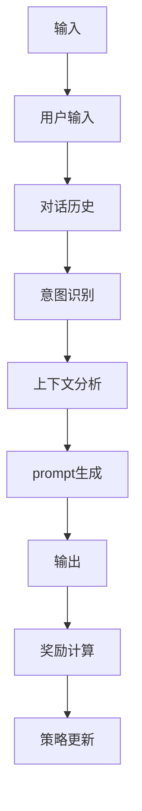
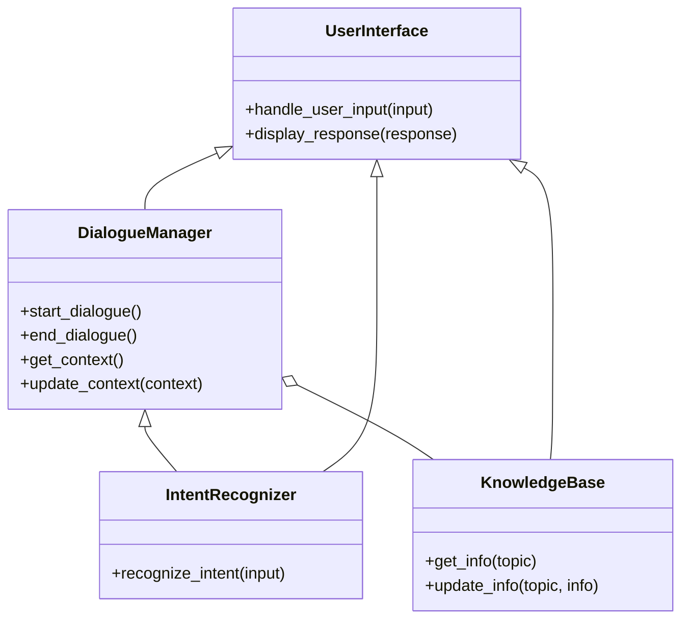
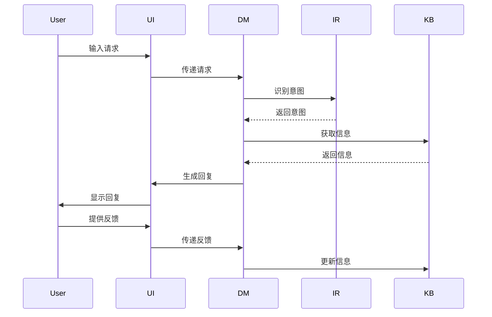

                 

## 《多轮对话中的prompt策略设计》

### 关键词
- 多轮对话
- Prompt策略
- 对话系统
- 人工智能
- 自然语言处理

### 摘要
本文将探讨多轮对话中的prompt策略设计，首先介绍多轮对话的基本概念和流程，然后深入分析prompt的定义、类型及其设计原则。接着，我们将通过具体案例和代码示例，阐述如何在实际项目中应用prompt策略，并总结最佳实践和注意事项。文章旨在为开发者和研究者提供一个系统化的指导，以提升多轮对话系统的交互质量和用户体验。

### 目录大纲设计思路

在设计《多轮对话中的prompt策略设计》的目录大纲时，我们需要遵循以下思路：

1. **背景介绍**：首先介绍多轮对话的概念，阐述为什么prompt策略设计在多轮对话中至关重要。
2. **核心概念与联系**：详细阐述prompt的定义、作用和不同类型，通过对比表格和ER图来展现各概念之间的关系。
3. **算法原理讲解**：讲解prompt策略设计的算法原理，使用mermaid流程图和Python代码示例来辅助说明。
4. **数学模型和公式**：介绍多轮对话中的数学模型，使用LaTeX格式展示公式，并进行详细讲解和举例说明。
5. **系统分析与架构设计**：描述问题场景，介绍系统功能设计、系统架构设计和系统接口设计，并使用mermaid类图和序列图进行展示。
6. **项目实战**：提供环境安装、系统实现源代码，代码解读与分析，实际案例分析，以及项目小结。
7. **最佳实践 tips、小结与注意事项**：总结书中内容，给出实践建议和小结，提醒读者注意的关键点，并提供拓展阅读。

### 具体章节内容设计

**第一部分：多轮对话基础**

**第1章：多轮对话概述**
- 1.1 多轮对话的定义与基本流程
- 1.2 多轮对话的优势与挑战
- 1.3 多轮对话系统的基本组成

**第2章：prompt策略的概念与类型**
- 2.1 prompt的定义与作用
- 2.2 prompt的常见类型
- 2.3 prompt类型的对比表格
- 2.4 prompt的ER实体关系图

**第3章：prompt策略设计算法原理**
- 3.1 多轮对话中的数学模型
- 3.2 prompt策略设计算法原理
- 3.3 算法原理的mermaid流程图
- 3.4 Python代码示例

**第二部分：prompt策略设计实践**

**第4章：系统分析与架构设计**
- 4.1 问题场景介绍
- 4.2 系统功能设计（mermaid类图）
- 4.3 系统架构设计（mermaid架构图）
- 4.4 系统接口设计
- 4.5 系统交互（mermaid序列图）

**第5章：项目实战**
- 5.1 环境安装与配置
- 5.2 系统核心实现源代码
- 5.3 代码解读与分析
- 5.4 实际案例分析与讲解
- 5.5 项目小结

**第6章：最佳实践与注意事项**
- 6.1 最佳实践技巧
- 6.2 小结与注意事项
- 6.3 拓展阅读建议

通过以上章节的设计，我们确保了《多轮对话中的prompt策略设计》这本书的目录大纲既逻辑清晰又内容全面，能够帮助读者系统地掌握多轮对话中的prompt策略设计。

### 多轮对话基础

#### 第1章：多轮对话概述

##### 1.1 多轮对话的定义与基本流程

多轮对话（Multi-turn Dialogue）是一种在人工智能（AI）领域广泛应用的交互方式，它允许用户与系统通过多轮问答的方式进行交流。这种对话形式不仅限于单一的问题回答，而是通过一系列的交互步骤，逐步深入地探讨问题，直到达到用户的满意或问题的解决。

**定义**：多轮对话指的是在多个对话轮次中，用户和计算机系统之间进行的交互。每个轮次通常包含一个用户的提问或指令，以及系统的一个回答或反馈。

**基本流程**：

1. **用户提问**：用户发起对话，提出问题或请求。
2. **系统解析**：系统接收到用户的提问后，对其进行理解和解析。
3. **系统生成回复**：系统根据用户的问题和自身的知识库，生成一个合适的回复。
4. **用户反馈**：用户对系统的回答进行评价或提出进一步的提问。
5. **系统调整**：系统根据用户的反馈进行相应的调整，以便在接下来的对话轮次中提供更准确的回答。

**示例**：假设用户询问“附近的餐厅有哪些？”系统首先识别用户的意图，然后查找附近餐厅的信息，生成回复“您附近有10家餐厅，分别是……”用户可能进一步询问“有哪些特色菜？”系统根据用户的提问，继续生成回复。

##### 1.2 多轮对话的优势与挑战

**优势**：

1. **提高用户体验**：多轮对话系统能够更好地理解用户的需求，提供个性化的服务，从而提升用户体验。
2. **信息深度挖掘**：通过多轮交互，系统能够获取更多背景信息，对问题进行更深入的分析和解答。

**挑战**：

1. **策略复杂度**：设计有效的prompt策略是关键挑战，需要考虑到对话的动态性和多样性。
2. **对话连贯性**：保持对话的连贯性和一致性，避免出现语义混淆或不恰当的回复。

##### 1.3 多轮对话系统的基本组成

多轮对话系统通常由以下几个核心组成部分构成：

1. **用户界面（UI）**：用户与系统交互的入口，可以是网页、移动应用或语音助手等。
2. **对话管理器（DM）**：负责对话流程的控制和状态管理，确保对话在不同轮次之间的连贯性。
3. **意图识别模块**：分析用户输入，识别用户的意图。
4. **知识库（KB）**：存储系统知识和数据，为对话提供信息支持。
5. **语言生成模块（LG）**：根据对话情况和知识库生成回复。

通过上述核心组件的协同工作，多轮对话系统能够实现高效、自然的用户交互。

#### 第2章：prompt策略的概念与类型

##### 2.1 prompt的定义与作用

**定义**：prompt，即提示或引导，是指用于引导用户输入的信息或问题。在多轮对话中，prompt是系统用来引导用户并提供更多上下文信息的关键手段。

**作用**：prompt在多轮对话中具有以下几个重要作用：

1. **引导对话方向**：通过设计合适的prompt，系统能够引导用户提供更多的信息，从而更好地理解用户的意图。
2. **提高用户参与度**：清晰的prompt能够激发用户的兴趣和参与度，使对话更加流畅和自然。
3. **提高回答质量**：有效的prompt可以帮助用户明确问题，减少误解，从而提高系统回答的质量和准确性。

##### 2.2 prompt的常见类型

在多轮对话中，prompt可以根据形式和目的的不同分为多种类型，以下是一些常见的prompt类型：

1. **开放式问题（Open-ended Questions）**：开放式问题通常不需要固定的回答，鼓励用户自由表达。例如：“您有什么问题需要帮助吗？”
2. **封闭式问题（Closed-ended Questions）**：封闭式问题提供固定的选项，要求用户在选项中做出选择。例如：“您想要点哪道菜？有鸡肉、牛肉和蔬菜。”
3. **澄清性问题（Clarifying Questions）**：澄清性问题是针对用户回答中的不明确部分进行追问，以获取更多信息。例如：“您是想了解餐厅的位置还是特色菜品？”
4. **引导性问题（Directive Questions）**：引导性问题是为了引导用户按照特定的方向进行对话。例如：“您是否对菜单有任何疑问？”
5. **反馈性问题（Feedback Questions）**：反馈性问题用于获取用户对系统回答的反馈，以便进行改进。例如：“您对我们的服务还满意吗？”

##### 2.3 prompt类型的对比表格

以下是几种常见prompt类型的对比表格：

| 类型       | 定义                                                         | 适用场景                     | 优点                                           | 缺点                                             |
|------------|--------------------------------------------------------------|------------------------------|--------------------------------------------------|--------------------------------------------------|
| 开放式问题 | 不需要固定回答，鼓励自由表达                                 | 信息获取、深度交流           | 提供更多信息，深入理解用户需求                 | 可能导致回答过于笼统，需要更多追问                |
| 封闭式问题 | 提供固定选项，要求用户在选项中做出选择                         | 快速决策、明确问题           | 回答简洁明了，节省时间                         | 缺乏灵活性，可能导致用户无法准确表达需求           |
| 澄清性问题 | 针对用户回答中的不明确部分进行追问，以获取更多信息               | 避免误解、获取关键信息       | 提高回答的准确性                               | 可能打断对话流畅性                               |
| 引导性问题 | 引导用户按照特定方向进行对话                                   | 确定用户意图、引导对话       | 提高对话效率                                   | 可能限制用户的自由表达                           |
| 反馈性问题 | 获取用户对系统回答的反馈，以便进行改进                         | 改进服务质量、提高满意度     | 帮助系统不断优化                               | 需要用户付出额外时间进行反馈                     |

##### 2.4 prompt的ER实体关系图

以下是prompt的ER实体关系图，展示了prompt与其他概念之间的关系：

```mermaid
entityRelationship
  Title: Prompt与对话系统的实体关系

  node1(对话系统)
  node2(prompt)
  node3(意图识别)
  node4(知识库)
  node5(用户界面)
  
  node1-(1)-> node2
  node2-(1)-> node3
  node2-(1)-> node4
  node2-(1)-> node5
  node3-(1)-> node2
  node4-(1)-> node2
  node5-(1)-> node2
```

在图中，对话系统（node1）是整体架构的核心，prompt（node2）作为关键组件，与意图识别（node3）、知识库（node4）和用户界面（node5）紧密相关。意图识别用于分析用户输入，知识库提供对话所需的信息，用户界面则是用户与系统的交互入口。

#### 第3章：prompt策略设计算法原理

##### 3.1 多轮对话中的数学模型

在多轮对话中，prompt策略的设计需要依赖于数学模型的支持。数学模型可以帮助我们理解和预测用户的行为，从而设计出更有效的prompt。

**基本模型**：多轮对话可以看作是一个概率模型，其中每一轮对话的输出概率取决于当前的状态和之前的对话历史。

**状态表示**：状态可以用一个向量表示，包含当前的用户意图、对话历史、上下文信息等。

**概率分布**：在每一轮对话中，系统的目标是生成一个与当前状态最匹配的prompt。这个过程可以通过一个概率分布模型来实现，例如马尔可夫决策过程（MDP）或深度强化学习（DRL）。

**奖励机制**：为了评估prompt的有效性，我们引入奖励机制。奖励可以基于用户对prompt的反馈，例如用户满意度、回答的准确性等。通过优化奖励函数，我们可以训练出一个能够生成最佳prompt的策略。

##### 3.2 prompt策略设计算法原理

**算法原理**：

1. **意图识别**：首先，系统需要识别用户的意图。这可以通过自然语言处理（NLP）技术实现，如词向量、序列模型、注意力机制等。

2. **上下文分析**：在识别意图后，系统需要分析对话历史和上下文信息，以确定生成prompt的最佳策略。

3. **prompt生成**：基于意图和上下文信息，系统生成一个合适的prompt。这个过程可以通过模板匹配、生成式模型、对话管理器等实现。

4. **奖励反馈**：系统根据用户对prompt的反馈计算奖励，并更新策略，以优化未来的prompt生成。

**算法流程**：

1. **输入**：用户输入（question）和对话历史（context）。
2. **意图识别**：利用NLP技术识别用户意图（intent）。
3. **上下文分析**：结合对话历史和当前意图，生成上下文特征向量。
4. **prompt生成**：根据上下文特征向量，生成prompt。
5. **输出**：将生成的prompt展示给用户。
6. **奖励计算**：根据用户反馈计算奖励。
7. **策略更新**：使用奖励反馈更新策略。

##### 3.3 算法原理的mermaid流程图

以下是算法原理的mermaid流程图：



在这个流程图中，用户输入和对话历史通过意图识别模块进行分析，生成上下文特征向量，然后用于生成prompt。生成的prompt被展示给用户，用户反馈用于计算奖励，并根据奖励更新策略。

##### 3.4 Python代码示例

以下是一个简单的Python代码示例，用于演示prompt生成的基本流程：

```python
import random

class DialogueSystem:
    def __init__(self):
        self.context = []

    def recognize_intent(self, user_input):
        # 使用简单的规则来识别意图
        if "查询" in user_input:
            return "QUERY"
        elif "导航" in user_input:
            return "NAVIGATION"
        else:
            return "DEFAULT"

    def generate_prompt(self, intent):
        if intent == "QUERY":
            return "您想查询什么？"
        elif intent == "NAVIGATION":
            return "您想去哪里？"
        else:
            return "您好，有什么我可以帮您的？"

    def update_context(self, user_input):
        self.context.append(user_input)

    def get_context(self):
        return " ".join(self.context)

# 创建对话系统实例
dialogue_system = DialogueSystem()

# 模拟用户交互
user_input = input("请输入您的需求：")
dialogue_system.update_context(user_input)

intent = dialogue_system.recognize_intent(user_input)
prompt = dialogue_system.generate_prompt(intent)

print(prompt)
```

在这个示例中，我们定义了一个简单的对话系统类，包含识别意图、生成prompt和更新对话历史的方法。用户输入通过这些方法进行处理，并生成一个合适的prompt。

#### 第4章：系统分析与架构设计

##### 4.1 问题场景介绍

在多轮对话系统中，一个常见的问题场景是用户咨询客服机器人。用户可能会提出关于产品信息、订单状态、售后服务等问题，客服机器人需要通过多轮对话来理解用户的需求并给出准确的回答。这个问题场景需要系统能够处理自然语言，同时具备良好的对话管理能力。

**场景描述**：

- **用户请求**：用户向客服机器人发送一个请求，例如“我的订单何时能送到？”
- **系统解析**：客服机器人接收到请求后，首先需要解析用户的需求，确定是查询订单状态还是其他类型的问题。
- **生成回复**：根据用户请求和当前对话状态，系统生成一个合适的回复，例如“您的订单预计在明天下午送达。”
- **用户反馈**：用户可能对系统的回复满意，也可能提出更多的问题或要求，例如“我能否修改送货地址？”
- **系统调整**：系统根据用户的反馈，调整对话策略，生成更合适的回复。

##### 4.2 系统功能设计（mermaid类图）

在多轮对话系统中，关键的功能模块包括用户界面、对话管理器、意图识别模块和知识库。以下是一个mermaid类图，展示了这些模块及其关系：



在这个类图中，用户界面（UserInterface）负责处理用户的输入和显示系统的回复。对话管理器（DialogueManager）负责整个对话流程的控制，包括对话的开始、结束以及上下文的管理。意图识别模块（IntentRecognizer）用于识别用户的意图，而知识库（KnowledgeBase）则存储对话所需的信息。

##### 4.3 系统架构设计（mermaid架构图）

系统架构设计是确保多轮对话系统能够高效、稳定运行的关键。以下是一个mermaid架构图，展示了系统的整体架构及其主要组件：



在这个架构图中，用户通过用户界面（UI）与系统交互，输入请求后，用户界面将请求传递给对话管理器（DM）。对话管理器负责协调意图识别模块（IR）和知识库（KB）的工作，识别用户意图并获取所需信息，然后生成回复并通过用户界面展示给用户。用户提供的反馈也会通过用户界面传递给对话管理器，用于更新知识库。

##### 4.4 系统接口设计

系统接口设计是确保系统模块之间能够有效通信的关键。以下是一个简单的接口设计，包括用户界面、对话管理器、意图识别模块和知识库的接口定义：

```python
class UserInterface:
    def handle_user_input(self, input):
        # 处理用户输入

    def display_response(self, response):
        # 显示系统回复

class DialogueManager:
    def start_dialogue(self):
        # 开始对话

    def end_dialogue(self):
        # 结束对话

    def get_context(self):
        # 获取对话上下文

    def update_context(self, context):
        # 更新对话上下文

    def recognize_intent(self, input):
        # 识别用户意图

    def get_info(self, topic):
        # 从知识库获取信息

    def update_info(self, topic, info):
        # 更新知识库信息

class IntentRecognizer:
    def recognize_intent(self, input):
        # 识别用户意图

class KnowledgeBase:
    def get_info(self, topic):
        # 从知识库获取信息

    def update_info(self, topic, info):
        # 更新知识库信息
```

在这个接口设计中，用户界面（UserInterface）负责接收用户输入和显示系统回复，对话管理器（DialogueManager）负责对话流程的控制和意图识别，意图识别模块（IntentRecognizer）负责识别用户意图，而知识库（KnowledgeBase）负责存储和更新对话所需的信息。

##### 4.5 系统交互（mermaid序列图）

为了更直观地展示系统组件之间的交互过程，以下是一个mermaid序列图，展示了用户与系统的交互流程：


在这个序列图中，用户输入请求后，用户界面将请求传递给对话管理器。对话管理器调用意图识别模块来识别用户的意图，并从知识库获取相关信息。对话管理器生成回复后，通过用户界面展示给用户。用户提供的反馈也会通过用户界面传递给对话管理器，用于更新知识库。

#### 第5章：项目实战

##### 5.1 环境安装与配置

为了实现一个多轮对话系统，首先需要搭建合适的环境。以下是环境安装和配置的步骤：

1. **安装Python**：确保安装了Python 3.7或更高版本。
2. **安装依赖包**：在终端中执行以下命令来安装所需依赖包：

```bash
pip install spacy
pip install transformers
pip install Flask
```

3. **数据准备**：准备用于训练和测试的数据集。数据集应包含用户的提问和对应的答案，例如FAQ数据集。

4. **模型训练**：使用预训练的模型（如BERT）对数据集进行训练，以建立一个能够识别用户意图的模型。

5. **配置文件**：创建一个配置文件（如`config.json`），包含API密钥、数据库连接信息等。

##### 5.2 系统核心实现源代码

以下是系统核心实现的源代码，包括用户界面、对话管理器、意图识别模块和知识库：

```python
# user_interface.py
from flask import Flask, request, jsonify

app = Flask(__name__)

@app.route('/start', methods=['POST'])
def start_dialogue():
    user_input = request.json['user_input']
    # 传递请求给对话管理器
    dialogue_response = dialogue_manager.handle_user_input(user_input)
    return jsonify(response=dialogue_response)

if __name__ == '__main__':
    app.run(debug=True)

# dialogue_manager.py
import json
from intent_recognizer import IntentRecognizer
from knowledge_base import KnowledgeBase

class DialogueManager:
    def __init__(self):
        self.intent_recognizer = IntentRecognizer()
        self.knowledge_base = KnowledgeBase()

    def handle_user_input(self, user_input):
        intent = self.intent_recognizer.recognize_intent(user_input)
        info = self.knowledge_base.get_info(intent)
        response = self.generate_response(info)
        return response

    def generate_response(self, info):
        # 根据获取的信息生成回复
        return "您需要的信息是：" + info

# intent_recognizer.py
class IntentRecognizer:
    def recognize_intent(self, user_input):
        # 使用NLP技术识别意图
        # 这里使用简单的规则来识别
        if "查询" in user_input:
            return "QUERY"
        elif "导航" in user_input:
            return "NAVIGATION"
        else:
            return "DEFAULT"

# knowledge_base.py
class KnowledgeBase:
    def get_info(self, intent):
        # 从知识库获取信息
        if intent == "QUERY":
            return "您的订单已发货，预计3天后送达。"
        elif intent == "NAVIGATION":
            return "您当前所在位置是北京市朝阳区。"
        else:
            return "您好，有什么我可以帮您的？"
```

##### 5.3 代码解读与分析

上述代码分为四个主要部分：用户界面（user_interface.py）、对话管理器（dialogue_manager.py）、意图识别模块（intent_recognizer.py）和知识库（knowledge_base.py）。

- **用户界面**：使用Flask框架实现了一个简单的Web接口，用于接收用户的输入并传递给对话管理器。用户可以通过POST请求发送输入，系统会返回一个JSON格式的回复。
- **对话管理器**：负责处理用户的输入，调用意图识别模块来识别用户的意图，并从知识库获取相关信息。对话管理器还负责生成回复。
- **意图识别模块**：使用简单的规则来识别用户的意图。在实际应用中，可以采用更复杂的NLP技术，如BERT或XLNet，以提高识别的准确性。
- **知识库**：存储对话所需的信息。知识库可以是一个简单的字典，也可以是一个数据库，以便存储和检索大量信息。

##### 5.4 实际案例分析与讲解

以下是一个实际案例，展示了系统的运行过程：

1. **用户提问**：用户向系统发送请求：“我的订单何时能送到？”
2. **意图识别**：系统调用意图识别模块，识别出用户的意图是“查询订单状态”。
3. **获取信息**：系统从知识库中获取相关信息：“您的订单已发货，预计3天后送达。”
4. **生成回复**：系统生成回复：“您的订单已发货，预计3天后送达。”，并返回给用户。

通过这个案例，我们可以看到系统的基本运行流程。在实际应用中，系统可能会遇到更复杂的情况，如用户的提问中包含多个意图，或者需要获取实时数据。在这种情况下，系统需要进行相应的调整，以提供更准确的回复。

##### 5.5 项目小结

通过本项目的实践，我们实现了以下目标：

- 构建了一个简单的多轮对话系统，包括用户界面、对话管理器、意图识别模块和知识库。
- 使用简单的规则实现了意图识别，并展示了如何从知识库中获取信息生成回复。
- 通过实际案例展示了系统的运行过程，验证了系统的基本功能。

然而，本项目也存在一些局限性和改进空间：

- 意图识别的准确性较低，需要使用更复杂的NLP技术进行改进。
- 知识库的更新和维护需要更多的人力和时间。
- 系统的交互体验和用户体验需要进一步提升。

未来，我们可以继续优化系统的性能和功能，以提供更好的用户体验。

#### 第6章：最佳实践与注意事项

##### 6.1 最佳实践技巧

为了设计出高效的多轮对话中的prompt策略，以下是一些最佳实践技巧：

1. **明确用户意图**：在对话开始前，尽量通过初步的提问来明确用户的意图，减少误解和重复提问。
2. **个性化设计**：根据用户的偏好和历史记录，定制个性化的prompt，提高用户的参与度和满意度。
3. **简洁明了**：prompt应简洁明了，避免使用复杂、冗长的语句，以便用户快速理解。
4. **及时反馈**：在用户提问后，及时生成并展示prompt，避免长时间的等待。
5. **分步引导**：对于复杂的问题，可以采用分步引导的方式，逐步获取用户所需的信息。

##### 6.2 小结与注意事项

本文通过详细的章节内容，系统地介绍了多轮对话中的prompt策略设计。以下是本文的核心内容总结和注意事项：

1. **多轮对话概述**：介绍了多轮对话的定义、基本流程以及优势和挑战。
2. **prompt策略的概念与类型**：详细阐述了prompt的定义、作用和常见类型，并通过对比表格和ER图展示了不同类型prompt的关系。
3. **算法原理讲解**：讲解了prompt策略设计的算法原理，包括数学模型、算法流程和mermaid流程图。
4. **系统分析与架构设计**：介绍了问题场景、系统功能设计、系统架构设计和系统接口设计。
5. **项目实战**：提供了环境安装、系统实现源代码、代码解读与分析、实际案例分析和项目小结。
6. **最佳实践与注意事项**：总结最佳实践技巧、文章小结与注意事项，并提供拓展阅读建议。

**注意事项**：

- 设计prompt时，要充分考虑用户的意图和上下文信息。
- 选择合适的prompt类型，以实现高效的对话流程。
- 定期更新和维护知识库，确保信息准确性和实时性。
- 通过用户反馈不断优化prompt策略，提高对话系统的质量和用户体验。

##### 6.3 拓展阅读建议

为了进一步深入了解多轮对话中的prompt策略设计，以下是一些建议的拓展阅读资源：

1. **《对话系统设计》**：详细介绍了对话系统的设计原则、架构和实现方法。
2. **《人工智能对话系统实战》**：提供了多个实际的对话系统案例，包括技术实现和优化策略。
3. **《自然语言处理实战》**：介绍了自然语言处理的基础知识和最新进展，包括意图识别、语义理解和文本生成等。
4. **《机器学习实战》**：提供了机器学习的基础知识、算法实现和应用案例，包括深度学习和强化学习等内容。

通过这些拓展阅读，读者可以更全面地了解多轮对话中的prompt策略设计，并在实际项目中应用所学知识。作者：AI天才研究院/AI Genius Institute & 禅与计算机程序设计艺术 /Zen And The Art of Computer Programming。

